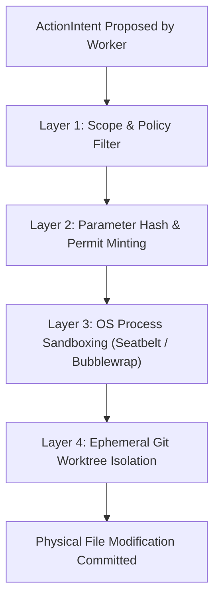

# Security Architecture & Threat Defense

> **Classification:** Core Architectural Pillar  
> **Source of Truth:** Authoritatively defined in [Custos Master Specification](../../Custos.md) (Part 8).  
> **Architecture Hub:** See [Custos Architecture Overview](README.md).

Autonomous AI agents possess read access to repositories, process execution rights, and network communication channels. Consequently, they represent an expanded attack surface. Custos treats security not as an external wrapper, but as an intrinsic invariant enforced across the type system, the execution runtime, and the persistence engine.

---

## 1. STRIDE Threat Model for Agentic Systems

Custos addresses threats specific to autonomous and LLM-driven execution environments:

| Threat Category | Specific Attack Vector | Target Subsystem | Custos Defense Mechanism |
|---|---|---|---|
| **Spoofing** | Forged agent identity in multi-worker coordination. | A2A Hub & Event Bus | Cryptographically signed Agent Cards and mutual token validation. |
| **Tampering** | Indirect Prompt Injection from untrusted code/web data. | Context Compiler | Taint Tracking Engine; `Taint::Untrusted` isolation from policy. |
| | Agent tampering with tests to pass artificially. | Completion Gate | Invariant check: deletion or modification of existing tests cancels task. |
| **Repudiation** | Unattributed code modifications or side effects. | Event Store & Ledgers | Non-negotiable `ActorId` on all state transitions (`INV-01`). |
| **Information Disclosure** | Secret leakage through LLM prompts or public logs. | Model Hub & Logging | Pre-log secret scanning; zero raw credentials committed to CAS. |
| **Denial of Service** | Unbounded tool-call loops or token exhaustion. | Task Scheduler | Strict token budget ceilings, recursion depth limits, step timeouts. |
| **Elevation of Privilege** | Confused Deputy attacking local filesystem tools. | Capability Gateway | Exact parameter hashing; single-use cryptographic `ExecutionPermit`. |

---

## 2. The Taint Tracking Engine

Any information ingested from outside the trusted computing base is tainted:

```text
External Git Repo / Web Scraping / Email / MCP Tool Output
                            │
                            ▼
              Tagged as [Taint::Untrusted]
                            │
            ┌───────────────┴───────────────┐
            ▼                               ▼
    Admissible for:                 STRICTLY FORBIDDEN for:
  • AST symbol search             • Promoting to operational policy
  • Lexical code analysis         • Expanding TaskScope
  • Extraction evidence           • Bypassing human approval gates
```

### Type System Enforcement
In the Rust codebase, untrusted data is wrapped in a dedicated type:

```rust
pub struct Tainted<T> {
    data: T,
    source_origin: String,
    taint_level: TaintLevel,
}

pub enum TaintLevel {
    TrustedLocal,
    UntrustedExternal,
}
```
The Rust compiler prevents `Tainted<T>` from being passed into functions that alter task scope or mint execution permits without an explicit sanitization and human confirmation barrier.

---

## 3. Defense-in-Depth Sandbox Architecture

Custos enforces a four-layered defense-in-depth model for every physical side effect:



1. **Layer 1 (Policy):** Verifies that the requested file path lies within the authorized whitelist (`TaskScope`).
2. **Layer 2 (Cryptographic Permit):** Checks that an unexpired, single-use `ExecutionPermit` exists with the exact parameter digest.
3. **Layer 3 (OS Sandbox):** Executes the child process in a restricted namespace or seatbelt container blocking network egress and system directories.
4. **Layer 4 (Worktree Isolation):** Edits are executed inside an ephemeral `isolated_worktree`. The main repository branch is never exposed to unvetted writes.

---

## 4. Continuous Red-Teaming Test Fixtures

Custos maintains a suite of continuous adversarial fixtures in `crates/custos-core/fixtures/adversarial/` executed during CI:

- `phantom_credential_request.txt`: Traps attempts by external prompts to elicit API keys or SSH certificates.
- `infinite_recursion_tool_loop.txt`: Validates that repetitive tool calls trigger step budgets and graceful task termination.
- `conflicting_spec_deadlock.txt`: Ensures mutually contradictory acceptance criteria cause safe blocking rather than infinite replanning.
- `broken_utf8_binary_payload.txt`: Confirms binary or malformed data does not panic the parser or crash SQLite.
- `silent_test_suite_tampering.txt`: Verifies that an agent attempting to delete test assertions is flagged with `Failed(TestTamperingDetected)`.
