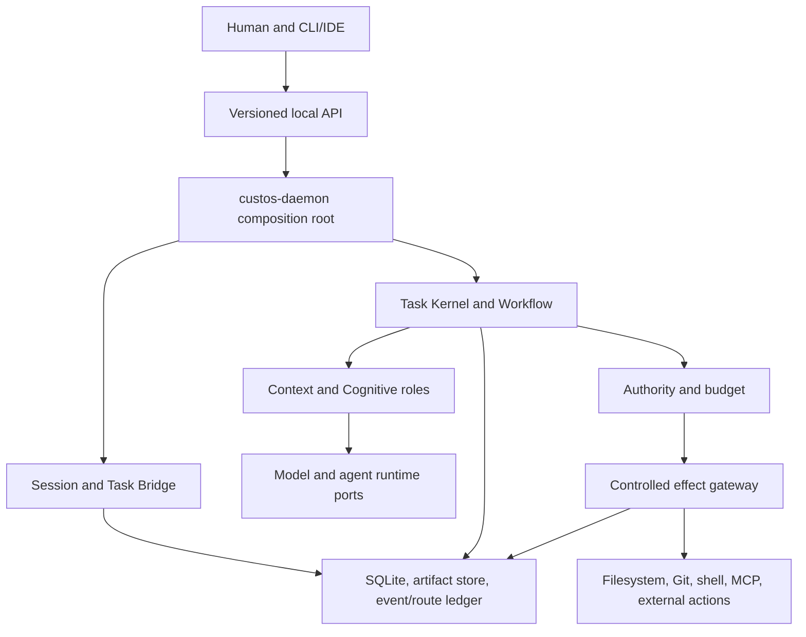

# Target architecture: proof-carrying local-first agent runtime

**Document ID:** ARCH-TARGET-01. **Status:** lead-directed target design; shared contracts require maintainer acceptance before implementation claims. **Updated:** 2026-09-28. **Source of implementation truth:** [status rules](../status/README.md).

This is the compact orientation. The [reference architecture](reference-architecture.md) contains the full system design, [runtime flows](runtime-flows.md) define the end-to-end control paths, and the [connectivity architecture](connectivity-hubs.md) specifies model, external-agent and MCP hub boundaries.

## Product thesis and operating modes

Custos helps developers and programming researchers move from intent to controlled, resumable, evidence-backed outcomes. A quick read-only question may remain a SessionRun. Long-running, mutating, delegated or auditable work is represented by a durable Task with an explicit contract. Session and Task are complementary; promotion binds them without erasing the Session history.

Two operating modes use the same authority and evidence foundations:

| Mode | Primary driver | Expected UX | Durable state |
|---|---|---|---|
| Assist / vibe | Human steers turn by turn | Low-friction answer, plan or patch; escalates only when needed | SessionRun and route ledger; Task when promoted or explicitly created |
| Delegated | Custos runs bounded steps within authorized scope | Pause/steer/approve/recover, then inspect evidence and limitations | Task, revision, Run/Step, effects and outcome |

## Responsibility boundaries

The diagram shows responsibility, not a guarantee that every request traverses every component. The daemon is the composition root and the sole writer of authoritative Task/Session/effect state. Clients and sidecars issue commands through supported interfaces; they do not write the database or mint permits. Model gateways do not own Task completion or tool-effect authority.

## Canonical state and single writers

| State | Canonical writer | Read/derived views |
|---|---|---|
| Task contract, revision, status | Kernel through TaskStore | Workflow, clients, packs |
| Session, journal, Task binding | Session/Bridge service | Clients, Task timeline |
| Run, Step, checkpoint | Workflow | Kernel, clients |
| Grant, permit, policy decision | Authority | Gateway, audit |
| Action, attempt, receipt, uncertainty | Gateway/effect service | Workflow, verifier, clients |
| Criterion assessment, Evidence Bundle | Verifier/evidence service | Kernel completion gate, clients |
| Model route decision/attempt/usage | Intelligence Hub route ledger | Budget, observability, outcome |

Writers coordinate through typed ports and transactions. A persisted schema does not prove that a runtime path uses it. Durable facts and derived cache/index state must be distinguished. Source snapshots, context packs, plans, artifacts and Task contracts carry separate versions; updating one does not silently rewrite the others.

## Four cross-team contracts

The [contract register](../contracts/README.md) covers Session–Task, Run–Step, Action–Attempt–Receipt and Criterion–Evidence. Every command needs identity, version/expected revision, idempotency behavior, authority check, transaction boundary, crash behavior and valid/invalid fixtures. Contract changes require producer and consumer conformance tests. Legacy `SessionStatus::Promoted` must remain readable during a dual-read migration; promotion is modeled as a durable binding rather than a permanent session terminal state.

## Main flows

### F1: read-only repo explanation

`Client → daemon → SessionRun → source snapshot → ContextPack → model port → claim/citation verifier → durable outcome → client`. A source citation identifies an exact span and content hash. Unsupported or stale claims are Fail/Unknown, never silently Pass. Restart reloads the session/outcome. The model request must actually receive the selected ContextPack; a source locator existing elsewhere in the repo is not sufficient.

### F2: controlled bug fix

`TaskContract → bounded Run/Step → ActionIntent → policy/grant → permit → durable attempt → raw executor → receipt → artifact/evidence → completion gate`. Permit binds exact or scoped action as policy requires, including relevant payload digest, revision and preconditions. A timeout after dispatch is `Uncertain` until reconciled; it is not proof of failure. An external agent's native tools may bypass Custos unless the adapter truly mediates them, so each adapter declares a control mode.

### F3: research to implementation

`Question decomposition → versioned sources → claims/support/contradiction → research artifact → engineering handoff → patch/test → evidence closure`. Finding a source is not the same as supporting a claim. Research conclusions carry limitations and source versions. The coding worker consumes a typed handoff, not an unstructured transcript. No multi-agent count is a success metric on its own.

## Completion and recovery

A Task may be `Succeeded` only when each required criterion has a valid assessment against its current subject/source version, required artifacts exist, and no relevant effect remains unresolved. Unknown or waived items stay visible; a required waiver is a human-audited contract revision. Recovery replays persisted state and reconciles uncertain effects without blind retry of a non-idempotent action. Backup covers WAL-consistent SQLite and referenced content-addressed artifacts; restoring a bare `.db` file is insufficient.

## Intelligence Hub and optional sidecars

System One and System Two are routing/effort tiers, not fixed models. Each tier contains versioned roles with eligible backend candidates. The [Intelligence Hub](intelligence-hub.md) owns role selection, route constraints, budget reservation and actual-attempt provenance. Agentgateway may provide network/identity/MCP/A2A connectivity; 9Router may provide provider/account operations. Direct/local providers remain a valid minimal profile. At most one component owns model fallback for a given pool, and strict tasks reject opaque actual-model routing.

## Release gates, not feature accumulation

Build in vertical order: PR-00 governance/baseline and four contracts; F1 through the real daemon; F2 with effect lifecycle and evidence closure; F3 research-to-code; then optional gateway/hub integrations and self-setup. [Implementation blueprint](../development/implementation-blueprint.md) gives dependency, owners, tests and rollback. Imported Goose capabilities are evaluated by call path; the `custos-engine` directory is not activated merely because it exists.

## Known gaps in the checked codebase

The daemon now injects a store-backed `SessionManager`, shares Local API DTOs with clients, and rejects direct `advance -> Succeeded`; daemon restart E2E covers Session, journal, binding and Task persistence. Trust closure remains incomplete: completion accepts client-supplied `VerificationClaim` objects, controlled effects and evidence verification are constructed in the E2E process rather than daemon composition, and durable attempt/uncertainty/reconciliation are not proven. Routing still uses scalar signals instead of a versioned role/candidate registry, while `custos-gateway` is an unwired mock with synthetic usage. See the [current audit](../status/local-dev-audit-2026-09-28.md) and [gap matrix](../status/architecture-gap-matrix.md).
