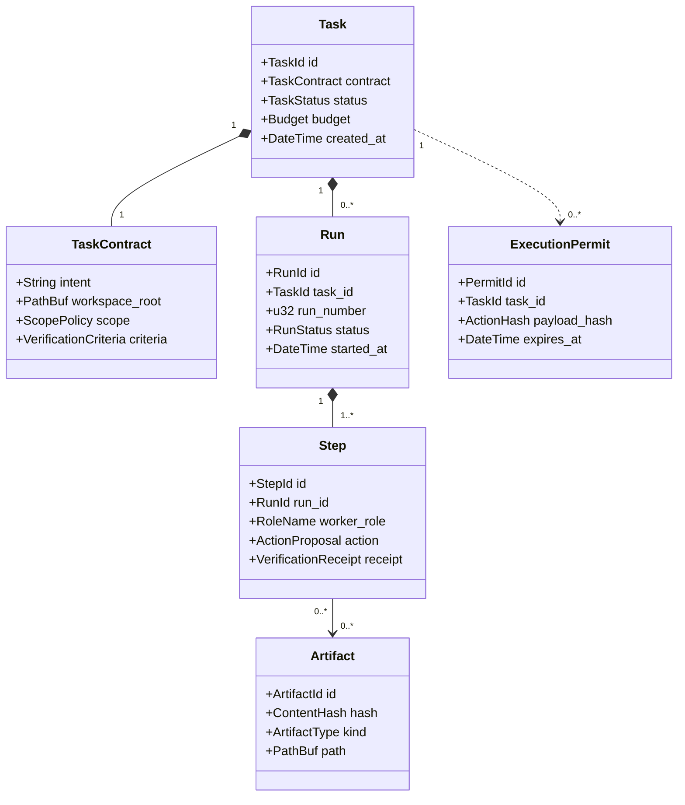
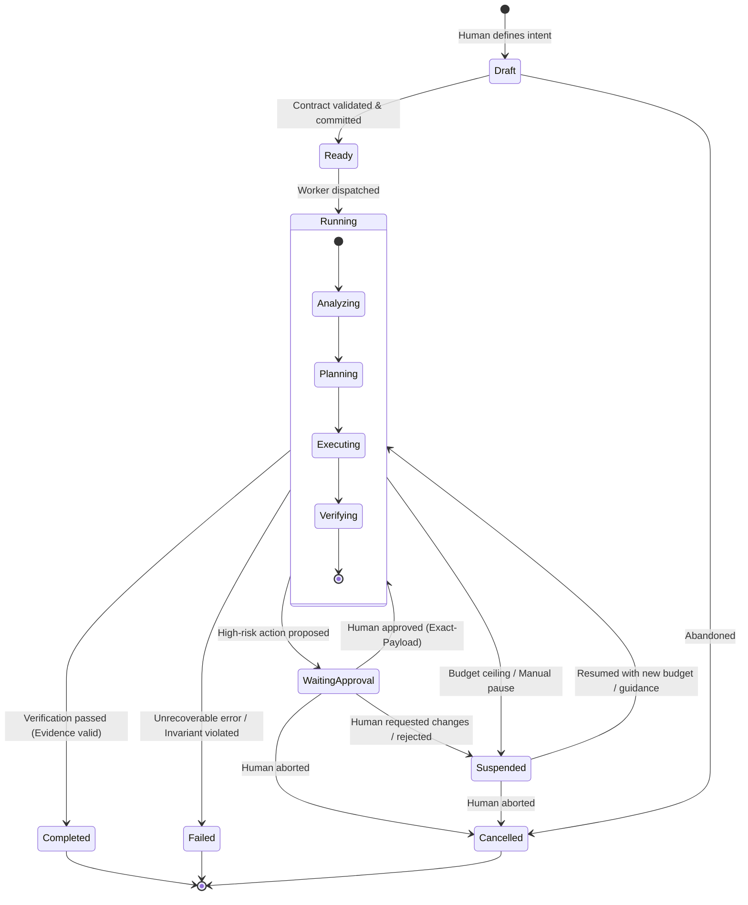
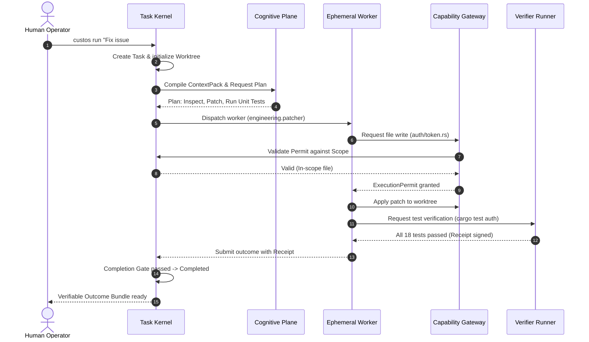

# Vòng Đời Task & Mô Hình Vận Hành (Task Lifecycle & Domain Model)

> **Status:** Canonical Baseline v4.0  
> **Source:** Phần III (§9), Phần VIII (§24-26) & Phần VI (§32) Canonical Specification

Đơn vị vận hành trung tâm của Custos là **Task**. Tài liệu này mô tả chi tiết mô hình thực thể miền (*Domain Model*), máy trạng thái hữu hạn (*Finite State Machine*), mô hình giao dịch và các kịch bản vận hành thực tế.

---

## 1. Mô Hình Miền Chuẩn Tắc (Canonical Domain Model)



---

## 2. Máy Trạng Thái Của Task (Task State Machine)

Trạng thái của một Task di chuyển qua các bước nghiêm ngặt được kiểm soát bởi Kernel:



### Bảng Chuyển Dịch Trạng Thái

| Từ trạng thái | Sang trạng thái | Điều kiện kích hoạt (Trigger & Guard) |
|---|---|---|
| `Draft` | `Ready` | Task Contract hợp lệ, scope tồn tại, budget > 0. |
| `Ready` | `Running` | Kernel cấp phát worker và khởi tạo Git worktree riêng. |
| `Running` | `WaitingApproval` | Đề xuất hành động có rủi ro cao (sửa file ngoài scope, chạy lệnh shell có side effect). |
| `WaitingApproval` | `Running` | Con người ký duyệt `ExecutionPermit` cho đúng payload đó. |
| `Running` | `Suspended` | Chạm hạn mức budget, crash hệ thống, hoặc người dùng yêu cầu tạm dừng (`custos pause`). |
| `Suspended` | `Running` | Người dùng tiếp tục (`custos resume`), trạng thái và worktree được đối soát thành công. |
| `Running` | `Completed` | Vượt qua cổng kiểm tra chứng cứ (*Completion Gate*): toàn bộ test và linters quy định đều pass. |
| `Running` | `Failed` | Lỗi không thể khắc phục sau tối đa số lần retry, hoặc vi phạm nghiêm trọng System Invariant. |

---

## 3. Mô Hình Giao Dịch & Sự Kiện (Transaction Pattern)

Mỗi bước thực thi (`Step`) trong Custos tuân theo quy trình giao dịch 6 giai đoạn đảm bảo tính nguyên tử:

```text
1. PROPOSE  ───> Worker đề xuất hành động kèm lý do và chi phí dự kiến.
2. VALIDATE ───> System One kiểm tra bất biến; Kernel kiểm tra ngân sách trần.
3. AUTHORIZE───> Cấp ExecutionPermit (hoặc dừng chờ Human Approval nếu rủi ro).
4. EXECUTE  ───> Thực thi trong Sandbox; lưu trữ artifacts vào CAS.
5. VERIFY   ───> Bộ kiểm tra độc lập (Verifier) chạy test và sinh ra Receipt.
6. COMMIT   ───> Ghi Event vào SQLite Event Store và quyết toán ngân sách thực tế.
```

---

## 4. Lược Đồ Cơ Sở Dữ Liệu SQLite (Persistence DDL)

```sql
-- Bảng quản lý Task
CREATE TABLE tasks (
    task_id TEXT PRIMARY KEY,
    title TEXT NOT NULL,
    intent TEXT NOT NULL,
    status TEXT NOT NULL, -- 'draft', 'ready', 'running', 'waiting_approval', 'suspended', 'completed', 'failed', 'cancelled'
    contract_json TEXT NOT NULL,
    budget_token_limit INTEGER NOT NULL,
    budget_usd_limit REAL NOT NULL,
    tokens_consumed INTEGER DEFAULT 0,
    cost_usd_consumed REAL DEFAULT 0.0,
    active_worktree_path TEXT,
    created_at TEXT NOT NULL,
    updated_at TEXT NOT NULL
);

-- Bảng sổ cái sự kiện bất biến (Event Store)
CREATE TABLE task_events (
    event_id INTEGER PRIMARY KEY AUTOINCREMENT,
    task_id TEXT NOT NULL REFERENCES tasks(task_id),
    sequence_number INTEGER NOT NULL,
    event_type TEXT NOT NULL, -- e.g., 'TaskCreated', 'StepStarted', 'PermitIssued', 'StepCommitted'
    payload_json TEXT NOT NULL,
    occurred_at TEXT NOT NULL,
    UNIQUE(task_id, sequence_number)
);

-- Bảng lưu trữ giấy phép thực thi
CREATE TABLE execution_permits (
    permit_id TEXT PRIMARY KEY,
    task_id TEXT NOT NULL REFERENCES tasks(task_id),
    action_type TEXT NOT NULL,
    payload_hash TEXT NOT NULL,
    granted_by TEXT NOT NULL, -- 'system_policy' hoặc 'human_exact_approval'
    expires_at TEXT NOT NULL,
    consumed_at TEXT
);
```

---

## 5. Các Kịch Bản Vận Hành Thực Tế (Runtime Scenarios)

### Kịch bản 1: Sửa Lỗi Mã Nguồn Tự Động (Standard Bug-Fix)


### Kịch bản 2: Dừng Chờ Phê Duyệt Khi Gặp Rủi Ro Cao
Khi worker đề xuất sửa đổi tệp cấu hình hệ thống hoặc file ngoài scope đã cam kết:
1. `Capability Gateway` phát hiện payload tác động vượt scope.
2. Chuyển Task sang `WaitingApproval`.
3. Gửi thông báo tới `CLI/VS Code` kèm diff chính xác (`Exact Payload`).
4. Con người kiểm tra diff, bấm `Approve`.
5. Kernel phát hành `ExecutionPermit` dùng 1 lần, task tiếp tục chạy an toàn.
