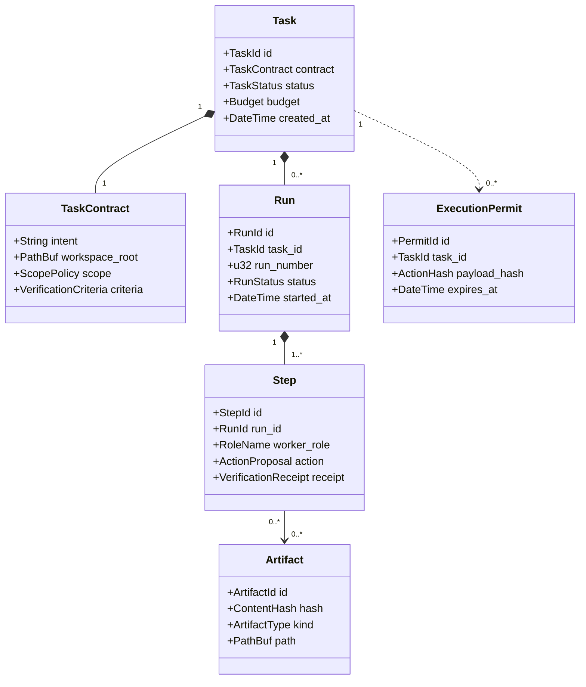
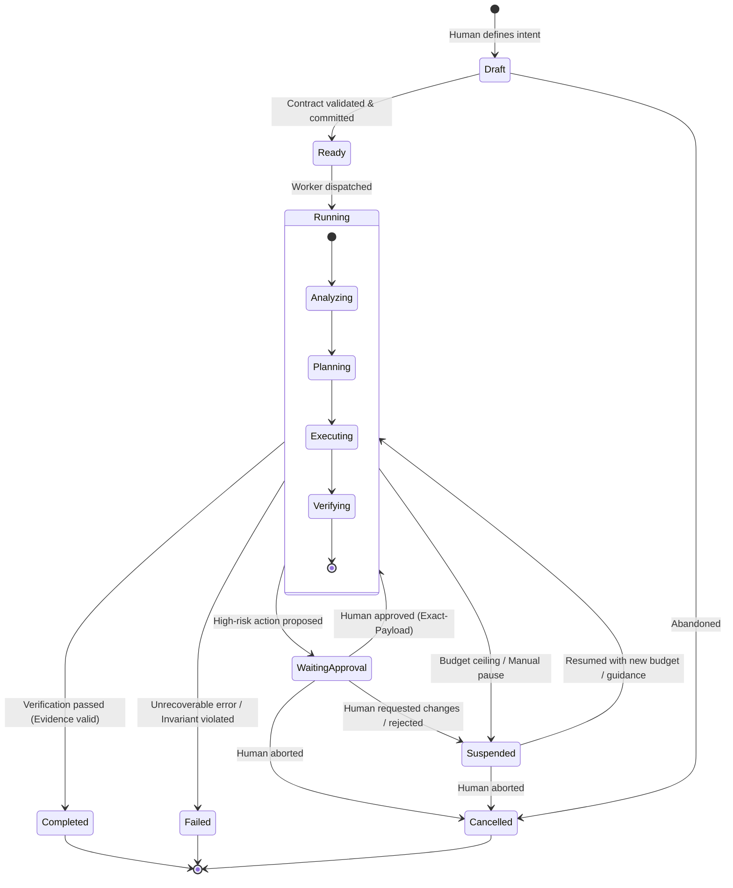
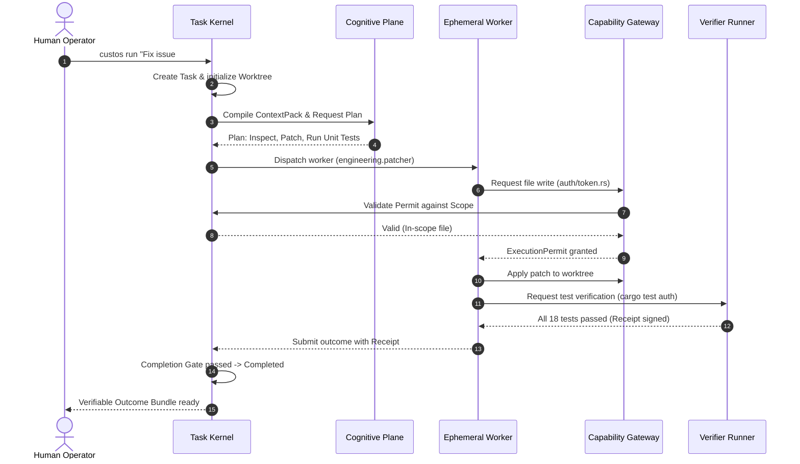

# Task Lifecycle & Domain Model

> **Status:** Canonical Baseline v4.0  
> **Source:** Part III (§9), Part VIII (§24-26) & Part VI (§32) Canonical Specification

The fundamental operational unit of Custos is the **Task**. This document details the Canonical Domain Model, the Finite State Machine, transaction patterns, persistence schemas, and real-world runtime execution scenarios.

---

## 1. Canonical Domain Model



---

## 2. Task State Machine

Task transitions follow a strictly verified state machine enforced by the Task Kernel:



### State Transition Matrix

| From State | To State | Trigger & Guard Conditions |
|---|---|---|
| `Draft` | `Ready` | Valid Task Contract committed, scope exists, budget > 0. |
| `Ready` | `Running` | Kernel assigns worker role and provisions isolated Git worktree. |
| `Running` | `WaitingApproval` | High-risk action proposed (out-of-scope mutation, side-effecting shell command). |
| `WaitingApproval` | `Running` | Human signs off on the `ExecutionPermit` for the exact payload hash. |
| `Running` | `Suspended` | Budget limit reached, process termination, or user pause command (`custos pause`). |
| `Suspended` | `Running` | User resumes task (`custos resume`), state and worktree reconciled successfully. |
| `Running` | `Completed` | Completion Gate passed: all required tests, linters, and verification checks succeed. |
| `Running` | `Failed` | Max retries exceeded without recovery, or critical System Invariant breached. |

---

## 3. Six-Phase Transaction Pattern

Every operational step (`Step`) in Custos executes through a 6-phase atomic transaction:

```text
1. PROPOSE  ---> Worker proposes action with rationale and projected cost.
2. VALIDATE ---> System One verifies invariants; Kernel checks remaining budget ceiling.
3. AUTHORIZE---> Issue ExecutionPermit (or pause for Human Approval if high-risk).
4. EXECUTE  ---> Execute action inside Sandbox; persist output artifacts to CAS.
5. VERIFY   ---> Independent Verifier runs tests and produces cryptographic Receipt.
6. COMMIT   ---> Append event to SQLite Event Store and reconcile actual token budget.
```

---

## 4. SQLite Persistence Schema (DDL)

```sql
-- Tasks table
CREATE TABLE tasks (
    task_id TEXT PRIMARY KEY,
    title TEXT NOT NULL,
    intent TEXT NOT NULL,
    status TEXT NOT NULL, -- 'draft', 'ready', 'running', 'waiting_approval', 'suspended', 'completed', 'failed', 'cancelled'
    contract_json TEXT NOT NULL,
    budget_token_limit INTEGER NOT NULL,
    budget_usd_limit REAL NOT NULL,
    tokens_consumed INTEGER DEFAULT 0,
    cost_usd_consumed REAL DEFAULT 0.0,
    active_worktree_path TEXT,
    created_at TEXT NOT NULL,
    updated_at TEXT NOT NULL
);

-- Immutable Event Store
CREATE TABLE task_events (
    event_id INTEGER PRIMARY KEY AUTOINCREMENT,
    task_id TEXT NOT NULL REFERENCES tasks(task_id),
    sequence_number INTEGER NOT NULL,
    event_type TEXT NOT NULL, -- e.g., 'TaskCreated', 'StepStarted', 'PermitIssued', 'StepCommitted'
    payload_json TEXT NOT NULL,
    occurred_at TEXT NOT NULL,
    UNIQUE(task_id, sequence_number)
);

-- Execution Permits table
CREATE TABLE execution_permits (
    permit_id TEXT PRIMARY KEY,
    task_id TEXT NOT NULL REFERENCES tasks(task_id),
    action_type TEXT NOT NULL,
    payload_hash TEXT NOT NULL,
    granted_by TEXT NOT NULL, -- 'system_policy' or 'human_exact_approval'
    expires_at TEXT NOT NULL,
    consumed_at TEXT
);
```

---

## 5. Runtime Execution Scenarios

### Scenario 1: Automated Bug-Fix Workflow


### Scenario 2: High-Risk Human Approval Escalation
When a worker proposes mutating system configuration or modifying files outside the committed scope:
1. `Capability Gateway` detects payload scope violation or high-risk classification.
2. Kernel transitions Task to `WaitingApproval`.
3. Dispatches notification to `CLI / VS Code` containing the exact payload diff.
4. Human principal reviews the diff and approves via CLI command or IDE action.
5. Kernel issues a one-time `ExecutionPermit` bound to the payload hash; execution resumes safely.
