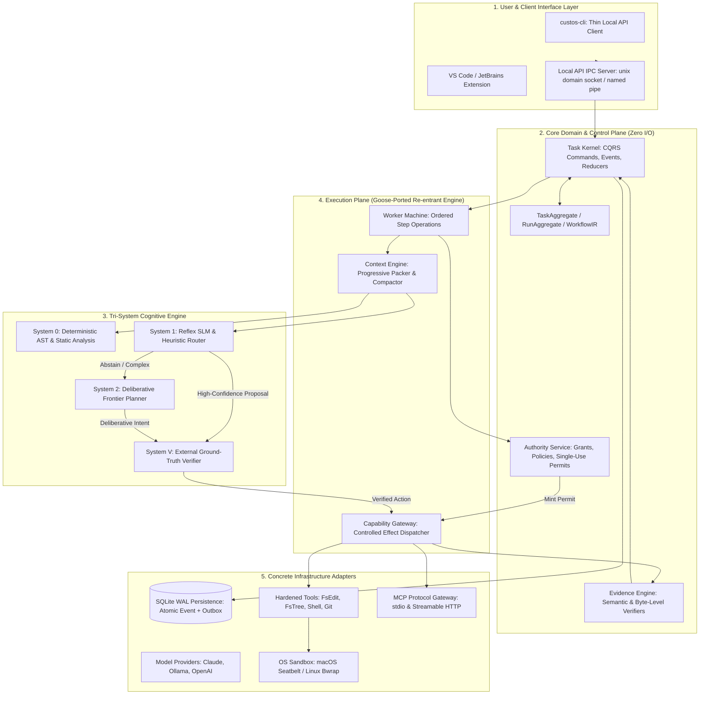
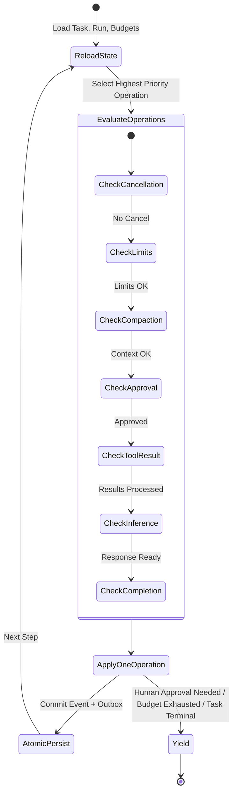

# Custos New Architecture: Master Specification

## 1. Architectural Philosophy and System Topology

Custos New is a local-first, human-governed work runtime for engineering, research, and personal assistance tasks. It is architected as a **hexagonal modular monolith** with strict dependency inversion, domain-driven boundaries, and an immutable CQRS state machine.

Its fundamental unit of truth is a **durable Task**, not a chat session. Models propose; the Kernel controls state; Authority governs permission; the Gateway mediates effects; and Evidence verifies completion.



---

## 2. Consolidated Target Repository Layout

Custos New eliminates micro-crate fragmentation, consolidating the codebase into cohesive functional packages:

```text
Custos_new/
├── Cargo.toml                   # Independent root workspace manifest
├── apps/
│   ├── custosd/                 # Composition root, IPC daemon, process supervisor
│   └── custos-cli/              # Thin terminal client (zero business logic)
├── crates/
│   ├── domain/                  # Pure entities: Task, Run, Action, Evidence, Budget, ID
│   ├── application/             # Application services, transaction orchestration, IPC
│   ├── task-kernel/             # CQRS event store, commands, reducers, projections
│   ├── workflow-runtime/        # Re-entrant worker machine, leases, recovery, DAG
│   ├── cognitive-runtime/       # S0/S1/S2 routing, dual-process arbitration, prompt templates
│   ├── context-engine/          # Tree-sitter AST scanner, tool-pair compactor, context packs
│   ├── authority/               # Policy evaluation, grant management, permit minting
│   ├── capability-gateway/      # Sole dispatch boundary, sandbox enforcement, receipts
│   ├── evidence/                # Byte-exact locator matcher, semantic claim support evaluator
│   ├── provider-port/           # Provider-neutral model & streaming traits (ModelPort)
│   ├── protocol-port/           # MCP, ACP, and external agent interoperability traits
│   └── observability/           # Structured tracing, metrics, audit logs
├── adapters/
│   ├── persistence-sqlite/      # SQLite WAL, connection pooling, SQL migrations
│   ├── providers/
│   │   ├── claude/              # Anthropic Messages API client, SSE stream parser
│   │   ├── local-model/         # Ollama HTTP client with Qwen XML-tool fallback
│   │   └── fake/                # Deterministic in-memory test provider
│   ├── tools/                   # FsRead, FsEdit, FsWrite, FsTree, ShellTool
│   ├── protocols/mcp/           # MCP stdio & Streamable HTTP clients
│   └── sandboxes/               # macOS Seatbelt profiles, Linux Bubblewrap
├── packs/
│   ├── engineering/             # Bug reproduction, AST localization, patch verifier
│   ├── research/                # Citation extraction, contradiction auditor, PDF parser
│   └── assistant/               # Draft-first flow, identity resolver, external actions
└── schemas/                     # Canonical JSON schemas for Task, Action, Evidence
```

---

## 3. The Tri-System Cognitive Architecture (S0, S1, S2, SV)

To solve the dual problems of **uncontrolled token costs** and **cognitive collapse / hallucinated self-correction**, Custos New organizes intelligence into four formal systems:

| Layer | Implementation | Unit Cost | Latency | Primary Responsibilities |
|---|---|---|---|---|
| **System 0 (Deterministic)** | Rust binary, Tree-sitter, Regex, SQLite FTS5 | **$0.00** | < 5ms | Path validation, AST symbol parsing, schema checks, git diff computation, file reading. |
| **System 1 (Reflex / Fast)** | Small local model (Ollama / Qwen2.5-Coder:7b) or cheap SLM (Claude 3.5 Haiku) | **~$0.0001** | ~200ms | Query classification, context relevance ranking, tool-result summarization, simple routine edits. Supports explicit `Abstain`. |
| **System 2 (Deliberation)** | Frontier reasoning model (Claude 3.5 Sonnet / o3 / DeepSeek-R1) | **~$0.015** | 3–10s | Multi-step planning, complex multi-file bug localization, architecture design, contradiction resolution. |
| **System V (External Verifier)** | External non-LLM oracles (`rustc`, `cargo test`, `clippy`, SHA-256 verifier) | **$0.00** | Process bound | Objective truth verification. Breaks cognitive deadlocks by injecting hard compiler/test errors into the prompt. |

### The Unified Execution & Escalation Loop

1. **Deterministic Filter (S0)**:
   - System 0 checks hard constraints (privacy egress, active provider pins, token budget limits).
   - If the task step can be solved deterministically (e.g. `fs.tree`, symbol lookup), it executes immediately with zero token spend.
2. **Fast Evaluation (S1)**:
   - System 1 evaluates the step.
   - If confidence $\ge \tau$ (default $\tau = 0.85$) and risk is `Low`/`Medium`, S1 proposes an `ActionIntent`.
   - The intent is dry-run through System V. If verified, it dispatches.
3. **Escalation Trigger (S2)**:
   - If S1 outputs `Abstain`, OR if System V rejects S1's proposal, OR if the action risk is `High`/`Critical`, the runtime escalates to System 2.
   - S2 receives a structured `DeliberationRequest` containing the exact `GroundTruthError` from System V.
4. **Deliberative Commitment**:
   - S2 produces a revised action or DAG plan.
   - S2's proposal is validated by System V before execution. S2 cannot bypass the verifier.

---

## 4. Re-Entrant Worker Operation Machine (Goose-Ported)

Custos New adopts the robust operational loop from upstream Goose (`goose-agent/src/machine.rs`), replacing Goose's in-memory session model with **Task-owned durable SQLite WAL persistence**.



### Operational Invariants

1. **Single Operation Atomicity**: The worker machine evaluates operations in fixed priority order and applies **at most one operation per cycle**.
2. **Immediate Persistence**: After applying an operation, all side effects, projection updates, and token reservations are committed to SQLite WAL before selecting the next operation.
3. **Re-entrant Resumption**: In case of process crash (SIGKILL), the daemon recovers by loading the latest event stream and resuming the exact next uncommitted operation.
4. **Duplicate Tool Suppression**: Duplicate tool calls within the same plan step are rejected before dispatch.

---

## 5. Zero-Trust Authority and Capability Gateway

No tool, script, or external network call may execute without passing through the **Deterministic Gate**.

### The Action Lifecycle State Machine

```text
ActionIntent (Proposed by S1/S2)
      │
      ▼
   AuthorityService (Evaluates Grant, Policy, Risk)
      │
      ├── [Denied] ──► ActionRejected (Domain Error)
      │
      ▼ [Approved]
   ExecutionPermit (Single-use, Content-bound, Expiring)
      │
      ▼
   CapabilityGateway (Sandbox Enforcement: Seatbelt / Bwrap)
      │
      ├── [Success] ──► Receipt (Exit code, stdout, diff hash)
      ├── [Crash / Timeout] ──► UNCERTAIN (Requires reconciliation)
      └── [Failed] ──► GroundTruthError (Fed into S2 verifier)
```

### Safety Rules

- **Zero Blind Retries**: If an action enters `UNCERTAIN` state due to a timeout, `allows_blind_retry()` is false. The system must query idempotency records before re-dispatching.
- **Path Traversal Protection**: Symlink resolution ensures no file operation can escape the declared workspace root.
- **Environment Sanitization**: All API keys and secrets are scrubbed from child process environments before executing shell commands.

---

## 6. Evidence Engine and Acceptance Criteria Closure

A Task in Custos New CANNOT transition to `Succeeded` because a language model generated text saying "I have finished the work".

Completion requires an **`EvidenceBundle`** satisfying all acceptance criteria defined in the `TaskContract`:

1. **Exit Code Verifier**: Build or test suite exited with code `0`.
2. **Byte-Exact Locator**: Code changes match the targeted lines, verified by SHA-256 content hashes.
3. **Test Integrity Guarantee**: The test suite was not tampered with (test file hashes match the baseline manifest).
4. **Semantic Citation Support**: For research and assistant tasks, all factual claims are linked to specific byte offsets in versioned source documents, verified by the `SemanticSupportEvaluator`.

---

## 7. The Three Domain Packs

1. **Engineering Pack**:
   - Focus: Bug reproduction, root-cause localization, minimal patch synthesis, targeted regression testing.
   - Invariant: Worktree modifications occur on isolated Git branches; stale bases are rejected.
2. **Research Pack**:
   - Focus: Literature search, multi-document comparison, contradiction detection, reading cards, citation mapping.
   - Invariant: Ghost citations and ungrounded URLs are blocked by the byte-exact locator verifier.
3. **Assistant Pack**:
   - Focus: Communication drafting, calendar scheduling, information retrieval, contact disambiguation.
   - Invariant: External effects (email sending, calendar invites) require Draft-First flow and exact-payload human authorization.

---

## 8. Dependency and Isolation Rules

Dependencies strictly point inward:
```text
apps (custosd, custos-cli)
  └─► application
        └─► domain (pure contracts, zero I/O)

workflow-runtime / cognitive-runtime / capability-gateway
  └─► domain + ports

adapters (persistence, providers, tools, protocols)
  └─► ports + domain
```

- No adapter imports another adapter directly.
- No model provider interacts directly with the filesystem or shell.
- MCP is an integration boundary, never the internal state bus.
