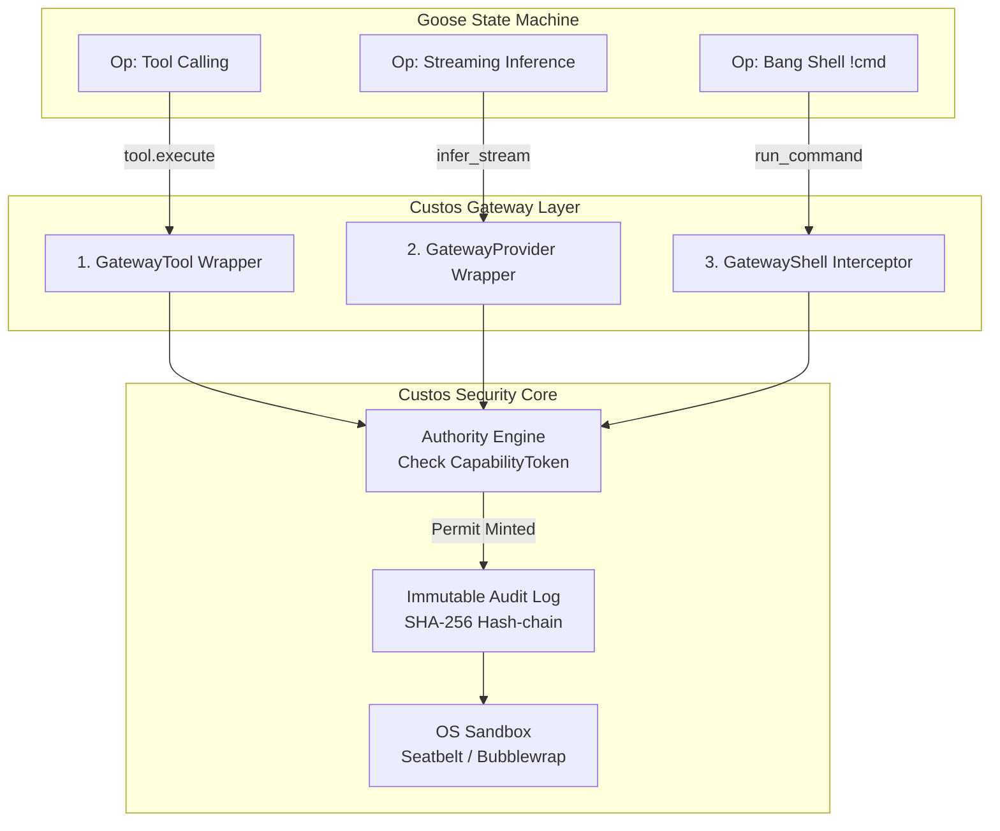

# CUSTOS OS (SOVEREIGN ARCHITECTURE) — BẢN THIẾT KẾ & KẾ HOẠCH HÀNH ĐỘNG TỔNG THỂ
## The Sovereign Agentic Operating System · 27 Crates · ~180k Rust LOC · 3 Kỹ sư · 6–9 Tháng
> **Tên định danh chính thức của kiến trúc:** **`CUSTOS SOVEREIGN ARCHITECTURE`** (hoặc **`Custos OS Kernel v4.0`**)
> **Triết lý nền tảng:** **Goose Execution Fabric** (suy luận, công cụ, providers) được bọc kín và kiểm soát 100% bởi **Custos Sovereign Kernel** (Zero-trust Gate, Capability Token, Immutable Evidence).
> **Ngày phê chuẩn:** 26/09/2026.

---

## MỤC LỤC
1. [Phần 1: Đính Chính Dữ Liệu Kỹ Thuật (LOC Reality Check)](#phần-1-đính-chính-dữ-liệu-kỹ-thuật-loc-reality-check)
2. [Phần 2: Giải Pháp Dứt Điểm Cho 10 Lỗ Hổng Kiến Trúc](#phần-2-giải-pháp-dứt-điểm-cho-10-lỗ-hổng-kiến-trúc)
3. [Phần 3: Cấu Trúc Danh Mục 27 Crates Chuẩn Mực](#phần-3-cấu-trúc-danh-mục-27-crates-chuẩn-mực)
4. [Phần 4: Thiết Kế Triple Gateway Wrap (Choke Point Toàn Diện)](#phần-4-thiết-kế-triple-gateway-wrap-choke-point-toàn-diện)
5. [Phần 5: Chi Tiết Module Mới: Custos-Session & Custos-Bridge](#phần-5-chi-tiết-module-mới-custos-session--custos-bridge)
6. [Phần 6: Quy Cách Cắt Gọt (Goose Engine Trim Specification)](#phần-6-quy-cách-cắt-gọt-goose-engine-trim-specification)
7. [Phần 7: Phân Công 3 Kỹ Sư & Lộ Trình 15 Phase (P0 – P14)](#phần-7-phân-công-3-kỹ-sư--lộ-trình-15-phase-p0--p14)
8. [Phần 8: Kế Hoạch Triển Khai Thực Chiến Từng Bước](#phần-8-kế-hoạch-triển-khai-thực-chiến-từng-bước)

---

## PHẦN 1: ĐÍNH CHÍNH DỮ LIỆU KỸ THUẬT (LOC REALITY CHECK)

Sau khi quét trực tiếp hệ thống tệp bằng engine Nexus, chúng ta đã làm sáng tỏ hoàn toàn nghịch lý về số dòng code:

### 1.1. Giải mã con số 276k LOC của `goose-provider-types`
- **Mã nguồn Rust thực tế:** **36 files · 30,655 dòng code Rust**!
- **Dữ liệu tĩnh (Static Data):** **3 tệp `.json` chứa 245,529 dòng** (Đây là bảng catalog dữ liệu định nghĩa các models, pricing, và API schema specifications được nhúng vào crate).
- **Kết luận:** Crate này hoàn toàn lành mạnh, chỉ có ~30k dòng Rust, hoàn toàn không phải maintain 276k dòng Rust như lo ngại ban đầu!

### 1.2. Giải mã con số 320k LOC của `goose-engine` (`crates/goose`)
- **Mã nguồn Rust trong `src/`:** ~175,000 dòng code Rust.
- **Tệp dữ liệu JSON/YAML nhúng:** ~125,000 dòng.
- **Phân bổ Rust code:**
  - `agents/`: 51,316 LOC (chứa state machine và tool integration).
  - `providers/`: 32,948 LOC (*trùng lặp hoàn toàn với `goose-providers`*).
  - `acp/`: 24,448 LOC (*không cần vì `custos-daemon` làm ACP server*).
  - `session/`: 10,309 LOC (*bỏ, thay bằng `custos-session` 1,500 LOC*).
  - `config/`: 7,355 LOC.
  - `recipe/`: 4,847 LOC (*bỏ, chuyển sang `custos-workflow`*).
  - `live_voice/` & `dictation/`: 5,070 LOC (*bỏ qua cho MVP*).

### 1.3. Con số thực tế mà team 3 người cần làm chủ
| Thành phần | LOC Rust thực tế | Ghi chú |
| :--- | :--- | :--- |
| `goose-provider-types` (chuyển sang `core/`) | ~30,600 LOC | Single source of truth cho model types |
| `goose-engine` (sau khi trim 7 subdirectories) | ~55,000 LOC | Giữ `agents/state_machine`, `config`, `tracing` |
| `goose-providers` (15+ LLM integrations) | ~18,500 LOC | Giữ nguyên khối |
| `goose-mcp` (MCP transport client/server) | ~17,300 LOC | Giữ nguyên khối |
| `custos-*` (Security, Cognitive, Context, Workflow, Kernel, Domain, Persistence) | ~50,000 LOC | Kế thừa từ Custos v4 |
| Viết mới (`custos-session`, `custos-bridge`, Triple Gateway) | ~4,500 LOC | Code viết mới tinh gọn |
| 3 Domain Packs (`engineering`, `research`, `assistant`) | ~8,000 LOC | Khung logic nghiệp vụ |
| **TỔNG LƯỢNG RUST THỰC TẾ** | **~184,000 LOC** | **CỰC KỲ KHẢ THI cho team 3 người trong 6–9 tháng!** |

---

## PHẦN 2: GIẢI PHÁP DỨT ĐIỂM CHO 10 LỖ HỔNG KIẾN TRÚC

```
┌────────────────────────────────────────────────────────────────────────┐
│             BẢN QUYẾT ĐỊNH GIẢI QUYẾT 10 LỖ HỔNG (ADR-MASTER)         │
├────────────────────────────────────────────────────────────────────────┤
│ 1. LOC Provider-types: Đính chính 30.6k Rust LOC + 245k JSON Catalog.   │
│ 2. Tổng LOC Thực tế: ~184k Rust LOC (Không phải 500k hay 700k).        │
│ 3. Trim Goose-engine: Cắt bỏ dứt khoát 7 subdirectories (~120k LOC).   │
│ 4. Choke Point: Mở rộng Triple Gateway (Tool + Provider + Shell).     │
│ 5. Session Manager: Xóa session/ trong Goose, viết mới custos-session. │
│ 6. Agent Loop: Chọn dứt khoát Loop 2 (agents/state_machine/).         │
│ 7. Tool Interface: Khai báo chuẩn ModelPort & ToolPort trong SDK.      │
│ 8. ACP Server: Duy nhất custos-daemon mở port 3282, xóa goose-acp.rs.  │
│ 9. Recipe Engine: Duy nhất custos-workflow xử lý YAML kịch bản.        │
│ 10. Streaming Inference: Bọc qua GatewayProvider để kiểm duyệt Egress.  │
└────────────────────────────────────────────────────────────────────────┘
```

---

## PHẦN 3: CẤU TRÚC DANH MỤC 27 CRATES CHUẨN MỰC

```
Custos_new/
├── Cargo.toml                              ← Workspace root
│
├── crates/
│   ├── app/                                [2 Crates]
│   │   ├── custos-daemon/                  ← [KEEP] Daemon duy nhất (IPC, ACP server, Lifecycle)
│   │   └── custos-cli/                     ← [KEEP] CLI duy nhất (Interactive REPL, Task launcher)
│   │
│   ├── runtime/                            [6 Crates]
│   │   ├── custos-security/                ← [KEEP] Authority + Gateway + Evidence + Sandbox
│   │   ├── custos-cognitive/               ← [KEEP] S1 fast rules + S2 deliberation + RDC
│   │   ├── custos-context/                 ← [KEEP] Context Compiler + 5-tier Memory + Compaction
│   │   ├── custos-workflow/                ← [KEEP] Recipe engine + Task lease + Outbox
│   │   ├── custos-session/                 ← [VIẾT MỚI] Interactive Session runtime (~1,500 LOC)
│   │   └── goose-agent/                    ← [TRIMMED] Agent State Machine loop từ Goose (~55k LOC)
│   │
│   ├── core/                               [5 Crates]
│   │   ├── custos-domain/                  ← [KEEP+EXTEND] Entities: Task + Session + Capability
│   │   ├── custos-kernel/                  ← [KEEP+EXTEND] Task FSM + Session FSM
│   │   ├── custos-bridge/                  ← [VIẾT MỚI] Promote + Attach + Steer bridge (~1,800 LOC)
│   │   ├── custos-provider-sdk/            ← [KEEP+EXTEND] ModelPort & ToolPort traits
│   │   └── goose-provider-types/           ← [MOVE TO CORE] Single source of truth for model types
│   │
│   ├── adapters/                           [9 Crates]
│   │   ├── providers/
│   │   │   ├── goose-providers/            ← [KEEP] 15+ LLM Provider implementations
│   │   │   ├── custos-provider-claude/     ← [KEEP] Thin adapter wrapper
│   │   │   ├── custos-provider-openai/     ← [KEEP] Thin adapter wrapper
│   │   │   ├── custos-provider-ollama/     ← [KEEP] Local inference wrapper
│   │   │   └── custos-provider-fake/       ← [KEEP] Testing mock provider
│   │   ├── mcp/
│   │   │   ├── goose-mcp/                  ← [KEEP] Model Context Protocol transport
│   │   │   └── custos-adapters-mcp/        ← [KEEP] Thin wrapper bọc Capability check
│   │   └── judgments/
│   │       └── custos-judgment/            ← [MERGED] Hợp nhất rules + ONNX + JEV (~600 LOC)
│   │
│   ├── infrastructure/                     [1 Crate]
│   │   └── custos-persistence/             ← [KEEP+EXTEND] SQLite WAL, CAS, Session & Task tables
│   │
│   └── packs/                              [3 Crates]
│       ├── custos-pack-engineering/        ← [KEEP] AST search, git, code review, test runner
│       ├── custos-pack-research/           ← [KEEP] Citation verifier, paper reader, claim extractor
│       └── custos-pack-assistant/          ← [KEEP] Workspace connectors, triage, daily workflows
│
├── tests/                                  [4 Test Suites]
│   ├── custos-tests-contract/              ← Contract verification tests
│   ├── custos-tests-e2e/                   ← End-to-end integration tests
│   ├── goose-test/                         ← Functional tests
│   └── goose-test-support/                 ← Mocks & synthetic recording fixtures
│
├── workflow_recipes/                       ← Kịch bản tự động hóa YAML
├── evals/                                  ← Model benchmarks (Harbor harness)
└── schemas/                                ← JSON schemas thống nhất
```

---

## PHẦN 4: THIẾT KẾ TRIPLE GATEWAY WRAP (CHOKE POINT TOÀN DIỆN)

Để đảm bảo tuyệt đối không có bất kỳ hành vi side-effect hoặc network egress nào qua mặt được kiểm soát, chúng ta thiết lập **3 lớp chắn Gateway (Triple Wrap)**:



### 4.1. Wrapper 1: `GatewayTool` (Kiểm soát Tool Execution)
```rust
pub struct GatewayTool {
    inner: Arc<dyn ToolPort>,
    gateway: Arc<CapabilityGateway>,
    authority: Arc<AuthorityEngine>,
    task_id: TaskId,
    session_id: Option<SessionId>,
}

#[async_trait]
impl ToolPort for GatewayTool {
    async fn execute(&self, input: ToolInput) -> Result<ToolOutput> {
        let intent = ActionIntent::Tool {
            task_id: self.task_id,
            action: self.inner.descriptor(&input),
            payload_hash: hash_sha256(&input),
        };
        let permit = self.authority.authorize(&intent).await?;
        let receipt = self.gateway.dispatch(intent, permit, || self.inner.execute(input)).await?;
        Ok(ToolOutput::from_receipt(receipt))
    }
}
```

### 4.2. Wrapper 2: `GatewayProvider` (Kiểm soát Network Egress & Privacy)
```rust
pub struct GatewayProvider {
    inner: Arc<dyn ModelPort>,
    gateway: Arc<CapabilityGateway>,
    authority: Arc<AuthorityEngine>,
    task_id: TaskId,
}

#[async_trait]
impl ModelPort for GatewayProvider {
    async fn infer_stream(&self, req: InferenceRequest) -> Result<BoxStream<ProviderEvent>> {
        // Invariant I7: Kiểm duyệt rò rỉ bí mật trước khi gửi ra ngoài
        let sanitized_req = self.gateway.sanitize_egress(req)?;
        let intent = ActionIntent::Inference {
            provider: self.inner.id(),
            context_hash: hash_sha256(&sanitized_req.messages),
            estimated_tokens: sanitized_req.estimated_tokens(),
        };
        let permit = self.authority.authorize_egress(&intent).await?;
        self.gateway.record_egress_manifest(&intent, &permit).await?;
        self.inner.infer_stream(sanitized_req).await
    }
}
```

### 4.3. Wrapper 3: `GatewayShell` (Vô hiệu hóa thực thi Shell trực tiếp)
- Loại bỏ hoàn toàn việc gọi trực tiếp `std::process::Command` trong các lệnh `!bang_shell`.
- Mọi lệnh shell từ người dùng hoặc agent đều bắt buộc được bọc thành `ToolCall::Shell` và chuyển về `GatewayTool` để chạy trong sandbox (Seatbelt/Bubblewrap).

---

## PHẦN 5: CHI TIẾT MODULE MỚI: CUSTOS-SESSION & CUSTOS-BRIDGE

### 5.1. Triết lý Session-first, Task-escalation
- **Session (Fast Path):** Tương tác trò chuyện thời gian thực, lưu trữ dạng `session_journal` (không cần hash-chain, tốc độ cực cao, có thể compaction).
- **Task (Durable Path):** Tác vụ thực thi tự trị, lưu trữ dạng `task_ledger` (hash-chained từng event, bắt buộc vượt qua Evidence Gate).

### 5.2. Máy trạng thái Session FSM (`custos-kernel`)
```
        ┌─────────────┐
        │   Active    │◄────────┐
        └──┬───┬───┬──┘         │
           │   │   └────────────┼──────────┐
           │   ▼                │          │
           │ ┌──────────────┐   │          │
           │ │    Paused    ├───┘          │
           │ └──────────────┘              │
           ▼                               ▼
  ┌─────────────────┐             ┌─────────────────┐
  │ Promoted {task} │             │ Attached {task} │
  │   (Terminal)    │             └────────┬────────┘
  └─────────────────┘                      │ (Detach)
           │                               ▼
           ▼                              Active
  ┌─────────────────┐
  │     Closed      │
  │   (Terminal)    │
  └─────────────────┘
```

### 5.3. Cầu nối `custos-bridge` (Promote, Attach, Steer)
```rust
#[async_trait]
pub trait BridgePort: Send + Sync {
    /// Nâng cấp từ Session trò chuyện thành Task tự trị có bảo đảm bằng chứng
    async fn promote(&self, session_id: SessionId, contract: TaskContract) -> Result<Task>;

    /// Gắn một Session tương tác vào một Task đang chạy ngầm để giám sát
    async fn attach(&self, session_id: SessionId, task_id: TaskId, mode: AttachMode) -> Result<()>;

    /// Gửi thông điệp can thiệp, điều hướng Task từ Session đính kèm
    async fn steer(&self, task_id: TaskId, session_id: SessionId, steer_msg: String) -> Result<SteerReceipt>;
}
```

### 5.4. Schema cơ sở dữ liệu SQLite (`custos-persistence`)
```sql
-- 1. Quản lý Session
CREATE TABLE IF NOT EXISTS sessions (
    session_id TEXT PRIMARY KEY,
    mode TEXT NOT NULL,          -- 'Bare' | 'Assisted' | 'Attached'
    status TEXT NOT NULL,        -- 'Active' | 'Paused' | 'Promoted' | 'Closed'
    current_goal TEXT,
    promotion_score REAL DEFAULT 0.0,
    attached_to TEXT,
    promoted_to TEXT,
    created_at TEXT NOT NULL,
    updated_at TEXT NOT NULL
);

CREATE TABLE IF NOT EXISTS session_journal (
    entry_id INTEGER PRIMARY KEY AUTOINCREMENT,
    session_id TEXT NOT NULL REFERENCES sessions(session_id),
    entry_type TEXT NOT NULL,
    entry_data TEXT NOT NULL,
    occurred_at TEXT NOT NULL
);

-- 2. Quản lý Task Ledger (Bất biến có Hash-chain)
CREATE TABLE IF NOT EXISTS tasks (
    task_id TEXT PRIMARY KEY,
    session_ref TEXT,
    origin_type TEXT NOT NULL,   -- 'user' | 'session_promoted' | 'handoff'
    contract_json TEXT NOT NULL,
    status TEXT NOT NULL,
    budget_json TEXT NOT NULL,
    created_at TEXT NOT NULL,
    updated_at TEXT NOT NULL
);

CREATE TABLE IF NOT EXISTS task_ledger (
    entry_id INTEGER PRIMARY KEY AUTOINCREMENT,
    task_id TEXT NOT NULL REFERENCES tasks(task_id),
    seq INTEGER NOT NULL,
    entry_type TEXT NOT NULL,
    entry_data TEXT NOT NULL,
    prev_hash TEXT NOT NULL,     -- Hash-chain liên kết
    entry_hash TEXT NOT NULL,    -- SHA-256 (seq + prev_hash + data)
    occurred_at TEXT NOT NULL,
    UNIQUE(task_id, seq)
);
```

---

## PHẦN 6: QUY CÁCH CẮT GỌT (GOOSE ENGINE TRIM SPECIFICATION)

Để đưa crate `goose-engine` từ 320k LOC cồng kềnh về **~55,000 LOC tinh hoa**, các thư mục sau sẽ được xử lý dứt khoát:

| Thư mục trong `goose-engine/src/` | LOC | Quyết định | Lý do & Thay thế |
| :--- | :---: | :---: | :--- |
| `src/session/` | 10,309 | **XÓA BỎ** | Thay thế bằng `custos-session` sạch sẽ, nhẹ nhàng |
| `src/providers/` | 32,948 | **XÓA BỎ** | Trùng lặp với crate `goose-providers` |
| `src/recipe/` | 4,847 | **XÓA BỎ** | Chuyển toàn bộ logic sang `custos-workflow` |
| `src/acp/` | 24,448 | **XÓA BỎ** | `custos-daemon` là ACP server duy nhất |
| `src/live_voice/` & `dictation/` | 5,070 | **TẠM BỎ** | Không thuộc phạm vi MVP core |
| `src/goose_apps/` | 901 | **XÓA BỎ** | Không dùng |
| `src/agents/agent.rs` | 6,161 | **XÓA BỎ** | Legacy agent loop, chỉ dùng `state_machine/` |
| **GIỮ LẠI:** `agents/state_machine/` | 12,278 | **GIỮ NGUYÊN** | Động cơ State Machine suy luận cốt lõi |
| **GIỮ LẠI:** `agents/platform_extensions/` | 15,920 | **GIỮ NGUYÊN** | Toàn bộ hệ thống công cụ tích hợp sẵn |
| **GIỮ LẠI:** `agents/extension_manager/` | 4,076 | **GIỮ NGUYÊN** | Quản lý kết nối MCP và extensions |
| **GIỮ LẠI:** `config/`, `tracing/`, `hooks/` | ~15,000 | **GIỮ NGUYÊN** | Cấu hình, đo lường và quan sát |

---

## PHẦN 7: PHÂN CÔNG 3 KỸ SƯ & LỘ TRÌNH 15 PHASE (P0 – P14)

### 7.1. Phân công trách nhiệm rõ ràng (Clear Boundaries)
- **Trường (Platform, Kernel & Persistence):**
  - Chịu trách nhiệm: `custos-kernel`, `custos-persistence`, `custos-daemon`, `custos-bridge` (co-own), `custos-cli`.
- **Vinh (Security, Workflow & Gate Integration):**
  - Chịu trách nhiệm: `custos-security`, `custos-workflow`, `goose-agent` (Gateway Wrap), `custos-bridge` (co-own).
- **Vĩ (Domain, Cognitive, Context & Packs):**
  - Chịu trách nhiệm: `custos-session`, `custos-cognitive`, `custos-context`, `custos-provider-sdk`, cả 3 packs (`engineering`, `research`, `assistant`).

### 7.2. Lộ trình 15 Phase với Điều kiện Nghiệm thu (Quality Gates)
```
P0: Ledger & SQLite Foundation ──► P1: Task Kernel FSM ──► P2: Authority & Permits
                                                                  │
P4: Session Types & FSM ◄── P3.5: Trim Goose-Engine ◄── P3: Gateway & Sandbox
       │
       ▼
P5: Session Runtime (custos-session) ──► P6: Bridge (promote/attach)
                                                │
P9: Context Compiler ◄── P8: Worker Loop (GatewayTool) ◄── P7: Cognitive S1/S2
       │
       ▼
P10: Evidence Engine ──► P11: Engineering Pack ──► P12: Research Pack
                                                        │
P14: VS Code Extension ◄────────────────── P13: Assistant Pack
```

- **P0: Ledger + SQLite foundation** (Gate: Replay 1000 entries cho ra kết quả trạng thái y hệt).
- **P1: Task Kernel FSM** (Gate: 12 Invariants được kiểm tra bằng unit tests, vi phạm là panic).
- **P2: Authority + Permit** (Gate: Fuzz testing đạt 0 side-effect nào thực thi mà không có permit hợp lệ).
- **P3: Gateway + Sandbox** (Gate: Crash giữa chừng sau `DispatchStarted` phải phục hồi về trạng thái `UNCERTAIN`).
- **P3.5: Trim Goose-Engine** *(Phase mới)* (Gate: Xóa 7 subdirectories, build test của `goose-engine` tinh gọn vẫn pass 100%).
- **P4: Session Types & FSM** (Gate: `session_journal` ghi nhanh không cần hash-chain; CRUD hoạt động).
- **P5: Session Runtime (`custos-session`)** (Gate: Luồng Pure Session tương tác mượt mà không cần qua Task).
- **P6: Bridge** (Gate: Lệnh promote chuyển dịch thành công `session_journal` sang `task_ledger`).
- **P7: Cognitive Arbiter** (Gate: Quyết định phân luồng S1/S2 tái hiện chuẩn xác từ ledger).
- **P8: Worker Loop + Triple Gateway Wrap** (Gate: Kiểm tra 100% lệnh gọi tool và streaming inference đều qua Gateway).
- **P9: Context Compiler + 5-tier Memory** (Gate: Property test bảo đảm không có bí mật (secret) lọt vào prompt).
- **P10: Evidence Engine** (Gate: Bằng chứng giả lập bị phát hiện và trả về verdict `Fail`).
- **P11: Engineering Pack E2E** (Gate: Giải quyết một bug thật có test lỗi -> sinh bản vá -> test pass).
- **P12: Research Pack E2E** (Gate: Trích xuất ReadingCard với 100% trích dẫn được xác thực).
- **P13: Assistant Pack E2E** (Gate: Phân loại email và soạn bản nháp không phát sinh side-effect trái phép).
- **P14: VS Code Extension** (Gate: Hoàn thành trọn vẹn chu trình sửa bug từ giao diện VS Code).

---

## PHẦN 8: KẾ HOẠCH TRIỂN KHAI THỰC CHIẾN TỪNG BƯỚC

1. **Bước 1: Chuyển vị trí & Chuẩn hóa Crate Core**
   - Di chuyển `crates/adapters/goose-provider-types` vào vị trí trung tâm: `crates/core/goose-provider-types`.
   - Xóa bỏ crate trùng lặp `crates/adapters/custos-adapters-provider` (tiết kiệm ~287k LOC thừa).
2. **Bước 2: Dọn dẹp các Crate thừa ngoài phạm vi MVP**
   - Xóa bỏ `goose-cli` (dùng duy nhất `custos-cli`).
   - Xóa bỏ `goose-roaming` và `goose-download-manager`.
   - Merge `goose-context-management` vào `crates/runtime/custos-context`.
3. **Bước 3: Thực hiện Trim `goose-engine` theo Spec Phase 3.5**
   - Loại bỏ 7 subdirectories (`session`, `providers`, `recipe`, `acp`, `live_voice`, `goose_apps`, `agents/agent.rs`).
   - Giữ lại `agents/state_machine/`, `extension_manager`, `platform_extensions`, `config`.
4. **Bước 4: Khởi tạo Crate mới `custos-session` và `custos-bridge`**
   - Tạo thư mục và `Cargo.toml` cho `crates/runtime/custos-session` và `crates/core/custos-bridge`.
   - Bổ sung định nghĩa `Session` và `BridgePort` theo đúng thiết kế tại Phần 5.
5. **Bước 5: Thiết lập Triple Gateway Wrap**
   - Viết `GatewayTool` và `GatewayProvider` trong `crates/adapters/custos-adapters-mcp`.
   - Gắn gate vào vòng lặp `agents/state_machine`.

---
*Tài liệu này là cam kết kỹ thuật cao nhất của team phát triển. Mọi thành viên tuân thủ nghiêm ngặt để đảm bảo đưa CUSTOS SOVEREIGN ARCHITECTURE vào thực thi ổn định.*
