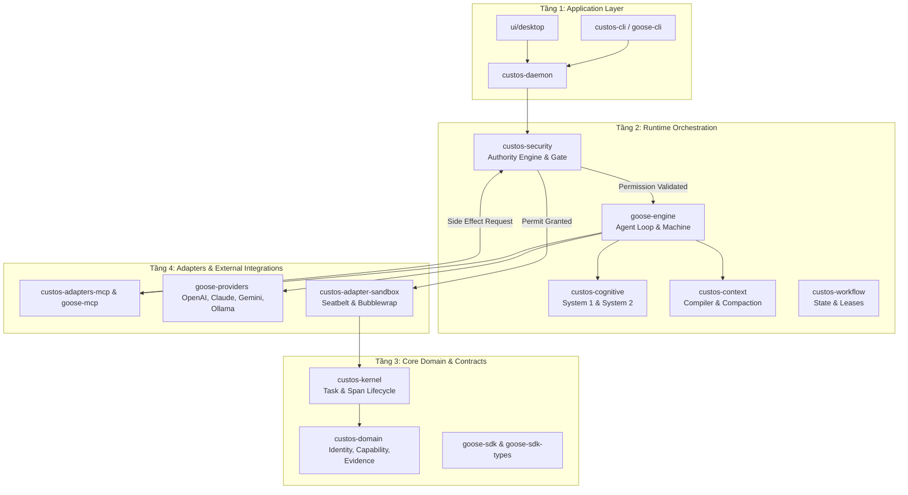
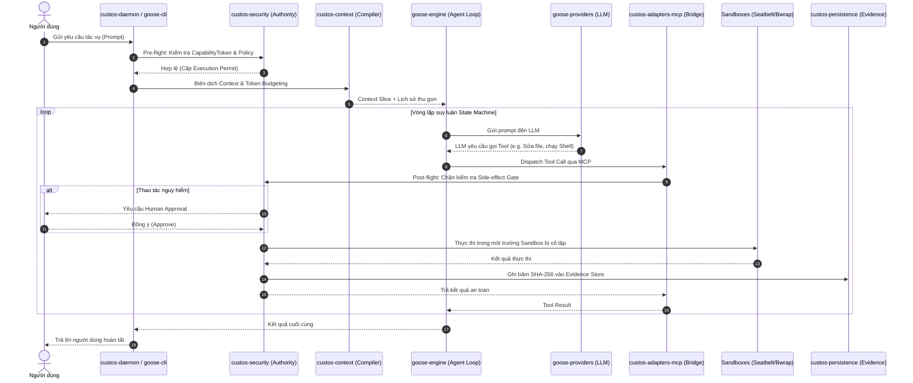

# BÁO CÁO DUYỆT TOÀN DIỆN AST & CALL GRAPH 3 KHO MÃ NGUỒN
## ĐỐI CHIẾU CẤU TRÚC CHI TIẾT: CUSTOS · GOOSE · CUSTOS_NEW
> **Được khởi tạo tự động bởi Nexus Lens V2** (Tree-sitter AST Parser + NetworkX Call Graph Engine + SQLite Storage).
> **Cam kết độ bao phủ:** Phủ kín 100% Crate, 100% Entry Point, 100% Thư mục ngoài crate, không bỏ sót bất kỳ thành phần nào.

## MỤC LỤC
1. [Phần 1: Bản chất & Sứ mệnh Cốt lõi của 3 Repositories](#phần-1-bản-chất--sứ-mệnh-cốt-lõi-của-3-repositories)
2. [Phần 2: Bảng Tổng quan Chỉ số Kỹ thuật Toàn diện (Nexus Metrics)](#phần-2-bảng-tổng-quan-chỉ-số-kỹ-thuật-toàn-diện-nexus-metrics)
3. [Phần 3: Chi tiết Cấu trúc Repository: CUSTOS (34 Crates)](#phần-3-chi-tiết-cấu-trúc-repository-custos-34-crates)
4. [Phần 4: Chi tiết Cấu trúc Repository: GOOSE (16 Crates + Subsystems)](#phần-4-chi-tiết-cấu-trúc-repository-goose-16-crates--subsystems)
5. [Phần 5: Chi tiết Cấu trúc Repository: CUSTOS_NEW (41 Crates theo 5 Tầng)](#phần-5-chi-tiết-cấu-trúc-repository-custos_new-41-crates-theo-5-tầng)
6. [Phần 6: Ma trận Đối chiếu & Ánh xạ Xuyên Repo (Cross-Repo Traceability)](#phần-6-ma-trận-đối-chiếu--ánh-xạ-xuyên-repo-cross-repo-traceability)
7. [Phần 7: Kiến trúc Hợp nhất Toàn diện & Luồng Hoạt động Thực tế](#phần-7-kiến-trúc-hợp-nhất-toàn-diện--luồng-hoạt-động-thực-tế)

---

## PHẦN 1: BẢN CHẤT & SỨ MỆNH CỐT LÕI CỦA 3 REPOSITORIES
```
┌─────────────────────────────────┐       ┌─────────────────────────────────┐
│             CUSTOS              │       │              GOOSE              │
│   'Trusted Agent Operating      │       │     'Open Autonomous Agent      │
│            System'              │       │       Execution Platform'       │
│  - Zero-Trust Policy & Gateway  │       │  - 15+ LLM Provider Matrix      │
│  - Capability Token Grants      │       │  - Model Context Protocol (MCP) │
│  - Deterministic Evidence Anchor│       │  - Agent Loop State Machine     │
│  - OS Sandbox Isolation         │       │  - Desktop GUI & Terminal CLI   │
└────────────────┬────────────────┘       └────────────────┬────────────────┘
                 │                                         │
                 └────────────────────┬────────────────────┘
                                      │  (HỢP NHẤT MONOREPO)
                                      ▼
                 ┌─────────────────────────────────────────┐
                 │               CUSTOS_NEW                │
                 │   'Enterprise-Grade Agent Platform'     │
                 │   Thực thi linh hoạt của Goose          │
                 │              +                          │
                 │   Kỷ luật bảo mật tuyệt đối của Custos  │
                 └─────────────────────────────────────────┘
```

- **`Custos` (16.7k LOC · 34 crates):** Đóng vai trò là **Hạt nhân kiểm soát chính sách và bảo mật (Security & Policy Kernel)**. Triết lý thiết kế: Zero-Trust đối với mọi suy luận của LLM. Mọi hành vi sửa đổi file, chạy shell, hay truy vấn mạng đều phải được cấp `CapabilityToken`, đi qua `CapabilityGateway`, được phán đoán bởi `AuthorityEngine`, xác thực bất biến bởi `EvidenceEngine` và cô lập trong `Sandbox` (Seatbelt/Bubblewrap).
- **`goose` (847k LOC · 16 crates + Desktop UI):** Đóng vai trò là **Động cơ thực thi tác vụ tự trị (Autonomous Execution Engine)**. Triết lý thiết kế: Tối đa hóa khả năng hoàn thành công việc và trải nghiệm lập trình viên. Hỗ trợ ma trận hơn 15 nhà cung cấp LLM (`goose-providers`), chuẩn hóa giao thức công cụ mở rộng qua `goose-mcp`, vòng lặp suy luận State Machine linh hoạt, giao diện Desktop (`ui/desktop`), và âm thanh AI (`buzz`).
- **`Custos_new` (1.18M LOC · 41 crates):** Là **Monorepo hợp nhất 5 tầng kiến trúc tiêu chuẩn**. Nó kết hợp trọn vẹn sức mạnh thực thi, hệ sinh thái MCP và giao diện Desktop của Goose với cơ chế kiểm soát quyền hạn, audit trail bất biến và hộp cát bảo mật của Custos.

---

## PHẦN 2: BẢNG TỔNG QUAN CHỈ SỐ KỸ THUẬT TOÀN DIỆN (NEXUS METRICS)
| Tiêu chí | CUSTOS (Cũ) | GOOSE (Gốc) | CUSTOS_NEW (Hợp nhất) | Tổng cộng (Index DB) |
| :--- | :--- | :--- | :--- | :--- |
| **Đường dẫn Workspace** | `/Custos` | `/goose` | `/Custos_new` | `/Users/mac/Project/AgentHub` |
| **Số lượng Crates** | **34 crates** | **16 crates** | **41 crates** | **91 crates** |
| **Tổng số Files đã Index** | 263 files | 2,182 files | 2,482 files | **4,927 files** |
| **Tổng số Dòng code (LOC)** | 16,760 LOC | 847,216 LOC | 1,182,361 LOC | **2,046,337 LOC** |
| **AST Symbols nhận diện** | 651 symbols | 13,817 symbols | 17,520 symbols | **31,988 symbols** |
| **Call Graph References** | 2,470 edges | 102,276 edges | 126,859 edges | **231,605 references** |
| **Semantic Chunks lưu trữ** | 930 chunks | 22,234 chunks | 26,208 chunks | **49,372 chunks** |
| **Đặc thù Kiến trúc** | Bảo mật, Policy Gate, CAS Evidence | Agentic Runtime, Provider Matrix, MCP | Monorepo Hợp nhất: Security + Execution | Hệ tri thức trọn vẹn |

---

## PHẦN 3: CHI TIẾT CẤU TRÚC REPOSITORY: CUSTOS (34 CRATES)
- **Phân bố ngôn ngữ:** `markdown`: 67 files, `toml`: 40 files, `text`: 15 files, `yaml`: 14 files, `rust`: 107 files, `json`: 18 files, `javascript`: 1 files, `shell`: 1 files
- **Phân nhóm chức năng:**
  1. *Security & Task Kernel:* `core-domain`, `authority-engine`, `capability-gateway`, `evidence-engine`, `task-kernel`.
  2. *Cognitive & Context:* `cognitive-runtime`, `context-compiler`, `deliberation-contracts`, `judgment-contracts`, `workflow-runtime`, `memory-service`, `repo-intelligence`.
  3. *Adapters & Sandboxes:* `sandboxes/macos-seatbelt`, `sandboxes/linux-bubblewrap`, `judgments/*`, `providers/*`, `tools`.
  4. *Infrastructure & Apps:* `persistence-sqlite`, `artifact-store`, `local-api`, `custosd`, `custos-cli`, `domain-packs/`.

### Danh mục toàn bộ 34 Crates trong Custos (Không bỏ sót)
### 1. `custos-adapter-judgment-jev`
- **Vị trí thư mục:** [`adapters/judgments/jev`](file:///Users/mac/Project/AgentHub/Custos/adapters/judgments/jev)
- **Quy mô:** `2` files | `41` dòng code
- **Mô tả / Trách nhiệm:** TypeSafe Jev Judgment Engine
- **Phụ thuộc nội bộ (Depends on):** `custos-core-domain`, `custos-judgment-contracts`
- **Được phụ thuộc bởi (Depended by):** *Không có crate nào phụ thuộc trực tiếp*
- **Key Exported Types & Traits (AST):**
  - `[struct]` **`JevJudgmentEngine`** ([`adapters/judgments/jev/src/lib.rs:7`](file:///Users/mac/Project/AgentHub/Custos/adapters/judgments/jev/src/lib.rs#L7)) — `pub struct JevJudgmentEngine;`

### 2. `custos-adapter-judgment-onnx`
- **Vị trí thư mục:** [`adapters/judgments/onnx`](file:///Users/mac/Project/AgentHub/Custos/adapters/judgments/onnx)
- **Quy mô:** `2` files | `44` dòng code
- **Mô tả / Trách nhiệm:** Local ONNX fast embedding & scoring
- **Phụ thuộc nội bộ (Depends on):** `custos-core-domain`, `custos-judgment-contracts`
- **Được phụ thuộc bởi (Depended by):** *Không có crate nào phụ thuộc trực tiếp*
- **Key Exported Types & Traits (AST):**
  - `[struct]` **`OnnxJudgmentEngine`** ([`adapters/judgments/onnx/src/lib.rs:7`](file:///Users/mac/Project/AgentHub/Custos/adapters/judgments/onnx/src/lib.rs#L7)) — `pub struct OnnxJudgmentEngine;`

### 3. `custos-adapter-judgment-rules`
- **Vị trí thư mục:** [`adapters/judgments/rules`](file:///Users/mac/Project/AgentHub/Custos/adapters/judgments/rules)
- **Quy mô:** `2` files | `44` dòng code
- **Mô tả / Trách nhiệm:** Deterministic Rule-based Judgment
- **Phụ thuộc nội bộ (Depends on):** `custos-core-domain`, `custos-judgment-contracts`
- **Được phụ thuộc bởi (Depended by):** *Không có crate nào phụ thuộc trực tiếp*
- **Key Exported Types & Traits (AST):**
  - `[struct]` **`RuleJudgmentEngine`** ([`adapters/judgments/rules/src/lib.rs:7`](file:///Users/mac/Project/AgentHub/Custos/adapters/judgments/rules/src/lib.rs#L7)) — `pub struct RuleJudgmentEngine;`

### 4. `custos-adapter-provider-antigravity`
- **Vị trí thư mục:** [`adapters/providers/antigravity`](file:///Users/mac/Project/AgentHub/Custos/adapters/providers/antigravity)
- **Quy mô:** `2` files | `64` dòng code
- **Mô tả / Trách nhiệm:** AntigravityProvider adapter for Custos
- **Phụ thuộc nội bộ (Depends on):** `custos-core-domain`, `custos-provider-sdk`
- **Được phụ thuộc bởi (Depended by):** *Không có crate nào phụ thuộc trực tiếp*
- **Key Exported Types & Traits (AST):**
  - `[struct]` **`AntigravityProvider`** ([`adapters/providers/antigravity/src/lib.rs:7`](file:///Users/mac/Project/AgentHub/Custos/adapters/providers/antigravity/src/lib.rs#L7)) — `pub struct AntigravityProvider`

### 5. `custos-adapter-provider-claude`
- **Vị trí thư mục:** [`adapters/providers/claude`](file:///Users/mac/Project/AgentHub/Custos/adapters/providers/claude)
- **Quy mô:** `2` files | `171` dòng code
- **Mô tả / Trách nhiệm:** ClaudeProvider adapter for Custos
- **Phụ thuộc nội bộ (Depends on):** `custos-core-domain`, `custos-provider-sdk`
- **Được phụ thuộc bởi (Depended by):** *Không có crate nào phụ thuộc trực tiếp*
- **Key Exported Types & Traits (AST):**
  - `[struct]` **`AnthropicConfig`** ([`adapters/providers/claude/src/lib.rs:7`](file:///Users/mac/Project/AgentHub/Custos/adapters/providers/claude/src/lib.rs#L7)) — `pub struct AnthropicConfig`
  - `[enum]` **`AnthropicRole`** ([`adapters/providers/claude/src/lib.rs:27`](file:///Users/mac/Project/AgentHub/Custos/adapters/providers/claude/src/lib.rs#L27)) — `pub enum AnthropicRole`
  - `[struct]` **`AnthropicMessage`** ([`adapters/providers/claude/src/lib.rs:33`](file:///Users/mac/Project/AgentHub/Custos/adapters/providers/claude/src/lib.rs#L33)) — `pub struct AnthropicMessage`
  - `[struct]` **`AnthropicRequestPayload`** ([`adapters/providers/claude/src/lib.rs:39`](file:///Users/mac/Project/AgentHub/Custos/adapters/providers/claude/src/lib.rs#L39)) — `pub struct AnthropicRequestPayload`
  - `[struct]` **`ClaudeProvider`** ([`adapters/providers/claude/src/lib.rs:48`](file:///Users/mac/Project/AgentHub/Custos/adapters/providers/claude/src/lib.rs#L48)) — `pub struct ClaudeProvider`

### 6. `custos-adapter-provider-codex`
- **Vị trí thư mục:** [`adapters/providers/codex`](file:///Users/mac/Project/AgentHub/Custos/adapters/providers/codex)
- **Quy mô:** `2` files | `64` dòng code
- **Mô tả / Trách nhiệm:** CodexProvider adapter for Custos
- **Phụ thuộc nội bộ (Depends on):** `custos-core-domain`, `custos-provider-sdk`
- **Được phụ thuộc bởi (Depended by):** *Không có crate nào phụ thuộc trực tiếp*
- **Key Exported Types & Traits (AST):**
  - `[struct]` **`CodexProvider`** ([`adapters/providers/codex/src/lib.rs:7`](file:///Users/mac/Project/AgentHub/Custos/adapters/providers/codex/src/lib.rs#L7)) — `pub struct CodexProvider`

### 7. `custos-adapter-provider-fake`
- **Vị trí thư mục:** [`adapters/providers/fake`](file:///Users/mac/Project/AgentHub/Custos/adapters/providers/fake)
- **Quy mô:** `2` files | `175` dòng code
- **Phụ thuộc nội bộ (Depends on):** *Không có phụ thuộc nội bộ*
- **Được phụ thuộc bởi (Depended by):** `custos-tests-contract`, `custos-tests-e2e`
- **Key Exported Types & Traits (AST):**
  - `[struct]` **`FakeProvider`** ([`adapters/providers/fake/src/lib.rs:18`](file:///Users/mac/Project/AgentHub/Custos/adapters/providers/fake/src/lib.rs#L18)) — `pub struct FakeProvider`

### 8. `custos-adapter-provider-local-model`
- **Vị trí thư mục:** [`adapters/providers/local-model`](file:///Users/mac/Project/AgentHub/Custos/adapters/providers/local-model)
- **Quy mô:** `2` files | `263` dòng code
- **Mô tả / Trách nhiệm:** LocalModelProvider adapter for Custos
- **Phụ thuộc nội bộ (Depends on):** `custos-core-domain`, `custos-provider-sdk`
- **Được phụ thuộc bởi (Depended by):** *Không có crate nào phụ thuộc trực tiếp*
- **Key Exported Types & Traits (AST):**
  - `[struct]` **`OllamaHttpConfig`** ([`adapters/providers/local-model/src/lib.rs:14`](file:///Users/mac/Project/AgentHub/Custos/adapters/providers/local-model/src/lib.rs#L14)) — `pub struct OllamaHttpConfig`
  - `[struct]` **`LocalModelProvider`** ([`adapters/providers/local-model/src/lib.rs:30`](file:///Users/mac/Project/AgentHub/Custos/adapters/providers/local-model/src/lib.rs#L30)) — `pub struct LocalModelProvider`
  - `[struct]` **`OllamaGenerateOptions`** ([`adapters/providers/local-model/src/lib.rs:92`](file:///Users/mac/Project/AgentHub/Custos/adapters/providers/local-model/src/lib.rs#L92)) — `pub struct OllamaGenerateOptions`
  - `[struct]` **`OllamaGeneratePayload`** ([`adapters/providers/local-model/src/lib.rs:100`](file:///Users/mac/Project/AgentHub/Custos/adapters/providers/local-model/src/lib.rs#L100)) — `pub struct OllamaGeneratePayload`
  - `[struct]` **`OllamaResponsePayload`** ([`adapters/providers/local-model/src/lib.rs:109`](file:///Users/mac/Project/AgentHub/Custos/adapters/providers/local-model/src/lib.rs#L109)) — `pub struct OllamaResponsePayload`
  - `[struct]` **`ParsedToolCall`** ([`adapters/providers/local-model/src/lib.rs:124`](file:///Users/mac/Project/AgentHub/Custos/adapters/providers/local-model/src/lib.rs#L124)) — `pub struct ParsedToolCall`

### 9. `custos-adapter-sandbox-linux-bubblewrap`
- **Vị trí thư mục:** [`adapters/sandboxes/linux-bubblewrap`](file:///Users/mac/Project/AgentHub/Custos/adapters/sandboxes/linux-bubblewrap)
- **Quy mô:** `2` files | `23` dòng code
- **Mô tả / Trách nhiệm:** Linux bwrap unprivileged namespace containment
- **Phụ thuộc nội bộ (Depends on):** `custos-core-domain`
- **Được phụ thuộc bởi (Depended by):** *Không có crate nào phụ thuộc trực tiếp*
- **Key Exported Types & Traits (AST):**
  - `[struct]` **`BubblewrapSandbox`** ([`adapters/sandboxes/linux-bubblewrap/src/lib.rs:3`](file:///Users/mac/Project/AgentHub/Custos/adapters/sandboxes/linux-bubblewrap/src/lib.rs#L3)) — `pub struct BubblewrapSandbox;`

### 10. `custos-adapter-sandbox-macos-seatbelt`
- **Vị trí thư mục:** [`adapters/sandboxes/macos-seatbelt`](file:///Users/mac/Project/AgentHub/Custos/adapters/sandboxes/macos-seatbelt)
- **Quy mô:** `2` files | `23` dòng code
- **Mô tả / Trách nhiệm:** macOS sandbox-exec / Seatbelt profile containment
- **Phụ thuộc nội bộ (Depends on):** `custos-core-domain`
- **Được phụ thuộc bởi (Depended by):** *Không có crate nào phụ thuộc trực tiếp*
- **Key Exported Types & Traits (AST):**
  - `[struct]` **`SeatbeltSandbox`** ([`adapters/sandboxes/macos-seatbelt/src/lib.rs:3`](file:///Users/mac/Project/AgentHub/Custos/adapters/sandboxes/macos-seatbelt/src/lib.rs#L3)) — `pub struct SeatbeltSandbox;`

### 11. `custos-adapter-tools`
- **Vị trí thư mục:** [`adapters/tools`](file:///Users/mac/Project/AgentHub/Custos/adapters/tools)
- **Quy mô:** `2` files | `424` dòng code
- **Mô tả / Trách nhiệm:** Standard system tools: filesystem, git, shell
- **Phụ thuộc nội bộ (Depends on):** `custos-capability-gateway`, `custos-core-domain`
- **Được phụ thuộc bởi (Depended by):** *Không có crate nào phụ thuộc trực tiếp*
- **Key Exported Types & Traits (AST):**
  - `[struct]` **`ToolDefinition`** ([`adapters/tools/src/lib.rs:17`](file:///Users/mac/Project/AgentHub/Custos/adapters/tools/src/lib.rs#L17)) — `pub struct ToolDefinition`
  - `[struct]` **`FsReadTool`** ([`adapters/tools/src/lib.rs:65`](file:///Users/mac/Project/AgentHub/Custos/adapters/tools/src/lib.rs#L65)) — `pub struct FsReadTool`
  - `[struct]` **`FsEditTool`** ([`adapters/tools/src/lib.rs:96`](file:///Users/mac/Project/AgentHub/Custos/adapters/tools/src/lib.rs#L96)) — `pub struct FsEditTool`
  - `[struct]` **`FsWriteTool`** ([`adapters/tools/src/lib.rs:153`](file:///Users/mac/Project/AgentHub/Custos/adapters/tools/src/lib.rs#L153)) — `pub struct FsWriteTool`
  - `[struct]` **`ShellTool`** ([`adapters/tools/src/lib.rs:198`](file:///Users/mac/Project/AgentHub/Custos/adapters/tools/src/lib.rs#L198)) — `pub struct ShellTool`
  - `[struct]` **`FsTreeTool`** ([`adapters/tools/src/lib.rs:239`](file:///Users/mac/Project/AgentHub/Custos/adapters/tools/src/lib.rs#L239)) — `pub struct FsTreeTool`
  - `[struct]` **`StandardTools`** ([`adapters/tools/src/lib.rs:313`](file:///Users/mac/Project/AgentHub/Custos/adapters/tools/src/lib.rs#L313)) — `pub struct StandardTools`

### 12. `custos-artifact-store`
- **Vị trí thư mục:** [`crates/artifact-store`](file:///Users/mac/Project/AgentHub/Custos/crates/artifact-store)
- **Quy mô:** `4` files | `79` dòng code
- **Mô tả / Trách nhiệm:** Content-addressed storage (CAS) for artifacts and evidence
- **Phụ thuộc nội bộ (Depends on):** `custos-core-domain`
- **Được phụ thuộc bởi (Depended by):** `custos-tests-e2e`
- **Key Exported Types & Traits (AST):**
  - `[trait]` **`ArtifactStore`** ([`crates/artifact-store/src/traits.rs:5`](file:///Users/mac/Project/AgentHub/Custos/crates/artifact-store/src/traits.rs#L5)) — `pub trait ArtifactStore: Send + Sync`
  - `[struct]` **`FsArtifactStore`** ([`crates/artifact-store/src/filesystem.rs:6`](file:///Users/mac/Project/AgentHub/Custos/crates/artifact-store/src/filesystem.rs#L6)) — `pub struct FsArtifactStore`

### 13. `custos-authority-engine`
- **Vị trí thư mục:** [`crates/authority-engine`](file:///Users/mac/Project/AgentHub/Custos/crates/authority-engine)
- **Quy mô:** `8` files | `481` dòng code
- **Mô tả / Trách nhiệm:** Authority, capability grants, human approvals, and execution permits for Custos
- **Phụ thuộc nội bộ (Depends on):** `custos-core-domain`
- **Được phụ thuộc bởi (Depended by):** `custos-capability-gateway`, `custos-tests-e2e`, `custosd`
- **Key Exported Types & Traits (AST):**
  - `[struct]` **`RiskEvaluator`** ([`crates/authority-engine/src/risk.rs:7`](file:///Users/mac/Project/AgentHub/Custos/crates/authority-engine/src/risk.rs#L7)) — `pub struct RiskEvaluator;`
  - `[enum]` **`PolicyDecision`** ([`crates/authority-engine/src/policy.rs:9`](file:///Users/mac/Project/AgentHub/Custos/crates/authority-engine/src/policy.rs#L9)) — `pub enum PolicyDecision`
  - `[struct]` **`ApprovalManager`** ([`crates/authority-engine/src/approvals.rs:11`](file:///Users/mac/Project/AgentHub/Custos/crates/authority-engine/src/approvals.rs#L11)) — `pub struct ApprovalManager`
  - `[struct]` **`GrantStore`** ([`crates/authority-engine/src/grants.rs:11`](file:///Users/mac/Project/AgentHub/Custos/crates/authority-engine/src/grants.rs#L11)) — `pub struct GrantStore`
  - `[struct]` **`PermitIssuer`** ([`crates/authority-engine/src/permits.rs:11`](file:///Users/mac/Project/AgentHub/Custos/crates/authority-engine/src/permits.rs#L11)) — `pub struct PermitIssuer`
  - `[struct]` **`AuditEntry`** ([`crates/authority-engine/src/audit.rs:13`](file:///Users/mac/Project/AgentHub/Custos/crates/authority-engine/src/audit.rs#L13)) — `pub struct AuditEntry`
  - `[trait]` **`PolicyEvaluator`** ([`crates/authority-engine/src/policy.rs:16`](file:///Users/mac/Project/AgentHub/Custos/crates/authority-engine/src/policy.rs#L16)) — `pub trait PolicyEvaluator: Send + Sync`
  - `[struct]` **`DefaultPolicyEvaluator`** ([`crates/authority-engine/src/policy.rs:23`](file:///Users/mac/Project/AgentHub/Custos/crates/authority-engine/src/policy.rs#L23)) — `pub struct DefaultPolicyEvaluator;`
  - `[struct]` **`AuditLog`** ([`crates/authority-engine/src/audit.rs:25`](file:///Users/mac/Project/AgentHub/Custos/crates/authority-engine/src/audit.rs#L25)) — `pub struct AuditLog`
  - `[struct]` **`AuthorityEngine`** ([`crates/authority-engine/src/lib.rs:25`](file:///Users/mac/Project/AgentHub/Custos/crates/authority-engine/src/lib.rs#L25)) — `pub struct AuthorityEngine`

### 14. `custos-capability-gateway`
- **Vị trí thư mục:** [`crates/capability-gateway`](file:///Users/mac/Project/AgentHub/Custos/crates/capability-gateway)
- **Quy mô:** `4` files | `192` dòng code
- **Mô tả / Trách nhiệm:** Single point of side-effect execution with deterministic gating
- **Phụ thuộc nội bộ (Depends on):** `custos-authority-engine`, `custos-core-domain`
- **Được phụ thuộc bởi (Depended by):** `custos-adapter-tools`, `custos-tests-e2e`, `custosd`
- **Key Exported Types & Traits (AST):**
  - `[struct]` **`ExecutionResult`** ([`crates/capability-gateway/src/traits.rs:5`](file:///Users/mac/Project/AgentHub/Custos/crates/capability-gateway/src/traits.rs#L5)) — `pub struct ExecutionResult`
  - `[struct]` **`DeterministicGate`** ([`crates/capability-gateway/src/deterministic.rs:7`](file:///Users/mac/Project/AgentHub/Custos/crates/capability-gateway/src/deterministic.rs#L7)) — `pub struct DeterministicGate`
  - `[trait]` **`ToolGate`** ([`crates/capability-gateway/src/traits.rs:13`](file:///Users/mac/Project/AgentHub/Custos/crates/capability-gateway/src/traits.rs#L13)) — `pub trait ToolGate: Send + Sync`

### 15. `custos-cli`
- **Vị trí thư mục:** [`apps/custos-cli`](file:///Users/mac/Project/AgentHub/Custos/apps/custos-cli)
- **Quy mô:** `10` files | `2,588` dòng code
- **Mô tả / Trách nhiệm:** Thin command-line interface for Custos
- **Phụ thuộc nội bộ (Depends on):** `custos-core-domain`, `custos-persistence-sqlite`, `custos-task-kernel`
- **Được phụ thuộc bởi (Depended by):** *Không có crate nào phụ thuộc trực tiếp*
- **Key Exported Types & Traits (AST):**
  - `[struct]` **`DiffSummary`** ([`apps/custos-cli/src/ui/diff.rs:5`](file:///Users/mac/Project/AgentHub/Custos/apps/custos-cli/src/ui/diff.rs#L5)) — `pub struct DiffSummary`
  - `[struct]` **`CliSpinner`** ([`apps/custos-cli/src/ui/spinner.rs:5`](file:///Users/mac/Project/AgentHub/Custos/apps/custos-cli/src/ui/spinner.rs#L5)) — `pub struct CliSpinner`
  - `[enum]` **`RiskLevel`** ([`apps/custos-cli/src/ui/prompt.rs:8`](file:///Users/mac/Project/AgentHub/Custos/apps/custos-cli/src/ui/prompt.rs#L8)) — `pub enum RiskLevel`
  - `[enum]` **`AssetKind`** ([`apps/custos-cli/src/ui/assets.rs:13`](file:///Users/mac/Project/AgentHub/Custos/apps/custos-cli/src/ui/assets.rs#L13)) — `pub enum AssetKind`
  - `[struct]` **`Cli`** ([`apps/custos-cli/src/lib.rs:14`](file:///Users/mac/Project/AgentHub/Custos/apps/custos-cli/src/lib.rs#L14)) — `pub struct Cli`
  - `[enum]` **`CliTaskStatus`** ([`apps/custos-cli/src/lib.rs:26`](file:///Users/mac/Project/AgentHub/Custos/apps/custos-cli/src/lib.rs#L26)) — `pub enum CliTaskStatus`
  - `[enum]` **`ResponsiveTier`** ([`apps/custos-cli/src/ui/mod.rs:44`](file:///Users/mac/Project/AgentHub/Custos/apps/custos-cli/src/ui/mod.rs#L44)) — `pub enum ResponsiveTier`
  - `[enum]` **`Commands`** ([`apps/custos-cli/src/lib.rs:51`](file:///Users/mac/Project/AgentHub/Custos/apps/custos-cli/src/lib.rs#L51)) — `pub enum Commands`
  - `[enum]` **`OperationalMode`** ([`apps/custos-cli/src/ui/mod.rs:73`](file:///Users/mac/Project/AgentHub/Custos/apps/custos-cli/src/ui/mod.rs#L73)) — `pub enum OperationalMode`
  - `[enum]` **`TaskLifecycleState`** ([`apps/custos-cli/src/ui/assets.rs:587`](file:///Users/mac/Project/AgentHub/Custos/apps/custos-cli/src/ui/assets.rs#L587)) — `pub enum TaskLifecycleState`

### 16. `custos-cognitive-runtime`
- **Vị trí thư mục:** [`crates/cognitive-runtime`](file:///Users/mac/Project/AgentHub/Custos/crates/cognitive-runtime)
- **Quy mô:** `6` files | `465` dòng code
- **Mô tả / Trách nhiệm:** RDC protocol coordinator: Resolve-Delegate-Check with System One/Two
- **Phụ thuộc nội bộ (Depends on):** `custos-core-domain`, `custos-provider-sdk`
- **Được phụ thuộc bởi (Depended by):** *Không có crate nào phụ thuộc trực tiếp*
- **Key Exported Types & Traits (AST):**
  - `[struct]` **`CognitiveArbiter`** ([`crates/cognitive-runtime/src/arbiter.rs:4`](file:///Users/mac/Project/AgentHub/Custos/crates/cognitive-runtime/src/arbiter.rs#L4)) — `pub struct CognitiveArbiter`
  - `[enum]` **`CognitiveTier`** ([`crates/cognitive-runtime/src/routing.rs:9`](file:///Users/mac/Project/AgentHub/Custos/crates/cognitive-runtime/src/routing.rs#L9)) — `pub enum CognitiveTier`
  - `[enum]` **`RdcPhase`** ([`crates/cognitive-runtime/src/rdc.rs:13`](file:///Users/mac/Project/AgentHub/Custos/crates/cognitive-runtime/src/rdc.rs#L13)) — `pub enum RdcPhase`
  - `[struct]` **`RoutingRequest`** ([`crates/cognitive-runtime/src/routing.rs:15`](file:///Users/mac/Project/AgentHub/Custos/crates/cognitive-runtime/src/routing.rs#L15)) — `pub struct RoutingRequest`
  - `[struct]` **`RdcResolution`** ([`crates/cognitive-runtime/src/rdc.rs:20`](file:///Users/mac/Project/AgentHub/Custos/crates/cognitive-runtime/src/rdc.rs#L20)) — `pub struct RdcResolution`
  - `[struct]` **`RdcDelegation`** ([`crates/cognitive-runtime/src/rdc.rs:27`](file:///Users/mac/Project/AgentHub/Custos/crates/cognitive-runtime/src/rdc.rs#L27)) — `pub struct RdcDelegation`
  - `[struct]` **`RouteCandidate`** ([`crates/cognitive-runtime/src/routing.rs:27`](file:///Users/mac/Project/AgentHub/Custos/crates/cognitive-runtime/src/routing.rs#L27)) — `pub struct RouteCandidate`
  - `[struct]` **`RdcCheckResult`** ([`crates/cognitive-runtime/src/rdc.rs:35`](file:///Users/mac/Project/AgentHub/Custos/crates/cognitive-runtime/src/rdc.rs#L35)) — `pub struct RdcCheckResult`
  - `[struct]` **`RouteDecision`** ([`crates/cognitive-runtime/src/routing.rs:41`](file:///Users/mac/Project/AgentHub/Custos/crates/cognitive-runtime/src/routing.rs#L41)) — `pub struct RouteDecision`
  - `[struct]` **`RdcEngine`** ([`crates/cognitive-runtime/src/rdc.rs:43`](file:///Users/mac/Project/AgentHub/Custos/crates/cognitive-runtime/src/rdc.rs#L43)) — `pub struct RdcEngine;`
  - `[struct]` **`RoutingPolicy`** ([`crates/cognitive-runtime/src/routing.rs:49`](file:///Users/mac/Project/AgentHub/Custos/crates/cognitive-runtime/src/routing.rs#L49)) — `pub struct RoutingPolicy`

### 17. `custos-context-compiler`
- **Vị trí thư mục:** [`crates/context-compiler`](file:///Users/mac/Project/AgentHub/Custos/crates/context-compiler)
- **Quy mô:** `5` files | `306` dòng code
- **Mô tả / Trách nhiệm:** Context slicing, relevance scoring, and prompt budgeting
- **Phụ thuộc nội bộ (Depends on):** `custos-core-domain`
- **Được phụ thuộc bởi (Depended by):** `custos-tests-e2e`
- **Key Exported Types & Traits (AST):**
  - `[struct]` **`ContextSlice`** ([`crates/context-compiler/src/traits.rs:5`](file:///Users/mac/Project/AgentHub/Custos/crates/context-compiler/src/traits.rs#L5)) — `pub struct ContextSlice`
  - `[struct]` **`EngineeringRecipe`** ([`crates/context-compiler/src/recipe.rs:8`](file:///Users/mac/Project/AgentHub/Custos/crates/context-compiler/src/recipe.rs#L8)) — `pub struct EngineeringRecipe`
  - `[struct]` **`SourceDocument`** ([`crates/context-compiler/src/compiler.rs:11`](file:///Users/mac/Project/AgentHub/Custos/crates/context-compiler/src/compiler.rs#L11)) — `pub struct SourceDocument`
  - `[trait]` **`ContextBuilder`** ([`crates/context-compiler/src/traits.rs:11`](file:///Users/mac/Project/AgentHub/Custos/crates/context-compiler/src/traits.rs#L11)) — `pub trait ContextBuilder: Send + Sync`
  - `[struct]` **`TokenAwareContextCompiler`** ([`crates/context-compiler/src/compiler.rs:36`](file:///Users/mac/Project/AgentHub/Custos/crates/context-compiler/src/compiler.rs#L36)) — `pub struct TokenAwareContextCompiler`

### 18. `custos-core-domain`
- **Vị trí thư mục:** [`crates/core-domain`](file:///Users/mac/Project/AgentHub/Custos/crates/core-domain)
- **Quy mô:** `21` files | `1,558` dòng code
- **Mô tả / Trách nhiệm:** Pure domain models and primitives for Custos v4.0 (zero runtime dependencies)
- **Phụ thuộc nội bộ (Depends on):** *Không có phụ thuộc nội bộ*
- **Được phụ thuộc bởi (Depended by):** `custos-adapter-judgment-jev`, `custos-adapter-judgment-onnx`, `custos-adapter-judgment-rules`, `custos-adapter-provider-antigravity`, `custos-adapter-provider-claude`, `custos-adapter-provider-codex`, `custos-adapter-provider-local-model`, `custos-adapter-sandbox-linux-bubblewrap`, `custos-adapter-sandbox-macos-seatbelt`, `custos-adapter-tools`, `custos-artifact-store`, `custos-authority-engine`, `custos-capability-gateway`, `custos-cli`, `custos-cognitive-runtime`, `custos-context-compiler`, `custos-deliberation-contracts`, `custos-domain-pack-sdk`, `custos-evidence-engine`, `custos-judgment-contracts`, `custos-local-api`, `custos-memory-service`, `custos-persistence-sqlite`, `custos-provider-sdk`, `custos-repo-intelligence`, `custos-task-kernel`, `custos-tests-contract`, `custos-tests-e2e`, `custos-workflow-runtime`, `custosd`
- **Key Exported Types & Traits (AST):**
  - `[struct]` **`Claim`** ([`crates/core-domain/src/claim.rs:6`](file:///Users/mac/Project/AgentHub/Custos/crates/core-domain/src/claim.rs#L6)) — `pub struct Claim`
  - `[struct]` **`Fact`** ([`crates/core-domain/src/fact.rs:6`](file:///Users/mac/Project/AgentHub/Custos/crates/core-domain/src/fact.rs#L6)) — `pub struct Fact`
  - `[struct]` **`CapabilityManifest`** ([`crates/core-domain/src/capability.rs:8`](file:///Users/mac/Project/AgentHub/Custos/crates/core-domain/src/capability.rs#L8)) — `pub struct CapabilityManifest`
  - `[struct]` **`ContextItem`** ([`crates/core-domain/src/context.rs:8`](file:///Users/mac/Project/AgentHub/Custos/crates/core-domain/src/context.rs#L8)) — `pub struct ContextItem`
  - `[enum]` **`EvidenceStatus`** ([`crates/core-domain/src/evidence.rs:8`](file:///Users/mac/Project/AgentHub/Custos/crates/core-domain/src/evidence.rs#L8)) — `pub enum EvidenceStatus`
  - `[enum]` **`DomainError`** ([`crates/core-domain/src/error.rs:9`](file:///Users/mac/Project/AgentHub/Custos/crates/core-domain/src/error.rs#L9)) — `pub enum DomainError`
  - `[struct]` **`WorkflowStep`** ([`crates/core-domain/src/workflow.rs:9`](file:///Users/mac/Project/AgentHub/Custos/crates/core-domain/src/workflow.rs#L9)) — `pub struct WorkflowStep`
  - `[enum]` **`ArtifactKind`** ([`crates/core-domain/src/artifact.rs:10`](file:///Users/mac/Project/AgentHub/Custos/crates/core-domain/src/artifact.rs#L10)) — `pub enum ArtifactKind`
  - `[struct]` **`Budget`** ([`crates/core-domain/src/budget.rs:10`](file:///Users/mac/Project/AgentHub/Custos/crates/core-domain/src/budget.rs#L10)) — `pub struct Budget`
  - `[enum]` **`RiskLevel`** ([`crates/core-domain/src/action.rs:11`](file:///Users/mac/Project/AgentHub/Custos/crates/core-domain/src/action.rs#L11)) — `pub enum RiskLevel`
  - `[enum]` **`SpanState`** ([`crates/core-domain/src/span.rs:12`](file:///Users/mac/Project/AgentHub/Custos/crates/core-domain/src/span.rs#L12)) — `pub enum SpanState`
  - `[enum]` **`EvidenceKind`** ([`crates/core-domain/src/task.rs:12`](file:///Users/mac/Project/AgentHub/Custos/crates/core-domain/src/task.rs#L12)) — `pub enum EvidenceKind`
  - `[struct]` **`ContinuationPacket`** ([`crates/core-domain/src/continuation.rs:13`](file:///Users/mac/Project/AgentHub/Custos/crates/core-domain/src/continuation.rs#L13)) — `pub struct ContinuationPacket`
  - `[enum]` **`RunStatus`** ([`crates/core-domain/src/run.rs:13`](file:///Users/mac/Project/AgentHub/Custos/crates/core-domain/src/run.rs#L13)) — `pub enum RunStatus`
  - `[enum]` **`ApprovalStatus`** ([`crates/core-domain/src/approval.rs:14`](file:///Users/mac/Project/AgentHub/Custos/crates/core-domain/src/approval.rs#L14)) — `pub enum ApprovalStatus`

### 19. `custos-deliberation-contracts`
- **Vị trí thư mục:** [`crates/deliberation-contracts`](file:///Users/mac/Project/AgentHub/Custos/crates/deliberation-contracts)
- **Quy mô:** `2` files | `24` dòng code
- **Mô tả / Trách nhiệm:** System Two worker deliberation contracts and roles
- **Phụ thuộc nội bộ (Depends on):** `custos-core-domain`
- **Được phụ thuộc bởi (Depended by):** *Không có crate nào phụ thuộc trực tiếp*
- **Key Exported Types & Traits (AST):**
  - `[enum]` **`WorkerRole`** ([`crates/deliberation-contracts/src/lib.rs:2`](file:///Users/mac/Project/AgentHub/Custos/crates/deliberation-contracts/src/lib.rs#L2)) — `pub enum WorkerRole`
  - `[struct]` **`DeliberationPlan`** ([`crates/deliberation-contracts/src/lib.rs:10`](file:///Users/mac/Project/AgentHub/Custos/crates/deliberation-contracts/src/lib.rs#L10)) — `pub struct DeliberationPlan`

### 20. `custos-domain-pack-sdk`
- **Vị trí thư mục:** [`crates/domain-pack-sdk`](file:///Users/mac/Project/AgentHub/Custos/crates/domain-pack-sdk)
- **Quy mô:** `2` files | `28` dòng code
- **Mô tả / Trách nhiệm:** SDK for building extensible domain packs (Engineering, Research, Personal)
- **Phụ thuộc nội bộ (Depends on):** `custos-core-domain`
- **Được phụ thuộc bởi (Depended by):** *Không có crate nào phụ thuộc trực tiếp*
- **Key Exported Types & Traits (AST):**
  - `[struct]` **`DomainPackManifest`** ([`crates/domain-pack-sdk/src/lib.rs:5`](file:///Users/mac/Project/AgentHub/Custos/crates/domain-pack-sdk/src/lib.rs#L5)) — `pub struct DomainPackManifest`
  - `[trait]` **`DomainPack`** ([`crates/domain-pack-sdk/src/lib.rs:13`](file:///Users/mac/Project/AgentHub/Custos/crates/domain-pack-sdk/src/lib.rs#L13)) — `pub trait DomainPack: Send + Sync`

### 21. `custos-evidence-engine`
- **Vị trí thư mục:** [`crates/evidence-engine`](file:///Users/mac/Project/AgentHub/Custos/crates/evidence-engine)
- **Quy mô:** `5` files | `691` dòng code
- **Mô tả / Trách nhiệm:** Deterministic verification and evidence anchor validation
- **Phụ thuộc nội bộ (Depends on):** `custos-core-domain`
- **Được phụ thuộc bởi (Depended by):** `custos-tests-e2e`
- **Key Exported Types & Traits (AST):**
  - `[struct]` **`EvidenceBundle`** ([`crates/evidence-engine/src/bundle.rs:8`](file:///Users/mac/Project/AgentHub/Custos/crates/evidence-engine/src/bundle.rs#L8)) — `pub struct EvidenceBundle`
  - `[trait]` **`Verifier`** ([`crates/evidence-engine/src/verifier.rs:10`](file:///Users/mac/Project/AgentHub/Custos/crates/evidence-engine/src/verifier.rs#L10)) — `pub trait Verifier: Send + Sync`
  - `[struct]` **`RequirementEvaluation`** ([`crates/evidence-engine/src/pipeline.rs:16`](file:///Users/mac/Project/AgentHub/Custos/crates/evidence-engine/src/pipeline.rs#L16)) — `pub struct RequirementEvaluation`
  - `[struct]` **`CommandExitCodeVerifier`** ([`crates/evidence-engine/src/verifier.rs:19`](file:///Users/mac/Project/AgentHub/Custos/crates/evidence-engine/src/verifier.rs#L19)) — `pub struct CommandExitCodeVerifier;`
  - `[struct]` **`EvidencePipeline`** ([`crates/evidence-engine/src/pipeline.rs:23`](file:///Users/mac/Project/AgentHub/Custos/crates/evidence-engine/src/pipeline.rs#L23)) — `pub struct EvidencePipeline`
  - `[struct]` **`HashVerifier`** ([`crates/evidence-engine/src/verifier.rs:54`](file:///Users/mac/Project/AgentHub/Custos/crates/evidence-engine/src/verifier.rs#L54)) — `pub struct HashVerifier;`
  - `[struct]` **`ExactMatchVerifier`** ([`crates/evidence-engine/src/verifier.rs:97`](file:///Users/mac/Project/AgentHub/Custos/crates/evidence-engine/src/verifier.rs#L97)) — `pub struct ExactMatchVerifier;`
  - `[struct]` **`CitationVerifier`** ([`crates/evidence-engine/src/verifier.rs:140`](file:///Users/mac/Project/AgentHub/Custos/crates/evidence-engine/src/verifier.rs#L140)) — `pub struct CitationVerifier;`
  - `[struct]` **`SemanticSupportEvaluator`** ([`crates/evidence-engine/src/verifier.rs:291`](file:///Users/mac/Project/AgentHub/Custos/crates/evidence-engine/src/verifier.rs#L291)) — `pub struct SemanticSupportEvaluator;`

### 22. `custos-judgment-contracts`
- **Vị trí thư mục:** [`crates/judgment-contracts`](file:///Users/mac/Project/AgentHub/Custos/crates/judgment-contracts)
- **Quy mô:** `2` files | `25` dòng code
- **Mô tả / Trách nhiệm:** System One fast-judgment contracts and schemas
- **Phụ thuộc nội bộ (Depends on):** `custos-core-domain`
- **Được phụ thuộc bởi (Depended by):** `custos-adapter-judgment-jev`, `custos-adapter-judgment-onnx`, `custos-adapter-judgment-rules`
- **Key Exported Types & Traits (AST):**
  - `[struct]` **`FastJudgment`** ([`crates/judgment-contracts/src/lib.rs:5`](file:///Users/mac/Project/AgentHub/Custos/crates/judgment-contracts/src/lib.rs#L5)) — `pub struct FastJudgment`
  - `[trait]` **`JudgmentEngine`** ([`crates/judgment-contracts/src/lib.rs:12`](file:///Users/mac/Project/AgentHub/Custos/crates/judgment-contracts/src/lib.rs#L12)) — `pub trait JudgmentEngine: Send + Sync`

### 23. `custos-local-api`
- **Vị trí thư mục:** [`crates/local-api`](file:///Users/mac/Project/AgentHub/Custos/crates/local-api)
- **Quy mô:** `2` files | `313` dòng code
- **Mô tả / Trách nhiệm:** Local JSON-RPC / IPC server contracts and message protocols
- **Phụ thuộc nội bộ (Depends on):** `custos-core-domain`, `custos-task-kernel`
- **Được phụ thuộc bởi (Depended by):** *Không có crate nào phụ thuộc trực tiếp*
- **Key Exported Types & Traits (AST):**
  - `[struct]` **`CreateTaskRequest`** ([`crates/local-api/src/lib.rs:13`](file:///Users/mac/Project/AgentHub/Custos/crates/local-api/src/lib.rs#L13)) — `pub struct CreateTaskRequest`
  - `[struct]` **`CancelTaskRequest`** ([`crates/local-api/src/lib.rs:20`](file:///Users/mac/Project/AgentHub/Custos/crates/local-api/src/lib.rs#L20)) — `pub struct CancelTaskRequest`
  - `[struct]` **`AdvanceTaskRequest`** ([`crates/local-api/src/lib.rs:26`](file:///Users/mac/Project/AgentHub/Custos/crates/local-api/src/lib.rs#L26)) — `pub struct AdvanceTaskRequest`
  - `[struct]` **`TaskEventNotification`** ([`crates/local-api/src/lib.rs:32`](file:///Users/mac/Project/AgentHub/Custos/crates/local-api/src/lib.rs#L32)) — `pub struct TaskEventNotification`
  - `[struct]` **`ApiRequest`** ([`crates/local-api/src/lib.rs:40`](file:///Users/mac/Project/AgentHub/Custos/crates/local-api/src/lib.rs#L40)) — `pub struct ApiRequest`
  - `[struct]` **`ApiResponse`** ([`crates/local-api/src/lib.rs:47`](file:///Users/mac/Project/AgentHub/Custos/crates/local-api/src/lib.rs#L47)) — `pub struct ApiResponse`
  - `[struct]` **`LocalApiDispatcher`** ([`crates/local-api/src/lib.rs:72`](file:///Users/mac/Project/AgentHub/Custos/crates/local-api/src/lib.rs#L72)) — `pub struct LocalApiDispatcher`
  - `[struct]` **`MockStore`** ([`crates/local-api/src/lib.rs:188`](file:///Users/mac/Project/AgentHub/Custos/crates/local-api/src/lib.rs#L188)) — `struct MockStore`

### 24. `custos-memory-service`
- **Vị trí thư mục:** [`crates/memory-service`](file:///Users/mac/Project/AgentHub/Custos/crates/memory-service)
- **Quy mô:** `3` files | `30` dòng code
- **Mô tả / Trách nhiệm:** 5-tiered memory service (Working, Episodic, Semantic, Procedural, Judgment)
- **Phụ thuộc nội bộ (Depends on):** `custos-core-domain`
- **Được phụ thuộc bởi (Depended by):** *Không có crate nào phụ thuộc trực tiếp*
- **Key Exported Types & Traits (AST):**
  - `[enum]` **`MemoryTier`** ([`crates/memory-service/src/traits.rs:5`](file:///Users/mac/Project/AgentHub/Custos/crates/memory-service/src/traits.rs#L5)) — `pub enum MemoryTier`
  - `[trait]` **`MemoryStore`** ([`crates/memory-service/src/traits.rs:14`](file:///Users/mac/Project/AgentHub/Custos/crates/memory-service/src/traits.rs#L14)) — `pub trait MemoryStore: Send + Sync`

### 25. `custos-observability`
- **Vị trí thư mục:** [`crates/observability`](file:///Users/mac/Project/AgentHub/Custos/crates/observability)
- **Quy mô:** `2` files | `21` dòng code
- **Mô tả / Trách nhiệm:** Structured tracing, metrics, and secret redaction
- **Phụ thuộc nội bộ (Depends on):** *Không có phụ thuộc nội bộ*
- **Được phụ thuộc bởi (Depended by):** `custosd`
- **Key Exported Types & Traits:** *Chưa khai báo public struct/trait trực tiếp hoặc là utility/macro crate*

### 26. `custos-persistence-sqlite`
- **Vị trí thư mục:** [`crates/persistence-sqlite`](file:///Users/mac/Project/AgentHub/Custos/crates/persistence-sqlite)
- **Quy mô:** `15` files | `1,080` dòng code
- **Mô tả / Trách nhiệm:** SQLite storage adapter implementing TaskStore and event persistence
- **Phụ thuộc nội bộ (Depends on):** `custos-core-domain`, `custos-task-kernel`
- **Được phụ thuộc bởi (Depended by):** `custos-cli`, `custos-tests-e2e`, `custosd`
- **Key Exported Types & Traits (AST):**
  - `[struct]` **`ContinuationRepository`** ([`crates/persistence-sqlite/src/repositories/continuation.rs:6`](file:///Users/mac/Project/AgentHub/Custos/crates/persistence-sqlite/src/repositories/continuation.rs#L6)) — `pub struct ContinuationRepository`
  - `[struct]` **`SpanRepository`** ([`crates/persistence-sqlite/src/repositories/span.rs:6`](file:///Users/mac/Project/AgentHub/Custos/crates/persistence-sqlite/src/repositories/span.rs#L6)) — `pub struct SpanRepository`
  - `[struct]` **`TaskRepository`** ([`crates/persistence-sqlite/src/repositories/task.rs:6`](file:///Users/mac/Project/AgentHub/Custos/crates/persistence-sqlite/src/repositories/task.rs#L6)) — `pub struct TaskRepository`
  - `[struct]` **`DbConnection`** ([`crates/persistence-sqlite/src/connection.rs:9`](file:///Users/mac/Project/AgentHub/Custos/crates/persistence-sqlite/src/connection.rs#L9)) — `pub struct DbConnection`
  - `[struct]` **`SqliteTaskStore`** ([`crates/persistence-sqlite/src/store.rs:10`](file:///Users/mac/Project/AgentHub/Custos/crates/persistence-sqlite/src/store.rs#L10)) — `pub struct SqliteTaskStore`

### 27. `custos-provider-sdk`
- **Vị trí thư mục:** [`crates/provider-sdk`](file:///Users/mac/Project/AgentHub/Custos/crates/provider-sdk)
- **Quy mô:** `7` files | `322` dòng code
- **Mô tả / Trách nhiệm:** Provider Port traits and contracts for model-agnostic execution
- **Phụ thuộc nội bộ (Depends on):** `custos-core-domain`
- **Được phụ thuộc bởi (Depended by):** `custos-adapter-provider-antigravity`, `custos-adapter-provider-claude`, `custos-adapter-provider-codex`, `custos-adapter-provider-local-model`, `custos-cognitive-runtime`, `custos-tests-contract`, `custos-tests-e2e`
- **Key Exported Types & Traits (AST):**
  - `[enum]` **`ProviderEventType`** ([`crates/provider-sdk/src/events.rs:9`](file:///Users/mac/Project/AgentHub/Custos/crates/provider-sdk/src/events.rs#L9)) — `pub enum ProviderEventType`
  - `[struct]` **`ProviderRequest`** ([`crates/provider-sdk/src/request.rs:9`](file:///Users/mac/Project/AgentHub/Custos/crates/provider-sdk/src/request.rs#L9)) — `pub struct ProviderRequest`
  - `[enum]` **`ModelProviderKind`** ([`crates/provider-sdk/src/port.rs:14`](file:///Users/mac/Project/AgentHub/Custos/crates/provider-sdk/src/port.rs#L14)) — `pub enum ModelProviderKind`
  - `[struct]` **`ToolCall`** ([`crates/provider-sdk/src/events.rs:17`](file:///Users/mac/Project/AgentHub/Custos/crates/provider-sdk/src/events.rs#L17)) — `pub struct ToolCall`
  - `[struct]` **`CapabilityDescriptor`** ([`crates/provider-sdk/src/port.rs:23`](file:///Users/mac/Project/AgentHub/Custos/crates/provider-sdk/src/port.rs#L23)) — `pub struct CapabilityDescriptor`
  - `[struct]` **`TokenUsage`** ([`crates/provider-sdk/src/events.rs:24`](file:///Users/mac/Project/AgentHub/Custos/crates/provider-sdk/src/events.rs#L24)) — `pub struct TokenUsage`
  - `[struct]` **`ProviderEvent`** ([`crates/provider-sdk/src/events.rs:32`](file:///Users/mac/Project/AgentHub/Custos/crates/provider-sdk/src/events.rs#L32)) — `pub struct ProviderEvent`
  - `[trait]` **`ModelProvider`** ([`crates/provider-sdk/src/port.rs:33`](file:///Users/mac/Project/AgentHub/Custos/crates/provider-sdk/src/port.rs#L33)) — `pub trait ModelProvider: Send + Sync`
  - `[struct]` **`ModelResponse`** ([`crates/provider-sdk/src/request.rs:63`](file:///Users/mac/Project/AgentHub/Custos/crates/provider-sdk/src/request.rs#L63)) — `pub struct ModelResponse`

### 28. `custos-repo-intelligence`
- **Vị trí thư mục:** [`crates/repo-intelligence`](file:///Users/mac/Project/AgentHub/Custos/crates/repo-intelligence)
- **Quy mô:** `6` files | `1,048` dòng code
- **Mô tả / Trách nhiệm:** Codebase intelligence: AST parsing, symbol indexing, diff analysis
- **Phụ thuộc nội bộ (Depends on):** `custos-core-domain`
- **Được phụ thuộc bởi (Depended by):** `custos-tests-e2e`
- **Key Exported Types & Traits (AST):**
  - `[struct]` **`FileEntry`** ([`crates/repo-intelligence/src/scanner.rs:10`](file:///Users/mac/Project/AgentHub/Custos/crates/repo-intelligence/src/scanner.rs#L10)) — `pub struct FileEntry`
  - `[enum]` **`LlmViewFormat`** ([`crates/repo-intelligence/src/llm_view.rs:11`](file:///Users/mac/Project/AgentHub/Custos/crates/repo-intelligence/src/llm_view.rs#L11)) — `pub enum LlmViewFormat`
  - `[struct]` **`RepoAnalyzer`** ([`crates/repo-intelligence/src/lib.rs:13`](file:///Users/mac/Project/AgentHub/Custos/crates/repo-intelligence/src/lib.rs#L13)) — `pub struct RepoAnalyzer;`
  - `[struct]` **`SymbolId`** ([`crates/repo-intelligence/src/graph.rs:16`](file:///Users/mac/Project/AgentHub/Custos/crates/repo-intelligence/src/graph.rs#L16)) — `pub struct SymbolId`
  - `[struct]` **`SymbolRef`** ([`crates/repo-intelligence/src/scanner.rs:19`](file:///Users/mac/Project/AgentHub/Custos/crates/repo-intelligence/src/scanner.rs#L19)) — `pub struct SymbolRef`
  - `[struct]` **`LlmContextBuilder`** ([`crates/repo-intelligence/src/llm_view.rs:20`](file:///Users/mac/Project/AgentHub/Custos/crates/repo-intelligence/src/llm_view.rs#L20)) — `pub struct LlmContextBuilder<'a>`
  - `[struct]` **`WorkspaceScanner`** ([`crates/repo-intelligence/src/scanner.rs:27`](file:///Users/mac/Project/AgentHub/Custos/crates/repo-intelligence/src/scanner.rs#L27)) — `pub struct WorkspaceScanner`
  - `[enum]` **`NodeKind`** ([`crates/repo-intelligence/src/graph.rs:38`](file:///Users/mac/Project/AgentHub/Custos/crates/repo-intelligence/src/graph.rs#L38)) — `pub enum NodeKind`
  - `[struct]` **`CodeNode`** ([`crates/repo-intelligence/src/graph.rs:106`](file:///Users/mac/Project/AgentHub/Custos/crates/repo-intelligence/src/graph.rs#L106)) — `pub struct CodeNode`
  - `[enum]` **`EdgeKind`** ([`crates/repo-intelligence/src/graph.rs:116`](file:///Users/mac/Project/AgentHub/Custos/crates/repo-intelligence/src/graph.rs#L116)) — `pub enum EdgeKind`
  - `[struct]` **`GraphEdge`** ([`crates/repo-intelligence/src/graph.rs:130`](file:///Users/mac/Project/AgentHub/Custos/crates/repo-intelligence/src/graph.rs#L130)) — `pub struct GraphEdge`
  - `[struct]` **`CodeGraph`** ([`crates/repo-intelligence/src/graph.rs:141`](file:///Users/mac/Project/AgentHub/Custos/crates/repo-intelligence/src/graph.rs#L141)) — `pub struct CodeGraph`
  - `[struct]` **`CrateSummary`** ([`crates/repo-intelligence/examples/scan_architecture.rs:16`](file:///Users/mac/Project/AgentHub/Custos/crates/repo-intelligence/examples/scan_architecture.rs#L16)) — `struct CrateSummary`

### 29. `custos-task-kernel`
- **Vị trí thư mục:** [`crates/task-kernel`](file:///Users/mac/Project/AgentHub/Custos/crates/task-kernel)
- **Quy mô:** `11` files | `792` dòng code
- **Mô tả / Trách nhiệm:** Core task and span lifecycle orchestration
- **Phụ thuộc nội bộ (Depends on):** `custos-core-domain`
- **Được phụ thuộc bởi (Depended by):** `custos-cli`, `custos-local-api`, `custos-persistence-sqlite`, `custos-tests-e2e`, `custos-workflow-runtime`, `custosd`
- **Key Exported Types & Traits (AST):**
  - `[struct]` **`CompletionGate`** ([`crates/task-kernel/src/completion.rs:7`](file:///Users/mac/Project/AgentHub/Custos/crates/task-kernel/src/completion.rs#L7)) — `pub struct CompletionGate;`
  - `[struct]` **`TaskInvariants`** ([`crates/task-kernel/src/invariants.rs:7`](file:///Users/mac/Project/AgentHub/Custos/crates/task-kernel/src/invariants.rs#L7)) — `pub struct TaskInvariants;`
  - `[struct]` **`TaskStateMachine`** ([`crates/task-kernel/src/state_machine.rs:7`](file:///Users/mac/Project/AgentHub/Custos/crates/task-kernel/src/state_machine.rs#L7)) — `pub struct TaskStateMachine;`
  - `[struct]` **`CreateTask`** ([`crates/task-kernel/src/commands.rs:9`](file:///Users/mac/Project/AgentHub/Custos/crates/task-kernel/src/commands.rs#L9)) — `pub struct CreateTask`
  - `[trait]` **`TaskStore`** ([`crates/task-kernel/src/ports.rs:9`](file:///Users/mac/Project/AgentHub/Custos/crates/task-kernel/src/ports.rs#L9)) — `pub trait TaskStore: Send + Sync`
  - `[struct]` **`SpanService`** ([`crates/task-kernel/src/span_service.rs:9`](file:///Users/mac/Project/AgentHub/Custos/crates/task-kernel/src/span_service.rs#L9)) — `pub struct SpanService`
  - `[struct]` **`TaskCreated`** ([`crates/task-kernel/src/events.rs:10`](file:///Users/mac/Project/AgentHub/Custos/crates/task-kernel/src/events.rs#L10)) — `pub struct TaskCreated`
  - `[struct]` **`TaskReducer`** ([`crates/task-kernel/src/reducer.rs:11`](file:///Users/mac/Project/AgentHub/Custos/crates/task-kernel/src/reducer.rs#L11)) — `pub struct TaskReducer;`
  - `[struct]` **`AdvanceTask`** ([`crates/task-kernel/src/commands.rs:15`](file:///Users/mac/Project/AgentHub/Custos/crates/task-kernel/src/commands.rs#L15)) — `pub struct AdvanceTask`
  - `[struct]` **`TaskAdvanced`** ([`crates/task-kernel/src/events.rs:17`](file:///Users/mac/Project/AgentHub/Custos/crates/task-kernel/src/events.rs#L17)) — `pub struct TaskAdvanced`
  - `[struct]` **`TaskService`** ([`crates/task-kernel/src/service.rs:21`](file:///Users/mac/Project/AgentHub/Custos/crates/task-kernel/src/service.rs#L21)) — `pub struct TaskService`
  - `[struct]` **`BlockTask`** ([`crates/task-kernel/src/commands.rs:23`](file:///Users/mac/Project/AgentHub/Custos/crates/task-kernel/src/commands.rs#L23)) — `pub struct BlockTask`
  - `[struct]` **`TaskBlocked`** ([`crates/task-kernel/src/events.rs:27`](file:///Users/mac/Project/AgentHub/Custos/crates/task-kernel/src/events.rs#L27)) — `pub struct TaskBlocked`
  - `[struct]` **`CompleteTask`** ([`crates/task-kernel/src/commands.rs:30`](file:///Users/mac/Project/AgentHub/Custos/crates/task-kernel/src/commands.rs#L30)) — `pub struct CompleteTask`
  - `[struct]` **`TaskCompleted`** ([`crates/task-kernel/src/events.rs:36`](file:///Users/mac/Project/AgentHub/Custos/crates/task-kernel/src/events.rs#L36)) — `pub struct TaskCompleted`

### 30. `custos-tests-contract`
- **Vị trí thư mục:** [`tests/contract`](file:///Users/mac/Project/AgentHub/Custos/tests/contract)
- **Quy mô:** `3` files | `95` dòng code
- **Phụ thuộc nội bộ (Depends on):** `custos-adapter-provider-fake`, `custos-core-domain`, `custos-provider-sdk`
- **Được phụ thuộc bởi (Depended by):** *Không có crate nào phụ thuộc trực tiếp*
- **Key Exported Types & Traits:** *Chưa khai báo public struct/trait trực tiếp hoặc là utility/macro crate*

### 31. `custos-tests-e2e`
- **Vị trí thư mục:** [`tests/e2e`](file:///Users/mac/Project/AgentHub/Custos/tests/e2e)
- **Quy mô:** `4` files | `498` dòng code
- **Phụ thuộc nội bộ (Depends on):** `custos-adapter-provider-fake`, `custos-artifact-store`, `custos-authority-engine`, `custos-capability-gateway`, `custos-context-compiler`, `custos-core-domain`, `custos-evidence-engine`, `custos-persistence-sqlite`, `custos-provider-sdk`, `custos-repo-intelligence`, `custos-task-kernel`
- **Được phụ thuộc bởi (Depended by):** *Không có crate nào phụ thuộc trực tiếp*
- **Key Exported Types & Traits:** *Chưa khai báo public struct/trait trực tiếp hoặc là utility/macro crate*

### 32. `custos-workflow-runtime`
- **Vị trí thư mục:** [`crates/workflow-runtime`](file:///Users/mac/Project/AgentHub/Custos/crates/workflow-runtime)
- **Quy mô:** `5` files | `60` dòng code
- **Mô tả / Trách nhiệm:** Event dispatch, leasing, and transactional outbox for workflows
- **Phụ thuộc nội bộ (Depends on):** `custos-core-domain`, `custos-task-kernel`
- **Được phụ thuộc bởi (Depended by):** *Không có crate nào phụ thuộc trực tiếp*
- **Key Exported Types & Traits (AST):**
  - `[struct]` **`WorkflowDispatcher`** ([`crates/workflow-runtime/src/dispatcher.rs:3`](file:///Users/mac/Project/AgentHub/Custos/crates/workflow-runtime/src/dispatcher.rs#L3)) — `pub struct WorkflowDispatcher;`
  - `[struct]` **`OutboxMessage`** ([`crates/workflow-runtime/src/outbox.rs:4`](file:///Users/mac/Project/AgentHub/Custos/crates/workflow-runtime/src/outbox.rs#L4)) — `pub struct OutboxMessage`
  - `[struct]` **`TaskLease`** ([`crates/workflow-runtime/src/lease.rs:6`](file:///Users/mac/Project/AgentHub/Custos/crates/workflow-runtime/src/lease.rs#L6)) — `pub struct TaskLease`

### 33. `custosd`
- **Vị trí thư mục:** [`apps/custosd`](file:///Users/mac/Project/AgentHub/Custos/apps/custosd)
- **Quy mô:** `3` files | `80` dòng code
- **Mô tả / Trách nhiệm:** Custos trusted local background daemon
- **Phụ thuộc nội bộ (Depends on):** `custos-authority-engine`, `custos-capability-gateway`, `custos-core-domain`, `custos-observability`, `custos-persistence-sqlite`, `custos-task-kernel`
- **Được phụ thuộc bởi (Depended by):** *Không có crate nào phụ thuộc trực tiếp*
- **Key Exported Types & Traits (AST):**
  - `[struct]` **`CustosRuntime`** ([`apps/custosd/src/runtime.rs:10`](file:///Users/mac/Project/AgentHub/Custos/apps/custosd/src/runtime.rs#L10)) — `pub struct CustosRuntime`

### 34. `xtask`
- **Vị trí thư mục:** [`xtask`](file:///Users/mac/Project/AgentHub/Custos/xtask)
- **Quy mô:** `2` files | `45` dòng code
- **Phụ thuộc nội bộ (Depends on):** *Không có phụ thuộc nội bộ*
- **Được phụ thuộc bởi (Depended by):** *Không có crate nào phụ thuộc trực tiếp*
- **Key Exported Types & Traits (AST):**
  - `[struct]` **`Cli`** ([`xtask/src/main.rs:7`](file:///Users/mac/Project/AgentHub/Custos/xtask/src/main.rs#L7)) — `struct Cli`
  - `[enum]` **`Commands`** ([`xtask/src/main.rs:13`](file:///Users/mac/Project/AgentHub/Custos/xtask/src/main.rs#L13)) — `enum Commands`

### Các thành phần ngoài Crates trong Custos
Bên cạnh 34 crates của Cargo workspace, Custos duy trì các thư mục chức năng đặc thù:
- **`domain-packs/`** (`Directory`): Chứa các gói tri thức domain nghiệp vụ chuyên biệt (`assistant`, `engineering`, `executive`, `research`) định nghĩa prompt templates, system instructions và danh mục công cụ đặc thù.
- **`config/`** (`Directory`): Cấu hình mặc định cho daemon, logging, server port và các quy tắc policy phân quyền.
- **`custos-npm-package/`** (`Directory`): Gói wrapper Node.js/NPM phục vụ việc phân phối và cài đặt Custos CLI qua npx/npm.
- **`schemas/`** (`Directory`): Các định nghĩa JSON Schema cho Event Envelopes, Capability Tokens, Task States và Evidence Anchors.
- **`scripts/`** (`Directory`): Bộ script shell/python hỗ trợ build, kiểm tra bảo mật, định dạng code và CI/CD.
- **`templates/`** (`Directory`): Bộ mẫu mã nguồn cho việc khởi tạo domain packs hoặc adapters mới.
- **`dev_docs/` & `docs/`** (`Directory`): Tài liệu thiết kế hệ thống, RFCs kiến trúc, đặc tả phân tầng và hướng dẫn onboard.
- **Tệp cấu hình gốc:** `Cargo.toml`, `deny.toml` (kiểm toán crate license), `justfile` (task runner), `rust-toolchain.toml`, `rustfmt.toml`, `AGENTS.md`, `CLAUDE.md`, `README.md`.

### Điểm nhập thực thi (Entry Points) trong Custos
- **`main`** tại [`apps/custos-cli/src/main.rs:2`](file:///Users/mac/Project/AgentHub/Custos/apps/custos-cli/src/main.rs#L2) — `async fn main() -> Result<(), Box<dyn std::error::Error>>`
- **`main`** tại [`apps/custosd/src/main.rs:10`](file:///Users/mac/Project/AgentHub/Custos/apps/custosd/src/main.rs#L10) — `async fn main() -> Result<(), Box<dyn std::error::Error>>`
- **`main`** tại [`crates/repo-intelligence/examples/scan_architecture.rs:74`](file:///Users/mac/Project/AgentHub/Custos/crates/repo-intelligence/examples/scan_architecture.rs#L74) — `fn main() -> Result<(), Box<dyn std::error::Error>>`
- **`Cli`** tại [`xtask/src/main.rs:7`](file:///Users/mac/Project/AgentHub/Custos/xtask/src/main.rs#L7) — `struct Cli`
- **`Commands`** tại [`xtask/src/main.rs:13`](file:///Users/mac/Project/AgentHub/Custos/xtask/src/main.rs#L13) — `enum Commands`
- **`main`** tại [`xtask/src/main.rs:20`](file:///Users/mac/Project/AgentHub/Custos/xtask/src/main.rs#L20) — `fn main() -> Result<()>`

---

## PHẦN 4: CHI TIẾT CẤU TRÚC REPOSITORY: GOOSE (16 CRATES + SUBSYSTEMS)
- **Phân bố ngôn ngữ:** `yaml`: 139 files, `toml`: 27 files, `text`: 208 files, `json`: 152 files, `markdown`: 351 files, `python`: 25 files, `shell`: 28 files, `rust`: 584 files, `javascript`: 45 files, `css`: 16 files, `html`: 18 files, `typescript`: 589 files
- **Phân nhóm chức năng:**
  1. *Central Engine & Agent Loop:* `goose`, `goose-agent`, `goose-context-management`.
  2. *Ecosystem & Connectivity:* `goose-providers`, `goose-mcp`, `goose-provider-types`, `goose-roaming`, `goose-download-manager`, `goose-local-inference`, `goose-sdk`, `goose-sdk-types`, `goose-acp-macros`.
  3. *Apps & Tests:* `goose-cli`, `goose-test`, `goose-test-support`, `v8`.
  4. *Subsystems vệ tinh ngoài Crate:* `ui/desktop`, `buzz/`, `oidc-proxy/`, `workflow_recipes/`, `evals/`, `examples/`.

### Danh mục toàn bộ 16 Crates trong Goose (Không bỏ sót)
### 1. `goose`
- **Vị trí thư mục:** [`crates/goose`](file:///Users/mac/Project/AgentHub/goose/crates/goose)
- **Quy mô:** `432` files | `320,635` dòng code
- **Phụ thuộc nội bộ (Depends on):** `goose-acp-macros`, `goose-agent`, `goose-context-management`, `goose-download-manager`, `goose-mcp`, `goose-providers`, `goose-sdk-types`, `goose-test-support`
- **Được phụ thuộc bởi (Depended by):** `goose-cli`, `v8`
- **Key Exported Types & Traits (AST):**
  - `[struct]` **`Container`** ([`crates/goose/src/agents/container.rs:2`](file:///Users/mac/Project/AgentHub/goose/crates/goose/src/agents/container.rs#L2)) — `pub struct Container`
  - `[enum]` **`SlashCommandSource`** ([`crates/goose/src/slash_commands/types.rs:2`](file:///Users/mac/Project/AgentHub/goose/crates/goose/src/slash_commands/types.rs#L2)) — `pub enum SlashCommandSource`
  - `[struct]` **`SourceRoot`** ([`crates/goose/src/source_roots.rs:4`](file:///Users/mac/Project/AgentHub/goose/crates/goose/src/source_roots.rs#L4)) — `pub struct SourceRoot`
  - `[struct]` **`LangInfo`** ([`crates/goose/src/agents/platform_extensions/analyze/languages.rs:5`](file:///Users/mac/Project/AgentHub/goose/crates/goose/src/agents/platform_extensions/analyze/languages.rs#L5)) — `pub struct LangInfo`
  - `[enum]` **`TaskStatus`** ([`crates/goose/src/agents/subagent_execution_tool/notification_events.rs:5`](file:///Users/mac/Project/AgentHub/goose/crates/goose/src/agents/subagent_execution_tool/notification_events.rs#L5)) — `pub enum TaskStatus`
  - `[struct]` **`Paths`** ([`crates/goose/src/config/paths.rs:5`](file:///Users/mac/Project/AgentHub/goose/crates/goose/src/config/paths.rs#L5)) — `pub struct Paths;`
  - `[struct]` **`ConfigKeyResolver`** ([`crates/goose/src/providers/custom_provider_config.rs:5`](file:///Users/mac/Project/AgentHub/goose/crates/goose/src/providers/custom_provider_config.rs#L5)) — `pub struct ConfigKeyResolver<'a>`
  - `[struct]` **`RecipeFile`** ([`crates/goose/src/recipe/read_recipe_file_content.rs:6`](file:///Users/mac/Project/AgentHub/goose/crates/goose/src/recipe/read_recipe_file_content.rs#L6)) — `pub struct RecipeFile`
  - `[struct]` **`RateLimitedTelemetrySender`** ([`crates/goose/src/tracing/rate_limiter.rs:6`](file:///Users/mac/Project/AgentHub/goose/crates/goose/src/tracing/rate_limiter.rs#L6)) — `pub struct RateLimitedTelemetrySender`
  - `[struct]` **`ToolCallNotifier`** ([`crates/goose/src/acp/tool_call_notifier.rs:7`](file:///Users/mac/Project/AgentHub/goose/crates/goose/src/acp/tool_call_notifier.rs#L7)) — `pub(crate) struct ToolCallNotifier`
  - `[struct]` **`CspMetadata`** ([`crates/goose/src/goose_apps/resource.rs:7`](file:///Users/mac/Project/AgentHub/goose/crates/goose/src/goose_apps/resource.rs#L7)) — `pub struct CspMetadata`
  - `[struct]` **`LiveTranscript`** ([`crates/goose/src/live_voice/transcript.rs:7`](file:///Users/mac/Project/AgentHub/goose/crates/goose/src/live_voice/transcript.rs#L7)) — `pub(super) struct LiveTranscript`
  - `[struct]` **`RecipeValueDeserializer`** ([`crates/goose/src/recipe/value_deserializer.rs:7`](file:///Users/mac/Project/AgentHub/goose/crates/goose/src/recipe/value_deserializer.rs#L7)) — `pub(super) struct RecipeValueDeserializer<'de>`
  - `[trait]` **`AcpAwareToolMeta`** ([`crates/goose/src/acp/tools.rs:8`](file:///Users/mac/Project/AgentHub/goose/crates/goose/src/acp/tools.rs#L8)) — `pub trait AcpAwareToolMeta`
  - `[struct]` **`FileAnalysis`** ([`crates/goose/src/agents/platform_extensions/analyze/parser.rs:8`](file:///Users/mac/Project/AgentHub/goose/crates/goose/src/agents/platform_extensions/analyze/parser.rs#L8)) — `pub struct FileAnalysis`

### 2. `goose-acp-macros`
- **Vị trí thư mục:** [`crates/goose-acp-macros`](file:///Users/mac/Project/AgentHub/goose/crates/goose-acp-macros)
- **Quy mô:** `2` files | `338` dòng code
- **Phụ thuộc nội bộ (Depends on):** *Không có phụ thuộc nội bộ*
- **Được phụ thuộc bởi (Depended by):** `goose`
- **Key Exported Types & Traits (AST):**
  - `[struct]` **`Route`** ([`crates/goose-acp-macros/src/lib.rs:237`](file:///Users/mac/Project/AgentHub/goose/crates/goose-acp-macros/src/lib.rs#L237)) — `struct Route`

### 3. `goose-agent`
- **Vị trí thư mục:** [`crates/goose-agent`](file:///Users/mac/Project/AgentHub/goose/crates/goose-agent)
- **Quy mô:** `10` files | `2,253` dòng code
- **Mô tả / Trách nhiệm:** The GDK's Agent Loop
- **Phụ thuộc nội bộ (Depends on):** `goose-provider-types`
- **Được phụ thuộc bởi (Depended by):** `goose`
- **Key Exported Types & Traits (AST):**
  - `[enum]` **`AgentEvent`** ([`crates/goose-agent/src/events.rs:9`](file:///Users/mac/Project/AgentHub/goose/crates/goose-agent/src/events.rs#L9)) — `pub enum AgentEvent`
  - `[trait]` **`MachineSession`** ([`crates/goose-agent/src/machine.rs:13`](file:///Users/mac/Project/AgentHub/goose/crates/goose-agent/src/machine.rs#L13)) — `pub trait MachineSession: Send + Sync`
  - `[struct]` **`SlashCommand`** ([`crates/goose-agent/src/operation.rs:15`](file:///Users/mac/Project/AgentHub/goose/crates/goose-agent/src/operation.rs#L15)) — `pub struct SlashCommand<'a>`
  - `[trait]` **`SessionLoader`** ([`crates/goose-agent/src/machine.rs:19`](file:///Users/mac/Project/AgentHub/goose/crates/goose-agent/src/machine.rs#L19)) — `pub trait SessionLoader<S>: Send + Sync`
  - `[struct]` **`PreparedInferenceRequest`** ([`crates/goose-agent/src/inference.rs:24`](file:///Users/mac/Project/AgentHub/goose/crates/goose-agent/src/inference.rs#L24)) — `pub struct PreparedInferenceRequest`
  - `[trait]` **`EffectHandler`** ([`crates/goose-agent/src/machine.rs:24`](file:///Users/mac/Project/AgentHub/goose/crates/goose-agent/src/machine.rs#L24)) — `pub trait EffectHandler<S, E>: Send + Sync`
  - `[trait]` **`EffectUsage`** ([`crates/goose-agent/src/machine.rs:28`](file:///Users/mac/Project/AgentHub/goose/crates/goose-agent/src/machine.rs#L28)) — `pub trait EffectUsage<E>: Send + Sync`
  - `[trait]` **`InferenceRequestPreparer`** ([`crates/goose-agent/src/inference.rs:31`](file:///Users/mac/Project/AgentHub/goose/crates/goose-agent/src/inference.rs#L31)) — `pub trait InferenceRequestPreparer<S>: Send + Sync`
  - `[enum]` **`Step`** ([`crates/goose-agent/src/machine.rs:34`](file:///Users/mac/Project/AgentHub/goose/crates/goose-agent/src/machine.rs#L34)) — `pub enum Step<'a, S, E = ConversationEffect>`
  - `[struct]` **`IdentityInferenceRequestPreparer`** ([`crates/goose-agent/src/inference.rs:40`](file:///Users/mac/Project/AgentHub/goose/crates/goose-agent/src/inference.rs#L40)) — `pub struct IdentityInferenceRequestPreparer;`
  - `[struct]` **`StateMachine`** ([`crates/goose-agent/src/machine.rs:48`](file:///Users/mac/Project/AgentHub/goose/crates/goose-agent/src/machine.rs#L48)) — `pub struct StateMachine<'a, S, E = ConversationEffect>`
  - `[trait]` **`InferenceEffect`** ([`crates/goose-agent/src/inference.rs:63`](file:///Users/mac/Project/AgentHub/goose/crates/goose-agent/src/inference.rs#L63)) — `pub trait InferenceEffect: From<Message> + Send + 'static`
  - `[trait]` **`Operation`** ([`crates/goose-agent/src/operation.rs:74`](file:///Users/mac/Project/AgentHub/goose/crates/goose-agent/src/operation.rs#L74)) — `pub trait Operation<S, E: Send + 'static = ConversationEffect>: Send + Sync`
  - `[trait]` **`ToolProvider`** ([`crates/goose-agent/src/tool.rs:96`](file:///Users/mac/Project/AgentHub/goose/crates/goose-agent/src/tool.rs#L96)) — `pub trait ToolProvider<S>: Send + Sync`
  - `[struct]` **`InferenceInput`** ([`crates/goose-agent/src/operation.rs:136`](file:///Users/mac/Project/AgentHub/goose/crates/goose-agent/src/operation.rs#L136)) — `pub struct InferenceInput`

### 4. `goose-cli`
- **Vị trí thư mục:** [`crates/goose-cli`](file:///Users/mac/Project/AgentHub/goose/crates/goose-cli)
- **Quy mô:** `72` files | `33,691` dòng code
- **Phụ thuộc nội bộ (Depends on):** `goose`, `goose-mcp`, `goose-providers`, `goose-roaming`
- **Được phụ thuộc bởi (Depended by):** *Không có crate nào phụ thuộc trực tiếp*
- **Key Exported Types & Traits (AST):**
  - `[struct]` **`ProviderConfig`** ([`crates/goose-cli/src/scenario_tests/provider_configs.rs:8`](file:///Users/mac/Project/AgentHub/goose/crates/goose-cli/src/scenario_tests/provider_configs.rs#L8)) — `pub struct ProviderConfig`
  - `[struct]` **`ElicitationInput`** ([`crates/goose-cli/src/session/elicitation.rs:12`](file:///Users/mac/Project/AgentHub/goose/crates/goose-cli/src/session/elicitation.rs#L12)) — `pub struct ElicitationInput`
  - `[enum]` **`Shell`** ([`crates/goose-cli/src/commands/term.rs:13`](file:///Users/mac/Project/AgentHub/goose/crates/goose-cli/src/commands/term.rs#L13)) — `pub enum Shell`
  - `[struct]` **`GooseCompleter`** ([`crates/goose-cli/src/session/completion.rs:15`](file:///Users/mac/Project/AgentHub/goose/crates/goose-cli/src/session/completion.rs#L15)) — `pub struct GooseCompleter`
  - `[enum]` **`InputResult`** ([`crates/goose-cli/src/session/input.rs:15`](file:///Users/mac/Project/AgentHub/goose/crates/goose-cli/src/session/input.rs#L15)) — `pub enum InputResult`
  - `[struct]` **`ReviewOptions`** ([`crates/goose-cli/src/commands/review/handler.rs:18`](file:///Users/mac/Project/AgentHub/goose/crates/goose-cli/src/commands/review/handler.rs#L18)) — `pub struct ReviewOptions`
  - `[struct]` **`RecipeInfo`** ([`crates/goose-cli/src/recipes/github_recipe.rs:18`](file:///Users/mac/Project/AgentHub/goose/crates/goose-cli/src/recipes/github_recipe.rs#L18)) — `pub struct RecipeInfo`
  - `[struct]` **`MockClient`** ([`crates/goose-cli/src/scenario_tests/mock_client.rs:19`](file:///Users/mac/Project/AgentHub/goose/crates/goose-cli/src/scenario_tests/mock_client.rs#L19)) — `pub struct MockClient`
  - `[struct]` **`ScenarioResult`** ([`crates/goose-cli/src/scenario_tests/scenario_runner.rs:24`](file:///Users/mac/Project/AgentHub/goose/crates/goose-cli/src/scenario_tests/scenario_runner.rs#L24)) — `pub struct ScenarioResult`
  - `[struct]` **`FullAcpBridge`** ([`crates/goose-cli/src/commands/roam_full_bridge.rs:26`](file:///Users/mac/Project/AgentHub/goose/crates/goose-cli/src/commands/roam_full_bridge.rs#L26)) — `pub struct FullAcpBridge`
  - `[enum]` **`RecipeSource`** ([`crates/goose-cli/src/recipes/github_recipe.rs:27`](file:///Users/mac/Project/AgentHub/goose/crates/goose-cli/src/recipes/github_recipe.rs#L27)) — `pub enum RecipeSource`
  - `[struct]` **`PasteState`** ([`crates/goose-cli/src/session/paste.rs:30`](file:///Users/mac/Project/AgentHub/goose/crates/goose-cli/src/session/paste.rs#L30)) — `pub(super) struct PasteState`
  - `[struct]` **`PromptCommandOptions`** ([`crates/goose-cli/src/session/input.rs:37`](file:///Users/mac/Project/AgentHub/goose/crates/goose-cli/src/session/input.rs#L37)) — `pub struct PromptCommandOptions`
  - `[struct]` **`ModelCommandOptions`** ([`crates/goose-cli/src/session/input.rs:44`](file:///Users/mac/Project/AgentHub/goose/crates/goose-cli/src/session/input.rs#L44)) — `pub struct ModelCommandOptions`
  - `[struct]` **`Finding`** ([`crates/goose-cli/src/commands/review/orchestrator.rs:51`](file:///Users/mac/Project/AgentHub/goose/crates/goose-cli/src/commands/review/orchestrator.rs#L51)) — `pub struct Finding`

### 5. `goose-context-management`
- **Vị trí thư mục:** [`crates/goose-context-management`](file:///Users/mac/Project/AgentHub/goose/crates/goose-context-management)
- **Quy mô:** `12` files | `1,388` dòng code
- **Mô tả / Trách nhiệm:** Conversation compaction for Goose
- **Phụ thuộc nội bộ (Depends on):** `goose-provider-types`
- **Được phụ thuộc bởi (Depended by):** `goose`, `goose-sdk`
- **Key Exported Types & Traits (AST):**
  - `[trait]` **`CompactionModel`** ([`crates/goose-context-management/src/model.rs:13`](file:///Users/mac/Project/AgentHub/goose/crates/goose-context-management/src/model.rs#L13)) — `pub trait CompactionModel: Send + Sync`
  - `[struct]` **`StructuredSummary`** ([`crates/goose-context-management/src/structured.rs:14`](file:///Users/mac/Project/AgentHub/goose/crates/goose-context-management/src/structured.rs#L14)) — `pub struct StructuredSummary`
  - `[struct]` **`CompactingProvider`** ([`crates/goose-context-management/src/provider.rs:18`](file:///Users/mac/Project/AgentHub/goose/crates/goose-context-management/src/provider.rs#L18)) — `pub struct CompactingProvider`
  - `[struct]` **`Templates`** ([`crates/goose-context-management/src/templates.rs:19`](file:///Users/mac/Project/AgentHub/goose/crates/goose-context-management/src/templates.rs#L19)) — `pub struct Templates`
  - `[trait]` **`TokenEstimator`** ([`crates/goose-context-management/src/model.rs:23`](file:///Users/mac/Project/AgentHub/goose/crates/goose-context-management/src/model.rs#L23)) — `pub trait TokenEstimator: Send + Sync`
  - `[struct]` **`Summary`** ([`crates/goose-context-management/src/summarize.rs:25`](file:///Users/mac/Project/AgentHub/goose/crates/goose-context-management/src/summarize.rs#L25)) — `pub struct Summary`
  - `[struct]` **`ProviderModel`** ([`crates/goose-context-management/src/model.rs:28`](file:///Users/mac/Project/AgentHub/goose/crates/goose-context-management/src/model.rs#L28)) — `pub struct ProviderModel`
  - `[trait]` **`CompactionInput`** ([`crates/goose-context-management/src/lib.rs:35`](file:///Users/mac/Project/AgentHub/goose/crates/goose-context-management/src/lib.rs#L35)) — `pub trait CompactionInput`
  - `[struct]` **`FileActivity`** ([`crates/goose-context-management/src/structured.rs:41`](file:///Users/mac/Project/AgentHub/goose/crates/goose-context-management/src/structured.rs#L41)) — `pub struct FileActivity`
  - `[trait]` **`CompactionOutput`** ([`crates/goose-context-management/src/lib.rs:44`](file:///Users/mac/Project/AgentHub/goose/crates/goose-context-management/src/lib.rs#L44)) — `pub trait CompactionOutput`
  - `[struct]` **`SummarizeContext`** ([`crates/goose-context-management/src/summarize.rs:20`](file:///Users/mac/Project/AgentHub/goose/crates/goose-context-management/src/summarize.rs#L20)) — `struct SummarizeContext`
  - `[struct]` **`TestProvider`** ([`crates/goose-context-management/src/provider.rs:116`](file:///Users/mac/Project/AgentHub/goose/crates/goose-context-management/src/provider.rs#L116)) — `struct TestProvider;`
  - `[struct]` **`OverflowingModel`** ([`crates/goose-context-management/src/summarize.rs:193`](file:///Users/mac/Project/AgentHub/goose/crates/goose-context-management/src/summarize.rs#L193)) — `struct OverflowingModel`

### 6. `goose-download-manager`
- **Vị trí thư mục:** [`crates/goose-download-manager`](file:///Users/mac/Project/AgentHub/goose/crates/goose-download-manager)
- **Quy mô:** `3` files | `718` dòng code
- **Phụ thuộc nội bộ (Depends on):** *Không có phụ thuộc nội bộ*
- **Được phụ thuộc bởi (Depended by):** `goose`, `goose-local-inference`
- **Key Exported Types & Traits (AST):**
  - `[struct]` **`DownloadProgress`** ([`crates/goose-download-manager/src/lib.rs:54`](file:///Users/mac/Project/AgentHub/goose/crates/goose-download-manager/src/lib.rs#L54)) — `pub struct DownloadProgress`
  - `[enum]` **`DownloadStatus`** ([`crates/goose-download-manager/src/lib.rs:78`](file:///Users/mac/Project/AgentHub/goose/crates/goose-download-manager/src/lib.rs#L78)) — `pub enum DownloadStatus`
  - `[struct]` **`DownloadManager`** ([`crates/goose-download-manager/src/lib.rs:87`](file:///Users/mac/Project/AgentHub/goose/crates/goose-download-manager/src/lib.rs#L87)) — `pub struct DownloadManager`

### 7. `goose-local-inference`
- **Vị trí thư mục:** [`crates/goose-local-inference`](file:///Users/mac/Project/AgentHub/goose/crates/goose-local-inference)
- **Quy mô:** `25` files | `10,634` dòng code
- **Phụ thuộc nội bộ (Depends on):** `goose-download-manager`, `goose-provider-types`, `goose-sdk-types`
- **Được phụ thuộc bởi (Depended by):** `goose-providers`
- **Key Exported Types & Traits (AST):**
  - `[struct]` **`ThinkingOutputFilter`** ([`crates/goose-local-inference/src/thinking_output.rs:3`](file:///Users/mac/Project/AgentHub/goose/crates/goose-local-inference/src/thinking_output.rs#L3)) — `pub(crate) struct ThinkingOutputFilter`
  - `[enum]` **`SamplingConfig`** ([`crates/goose-local-inference/src/model.rs:5`](file:///Users/mac/Project/AgentHub/goose/crates/goose-local-inference/src/model.rs#L5)) — `pub enum SamplingConfig`
  - `[struct]` **`Paths`** ([`crates/goose-local-inference/src/paths.rs:5`](file:///Users/mac/Project/AgentHub/goose/crates/goose-local-inference/src/paths.rs#L5)) — `pub struct Paths;`
  - `[struct]` **`ExtractedImage`** ([`crates/goose-local-inference/src/multimodal.rs:8`](file:///Users/mac/Project/AgentHub/goose/crates/goose-local-inference/src/multimodal.rs#L8)) — `pub struct ExtractedImage`
  - `[trait]` **`BackendLoadedModel`** ([`crates/goose-local-inference/src/backend.rs:11`](file:///Users/mac/Project/AgentHub/goose/crates/goose-local-inference/src/backend.rs#L11)) — `pub(super) trait BackendLoadedModel: Send`
  - `[struct]` **`MultimodalMessages`** ([`crates/goose-local-inference/src/multimodal.rs:14`](file:///Users/mac/Project/AgentHub/goose/crates/goose-local-inference/src/multimodal.rs#L14)) — `pub struct MultimodalMessages`
  - `[struct]` **`LocalGenerationRequest`** ([`crates/goose-local-inference/src/backend.rs:16`](file:///Users/mac/Project/AgentHub/goose/crates/goose-local-inference/src/backend.rs#L16)) — `pub(super) struct LocalGenerationRequest<'a>`
  - `[struct]` **`HuggingFaceTokenData`** ([`crates/goose-local-inference/src/huggingface_auth.rs:17`](file:///Users/mac/Project/AgentHub/goose/crates/goose-local-inference/src/huggingface_auth.rs#L17)) — `pub struct HuggingFaceTokenData`
  - `[struct]` **`GenerationContext`** ([`crates/goose-local-inference/src/llamacpp/inference_engine.rs:17`](file:///Users/mac/Project/AgentHub/goose/crates/goose-local-inference/src/llamacpp/inference_engine.rs#L17)) — `pub(super) struct GenerationContext<'a>`
  - `[struct]` **`HfModelInfo`** ([`crates/goose-local-inference/src/hf_models.rs:22`](file:///Users/mac/Project/AgentHub/goose/crates/goose-local-inference/src/hf_models.rs#L22)) — `pub struct HfModelInfo`
  - `[struct]` **`LoadedModel`** ([`crates/goose-local-inference/src/llamacpp/inference_engine.rs:30`](file:///Users/mac/Project/AgentHub/goose/crates/goose-local-inference/src/llamacpp/inference_engine.rs#L30)) — `pub(super) struct LoadedModel`
  - `[trait]` **`LocalInferenceBackend`** ([`crates/goose-local-inference/src/backend.rs:33`](file:///Users/mac/Project/AgentHub/goose/crates/goose-local-inference/src/backend.rs#L33)) — `pub(super) trait LocalInferenceBackend: Send + Sync`
  - `[struct]` **`HfModelVariant`** ([`crates/goose-local-inference/src/hf_models.rs:33`](file:///Users/mac/Project/AgentHub/goose/crates/goose-local-inference/src/hf_models.rs#L33)) — `pub struct HfModelVariant`
  - `[enum]` **`ToolCallingMode`** ([`crates/goose-local-inference/src/model.rs:35`](file:///Users/mac/Project/AgentHub/goose/crates/goose-local-inference/src/model.rs#L35)) — `pub enum ToolCallingMode`
  - `[struct]` **`LoadedChatTemplates`** ([`crates/goose-local-inference/src/llamacpp/inference_engine.rs:37`](file:///Users/mac/Project/AgentHub/goose/crates/goose-local-inference/src/llamacpp/inference_engine.rs#L37)) — `pub(super) struct LoadedChatTemplates`

### 8. `goose-mcp`
- **Vị trí thư mục:** [`crates/goose-mcp`](file:///Users/mac/Project/AgentHub/goose/crates/goose-mcp)
- **Quy mô:** `43` files | `17,287` dòng code
- **Phụ thuộc nội bộ (Depends on):** *Không có phụ thuộc nội bộ*
- **Được phụ thuộc bởi (Depended by):** `goose`, `goose-cli`
- **Key Exported Types & Traits (AST):**
  - `[enum]` **`McpCommand`** ([`crates/goose-mcp/src/mcp_server_runner.rs:7`](file:///Users/mac/Project/AgentHub/goose/crates/goose-mcp/src/mcp_server_runner.rs#L7)) — `pub enum McpCommand`
  - `[trait]` **`SubprocessExt`** ([`crates/goose-mcp/src/subprocess.rs:7`](file:///Users/mac/Project/AgentHub/goose/crates/goose-mcp/src/subprocess.rs#L7)) — `pub trait SubprocessExt`
  - `[struct]` **`WorksheetInfo`** ([`crates/goose-mcp/src/computercontroller/xlsx_tool.rs:11`](file:///Users/mac/Project/AgentHub/goose/crates/goose-mcp/src/computercontroller/xlsx_tool.rs#L11)) — `pub struct WorksheetInfo`
  - `[struct]` **`LoadTutorialParams`** ([`crates/goose-mcp/src/tutorial/mod.rs:18`](file:///Users/mac/Project/AgentHub/goose/crates/goose-mcp/src/tutorial/mod.rs#L18)) — `pub struct LoadTutorialParams`
  - `[struct]` **`CellValue`** ([`crates/goose-mcp/src/computercontroller/xlsx_tool.rs:19`](file:///Users/mac/Project/AgentHub/goose/crates/goose-mcp/src/computercontroller/xlsx_tool.rs#L19)) — `pub struct CellValue`
  - `[struct]` **`RangeData`** ([`crates/goose-mcp/src/computercontroller/xlsx_tool.rs:25`](file:///Users/mac/Project/AgentHub/goose/crates/goose-mcp/src/computercontroller/xlsx_tool.rs#L25)) — `pub struct RangeData`
  - `[struct]` **`TutorialServer`** ([`crates/goose-mcp/src/tutorial/mod.rs:25`](file:///Users/mac/Project/AgentHub/goose/crates/goose-mcp/src/tutorial/mod.rs#L25)) — `pub struct TutorialServer`
  - `[struct]` **`ComputerControlParams`** ([`crates/goose-mcp/src/computercontroller/mod.rs:32`](file:///Users/mac/Project/AgentHub/goose/crates/goose-mcp/src/computercontroller/mod.rs#L32)) — `pub struct ComputerControlParams`
  - `[struct]` **`XlsxTool`** ([`crates/goose-mcp/src/computercontroller/xlsx_tool.rs:34`](file:///Users/mac/Project/AgentHub/goose/crates/goose-mcp/src/computercontroller/xlsx_tool.rs#L34)) — `pub struct XlsxTool`
  - `[enum]` **`PdfOperation`** ([`crates/goose-mcp/src/computercontroller/mod.rs:54`](file:///Users/mac/Project/AgentHub/goose/crates/goose-mcp/src/computercontroller/mod.rs#L54)) — `pub enum PdfOperation`
  - `[struct]` **`RememberMemoryParams`** ([`crates/goose-mcp/src/memory/mod.rs:61`](file:///Users/mac/Project/AgentHub/goose/crates/goose-mcp/src/memory/mod.rs#L61)) — `pub struct RememberMemoryParams`
  - `[struct]` **`PdfToolParams`** ([`crates/goose-mcp/src/computercontroller/mod.rs:62`](file:///Users/mac/Project/AgentHub/goose/crates/goose-mcp/src/computercontroller/mod.rs#L62)) — `pub struct PdfToolParams`
  - `[enum]` **`DocxOperation`** ([`crates/goose-mcp/src/computercontroller/mod.rs:72`](file:///Users/mac/Project/AgentHub/goose/crates/goose-mcp/src/computercontroller/mod.rs#L72)) — `pub enum DocxOperation`
  - `[struct]` **`RetrieveMemoriesParams`** ([`crates/goose-mcp/src/memory/mod.rs:75`](file:///Users/mac/Project/AgentHub/goose/crates/goose-mcp/src/memory/mod.rs#L75)) — `pub struct RetrieveMemoriesParams`
  - `[enum]` **`DocxUpdateMode`** ([`crates/goose-mcp/src/computercontroller/mod.rs:82`](file:///Users/mac/Project/AgentHub/goose/crates/goose-mcp/src/computercontroller/mod.rs#L82)) — `pub enum DocxUpdateMode`

### 9. `goose-provider-types`
- **Vị trí thư mục:** [`crates/goose-provider-types`](file:///Users/mac/Project/AgentHub/goose/crates/goose-provider-types)
- **Quy mô:** `43` files | `276,345` dòng code
- **Phụ thuộc nội bộ (Depends on):** *Không có phụ thuộc nội bộ*
- **Được phụ thuộc bởi (Depended by):** `goose-agent`, `goose-context-management`, `goose-local-inference`, `goose-providers`
- **Key Exported Types & Traits (AST):**
  - `[enum]` **`Permission`** ([`crates/goose-provider-types/src/permission.rs:5`](file:///Users/mac/Project/AgentHub/goose/crates/goose-provider-types/src/permission.rs#L5)) — `pub enum Permission`
  - `[enum]` **`DocumentFormat`** ([`crates/goose-provider-types/src/documents.rs:6`](file:///Users/mac/Project/AgentHub/goose/crates/goose-provider-types/src/documents.rs#L6)) — `pub enum DocumentFormat`
  - `[struct]` **`ProviderUsage`** ([`crates/goose-provider-types/src/conversation/token_usage.rs:7`](file:///Users/mac/Project/AgentHub/goose/crates/goose-provider-types/src/conversation/token_usage.rs#L7)) — `pub struct ProviderUsage`
  - `[enum]` **`Modality`** ([`crates/goose-provider-types/src/canonical/model.rs:8`](file:///Users/mac/Project/AgentHub/goose/crates/goose-provider-types/src/canonical/model.rs#L8)) — `pub enum Modality`
  - `[enum]` **`ProviderError`** ([`crates/goose-provider-types/src/errors.rs:8`](file:///Users/mac/Project/AgentHub/goose/crates/goose-provider-types/src/errors.rs#L8)) — `pub enum ProviderError`
  - `[enum]` **`CacheSemantics`** ([`crates/goose-provider-types/src/cache_semantics.rs:9`](file:///Users/mac/Project/AgentHub/goose/crates/goose-provider-types/src/cache_semantics.rs#L9)) — `pub enum CacheSemantics`
  - `[struct]` **`ContextLimitResolver`** ([`crates/goose-provider-types/src/context_limit.rs:9`](file:///Users/mac/Project/AgentHub/goose/crates/goose-provider-types/src/context_limit.rs#L9)) — `pub struct ContextLimitResolver`
  - `[struct]` **`ModelMapping`** ([`crates/goose-provider-types/src/canonical.rs:13`](file:///Users/mac/Project/AgentHub/goose/crates/goose-provider-types/src/canonical.rs#L13)) — `pub struct ModelMapping`
  - `[enum]` **`ImageFormat`** ([`crates/goose-provider-types/src/images.rs:13`](file:///Users/mac/Project/AgentHub/goose/crates/goose-provider-types/src/images.rs#L13)) — `pub enum ImageFormat`
  - `[struct]` **`Conversation`** ([`crates/goose-provider-types/src/conversation.rs:14`](file:///Users/mac/Project/AgentHub/goose/crates/goose-provider-types/src/conversation.rs#L14)) — `pub struct Conversation`
  - `[enum]` **`PrincipalType`** ([`crates/goose-provider-types/src/permission.rs:14`](file:///Users/mac/Project/AgentHub/goose/crates/goose-provider-types/src/permission.rs#L14)) — `pub enum PrincipalType`
  - `[struct]` **`RetryConfig`** ([`crates/goose-provider-types/src/retry.rs:14`](file:///Users/mac/Project/AgentHub/goose/crates/goose-provider-types/src/retry.rs#L14)) — `pub struct RetryConfig`
  - `[enum]` **`ToolCallResult`** ([`crates/goose-provider-types/src/conversation/message.rs:16`](file:///Users/mac/Project/AgentHub/goose/crates/goose-provider-types/src/conversation/message.rs#L16)) — `pub enum ToolCallResult<T>`
  - `[struct]` **`LoggerAlreadyInstalled`** ([`crates/goose-provider-types/src/request_log.rs:17`](file:///Users/mac/Project/AgentHub/goose/crates/goose-provider-types/src/request_log.rs#L17)) — `pub struct LoggerAlreadyInstalled;`
  - `[struct]` **`InvalidConversation`** ([`crates/goose-provider-types/src/conversation.rs:18`](file:///Users/mac/Project/AgentHub/goose/crates/goose-provider-types/src/conversation.rs#L18)) — `pub struct InvalidConversation`

### 10. `goose-providers`
- **Vị trí thư mục:** [`crates/goose-providers`](file:///Users/mac/Project/AgentHub/goose/crates/goose-providers)
- **Quy mô:** `84` files | `18,541` dòng code
- **Phụ thuộc nội bộ (Depends on):** `goose-local-inference`, `goose-provider-types`
- **Được phụ thuộc bởi (Depended by):** `goose`, `goose-cli`, `goose-sdk`
- **Key Exported Types & Traits (AST):**
  - `[struct]` **`DecisionRequest`** ([`crates/goose-providers/src/decision.rs:8`](file:///Users/mac/Project/AgentHub/goose/crates/goose-providers/src/decision.rs#L8)) — `pub struct DecisionRequest`
  - `[struct]` **`WebRtcOffer`** ([`crates/goose-providers/src/live_voice_provider.rs:9`](file:///Users/mac/Project/AgentHub/goose/crates/goose-providers/src/live_voice_provider.rs#L9)) — `pub struct WebRtcOffer`
  - `[struct]` **`TypeSafeProvider`** ([`crates/goose-providers/src/typesafe.rs:11`](file:///Users/mac/Project/AgentHub/goose/crates/goose-providers/src/typesafe.rs#L11)) — `pub struct TypeSafeProvider`
  - `[struct]` **`BrowserLiveOutbound`** ([`crates/goose-providers/src/browser_live_transport.rs:12`](file:///Users/mac/Project/AgentHub/goose/crates/goose-providers/src/browser_live_transport.rs#L12)) — `pub struct BrowserLiveOutbound`
  - `[enum]` **`DecisionQuestion`** ([`crates/goose-providers/src/decision.rs:16`](file:///Users/mac/Project/AgentHub/goose/crates/goose-providers/src/decision.rs#L16)) — `pub enum DecisionQuestion`
  - `[trait]` **`LiveTransport`** ([`crates/goose-providers/src/live.rs:21`](file:///Users/mac/Project/AgentHub/goose/crates/goose-providers/src/live.rs#L21)) — `pub trait LiveTransport: Send + Sync`
  - `[enum]` **`DatabricksAuth`** ([`crates/goose-providers/src/databricks_auth.rs:22`](file:///Users/mac/Project/AgentHub/goose/crates/goose-providers/src/databricks_auth.rs#L22)) — `pub enum DatabricksAuth`
  - `[struct]` **`WebRtcAnswer`** ([`crates/goose-providers/src/live_voice_provider.rs:22`](file:///Users/mac/Project/AgentHub/goose/crates/goose-providers/src/live_voice_provider.rs#L22)) — `pub struct WebRtcAnswer`
  - `[struct]` **`WebSocketLiveTransport`** ([`crates/goose-providers/src/live_transport_websocket.rs:24`](file:///Users/mac/Project/AgentHub/goose/crates/goose-providers/src/live_transport_websocket.rs#L24)) — `pub struct WebSocketLiveTransport`
  - `[struct]` **`ApiClient`** ([`crates/goose-providers/src/api_client.rs:25`](file:///Users/mac/Project/AgentHub/goose/crates/goose-providers/src/api_client.rs#L25)) — `pub struct ApiClient`
  - `[struct]` **`BrowserLiveTransport`** ([`crates/goose-providers/src/browser_live_transport.rs:27`](file:///Users/mac/Project/AgentHub/goose/crates/goose-providers/src/browser_live_transport.rs#L27)) — `pub struct BrowserLiveTransport`
  - `[trait]` **`LiveProtocol`** ([`crates/goose-providers/src/live.rs:27`](file:///Users/mac/Project/AgentHub/goose/crates/goose-providers/src/live.rs#L27)) — `pub trait LiveProtocol: Send + Sync + 'static`
  - `[struct]` **`OpenAiLiveVoiceProvider`** ([`crates/goose-providers/src/openai_live_voice_provider.rs:28`](file:///Users/mac/Project/AgentHub/goose/crates/goose-providers/src/openai_live_voice_provider.rs#L28)) — `pub struct OpenAiLiveVoiceProvider`
  - `[struct]` **`OpenAiLiveSessionConfig`** ([`crates/goose-providers/src/openai_live.rs:29`](file:///Users/mac/Project/AgentHub/goose/crates/goose-providers/src/openai_live.rs#L29)) — `pub struct OpenAiLiveSessionConfig`
  - `[struct]` **`GoogleProvider`** ([`crates/goose-providers/src/google.rs:31`](file:///Users/mac/Project/AgentHub/goose/crates/goose-providers/src/google.rs#L31)) — `pub struct GoogleProvider`

### 11. `goose-roaming`
- **Vị trí thư mục:** [`crates/goose-roaming`](file:///Users/mac/Project/AgentHub/goose/crates/goose-roaming)
- **Quy mô:** `17` files | `3,238` dòng code
- **Mô tả / Trách nhiệm:** Peer-to-peer roaming transport for goose agents (iroh-based)
- **Phụ thuộc nội bộ (Depends on):** *Không có phụ thuộc nội bộ*
- **Được phụ thuộc bởi (Depended by):** `goose-cli`
- **Key Exported Types & Traits (AST):**
  - `[enum]` **`RoamingError`** ([`crates/goose-roaming/src/error.rs:7`](file:///Users/mac/Project/AgentHub/goose/crates/goose-roaming/src/error.rs#L7)) — `pub enum RoamingError`
  - `[enum]` **`RelaySettings`** ([`crates/goose-roaming/src/relay.rs:16`](file:///Users/mac/Project/AgentHub/goose/crates/goose-roaming/src/relay.rs#L16)) — `pub enum RelaySettings`
  - `[enum]` **`Direction`** ([`crates/goose-roaming/src/directory.rs:20`](file:///Users/mac/Project/AgentHub/goose/crates/goose-roaming/src/directory.rs#L20)) — `pub enum Direction`
  - `[struct]` **`PeerRecord`** ([`crates/goose-roaming/src/peerbook.rs:20`](file:///Users/mac/Project/AgentHub/goose/crates/goose-roaming/src/peerbook.rs#L20)) — `pub struct PeerRecord`
  - `[struct]` **`RoamingIdentity`** ([`crates/goose-roaming/src/identity.rs:21`](file:///Users/mac/Project/AgentHub/goose/crates/goose-roaming/src/identity.rs#L21)) — `pub struct RoamingIdentity`
  - `[struct]` **`TrustBook`** ([`crates/goose-roaming/src/trust.rs:21`](file:///Users/mac/Project/AgentHub/goose/crates/goose-roaming/src/trust.rs#L21)) — `pub struct TrustBook`
  - `[struct]` **`ClientHello`** ([`crates/goose-roaming/src/handshake.rs:24`](file:///Users/mac/Project/AgentHub/goose/crates/goose-roaming/src/handshake.rs#L24)) — `pub struct ClientHello`
  - `[struct]` **`PeerEntry`** ([`crates/goose-roaming/src/directory.rs:29`](file:///Users/mac/Project/AgentHub/goose/crates/goose-roaming/src/directory.rs#L29)) — `pub struct PeerEntry`
  - `[struct]` **`RelayEntry`** ([`crates/goose-roaming/src/relay.rs:30`](file:///Users/mac/Project/AgentHub/goose/crates/goose-roaming/src/relay.rs#L30)) — `pub struct RelayEntry`
  - `[enum]` **`HostAck`** ([`crates/goose-roaming/src/handshake.rs:32`](file:///Users/mac/Project/AgentHub/goose/crates/goose-roaming/src/handshake.rs#L32)) — `pub enum HostAck`
  - `[struct]` **`PeerBook`** ([`crates/goose-roaming/src/peerbook.rs:34`](file:///Users/mac/Project/AgentHub/goose/crates/goose-roaming/src/peerbook.rs#L34)) — `pub struct PeerBook`
  - `[trait]` **`AcpStreamServer`** ([`crates/goose-roaming/src/node.rs:39`](file:///Users/mac/Project/AgentHub/goose/crates/goose-roaming/src/node.rs#L39)) — `pub trait AcpStreamServer: Send + Sync + 'static`
  - `[struct]` **`ConnectionCard`** ([`crates/goose-roaming/src/card.rs:40`](file:///Users/mac/Project/AgentHub/goose/crates/goose-roaming/src/card.rs#L40)) — `pub struct ConnectionCard`
  - `[struct]` **`Directory`** ([`crates/goose-roaming/src/directory.rs:49`](file:///Users/mac/Project/AgentHub/goose/crates/goose-roaming/src/directory.rs#L49)) — `pub struct Directory`
  - `[struct]` **`RoamingConfig`** ([`crates/goose-roaming/src/node.rs:66`](file:///Users/mac/Project/AgentHub/goose/crates/goose-roaming/src/node.rs#L66)) — `pub struct RoamingConfig`

### 12. `goose-sdk`
- **Vị trí thư mục:** [`crates/goose-sdk`](file:///Users/mac/Project/AgentHub/goose/crates/goose-sdk)
- **Quy mô:** `34` files | `4,116` dòng code
- **Mô tả / Trách nhiệm:** The goose Development Kit (GDK) for Rust, with optional uniffi bindings for Python/Kotlin
- **Phụ thuộc nội bộ (Depends on):** `goose-context-management`, `goose-providers`, `goose-sdk-types`
- **Được phụ thuộc bởi (Depended by):** *Không có crate nào phụ thuộc trực tiếp*
- **Key Exported Types & Traits (AST):**
  - `[trait]` **`ObservabilityHook`** ([`crates/goose-sdk/src/observability.rs:27`](file:///Users/mac/Project/AgentHub/goose/crates/goose-sdk/src/observability.rs#L27)) — `pub trait ObservabilityHook: Send + Sync`
  - `[enum]` **`RequestOperation`** ([`crates/goose-sdk/src/observability.rs:34`](file:///Users/mac/Project/AgentHub/goose/crates/goose-sdk/src/observability.rs#L34)) — `pub enum RequestOperation`
  - `[struct]` **`RequestPayload`** ([`crates/goose-sdk/src/observability.rs:40`](file:///Users/mac/Project/AgentHub/goose/crates/goose-sdk/src/observability.rs#L40)) — `pub struct RequestPayload`
  - `[enum]` **`GooseError`** ([`crates/goose-sdk/src/bindings.rs:44`](file:///Users/mac/Project/AgentHub/goose/crates/goose-sdk/src/bindings.rs#L44)) — `pub enum GooseError`
  - `[struct]` **`RequestStartEvent`** ([`crates/goose-sdk/src/observability.rs:47`](file:///Users/mac/Project/AgentHub/goose/crates/goose-sdk/src/observability.rs#L47)) — `pub struct RequestStartEvent`
  - `[struct]` **`ResponseStartEvent`** ([`crates/goose-sdk/src/observability.rs:58`](file:///Users/mac/Project/AgentHub/goose/crates/goose-sdk/src/observability.rs#L58)) — `pub struct ResponseStartEvent`
  - `[struct]` **`RequestEndEvent`** ([`crates/goose-sdk/src/observability.rs:67`](file:///Users/mac/Project/AgentHub/goose/crates/goose-sdk/src/observability.rs#L67)) — `pub struct RequestEndEvent`
  - `[enum]` **`RequestOutcome`** ([`crates/goose-sdk/src/observability.rs:79`](file:///Users/mac/Project/AgentHub/goose/crates/goose-sdk/src/observability.rs#L79)) — `pub enum RequestOutcome`
  - `[struct]` **`RequestDescriptor`** ([`crates/goose-sdk/src/observability.rs:135`](file:///Users/mac/Project/AgentHub/goose/crates/goose-sdk/src/observability.rs#L135)) — `pub(crate) struct RequestDescriptor<'a>`
  - `[trait]` **`RequestLogger`** ([`crates/goose-sdk/src/bindings.rs:145`](file:///Users/mac/Project/AgentHub/goose/crates/goose-sdk/src/bindings.rs#L145)) — `pub trait RequestLogger: Send + Sync`
  - `[struct]` **`RequestObserver`** ([`crates/goose-sdk/src/observability.rs:146`](file:///Users/mac/Project/AgentHub/goose/crates/goose-sdk/src/observability.rs#L146)) — `pub(crate) struct RequestObserver`
  - `[struct]` **`ProviderMessage`** ([`crates/goose-sdk/src/bindings.rs:193`](file:///Users/mac/Project/AgentHub/goose/crates/goose-sdk/src/bindings.rs#L193)) — `pub struct ProviderMessage`
  - `[enum]` **`MessageRole`** ([`crates/goose-sdk/src/bindings.rs:199`](file:///Users/mac/Project/AgentHub/goose/crates/goose-sdk/src/bindings.rs#L199)) — `pub enum MessageRole`
  - `[enum]` **`MessageContent`** ([`crates/goose-sdk/src/bindings.rs:206`](file:///Users/mac/Project/AgentHub/goose/crates/goose-sdk/src/bindings.rs#L206)) — `pub enum MessageContent`
  - `[struct]` **`ProviderTool`** ([`crates/goose-sdk/src/bindings.rs:439`](file:///Users/mac/Project/AgentHub/goose/crates/goose-sdk/src/bindings.rs#L439)) — `pub struct ProviderTool`

### 13. `goose-sdk-types`
- **Vị trí thư mục:** [`crates/goose-sdk-types`](file:///Users/mac/Project/AgentHub/goose/crates/goose-sdk-types)
- **Quy mô:** `7` files | `3,300` dòng code
- **Mô tả / Trách nhiệm:** Shared types for the goose Development Kit (GDK)
- **Phụ thuộc nội bộ (Depends on):** *Không có phụ thuộc nội bộ*
- **Được phụ thuộc bởi (Depended by):** `goose`, `goose-local-inference`, `goose-sdk`
- **Key Exported Types & Traits (AST):**
  - `[struct]` **`ScheduledJobDto`** ([`crates/goose-sdk-types/src/custom_requests/schedule.rs:10`](file:///Users/mac/Project/AgentHub/goose/crates/goose-sdk-types/src/custom_requests/schedule.rs#L10)) — `pub struct ScheduledJobDto`
  - `[struct]` **`GooseSessionNotification`** ([`crates/goose-sdk-types/src/custom_notifications.rs:11`](file:///Users/mac/Project/AgentHub/goose/crates/goose-sdk-types/src/custom_notifications.rs#L11)) — `pub struct GooseSessionNotification`
  - `[struct]` **`RecipeDto`** ([`crates/goose-sdk-types/src/custom_requests/recipe.rs:16`](file:///Users/mac/Project/AgentHub/goose/crates/goose-sdk-types/src/custom_requests/recipe.rs#L16)) — `pub struct RecipeDto`
  - `[struct]` **`CustomMethodSchema`** ([`crates/goose-sdk-types/src/custom_requests.rs:24`](file:///Users/mac/Project/AgentHub/goose/crates/goose-sdk-types/src/custom_requests.rs#L24)) — `pub struct CustomMethodSchema`
  - `[struct]` **`ListSchedulesRequest`** ([`crates/goose-sdk-types/src/custom_requests/schedule.rs:30`](file:///Users/mac/Project/AgentHub/goose/crates/goose-sdk-types/src/custom_requests/schedule.rs#L30)) — `pub struct ListSchedulesRequest`
  - `[enum]` **`GooseSessionUpdate`** ([`crates/goose-sdk-types/src/custom_notifications.rs:33`](file:///Users/mac/Project/AgentHub/goose/crates/goose-sdk-types/src/custom_notifications.rs#L33)) — `pub enum GooseSessionUpdate`
  - `[struct]` **`ListSchedulesResponse`** ([`crates/goose-sdk-types/src/custom_requests/schedule.rs:33`](file:///Users/mac/Project/AgentHub/goose/crates/goose-sdk-types/src/custom_requests/schedule.rs#L33)) — `pub struct ListSchedulesResponse`
  - `[struct]` **`AddSessionExtensionRequest`** ([`crates/goose-sdk-types/src/custom_requests.rs:36`](file:///Users/mac/Project/AgentHub/goose/crates/goose-sdk-types/src/custom_requests.rs#L36)) — `pub struct AddSessionExtensionRequest`
  - `[struct]` **`LiveVoiceInteractionEndedUpdate`** ([`crates/goose-sdk-types/src/custom_notifications.rs:42`](file:///Users/mac/Project/AgentHub/goose/crates/goose-sdk-types/src/custom_notifications.rs#L42)) — `pub struct LiveVoiceInteractionEndedUpdate`
  - `[struct]` **`CreateScheduleRequest`** ([`crates/goose-sdk-types/src/custom_requests/schedule.rs:43`](file:///Users/mac/Project/AgentHub/goose/crates/goose-sdk-types/src/custom_requests/schedule.rs#L43)) — `pub struct CreateScheduleRequest`
  - `[struct]` **`RemoveSessionExtensionRequest`** ([`crates/goose-sdk-types/src/custom_requests.rs:45`](file:///Users/mac/Project/AgentHub/goose/crates/goose-sdk-types/src/custom_requests.rs#L45)) — `pub struct RemoveSessionExtensionRequest`
  - `[enum]` **`LiveVoiceInteractionOutcome`** ([`crates/goose-sdk-types/src/custom_notifications.rs:49`](file:///Users/mac/Project/AgentHub/goose/crates/goose-sdk-types/src/custom_notifications.rs#L49)) — `pub enum LiveVoiceInteractionOutcome`
  - `[struct]` **`CreateScheduleResponse`** ([`crates/goose-sdk-types/src/custom_requests/schedule.rs:50`](file:///Users/mac/Project/AgentHub/goose/crates/goose-sdk-types/src/custom_requests/schedule.rs#L50)) — `pub struct CreateScheduleResponse`
  - `[struct]` **`GetToolsRequest`** ([`crates/goose-sdk-types/src/custom_requests.rs:54`](file:///Users/mac/Project/AgentHub/goose/crates/goose-sdk-types/src/custom_requests.rs#L54)) — `pub struct GetToolsRequest`
  - `[struct]` **`DeleteScheduleRequest`** ([`crates/goose-sdk-types/src/custom_requests/schedule.rs:58`](file:///Users/mac/Project/AgentHub/goose/crates/goose-sdk-types/src/custom_requests/schedule.rs#L58)) — `pub struct DeleteScheduleRequest`

### 14. `goose-test`
- **Vị trí thư mục:** [`crates/goose-test`](file:///Users/mac/Project/AgentHub/goose/crates/goose-test)
- **Quy mô:** `7` files | `278` dòng code
- **Phụ thuộc nội bộ (Depends on):** *Không có phụ thuộc nội bộ*
- **Được phụ thuộc bởi (Depended by):** *Không có crate nào phụ thuộc trực tiếp*
- **Key Exported Types & Traits (AST):**
  - `[enum]` **`StreamType`** ([`crates/goose-test/src/mcp/stdio/playback.rs:8`](file:///Users/mac/Project/AgentHub/goose/crates/goose-test/src/mcp/stdio/playback.rs#L8)) — `enum StreamType`
  - `[enum]` **`StreamType`** ([`crates/goose-test/src/mcp/stdio/record.rs:8`](file:///Users/mac/Project/AgentHub/goose/crates/goose-test/src/mcp/stdio/record.rs#L8)) — `enum StreamType`
  - `[struct]` **`Cli`** ([`crates/goose-test/src/bin/capture.rs:9`](file:///Users/mac/Project/AgentHub/goose/crates/goose-test/src/bin/capture.rs#L9)) — `struct Cli`
  - `[struct]` **`LogEntry`** ([`crates/goose-test/src/mcp/stdio/playback.rs:15`](file:///Users/mac/Project/AgentHub/goose/crates/goose-test/src/mcp/stdio/playback.rs#L15)) — `struct LogEntry`
  - `[enum]` **`Transport`** ([`crates/goose-test/src/bin/capture.rs:17`](file:///Users/mac/Project/AgentHub/goose/crates/goose-test/src/bin/capture.rs#L17)) — `enum Transport`
  - `[enum]` **`Mode`** ([`crates/goose-test/src/bin/capture.rs:22`](file:///Users/mac/Project/AgentHub/goose/crates/goose-test/src/bin/capture.rs#L22)) — `enum Mode`

### 15. `goose-test-support`
- **Vị trí thư mục:** [`crates/goose-test-support`](file:///Users/mac/Project/AgentHub/goose/crates/goose-test-support)
- **Quy mô:** `7` files | `293` dòng code
- **Phụ thuộc nội bộ (Depends on):** *Không có phụ thuộc nội bộ*
- **Được phụ thuộc bởi (Depended by):** `goose`
- **Key Exported Types & Traits (AST):**
  - `[trait]` **`ExpectedSessionId`** ([`crates/goose-test-support/src/session.rs:14`](file:///Users/mac/Project/AgentHub/goose/crates/goose-test-support/src/session.rs#L14)) — `pub trait ExpectedSessionId: Send + Sync`
  - `[struct]` **`OtelTestGuard`** ([`crates/goose-test-support/src/otel.rs:15`](file:///Users/mac/Project/AgentHub/goose/crates/goose-test-support/src/otel.rs#L15)) — `pub struct OtelTestGuard`
  - `[struct]` **`McpFixtureServer`** ([`crates/goose-test-support/src/mcp.rs:16`](file:///Users/mac/Project/AgentHub/goose/crates/goose-test-support/src/mcp.rs#L16)) — `pub struct McpFixtureServer;`
  - `[struct]` **`EnforceSessionId`** ([`crates/goose-test-support/src/session.rs:21`](file:///Users/mac/Project/AgentHub/goose/crates/goose-test-support/src/session.rs#L21)) — `pub struct EnforceSessionId`
  - `[struct]` **`McpFixture`** ([`crates/goose-test-support/src/mcp.rs:62`](file:///Users/mac/Project/AgentHub/goose/crates/goose-test-support/src/mcp.rs#L62)) — `pub struct McpFixture`
  - `[struct]` **`IgnoreSessionId`** ([`crates/goose-test-support/src/session.rs:71`](file:///Users/mac/Project/AgentHub/goose/crates/goose-test-support/src/session.rs#L71)) — `pub struct IgnoreSessionId;`
  - `[struct]` **`SavedMeterProvider`** ([`crates/goose-test-support/src/otel.rs:7`](file:///Users/mac/Project/AgentHub/goose/crates/goose-test-support/src/otel.rs#L7)) — `struct SavedMeterProvider`

### 16. `v8`
- **Vị trí thư mục:** [`vendor/v8`](file:///Users/mac/Project/AgentHub/goose/vendor/v8)
- **Quy mô:** `2` files | `16` dòng code
- **Phụ thuộc nội bộ (Depends on):** `goose`
- **Được phụ thuộc bởi (Depended by):** *Không có crate nào phụ thuộc trực tiếp*
- **Key Exported Types & Traits:** *Chưa khai báo public struct/trait trực tiếp hoặc là utility/macro crate*

### Các hệ sinh thái và thành phần phi Crate trong Goose
Goose sở hữu một hệ sinh thái phong phú nằm ngoài cargo crates:
- **`ui/`** (`Directory` - 650+ files): Toàn bộ ứng dụng giao diện người dùng Desktop GUI (`ui/desktop`) xây dựng trên nền **Electron + React + TypeScript + TailwindCSS + Vite**, cung cấp giao diện chat trực quan, cấu hình MCP trực quan, quản lý extensions và voice session.
- **`buzz/`** (`Directory`): Microservice xử lý âm thanh AI, tích hợp mô hình Whisper để nhận diện giọng nói và chuyển đổi Speech-to-Text phục vụ tương tác rảnh tay.
- **`oidc-proxy/`** (`Directory`): Dịch vụ ủy quyền xác thực ngược (Reverse Auth Proxy) hỗ trợ đăng nhập OAuth2 / OpenID Connect dành cho các môi trường doanh nghiệp có SSO bảo mật cao.
- **`workflow_recipes/`** (`Directory`): Bộ sưu tập các kịch bản công việc tự động hóa nhiều bước (`release_risk_check`, kiểm tra an toàn mã nguồn, rà soát phụ thuộc) bằng YAML/Python.
- **`evals/`** (`Directory`): Hệ thống kiểm thử đánh giá benchmark năng lực mô hình (`harbor`), đo lường độ chính xác và tỉ lệ hoàn thành tác vụ của các provider.
- **`examples/`** (`Directory`): Các ứng dụng mẫu, MCP servers mẫu (ví dụ: `mcp-wiki`), và script tích hợp.
- **`services/`** (`Directory`): Các daemon phụ trợ cho nền tảng Goose.
- **`bin/` & `scripts/`** (`Directory`): Bộ công cụ chẩn đoán (`diagnostics-viewer.py`), post-processing benchmark (`generate_leaderboard.py`), và scripts cài đặt CLI trên Windows/Linux/macOS.
- **`documentation/`** (`Directory`): Toàn bộ tài liệu người dùng, tài liệu API GDK (Goose Development Kit), và tài liệu kiến trúc.
- **`vendor/`** (`Directory`): Mã nguồn thư viện bên thứ 3 nhúng trực tiếp (bao gồm engine V8 JavaScript).
- **Tệp cấu hình gốc:** `Cargo.toml`, `Dockerfile`, `Justfile`, `flake.nix` (Nix flake environment), `deny.toml`, `clippy.toml`, `release-plz.toml`.

### Điểm nhập thực thi (Entry Points) trong Goose
- **`main`** tại [`crates/goose-cli/src/bin/generate_manpages.rs:27`](file:///Users/mac/Project/AgentHub/goose/crates/goose-cli/src/bin/generate_manpages.rs#L27) — `fn main() -> Result<()>`
- **`collect_command_names`** tại [`crates/goose-cli/src/bin/generate_manpages.rs:61`](file:///Users/mac/Project/AgentHub/goose/crates/goose-cli/src/bin/generate_manpages.rs#L61) — `fn collect_command_names(cmd: &clap::Command, names: &mut Vec<String>, parent_name: Option<&str>)`
- **`generate_manpages`** tại [`crates/goose-cli/src/bin/generate_manpages.rs:76`](file:///Users/mac/Project/AgentHub/goose/crates/goose-cli/src/bin/generate_manpages.rs#L76) — `fn generate_manpages( cmd: &clap::Command, dir: &PathBuf, parent_name: Option<&str>, all_commands: &[String], ) -> Result<()>`
- **`generate_see_also`** tại [`crates/goose-cli/src/bin/generate_manpages.rs:110`](file:///Users/mac/Project/AgentHub/goose/crates/goose-cli/src/bin/generate_manpages.rs#L110) — `fn generate_see_also( current_name: &str, parent_name: Option<&str>, cmd: &clap::Command, all_commands: &[String], ) -> String`
- **`script_for_scenario`** tại [`crates/goose-cli/src/bin/mcp_conformance_driver.rs:6`](file:///Users/mac/Project/AgentHub/goose/crates/goose-cli/src/bin/mcp_conformance_driver.rs#L6) — `fn script_for_scenario(scenario: Option<&str>) -> Value`
- **`main`** tại [`crates/goose-cli/src/bin/mcp_conformance_driver.rs:93`](file:///Users/mac/Project/AgentHub/goose/crates/goose-cli/src/bin/mcp_conformance_driver.rs#L93) — `fn main()`
- **`enable_windows_vt_processing`** tại [`crates/goose-cli/src/main.rs:12`](file:///Users/mac/Project/AgentHub/goose/crates/goose-cli/src/main.rs#L12) — `fn enable_windows_vt_processing()`
- **`run`** tại [`crates/goose-cli/src/main.rs:19`](file:///Users/mac/Project/AgentHub/goose/crates/goose-cli/src/main.rs#L19) — `async fn run() -> Result<()>`
- **`main`** tại [`crates/goose-cli/src/main.rs:34`](file:///Users/mac/Project/AgentHub/goose/crates/goose-cli/src/main.rs#L34) — `fn main() -> Result<()>`
- **`main`** tại [`crates/goose-mcp/examples/mcp.rs:8`](file:///Users/mac/Project/AgentHub/goose/crates/goose-mcp/examples/mcp.rs#L8) — `async fn main() -> Result<()>`
- **`main`** tại [`crates/goose-provider-types/build.rs:5`](file:///Users/mac/Project/AgentHub/goose/crates/goose-provider-types/build.rs#L5) — `fn main()`
- **`main`** tại [`crates/goose-providers/examples/declarative.rs:21`](file:///Users/mac/Project/AgentHub/goose/crates/goose-providers/examples/declarative.rs#L21) — `async fn main() -> Result<()>`
- **`main`** tại [`crates/goose-providers/examples/openai_live.rs:24`](file:///Users/mac/Project/AgentHub/goose/crates/goose-providers/examples/openai_live.rs#L24) — `fn main()`
- **`main`** tại [`crates/goose-providers/examples/streaming.rs:27`](file:///Users/mac/Project/AgentHub/goose/crates/goose-providers/examples/streaming.rs#L27) — `async fn main() -> Result<()>`
- **`main`** tại [`crates/goose-roaming/examples/echo_roundtrip.rs:59`](file:///Users/mac/Project/AgentHub/goose/crates/goose-roaming/examples/echo_roundtrip.rs#L59) — `async fn main() -> anyhow::Result<()>`
- **`main`** tại [`crates/goose-sdk/examples/acp_client.rs:33`](file:///Users/mac/Project/AgentHub/goose/crates/goose-sdk/examples/acp_client.rs#L33) — `async fn main() -> Result<(), Box<dyn std::error::Error>>`
- **`main`** tại [`crates/goose-sdk/examples/uniffi/provider.py:20`](file:///Users/mac/Project/AgentHub/goose/crates/goose-sdk/examples/uniffi/provider.py#L20) — `async def main() -> None:`
- **`main`** tại [`crates/goose-sdk/scripts/gdk-release.py:138`](file:///Users/mac/Project/AgentHub/goose/crates/goose-sdk/scripts/gdk-release.py#L138) — `def main() -> None:`
- **`main`** tại [`crates/goose-sdk/src/bin/uniffi-bindgen.rs:1`](file:///Users/mac/Project/AgentHub/goose/crates/goose-sdk/src/bin/uniffi-bindgen.rs#L1) — `fn main()`
- **`main`** tại [`crates/goose-test-support/examples/mcp_fixture_server.rs:7`](file:///Users/mac/Project/AgentHub/goose/crates/goose-test-support/examples/mcp_fixture_server.rs#L7) — `async fn main()`
- **`Cli`** tại [`crates/goose-test/src/bin/capture.rs:9`](file:///Users/mac/Project/AgentHub/goose/crates/goose-test/src/bin/capture.rs#L9) — `struct Cli`
- **`Transport`** tại [`crates/goose-test/src/bin/capture.rs:17`](file:///Users/mac/Project/AgentHub/goose/crates/goose-test/src/bin/capture.rs#L17) — `enum Transport`
- **`Mode`** tại [`crates/goose-test/src/bin/capture.rs:22`](file:///Users/mac/Project/AgentHub/goose/crates/goose-test/src/bin/capture.rs#L22) — `enum Mode`
- **`main`** tại [`crates/goose-test/src/bin/capture.rs:34`](file:///Users/mac/Project/AgentHub/goose/crates/goose-test/src/bin/capture.rs#L34) — `fn main() -> io::Result<()>`
- **`main`** tại [`crates/goose/examples/agent.rs:12`](file:///Users/mac/Project/AgentHub/goose/crates/goose/examples/agent.rs#L12) — `async fn main() -> anyhow::Result<()>`
- **`main`** tại [`crates/goose/examples/databricks_oauth.rs:8`](file:///Users/mac/Project/AgentHub/goose/crates/goose/examples/databricks_oauth.rs#L8) — `async fn main() -> Result<()>`
- **`main`** tại [`crates/goose/examples/image_tool.rs:15`](file:///Users/mac/Project/AgentHub/goose/crates/goose/examples/image_tool.rs#L15) — `async fn main() -> Result<()>`
- **`main`** tại [`crates/goose/examples/test_whisper.rs:5`](file:///Users/mac/Project/AgentHub/goose/crates/goose/examples/test_whisper.rs#L5) — `fn main() -> anyhow::Result<()>`
- **`main`** tại [`crates/goose/examples/tetrate_auth.rs:7`](file:///Users/mac/Project/AgentHub/goose/crates/goose/examples/tetrate_auth.rs#L7) — `async fn main() -> Result<(), Box<dyn std::error::Error>>`
- **`Cli`** tại [`crates/goose/src/bin/analyze_cli.rs:11`](file:///Users/mac/Project/AgentHub/goose/crates/goose/src/bin/analyze_cli.rs#L11) — `struct Cli`
- **`main`** tại [`crates/goose/src/bin/analyze_cli.rs:28`](file:///Users/mac/Project/AgentHub/goose/crates/goose/src/bin/analyze_cli.rs#L28) — `fn main()`
- **`ProviderMetadata`** tại [`crates/goose/src/bin/build_canonical_models.rs:23`](file:///Users/mac/Project/AgentHub/goose/crates/goose/src/bin/build_canonical_models.rs#L23) — `struct ProviderMetadata`
- **`is_compatible_provider`** tại [`crates/goose/src/bin/build_canonical_models.rs:40`](file:///Users/mac/Project/AgentHub/goose/crates/goose/src/bin/build_canonical_models.rs#L40) — `fn is_compatible_provider(npm: &str) -> bool`
- **`normalize_provider_name`** tại [`crates/goose/src/bin/build_canonical_models.rs:44`](file:///Users/mac/Project/AgentHub/goose/crates/goose/src/bin/build_canonical_models.rs#L44) — `fn normalize_provider_name(provider: &str) -> &str`
- **`Args`** tại [`crates/goose/src/bin/build_canonical_models.rs:55`](file:///Users/mac/Project/AgentHub/goose/crates/goose/src/bin/build_canonical_models.rs#L55) — `struct Args`
- **`ProviderModelPair`** tại [`crates/goose/src/bin/build_canonical_models.rs:62`](file:///Users/mac/Project/AgentHub/goose/crates/goose/src/bin/build_canonical_models.rs#L62) — `struct ProviderModelPair`
- **`MappingEntry`** tại [`crates/goose/src/bin/build_canonical_models.rs:68`](file:///Users/mac/Project/AgentHub/goose/crates/goose/src/bin/build_canonical_models.rs#L68) — `struct MappingEntry`
- **`MappingReport`** tại [`crates/goose/src/bin/build_canonical_models.rs:76`](file:///Users/mac/Project/AgentHub/goose/crates/goose/src/bin/build_canonical_models.rs#L76) — `struct MappingReport`
- **`new`** tại [`crates/goose/src/bin/build_canonical_models.rs:86`](file:///Users/mac/Project/AgentHub/goose/crates/goose/src/bin/build_canonical_models.rs#L86) — `fn new() -> Self`
- **`add_provider_results`** tại [`crates/goose/src/bin/build_canonical_models.rs:97`](file:///Users/mac/Project/AgentHub/goose/crates/goose/src/bin/build_canonical_models.rs#L97) — `fn add_provider_results( &mut self, provider_name: &str, fetched_models: Vec<String>, mappings: Vec<ModelMapping>, recommended_models: Vec<String>, )`
- **`print_summary`** tại [`crates/goose/src/bin/build_canonical_models.rs:138`](file:///Users/mac/Project/AgentHub/goose/crates/goose/src/bin/build_canonical_models.rs#L138) — `fn print_summary(&self)`
- **`compare_with_previous`** tại [`crates/goose/src/bin/build_canonical_models.rs:208`](file:///Users/mac/Project/AgentHub/goose/crates/goose/src/bin/build_canonical_models.rs#L208) — `fn compare_with_previous(&self, previous: &MappingReport)`
- **`save_to_file`** tại [`crates/goose/src/bin/build_canonical_models.rs:290`](file:///Users/mac/Project/AgentHub/goose/crates/goose/src/bin/build_canonical_models.rs#L290) — `fn save_to_file(&self, path: &PathBuf) -> Result<()>`
- **`load_from_file`** tại [`crates/goose/src/bin/build_canonical_models.rs:314`](file:///Users/mac/Project/AgentHub/goose/crates/goose/src/bin/build_canonical_models.rs#L314) — `fn load_from_file(path: &PathBuf) -> Result<Self>`
- **`data_file_path`** tại [`crates/goose/src/bin/build_canonical_models.rs:322`](file:///Users/mac/Project/AgentHub/goose/crates/goose/src/bin/build_canonical_models.rs#L322) — `fn data_file_path(filename: &str) -> PathBuf`
- **`fetch_models_dev`** tại [`crates/goose/src/bin/build_canonical_models.rs:328`](file:///Users/mac/Project/AgentHub/goose/crates/goose/src/bin/build_canonical_models.rs#L328) — `async fn fetch_models_dev() -> Result<Value>`
- **`get_string`** tại [`crates/goose/src/bin/build_canonical_models.rs:345`](file:///Users/mac/Project/AgentHub/goose/crates/goose/src/bin/build_canonical_models.rs#L345) — `fn get_string(value: &Value, field: &str) -> Option<String>`
- **`get_thinking_mode`** tại [`crates/goose/src/bin/build_canonical_models.rs:349`](file:///Users/mac/Project/AgentHub/goose/crates/goose/src/bin/build_canonical_models.rs#L349) — `fn get_thinking_mode(canonical_id: &str, value: &Value) -> Option<ThinkingMode>`
- **`inferred_thinking_mode`** tại [`crates/goose/src/bin/build_canonical_models.rs:357`](file:///Users/mac/Project/AgentHub/goose/crates/goose/src/bin/build_canonical_models.rs#L357) — `fn inferred_thinking_mode(canonical_id: &str) -> Option<ThinkingMode>`
- **`parse_modalities`** tại [`crates/goose/src/bin/build_canonical_models.rs:372`](file:///Users/mac/Project/AgentHub/goose/crates/goose/src/bin/build_canonical_models.rs#L372) — `fn parse_modalities(model_data: &Value, field: &str) -> Vec<Modality>`
- **`process_model`** tại [`crates/goose/src/bin/build_canonical_models.rs:388`](file:///Users/mac/Project/AgentHub/goose/crates/goose/src/bin/build_canonical_models.rs#L388) — `fn process_model( model_id: &str, model_data: &Value, normalized_provider: &str, ) -> Result<(String, CanonicalModel)>`
- **`collect_provider_metadata`** tại [`crates/goose/src/bin/build_canonical_models.rs:461`](file:///Users/mac/Project/AgentHub/goose/crates/goose/src/bin/build_canonical_models.rs#L461) — `fn collect_provider_metadata( providers_obj: &serde_json::Map<String, Value>, ) -> Vec<ProviderMetadata>`
- **`pick_winning_variant`** tại [`crates/goose/src/bin/build_canonical_models.rs:528`](file:///Users/mac/Project/AgentHub/goose/crates/goose/src/bin/build_canonical_models.rs#L528) — `fn pick_winning_variant(variants: &[(String, CanonicalModel)]) -> usize`
- **`build_canonical_models`** tại [`crates/goose/src/bin/build_canonical_models.rs:542`](file:///Users/mac/Project/AgentHub/goose/crates/goose/src/bin/build_canonical_models.rs#L542) — `async fn build_canonical_models() -> Result<()>`
- **`check_provider`** tại [`crates/goose/src/bin/build_canonical_models.rs:624`](file:///Users/mac/Project/AgentHub/goose/crates/goose/src/bin/build_canonical_models.rs#L624) — `async fn check_provider( provider_name: &str, _model_for_init: &str, ) -> Result<(Vec<String>, Vec<ModelMapping>, Vec<String>)>`
- **`check_canonical_mappings`** tại [`crates/goose/src/bin/build_canonical_models.rs:681`](file:///Users/mac/Project/AgentHub/goose/crates/goose/src/bin/build_canonical_models.rs#L681) — `async fn check_canonical_mappings() -> Result<()>`
- **`main`** tại [`crates/goose/src/bin/build_canonical_models.rs:725`](file:///Users/mac/Project/AgentHub/goose/crates/goose/src/bin/build_canonical_models.rs#L725) — `async fn main() -> Result<()>`
- **`variant`** tại [`crates/goose/src/bin/build_canonical_models.rs:741`](file:///Users/mac/Project/AgentHub/goose/crates/goose/src/bin/build_canonical_models.rs#L741) — `fn variant(id: &str, release: Option<&str>, updated: Option<&str>) -> (String, CanonicalModel)`
- **`shortest_variant_wins`** tại [`crates/goose/src/bin/build_canonical_models.rs:765`](file:///Users/mac/Project/AgentHub/goose/crates/goose/src/bin/build_canonical_models.rs#L765) — `fn shortest_variant_wins()`
- **`main`** tại [`crates/goose/src/bin/generate_acp_schema.rs:12`](file:///Users/mac/Project/AgentHub/goose/crates/goose/src/bin/generate_acp_schema.rs#L12) — `fn main()`
- **`is_unstable_method`** tại [`crates/goose/src/bin/generate_acp_schema.rs:422`](file:///Users/mac/Project/AgentHub/goose/crates/goose/src/bin/generate_acp_schema.rs#L422) — `fn is_unstable_method(method: &str) -> bool`
- **`generated_type_name`** tại [`crates/goose/src/bin/generate_acp_schema.rs:426`](file:///Users/mac/Project/AgentHub/goose/crates/goose/src/bin/generate_acp_schema.rs#L426) — `fn generated_type_name(name: &str, unstable_type_names: &BTreeSet<String>) -> String`
- **`rewrite_unstable_schema_refs`** tại [`crates/goose/src/bin/generate_acp_schema.rs:434`](file:///Users/mac/Project/AgentHub/goose/crates/goose/src/bin/generate_acp_schema.rs#L434) — `fn rewrite_unstable_schema_refs(value: &mut Value, unstable_type_names: &BTreeSet<String>)`
- **`add_mcp_server_transport_discriminants`** tại [`crates/goose/src/bin/generate_acp_schema.rs:457`](file:///Users/mac/Project/AgentHub/goose/crates/goose/src/bin/generate_acp_schema.rs#L457) — `fn add_mcp_server_transport_discriminants(defs: &mut Map<String, Value>)`
- **`add_object_discriminant`** tại [`crates/goose/src/bin/generate_acp_schema.rs:462`](file:///Users/mac/Project/AgentHub/goose/crates/goose/src/bin/generate_acp_schema.rs#L462) — `fn add_object_discriminant(defs: &mut Map<String, Value>, def_name: &str, tag: &str)`
- **`strip_integer_formats`** tại [`crates/goose/src/bin/generate_acp_schema.rs:497`](file:///Users/mac/Project/AgentHub/goose/crates/goose/src/bin/generate_acp_schema.rs#L497) — `fn strip_integer_formats(value: &mut Value)`
- **`replace_true_schemas`** tại [`crates/goose/src/bin/generate_acp_schema.rs:529`](file:///Users/mac/Project/AgentHub/goose/crates/goose/src/bin/generate_acp_schema.rs#L529) — `fn replace_true_schemas(value: &mut Value)`
- **`adds_http_and_sse_discriminants_without_tagging_stdio`** tại [`crates/goose/src/bin/generate_acp_schema.rs:558`](file:///Users/mac/Project/AgentHub/goose/crates/goose/src/bin/generate_acp_schema.rs#L558) — `fn adds_http_and_sse_discriminants_without_tagging_stdio()`
- **`strips_integer_formats_from_nullable_integer_schemas`** tại [`crates/goose/src/bin/generate_acp_schema.rs:614`](file:///Users/mac/Project/AgentHub/goose/crates/goose/src/bin/generate_acp_schema.rs#L614) — `fn strips_integer_formats_from_nullable_integer_schemas()`
- **`main`** tại [`crates/goose/src/bin/goose-acp.rs:4`](file:///Users/mac/Project/AgentHub/goose/crates/goose/src/bin/goose-acp.rs#L4) — `async fn main() -> Result<()>`
- **`main`** tại [`documentation/automation/cli-command-tracking/scripts/diff-cli-structures.py:277`](file:///Users/mac/Project/AgentHub/goose/documentation/automation/cli-command-tracking/scripts/diff-cli-structures.py#L277) — `def main():`
- **`main`** tại [`documentation/automation/cli-command-tracking/scripts/extract-cli-structure.py:316`](file:///Users/mac/Project/AgentHub/goose/documentation/automation/cli-command-tracking/scripts/extract-cli-structure.py#L316) — `def main():`
- **`main`** tại [`documentation/automation/gdk-api/generate.py:371`](file:///Users/mac/Project/AgentHub/goose/documentation/automation/gdk-api/generate.py#L371) — `def main() -> int:`
- **`main`** tại [`documentation/scripts/community_stars.py:184`](file:///Users/mac/Project/AgentHub/goose/documentation/scripts/community_stars.py#L184) — `def main(): # Parse command line arguments`
- **`main`** tại [`evals/harbor/cmd.py:112`](file:///Users/mac/Project/AgentHub/goose/evals/harbor/cmd.py#L112) — `def main(argv: list[str] | None = None) -> int:`
- **`main`** tại [`examples/mcp-wiki/src/mcp_wiki/__init__.py:4`](file:///Users/mac/Project/AgentHub/goose/examples/mcp-wiki/src/mcp_wiki/__init__.py#L4) — `def main():`
- **`main`** tại [`scripts/bench-postprocess-scripts/generate_leaderboard.py:111`](file:///Users/mac/Project/AgentHub/goose/scripts/bench-postprocess-scripts/generate_leaderboard.py#L111) — `def main():`
- **`main`** tại [`scripts/bench-postprocess-scripts/llm-judges/calculate_final_scores_vibes.py:50`](file:///Users/mac/Project/AgentHub/goose/scripts/bench-postprocess-scripts/llm-judges/calculate_final_scores_vibes.py#L50) — `def main():`
- **`main`** tại [`scripts/bench-postprocess-scripts/llm-judges/llm_judge.py:212`](file:///Users/mac/Project/AgentHub/goose/scripts/bench-postprocess-scripts/llm-judges/llm_judge.py#L212) — `def main():`
- **`main`** tại [`scripts/bench-postprocess-scripts/prepare_aggregate_metrics.py:263`](file:///Users/mac/Project/AgentHub/goose/scripts/bench-postprocess-scripts/prepare_aggregate_metrics.py#L263) — `def main():`
- **`main`** tại [`scripts/diagnostics-viewer.py:889`](file:///Users/mac/Project/AgentHub/goose/scripts/diagnostics-viewer.py#L889) — `def main():`
- **`main`** tại [`scripts/provider-error-proxy/proxy.py:794`](file:///Users/mac/Project/AgentHub/goose/scripts/provider-error-proxy/proxy.py#L794) — `def main():`
- **`main`** tại [`test_acp_client.py:186`](file:///Users/mac/Project/AgentHub/goose/test_acp_client.py#L186) — `def main():`
- **`main`** tại [`workflow_recipes/release_risk_check/release_risk_report.py:347`](file:///Users/mac/Project/AgentHub/goose/workflow_recipes/release_risk_check/release_risk_report.py#L347) — `def main():`

---

## PHẦN 5: CHI TIẾT CẤU TRÚC REPOSITORY: CUSTOS_NEW (41 CRATES THEO 5 TẦNG)
- **Phân bố ngôn ngữ:** `markdown`: 427 files, `toml`: 53 files, `text`: 179 files, `yaml`: 100 files, `json`: 173 files, `rust`: 802 files, `javascript`: 46 files, `css`: 16 files, `html`: 18 files, `python`: 50 files, `shell`: 29 files, `typescript`: 589 files
- **Kiến trúc 5 tầng Monorepo:**
  - **Tier 1: Application Layer (`crates/app/*`)** — Điểm chạm người dùng và Daemon máy chủ.
  - **Tier 2: Runtime Layer (`crates/runtime/*`)** — Bộ điều phối bảo mật, nhận thức, ngữ cảnh và engine thực thi.
  - **Tier 3: Core Domain & Contracts (`crates/core/*`)** — Thực thể nghiệp vụ thuần khiết và giao ước hợp đồng.
  - **Tier 4: Adapters & Integrations (`crates/adapters/*`)** — Cầu nối MCP, Providers, Sandboxes, Judgments.
  - **Tier 5: Infrastructure, Packs & Tests (`crates/infrastructure/*`, `crates/packs/*`, `tests/*`)** — Lưu trữ, tri thức chuyên gia, kiểm thử.

### Tier 1: Application Layer (`crates/app/*`) (3 Crates)
### 1. `custos-cli`
- **Vị trí thư mục:** [`crates/app/custos-cli`](file:///Users/mac/Project/AgentHub/Custos_new/crates/app/custos-cli)
- **Quy mô:** `10` files | `2,565` dòng code
- **Phụ thuộc nội bộ (Depends on):** *Không có phụ thuộc nội bộ*
- **Được phụ thuộc bởi (Depended by):** *Không có crate nào phụ thuộc trực tiếp*
- **Key Exported Types & Traits (AST):**
  - `[struct]` **`DiffSummary`** ([`crates/app/custos-cli/src/ui/diff.rs:5`](file:///Users/mac/Project/AgentHub/Custos_new/crates/app/custos-cli/src/ui/diff.rs#L5)) — `pub struct DiffSummary`
  - `[struct]` **`CliSpinner`** ([`crates/app/custos-cli/src/ui/spinner.rs:5`](file:///Users/mac/Project/AgentHub/Custos_new/crates/app/custos-cli/src/ui/spinner.rs#L5)) — `pub struct CliSpinner`
  - `[enum]` **`RiskLevel`** ([`crates/app/custos-cli/src/ui/prompt.rs:8`](file:///Users/mac/Project/AgentHub/Custos_new/crates/app/custos-cli/src/ui/prompt.rs#L8)) — `pub enum RiskLevel`
  - `[enum]` **`AssetKind`** ([`crates/app/custos-cli/src/ui/assets.rs:13`](file:///Users/mac/Project/AgentHub/Custos_new/crates/app/custos-cli/src/ui/assets.rs#L13)) — `pub enum AssetKind`
  - `[struct]` **`Cli`** ([`crates/app/custos-cli/src/lib.rs:14`](file:///Users/mac/Project/AgentHub/Custos_new/crates/app/custos-cli/src/lib.rs#L14)) — `pub struct Cli`
  - `[enum]` **`CliTaskStatus`** ([`crates/app/custos-cli/src/lib.rs:26`](file:///Users/mac/Project/AgentHub/Custos_new/crates/app/custos-cli/src/lib.rs#L26)) — `pub enum CliTaskStatus`
  - `[enum]` **`ResponsiveTier`** ([`crates/app/custos-cli/src/ui/mod.rs:44`](file:///Users/mac/Project/AgentHub/Custos_new/crates/app/custos-cli/src/ui/mod.rs#L44)) — `pub enum ResponsiveTier`
  - `[enum]` **`Commands`** ([`crates/app/custos-cli/src/lib.rs:51`](file:///Users/mac/Project/AgentHub/Custos_new/crates/app/custos-cli/src/lib.rs#L51)) — `pub enum Commands`
  - `[enum]` **`OperationalMode`** ([`crates/app/custos-cli/src/ui/mod.rs:73`](file:///Users/mac/Project/AgentHub/Custos_new/crates/app/custos-cli/src/ui/mod.rs#L73)) — `pub enum OperationalMode`
  - `[enum]` **`TaskLifecycleState`** ([`crates/app/custos-cli/src/ui/assets.rs:587`](file:///Users/mac/Project/AgentHub/Custos_new/crates/app/custos-cli/src/ui/assets.rs#L587)) — `pub enum TaskLifecycleState`

### 2. `custos-daemon`
- **Vị trí thư mục:** [`crates/app/custos-daemon`](file:///Users/mac/Project/AgentHub/Custos_new/crates/app/custos-daemon)
- **Quy mô:** `4` files | `394` dòng code
- **Phụ thuộc nội bộ (Depends on):** `custos-adapters-mcp`, `custos-cognitive`, `custos-kernel`, `custos-persistence`, `custos-security`, `custos-workflow`
- **Được phụ thuộc bởi (Depended by):** *Không có crate nào phụ thuộc trực tiếp*
- **Key Exported Types & Traits (AST):**
  - `[struct]` **`CustosRuntime`** ([`crates/app/custos-daemon/src/runtime.rs:10`](file:///Users/mac/Project/AgentHub/Custos_new/crates/app/custos-daemon/src/runtime.rs#L10)) — `pub struct CustosRuntime`
  - `[struct]` **`CreateTaskRequest`** ([`crates/app/custos-daemon/src/api.rs:13`](file:///Users/mac/Project/AgentHub/Custos_new/crates/app/custos-daemon/src/api.rs#L13)) — `pub struct CreateTaskRequest`
  - `[struct]` **`CancelTaskRequest`** ([`crates/app/custos-daemon/src/api.rs:20`](file:///Users/mac/Project/AgentHub/Custos_new/crates/app/custos-daemon/src/api.rs#L20)) — `pub struct CancelTaskRequest`
  - `[struct]` **`AdvanceTaskRequest`** ([`crates/app/custos-daemon/src/api.rs:26`](file:///Users/mac/Project/AgentHub/Custos_new/crates/app/custos-daemon/src/api.rs#L26)) — `pub struct AdvanceTaskRequest`
  - `[struct]` **`TaskEventNotification`** ([`crates/app/custos-daemon/src/api.rs:32`](file:///Users/mac/Project/AgentHub/Custos_new/crates/app/custos-daemon/src/api.rs#L32)) — `pub struct TaskEventNotification`
  - `[struct]` **`ApiRequest`** ([`crates/app/custos-daemon/src/api.rs:40`](file:///Users/mac/Project/AgentHub/Custos_new/crates/app/custos-daemon/src/api.rs#L40)) — `pub struct ApiRequest`
  - `[struct]` **`ApiResponse`** ([`crates/app/custos-daemon/src/api.rs:47`](file:///Users/mac/Project/AgentHub/Custos_new/crates/app/custos-daemon/src/api.rs#L47)) — `pub struct ApiResponse`
  - `[struct]` **`LocalApiDispatcher`** ([`crates/app/custos-daemon/src/api.rs:72`](file:///Users/mac/Project/AgentHub/Custos_new/crates/app/custos-daemon/src/api.rs#L72)) — `pub struct LocalApiDispatcher`
  - `[struct]` **`MockStore`** ([`crates/app/custos-daemon/src/api.rs:188`](file:///Users/mac/Project/AgentHub/Custos_new/crates/app/custos-daemon/src/api.rs#L188)) — `struct MockStore`

### 3. `goose-cli`
- **Vị trí thư mục:** [`crates/app/goose-cli`](file:///Users/mac/Project/AgentHub/Custos_new/crates/app/goose-cli)
- **Quy mô:** `72` files | `33,691` dòng code
- **Phụ thuộc nội bộ (Depends on):** `goose`, `goose-mcp`, `goose-providers`, `goose-roaming`
- **Được phụ thuộc bởi (Depended by):** *Không có crate nào phụ thuộc trực tiếp*
- **Key Exported Types & Traits (AST):**
  - `[struct]` **`ProviderConfig`** ([`crates/app/goose-cli/src/scenario_tests/provider_configs.rs:8`](file:///Users/mac/Project/AgentHub/Custos_new/crates/app/goose-cli/src/scenario_tests/provider_configs.rs#L8)) — `pub struct ProviderConfig`
  - `[struct]` **`ElicitationInput`** ([`crates/app/goose-cli/src/session/elicitation.rs:12`](file:///Users/mac/Project/AgentHub/Custos_new/crates/app/goose-cli/src/session/elicitation.rs#L12)) — `pub struct ElicitationInput`
  - `[enum]` **`Shell`** ([`crates/app/goose-cli/src/commands/term.rs:13`](file:///Users/mac/Project/AgentHub/Custos_new/crates/app/goose-cli/src/commands/term.rs#L13)) — `pub enum Shell`
  - `[struct]` **`GooseCompleter`** ([`crates/app/goose-cli/src/session/completion.rs:15`](file:///Users/mac/Project/AgentHub/Custos_new/crates/app/goose-cli/src/session/completion.rs#L15)) — `pub struct GooseCompleter`
  - `[enum]` **`InputResult`** ([`crates/app/goose-cli/src/session/input.rs:15`](file:///Users/mac/Project/AgentHub/Custos_new/crates/app/goose-cli/src/session/input.rs#L15)) — `pub enum InputResult`
  - `[struct]` **`ReviewOptions`** ([`crates/app/goose-cli/src/commands/review/handler.rs:18`](file:///Users/mac/Project/AgentHub/Custos_new/crates/app/goose-cli/src/commands/review/handler.rs#L18)) — `pub struct ReviewOptions`
  - `[struct]` **`RecipeInfo`** ([`crates/app/goose-cli/src/recipes/github_recipe.rs:18`](file:///Users/mac/Project/AgentHub/Custos_new/crates/app/goose-cli/src/recipes/github_recipe.rs#L18)) — `pub struct RecipeInfo`
  - `[struct]` **`MockClient`** ([`crates/app/goose-cli/src/scenario_tests/mock_client.rs:19`](file:///Users/mac/Project/AgentHub/Custos_new/crates/app/goose-cli/src/scenario_tests/mock_client.rs#L19)) — `pub struct MockClient`
  - `[struct]` **`ScenarioResult`** ([`crates/app/goose-cli/src/scenario_tests/scenario_runner.rs:24`](file:///Users/mac/Project/AgentHub/Custos_new/crates/app/goose-cli/src/scenario_tests/scenario_runner.rs#L24)) — `pub struct ScenarioResult`
  - `[struct]` **`FullAcpBridge`** ([`crates/app/goose-cli/src/commands/roam_full_bridge.rs:26`](file:///Users/mac/Project/AgentHub/Custos_new/crates/app/goose-cli/src/commands/roam_full_bridge.rs#L26)) — `pub struct FullAcpBridge`
  - `[enum]` **`RecipeSource`** ([`crates/app/goose-cli/src/recipes/github_recipe.rs:27`](file:///Users/mac/Project/AgentHub/Custos_new/crates/app/goose-cli/src/recipes/github_recipe.rs#L27)) — `pub enum RecipeSource`
  - `[struct]` **`PasteState`** ([`crates/app/goose-cli/src/session/paste.rs:30`](file:///Users/mac/Project/AgentHub/Custos_new/crates/app/goose-cli/src/session/paste.rs#L30)) — `pub(super) struct PasteState`
  - `[struct]` **`PromptCommandOptions`** ([`crates/app/goose-cli/src/session/input.rs:37`](file:///Users/mac/Project/AgentHub/Custos_new/crates/app/goose-cli/src/session/input.rs#L37)) — `pub struct PromptCommandOptions`
  - `[struct]` **`ModelCommandOptions`** ([`crates/app/goose-cli/src/session/input.rs:44`](file:///Users/mac/Project/AgentHub/Custos_new/crates/app/goose-cli/src/session/input.rs#L44)) — `pub struct ModelCommandOptions`
  - `[struct]` **`Finding`** ([`crates/app/goose-cli/src/commands/review/orchestrator.rs:51`](file:///Users/mac/Project/AgentHub/Custos_new/crates/app/goose-cli/src/commands/review/orchestrator.rs#L51)) — `pub struct Finding`

### Tier 2: Runtime Layer (`crates/runtime/*`) (7 Crates)
### 4. `custos-cognitive`
- **Vị trí thư mục:** [`crates/runtime/custos-cognitive`](file:///Users/mac/Project/AgentHub/Custos_new/crates/runtime/custos-cognitive)
- **Quy mô:** `9` files | `1,129` dòng code
- **Phụ thuộc nội bộ (Depends on):** `custos-adapters-provider`
- **Được phụ thuộc bởi (Depended by):** `custos-daemon`
- **Key Exported Types & Traits (AST):**
  - `[enum]` **`WorkerRole`** ([`crates/runtime/custos-cognitive/src/deliberation.rs:2`](file:///Users/mac/Project/AgentHub/Custos_new/crates/runtime/custos-cognitive/src/deliberation.rs#L2)) — `pub enum WorkerRole`
  - `[struct]` **`CognitiveArbiter`** ([`crates/runtime/custos-cognitive/src/arbiter.rs:4`](file:///Users/mac/Project/AgentHub/Custos_new/crates/runtime/custos-cognitive/src/arbiter.rs#L4)) — `pub struct CognitiveArbiter`
  - `[struct]` **`FastJudgment`** ([`crates/runtime/custos-cognitive/src/judgment.rs:5`](file:///Users/mac/Project/AgentHub/Custos_new/crates/runtime/custos-cognitive/src/judgment.rs#L5)) — `pub struct FastJudgment`
  - `[enum]` **`CognitiveTier`** ([`crates/runtime/custos-cognitive/src/router.rs:9`](file:///Users/mac/Project/AgentHub/Custos_new/crates/runtime/custos-cognitive/src/router.rs#L9)) — `pub enum CognitiveTier`
  - `[enum]` **`CognitiveTier`** ([`crates/runtime/custos-cognitive/src/routing.rs:9`](file:///Users/mac/Project/AgentHub/Custos_new/crates/runtime/custos-cognitive/src/routing.rs#L9)) — `pub enum CognitiveTier`
  - `[struct]` **`DeliberationPlan`** ([`crates/runtime/custos-cognitive/src/deliberation.rs:10`](file:///Users/mac/Project/AgentHub/Custos_new/crates/runtime/custos-cognitive/src/deliberation.rs#L10)) — `pub struct DeliberationPlan`
  - `[trait]` **`JudgmentEngine`** ([`crates/runtime/custos-cognitive/src/judgment.rs:12`](file:///Users/mac/Project/AgentHub/Custos_new/crates/runtime/custos-cognitive/src/judgment.rs#L12)) — `pub trait JudgmentEngine: Send + Sync`
  - `[enum]` **`RdcPhase`** ([`crates/runtime/custos-cognitive/src/rdc.rs:13`](file:///Users/mac/Project/AgentHub/Custos_new/crates/runtime/custos-cognitive/src/rdc.rs#L13)) — `pub enum RdcPhase`
  - `[struct]` **`RoutingRequest`** ([`crates/runtime/custos-cognitive/src/router.rs:15`](file:///Users/mac/Project/AgentHub/Custos_new/crates/runtime/custos-cognitive/src/router.rs#L15)) — `pub struct RoutingRequest`
  - `[struct]` **`RoutingRequest`** ([`crates/runtime/custos-cognitive/src/routing.rs:15`](file:///Users/mac/Project/AgentHub/Custos_new/crates/runtime/custos-cognitive/src/routing.rs#L15)) — `pub struct RoutingRequest`
  - `[struct]` **`RdcResolution`** ([`crates/runtime/custos-cognitive/src/rdc.rs:20`](file:///Users/mac/Project/AgentHub/Custos_new/crates/runtime/custos-cognitive/src/rdc.rs#L20)) — `pub struct RdcResolution`
  - `[struct]` **`PreparedInferenceRequest`** ([`crates/runtime/custos-cognitive/src/inference.rs:24`](file:///Users/mac/Project/AgentHub/Custos_new/crates/runtime/custos-cognitive/src/inference.rs#L24)) — `pub struct PreparedInferenceRequest`
  - `[struct]` **`RdcDelegation`** ([`crates/runtime/custos-cognitive/src/rdc.rs:27`](file:///Users/mac/Project/AgentHub/Custos_new/crates/runtime/custos-cognitive/src/rdc.rs#L27)) — `pub struct RdcDelegation`
  - `[struct]` **`RouteCandidate`** ([`crates/runtime/custos-cognitive/src/router.rs:27`](file:///Users/mac/Project/AgentHub/Custos_new/crates/runtime/custos-cognitive/src/router.rs#L27)) — `pub struct RouteCandidate`
  - `[struct]` **`RouteCandidate`** ([`crates/runtime/custos-cognitive/src/routing.rs:27`](file:///Users/mac/Project/AgentHub/Custos_new/crates/runtime/custos-cognitive/src/routing.rs#L27)) — `pub struct RouteCandidate`

### 5. `custos-context`
- **Vị trí thư mục:** [`crates/runtime/custos-context`](file:///Users/mac/Project/AgentHub/Custos_new/crates/runtime/custos-context)
- **Quy mô:** `21` files | `2,383` dòng code
- **Phụ thuộc nội bộ (Depends on):** *Không có phụ thuộc nội bộ*
- **Được phụ thuộc bởi (Depended by):** *Không có crate nào phụ thuộc trực tiếp*
- **Key Exported Types & Traits (AST):**
  - `[struct]` **`ContextSlice`** ([`crates/runtime/custos-context/src/compiler/traits.rs:5`](file:///Users/mac/Project/AgentHub/Custos_new/crates/runtime/custos-context/src/compiler/traits.rs#L5)) — `pub struct ContextSlice`
  - `[enum]` **`MemoryTier`** ([`crates/runtime/custos-context/src/memory/traits.rs:5`](file:///Users/mac/Project/AgentHub/Custos_new/crates/runtime/custos-context/src/memory/traits.rs#L5)) — `pub enum MemoryTier`
  - `[struct]` **`EngineeringRecipe`** ([`crates/runtime/custos-context/src/compiler/recipe.rs:8`](file:///Users/mac/Project/AgentHub/Custos_new/crates/runtime/custos-context/src/compiler/recipe.rs#L8)) — `pub struct EngineeringRecipe`
  - `[struct]` **`FileEntry`** ([`crates/runtime/custos-context/src/repo_intelligence/scanner.rs:10`](file:///Users/mac/Project/AgentHub/Custos_new/crates/runtime/custos-context/src/repo_intelligence/scanner.rs#L10)) — `pub struct FileEntry`
  - `[struct]` **`SourceDocument`** ([`crates/runtime/custos-context/src/compiler/compiler.rs:11`](file:///Users/mac/Project/AgentHub/Custos_new/crates/runtime/custos-context/src/compiler/compiler.rs#L11)) — `pub struct SourceDocument`
  - `[trait]` **`ContextBuilder`** ([`crates/runtime/custos-context/src/compiler/traits.rs:11`](file:///Users/mac/Project/AgentHub/Custos_new/crates/runtime/custos-context/src/compiler/traits.rs#L11)) — `pub trait ContextBuilder: Send + Sync`
  - `[enum]` **`LlmViewFormat`** ([`crates/runtime/custos-context/src/repo_intelligence/llm_view.rs:11`](file:///Users/mac/Project/AgentHub/Custos_new/crates/runtime/custos-context/src/repo_intelligence/llm_view.rs#L11)) — `pub enum LlmViewFormat`
  - `[trait]` **`CompactionModel`** ([`crates/runtime/custos-context/src/compaction/model.rs:13`](file:///Users/mac/Project/AgentHub/Custos_new/crates/runtime/custos-context/src/compaction/model.rs#L13)) — `pub trait CompactionModel: Send + Sync`
  - `[struct]` **`RepoAnalyzer`** ([`crates/runtime/custos-context/src/repo_intelligence/lib.rs:13`](file:///Users/mac/Project/AgentHub/Custos_new/crates/runtime/custos-context/src/repo_intelligence/lib.rs#L13)) — `pub struct RepoAnalyzer;`
  - `[struct]` **`StructuredSummary`** ([`crates/runtime/custos-context/src/compaction/structured.rs:14`](file:///Users/mac/Project/AgentHub/Custos_new/crates/runtime/custos-context/src/compaction/structured.rs#L14)) — `pub struct StructuredSummary`
  - `[trait]` **`MemoryStore`** ([`crates/runtime/custos-context/src/memory/traits.rs:14`](file:///Users/mac/Project/AgentHub/Custos_new/crates/runtime/custos-context/src/memory/traits.rs#L14)) — `pub trait MemoryStore: Send + Sync`
  - `[struct]` **`SymbolId`** ([`crates/runtime/custos-context/src/repo_intelligence/graph.rs:16`](file:///Users/mac/Project/AgentHub/Custos_new/crates/runtime/custos-context/src/repo_intelligence/graph.rs#L16)) — `pub struct SymbolId`
  - `[struct]` **`CompactingProvider`** ([`crates/runtime/custos-context/src/compaction/provider.rs:18`](file:///Users/mac/Project/AgentHub/Custos_new/crates/runtime/custos-context/src/compaction/provider.rs#L18)) — `pub struct CompactingProvider`
  - `[struct]` **`Templates`** ([`crates/runtime/custos-context/src/compaction/templates.rs:19`](file:///Users/mac/Project/AgentHub/Custos_new/crates/runtime/custos-context/src/compaction/templates.rs#L19)) — `pub struct Templates`
  - `[struct]` **`SymbolRef`** ([`crates/runtime/custos-context/src/repo_intelligence/scanner.rs:19`](file:///Users/mac/Project/AgentHub/Custos_new/crates/runtime/custos-context/src/repo_intelligence/scanner.rs#L19)) — `pub struct SymbolRef`

### 6. `custos-security`
- **Vị trí thư mục:** [`crates/runtime/custos-security`](file:///Users/mac/Project/AgentHub/Custos_new/crates/runtime/custos-security)
- **Quy mô:** `18` files | `1,351` dòng code
- **Phụ thuộc nội bộ (Depends on):** *Không có phụ thuộc nội bộ*
- **Được phụ thuộc bởi (Depended by):** `custos-daemon`
- **Key Exported Types & Traits (AST):**
  - `[struct]` **`BubblewrapSandbox`** ([`crates/runtime/custos-security/src/sandbox/bubblewrap.rs:3`](file:///Users/mac/Project/AgentHub/Custos_new/crates/runtime/custos-security/src/sandbox/bubblewrap.rs#L3)) — `pub struct BubblewrapSandbox;`
  - `[struct]` **`SeatbeltSandbox`** ([`crates/runtime/custos-security/src/sandbox/seatbelt.rs:3`](file:///Users/mac/Project/AgentHub/Custos_new/crates/runtime/custos-security/src/sandbox/seatbelt.rs#L3)) — `pub struct SeatbeltSandbox;`
  - `[struct]` **`ExecutionResult`** ([`crates/runtime/custos-security/src/gateway/traits.rs:5`](file:///Users/mac/Project/AgentHub/Custos_new/crates/runtime/custos-security/src/gateway/traits.rs#L5)) — `pub struct ExecutionResult`
  - `[struct]` **`RiskEvaluator`** ([`crates/runtime/custos-security/src/authority/risk.rs:7`](file:///Users/mac/Project/AgentHub/Custos_new/crates/runtime/custos-security/src/authority/risk.rs#L7)) — `pub struct RiskEvaluator;`
  - `[struct]` **`DeterministicGate`** ([`crates/runtime/custos-security/src/gateway/deterministic.rs:7`](file:///Users/mac/Project/AgentHub/Custos_new/crates/runtime/custos-security/src/gateway/deterministic.rs#L7)) — `pub struct DeterministicGate`
  - `[struct]` **`EvidenceBundle`** ([`crates/runtime/custos-security/src/evidence/bundle.rs:8`](file:///Users/mac/Project/AgentHub/Custos_new/crates/runtime/custos-security/src/evidence/bundle.rs#L8)) — `pub struct EvidenceBundle`
  - `[enum]` **`PolicyDecision`** ([`crates/runtime/custos-security/src/authority/policy.rs:9`](file:///Users/mac/Project/AgentHub/Custos_new/crates/runtime/custos-security/src/authority/policy.rs#L9)) — `pub enum PolicyDecision`
  - `[trait]` **`Verifier`** ([`crates/runtime/custos-security/src/evidence/verifier.rs:10`](file:///Users/mac/Project/AgentHub/Custos_new/crates/runtime/custos-security/src/evidence/verifier.rs#L10)) — `pub trait Verifier: Send + Sync`
  - `[struct]` **`ApprovalManager`** ([`crates/runtime/custos-security/src/authority/approvals.rs:11`](file:///Users/mac/Project/AgentHub/Custos_new/crates/runtime/custos-security/src/authority/approvals.rs#L11)) — `pub struct ApprovalManager`
  - `[struct]` **`GrantStore`** ([`crates/runtime/custos-security/src/authority/grants.rs:11`](file:///Users/mac/Project/AgentHub/Custos_new/crates/runtime/custos-security/src/authority/grants.rs#L11)) — `pub struct GrantStore`
  - `[struct]` **`PermitIssuer`** ([`crates/runtime/custos-security/src/authority/permits.rs:11`](file:///Users/mac/Project/AgentHub/Custos_new/crates/runtime/custos-security/src/authority/permits.rs#L11)) — `pub struct PermitIssuer`
  - `[struct]` **`AuditEntry`** ([`crates/runtime/custos-security/src/authority/audit.rs:13`](file:///Users/mac/Project/AgentHub/Custos_new/crates/runtime/custos-security/src/authority/audit.rs#L13)) — `pub struct AuditEntry`
  - `[trait]` **`ToolGate`** ([`crates/runtime/custos-security/src/gateway/traits.rs:13`](file:///Users/mac/Project/AgentHub/Custos_new/crates/runtime/custos-security/src/gateway/traits.rs#L13)) — `pub trait ToolGate: Send + Sync`
  - `[trait]` **`PolicyEvaluator`** ([`crates/runtime/custos-security/src/authority/policy.rs:16`](file:///Users/mac/Project/AgentHub/Custos_new/crates/runtime/custos-security/src/authority/policy.rs#L16)) — `pub trait PolicyEvaluator: Send + Sync`
  - `[struct]` **`RequirementEvaluation`** ([`crates/runtime/custos-security/src/evidence/pipeline.rs:16`](file:///Users/mac/Project/AgentHub/Custos_new/crates/runtime/custos-security/src/evidence/pipeline.rs#L16)) — `pub struct RequirementEvaluation`

### 7. `custos-workflow`
- **Vị trí thư mục:** [`crates/runtime/custos-workflow`](file:///Users/mac/Project/AgentHub/Custos_new/crates/runtime/custos-workflow)
- **Quy mô:** `24` files | `10,772` dòng code
- **Phụ thuộc nội bộ (Depends on):** `custos-adapters-provider`
- **Được phụ thuộc bởi (Depended by):** `custos-daemon`
- **Key Exported Types & Traits (AST):**
  - `[struct]` **`WorkflowDispatcher`** ([`crates/runtime/custos-workflow/src/dispatcher.rs:3`](file:///Users/mac/Project/AgentHub/Custos_new/crates/runtime/custos-workflow/src/dispatcher.rs#L3)) — `pub struct WorkflowDispatcher;`
  - `[struct]` **`OutboxMessage`** ([`crates/runtime/custos-workflow/src/outbox.rs:4`](file:///Users/mac/Project/AgentHub/Custos_new/crates/runtime/custos-workflow/src/outbox.rs#L4)) — `pub struct OutboxMessage`
  - `[struct]` **`TaskLease`** ([`crates/runtime/custos-workflow/src/lease.rs:6`](file:///Users/mac/Project/AgentHub/Custos_new/crates/runtime/custos-workflow/src/lease.rs#L6)) — `pub struct TaskLease`
  - `[struct]` **`RecipeFile`** ([`crates/runtime/custos-workflow/src/recipe/read_recipe_file_content.rs:6`](file:///Users/mac/Project/AgentHub/Custos_new/crates/runtime/custos-workflow/src/recipe/read_recipe_file_content.rs#L6)) — `pub struct RecipeFile`
  - `[struct]` **`RecipeValueDeserializer`** ([`crates/runtime/custos-workflow/src/recipe/value_deserializer.rs:7`](file:///Users/mac/Project/AgentHub/Custos_new/crates/runtime/custos-workflow/src/recipe/value_deserializer.rs#L7)) — `pub(super) struct RecipeValueDeserializer<'de>`
  - `[enum]` **`AgentEvent`** ([`crates/runtime/custos-workflow/src/events.rs:9`](file:///Users/mac/Project/AgentHub/Custos_new/crates/runtime/custos-workflow/src/events.rs#L9)) — `pub enum AgentEvent`
  - `[enum]` **`RecipeError`** ([`crates/runtime/custos-workflow/src/recipe/build_recipe/mod.rs:12`](file:///Users/mac/Project/AgentHub/Custos_new/crates/runtime/custos-workflow/src/recipe/build_recipe/mod.rs#L12)) — `pub enum RecipeError`
  - `[struct]` **`RecipeFileManifest`** ([`crates/runtime/custos-workflow/src/recipe/manifest.rs:12`](file:///Users/mac/Project/AgentHub/Custos_new/crates/runtime/custos-workflow/src/recipe/manifest.rs#L12)) — `pub struct RecipeFileManifest`
  - `[trait]` **`MachineSession`** ([`crates/runtime/custos-workflow/src/machine.rs:13`](file:///Users/mac/Project/AgentHub/Custos_new/crates/runtime/custos-workflow/src/machine.rs#L13)) — `pub trait MachineSession: Send + Sync`
  - `[struct]` **`SlashCommand`** ([`crates/runtime/custos-workflow/src/operation.rs:15`](file:///Users/mac/Project/AgentHub/Custos_new/crates/runtime/custos-workflow/src/operation.rs#L15)) — `pub struct SlashCommand<'a>`
  - `[struct]` **`ParsedRecipeTemplate`** ([`crates/runtime/custos-workflow/src/recipe/template_recipe.rs:15`](file:///Users/mac/Project/AgentHub/Custos_new/crates/runtime/custos-workflow/src/recipe/template_recipe.rs#L15)) — `pub(crate) struct ParsedRecipeTemplate`
  - `[trait]` **`SessionLoader`** ([`crates/runtime/custos-workflow/src/machine.rs:19`](file:///Users/mac/Project/AgentHub/Custos_new/crates/runtime/custos-workflow/src/machine.rs#L19)) — `pub trait SessionLoader<S>: Send + Sync`
  - `[enum]` **`RecipeFileFormat`** ([`crates/runtime/custos-workflow/src/recipe/validate_recipe.rs:20`](file:///Users/mac/Project/AgentHub/Custos_new/crates/runtime/custos-workflow/src/recipe/validate_recipe.rs#L20)) — `pub enum RecipeFileFormat`
  - `[trait]` **`EffectHandler`** ([`crates/runtime/custos-workflow/src/machine.rs:24`](file:///Users/mac/Project/AgentHub/Custos_new/crates/runtime/custos-workflow/src/machine.rs#L24)) — `pub trait EffectHandler<S, E>: Send + Sync`
  - `[trait]` **`EffectUsage`** ([`crates/runtime/custos-workflow/src/machine.rs:28`](file:///Users/mac/Project/AgentHub/Custos_new/crates/runtime/custos-workflow/src/machine.rs#L28)) — `pub trait EffectUsage<E>: Send + Sync`

### 8. `goose`
- **Vị trí thư mục:** [`crates/runtime/goose-engine`](file:///Users/mac/Project/AgentHub/Custos_new/crates/runtime/goose-engine)
- **Quy mô:** `432` files | `320,635` dòng code
- **Phụ thuộc nội bộ (Depends on):** `goose-acp-macros`, `goose-agent`, `goose-context-management`, `goose-download-manager`, `goose-mcp`, `goose-providers`, `goose-sdk-types`, `goose-test-support`
- **Được phụ thuộc bởi (Depended by):** `goose-cli`
- **Key Exported Types & Traits (AST):**
  - `[struct]` **`Container`** ([`crates/runtime/goose-engine/src/agents/container.rs:2`](file:///Users/mac/Project/AgentHub/Custos_new/crates/runtime/goose-engine/src/agents/container.rs#L2)) — `pub struct Container`
  - `[enum]` **`SlashCommandSource`** ([`crates/runtime/goose-engine/src/slash_commands/types.rs:2`](file:///Users/mac/Project/AgentHub/Custos_new/crates/runtime/goose-engine/src/slash_commands/types.rs#L2)) — `pub enum SlashCommandSource`
  - `[struct]` **`SourceRoot`** ([`crates/runtime/goose-engine/src/source_roots.rs:4`](file:///Users/mac/Project/AgentHub/Custos_new/crates/runtime/goose-engine/src/source_roots.rs#L4)) — `pub struct SourceRoot`
  - `[struct]` **`LangInfo`** ([`crates/runtime/goose-engine/src/agents/platform_extensions/analyze/languages.rs:5`](file:///Users/mac/Project/AgentHub/Custos_new/crates/runtime/goose-engine/src/agents/platform_extensions/analyze/languages.rs#L5)) — `pub struct LangInfo`
  - `[enum]` **`TaskStatus`** ([`crates/runtime/goose-engine/src/agents/subagent_execution_tool/notification_events.rs:5`](file:///Users/mac/Project/AgentHub/Custos_new/crates/runtime/goose-engine/src/agents/subagent_execution_tool/notification_events.rs#L5)) — `pub enum TaskStatus`
  - `[struct]` **`Paths`** ([`crates/runtime/goose-engine/src/config/paths.rs:5`](file:///Users/mac/Project/AgentHub/Custos_new/crates/runtime/goose-engine/src/config/paths.rs#L5)) — `pub struct Paths;`
  - `[struct]` **`ConfigKeyResolver`** ([`crates/runtime/goose-engine/src/providers/custom_provider_config.rs:5`](file:///Users/mac/Project/AgentHub/Custos_new/crates/runtime/goose-engine/src/providers/custom_provider_config.rs#L5)) — `pub struct ConfigKeyResolver<'a>`
  - `[struct]` **`RecipeFile`** ([`crates/runtime/goose-engine/src/recipe/read_recipe_file_content.rs:6`](file:///Users/mac/Project/AgentHub/Custos_new/crates/runtime/goose-engine/src/recipe/read_recipe_file_content.rs#L6)) — `pub struct RecipeFile`
  - `[struct]` **`RateLimitedTelemetrySender`** ([`crates/runtime/goose-engine/src/tracing/rate_limiter.rs:6`](file:///Users/mac/Project/AgentHub/Custos_new/crates/runtime/goose-engine/src/tracing/rate_limiter.rs#L6)) — `pub struct RateLimitedTelemetrySender`
  - `[struct]` **`ToolCallNotifier`** ([`crates/runtime/goose-engine/src/acp/tool_call_notifier.rs:7`](file:///Users/mac/Project/AgentHub/Custos_new/crates/runtime/goose-engine/src/acp/tool_call_notifier.rs#L7)) — `pub(crate) struct ToolCallNotifier`
  - `[struct]` **`CspMetadata`** ([`crates/runtime/goose-engine/src/goose_apps/resource.rs:7`](file:///Users/mac/Project/AgentHub/Custos_new/crates/runtime/goose-engine/src/goose_apps/resource.rs#L7)) — `pub struct CspMetadata`
  - `[struct]` **`LiveTranscript`** ([`crates/runtime/goose-engine/src/live_voice/transcript.rs:7`](file:///Users/mac/Project/AgentHub/Custos_new/crates/runtime/goose-engine/src/live_voice/transcript.rs#L7)) — `pub(super) struct LiveTranscript`
  - `[struct]` **`RecipeValueDeserializer`** ([`crates/runtime/goose-engine/src/recipe/value_deserializer.rs:7`](file:///Users/mac/Project/AgentHub/Custos_new/crates/runtime/goose-engine/src/recipe/value_deserializer.rs#L7)) — `pub(super) struct RecipeValueDeserializer<'de>`
  - `[trait]` **`AcpAwareToolMeta`** ([`crates/runtime/goose-engine/src/acp/tools.rs:8`](file:///Users/mac/Project/AgentHub/Custos_new/crates/runtime/goose-engine/src/acp/tools.rs#L8)) — `pub trait AcpAwareToolMeta`
  - `[struct]` **`FileAnalysis`** ([`crates/runtime/goose-engine/src/agents/platform_extensions/analyze/parser.rs:8`](file:///Users/mac/Project/AgentHub/Custos_new/crates/runtime/goose-engine/src/agents/platform_extensions/analyze/parser.rs#L8)) — `pub struct FileAnalysis`

### 9. `goose-agent`
- **Vị trí thư mục:** [`crates/runtime/goose-agent`](file:///Users/mac/Project/AgentHub/Custos_new/crates/runtime/goose-agent)
- **Quy mô:** `10` files | `2,253` dòng code
- **Mô tả / Trách nhiệm:** The GDK's Agent Loop
- **Phụ thuộc nội bộ (Depends on):** `goose-provider-types`
- **Được phụ thuộc bởi (Depended by):** `goose`
- **Key Exported Types & Traits (AST):**
  - `[enum]` **`AgentEvent`** ([`crates/runtime/goose-agent/src/events.rs:9`](file:///Users/mac/Project/AgentHub/Custos_new/crates/runtime/goose-agent/src/events.rs#L9)) — `pub enum AgentEvent`
  - `[trait]` **`MachineSession`** ([`crates/runtime/goose-agent/src/machine.rs:13`](file:///Users/mac/Project/AgentHub/Custos_new/crates/runtime/goose-agent/src/machine.rs#L13)) — `pub trait MachineSession: Send + Sync`
  - `[struct]` **`SlashCommand`** ([`crates/runtime/goose-agent/src/operation.rs:15`](file:///Users/mac/Project/AgentHub/Custos_new/crates/runtime/goose-agent/src/operation.rs#L15)) — `pub struct SlashCommand<'a>`
  - `[trait]` **`SessionLoader`** ([`crates/runtime/goose-agent/src/machine.rs:19`](file:///Users/mac/Project/AgentHub/Custos_new/crates/runtime/goose-agent/src/machine.rs#L19)) — `pub trait SessionLoader<S>: Send + Sync`
  - `[struct]` **`PreparedInferenceRequest`** ([`crates/runtime/goose-agent/src/inference.rs:24`](file:///Users/mac/Project/AgentHub/Custos_new/crates/runtime/goose-agent/src/inference.rs#L24)) — `pub struct PreparedInferenceRequest`
  - `[trait]` **`EffectHandler`** ([`crates/runtime/goose-agent/src/machine.rs:24`](file:///Users/mac/Project/AgentHub/Custos_new/crates/runtime/goose-agent/src/machine.rs#L24)) — `pub trait EffectHandler<S, E>: Send + Sync`
  - `[trait]` **`EffectUsage`** ([`crates/runtime/goose-agent/src/machine.rs:28`](file:///Users/mac/Project/AgentHub/Custos_new/crates/runtime/goose-agent/src/machine.rs#L28)) — `pub trait EffectUsage<E>: Send + Sync`
  - `[trait]` **`InferenceRequestPreparer`** ([`crates/runtime/goose-agent/src/inference.rs:31`](file:///Users/mac/Project/AgentHub/Custos_new/crates/runtime/goose-agent/src/inference.rs#L31)) — `pub trait InferenceRequestPreparer<S>: Send + Sync`
  - `[enum]` **`Step`** ([`crates/runtime/goose-agent/src/machine.rs:34`](file:///Users/mac/Project/AgentHub/Custos_new/crates/runtime/goose-agent/src/machine.rs#L34)) — `pub enum Step<'a, S, E = ConversationEffect>`
  - `[struct]` **`IdentityInferenceRequestPreparer`** ([`crates/runtime/goose-agent/src/inference.rs:40`](file:///Users/mac/Project/AgentHub/Custos_new/crates/runtime/goose-agent/src/inference.rs#L40)) — `pub struct IdentityInferenceRequestPreparer;`
  - `[struct]` **`StateMachine`** ([`crates/runtime/goose-agent/src/machine.rs:48`](file:///Users/mac/Project/AgentHub/Custos_new/crates/runtime/goose-agent/src/machine.rs#L48)) — `pub struct StateMachine<'a, S, E = ConversationEffect>`
  - `[trait]` **`InferenceEffect`** ([`crates/runtime/goose-agent/src/inference.rs:63`](file:///Users/mac/Project/AgentHub/Custos_new/crates/runtime/goose-agent/src/inference.rs#L63)) — `pub trait InferenceEffect: From<Message> + Send + 'static`
  - `[trait]` **`Operation`** ([`crates/runtime/goose-agent/src/operation.rs:74`](file:///Users/mac/Project/AgentHub/Custos_new/crates/runtime/goose-agent/src/operation.rs#L74)) — `pub trait Operation<S, E: Send + 'static = ConversationEffect>: Send + Sync`
  - `[trait]` **`ToolProvider`** ([`crates/runtime/goose-agent/src/tool.rs:96`](file:///Users/mac/Project/AgentHub/Custos_new/crates/runtime/goose-agent/src/tool.rs#L96)) — `pub trait ToolProvider<S>: Send + Sync`
  - `[struct]` **`InferenceInput`** ([`crates/runtime/goose-agent/src/operation.rs:136`](file:///Users/mac/Project/AgentHub/Custos_new/crates/runtime/goose-agent/src/operation.rs#L136)) — `pub struct InferenceInput`

### 10. `goose-context-management`
- **Vị trí thư mục:** [`crates/runtime/goose-context-management`](file:///Users/mac/Project/AgentHub/Custos_new/crates/runtime/goose-context-management)
- **Quy mô:** `12` files | `1,388` dòng code
- **Mô tả / Trách nhiệm:** Conversation compaction for Goose
- **Phụ thuộc nội bộ (Depends on):** `goose-provider-types`
- **Được phụ thuộc bởi (Depended by):** `goose`, `goose-sdk`
- **Key Exported Types & Traits (AST):**
  - `[trait]` **`CompactionModel`** ([`crates/runtime/goose-context-management/src/model.rs:13`](file:///Users/mac/Project/AgentHub/Custos_new/crates/runtime/goose-context-management/src/model.rs#L13)) — `pub trait CompactionModel: Send + Sync`
  - `[struct]` **`StructuredSummary`** ([`crates/runtime/goose-context-management/src/structured.rs:14`](file:///Users/mac/Project/AgentHub/Custos_new/crates/runtime/goose-context-management/src/structured.rs#L14)) — `pub struct StructuredSummary`
  - `[struct]` **`CompactingProvider`** ([`crates/runtime/goose-context-management/src/provider.rs:18`](file:///Users/mac/Project/AgentHub/Custos_new/crates/runtime/goose-context-management/src/provider.rs#L18)) — `pub struct CompactingProvider`
  - `[struct]` **`Templates`** ([`crates/runtime/goose-context-management/src/templates.rs:19`](file:///Users/mac/Project/AgentHub/Custos_new/crates/runtime/goose-context-management/src/templates.rs#L19)) — `pub struct Templates`
  - `[trait]` **`TokenEstimator`** ([`crates/runtime/goose-context-management/src/model.rs:23`](file:///Users/mac/Project/AgentHub/Custos_new/crates/runtime/goose-context-management/src/model.rs#L23)) — `pub trait TokenEstimator: Send + Sync`
  - `[struct]` **`Summary`** ([`crates/runtime/goose-context-management/src/summarize.rs:25`](file:///Users/mac/Project/AgentHub/Custos_new/crates/runtime/goose-context-management/src/summarize.rs#L25)) — `pub struct Summary`
  - `[struct]` **`ProviderModel`** ([`crates/runtime/goose-context-management/src/model.rs:28`](file:///Users/mac/Project/AgentHub/Custos_new/crates/runtime/goose-context-management/src/model.rs#L28)) — `pub struct ProviderModel`
  - `[trait]` **`CompactionInput`** ([`crates/runtime/goose-context-management/src/lib.rs:35`](file:///Users/mac/Project/AgentHub/Custos_new/crates/runtime/goose-context-management/src/lib.rs#L35)) — `pub trait CompactionInput`
  - `[struct]` **`FileActivity`** ([`crates/runtime/goose-context-management/src/structured.rs:41`](file:///Users/mac/Project/AgentHub/Custos_new/crates/runtime/goose-context-management/src/structured.rs#L41)) — `pub struct FileActivity`
  - `[trait]` **`CompactionOutput`** ([`crates/runtime/goose-context-management/src/lib.rs:44`](file:///Users/mac/Project/AgentHub/Custos_new/crates/runtime/goose-context-management/src/lib.rs#L44)) — `pub trait CompactionOutput`
  - `[struct]` **`SummarizeContext`** ([`crates/runtime/goose-context-management/src/summarize.rs:20`](file:///Users/mac/Project/AgentHub/Custos_new/crates/runtime/goose-context-management/src/summarize.rs#L20)) — `struct SummarizeContext`
  - `[struct]` **`TestProvider`** ([`crates/runtime/goose-context-management/src/provider.rs:116`](file:///Users/mac/Project/AgentHub/Custos_new/crates/runtime/goose-context-management/src/provider.rs#L116)) — `struct TestProvider;`
  - `[struct]` **`OverflowingModel`** ([`crates/runtime/goose-context-management/src/summarize.rs:193`](file:///Users/mac/Project/AgentHub/Custos_new/crates/runtime/goose-context-management/src/summarize.rs#L193)) — `struct OverflowingModel`

### Tier 3: Core Domain & Contracts (`crates/core/*`) (5 Crates)
### 11. `custos-domain`
- **Vị trí thư mục:** [`crates/core/custos-domain`](file:///Users/mac/Project/AgentHub/Custos_new/crates/core/custos-domain)
- **Quy mô:** `21` files | `1,560` dòng code
- **Phụ thuộc nội bộ (Depends on):** *Không có phụ thuộc nội bộ*
- **Được phụ thuộc bởi (Depended by):** `custos-kernel`, `custos-persistence`
- **Key Exported Types & Traits (AST):**
  - `[struct]` **`Claim`** ([`crates/core/custos-domain/src/claim.rs:6`](file:///Users/mac/Project/AgentHub/Custos_new/crates/core/custos-domain/src/claim.rs#L6)) — `pub struct Claim`
  - `[struct]` **`Fact`** ([`crates/core/custos-domain/src/fact.rs:6`](file:///Users/mac/Project/AgentHub/Custos_new/crates/core/custos-domain/src/fact.rs#L6)) — `pub struct Fact`
  - `[struct]` **`CapabilityManifest`** ([`crates/core/custos-domain/src/capability.rs:8`](file:///Users/mac/Project/AgentHub/Custos_new/crates/core/custos-domain/src/capability.rs#L8)) — `pub struct CapabilityManifest`
  - `[struct]` **`ContextItem`** ([`crates/core/custos-domain/src/context.rs:8`](file:///Users/mac/Project/AgentHub/Custos_new/crates/core/custos-domain/src/context.rs#L8)) — `pub struct ContextItem`
  - `[enum]` **`EvidenceStatus`** ([`crates/core/custos-domain/src/evidence.rs:8`](file:///Users/mac/Project/AgentHub/Custos_new/crates/core/custos-domain/src/evidence.rs#L8)) — `pub enum EvidenceStatus`
  - `[enum]` **`DomainError`** ([`crates/core/custos-domain/src/error.rs:9`](file:///Users/mac/Project/AgentHub/Custos_new/crates/core/custos-domain/src/error.rs#L9)) — `pub enum DomainError`
  - `[struct]` **`WorkflowStep`** ([`crates/core/custos-domain/src/workflow.rs:9`](file:///Users/mac/Project/AgentHub/Custos_new/crates/core/custos-domain/src/workflow.rs#L9)) — `pub struct WorkflowStep`
  - `[enum]` **`ArtifactKind`** ([`crates/core/custos-domain/src/artifact.rs:10`](file:///Users/mac/Project/AgentHub/Custos_new/crates/core/custos-domain/src/artifact.rs#L10)) — `pub enum ArtifactKind`
  - `[struct]` **`Budget`** ([`crates/core/custos-domain/src/budget.rs:10`](file:///Users/mac/Project/AgentHub/Custos_new/crates/core/custos-domain/src/budget.rs#L10)) — `pub struct Budget`
  - `[enum]` **`RiskLevel`** ([`crates/core/custos-domain/src/action.rs:11`](file:///Users/mac/Project/AgentHub/Custos_new/crates/core/custos-domain/src/action.rs#L11)) — `pub enum RiskLevel`
  - `[enum]` **`SpanState`** ([`crates/core/custos-domain/src/span.rs:12`](file:///Users/mac/Project/AgentHub/Custos_new/crates/core/custos-domain/src/span.rs#L12)) — `pub enum SpanState`
  - `[enum]` **`EvidenceKind`** ([`crates/core/custos-domain/src/task.rs:12`](file:///Users/mac/Project/AgentHub/Custos_new/crates/core/custos-domain/src/task.rs#L12)) — `pub enum EvidenceKind`
  - `[struct]` **`ContinuationPacket`** ([`crates/core/custos-domain/src/continuation.rs:13`](file:///Users/mac/Project/AgentHub/Custos_new/crates/core/custos-domain/src/continuation.rs#L13)) — `pub struct ContinuationPacket`
  - `[enum]` **`RunStatus`** ([`crates/core/custos-domain/src/run.rs:13`](file:///Users/mac/Project/AgentHub/Custos_new/crates/core/custos-domain/src/run.rs#L13)) — `pub enum RunStatus`
  - `[enum]` **`ApprovalStatus`** ([`crates/core/custos-domain/src/approval.rs:14`](file:///Users/mac/Project/AgentHub/Custos_new/crates/core/custos-domain/src/approval.rs#L14)) — `pub enum ApprovalStatus`

### 12. `custos-kernel`
- **Vị trí thư mục:** [`crates/core/custos-kernel`](file:///Users/mac/Project/AgentHub/Custos_new/crates/core/custos-kernel)
- **Quy mô:** `12` files | `801` dòng code
- **Phụ thuộc nội bộ (Depends on):** `custos-domain`
- **Được phụ thuộc bởi (Depended by):** `custos-daemon`, `custos-persistence`
- **Key Exported Types & Traits (AST):**
  - `[struct]` **`CompletionGate`** ([`crates/core/custos-kernel/src/completion.rs:7`](file:///Users/mac/Project/AgentHub/Custos_new/crates/core/custos-kernel/src/completion.rs#L7)) — `pub struct CompletionGate;`
  - `[struct]` **`TaskInvariants`** ([`crates/core/custos-kernel/src/invariants.rs:7`](file:///Users/mac/Project/AgentHub/Custos_new/crates/core/custos-kernel/src/invariants.rs#L7)) — `pub struct TaskInvariants;`
  - `[struct]` **`TaskStateMachine`** ([`crates/core/custos-kernel/src/state_machine.rs:7`](file:///Users/mac/Project/AgentHub/Custos_new/crates/core/custos-kernel/src/state_machine.rs#L7)) — `pub struct TaskStateMachine;`
  - `[struct]` **`CreateTask`** ([`crates/core/custos-kernel/src/commands.rs:9`](file:///Users/mac/Project/AgentHub/Custos_new/crates/core/custos-kernel/src/commands.rs#L9)) — `pub struct CreateTask`
  - `[trait]` **`TaskStore`** ([`crates/core/custos-kernel/src/ports.rs:9`](file:///Users/mac/Project/AgentHub/Custos_new/crates/core/custos-kernel/src/ports.rs#L9)) — `pub trait TaskStore: Send + Sync`
  - `[struct]` **`SpanService`** ([`crates/core/custos-kernel/src/span_service.rs:9`](file:///Users/mac/Project/AgentHub/Custos_new/crates/core/custos-kernel/src/span_service.rs#L9)) — `pub struct SpanService`
  - `[struct]` **`TaskCreated`** ([`crates/core/custos-kernel/src/events.rs:10`](file:///Users/mac/Project/AgentHub/Custos_new/crates/core/custos-kernel/src/events.rs#L10)) — `pub struct TaskCreated`
  - `[struct]` **`TaskReducer`** ([`crates/core/custos-kernel/src/reducer.rs:11`](file:///Users/mac/Project/AgentHub/Custos_new/crates/core/custos-kernel/src/reducer.rs#L11)) — `pub struct TaskReducer;`
  - `[struct]` **`AdvanceTask`** ([`crates/core/custos-kernel/src/commands.rs:15`](file:///Users/mac/Project/AgentHub/Custos_new/crates/core/custos-kernel/src/commands.rs#L15)) — `pub struct AdvanceTask`
  - `[struct]` **`TaskAdvanced`** ([`crates/core/custos-kernel/src/events.rs:17`](file:///Users/mac/Project/AgentHub/Custos_new/crates/core/custos-kernel/src/events.rs#L17)) — `pub struct TaskAdvanced`
  - `[struct]` **`TaskService`** ([`crates/core/custos-kernel/src/service.rs:21`](file:///Users/mac/Project/AgentHub/Custos_new/crates/core/custos-kernel/src/service.rs#L21)) — `pub struct TaskService`
  - `[struct]` **`BlockTask`** ([`crates/core/custos-kernel/src/commands.rs:23`](file:///Users/mac/Project/AgentHub/Custos_new/crates/core/custos-kernel/src/commands.rs#L23)) — `pub struct BlockTask`
  - `[struct]` **`TaskBlocked`** ([`crates/core/custos-kernel/src/events.rs:27`](file:///Users/mac/Project/AgentHub/Custos_new/crates/core/custos-kernel/src/events.rs#L27)) — `pub struct TaskBlocked`
  - `[struct]` **`CompleteTask`** ([`crates/core/custos-kernel/src/commands.rs:30`](file:///Users/mac/Project/AgentHub/Custos_new/crates/core/custos-kernel/src/commands.rs#L30)) — `pub struct CompleteTask`
  - `[struct]` **`TaskCompleted`** ([`crates/core/custos-kernel/src/events.rs:36`](file:///Users/mac/Project/AgentHub/Custos_new/crates/core/custos-kernel/src/events.rs#L36)) — `pub struct TaskCompleted`

### 13. `custos-provider-sdk`
- **Vị trí thư mục:** [`crates/core/custos-provider-sdk`](file:///Users/mac/Project/AgentHub/Custos_new/crates/core/custos-provider-sdk)
- **Quy mô:** `7` files | `298` dòng code
- **Mô tả / Trách nhiệm:** Provider Port traits and contracts for model-agnostic execution
- **Phụ thuộc nội bộ (Depends on):** *Không có phụ thuộc nội bộ*
- **Được phụ thuộc bởi (Depended by):** `custos-adapter-provider-antigravity`, `custos-adapter-provider-codex`, `custos-tests-contract`, `custos-tests-e2e`
- **Key Exported Types & Traits (AST):**
  - `[enum]` **`ProviderEventType`** ([`crates/core/custos-provider-sdk/src/events.rs:9`](file:///Users/mac/Project/AgentHub/Custos_new/crates/core/custos-provider-sdk/src/events.rs#L9)) — `pub enum ProviderEventType`
  - `[struct]` **`ProviderRequest`** ([`crates/core/custos-provider-sdk/src/request.rs:9`](file:///Users/mac/Project/AgentHub/Custos_new/crates/core/custos-provider-sdk/src/request.rs#L9)) — `pub struct ProviderRequest`
  - `[trait]` **`ModelProvider`** ([`crates/core/custos-provider-sdk/src/port.rs:12`](file:///Users/mac/Project/AgentHub/Custos_new/crates/core/custos-provider-sdk/src/port.rs#L12)) — `pub trait ModelProvider: Send + Sync`
  - `[struct]` **`ToolCall`** ([`crates/core/custos-provider-sdk/src/events.rs:17`](file:///Users/mac/Project/AgentHub/Custos_new/crates/core/custos-provider-sdk/src/events.rs#L17)) — `pub struct ToolCall`
  - `[struct]` **`TokenUsage`** ([`crates/core/custos-provider-sdk/src/events.rs:24`](file:///Users/mac/Project/AgentHub/Custos_new/crates/core/custos-provider-sdk/src/events.rs#L24)) — `pub struct TokenUsage`
  - `[struct]` **`ProviderEvent`** ([`crates/core/custos-provider-sdk/src/events.rs:32`](file:///Users/mac/Project/AgentHub/Custos_new/crates/core/custos-provider-sdk/src/events.rs#L32)) — `pub struct ProviderEvent`
  - `[struct]` **`ModelResponse`** ([`crates/core/custos-provider-sdk/src/request.rs:63`](file:///Users/mac/Project/AgentHub/Custos_new/crates/core/custos-provider-sdk/src/request.rs#L63)) — `pub struct ModelResponse`

### 14. `goose-sdk`
- **Vị trí thư mục:** [`crates/core/goose-sdk`](file:///Users/mac/Project/AgentHub/Custos_new/crates/core/goose-sdk)
- **Quy mô:** `34` files | `4,116` dòng code
- **Mô tả / Trách nhiệm:** The goose Development Kit (GDK) for Rust, with optional uniffi bindings for Python/Kotlin
- **Phụ thuộc nội bộ (Depends on):** `goose-context-management`, `goose-providers`, `goose-sdk-types`
- **Được phụ thuộc bởi (Depended by):** *Không có crate nào phụ thuộc trực tiếp*
- **Key Exported Types & Traits (AST):**
  - `[trait]` **`ObservabilityHook`** ([`crates/core/goose-sdk/src/observability.rs:27`](file:///Users/mac/Project/AgentHub/Custos_new/crates/core/goose-sdk/src/observability.rs#L27)) — `pub trait ObservabilityHook: Send + Sync`
  - `[enum]` **`RequestOperation`** ([`crates/core/goose-sdk/src/observability.rs:34`](file:///Users/mac/Project/AgentHub/Custos_new/crates/core/goose-sdk/src/observability.rs#L34)) — `pub enum RequestOperation`
  - `[struct]` **`RequestPayload`** ([`crates/core/goose-sdk/src/observability.rs:40`](file:///Users/mac/Project/AgentHub/Custos_new/crates/core/goose-sdk/src/observability.rs#L40)) — `pub struct RequestPayload`
  - `[enum]` **`GooseError`** ([`crates/core/goose-sdk/src/bindings.rs:44`](file:///Users/mac/Project/AgentHub/Custos_new/crates/core/goose-sdk/src/bindings.rs#L44)) — `pub enum GooseError`
  - `[struct]` **`RequestStartEvent`** ([`crates/core/goose-sdk/src/observability.rs:47`](file:///Users/mac/Project/AgentHub/Custos_new/crates/core/goose-sdk/src/observability.rs#L47)) — `pub struct RequestStartEvent`
  - `[struct]` **`ResponseStartEvent`** ([`crates/core/goose-sdk/src/observability.rs:58`](file:///Users/mac/Project/AgentHub/Custos_new/crates/core/goose-sdk/src/observability.rs#L58)) — `pub struct ResponseStartEvent`
  - `[struct]` **`RequestEndEvent`** ([`crates/core/goose-sdk/src/observability.rs:67`](file:///Users/mac/Project/AgentHub/Custos_new/crates/core/goose-sdk/src/observability.rs#L67)) — `pub struct RequestEndEvent`
  - `[enum]` **`RequestOutcome`** ([`crates/core/goose-sdk/src/observability.rs:79`](file:///Users/mac/Project/AgentHub/Custos_new/crates/core/goose-sdk/src/observability.rs#L79)) — `pub enum RequestOutcome`
  - `[struct]` **`RequestDescriptor`** ([`crates/core/goose-sdk/src/observability.rs:135`](file:///Users/mac/Project/AgentHub/Custos_new/crates/core/goose-sdk/src/observability.rs#L135)) — `pub(crate) struct RequestDescriptor<'a>`
  - `[trait]` **`RequestLogger`** ([`crates/core/goose-sdk/src/bindings.rs:145`](file:///Users/mac/Project/AgentHub/Custos_new/crates/core/goose-sdk/src/bindings.rs#L145)) — `pub trait RequestLogger: Send + Sync`
  - `[struct]` **`RequestObserver`** ([`crates/core/goose-sdk/src/observability.rs:146`](file:///Users/mac/Project/AgentHub/Custos_new/crates/core/goose-sdk/src/observability.rs#L146)) — `pub(crate) struct RequestObserver`
  - `[struct]` **`ProviderMessage`** ([`crates/core/goose-sdk/src/bindings.rs:193`](file:///Users/mac/Project/AgentHub/Custos_new/crates/core/goose-sdk/src/bindings.rs#L193)) — `pub struct ProviderMessage`
  - `[enum]` **`MessageRole`** ([`crates/core/goose-sdk/src/bindings.rs:199`](file:///Users/mac/Project/AgentHub/Custos_new/crates/core/goose-sdk/src/bindings.rs#L199)) — `pub enum MessageRole`
  - `[enum]` **`MessageContent`** ([`crates/core/goose-sdk/src/bindings.rs:206`](file:///Users/mac/Project/AgentHub/Custos_new/crates/core/goose-sdk/src/bindings.rs#L206)) — `pub enum MessageContent`
  - `[struct]` **`ProviderTool`** ([`crates/core/goose-sdk/src/bindings.rs:439`](file:///Users/mac/Project/AgentHub/Custos_new/crates/core/goose-sdk/src/bindings.rs#L439)) — `pub struct ProviderTool`

### 15. `goose-sdk-types`
- **Vị trí thư mục:** [`crates/core/goose-sdk-types`](file:///Users/mac/Project/AgentHub/Custos_new/crates/core/goose-sdk-types)
- **Quy mô:** `7` files | `3,300` dòng code
- **Mô tả / Trách nhiệm:** Shared types for the goose Development Kit (GDK)
- **Phụ thuộc nội bộ (Depends on):** *Không có phụ thuộc nội bộ*
- **Được phụ thuộc bởi (Depended by):** `goose`, `goose-local-inference`, `goose-sdk`
- **Key Exported Types & Traits (AST):**
  - `[struct]` **`ScheduledJobDto`** ([`crates/core/goose-sdk-types/src/custom_requests/schedule.rs:10`](file:///Users/mac/Project/AgentHub/Custos_new/crates/core/goose-sdk-types/src/custom_requests/schedule.rs#L10)) — `pub struct ScheduledJobDto`
  - `[struct]` **`GooseSessionNotification`** ([`crates/core/goose-sdk-types/src/custom_notifications.rs:11`](file:///Users/mac/Project/AgentHub/Custos_new/crates/core/goose-sdk-types/src/custom_notifications.rs#L11)) — `pub struct GooseSessionNotification`
  - `[struct]` **`RecipeDto`** ([`crates/core/goose-sdk-types/src/custom_requests/recipe.rs:16`](file:///Users/mac/Project/AgentHub/Custos_new/crates/core/goose-sdk-types/src/custom_requests/recipe.rs#L16)) — `pub struct RecipeDto`
  - `[struct]` **`CustomMethodSchema`** ([`crates/core/goose-sdk-types/src/custom_requests.rs:24`](file:///Users/mac/Project/AgentHub/Custos_new/crates/core/goose-sdk-types/src/custom_requests.rs#L24)) — `pub struct CustomMethodSchema`
  - `[struct]` **`ListSchedulesRequest`** ([`crates/core/goose-sdk-types/src/custom_requests/schedule.rs:30`](file:///Users/mac/Project/AgentHub/Custos_new/crates/core/goose-sdk-types/src/custom_requests/schedule.rs#L30)) — `pub struct ListSchedulesRequest`
  - `[enum]` **`GooseSessionUpdate`** ([`crates/core/goose-sdk-types/src/custom_notifications.rs:33`](file:///Users/mac/Project/AgentHub/Custos_new/crates/core/goose-sdk-types/src/custom_notifications.rs#L33)) — `pub enum GooseSessionUpdate`
  - `[struct]` **`ListSchedulesResponse`** ([`crates/core/goose-sdk-types/src/custom_requests/schedule.rs:33`](file:///Users/mac/Project/AgentHub/Custos_new/crates/core/goose-sdk-types/src/custom_requests/schedule.rs#L33)) — `pub struct ListSchedulesResponse`
  - `[struct]` **`AddSessionExtensionRequest`** ([`crates/core/goose-sdk-types/src/custom_requests.rs:36`](file:///Users/mac/Project/AgentHub/Custos_new/crates/core/goose-sdk-types/src/custom_requests.rs#L36)) — `pub struct AddSessionExtensionRequest`
  - `[struct]` **`LiveVoiceInteractionEndedUpdate`** ([`crates/core/goose-sdk-types/src/custom_notifications.rs:42`](file:///Users/mac/Project/AgentHub/Custos_new/crates/core/goose-sdk-types/src/custom_notifications.rs#L42)) — `pub struct LiveVoiceInteractionEndedUpdate`
  - `[struct]` **`CreateScheduleRequest`** ([`crates/core/goose-sdk-types/src/custom_requests/schedule.rs:43`](file:///Users/mac/Project/AgentHub/Custos_new/crates/core/goose-sdk-types/src/custom_requests/schedule.rs#L43)) — `pub struct CreateScheduleRequest`
  - `[struct]` **`RemoveSessionExtensionRequest`** ([`crates/core/goose-sdk-types/src/custom_requests.rs:45`](file:///Users/mac/Project/AgentHub/Custos_new/crates/core/goose-sdk-types/src/custom_requests.rs#L45)) — `pub struct RemoveSessionExtensionRequest`
  - `[enum]` **`LiveVoiceInteractionOutcome`** ([`crates/core/goose-sdk-types/src/custom_notifications.rs:49`](file:///Users/mac/Project/AgentHub/Custos_new/crates/core/goose-sdk-types/src/custom_notifications.rs#L49)) — `pub enum LiveVoiceInteractionOutcome`
  - `[struct]` **`CreateScheduleResponse`** ([`crates/core/goose-sdk-types/src/custom_requests/schedule.rs:50`](file:///Users/mac/Project/AgentHub/Custos_new/crates/core/goose-sdk-types/src/custom_requests/schedule.rs#L50)) — `pub struct CreateScheduleResponse`
  - `[struct]` **`GetToolsRequest`** ([`crates/core/goose-sdk-types/src/custom_requests.rs:54`](file:///Users/mac/Project/AgentHub/Custos_new/crates/core/goose-sdk-types/src/custom_requests.rs#L54)) — `pub struct GetToolsRequest`
  - `[struct]` **`DeleteScheduleRequest`** ([`crates/core/goose-sdk-types/src/custom_requests/schedule.rs:58`](file:///Users/mac/Project/AgentHub/Custos_new/crates/core/goose-sdk-types/src/custom_requests/schedule.rs#L58)) — `pub struct DeleteScheduleRequest`

### Tier 4: Adapters & Integrations (`crates/adapters/*`) (17 Crates)
### 16. `custos-adapter-judgment-jev`
- **Vị trí thư mục:** [`crates/adapters/judgments/jev`](file:///Users/mac/Project/AgentHub/Custos_new/crates/adapters/judgments/jev)
- **Quy mô:** `2` files | `41` dòng code
- **Mô tả / Trách nhiệm:** TypeSafe Jev Judgment Engine
- **Phụ thuộc nội bộ (Depends on):** *Không có phụ thuộc nội bộ*
- **Được phụ thuộc bởi (Depended by):** *Không có crate nào phụ thuộc trực tiếp*
- **Key Exported Types & Traits (AST):**
  - `[struct]` **`JevJudgmentEngine`** ([`crates/adapters/judgments/jev/src/lib.rs:7`](file:///Users/mac/Project/AgentHub/Custos_new/crates/adapters/judgments/jev/src/lib.rs#L7)) — `pub struct JevJudgmentEngine;`

### 17. `custos-adapter-judgment-onnx`
- **Vị trí thư mục:** [`crates/adapters/judgments/onnx`](file:///Users/mac/Project/AgentHub/Custos_new/crates/adapters/judgments/onnx)
- **Quy mô:** `2` files | `44` dòng code
- **Mô tả / Trách nhiệm:** Local ONNX fast embedding & scoring
- **Phụ thuộc nội bộ (Depends on):** *Không có phụ thuộc nội bộ*
- **Được phụ thuộc bởi (Depended by):** *Không có crate nào phụ thuộc trực tiếp*
- **Key Exported Types & Traits (AST):**
  - `[struct]` **`OnnxJudgmentEngine`** ([`crates/adapters/judgments/onnx/src/lib.rs:7`](file:///Users/mac/Project/AgentHub/Custos_new/crates/adapters/judgments/onnx/src/lib.rs#L7)) — `pub struct OnnxJudgmentEngine;`

### 18. `custos-adapter-judgment-rules`
- **Vị trí thư mục:** [`crates/adapters/judgments/rules`](file:///Users/mac/Project/AgentHub/Custos_new/crates/adapters/judgments/rules)
- **Quy mô:** `2` files | `44` dòng code
- **Mô tả / Trách nhiệm:** Deterministic Rule-based Judgment
- **Phụ thuộc nội bộ (Depends on):** *Không có phụ thuộc nội bộ*
- **Được phụ thuộc bởi (Depended by):** *Không có crate nào phụ thuộc trực tiếp*
- **Key Exported Types & Traits (AST):**
  - `[struct]` **`RuleJudgmentEngine`** ([`crates/adapters/judgments/rules/src/lib.rs:7`](file:///Users/mac/Project/AgentHub/Custos_new/crates/adapters/judgments/rules/src/lib.rs#L7)) — `pub struct RuleJudgmentEngine;`

### 19. `custos-adapter-provider-antigravity`
- **Vị trí thư mục:** [`crates/adapters/providers/antigravity`](file:///Users/mac/Project/AgentHub/Custos_new/crates/adapters/providers/antigravity)
- **Quy mô:** `2` files | `53` dòng code
- **Mô tả / Trách nhiệm:** AntigravityProvider adapter for Custos
- **Phụ thuộc nội bộ (Depends on):** `custos-provider-sdk`
- **Được phụ thuộc bởi (Depended by):** *Không có crate nào phụ thuộc trực tiếp*
- **Key Exported Types & Traits (AST):**
  - `[struct]` **`AntigravityProvider`** ([`crates/adapters/providers/antigravity/src/lib.rs:7`](file:///Users/mac/Project/AgentHub/Custos_new/crates/adapters/providers/antigravity/src/lib.rs#L7)) — `pub struct AntigravityProvider`

### 20. `custos-adapter-provider-codex`
- **Vị trí thư mục:** [`crates/adapters/providers/codex`](file:///Users/mac/Project/AgentHub/Custos_new/crates/adapters/providers/codex)
- **Quy mô:** `2` files | `53` dòng code
- **Mô tả / Trách nhiệm:** CodexProvider adapter for Custos
- **Phụ thuộc nội bộ (Depends on):** `custos-provider-sdk`
- **Được phụ thuộc bởi (Depended by):** *Không có crate nào phụ thuộc trực tiếp*
- **Key Exported Types & Traits (AST):**
  - `[struct]` **`CodexProvider`** ([`crates/adapters/providers/codex/src/lib.rs:7`](file:///Users/mac/Project/AgentHub/Custos_new/crates/adapters/providers/codex/src/lib.rs#L7)) — `pub struct CodexProvider`

### 21. `custos-adapter-provider-fake`
- **Vị trí thư mục:** [`crates/adapters/providers/fake`](file:///Users/mac/Project/AgentHub/Custos_new/crates/adapters/providers/fake)
- **Quy mô:** `2` files | `163` dòng code
- **Phụ thuộc nội bộ (Depends on):** *Không có phụ thuộc nội bộ*
- **Được phụ thuộc bởi (Depended by):** `custos-tests-contract`, `custos-tests-e2e`
- **Key Exported Types & Traits (AST):**
  - `[struct]` **`FakeProvider`** ([`crates/adapters/providers/fake/src/lib.rs:17`](file:///Users/mac/Project/AgentHub/Custos_new/crates/adapters/providers/fake/src/lib.rs#L17)) — `pub struct FakeProvider`

### 22. `custos-adapter-sandbox-linux-bubblewrap`
- **Vị trí thư mục:** [`crates/adapters/sandboxes/linux-bubblewrap`](file:///Users/mac/Project/AgentHub/Custos_new/crates/adapters/sandboxes/linux-bubblewrap)
- **Quy mô:** `2` files | `23` dòng code
- **Mô tả / Trách nhiệm:** Linux bwrap unprivileged namespace containment
- **Phụ thuộc nội bộ (Depends on):** *Không có phụ thuộc nội bộ*
- **Được phụ thuộc bởi (Depended by):** *Không có crate nào phụ thuộc trực tiếp*
- **Key Exported Types & Traits (AST):**
  - `[struct]` **`BubblewrapSandbox`** ([`crates/adapters/sandboxes/linux-bubblewrap/src/lib.rs:3`](file:///Users/mac/Project/AgentHub/Custos_new/crates/adapters/sandboxes/linux-bubblewrap/src/lib.rs#L3)) — `pub struct BubblewrapSandbox;`

### 23. `custos-adapter-sandbox-macos-seatbelt`
- **Vị trí thư mục:** [`crates/adapters/sandboxes/macos-seatbelt`](file:///Users/mac/Project/AgentHub/Custos_new/crates/adapters/sandboxes/macos-seatbelt)
- **Quy mô:** `2` files | `23` dòng code
- **Mô tả / Trách nhiệm:** macOS sandbox-exec / Seatbelt profile containment
- **Phụ thuộc nội bộ (Depends on):** *Không có phụ thuộc nội bộ*
- **Được phụ thuộc bởi (Depended by):** *Không có crate nào phụ thuộc trực tiếp*
- **Key Exported Types & Traits (AST):**
  - `[struct]` **`SeatbeltSandbox`** ([`crates/adapters/sandboxes/macos-seatbelt/src/lib.rs:3`](file:///Users/mac/Project/AgentHub/Custos_new/crates/adapters/sandboxes/macos-seatbelt/src/lib.rs#L3)) — `pub struct SeatbeltSandbox;`

### 24. `custos-adapters-mcp`
- **Vị trí thư mục:** [`crates/adapters/custos-adapters-mcp`](file:///Users/mac/Project/AgentHub/Custos_new/crates/adapters/custos-adapters-mcp)
- **Quy mô:** `7` files | `5,785` dòng code
- **Phụ thuộc nội bộ (Depends on):** `goose-mcp`
- **Được phụ thuộc bởi (Depended by):** `custos-daemon`
- **Key Exported Types & Traits (AST):**
  - `[struct]` **`GooseMcpHostInfo`** ([`crates/adapters/custos-adapters-mcp/src/mcp_client.rs:60`](file:///Users/mac/Project/AgentHub/Custos_new/crates/adapters/custos-adapters-mcp/src/mcp_client.rs#L60)) — `pub struct GooseMcpHostInfo`
  - `[trait]` **`McpClientTrait`** ([`crates/adapters/custos-adapters-mcp/src/mcp_client.rs:74`](file:///Users/mac/Project/AgentHub/Custos_new/crates/adapters/custos-adapters-mcp/src/mcp_client.rs#L74)) — `pub trait McpClientTrait: Send + Sync`
  - `[struct]` **`ExtensionManagerCapabilities`** ([`crates/adapters/custos-adapters-mcp/src/extension_manager.rs:147`](file:///Users/mac/Project/AgentHub/Custos_new/crates/adapters/custos-adapters-mcp/src/extension_manager.rs#L147)) — `pub struct ExtensionManagerCapabilities`
  - `[struct]` **`GooseMcpAppToolAttachment`** ([`crates/adapters/custos-adapters-mcp/src/extension_manager.rs:156`](file:///Users/mac/Project/AgentHub/Custos_new/crates/adapters/custos-adapters-mcp/src/extension_manager.rs#L156)) — `pub struct GooseMcpAppToolAttachment`
  - `[struct]` **`ExtensionManager`** ([`crates/adapters/custos-adapters-mcp/src/extension_manager.rs:172`](file:///Users/mac/Project/AgentHub/Custos_new/crates/adapters/custos-adapters-mcp/src/extension_manager.rs#L172)) — `pub struct ExtensionManager`
  - `[struct]` **`GooseClient`** ([`crates/adapters/custos-adapters-mcp/src/mcp_client.rs:172`](file:///Users/mac/Project/AgentHub/Custos_new/crates/adapters/custos-adapters-mcp/src/mcp_client.rs#L172)) — `pub struct GooseClient`
  - `[struct]` **`ResourceItem`** ([`crates/adapters/custos-adapters-mcp/src/extension_manager.rs:184`](file:///Users/mac/Project/AgentHub/Custos_new/crates/adapters/custos-adapters-mcp/src/extension_manager.rs#L184)) — `pub struct ResourceItem`
  - `[struct]` **`ConnectParams`** ([`crates/adapters/custos-adapters-mcp/src/http.rs:287`](file:///Users/mac/Project/AgentHub/Custos_new/crates/adapters/custos-adapters-mcp/src/http.rs#L287)) — `pub(super) struct ConnectParams`
  - `[struct]` **`GooseMcpClientCapabilities`** ([`crates/adapters/custos-adapters-mcp/src/mcp_client.rs:487`](file:///Users/mac/Project/AgentHub/Custos_new/crates/adapters/custos-adapters-mcp/src/mcp_client.rs#L487)) — `pub struct GooseMcpClientCapabilities`
  - `[struct]` **`ConnectContext`** ([`crates/adapters/custos-adapters-mcp/src/mcp_client.rs:507`](file:///Users/mac/Project/AgentHub/Custos_new/crates/adapters/custos-adapters-mcp/src/mcp_client.rs#L507)) — `pub(crate) struct ConnectContext`
  - `[struct]` **`McpClient`** ([`crates/adapters/custos-adapters-mcp/src/mcp_client.rs:518`](file:///Users/mac/Project/AgentHub/Custos_new/crates/adapters/custos-adapters-mcp/src/mcp_client.rs#L518)) — `pub struct McpClient`
  - `[struct]` **`ActionRequiredStream`** ([`crates/adapters/custos-adapters-mcp/src/extension_manager.rs:49`](file:///Users/mac/Project/AgentHub/Custos_new/crates/adapters/custos-adapters-mcp/src/extension_manager.rs#L49)) — `struct ActionRequiredStream`
  - `[struct]` **`Extension`** ([`crates/adapters/custos-adapters-mcp/src/extension_manager.rs:104`](file:///Users/mac/Project/AgentHub/Custos_new/crates/adapters/custos-adapters-mcp/src/extension_manager.rs#L104)) — `struct Extension`
  - `[struct]` **`ActiveToolCallGuard`** ([`crates/adapters/custos-adapters-mcp/src/mcp_client.rs:149`](file:///Users/mac/Project/AgentHub/Custos_new/crates/adapters/custos-adapters-mcp/src/mcp_client.rs#L149)) — `struct ActiveToolCallGuard`
  - `[struct]` **`OAuthStepUpClient`** ([`crates/adapters/custos-adapters-mcp/src/http.rs:299`](file:///Users/mac/Project/AgentHub/Custos_new/crates/adapters/custos-adapters-mcp/src/http.rs#L299)) — `struct OAuthStepUpClient`

### 25. `custos-adapters-provider`
- **Vị trí thư mục:** [`crates/adapters/custos-adapters-provider`](file:///Users/mac/Project/AgentHub/Custos_new/crates/adapters/custos-adapters-provider)
- **Quy mô:** `65` files | `287,398` dòng code
- **Phụ thuộc nội bộ (Depends on):** *Không có phụ thuộc nội bộ*
- **Được phụ thuộc bởi (Depended by):** `custos-cognitive`, `custos-workflow`
- **Key Exported Types & Traits (AST):**
  - `[struct]` **`ThinkingOutputFilter`** ([`crates/adapters/custos-adapters-provider/src/local/thinking_output.rs:3`](file:///Users/mac/Project/AgentHub/Custos_new/crates/adapters/custos-adapters-provider/src/local/thinking_output.rs#L3)) — `pub(crate) struct ThinkingOutputFilter`
  - `[enum]` **`SamplingConfig`** ([`crates/adapters/custos-adapters-provider/src/local/model.rs:5`](file:///Users/mac/Project/AgentHub/Custos_new/crates/adapters/custos-adapters-provider/src/local/model.rs#L5)) — `pub enum SamplingConfig`
  - `[struct]` **`Paths`** ([`crates/adapters/custos-adapters-provider/src/local/paths.rs:5`](file:///Users/mac/Project/AgentHub/Custos_new/crates/adapters/custos-adapters-provider/src/local/paths.rs#L5)) — `pub struct Paths;`
  - `[enum]` **`Permission`** ([`crates/adapters/custos-adapters-provider/src/permission.rs:5`](file:///Users/mac/Project/AgentHub/Custos_new/crates/adapters/custos-adapters-provider/src/permission.rs#L5)) — `pub enum Permission`
  - `[enum]` **`DocumentFormat`** ([`crates/adapters/custos-adapters-provider/src/documents.rs:6`](file:///Users/mac/Project/AgentHub/Custos_new/crates/adapters/custos-adapters-provider/src/documents.rs#L6)) — `pub enum DocumentFormat`
  - `[struct]` **`ProviderUsage`** ([`crates/adapters/custos-adapters-provider/src/conversation/token_usage.rs:7`](file:///Users/mac/Project/AgentHub/Custos_new/crates/adapters/custos-adapters-provider/src/conversation/token_usage.rs#L7)) — `pub struct ProviderUsage`
  - `[enum]` **`Modality`** ([`crates/adapters/custos-adapters-provider/src/canonical/model.rs:8`](file:///Users/mac/Project/AgentHub/Custos_new/crates/adapters/custos-adapters-provider/src/canonical/model.rs#L8)) — `pub enum Modality`
  - `[enum]` **`ProviderError`** ([`crates/adapters/custos-adapters-provider/src/errors.rs:8`](file:///Users/mac/Project/AgentHub/Custos_new/crates/adapters/custos-adapters-provider/src/errors.rs#L8)) — `pub enum ProviderError`
  - `[struct]` **`ExtractedImage`** ([`crates/adapters/custos-adapters-provider/src/local/multimodal.rs:8`](file:///Users/mac/Project/AgentHub/Custos_new/crates/adapters/custos-adapters-provider/src/local/multimodal.rs#L8)) — `pub struct ExtractedImage`
  - `[enum]` **`CacheSemantics`** ([`crates/adapters/custos-adapters-provider/src/cache_semantics.rs:9`](file:///Users/mac/Project/AgentHub/Custos_new/crates/adapters/custos-adapters-provider/src/cache_semantics.rs#L9)) — `pub enum CacheSemantics`
  - `[struct]` **`ContextLimitResolver`** ([`crates/adapters/custos-adapters-provider/src/context_limit.rs:9`](file:///Users/mac/Project/AgentHub/Custos_new/crates/adapters/custos-adapters-provider/src/context_limit.rs#L9)) — `pub struct ContextLimitResolver`
  - `[trait]` **`BackendLoadedModel`** ([`crates/adapters/custos-adapters-provider/src/local/backend.rs:11`](file:///Users/mac/Project/AgentHub/Custos_new/crates/adapters/custos-adapters-provider/src/local/backend.rs#L11)) — `pub(super) trait BackendLoadedModel: Send`
  - `[struct]` **`ModelMapping`** ([`crates/adapters/custos-adapters-provider/src/canonical.rs:13`](file:///Users/mac/Project/AgentHub/Custos_new/crates/adapters/custos-adapters-provider/src/canonical.rs#L13)) — `pub struct ModelMapping`
  - `[enum]` **`ImageFormat`** ([`crates/adapters/custos-adapters-provider/src/images.rs:13`](file:///Users/mac/Project/AgentHub/Custos_new/crates/adapters/custos-adapters-provider/src/images.rs#L13)) — `pub enum ImageFormat`
  - `[struct]` **`Conversation`** ([`crates/adapters/custos-adapters-provider/src/conversation.rs:14`](file:///Users/mac/Project/AgentHub/Custos_new/crates/adapters/custos-adapters-provider/src/conversation.rs#L14)) — `pub struct Conversation`

### 26. `goose-acp-macros`
- **Vị trí thư mục:** [`crates/adapters/goose-acp-macros`](file:///Users/mac/Project/AgentHub/Custos_new/crates/adapters/goose-acp-macros)
- **Quy mô:** `2` files | `338` dòng code
- **Phụ thuộc nội bộ (Depends on):** *Không có phụ thuộc nội bộ*
- **Được phụ thuộc bởi (Depended by):** `goose`
- **Key Exported Types & Traits (AST):**
  - `[struct]` **`Route`** ([`crates/adapters/goose-acp-macros/src/lib.rs:237`](file:///Users/mac/Project/AgentHub/Custos_new/crates/adapters/goose-acp-macros/src/lib.rs#L237)) — `struct Route`

### 27. `goose-download-manager`
- **Vị trí thư mục:** [`crates/adapters/goose-download-manager`](file:///Users/mac/Project/AgentHub/Custos_new/crates/adapters/goose-download-manager)
- **Quy mô:** `3` files | `718` dòng code
- **Phụ thuộc nội bộ (Depends on):** *Không có phụ thuộc nội bộ*
- **Được phụ thuộc bởi (Depended by):** `goose`, `goose-local-inference`
- **Key Exported Types & Traits (AST):**
  - `[struct]` **`DownloadProgress`** ([`crates/adapters/goose-download-manager/src/lib.rs:54`](file:///Users/mac/Project/AgentHub/Custos_new/crates/adapters/goose-download-manager/src/lib.rs#L54)) — `pub struct DownloadProgress`
  - `[enum]` **`DownloadStatus`** ([`crates/adapters/goose-download-manager/src/lib.rs:78`](file:///Users/mac/Project/AgentHub/Custos_new/crates/adapters/goose-download-manager/src/lib.rs#L78)) — `pub enum DownloadStatus`
  - `[struct]` **`DownloadManager`** ([`crates/adapters/goose-download-manager/src/lib.rs:87`](file:///Users/mac/Project/AgentHub/Custos_new/crates/adapters/goose-download-manager/src/lib.rs#L87)) — `pub struct DownloadManager`

### 28. `goose-local-inference`
- **Vị trí thư mục:** [`crates/adapters/goose-local-inference`](file:///Users/mac/Project/AgentHub/Custos_new/crates/adapters/goose-local-inference)
- **Quy mô:** `25` files | `10,634` dòng code
- **Phụ thuộc nội bộ (Depends on):** `goose-download-manager`, `goose-provider-types`, `goose-sdk-types`
- **Được phụ thuộc bởi (Depended by):** `goose-providers`
- **Key Exported Types & Traits (AST):**
  - `[struct]` **`ThinkingOutputFilter`** ([`crates/adapters/goose-local-inference/src/thinking_output.rs:3`](file:///Users/mac/Project/AgentHub/Custos_new/crates/adapters/goose-local-inference/src/thinking_output.rs#L3)) — `pub(crate) struct ThinkingOutputFilter`
  - `[enum]` **`SamplingConfig`** ([`crates/adapters/goose-local-inference/src/model.rs:5`](file:///Users/mac/Project/AgentHub/Custos_new/crates/adapters/goose-local-inference/src/model.rs#L5)) — `pub enum SamplingConfig`
  - `[struct]` **`Paths`** ([`crates/adapters/goose-local-inference/src/paths.rs:5`](file:///Users/mac/Project/AgentHub/Custos_new/crates/adapters/goose-local-inference/src/paths.rs#L5)) — `pub struct Paths;`
  - `[struct]` **`ExtractedImage`** ([`crates/adapters/goose-local-inference/src/multimodal.rs:8`](file:///Users/mac/Project/AgentHub/Custos_new/crates/adapters/goose-local-inference/src/multimodal.rs#L8)) — `pub struct ExtractedImage`
  - `[trait]` **`BackendLoadedModel`** ([`crates/adapters/goose-local-inference/src/backend.rs:11`](file:///Users/mac/Project/AgentHub/Custos_new/crates/adapters/goose-local-inference/src/backend.rs#L11)) — `pub(super) trait BackendLoadedModel: Send`
  - `[struct]` **`MultimodalMessages`** ([`crates/adapters/goose-local-inference/src/multimodal.rs:14`](file:///Users/mac/Project/AgentHub/Custos_new/crates/adapters/goose-local-inference/src/multimodal.rs#L14)) — `pub struct MultimodalMessages`
  - `[struct]` **`LocalGenerationRequest`** ([`crates/adapters/goose-local-inference/src/backend.rs:16`](file:///Users/mac/Project/AgentHub/Custos_new/crates/adapters/goose-local-inference/src/backend.rs#L16)) — `pub(super) struct LocalGenerationRequest<'a>`
  - `[struct]` **`HuggingFaceTokenData`** ([`crates/adapters/goose-local-inference/src/huggingface_auth.rs:17`](file:///Users/mac/Project/AgentHub/Custos_new/crates/adapters/goose-local-inference/src/huggingface_auth.rs#L17)) — `pub struct HuggingFaceTokenData`
  - `[struct]` **`GenerationContext`** ([`crates/adapters/goose-local-inference/src/llamacpp/inference_engine.rs:17`](file:///Users/mac/Project/AgentHub/Custos_new/crates/adapters/goose-local-inference/src/llamacpp/inference_engine.rs#L17)) — `pub(super) struct GenerationContext<'a>`
  - `[struct]` **`HfModelInfo`** ([`crates/adapters/goose-local-inference/src/hf_models.rs:22`](file:///Users/mac/Project/AgentHub/Custos_new/crates/adapters/goose-local-inference/src/hf_models.rs#L22)) — `pub struct HfModelInfo`
  - `[struct]` **`LoadedModel`** ([`crates/adapters/goose-local-inference/src/llamacpp/inference_engine.rs:30`](file:///Users/mac/Project/AgentHub/Custos_new/crates/adapters/goose-local-inference/src/llamacpp/inference_engine.rs#L30)) — `pub(super) struct LoadedModel`
  - `[trait]` **`LocalInferenceBackend`** ([`crates/adapters/goose-local-inference/src/backend.rs:33`](file:///Users/mac/Project/AgentHub/Custos_new/crates/adapters/goose-local-inference/src/backend.rs#L33)) — `pub(super) trait LocalInferenceBackend: Send + Sync`
  - `[struct]` **`HfModelVariant`** ([`crates/adapters/goose-local-inference/src/hf_models.rs:33`](file:///Users/mac/Project/AgentHub/Custos_new/crates/adapters/goose-local-inference/src/hf_models.rs#L33)) — `pub struct HfModelVariant`
  - `[enum]` **`ToolCallingMode`** ([`crates/adapters/goose-local-inference/src/model.rs:35`](file:///Users/mac/Project/AgentHub/Custos_new/crates/adapters/goose-local-inference/src/model.rs#L35)) — `pub enum ToolCallingMode`
  - `[struct]` **`LoadedChatTemplates`** ([`crates/adapters/goose-local-inference/src/llamacpp/inference_engine.rs:37`](file:///Users/mac/Project/AgentHub/Custos_new/crates/adapters/goose-local-inference/src/llamacpp/inference_engine.rs#L37)) — `pub(super) struct LoadedChatTemplates`

### 29. `goose-mcp`
- **Vị trí thư mục:** [`crates/adapters/goose-mcp`](file:///Users/mac/Project/AgentHub/Custos_new/crates/adapters/goose-mcp)
- **Quy mô:** `43` files | `17,287` dòng code
- **Phụ thuộc nội bộ (Depends on):** *Không có phụ thuộc nội bộ*
- **Được phụ thuộc bởi (Depended by):** `custos-adapters-mcp`, `goose`, `goose-cli`
- **Key Exported Types & Traits (AST):**
  - `[enum]` **`McpCommand`** ([`crates/adapters/goose-mcp/src/mcp_server_runner.rs:7`](file:///Users/mac/Project/AgentHub/Custos_new/crates/adapters/goose-mcp/src/mcp_server_runner.rs#L7)) — `pub enum McpCommand`
  - `[trait]` **`SubprocessExt`** ([`crates/adapters/goose-mcp/src/subprocess.rs:7`](file:///Users/mac/Project/AgentHub/Custos_new/crates/adapters/goose-mcp/src/subprocess.rs#L7)) — `pub trait SubprocessExt`
  - `[struct]` **`WorksheetInfo`** ([`crates/adapters/goose-mcp/src/computercontroller/xlsx_tool.rs:11`](file:///Users/mac/Project/AgentHub/Custos_new/crates/adapters/goose-mcp/src/computercontroller/xlsx_tool.rs#L11)) — `pub struct WorksheetInfo`
  - `[struct]` **`LoadTutorialParams`** ([`crates/adapters/goose-mcp/src/tutorial/mod.rs:18`](file:///Users/mac/Project/AgentHub/Custos_new/crates/adapters/goose-mcp/src/tutorial/mod.rs#L18)) — `pub struct LoadTutorialParams`
  - `[struct]` **`CellValue`** ([`crates/adapters/goose-mcp/src/computercontroller/xlsx_tool.rs:19`](file:///Users/mac/Project/AgentHub/Custos_new/crates/adapters/goose-mcp/src/computercontroller/xlsx_tool.rs#L19)) — `pub struct CellValue`
  - `[struct]` **`RangeData`** ([`crates/adapters/goose-mcp/src/computercontroller/xlsx_tool.rs:25`](file:///Users/mac/Project/AgentHub/Custos_new/crates/adapters/goose-mcp/src/computercontroller/xlsx_tool.rs#L25)) — `pub struct RangeData`
  - `[struct]` **`TutorialServer`** ([`crates/adapters/goose-mcp/src/tutorial/mod.rs:25`](file:///Users/mac/Project/AgentHub/Custos_new/crates/adapters/goose-mcp/src/tutorial/mod.rs#L25)) — `pub struct TutorialServer`
  - `[struct]` **`ComputerControlParams`** ([`crates/adapters/goose-mcp/src/computercontroller/mod.rs:32`](file:///Users/mac/Project/AgentHub/Custos_new/crates/adapters/goose-mcp/src/computercontroller/mod.rs#L32)) — `pub struct ComputerControlParams`
  - `[struct]` **`XlsxTool`** ([`crates/adapters/goose-mcp/src/computercontroller/xlsx_tool.rs:34`](file:///Users/mac/Project/AgentHub/Custos_new/crates/adapters/goose-mcp/src/computercontroller/xlsx_tool.rs#L34)) — `pub struct XlsxTool`
  - `[enum]` **`PdfOperation`** ([`crates/adapters/goose-mcp/src/computercontroller/mod.rs:54`](file:///Users/mac/Project/AgentHub/Custos_new/crates/adapters/goose-mcp/src/computercontroller/mod.rs#L54)) — `pub enum PdfOperation`
  - `[struct]` **`RememberMemoryParams`** ([`crates/adapters/goose-mcp/src/memory/mod.rs:61`](file:///Users/mac/Project/AgentHub/Custos_new/crates/adapters/goose-mcp/src/memory/mod.rs#L61)) — `pub struct RememberMemoryParams`
  - `[struct]` **`PdfToolParams`** ([`crates/adapters/goose-mcp/src/computercontroller/mod.rs:62`](file:///Users/mac/Project/AgentHub/Custos_new/crates/adapters/goose-mcp/src/computercontroller/mod.rs#L62)) — `pub struct PdfToolParams`
  - `[enum]` **`DocxOperation`** ([`crates/adapters/goose-mcp/src/computercontroller/mod.rs:72`](file:///Users/mac/Project/AgentHub/Custos_new/crates/adapters/goose-mcp/src/computercontroller/mod.rs#L72)) — `pub enum DocxOperation`
  - `[struct]` **`RetrieveMemoriesParams`** ([`crates/adapters/goose-mcp/src/memory/mod.rs:75`](file:///Users/mac/Project/AgentHub/Custos_new/crates/adapters/goose-mcp/src/memory/mod.rs#L75)) — `pub struct RetrieveMemoriesParams`
  - `[enum]` **`DocxUpdateMode`** ([`crates/adapters/goose-mcp/src/computercontroller/mod.rs:82`](file:///Users/mac/Project/AgentHub/Custos_new/crates/adapters/goose-mcp/src/computercontroller/mod.rs#L82)) — `pub enum DocxUpdateMode`

### 30. `goose-provider-types`
- **Vị trí thư mục:** [`crates/adapters/goose-provider-types`](file:///Users/mac/Project/AgentHub/Custos_new/crates/adapters/goose-provider-types)
- **Quy mô:** `43` files | `276,345` dòng code
- **Phụ thuộc nội bộ (Depends on):** *Không có phụ thuộc nội bộ*
- **Được phụ thuộc bởi (Depended by):** `goose-agent`, `goose-context-management`, `goose-local-inference`, `goose-providers`
- **Key Exported Types & Traits (AST):**
  - `[enum]` **`Permission`** ([`crates/adapters/goose-provider-types/src/permission.rs:5`](file:///Users/mac/Project/AgentHub/Custos_new/crates/adapters/goose-provider-types/src/permission.rs#L5)) — `pub enum Permission`
  - `[enum]` **`DocumentFormat`** ([`crates/adapters/goose-provider-types/src/documents.rs:6`](file:///Users/mac/Project/AgentHub/Custos_new/crates/adapters/goose-provider-types/src/documents.rs#L6)) — `pub enum DocumentFormat`
  - `[struct]` **`ProviderUsage`** ([`crates/adapters/goose-provider-types/src/conversation/token_usage.rs:7`](file:///Users/mac/Project/AgentHub/Custos_new/crates/adapters/goose-provider-types/src/conversation/token_usage.rs#L7)) — `pub struct ProviderUsage`
  - `[enum]` **`Modality`** ([`crates/adapters/goose-provider-types/src/canonical/model.rs:8`](file:///Users/mac/Project/AgentHub/Custos_new/crates/adapters/goose-provider-types/src/canonical/model.rs#L8)) — `pub enum Modality`
  - `[enum]` **`ProviderError`** ([`crates/adapters/goose-provider-types/src/errors.rs:8`](file:///Users/mac/Project/AgentHub/Custos_new/crates/adapters/goose-provider-types/src/errors.rs#L8)) — `pub enum ProviderError`
  - `[enum]` **`CacheSemantics`** ([`crates/adapters/goose-provider-types/src/cache_semantics.rs:9`](file:///Users/mac/Project/AgentHub/Custos_new/crates/adapters/goose-provider-types/src/cache_semantics.rs#L9)) — `pub enum CacheSemantics`
  - `[struct]` **`ContextLimitResolver`** ([`crates/adapters/goose-provider-types/src/context_limit.rs:9`](file:///Users/mac/Project/AgentHub/Custos_new/crates/adapters/goose-provider-types/src/context_limit.rs#L9)) — `pub struct ContextLimitResolver`
  - `[struct]` **`ModelMapping`** ([`crates/adapters/goose-provider-types/src/canonical.rs:13`](file:///Users/mac/Project/AgentHub/Custos_new/crates/adapters/goose-provider-types/src/canonical.rs#L13)) — `pub struct ModelMapping`
  - `[enum]` **`ImageFormat`** ([`crates/adapters/goose-provider-types/src/images.rs:13`](file:///Users/mac/Project/AgentHub/Custos_new/crates/adapters/goose-provider-types/src/images.rs#L13)) — `pub enum ImageFormat`
  - `[struct]` **`Conversation`** ([`crates/adapters/goose-provider-types/src/conversation.rs:14`](file:///Users/mac/Project/AgentHub/Custos_new/crates/adapters/goose-provider-types/src/conversation.rs#L14)) — `pub struct Conversation`
  - `[enum]` **`PrincipalType`** ([`crates/adapters/goose-provider-types/src/permission.rs:14`](file:///Users/mac/Project/AgentHub/Custos_new/crates/adapters/goose-provider-types/src/permission.rs#L14)) — `pub enum PrincipalType`
  - `[struct]` **`RetryConfig`** ([`crates/adapters/goose-provider-types/src/retry.rs:14`](file:///Users/mac/Project/AgentHub/Custos_new/crates/adapters/goose-provider-types/src/retry.rs#L14)) — `pub struct RetryConfig`
  - `[enum]` **`ToolCallResult`** ([`crates/adapters/goose-provider-types/src/conversation/message.rs:16`](file:///Users/mac/Project/AgentHub/Custos_new/crates/adapters/goose-provider-types/src/conversation/message.rs#L16)) — `pub enum ToolCallResult<T>`
  - `[struct]` **`LoggerAlreadyInstalled`** ([`crates/adapters/goose-provider-types/src/request_log.rs:17`](file:///Users/mac/Project/AgentHub/Custos_new/crates/adapters/goose-provider-types/src/request_log.rs#L17)) — `pub struct LoggerAlreadyInstalled;`
  - `[struct]` **`InvalidConversation`** ([`crates/adapters/goose-provider-types/src/conversation.rs:18`](file:///Users/mac/Project/AgentHub/Custos_new/crates/adapters/goose-provider-types/src/conversation.rs#L18)) — `pub struct InvalidConversation`

### 31. `goose-providers`
- **Vị trí thư mục:** [`crates/adapters/goose-providers`](file:///Users/mac/Project/AgentHub/Custos_new/crates/adapters/goose-providers)
- **Quy mô:** `84` files | `18,541` dòng code
- **Phụ thuộc nội bộ (Depends on):** `goose-local-inference`, `goose-provider-types`
- **Được phụ thuộc bởi (Depended by):** `goose`, `goose-cli`, `goose-sdk`
- **Key Exported Types & Traits (AST):**
  - `[struct]` **`DecisionRequest`** ([`crates/adapters/goose-providers/src/decision.rs:8`](file:///Users/mac/Project/AgentHub/Custos_new/crates/adapters/goose-providers/src/decision.rs#L8)) — `pub struct DecisionRequest`
  - `[struct]` **`WebRtcOffer`** ([`crates/adapters/goose-providers/src/live_voice_provider.rs:9`](file:///Users/mac/Project/AgentHub/Custos_new/crates/adapters/goose-providers/src/live_voice_provider.rs#L9)) — `pub struct WebRtcOffer`
  - `[struct]` **`TypeSafeProvider`** ([`crates/adapters/goose-providers/src/typesafe.rs:11`](file:///Users/mac/Project/AgentHub/Custos_new/crates/adapters/goose-providers/src/typesafe.rs#L11)) — `pub struct TypeSafeProvider`
  - `[struct]` **`BrowserLiveOutbound`** ([`crates/adapters/goose-providers/src/browser_live_transport.rs:12`](file:///Users/mac/Project/AgentHub/Custos_new/crates/adapters/goose-providers/src/browser_live_transport.rs#L12)) — `pub struct BrowserLiveOutbound`
  - `[enum]` **`DecisionQuestion`** ([`crates/adapters/goose-providers/src/decision.rs:16`](file:///Users/mac/Project/AgentHub/Custos_new/crates/adapters/goose-providers/src/decision.rs#L16)) — `pub enum DecisionQuestion`
  - `[trait]` **`LiveTransport`** ([`crates/adapters/goose-providers/src/live.rs:21`](file:///Users/mac/Project/AgentHub/Custos_new/crates/adapters/goose-providers/src/live.rs#L21)) — `pub trait LiveTransport: Send + Sync`
  - `[enum]` **`DatabricksAuth`** ([`crates/adapters/goose-providers/src/databricks_auth.rs:22`](file:///Users/mac/Project/AgentHub/Custos_new/crates/adapters/goose-providers/src/databricks_auth.rs#L22)) — `pub enum DatabricksAuth`
  - `[struct]` **`WebRtcAnswer`** ([`crates/adapters/goose-providers/src/live_voice_provider.rs:22`](file:///Users/mac/Project/AgentHub/Custos_new/crates/adapters/goose-providers/src/live_voice_provider.rs#L22)) — `pub struct WebRtcAnswer`
  - `[struct]` **`WebSocketLiveTransport`** ([`crates/adapters/goose-providers/src/live_transport_websocket.rs:24`](file:///Users/mac/Project/AgentHub/Custos_new/crates/adapters/goose-providers/src/live_transport_websocket.rs#L24)) — `pub struct WebSocketLiveTransport`
  - `[struct]` **`ApiClient`** ([`crates/adapters/goose-providers/src/api_client.rs:25`](file:///Users/mac/Project/AgentHub/Custos_new/crates/adapters/goose-providers/src/api_client.rs#L25)) — `pub struct ApiClient`
  - `[struct]` **`BrowserLiveTransport`** ([`crates/adapters/goose-providers/src/browser_live_transport.rs:27`](file:///Users/mac/Project/AgentHub/Custos_new/crates/adapters/goose-providers/src/browser_live_transport.rs#L27)) — `pub struct BrowserLiveTransport`
  - `[trait]` **`LiveProtocol`** ([`crates/adapters/goose-providers/src/live.rs:27`](file:///Users/mac/Project/AgentHub/Custos_new/crates/adapters/goose-providers/src/live.rs#L27)) — `pub trait LiveProtocol: Send + Sync + 'static`
  - `[struct]` **`OpenAiLiveVoiceProvider`** ([`crates/adapters/goose-providers/src/openai_live_voice_provider.rs:28`](file:///Users/mac/Project/AgentHub/Custos_new/crates/adapters/goose-providers/src/openai_live_voice_provider.rs#L28)) — `pub struct OpenAiLiveVoiceProvider`
  - `[struct]` **`OpenAiLiveSessionConfig`** ([`crates/adapters/goose-providers/src/openai_live.rs:29`](file:///Users/mac/Project/AgentHub/Custos_new/crates/adapters/goose-providers/src/openai_live.rs#L29)) — `pub struct OpenAiLiveSessionConfig`
  - `[struct]` **`GoogleProvider`** ([`crates/adapters/goose-providers/src/google.rs:31`](file:///Users/mac/Project/AgentHub/Custos_new/crates/adapters/goose-providers/src/google.rs#L31)) — `pub struct GoogleProvider`

### 32. `goose-roaming`
- **Vị trí thư mục:** [`crates/adapters/goose-roaming`](file:///Users/mac/Project/AgentHub/Custos_new/crates/adapters/goose-roaming)
- **Quy mô:** `17` files | `3,238` dòng code
- **Mô tả / Trách nhiệm:** Peer-to-peer roaming transport for goose agents (iroh-based)
- **Phụ thuộc nội bộ (Depends on):** *Không có phụ thuộc nội bộ*
- **Được phụ thuộc bởi (Depended by):** `goose-cli`
- **Key Exported Types & Traits (AST):**
  - `[enum]` **`RoamingError`** ([`crates/adapters/goose-roaming/src/error.rs:7`](file:///Users/mac/Project/AgentHub/Custos_new/crates/adapters/goose-roaming/src/error.rs#L7)) — `pub enum RoamingError`
  - `[enum]` **`RelaySettings`** ([`crates/adapters/goose-roaming/src/relay.rs:16`](file:///Users/mac/Project/AgentHub/Custos_new/crates/adapters/goose-roaming/src/relay.rs#L16)) — `pub enum RelaySettings`
  - `[enum]` **`Direction`** ([`crates/adapters/goose-roaming/src/directory.rs:20`](file:///Users/mac/Project/AgentHub/Custos_new/crates/adapters/goose-roaming/src/directory.rs#L20)) — `pub enum Direction`
  - `[struct]` **`PeerRecord`** ([`crates/adapters/goose-roaming/src/peerbook.rs:20`](file:///Users/mac/Project/AgentHub/Custos_new/crates/adapters/goose-roaming/src/peerbook.rs#L20)) — `pub struct PeerRecord`
  - `[struct]` **`RoamingIdentity`** ([`crates/adapters/goose-roaming/src/identity.rs:21`](file:///Users/mac/Project/AgentHub/Custos_new/crates/adapters/goose-roaming/src/identity.rs#L21)) — `pub struct RoamingIdentity`
  - `[struct]` **`TrustBook`** ([`crates/adapters/goose-roaming/src/trust.rs:21`](file:///Users/mac/Project/AgentHub/Custos_new/crates/adapters/goose-roaming/src/trust.rs#L21)) — `pub struct TrustBook`
  - `[struct]` **`ClientHello`** ([`crates/adapters/goose-roaming/src/handshake.rs:24`](file:///Users/mac/Project/AgentHub/Custos_new/crates/adapters/goose-roaming/src/handshake.rs#L24)) — `pub struct ClientHello`
  - `[struct]` **`PeerEntry`** ([`crates/adapters/goose-roaming/src/directory.rs:29`](file:///Users/mac/Project/AgentHub/Custos_new/crates/adapters/goose-roaming/src/directory.rs#L29)) — `pub struct PeerEntry`
  - `[struct]` **`RelayEntry`** ([`crates/adapters/goose-roaming/src/relay.rs:30`](file:///Users/mac/Project/AgentHub/Custos_new/crates/adapters/goose-roaming/src/relay.rs#L30)) — `pub struct RelayEntry`
  - `[enum]` **`HostAck`** ([`crates/adapters/goose-roaming/src/handshake.rs:32`](file:///Users/mac/Project/AgentHub/Custos_new/crates/adapters/goose-roaming/src/handshake.rs#L32)) — `pub enum HostAck`
  - `[struct]` **`PeerBook`** ([`crates/adapters/goose-roaming/src/peerbook.rs:34`](file:///Users/mac/Project/AgentHub/Custos_new/crates/adapters/goose-roaming/src/peerbook.rs#L34)) — `pub struct PeerBook`
  - `[trait]` **`AcpStreamServer`** ([`crates/adapters/goose-roaming/src/node.rs:39`](file:///Users/mac/Project/AgentHub/Custos_new/crates/adapters/goose-roaming/src/node.rs#L39)) — `pub trait AcpStreamServer: Send + Sync + 'static`
  - `[struct]` **`ConnectionCard`** ([`crates/adapters/goose-roaming/src/card.rs:40`](file:///Users/mac/Project/AgentHub/Custos_new/crates/adapters/goose-roaming/src/card.rs#L40)) — `pub struct ConnectionCard`
  - `[struct]` **`Directory`** ([`crates/adapters/goose-roaming/src/directory.rs:49`](file:///Users/mac/Project/AgentHub/Custos_new/crates/adapters/goose-roaming/src/directory.rs#L49)) — `pub struct Directory`
  - `[struct]` **`RoamingConfig`** ([`crates/adapters/goose-roaming/src/node.rs:66`](file:///Users/mac/Project/AgentHub/Custos_new/crates/adapters/goose-roaming/src/node.rs#L66)) — `pub struct RoamingConfig`

### Tier 5: Infrastructure, Packs & Tests (`crates/infrastructure/*`, `crates/packs/*`, `tests/*`, `xtask`) (9 Crates)
### 33. `custos-packs-assistant`
- **Vị trí thư mục:** [`crates/packs/custos-packs-assistant`](file:///Users/mac/Project/AgentHub/Custos_new/crates/packs/custos-packs-assistant)
- **Quy mô:** `3` files | `29` dòng code
- **Phụ thuộc nội bộ (Depends on):** *Không có phụ thuộc nội bộ*
- **Được phụ thuộc bởi (Depended by):** *Không có crate nào phụ thuộc trực tiếp*
- **Key Exported Types & Traits:** *Chưa khai báo public struct/trait trực tiếp hoặc là utility/macro crate*

### 34. `custos-packs-engineering`
- **Vị trí thư mục:** [`crates/packs/custos-packs-engineering`](file:///Users/mac/Project/AgentHub/Custos_new/crates/packs/custos-packs-engineering)
- **Quy mô:** `24` files | `4,047` dòng code
- **Phụ thuộc nội bộ (Depends on):** *Không có phụ thuộc nội bộ*
- **Được phụ thuộc bởi (Depended by):** *Không có crate nào phụ thuộc trực tiếp*
- **Key Exported Types & Traits (AST):**
  - `[struct]` **`DomainPackManifest`** ([`crates/packs/custos-packs-engineering/src/sdk.rs:5`](file:///Users/mac/Project/AgentHub/Custos_new/crates/packs/custos-packs-engineering/src/sdk.rs#L5)) — `pub struct DomainPackManifest`
  - `[struct]` **`FileReadParams`** ([`crates/packs/custos-packs-engineering/src/tools/edit.rs:11`](file:///Users/mac/Project/AgentHub/Custos_new/crates/packs/custos-packs-engineering/src/tools/edit.rs#L11)) — `pub struct FileReadParams`
  - `[struct]` **`TreeParams`** ([`crates/packs/custos-packs-engineering/src/tools/tree.rs:11`](file:///Users/mac/Project/AgentHub/Custos_new/crates/packs/custos-packs-engineering/src/tools/tree.rs#L11)) — `pub struct TreeParams`
  - `[trait]` **`DomainPack`** ([`crates/packs/custos-packs-engineering/src/sdk.rs:13`](file:///Users/mac/Project/AgentHub/Custos_new/crates/packs/custos-packs-engineering/src/sdk.rs#L13)) — `pub trait DomainPack: Send + Sync`
  - `[enum]` **`ShellOutputStream`** ([`crates/packs/custos-packs-engineering/src/tools/shell_output_streaming.rs:16`](file:///Users/mac/Project/AgentHub/Custos_new/crates/packs/custos-packs-engineering/src/tools/shell_output_streaming.rs#L16)) — `pub enum ShellOutputStream`
  - `[struct]` **`ToolDefinition`** ([`crates/packs/custos-packs-engineering/src/tools/standard_tools.rs:17`](file:///Users/mac/Project/AgentHub/Custos_new/crates/packs/custos-packs-engineering/src/tools/standard_tools.rs#L17)) — `pub struct ToolDefinition`
  - `[struct]` **`TreeTool`** ([`crates/packs/custos-packs-engineering/src/tools/tree.rs:21`](file:///Users/mac/Project/AgentHub/Custos_new/crates/packs/custos-packs-engineering/src/tools/tree.rs#L21)) — `pub struct TreeTool;`
  - `[struct]` **`FileWriteParams`** ([`crates/packs/custos-packs-engineering/src/tools/edit.rs:22`](file:///Users/mac/Project/AgentHub/Custos_new/crates/packs/custos-packs-engineering/src/tools/edit.rs#L22)) — `pub struct FileWriteParams`
  - `[struct]` **`ShellOutputNotificationChunk`** ([`crates/packs/custos-packs-engineering/src/tools/shell_output_streaming.rs:22`](file:///Users/mac/Project/AgentHub/Custos_new/crates/packs/custos-packs-engineering/src/tools/shell_output_streaming.rs#L22)) — `pub struct ShellOutputNotificationChunk`
  - `[struct]` **`ImageReadParams`** ([`crates/packs/custos-packs-engineering/src/tools/image.rs:23`](file:///Users/mac/Project/AgentHub/Custos_new/crates/packs/custos-packs-engineering/src/tools/image.rs#L23)) — `pub struct ImageReadParams`
  - `[struct]` **`FileEditParams`** ([`crates/packs/custos-packs-engineering/src/tools/edit.rs:28`](file:///Users/mac/Project/AgentHub/Custos_new/crates/packs/custos-packs-engineering/src/tools/edit.rs#L28)) — `pub struct FileEditParams`
  - `[struct]` **`ShellOutputNotificationParams`** ([`crates/packs/custos-packs-engineering/src/tools/shell_output_streaming.rs:28`](file:///Users/mac/Project/AgentHub/Custos_new/crates/packs/custos-packs-engineering/src/tools/shell_output_streaming.rs#L28)) — `pub struct ShellOutputNotificationParams`
  - `[struct]` **`CropParams`** ([`crates/packs/custos-packs-engineering/src/tools/image.rs:33`](file:///Users/mac/Project/AgentHub/Custos_new/crates/packs/custos-packs-engineering/src/tools/image.rs#L33)) — `pub struct CropParams`
  - `[struct]` **`EditTools`** ([`crates/packs/custos-packs-engineering/src/tools/edit.rs:34`](file:///Users/mac/Project/AgentHub/Custos_new/crates/packs/custos-packs-engineering/src/tools/edit.rs#L34)) — `pub struct EditTools;`
  - `[struct]` **`DeveloperClient`** ([`crates/packs/custos-packs-engineering/src/tools/mod.rs:34`](file:///Users/mac/Project/AgentHub/Custos_new/crates/packs/custos-packs-engineering/src/tools/mod.rs#L34)) — `pub struct DeveloperClient`

### 35. `custos-packs-research`
- **Vị trí thư mục:** [`crates/packs/custos-packs-research`](file:///Users/mac/Project/AgentHub/Custos_new/crates/packs/custos-packs-research)
- **Quy mô:** `8` files | `2,720` dòng code
- **Phụ thuộc nội bộ (Depends on):** *Không có phụ thuộc nội bộ*
- **Được phụ thuộc bởi (Depended by):** *Không có crate nào phụ thuộc trực tiếp*
- **Key Exported Types & Traits (AST):**
  - `[struct]` **`ImportedSession`** ([`crates/packs/custos-packs-research/src/import_formats/mod.rs:28`](file:///Users/mac/Project/AgentHub/Custos_new/crates/packs/custos-packs-research/src/import_formats/mod.rs#L28)) — `pub(crate) struct ImportedSession<'a>`
  - `[enum]` **`ImportFormat`** ([`crates/packs/custos-packs-research/src/import_formats/mod.rs:74`](file:///Users/mac/Project/AgentHub/Custos_new/crates/packs/custos-packs-research/src/import_formats/mod.rs#L74)) — `pub enum ImportFormat`

### 36. `custos-persistence`
- **Vị trí thư mục:** [`crates/infrastructure/custos-persistence`](file:///Users/mac/Project/AgentHub/Custos_new/crates/infrastructure/custos-persistence)
- **Quy mô:** `17` files | `897` dòng code
- **Phụ thuộc nội bộ (Depends on):** `custos-domain`, `custos-kernel`
- **Được phụ thuộc bởi (Depended by):** `custos-daemon`
- **Key Exported Types & Traits (AST):**
  - `[trait]` **`ArtifactStore`** ([`crates/infrastructure/custos-persistence/src/artifacts/traits.rs:5`](file:///Users/mac/Project/AgentHub/Custos_new/crates/infrastructure/custos-persistence/src/artifacts/traits.rs#L5)) — `pub trait ArtifactStore: Send + Sync`
  - `[struct]` **`FsArtifactStore`** ([`crates/infrastructure/custos-persistence/src/artifacts/filesystem.rs:6`](file:///Users/mac/Project/AgentHub/Custos_new/crates/infrastructure/custos-persistence/src/artifacts/filesystem.rs#L6)) — `pub struct FsArtifactStore`
  - `[struct]` **`ContinuationRepository`** ([`crates/infrastructure/custos-persistence/src/repositories/continuation.rs:6`](file:///Users/mac/Project/AgentHub/Custos_new/crates/infrastructure/custos-persistence/src/repositories/continuation.rs#L6)) — `pub struct ContinuationRepository`
  - `[struct]` **`SpanRepository`** ([`crates/infrastructure/custos-persistence/src/repositories/span.rs:6`](file:///Users/mac/Project/AgentHub/Custos_new/crates/infrastructure/custos-persistence/src/repositories/span.rs#L6)) — `pub struct SpanRepository`
  - `[struct]` **`TaskRepository`** ([`crates/infrastructure/custos-persistence/src/repositories/task.rs:6`](file:///Users/mac/Project/AgentHub/Custos_new/crates/infrastructure/custos-persistence/src/repositories/task.rs#L6)) — `pub struct TaskRepository`
  - `[struct]` **`DbConnection`** ([`crates/infrastructure/custos-persistence/src/connection.rs:9`](file:///Users/mac/Project/AgentHub/Custos_new/crates/infrastructure/custos-persistence/src/connection.rs#L9)) — `pub struct DbConnection`
  - `[struct]` **`SqliteTaskStore`** ([`crates/infrastructure/custos-persistence/src/store.rs:10`](file:///Users/mac/Project/AgentHub/Custos_new/crates/infrastructure/custos-persistence/src/store.rs#L10)) — `pub struct SqliteTaskStore`

### 37. `custos-tests-contract`
- **Vị trí thư mục:** [`tests/contract`](file:///Users/mac/Project/AgentHub/Custos_new/tests/contract)
- **Quy mô:** `3` files | `95` dòng code
- **Phụ thuộc nội bộ (Depends on):** `custos-adapter-provider-fake`, `custos-provider-sdk`
- **Được phụ thuộc bởi (Depended by):** *Không có crate nào phụ thuộc trực tiếp*
- **Key Exported Types & Traits:** *Chưa khai báo public struct/trait trực tiếp hoặc là utility/macro crate*

### 38. `custos-tests-e2e`
- **Vị trí thư mục:** [`tests/e2e`](file:///Users/mac/Project/AgentHub/Custos_new/tests/e2e)
- **Quy mô:** `4` files | `498` dòng code
- **Phụ thuộc nội bộ (Depends on):** `custos-adapter-provider-fake`, `custos-provider-sdk`
- **Được phụ thuộc bởi (Depended by):** *Không có crate nào phụ thuộc trực tiếp*
- **Key Exported Types & Traits:** *Chưa khai báo public struct/trait trực tiếp hoặc là utility/macro crate*

### 39. `goose-test`
- **Vị trí thư mục:** [`tests/goose-test`](file:///Users/mac/Project/AgentHub/Custos_new/tests/goose-test)
- **Quy mô:** `7` files | `278` dòng code
- **Phụ thuộc nội bộ (Depends on):** *Không có phụ thuộc nội bộ*
- **Được phụ thuộc bởi (Depended by):** *Không có crate nào phụ thuộc trực tiếp*
- **Key Exported Types & Traits (AST):**
  - `[enum]` **`StreamType`** ([`tests/goose-test/src/mcp/stdio/playback.rs:8`](file:///Users/mac/Project/AgentHub/Custos_new/tests/goose-test/src/mcp/stdio/playback.rs#L8)) — `enum StreamType`
  - `[enum]` **`StreamType`** ([`tests/goose-test/src/mcp/stdio/record.rs:8`](file:///Users/mac/Project/AgentHub/Custos_new/tests/goose-test/src/mcp/stdio/record.rs#L8)) — `enum StreamType`
  - `[struct]` **`Cli`** ([`tests/goose-test/src/bin/capture.rs:9`](file:///Users/mac/Project/AgentHub/Custos_new/tests/goose-test/src/bin/capture.rs#L9)) — `struct Cli`
  - `[struct]` **`LogEntry`** ([`tests/goose-test/src/mcp/stdio/playback.rs:15`](file:///Users/mac/Project/AgentHub/Custos_new/tests/goose-test/src/mcp/stdio/playback.rs#L15)) — `struct LogEntry`
  - `[enum]` **`Transport`** ([`tests/goose-test/src/bin/capture.rs:17`](file:///Users/mac/Project/AgentHub/Custos_new/tests/goose-test/src/bin/capture.rs#L17)) — `enum Transport`
  - `[enum]` **`Mode`** ([`tests/goose-test/src/bin/capture.rs:22`](file:///Users/mac/Project/AgentHub/Custos_new/tests/goose-test/src/bin/capture.rs#L22)) — `enum Mode`

### 40. `goose-test-support`
- **Vị trí thư mục:** [`tests/goose-test-support`](file:///Users/mac/Project/AgentHub/Custos_new/tests/goose-test-support)
- **Quy mô:** `7` files | `293` dòng code
- **Phụ thuộc nội bộ (Depends on):** *Không có phụ thuộc nội bộ*
- **Được phụ thuộc bởi (Depended by):** `goose`
- **Key Exported Types & Traits (AST):**
  - `[trait]` **`ExpectedSessionId`** ([`tests/goose-test-support/src/session.rs:14`](file:///Users/mac/Project/AgentHub/Custos_new/tests/goose-test-support/src/session.rs#L14)) — `pub trait ExpectedSessionId: Send + Sync`
  - `[struct]` **`OtelTestGuard`** ([`tests/goose-test-support/src/otel.rs:15`](file:///Users/mac/Project/AgentHub/Custos_new/tests/goose-test-support/src/otel.rs#L15)) — `pub struct OtelTestGuard`
  - `[struct]` **`McpFixtureServer`** ([`tests/goose-test-support/src/mcp.rs:16`](file:///Users/mac/Project/AgentHub/Custos_new/tests/goose-test-support/src/mcp.rs#L16)) — `pub struct McpFixtureServer;`
  - `[struct]` **`EnforceSessionId`** ([`tests/goose-test-support/src/session.rs:21`](file:///Users/mac/Project/AgentHub/Custos_new/tests/goose-test-support/src/session.rs#L21)) — `pub struct EnforceSessionId`
  - `[struct]` **`McpFixture`** ([`tests/goose-test-support/src/mcp.rs:62`](file:///Users/mac/Project/AgentHub/Custos_new/tests/goose-test-support/src/mcp.rs#L62)) — `pub struct McpFixture`
  - `[struct]` **`IgnoreSessionId`** ([`tests/goose-test-support/src/session.rs:71`](file:///Users/mac/Project/AgentHub/Custos_new/tests/goose-test-support/src/session.rs#L71)) — `pub struct IgnoreSessionId;`
  - `[struct]` **`SavedMeterProvider`** ([`tests/goose-test-support/src/otel.rs:7`](file:///Users/mac/Project/AgentHub/Custos_new/tests/goose-test-support/src/otel.rs#L7)) — `struct SavedMeterProvider`

### 41. `xtask`
- **Vị trí thư mục:** [`xtask`](file:///Users/mac/Project/AgentHub/Custos_new/xtask)
- **Quy mô:** `2` files | `45` dòng code
- **Phụ thuộc nội bộ (Depends on):** *Không có phụ thuộc nội bộ*
- **Được phụ thuộc bởi (Depended by):** *Không có crate nào phụ thuộc trực tiếp*
- **Key Exported Types & Traits (AST):**
  - `[struct]` **`Cli`** ([`xtask/src/main.rs:7`](file:///Users/mac/Project/AgentHub/Custos_new/xtask/src/main.rs#L7)) — `struct Cli`
  - `[enum]` **`Commands`** ([`xtask/src/main.rs:13`](file:///Users/mac/Project/AgentHub/Custos_new/xtask/src/main.rs#L13)) — `enum Commands`

### Các thành phần ngoài Crates trong Custos_new
Trong monorepo hợp nhất `Custos_new`, các hệ sinh thái vệ tinh được sắp xếp chuẩn mực:
- **`ui/`** (`Directory`): Ứng dụng Desktop GUI kế thừa từ Goose (`ui/desktop`), được cấu hình để kết nối trực tiếp với backend `custos-daemon` qua Local JSON-RPC/IPC, đồng thời hiển thị giao diện phân quyền, audit log và token approvals.
- **`buzz/`** (`Directory`): Dịch vụ Speech-to-Text Whisper AI phục vụ nhập lệnh bằng giọng nói, kết nối vào pipeline của Custos.
- **`oidc-proxy/`** (`Directory`): Cổng xác thực doanh nghiệp OIDC / OAuth2 đảm bảo mọi phiên tương tác agent đều gắn liền với định danh người dùng (Identity Anchor).
- **`workflow_recipes/`** (`Directory`): Kho kịch bản công việc tự động hóa, kết hợp khả năng suy luận đa bước của Goose với hàng rào bảo mật policy của Custos.
- **`evals/`** (`Directory`): Bộ kiểm thử benchmark năng lực agent và mức độ tuân thủ policy của các mô hình trong môi trường sandbox.
- **`examples/`** (`Directory`): Các kịch bản mẫu, custom domain packs, và ví dụ tích hợp MCP servers.
- **`packages/`** (`Directory`): Các gói client SDK đa ngôn ngữ (Python, TypeScript) phục vụ tích hợp ngoài.
- **`schemas/`** (`Directory`): Hệ thống JSON Schema thống nhất cho ACP, MCP, Capability Grants, Task Lifecycle, và Evidence Bundles.
- **`fixtures/` & `templates/`** (`Directory`): Dữ liệu giả lập kiểm thử và khung mẫu tạo extension mới.
- **`dev_docs/` & `docs/`** (`Directory`): Toàn bộ tài liệu kiến trúc, bản thiết kế 5 tầng, và tài liệu hướng dẫn chuyển đổi (Source Map, Assembly Plan).
- **Tệp cấu hình gốc:** `Cargo.toml`, `deny.toml`, `justfile`, `rust-toolchain.toml`, `rustfmt.toml`, `ARCHITECTURE.md`, `ASSEMBLY_PLAN.md`, `SOURCE_MAP.md`.

### Điểm nhập thực thi (Entry Points) trong Custos_new
- **`main`** tại [`crates/adapters/custos-adapters-provider/build.rs:5`](file:///Users/mac/Project/AgentHub/Custos_new/crates/adapters/custos-adapters-provider/build.rs#L5) — `fn main()`
- **`main`** tại [`crates/adapters/goose-mcp/examples/mcp.rs:8`](file:///Users/mac/Project/AgentHub/Custos_new/crates/adapters/goose-mcp/examples/mcp.rs#L8) — `async fn main() -> Result<()>`
- **`main`** tại [`crates/adapters/goose-provider-types/build.rs:5`](file:///Users/mac/Project/AgentHub/Custos_new/crates/adapters/goose-provider-types/build.rs#L5) — `fn main()`
- **`main`** tại [`crates/adapters/goose-providers/examples/declarative.rs:21`](file:///Users/mac/Project/AgentHub/Custos_new/crates/adapters/goose-providers/examples/declarative.rs#L21) — `async fn main() -> Result<()>`
- **`main`** tại [`crates/adapters/goose-providers/examples/openai_live.rs:24`](file:///Users/mac/Project/AgentHub/Custos_new/crates/adapters/goose-providers/examples/openai_live.rs#L24) — `fn main()`
- **`main`** tại [`crates/adapters/goose-providers/examples/streaming.rs:27`](file:///Users/mac/Project/AgentHub/Custos_new/crates/adapters/goose-providers/examples/streaming.rs#L27) — `async fn main() -> Result<()>`
- **`main`** tại [`crates/adapters/goose-roaming/examples/echo_roundtrip.rs:59`](file:///Users/mac/Project/AgentHub/Custos_new/crates/adapters/goose-roaming/examples/echo_roundtrip.rs#L59) — `async fn main() -> anyhow::Result<()>`
- **`main`** tại [`crates/app/custos-cli/src/main.rs:2`](file:///Users/mac/Project/AgentHub/Custos_new/crates/app/custos-cli/src/main.rs#L2) — `async fn main() -> Result<(), Box<dyn std::error::Error>>`
- **`main`** tại [`crates/app/custos-daemon/src/main.rs:11`](file:///Users/mac/Project/AgentHub/Custos_new/crates/app/custos-daemon/src/main.rs#L11) — `async fn main() -> Result<(), Box<dyn std::error::Error>>`
- **`main`** tại [`crates/app/goose-cli/src/bin/generate_manpages.rs:27`](file:///Users/mac/Project/AgentHub/Custos_new/crates/app/goose-cli/src/bin/generate_manpages.rs#L27) — `fn main() -> Result<()>`
- **`collect_command_names`** tại [`crates/app/goose-cli/src/bin/generate_manpages.rs:61`](file:///Users/mac/Project/AgentHub/Custos_new/crates/app/goose-cli/src/bin/generate_manpages.rs#L61) — `fn collect_command_names(cmd: &clap::Command, names: &mut Vec<String>, parent_name: Option<&str>)`
- **`generate_manpages`** tại [`crates/app/goose-cli/src/bin/generate_manpages.rs:76`](file:///Users/mac/Project/AgentHub/Custos_new/crates/app/goose-cli/src/bin/generate_manpages.rs#L76) — `fn generate_manpages( cmd: &clap::Command, dir: &PathBuf, parent_name: Option<&str>, all_commands: &[String], ) -> Result<()>`
- **`generate_see_also`** tại [`crates/app/goose-cli/src/bin/generate_manpages.rs:110`](file:///Users/mac/Project/AgentHub/Custos_new/crates/app/goose-cli/src/bin/generate_manpages.rs#L110) — `fn generate_see_also( current_name: &str, parent_name: Option<&str>, cmd: &clap::Command, all_commands: &[String], ) -> String`
- **`script_for_scenario`** tại [`crates/app/goose-cli/src/bin/mcp_conformance_driver.rs:6`](file:///Users/mac/Project/AgentHub/Custos_new/crates/app/goose-cli/src/bin/mcp_conformance_driver.rs#L6) — `fn script_for_scenario(scenario: Option<&str>) -> Value`
- **`main`** tại [`crates/app/goose-cli/src/bin/mcp_conformance_driver.rs:93`](file:///Users/mac/Project/AgentHub/Custos_new/crates/app/goose-cli/src/bin/mcp_conformance_driver.rs#L93) — `fn main()`
- **`enable_windows_vt_processing`** tại [`crates/app/goose-cli/src/main.rs:12`](file:///Users/mac/Project/AgentHub/Custos_new/crates/app/goose-cli/src/main.rs#L12) — `fn enable_windows_vt_processing()`
- **`run`** tại [`crates/app/goose-cli/src/main.rs:19`](file:///Users/mac/Project/AgentHub/Custos_new/crates/app/goose-cli/src/main.rs#L19) — `async fn run() -> Result<()>`
- **`main`** tại [`crates/app/goose-cli/src/main.rs:34`](file:///Users/mac/Project/AgentHub/Custos_new/crates/app/goose-cli/src/main.rs#L34) — `fn main() -> Result<()>`
- **`main`** tại [`crates/core/goose-sdk/examples/acp_client.rs:33`](file:///Users/mac/Project/AgentHub/Custos_new/crates/core/goose-sdk/examples/acp_client.rs#L33) — `async fn main() -> Result<(), Box<dyn std::error::Error>>`
- **`main`** tại [`crates/core/goose-sdk/examples/uniffi/provider.py:20`](file:///Users/mac/Project/AgentHub/Custos_new/crates/core/goose-sdk/examples/uniffi/provider.py#L20) — `async def main() -> None:`
- **`main`** tại [`crates/core/goose-sdk/scripts/gdk-release.py:138`](file:///Users/mac/Project/AgentHub/Custos_new/crates/core/goose-sdk/scripts/gdk-release.py#L138) — `def main() -> None:`
- **`main`** tại [`crates/core/goose-sdk/src/bin/uniffi-bindgen.rs:1`](file:///Users/mac/Project/AgentHub/Custos_new/crates/core/goose-sdk/src/bin/uniffi-bindgen.rs#L1) — `fn main()`
- **`main`** tại [`crates/runtime/custos-workflow/recipes/release_risk_check/release_risk_report.py:347`](file:///Users/mac/Project/AgentHub/Custos_new/crates/runtime/custos-workflow/recipes/release_risk_check/release_risk_report.py#L347) — `def main():`
- **`main`** tại [`crates/runtime/goose-engine/examples/agent.rs:12`](file:///Users/mac/Project/AgentHub/Custos_new/crates/runtime/goose-engine/examples/agent.rs#L12) — `async fn main() -> anyhow::Result<()>`
- **`main`** tại [`crates/runtime/goose-engine/examples/databricks_oauth.rs:8`](file:///Users/mac/Project/AgentHub/Custos_new/crates/runtime/goose-engine/examples/databricks_oauth.rs#L8) — `async fn main() -> Result<()>`
- **`main`** tại [`crates/runtime/goose-engine/examples/image_tool.rs:15`](file:///Users/mac/Project/AgentHub/Custos_new/crates/runtime/goose-engine/examples/image_tool.rs#L15) — `async fn main() -> Result<()>`
- **`main`** tại [`crates/runtime/goose-engine/examples/test_whisper.rs:5`](file:///Users/mac/Project/AgentHub/Custos_new/crates/runtime/goose-engine/examples/test_whisper.rs#L5) — `fn main() -> anyhow::Result<()>`
- **`main`** tại [`crates/runtime/goose-engine/examples/tetrate_auth.rs:7`](file:///Users/mac/Project/AgentHub/Custos_new/crates/runtime/goose-engine/examples/tetrate_auth.rs#L7) — `async fn main() -> Result<(), Box<dyn std::error::Error>>`
- **`Cli`** tại [`crates/runtime/goose-engine/src/bin/analyze_cli.rs:11`](file:///Users/mac/Project/AgentHub/Custos_new/crates/runtime/goose-engine/src/bin/analyze_cli.rs#L11) — `struct Cli`
- **`main`** tại [`crates/runtime/goose-engine/src/bin/analyze_cli.rs:28`](file:///Users/mac/Project/AgentHub/Custos_new/crates/runtime/goose-engine/src/bin/analyze_cli.rs#L28) — `fn main()`
- **`ProviderMetadata`** tại [`crates/runtime/goose-engine/src/bin/build_canonical_models.rs:23`](file:///Users/mac/Project/AgentHub/Custos_new/crates/runtime/goose-engine/src/bin/build_canonical_models.rs#L23) — `struct ProviderMetadata`
- **`is_compatible_provider`** tại [`crates/runtime/goose-engine/src/bin/build_canonical_models.rs:40`](file:///Users/mac/Project/AgentHub/Custos_new/crates/runtime/goose-engine/src/bin/build_canonical_models.rs#L40) — `fn is_compatible_provider(npm: &str) -> bool`
- **`normalize_provider_name`** tại [`crates/runtime/goose-engine/src/bin/build_canonical_models.rs:44`](file:///Users/mac/Project/AgentHub/Custos_new/crates/runtime/goose-engine/src/bin/build_canonical_models.rs#L44) — `fn normalize_provider_name(provider: &str) -> &str`
- **`Args`** tại [`crates/runtime/goose-engine/src/bin/build_canonical_models.rs:55`](file:///Users/mac/Project/AgentHub/Custos_new/crates/runtime/goose-engine/src/bin/build_canonical_models.rs#L55) — `struct Args`
- **`ProviderModelPair`** tại [`crates/runtime/goose-engine/src/bin/build_canonical_models.rs:62`](file:///Users/mac/Project/AgentHub/Custos_new/crates/runtime/goose-engine/src/bin/build_canonical_models.rs#L62) — `struct ProviderModelPair`
- **`MappingEntry`** tại [`crates/runtime/goose-engine/src/bin/build_canonical_models.rs:68`](file:///Users/mac/Project/AgentHub/Custos_new/crates/runtime/goose-engine/src/bin/build_canonical_models.rs#L68) — `struct MappingEntry`
- **`MappingReport`** tại [`crates/runtime/goose-engine/src/bin/build_canonical_models.rs:76`](file:///Users/mac/Project/AgentHub/Custos_new/crates/runtime/goose-engine/src/bin/build_canonical_models.rs#L76) — `struct MappingReport`
- **`new`** tại [`crates/runtime/goose-engine/src/bin/build_canonical_models.rs:86`](file:///Users/mac/Project/AgentHub/Custos_new/crates/runtime/goose-engine/src/bin/build_canonical_models.rs#L86) — `fn new() -> Self`
- **`add_provider_results`** tại [`crates/runtime/goose-engine/src/bin/build_canonical_models.rs:97`](file:///Users/mac/Project/AgentHub/Custos_new/crates/runtime/goose-engine/src/bin/build_canonical_models.rs#L97) — `fn add_provider_results( &mut self, provider_name: &str, fetched_models: Vec<String>, mappings: Vec<ModelMapping>, recommended_models: Vec<String>, )`
- **`print_summary`** tại [`crates/runtime/goose-engine/src/bin/build_canonical_models.rs:138`](file:///Users/mac/Project/AgentHub/Custos_new/crates/runtime/goose-engine/src/bin/build_canonical_models.rs#L138) — `fn print_summary(&self)`
- **`compare_with_previous`** tại [`crates/runtime/goose-engine/src/bin/build_canonical_models.rs:208`](file:///Users/mac/Project/AgentHub/Custos_new/crates/runtime/goose-engine/src/bin/build_canonical_models.rs#L208) — `fn compare_with_previous(&self, previous: &MappingReport)`
- **`save_to_file`** tại [`crates/runtime/goose-engine/src/bin/build_canonical_models.rs:290`](file:///Users/mac/Project/AgentHub/Custos_new/crates/runtime/goose-engine/src/bin/build_canonical_models.rs#L290) — `fn save_to_file(&self, path: &PathBuf) -> Result<()>`
- **`load_from_file`** tại [`crates/runtime/goose-engine/src/bin/build_canonical_models.rs:314`](file:///Users/mac/Project/AgentHub/Custos_new/crates/runtime/goose-engine/src/bin/build_canonical_models.rs#L314) — `fn load_from_file(path: &PathBuf) -> Result<Self>`
- **`data_file_path`** tại [`crates/runtime/goose-engine/src/bin/build_canonical_models.rs:322`](file:///Users/mac/Project/AgentHub/Custos_new/crates/runtime/goose-engine/src/bin/build_canonical_models.rs#L322) — `fn data_file_path(filename: &str) -> PathBuf`
- **`fetch_models_dev`** tại [`crates/runtime/goose-engine/src/bin/build_canonical_models.rs:328`](file:///Users/mac/Project/AgentHub/Custos_new/crates/runtime/goose-engine/src/bin/build_canonical_models.rs#L328) — `async fn fetch_models_dev() -> Result<Value>`
- **`get_string`** tại [`crates/runtime/goose-engine/src/bin/build_canonical_models.rs:345`](file:///Users/mac/Project/AgentHub/Custos_new/crates/runtime/goose-engine/src/bin/build_canonical_models.rs#L345) — `fn get_string(value: &Value, field: &str) -> Option<String>`
- **`get_thinking_mode`** tại [`crates/runtime/goose-engine/src/bin/build_canonical_models.rs:349`](file:///Users/mac/Project/AgentHub/Custos_new/crates/runtime/goose-engine/src/bin/build_canonical_models.rs#L349) — `fn get_thinking_mode(canonical_id: &str, value: &Value) -> Option<ThinkingMode>`
- **`inferred_thinking_mode`** tại [`crates/runtime/goose-engine/src/bin/build_canonical_models.rs:357`](file:///Users/mac/Project/AgentHub/Custos_new/crates/runtime/goose-engine/src/bin/build_canonical_models.rs#L357) — `fn inferred_thinking_mode(canonical_id: &str) -> Option<ThinkingMode>`
- **`parse_modalities`** tại [`crates/runtime/goose-engine/src/bin/build_canonical_models.rs:372`](file:///Users/mac/Project/AgentHub/Custos_new/crates/runtime/goose-engine/src/bin/build_canonical_models.rs#L372) — `fn parse_modalities(model_data: &Value, field: &str) -> Vec<Modality>`
- **`process_model`** tại [`crates/runtime/goose-engine/src/bin/build_canonical_models.rs:388`](file:///Users/mac/Project/AgentHub/Custos_new/crates/runtime/goose-engine/src/bin/build_canonical_models.rs#L388) — `fn process_model( model_id: &str, model_data: &Value, normalized_provider: &str, ) -> Result<(String, CanonicalModel)>`
- **`collect_provider_metadata`** tại [`crates/runtime/goose-engine/src/bin/build_canonical_models.rs:461`](file:///Users/mac/Project/AgentHub/Custos_new/crates/runtime/goose-engine/src/bin/build_canonical_models.rs#L461) — `fn collect_provider_metadata( providers_obj: &serde_json::Map<String, Value>, ) -> Vec<ProviderMetadata>`
- **`pick_winning_variant`** tại [`crates/runtime/goose-engine/src/bin/build_canonical_models.rs:528`](file:///Users/mac/Project/AgentHub/Custos_new/crates/runtime/goose-engine/src/bin/build_canonical_models.rs#L528) — `fn pick_winning_variant(variants: &[(String, CanonicalModel)]) -> usize`
- **`build_canonical_models`** tại [`crates/runtime/goose-engine/src/bin/build_canonical_models.rs:542`](file:///Users/mac/Project/AgentHub/Custos_new/crates/runtime/goose-engine/src/bin/build_canonical_models.rs#L542) — `async fn build_canonical_models() -> Result<()>`
- **`check_provider`** tại [`crates/runtime/goose-engine/src/bin/build_canonical_models.rs:624`](file:///Users/mac/Project/AgentHub/Custos_new/crates/runtime/goose-engine/src/bin/build_canonical_models.rs#L624) — `async fn check_provider( provider_name: &str, _model_for_init: &str, ) -> Result<(Vec<String>, Vec<ModelMapping>, Vec<String>)>`
- **`check_canonical_mappings`** tại [`crates/runtime/goose-engine/src/bin/build_canonical_models.rs:681`](file:///Users/mac/Project/AgentHub/Custos_new/crates/runtime/goose-engine/src/bin/build_canonical_models.rs#L681) — `async fn check_canonical_mappings() -> Result<()>`
- **`main`** tại [`crates/runtime/goose-engine/src/bin/build_canonical_models.rs:725`](file:///Users/mac/Project/AgentHub/Custos_new/crates/runtime/goose-engine/src/bin/build_canonical_models.rs#L725) — `async fn main() -> Result<()>`
- **`variant`** tại [`crates/runtime/goose-engine/src/bin/build_canonical_models.rs:741`](file:///Users/mac/Project/AgentHub/Custos_new/crates/runtime/goose-engine/src/bin/build_canonical_models.rs#L741) — `fn variant(id: &str, release: Option<&str>, updated: Option<&str>) -> (String, CanonicalModel)`
- **`shortest_variant_wins`** tại [`crates/runtime/goose-engine/src/bin/build_canonical_models.rs:765`](file:///Users/mac/Project/AgentHub/Custos_new/crates/runtime/goose-engine/src/bin/build_canonical_models.rs#L765) — `fn shortest_variant_wins()`
- **`main`** tại [`crates/runtime/goose-engine/src/bin/generate_acp_schema.rs:12`](file:///Users/mac/Project/AgentHub/Custos_new/crates/runtime/goose-engine/src/bin/generate_acp_schema.rs#L12) — `fn main()`
- **`is_unstable_method`** tại [`crates/runtime/goose-engine/src/bin/generate_acp_schema.rs:422`](file:///Users/mac/Project/AgentHub/Custos_new/crates/runtime/goose-engine/src/bin/generate_acp_schema.rs#L422) — `fn is_unstable_method(method: &str) -> bool`
- **`generated_type_name`** tại [`crates/runtime/goose-engine/src/bin/generate_acp_schema.rs:426`](file:///Users/mac/Project/AgentHub/Custos_new/crates/runtime/goose-engine/src/bin/generate_acp_schema.rs#L426) — `fn generated_type_name(name: &str, unstable_type_names: &BTreeSet<String>) -> String`
- **`rewrite_unstable_schema_refs`** tại [`crates/runtime/goose-engine/src/bin/generate_acp_schema.rs:434`](file:///Users/mac/Project/AgentHub/Custos_new/crates/runtime/goose-engine/src/bin/generate_acp_schema.rs#L434) — `fn rewrite_unstable_schema_refs(value: &mut Value, unstable_type_names: &BTreeSet<String>)`
- **`add_mcp_server_transport_discriminants`** tại [`crates/runtime/goose-engine/src/bin/generate_acp_schema.rs:457`](file:///Users/mac/Project/AgentHub/Custos_new/crates/runtime/goose-engine/src/bin/generate_acp_schema.rs#L457) — `fn add_mcp_server_transport_discriminants(defs: &mut Map<String, Value>)`
- **`add_object_discriminant`** tại [`crates/runtime/goose-engine/src/bin/generate_acp_schema.rs:462`](file:///Users/mac/Project/AgentHub/Custos_new/crates/runtime/goose-engine/src/bin/generate_acp_schema.rs#L462) — `fn add_object_discriminant(defs: &mut Map<String, Value>, def_name: &str, tag: &str)`
- **`strip_integer_formats`** tại [`crates/runtime/goose-engine/src/bin/generate_acp_schema.rs:497`](file:///Users/mac/Project/AgentHub/Custos_new/crates/runtime/goose-engine/src/bin/generate_acp_schema.rs#L497) — `fn strip_integer_formats(value: &mut Value)`
- **`replace_true_schemas`** tại [`crates/runtime/goose-engine/src/bin/generate_acp_schema.rs:529`](file:///Users/mac/Project/AgentHub/Custos_new/crates/runtime/goose-engine/src/bin/generate_acp_schema.rs#L529) — `fn replace_true_schemas(value: &mut Value)`
- **`adds_http_and_sse_discriminants_without_tagging_stdio`** tại [`crates/runtime/goose-engine/src/bin/generate_acp_schema.rs:558`](file:///Users/mac/Project/AgentHub/Custos_new/crates/runtime/goose-engine/src/bin/generate_acp_schema.rs#L558) — `fn adds_http_and_sse_discriminants_without_tagging_stdio()`
- **`strips_integer_formats_from_nullable_integer_schemas`** tại [`crates/runtime/goose-engine/src/bin/generate_acp_schema.rs:614`](file:///Users/mac/Project/AgentHub/Custos_new/crates/runtime/goose-engine/src/bin/generate_acp_schema.rs#L614) — `fn strips_integer_formats_from_nullable_integer_schemas()`
- **`main`** tại [`crates/runtime/goose-engine/src/bin/goose-acp.rs:4`](file:///Users/mac/Project/AgentHub/Custos_new/crates/runtime/goose-engine/src/bin/goose-acp.rs#L4) — `async fn main() -> Result<()>`
- **`main`** tại [`docs/goose/automation/cli-command-tracking/scripts/diff-cli-structures.py:277`](file:///Users/mac/Project/AgentHub/Custos_new/docs/goose/automation/cli-command-tracking/scripts/diff-cli-structures.py#L277) — `def main():`
- **`main`** tại [`docs/goose/automation/cli-command-tracking/scripts/extract-cli-structure.py:316`](file:///Users/mac/Project/AgentHub/Custos_new/docs/goose/automation/cli-command-tracking/scripts/extract-cli-structure.py#L316) — `def main():`
- **`main`** tại [`docs/goose/automation/gdk-api/generate.py:371`](file:///Users/mac/Project/AgentHub/Custos_new/docs/goose/automation/gdk-api/generate.py#L371) — `def main() -> int:`
- **`main`** tại [`docs/goose/scripts/community_stars.py:184`](file:///Users/mac/Project/AgentHub/Custos_new/docs/goose/scripts/community_stars.py#L184) — `def main(): # Parse command line arguments`
- **`main`** tại [`evals/harbor/cmd.py:112`](file:///Users/mac/Project/AgentHub/Custos_new/evals/harbor/cmd.py#L112) — `def main(argv: list[str] | None = None) -> int:`
- **`main`** tại [`examples/mcp-wiki/src/mcp_wiki/__init__.py:4`](file:///Users/mac/Project/AgentHub/Custos_new/examples/mcp-wiki/src/mcp_wiki/__init__.py#L4) — `def main():`
- **`main`** tại [`scripts/goose_scripts/bench-postprocess-scripts/generate_leaderboard.py:111`](file:///Users/mac/Project/AgentHub/Custos_new/scripts/goose_scripts/bench-postprocess-scripts/generate_leaderboard.py#L111) — `def main():`
- **`main`** tại [`scripts/goose_scripts/bench-postprocess-scripts/llm-judges/calculate_final_scores_vibes.py:50`](file:///Users/mac/Project/AgentHub/Custos_new/scripts/goose_scripts/bench-postprocess-scripts/llm-judges/calculate_final_scores_vibes.py#L50) — `def main():`
- **`main`** tại [`scripts/goose_scripts/bench-postprocess-scripts/llm-judges/llm_judge.py:212`](file:///Users/mac/Project/AgentHub/Custos_new/scripts/goose_scripts/bench-postprocess-scripts/llm-judges/llm_judge.py#L212) — `def main():`
- **`main`** tại [`scripts/goose_scripts/bench-postprocess-scripts/prepare_aggregate_metrics.py:263`](file:///Users/mac/Project/AgentHub/Custos_new/scripts/goose_scripts/bench-postprocess-scripts/prepare_aggregate_metrics.py#L263) — `def main():`
- **`main`** tại [`scripts/goose_scripts/diagnostics-viewer.py:889`](file:///Users/mac/Project/AgentHub/Custos_new/scripts/goose_scripts/diagnostics-viewer.py#L889) — `def main():`
- **`main`** tại [`scripts/goose_scripts/provider-error-proxy/proxy.py:794`](file:///Users/mac/Project/AgentHub/Custos_new/scripts/goose_scripts/provider-error-proxy/proxy.py#L794) — `def main():`
- **`main`** tại [`tests/goose-test-support/examples/mcp_fixture_server.rs:7`](file:///Users/mac/Project/AgentHub/Custos_new/tests/goose-test-support/examples/mcp_fixture_server.rs#L7) — `async fn main()`
- **`Cli`** tại [`tests/goose-test/src/bin/capture.rs:9`](file:///Users/mac/Project/AgentHub/Custos_new/tests/goose-test/src/bin/capture.rs#L9) — `struct Cli`
- **`Transport`** tại [`tests/goose-test/src/bin/capture.rs:17`](file:///Users/mac/Project/AgentHub/Custos_new/tests/goose-test/src/bin/capture.rs#L17) — `enum Transport`
- **`Mode`** tại [`tests/goose-test/src/bin/capture.rs:22`](file:///Users/mac/Project/AgentHub/Custos_new/tests/goose-test/src/bin/capture.rs#L22) — `enum Mode`
- **`main`** tại [`tests/goose-test/src/bin/capture.rs:34`](file:///Users/mac/Project/AgentHub/Custos_new/tests/goose-test/src/bin/capture.rs#L34) — `fn main() -> io::Result<()>`
- **`main`** tại [`workflow_recipes/release_risk_check/release_risk_report.py:347`](file:///Users/mac/Project/AgentHub/Custos_new/workflow_recipes/release_risk_check/release_risk_report.py#L347) — `def main():`
- **`Cli`** tại [`xtask/src/main.rs:7`](file:///Users/mac/Project/AgentHub/Custos_new/xtask/src/main.rs#L7) — `struct Cli`
- **`Commands`** tại [`xtask/src/main.rs:13`](file:///Users/mac/Project/AgentHub/Custos_new/xtask/src/main.rs#L13) — `enum Commands`
- **`main`** tại [`xtask/src/main.rs:20`](file:///Users/mac/Project/AgentHub/Custos_new/xtask/src/main.rs#L20) — `fn main() -> Result<()>`

---

## PHẦN 6: MA TRẬN ĐỐI CHIẾU & ÁNH XẠ XUYÊN REPO (CROSS-REPO TRACEABILITY)
### 1. Bản đồ di chuyển từ CUSTOS sang CUSTOS_NEW (34 Crates)
| STT | Crate nguồn (Custos) | Thư mục cũ | Vị trí đích trong Custos_new | Trạng thái kiến trúc & Ghi chú |
| :---: | :--- | :--- | :--- | :--- |
| 1 | `custos-adapter-judgment-jev` | `adapters/judgments/jev` | `crates/adapters/judgments/jev` | Giữ nguyên crate, chuyển vị trí vào cây phân tầng |
| 2 | `custos-adapter-judgment-onnx` | `adapters/judgments/onnx` | `crates/adapters/judgments/onnx` | Giữ nguyên crate, chuyển vị trí vào cây phân tầng |
| 3 | `custos-adapter-judgment-rules` | `adapters/judgments/rules` | `crates/adapters/judgments/rules` | Giữ nguyên crate, chuyển vị trí vào cây phân tầng |
| 4 | `custos-adapter-provider-antigravity` | `adapters/providers/antigravity` | `crates/adapters/providers/antigravity` | Giữ nguyên crate, chuyển vị trí vào cây phân tầng |
| 5 | `custos-adapter-provider-claude` | `adapters/providers/claude` | `crates/adapters/.../custos-adapter-provider-claude` | Chuyển đổi thành module / adapter con |
| 6 | `custos-adapter-provider-codex` | `adapters/providers/codex` | `crates/adapters/providers/codex` | Giữ nguyên crate, chuyển vị trí vào cây phân tầng |
| 7 | `custos-adapter-provider-fake` | `adapters/providers/fake` | `crates/adapters/providers/fake` | Giữ nguyên crate, chuyển vị trí vào cây phân tầng |
| 8 | `custos-adapter-provider-local-model` | `adapters/providers/local-model` | `crates/adapters/.../custos-adapter-provider-local-model` | Chuyển đổi thành module / adapter con |
| 9 | `custos-adapter-sandbox-linux-bubblewrap` | `adapters/sandboxes/linux-bubblewrap` | `crates/adapters/sandboxes/linux-bubblewrap` | Giữ nguyên crate, chuyển vị trí vào cây phân tầng |
| 10 | `custos-adapter-sandbox-macos-seatbelt` | `adapters/sandboxes/macos-seatbelt` | `crates/adapters/sandboxes/macos-seatbelt` | Giữ nguyên crate, chuyển vị trí vào cây phân tầng |
| 11 | `custos-adapter-tools` | `adapters/tools` | `crates/adapters/.../custos-adapter-tools` | Chuyển đổi thành module / adapter con |
| 12 | `custos-artifact-store` | `crates/artifact-store` | `crates/infrastructure/custos-persistence` | Hợp nhất vào `custos-persistence` |
| 13 | `custos-authority-engine` | `crates/authority-engine` | `crates/runtime/custos-security` | Hợp nhất vào bộ khung `custos-security` |
| 14 | `custos-capability-gateway` | `crates/capability-gateway` | `crates/runtime/custos-security` | Hợp nhất vào bộ khung `custos-security` |
| 15 | `custos-cli` | `apps/custos-cli` | `crates/app/custos-cli` | Giữ nguyên crate, chuyển vị trí vào cây phân tầng |
| 16 | `custos-cognitive-runtime` | `crates/cognitive-runtime` | `crates/runtime/custos-cognitive` | Hợp nhất & đổi tên thành `custos-cognitive` |
| 17 | `custos-context-compiler` | `crates/context-compiler` | `crates/runtime/custos-context` | Hợp nhất & đổi tên thành `custos-context` |
| 18 | `custos-core-domain` | `crates/core-domain` | `crates/core/custos-domain` | Hợp nhất & đổi tên thành `custos-domain` |
| 19 | `custos-deliberation-contracts` | `crates/deliberation-contracts` | `crates/adapters/.../custos-deliberation-contracts` | Chuyển đổi thành module / adapter con |
| 20 | `custos-domain-pack-sdk` | `crates/domain-pack-sdk` | `crates/packs/custos-packs-*` | Phân tách thành các crate packs độc lập |
| 21 | `custos-evidence-engine` | `crates/evidence-engine` | `crates/runtime/custos-security` | Hợp nhất vào bộ khung `custos-security` |
| 22 | `custos-judgment-contracts` | `crates/judgment-contracts` | `crates/adapters/.../custos-judgment-contracts` | Chuyển đổi thành module / adapter con |
| 23 | `custos-local-api` | `crates/local-api` | `crates/adapters/.../custos-local-api` | Chuyển đổi thành module / adapter con |
| 24 | `custos-memory-service` | `crates/memory-service` | `crates/adapters/.../custos-memory-service` | Chuyển đổi thành module / adapter con |
| 25 | `custos-observability` | `crates/observability` | `crates/adapters/.../custos-observability` | Chuyển đổi thành module / adapter con |
| 26 | `custos-persistence-sqlite` | `crates/persistence-sqlite` | `crates/infrastructure/custos-persistence` | Hợp nhất vào `custos-persistence` |
| 27 | `custos-provider-sdk` | `crates/provider-sdk` | `crates/core/custos-provider-sdk` | Giữ nguyên crate, chuyển vị trí vào cây phân tầng |
| 28 | `custos-repo-intelligence` | `crates/repo-intelligence` | `crates/adapters/.../custos-repo-intelligence` | Chuyển đổi thành module / adapter con |
| 29 | `custos-task-kernel` | `crates/task-kernel` | `crates/core/custos-kernel` | Hợp nhất & đổi tên thành `custos-kernel` |
| 30 | `custos-tests-contract` | `tests/contract` | `tests/contract` | Giữ nguyên crate, chuyển vị trí vào cây phân tầng |
| 31 | `custos-tests-e2e` | `tests/e2e` | `tests/e2e` | Giữ nguyên crate, chuyển vị trí vào cây phân tầng |
| 32 | `custos-workflow-runtime` | `crates/workflow-runtime` | `crates/runtime/custos-workflow` | Hợp nhất thành `custos-workflow` |
| 33 | `custosd` | `apps/custosd` | `crates/app/custos-daemon` | Đổi tên thành `custos-daemon` |
| 34 | `xtask` | `xtask` | `xtask` | Giữ nguyên crate, chuyển vị trí vào cây phân tầng |

### 2. Bản đồ di chuyển từ GOOSE sang CUSTOS_NEW (16 Crates + Thư mục vệ tinh)
| STT | Crate/Thành phần nguồn (Goose) | Thư mục cũ | Vị trí đích trong Custos_new | Trạng thái kiến trúc & Ghi chú |
| :---: | :--- | :--- | :--- | :--- |
| 1 | `goose` | `crates/goose` | `crates/runtime/goose-engine` | Giữ nguyên khối thực thi, tái định tuyến phụ thuộc |
| 2 | `goose-acp-macros` | `crates/goose-acp-macros` | `crates/adapters/goose-acp-macros` | Giữ nguyên khối thực thi, tái định tuyến phụ thuộc |
| 3 | `goose-agent` | `crates/goose-agent` | `crates/runtime/goose-agent` | Giữ nguyên khối thực thi, tái định tuyến phụ thuộc |
| 4 | `goose-cli` | `crates/goose-cli` | `crates/app/goose-cli` | Giữ nguyên khối thực thi, tái định tuyến phụ thuộc |
| 5 | `goose-context-management` | `crates/goose-context-management` | `crates/runtime/goose-context-management` | Giữ nguyên khối thực thi, tái định tuyến phụ thuộc |
| 6 | `goose-download-manager` | `crates/goose-download-manager` | `crates/adapters/goose-download-manager` | Giữ nguyên khối thực thi, tái định tuyến phụ thuộc |
| 7 | `goose-local-inference` | `crates/goose-local-inference` | `crates/adapters/goose-local-inference` | Giữ nguyên khối thực thi, tái định tuyến phụ thuộc |
| 8 | `goose-mcp` | `crates/goose-mcp` | `crates/adapters/goose-mcp` | Giữ nguyên khối thực thi, tái định tuyến phụ thuộc |
| 9 | `goose-provider-types` | `crates/goose-provider-types` | `crates/adapters/goose-provider-types` | Giữ nguyên khối thực thi, tái định tuyến phụ thuộc |
| 10 | `goose-providers` | `crates/goose-providers` | `crates/adapters/goose-providers` | Giữ nguyên khối thực thi, tái định tuyến phụ thuộc |
| 11 | `goose-roaming` | `crates/goose-roaming` | `crates/adapters/goose-roaming` | Giữ nguyên khối thực thi, tái định tuyến phụ thuộc |
| 12 | `goose-sdk` | `crates/goose-sdk` | `crates/core/goose-sdk` | Giữ nguyên khối thực thi, tái định tuyến phụ thuộc |
| 13 | `goose-sdk-types` | `crates/goose-sdk-types` | `crates/core/goose-sdk-types` | Giữ nguyên khối thực thi, tái định tuyến phụ thuộc |
| 14 | `goose-test` | `crates/goose-test` | `tests/goose-test` | Giữ nguyên khối thực thi, tái định tuyến phụ thuộc |
| 15 | `goose-test-support` | `crates/goose-test-support` | `tests/goose-test-support` | Giữ nguyên khối thực thi, tái định tuyến phụ thuộc |
| 16 | `v8` | `vendor/v8` | `crates/.../v8` | Giữ nguyên khối thực thi, tái định tuyến phụ thuộc |

### 3. Bản đồ các thư mục vệ tinh ngoài Crate từ Goose
| Thành phần | Thư mục nguồn (Goose) | Thư mục đích (Custos_new) | Vai trò hệ thống |
| :--- | :--- | :--- | :--- |
| **Desktop GUI** | `ui/desktop` | `ui/desktop` | Ứng dụng Desktop Electron + React + Tailwind + Vite |
| **AI Voice Audio** | `buzz/` | `buzz/` | Dịch vụ chuyển đổi giọng nói thành văn bản Whisper AI |
| **OIDC Proxy** | `oidc-proxy/` | `oidc-proxy/` | Proxy xác thực OAuth2 / OpenID Connect doanh nghiệp |
| **Workflow Recipes** | `workflow_recipes/` | `workflow_recipes/` | Kịch bản tự động hóa nhiều bước (Refactor, Audit, v.v.) |
| **Evals & Benchmarks** | `evals/` | `evals/` | Bộ benchmark đánh giá năng lực suy luận của mô hình |
| **Examples** | `examples/` | `examples/` | Mã nguồn mẫu mở rộng và công cụ mẫu |

---

## PHẦN 7: KIẾN TRÚC HỢP NHẤT TOÀN DIỆN & LUỒNG HOẠT ĐỘNG THỰC TẾ
### 1. Sơ đồ tương tác 5 tầng trong Custos_new


### 2. Sơ đồ tuần tự End-to-End Execution Trace


### 3. Phân tích chi tiết 7 bước thực thi
1. **Yêu cầu đầu vào:** Người dùng nhập prompt qua `custos-cli`, `goose-cli` hoặc giao diện `ui/desktop`.
2. **Xác thực quyền hạn (Pre-flight Security Gate):** `custos-daemon` chuyển lệnh qua `custos-security`. Bộ engine kiểm tra `CapabilityToken` và chính sách (Policy), đánh giá xem người dùng và agent có thẩm quyền thực thi không.
3. **Lập kế hoạch & Biên dịch Context:** `custos-context` tính toán token budget, kích hoạt thuật toán nén thu gọn lịch sử hội thoại nếu quá tải, và nạp các bằng chứng liên quan vào `ContextSlice`.
4. **Vòng lặp suy luận (Agent Loop):** `goose-engine` khởi động `goose-agent` (State Machine), gửi prompt tới mô hình qua `goose-providers`.
5. **Gọi công cụ (Tool Call Dispatch):** Khi mô hình yêu cầu công cụ (ví dụ: viết file, chạy bash, gọi web), yêu cầu được gửi tới `custos-adapters-mcp`.
6. **Kiểm tra tác dụng phụ (Side-effect Gating):** `custos-security` chặn lệnh thực thi. Nếu yêu cầu vượt ngưỡng an toàn, engine kích hoạt Human-in-the-loop hoặc đưa lệnh vào Sandbox (`macos-seatbelt`/`linux-bubblewrap`).
7. **Khắc ghi bằng chứng (Evidence Recording):** Kết quả thực thi được mã hóa hash SHA-256 và lưu trữ vào `custos-persistence` làm bằng chứng kiểm toán (Audit Trail) không thể chỉnh sửa.
