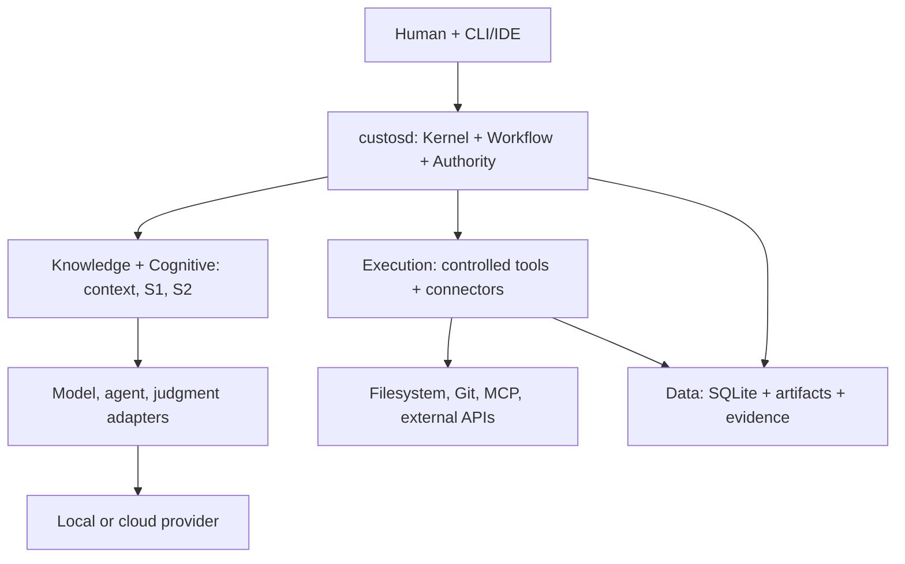
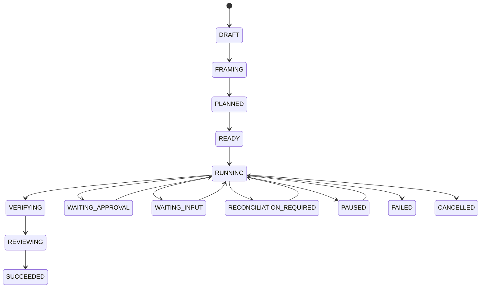

# CUSTOS — MASTER PRODUCT, RUNTIME, DOMAIN PACK & REPO ARCHITECTURE V8

> **Status update (2026-09-27):** Retained V8 design baseline, not an implementation certificate or the sole active navigation source. The [documentation hub](README.md) separates accepted decisions, target architecture, code-backed status and active work. Cross-team snippets below remain proposals until versioned contracts and maintainer decisions accept them.

**Date:** 2026-09-24  
**Document Type:** Product and system design for discussion, delegation, and AI handoff documentation.  
**Input Sources:** V7 document submitted by user, Custos Handoff V6.1, architectural diagrams, source inventory as of 2026-09-23, and original technical references.  
**Evidence Status:** The inventory describes files and line counts, **but lacks** an actual code checkout to execute or verify behavior. The directory trees below separate `[EXISTS]` and `[PROPOSED]`. All snippets/schemas serve as reference designs and do not overwrite existing JSON Schemas.

---

## 0. Conclusions on User V7 and V6.1 Baseline

V7 significantly elevated the design quality by introducing a failure catalog, repo intelligence levels, distinction between locator/support for research, an external-action protocol for the Assistant, and release gates. V6.1 was stronger regarding UX workflows across six usage modes, cross-pack interactions, contracts, and cautious handling of source states. V8 retains these strengths and corrects points that could lead the coding team toward an incorrect architecture:

| Point in Previous Version | V8 Decision | Rationale |
|---|---|---|
| `money × tokens × time × human attention × P_failure × recovery cost` | Separate metrics; use a **weighted sum** after unit normalization or apply Pareto under hard constraints. | Quantities with different units cannot be multiplied into a meaningful "total cost". |
| `S1` includes hard policy, schema validation, and path canonicalization. | **Rules** can be part of the decision process, but **Authority/validators retain policy ownership**; S1 only returns a bounded judgment. | Prediction must not become authorization. |
| Hardcoded `S1 <50ms`, headroom `20%`, monitor `85%`, health TTL `60s`, retry `3` | Converted to **configurable hypotheses** with p50/p95/eval per machine/Pack. | Cannot guarantee these thresholds across local/cloud backends and varying model sizes. |
| "If one candidate exists, auto-select it." | Auto-select only if it aligns with user pins, data rights, cost caps, workflow previews, and explicit auto-route preferences. | The existence of a single viable option does not imply user authorization. |
| "Multi-agent uses 10–15x tokens", "peer bus is O(n²)", "reduces cost by 40–60%" | Not treated as universal facts; the baseline design will measure token usage, time, success, and human attention independently. | These numbers vary by task; there is no direct evidence for Custos yet. |
| Every approval must hash the exact payload. | **Grants can be scoped** for low-risk repetitive behaviors; **exact payload hashes** are reserved for external/irreversible or sensitive actions. | Vibe coding would stall if every test/patch within a granted scope required re-approval. |
| Snapshotting an old repo increments the Task revision. | Separated into `TaskContractRevision`, `PlanRevision`, `WorkspaceSnapshotVersion`, and `ArtifactVersion`. | Repo changes don't necessarily alter goals/acceptance. Stale inputs pause/rebase a step, rather than automatically rewriting the user's contract. |
| "Verifier must always be a different provider." | Independent test/build or citation verification when available; using a different model reviewer is optional based on risk/budget. | No need to spend money switching models for every diff; limited independent snapshots/reviews are possible within the same provider. |
| "Repro before" for all bugs, "human satisfied" for read-only. | Conditional: if irreproducible, it must state `not_reproduced`; read-only completions require acceptance/verified anchors per the Task Profile. | Avoids simulating false evidence and completions based on ambiguous feelings. |
| Every effect runs through the Gateway. | Only claims **Custos-controlled effects**; native external agent tools may bypass it. Adapters must report their control mode. | Cannot promise to absolutely block an external runtime if it cannot be intercepted. |
| Seven planes illustrated as Integration below Execution and Data at the bottom. | Planes represent **responsibility boundaries**, not a strict top-down call hierarchy or rigid dependency DAG. | Storage is an adapter called by the Kernel; ToolPort connects Execution, but not every call traverses all planes. |
| Research "test pass/fail is ground truth"; Assistant is the only Pack with irreversible consequences. | Engineering tests only observe partial behavior; Git push/deploy also exert external effects. | Evidence always has scopes/limitations; the same policy model applies to all three Packs. |

**Product Decision:** Custos is a **local-first Human-Centered Agentic Work Runtime** for a single developer. The three Packs (Engineering/Coding, Research, Assistant/Personal) share the Task Kernel, permissions, state, evidence, context, and UI. Users can opt for a single model/coding agent and proceed step-by-step; automated multi-agent capabilities are optional. 

---

## 1. Product Model and Techno-Economic Goals

### 1.1 The Problem Being Solved
Users juggle Codex/Claude/local models, repositories, notes, and documentation. Work spans multiple sessions, tools, and days. A chat session loses past decisions; a new provider misunderstands the exact repo snapshot; "done" answers lack receipts; tools overstep their bounds; users manually bridge research → coding → status updates. Custos introduces a **Task with an identity and contract** encompassing the session, workers, side effects, and outcomes.

### 1.2 Observable Value
A `Task` features: goals/acceptance criteria, input sources/snapshots, Pack/task type, mode, preferences, scope, privacy/egress, cost/time caps, plans/steps, grants/approvals, artifacts/evidence/decisions, and outcomes. Resuming work doesn't require a new model to "remember" chat history; it receives a `ContinuationPacket` referencing saved states and outputs. Humans can pause, steer, pin models, change workflows, alter goals (creating a revision), revoke permissions, and decide on acceptance.

### 1.3 Two Modes, Five Independent Knobs

| Mode | Driver | Behavior | Key Metric |
|---|---|---|---|
| Assist / Vibe | Human, turn-by-turn | Fast path to an answer or useful patch, waits for human when needed. | Measure **Custos overhead** and first useful response; no promise of a 2–4s model response. |
| Delegated | Kernel runs workflow within authorized scope | Pauses at checkpoints; hands over artifacts/evidence. | Total outcome, cost, attention, and recovery. |

### 1.4 Invariants and Established Limits
- Humans decide goals, scopes, preferences, escalation, and policy-required approvals; S1/S2 cannot grant permissions to themselves.
- Task, Plan, and Workspace snapshots are **three distinct versions**; they are not merged into a single revision number.
- A Task can lock to a specific provider; model switching only occurs with user permission and at safe points.
- Packs request capabilities; Authority checks policy/grants, Gateway executes controlled actions and saves receipts.
- Completion only affirms acceptance criteria confirmed by appropriate verifiers/human evidence; unchecked areas are marked `unknown/unverified`.
- Prompts inside repos, documents, web pages, or emails are treated as data, not policy instructions.
- Local-first means state/artifacts default to the local machine; cloud calls require egress policies and valid selections.

---

## 2. System: Responsibilities, Deployment, Dependencies

### 2.1 Logical Architecture (Plane = Ownership)

**Experience:** CLI, VS Code, potential local UI; handles Task creation, timeline, approvals, diff/source views, cost, status.  
**Task Control:** Kernel, workflow compiler/runtime, authority, budget, recovery, pack loader.  
**Cognitive:** S1 Judgment Registry and S2 workers/proposals.  
**Knowledge:** Repo/doc indexing, scoped memory, ContextCompiler.  
**Execution:** Tools/connectors/sandboxes and receipts.  
**Integration:** Ports/adapters for providers and protocols.  
**Data & Evidence:** SQLite authoritative events/projections/outbox; content-addressed artifacts; acceptance mapping.

### 2.2 Initial Process Topology

| Process | Caller/Plane | Input/Output | Writes to Task DB? | On Crash |
|---|---|---|---|---|
| `custosd` (Rust) | CLI/VS Code via local API | commands, queries, event stream | **Sole authoritative writer** | task/step recover from persisted state, reconcile uncertain effects. |
| `custos-cli` (Rust) | Human/terminal | Local API, approval/diff display | No | Reconnects, Task is not lost. |
| `custos-vscode` (TS) | Human/IDE | Local API, Task events, workspace selection | No | Reloads from server; respects Workspace Trust. |
| Provider adapter (Rust)| `custosd` | Model/agent events, capabilities | No | Timeout/cancel/restart via provider semantics; cannot auto-mark Task success. |

### 2.3 Standard Integration Ports

| Port | Standard Calls and Outputs | Requires Probe/Conformance |
|---|---|---|
| `ModelPort` | `infer/stream(structured_context, model_id, budget)` → chunks/response/usage | response schema, context limits, exposed tool usage, accounting/egress. |
| `AgentRuntimePort`| `start/resume/steer/pause/cancel(worker_request)` → agent events, tool intents, native approvals | session mapping, stream ordering, native tool interception, true pause/resume. |
| `JudgmentPort` | `judge(DecisionCase)` → bounded answer/confidence/abstain/backend provenance | calibration by class, deadline, missing data handling, output schema. |
| `ToolPort/ConnectorPort`| `execute(ActionIntent, Permit)` → `ExecutionReceipt`/uncertain | scope/effect classification, idempotency/reconciliation, OS support. |
| `ArtifactStorePort`/`TaskStorePort`| persist/retrieve hashes + transactional events | crash, corruption, migration, backup/restore scenarios. |

### 2.4 Three Levels of Provider Agent Control

| Adapter Mode | Custos Capabilities | UI Disclosure |
|---|---|---|
| `custos-mediated` | All actions are returned as intents and routed through Authority/Gateway. | Enforced for integrated tools/actions via conformance testing. |
| `provider-governed` | Provider executes tools using its own hooks/native approvals/sandboxes; Custos observes and sends rule/steer feedback when supported. | Explicitly state which tool classes might not be intercepted by Custos. |
| `observe-only` | Monitors events and outcomes, can stop sessions but cannot guarantee blocking initiated effects. | Do not label these effects as "Custos secured tool". |

---

## 3. Kernel/Domain Model Sufficient for Modularization

### 3.1 Entities and Ownership

| Object | Required Design Fields | Owner |
|---|---|---|
| `TaskContract` | `task_id`, `contract_revision`, goal, acceptance predicates/verifier, input refs, workspace binding, data/egress scope, permissions, cost/time, mode/provider pin | Human via Kernel. |
| `WorkspaceSnapshot`| repo dirty state, commit/tree hash, related file hashes, doc versions, capture time | Knowledge/Pack. |
| `PlanRevision` | plan ID/version, `TaskContract` version, steps/dependencies, conditional/loop caps, required grants, snapshots, checkpoints | Workflow compiler; proposed by S2/human. |
| `WorkerRun` | role, objective, output schema, context hash, provider/adapter handle, budget reservation, stop/cancel, grant reference | Workflow Runtime. |
| `DecisionCase` | bounded question, candidate IDs, sanitized context refs, deadline, version; output abstain + provenance | Cognitive. |
| `ActionIntent` | exact effect/target/payload or requested scope, input/precondition hash, idempotency token, initiator, resource estimates | Worker/Gateway. |
| `Grant/Permit` | issuer/principal/task/run, resource scope, effect class, limits, expiration/revoke, approval mode | Authority. |
| `Receipt` | action/attempt IDs, outcome success/failure/unknown, before-after/external ID, timestamp, reconciliation metadata | Gateway/connector. |
| `Evidence` | evidence type/source/ref/verifier/version/freshness/limitations, mapped to acceptance | Evidence Engine. |
| `OutcomeBundle` | criteria coverage, artifacts, receipts, unresolved risks, costs, lineage, human decision | Kernel. |

Approval styles: `read-only no prompt` if policy grants read scope; `scoped grant` for isolated worktree testing/editing or bounded tasks; `exact-action` for emails, publishing, deploying, deleting, or external data movement. Hash payloads (canonicalized, including recipient/attachment/target) are used for exact-actions. 

### 3.2 Event/Command Lifecycle and Failure



**Recovery contract:** In a single DB transaction, write event/projection/outbox and expected version; worker lease + heartbeat does not guarantee exactly-once execution. Persist intent/idempotency IDs before triggering the effect. If a crash occurs between an effect and its receipt, hold as `unknown` until reconciled.

### 3.3 Completion is a Predicate, Not a Model's Answer
`Criterion {id, definition, verifier_kind, required_evidence_class, freshness_rule, review_policy}`; verifiers return `(passed | failed | unknown | not_applicable, refs, limitations)`. A Research criterion "claim is supported" isn't passed merely because a link exists; a Coding criterion "build passes" requires an exit code and snapshot hash; an Assistant criterion "sent" requires an external receipt, not just a draft.

---

## 4. Workflow Compiler, Human × S1 × S2 and Branches

### 4.1 Workflow Creation by User Choice

| Source | Example | Plan Initiator | Commit Conditions |
|---|---|---|---|
| Manual/vibe | "Scan this file and propose a patch" | Human step-by-step | Step confines scope to Task limits. |
| Pack template | `engineering.bug_fix`, `research.lit_review` | Pack declaration | Kernel validates schema/permissions/snapshot. |
| User-authored | Drag/drop or YAML typed blocks | Human | Compiler checks DAG/loops/capabilities, previews version. |
| Suggested | Broad user goal → S1 selects profile; S2 constructs PlanProposal | S1/S2 proposal | Human reviews/edits if it exceeds pre-authorized scope. |
| Adaptive | Verifier failure or context change | S1 routes; S2 proposes amendment | Kernel versions plan and rechecks grants; human involvement if scope expands. |

### 4.2 Dispatch Decision: Policy before Judgment
1. Human pin/preference + TaskContract/privacy/egress/hard budget → **Authority & deterministic validators** eliminate invalid backends.
2. Context preflight builds a mandatory ContextPack, estimating tokens, sensitivity, and freshness; capability registry finds healthy capable backends.
3. If deterministic paths meet criteria, no model is called. For remaining trade-offs, S1 provides bounded typed judgments + abstentions.
4. Kernel selects a WorkerRun based on hard constraints and configured utility. If a complex plan is needed, S2 builds a PlanProposal/Amendment.
5. Dispatch + stream progress; actions hit Authority/Gateway; receipts/evidence return to Kernel.

### 4.3 Plan Amendment and Human Checkpoints

| Change Scenario | Handling Mechanism |
|---|---|
| Retrying malformed JSON (no effects, within cap) | Bounded retry on same backend, log error. |
| Index goes stale/inputs change | Pause step, refresh snapshot, validate impact; contract goal remains unless user alters it. |
| Context/provider shift within authorized policy | Safe point + handoff packet + budget/capability recheck, create PlanRevision if semantics change. |
| Verifier failure | Bounded fix loop; notify human if unresolvable. |
| Adding write targets, network egress, recipients, secrets, or exceeding budget | New plan proposal + Authority/human approval; waits if unauthorized. |
| Unknown external effect / conflict source / policy violation | Block, reconcile, or invoke human arbitration. |

---

## 5. Context, Memory, Evidence, Security, and Cost

**Context:** Immutable `ContextPack` bound to Task/step/worker; hard includes goals/acceptance/policy/active state. Progressive disclosure (workspace→package→symbol→snippet→full file). Never inject out-of-scope secrets/repos into prompts.

**Memory:** Scratch ephemeral; task decisions; project conventions/ADRs; domain procedures; personal preferences. "Continuations" rely on Task state + artifacts; long-term memory is a separate layer.

**Evidence:** Deterministic hash/schema, actual tool receipt/test/build, source locator, support judgment, observation, human acceptance, model assertion. Outcomes display pass/fail/unknown against acceptance criteria.

**Security:** Repo/web/PDF/email/tool results are untrusted; injections can mimic instructions. OS-level paths/symlinks/reparse points/TOCTOU, argv/shell interpolation, environment/secrets, network redirects, and access controls must be verified. A `worktree` separates patches/merges but doesn't guarantee safe code execution; sandboxing handles that.

---

## 6. Domain Pack Framework: Custom Workflows, Agents, and UI

### 6.1 What is a Pack?
A Pack is a **versionable declarative business package**: `manifest`, task catalog/profiles, workflow templates, role profiles, S1 question packs, context recipes, capability *requests*, artifact schemas, evidence/verifier profiles, UI projections, evaluation fixtures. Packs do not contain perpetual chat personas, custom Task DBs, or self-granting mechanics.

### 6.2 Cross-Pack Protocol
`SubtaskRequest {parent_task_id, target_pack, goal, accepted_artifact_refs, data_class, proposed_scope, budget, acceptance}`. Kernel evaluates contracts/permissions, creates an independent child Task, and maps outputs like `ResearchBrief`, `EngineeringBrief`, `PatchSet`, `ExperimentReport`, `OutcomeSummary`, `DraftMessage`. Children do not inherit default grants. Parents receive the `OutcomeBundle` with lineage.

---

## 7. Engineering/Coding Pack: Full Domain Architecture

### 7.1 Product Jobs and Boundaries
Serves developers from repo comprehension to modification and verification. Backed by CLI/VS Code actions; supports local models or provider agents. Does not promise to understand all languages, nor automatically merge/push/deploy just because a task ran successfully.

### 7.2 Levels of Repo Understanding
Ranges from **L0 File Inventory** to **L5 Executed Verifiers**. "Indexed the repo" is not displayed as "Understands the repo"; L5 does not cover all behaviors. ContextPacks include mandatory goals, current diffs, constraints + relevant source/test/log snippets.

### 7.3 Specific Catalog
- `repo_explain`: Deterministic inventory→optional Explorer S2→source map. Answer with source hashes/paths/ranges.
- `bug_fix`: Repro **if possible**→localize→plan→implement→verify→optional review→human integrate. Exact diff; actual test receipts; unresolved risks.
- `feature_change`: Requirement→impact map→plan→patch/docs/tests→verifier→accept. Requirements mapped to tests/artifacts.
- `refactor`: Characterize baseline→worktree patch→run same tests→inspect API. Before/after snapshots and tests.
- `review`: Diff freeze→static analyzers→independent review if justified→triage. Source-anchored findings.

### 7.4 Pair Programming and Delegated Flow Details
```mermaid
sequenceDiagram
    participant Dev as Developer
    participant Task as Task + Coding Pack
    participant Agent as Worker + Provider
    participant Gate as Authority/Gateway
    participant Verify as Verifier
    Dev->>Task: "Fix this", selection, pinned provider
    Task->>Agent: Minimal ContextPack + task contract
    Agent-->>Dev: Hypothesis + source anchors / patch preview
    Dev->>Gate: Scope grant or exact approval
    Gate->>Verify: Apply in isolated worktree; capture receipt
    Verify-->>Task: Test/build result + snapshot
    Task-->>Dev: Diff, criteria, unknowns, cost
```

---

## 8. Research Pack: Knowledge, Citations, and Workflow

### 8.1 Product Jobs, Work Objects, Source Integrity
Jobs: read papers/docs like a colleague, fact-check claims, compare techniques, review literature, design experiments, extract implementation requirements. 
Work objects: `Source`, `DocumentVersion`, `Passage/Table/Figure`, `Claim`, `EvidenceLink`, `Synthesis`, `ResearchBrief`, `NoteProjection`, `ExperimentPlan`.

### 8.2 Subsystems and Task Catalog
Includes SourcePolicy/Discovery, Ingestion/Parsing, Index & Reranker, ClaimExtractor, EvidenceVerifier, Synthesis/Challenge, and NotesBridge. Task types span `paper_reading`, `fact_check`, `literature_review`, `technical_comparison`, `research_to_spec`, `reproducibility_review`, and `living_brief`.

### 8.3 Obsidian/Notion/Zotero and Knowledge Memory
Local-first preference for Markdown + source/artifact hashes. Exports managed sections with stable IDs, citation keys, before/after hashes, and diffs. Imports detect user modifications and prompt before overwriting. 

---

## 9. Assistant/Personal Pack: Privacy, Drafts, and External Effects

### 9.1 Product Jobs and Data Boundaries
Assists with personal planning tied to dev work: recapping current efforts, summarizing Task outcomes, meeting notes, follow-up reminders, email/message drafting, schedule proposals. Default state is `draft/read/propose`. Assistant does not indiscriminately scrape all repos/vaults/emails.

### 9.2 Full External-Action Protocol
1. Resolve identities/timezones/attachments **before** previewing. 
2. Drafts are bound to exact bodies/targets/attachments and linked source refs.
3. Authority evaluates effects/budgets/policies; exact-action approvals tie to canonical payload hashes, expirations, and Task revisions.
4. Gateway executes via idempotency keys if supported, saving external IDs and returning receipts (`success/failure/uncertain`). 
5. Timeouts/unknowns prevent blind retries, triggering reconciliation loops.

---

## 10. Multi-Pack End-to-End Flows

### 10.1 One Provider, Vibe Coding, Task Resume
Human selects provider/file → Kernel spawns `bug_fix` → ContextCompiler reads snapshot → WorkerRun processes via ModelPort → Authority approves edit scope → Gateway executes test in worktree → Evidence mapped → Human reviews. Restarting the app retains the plan/diff/decisions.

### 10.2 Research → Prototype → Note → Assistant Draft
Research Task parses DocVersion → generates claim table → Human confirms ResearchBrief → Engineering child Task takes Brief+excerpts → prototypes via worktree → ExperimentReport fed back to Research → updates claims and Obsidian note proposal → Assistant drafts an update email using the OutcomeSummary → exact approval → send. 

---

## 11. Repo Architecture: From Current Checkout to Final Destination

```text
custos/
├── Cargo.toml                            [E] Rust workspace
├── apps/
│   ├── custosd/                          [E→] composition root, authoritative writer
│   ├── custos-cli/                       [E→] CLI interface
│   └── custos-vscode/                    [E→] VS Code UI / API client
├── crates/                               [E→] core domains, kernels, gateways, context, evidence
├── adapters/                             [E→] providers, judgments, tools, sandboxes
├── domain-packs/                         [E→] engineering, research, personal YAMLs
├── schemas/                              [E] versioned protocol JSON schemas
├── tests/                                [E→] contract, e2e, crash, fixtures
├── docs/                                 [E] canonical, security, ADRs
└── dev_docs/                             [E] team notes
```

`core-domain` holds pure types. Runtime logic accesses capabilities via traits/ports, remaining ignorant of specific providers like Claude/Ollama. TS/Python sidecars communicate via validated JSON Schema IPC. Local deployment targets a single Rust process on an M2 Pro, with opt-in children. Start with read-only capabilities (`repo-explain`), advance to controlled writes (`bug-fix` with worktrees and receipts), layer on Research, and finally Assistant external sends.

---

## 12. Team Ownership: Specifics Including Architecture Review

| Component/Area | Vĩ (Lead AI/Product) | Vinh (SE Systems/Scale) | Trường (SE App/Client) |
|---|---|---|---|
| Task semantics/product/acceptance | **Own** | Review lifecycle | Review consistency |
| Workflow DAG, leases, recovery | Co-implement | **Own** | DB/outbox review |
| Kernel, gateway, SQLite, local API | Product approval | Concurrency review | **Own** |
| CLI/VS Code UI/packaging | UX acceptance | Sidecar process help | **Own** |

Vĩ leads Product/AI definitions; Vinh solves multi-agent scaling and persistence semantics; Trường manages the platform trust boundary and client experiences.

---

## 13. Risks, Failure Modes, and Handling
Failures span unverified model assertions, stale snapshots, scope creep, missing handoff data, verifier biases, effect crashes, write conflicts, memory staleness, prompt injection, and provider bypasses. Responses include holding gates, rebasing snapshots, triggering PlanAmendments, reconciling external IDs, and isolating untrusted workspace data from system instructions.

---

## 14. Real Evaluation/Release Gates
Gates range from **G0** (Source audit) and **G1** (`repo_explain`) to **G7** (Cross-platform checks). Statuses progress through `PROPOSED`, `IMPLEMENTED`, `VERIFIED`, and `AVAILABLE`. Metrics mandate tracing `verified_task_success`, overhead, and failure recovery rates alongside critical negative testing.

---

## 15. Verified References and Deduced Conclusions
Documented behaviors from Codex App Server, Claude Agent SDK, LangGraph, SQLite WAL, MCP, VS Code APIs, Obsidian Vault API, and Notion API map to specific Custos implementations.

---

## 16. Handoff Block for Another Model / First Pull Request

> Read this V8 document alongside the actual source checkout. Custos is a local-first, human-governed Task runtime featuring 3 Packs (Engineering/Research/Assistant), bounded S1 multi-backend judgment, deep S2 work per WorkerRun, and human-held goals/authority. Plans, TaskContracts, and WorkspaceSnapshots carry separate versions. Authority validates policy/grants, Gateway secures controlled side effects/receipts, and Evidence maps to acceptance criteria. Verify current code behavior before writing logic; select one vertical slice, one owner, one verifier, and one failure case. Do not stub the entire proposed `[P]` tree with placeholders.

**Final Product Statement:** Custos transforms AI from an unstructured chatbot into a professional collaborator—operating within defined workflows, producing verifiable reports, and adhering to organizational discipline.

---

## 17. Reference Implementation Contracts for Issue Separation and Testing

### 17.1 Command, Event, Progress, and Sidecar Envelope
Envelopes encapsulate `message_id`, `task_id`, `contract_revision`, `plan_revision`, and `sensitivity`. Commands leverage `idempotency_key` to avoid duplicate triggers. 

### 17.2 Proposed Minimum Local API
Includes `CreateTask`, `ProposePlan`, `ApproveAction`, `Start`/`Pause`/`Cancel`, `StreamEvents`, `GetArtifact`, and `PreviewWorkflow`. Bound strictly to local auth.

### 17.3 Minimal Task and WorkflowDefinition Example
YAML definitions separate `acceptance` criteria, `workspace_snapshot`, `approval_profile`, and `steps` comprising discrete `kinds` (deterministic, tool, deliberation, human) alongside `requested_effect` annotations.

### 17.4 DDL/Migration Concept
SQLite tables mirror ownership (`tasks`, `task_events`, `plans`, `action_attempts`, `outbox`, `evidence`). Enforce constraints via composite keys and avoid storing large JSON or secrets directly in metadata columns.

### 17.5 Three-Tier Capability Matrix
Differentiate capabilities by: Static adapter declarations (code), Runtime probed states (health/ttl), and Empirically measured behavior (benchmark success/interception).

---

## 18. Cross-Platform and Local-First Operations
Core capabilities target macOS, Linux, and Windows. Sandboxing requires distinct implementations per OS (Seatbelt, Bubblewrap). Graceful fallbacks manage disconnected or offline local LLM usage.
