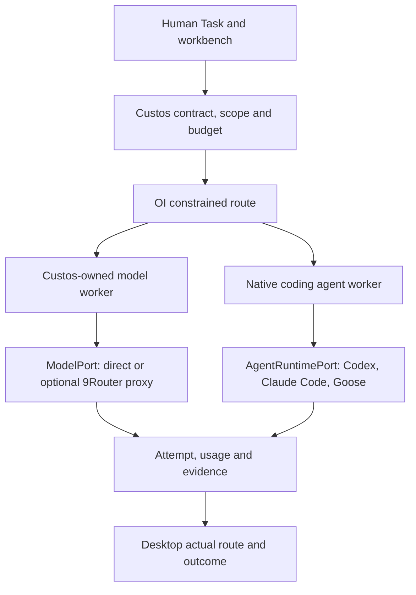
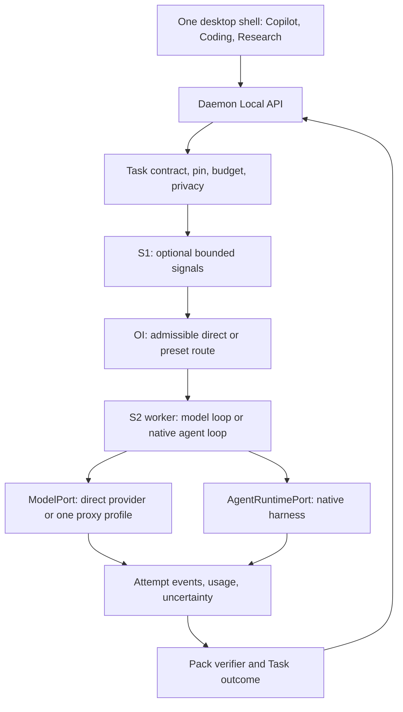

# 9Router source-to-product integration plan for Custos

**Status:** implementation proposal, not a claim that routing or savings are shipped. Source inspection: local `decolua/9router` at `ce4460ef79382bfddb4aa5fc0ff9f3cb0d5f95a8` and Custos at `d82cc378f3dfdbd9f39e40a459189f2a1efc10bb` on 09 October 2026. Nexus indexed the 9Router checkout into a disposable database: 1,590 files and 6,176 text chunks; its JavaScript/TypeScript parser produced **zero AST symbols or call edges**. The file map came from Nexus; the behavior below was checked against source and tests. [9Router source](https://github.com/decolua/9router/tree/ce4460ef79382bfddb4aa5fc0ff9f3cb0d5f95a8) is MIT licensed. Literal reuse needs the original copyright and license notice plus a file-level dependency and behavior audit.

## 0. Corrected mandate: integrate the useful core, not merely connect a proxy

This document answers **what to dissect, what to implement inside Custos, where it belongs, and how a developer experiences it in each workbench**. The previous framing of 9Router mainly as an optional `ModelPort` proxy was too narrow. The target is a first-party Custos **Model Connectivity and Economics capability**: catalog, capability evidence, provider connection health, protocol fidelity, account/model fallback, usage, cost and diagnostics are integrated behind Custos's existing ports and shown coherently across three workbenches. Running 9Router as a sidecar remains an optional interoperability experiment, not the primary plan.

9Router's name `System One` denotes a pass-through HTTP handler for a typed decision payload in `open-sse/handlers/systemoneCore.js`; it does **not** implement Custos S1's calibration, scope constraints, OI topology, or Task policy. Likewise, 9Router's `codex.js` executor is an inference-provider transport, **not** a Codex coding-agent runtime. A user's existing Codex/Claude/Goose subscription and its authorized API/CLI terms need a separate, verified connection path; the plan does not assume tokens can be imported, resold, shared or redirected legally.

**Priority product jobs:** a developer can (1) choose a working direct model or coding agent, (2) understand precisely which capabilities and data egress a task needs, (3) continue during rate limits without violating a pin or corrupting a tool loop, (4) see *actual* spend/usage and why a route changed, and (5) carry selected, source-backed knowledge from Research or Copilot into Coding without silently sending the entire conversation. Provider administration is necessary plumbing, not the primary product screen.

## 1. Product decision

Custos needs a **connection and attempt plane** shared by Copilot, Coding and Research. A provider supplies one model inference attempt; a native coding agent owns a multi-step loop; S1 supplies bounded signals; S2 does the substantive reasoning; OI may choose an admissible route from evidence. A user-pinned model or harness remains the default direct path. A named route preset is an explicit preference, not an invisible model replacement. The Task contract, authority, source provenance, verification and cost ledger remain Custos-owned.

Implement the useful **behavioral core** of 9Router inside the existing Custos domain/provider/runtime/adapters/persistence/daemon boundaries, with the Desktop as its product projection. Copying an upstream module is possible only after a pinned file-level license, dependency, security, compatibility and test audit; conceptual reimplementation is preferred where Task authority or native harness semantics differ. A proxy profile remains optional after this first-party path works. 9Router's Next.js dashboard, credential database, OAuth implementation and `/v1/*` compatibility API do not become the Custos daemon or canonical state. A model proxy cannot control shell/file effects inside a native coding harness merely by forwarding that harness's inference requests.

### Source-to-Custos extraction matrix

The choices below cover the significant 9Router surfaces rather than treating the whole repository as one gateway. `Build` means a Custos-owned feature with upstream source/tests as reference; `Study` means keep out of the product path until the stated need and conformance exist; `Exclude` means not part of the SADE core. No row claims implementation is complete.

| 9Router source / feature | Decision and why it matters to developers | Custos core destination | Desktop destination / workbench use |
|---|---|---|---|
| `providers/registry`, `capabilities.js`, catalog sync and model aliases | **Build:** discover candidate models, distinguish declared/inferred/probed/exercised capability and refresh stale metadata. Name patterns and a safe default cannot prove tool or PDF fidelity. | `custos-provider` canonical model values; `custos-adapters/providers/catalog.rs` and `probe.rs`; daemon catalog projection. | Settings → Models; composer filters models by Coding tools/context, Research PDF/vision or Copilot voice, showing evidence age. |
| `providers/pricing.js`, `/settings/pricing` | **Build:** versioned provider/model price source with cache-read/write and output tiers; never silently equate list price, subscription quota and billed cost. | Adapter price source, runtime estimator, persistence usage ledger. | Estimate before Run; billed/estimated/unknown after Run; per-Task comparison, not a universal “saved $” badge. |
| `executors/*`, `translator/*`, `chatCore.js`, `/v1/responses` | **Build selectively:** native format where possible, translation only where lossless enough for required tools/reasoning/media. | `custos-provider` request/stream contracts; provider-specific `custos-adapters`; conformance fixtures. | Capability detail and precise unsupported/error states in all three workbenches. |
| `chat.js`, `services/provider.js`, `accountFallback.js` | **Build:** account selection, 429/quota cooldown and retry classification. Do not copy text-matching policy as an authority oracle. | `custos-core` admissibility; `custos-runtime` selection; `custos-adapters` transport; persistent health snapshot. | Connection health/cooldown and one-line retry reason on the attempt timeline. |
| `services/combo.js`, `/api/combos`, combo editor | **Build transformed:** a Route Preset is a policy-constrained, versioned choice of *models*, not an opaque model name. No round-robin mid-loop for stateful coding. | Domain route intent; core hard filters; runtime OI; daemon API and persisted revisions. | Advanced Routes editor; simple `Direct / Agent / Route` composer control. Coding shows explicit handoff when harness changes. |
| `services/usage/*`, request logs and request details | **Build:** quota availability, per-attempt usage and diagnostic timeline; raw prompt/response logging is opt-in, redacted and retention-bound. | Adapter quota readers; persistence attempt ledger; daemon query/events. | Global Usage and Task attempt details; Research cost per supported claim, Coding cost per accepted patch, Copilot cost per completed task. |
| `rtk/*`, Headroom, `/v1/responses/compact` | **Study then selective build:** deterministic reduction of repetitive tool logs or source-independent boilerplate may help; preserve raw hashes, exact code/PDF anchors, error output and recoverability. External compressor is not the default. | Runtime ContextPack transform with version and omission record; adapter only for an optional external compressor. | Coding context panel and Research source-coverage panel show what was omitted; opt-in experiment and outcome comparison. |
| Caveman and Ponytail prompt modes | **Exclude as silent defaults:** terse output/minimal code can be user preferences, but prompt injection as universal cost optimization may reduce explanations/tests. | Existing prompt/context recipe, explicitly versioned and pack-scoped if evaluated. | Optional response-style control; never substitute for quality or acceptance evidence. |
| `handlers/systemoneCore.js`, `/v1/systemone` | **Study transport only:** typed decision API can become one S1 backend after calibration. It is not Custos S1/OI architecture. | `custos-runtime/cognitive/s1` typed judgments; one adapter backend; core retains policy. | Usually invisible; route explanation can disclose that a calibrated S1 signal was used. |
| `handlers/search/*`, `/v1/search`, web fetch | **Build as scoped capability where needed:** especially source acquisition for software/AI research; search results are untrusted data, not instructions. | Research pack query/SourceRecord; capability adapters; authority checks egress and privacy. | Research search/corpus ledger; Coding may use docs search only with user scope; Copilot uses web only if permitted. |
| `handlers/embeddingsCore.js`, embedding providers | **Build only for measured retrieval jobs:** embeddings are an indexing transport, not a default model route or proof of relevance. | Index/ContextPack services, embedding adapter and derived index version. | Repo/search result diagnostics in Coding; corpus retrieval coverage in Research. |
| Image/audio/video/TTS/STT handlers | **Study per job:** Research figures/OCR and Copilot voice can justify dedicated media ports; generic image/video generation is not a prerequisite for SADE. | Existing modality-specific contracts/adapters when user jobs require them. | Reader attachment/figure handling, optional voice UI; capability unavailable is explicit. |
| Provider detail, connection rows, availability badge, quota and usage dashboard | **Borrow interaction pattern, not visual code:** account and model health, retry countdown, details-on-demand, truthful empty states. | Daemon state projections backed by real attempts and quota fetches. | One calm Connection Center; compact run chip in each workbench, detailed diagnostics on demand. |
| `cli-tools/*`, endpoint presets and config snippets | **Study selectively:** useful for configuring a native coding harness to use an authorized endpoint, but endpoint wiring is not agent lifecycle control. | AgentRuntime adapter diagnostics and explicit external config export/import. | Coding Agent setup card with detected binary/version, permission assurance and rollback instructions. |
| OAuth refresh, multi-account import, cloud sync, MITM, tunnel, proxy pools, remote deployment, public compatible API | **Exclude from first-party core by default:** high credential/egress/security/maintenance burden; add one verified provider auth flow only when needed. | Optional connectors or supervised sidecars after separate threat model. No bypass of daemon/authority. | Advanced settings only after operational implementation; never fabricated “connected” status. |

### The two paths developers must not confuse



If Custos hosts a local coder **model**, Custos supplies its own agent loop and mediated tools. If Custos launches an external coding **agent**, the harness may own its model loop, tools and workspace; report its actual assurance and usage visibility, and never assume a model proxy controls those effects. A Research worker can use a model plus retrieval/compute tools without becoming a separate remote A2A agent. This distinction is essential for placement of S1, S2 and OI.

## 2. What the current 9Router checkout actually does

| Source evidence | Behavior worth studying | Custos implication |
|---|---|---|
| `src/sse/handlers/chat.js`, `open-sse/services/combo.js`, `open-sse/services/accountFallback.js` | Resolves a model or combo, tries accounts, classifies errors, applies cooldown and may try another model. Combo ordering considers modality needs. | Separate **account failover** from **model change**. Preserve model pin, capability needs, privacy and budget before every fallback. Retry only before a response/effect makes the attempt ambiguous. |
| `open-sse/handlers/chatCore.js`, `open-sse/translator/*`, `open-sse/executors/*` | Resolves source/target wire formats, prefers a supported native transport, translates request and streamed response, sometimes passes through a native client/provider pair. | Write a per-provider fidelity matrix for tool calls, reasoning, images/PDF, cache, usage, cancel, errors and continuity. Never assume “OpenAI-compatible” covers all fields. |
| `tests/translator/golden-request.test.js`, `golden-response-stream.test.js`, `format-roundtrip.test.js` and `tests/unit/*` | Locks request/stream shapes and many provider-specific regressions. | Port **fixtures and test method** where relevant; do not import the entire translator. Custos adapters need conformance cases from real user jobs. |
| `open-sse/rtk/index.js`, `open-sse/rtk/headroom.js` | Optionally compresses tool results; skips some error traces; Headroom has diagnostics for unsupported/unsafe transformations. | Compression is a measured context transform with source digest, omission record and recovery path. Bytes reduced are not billed tokens saved or accepted-task cost saved. Keep the strong S2 model's evidence and tool semantics intact. |
| `open-sse/services/usage.js`, `open-sse/handlers/chatCore/streamingHandler.js` | Fetches provider-specific quota where available and records request/stream usage. | Store quota freshness and usage certainty separately. Unknown provider usage stays unknown; do not turn missing usage into zero. Attribute attempts to Task/Run/step. |
| `src/lib/db/*`, `src/lib/localDb.js`, `src/lib/usageDb.js` | Current source uses SQLite repository modules and a JSON-to-SQLite migration; the latter two paths are compatibility shims. | The upstream `docs/ARCHITECTURE.md` still describes JSON files and is stale for this checkout. Custos keeps its own SQLite schema, durability profile and migration ownership. |
| `src/app/(dashboard)/dashboard/providers/*`, `usage/*`, `src/app/api/*` | Dashboard and management APIs for accounts, models, combo and usage. | Borrow progressive disclosure and diagnostic concepts, not a second settings database or a second control plane. |

**Limits of this audit:** one checkout and its source/tests were inspected; live OAuth terms, provider quotas, current prices, production behavior and any advertised token-saving percentages were not independently measured for Custos. Some 9Router fallbacks use status/text heuristics and its combo code can flatten tool history for a panel model. That is useful for a conversational panel but cannot silently replace a coding worker expecting structured tool calls. Its MIT notice does not decide whether every dependency and credential flow belongs in Custos.

**Pinned reading path:** [model/combo entry](https://github.com/decolua/9router/blob/ce4460ef79382bfddb4aa5fc0ff9f3cb0d5f95a8/src/sse/handlers/chat.js), [combo policy](https://github.com/decolua/9router/blob/ce4460ef79382bfddb4aa5fc0ff9f3cb0d5f95a8/open-sse/services/combo.js), [account fallback](https://github.com/decolua/9router/blob/ce4460ef79382bfddb4aa5fc0ff9f3cb0d5f95a8/open-sse/services/accountFallback.js), [request conversion](https://github.com/decolua/9router/blob/ce4460ef79382bfddb4aa5fc0ff9f3cb0d5f95a8/open-sse/handlers/chatCore.js), [tool-result transform](https://github.com/decolua/9router/blob/ce4460ef79382bfddb4aa5fc0ff9f3cb0d5f95a8/open-sse/rtk/index.js), [quota service](https://github.com/decolua/9router/blob/ce4460ef79382bfddb4aa5fc0ff9f3cb0d5f95a8/open-sse/services/usage.js). These are source references, not an instruction to transplant those modules.

## 3. Custos reality check

| Current source | Verified state | Gap exposed to the user |
|---|---|---|
| `crates/custos-domain/src/provider_config.rs`, `crates/custos-persistence/src/repositories/providers.rs`, daemon `v1.providers.*`, model probe/catalog | Provider configuration and model discovery have a backend path. | Configured provider is not necessarily an executor selected by the Task runtime. Probe is not proof that streaming/tools/usage work. |
| `crates/custos-daemon/src/runtime.rs` | `CUSTOS_PROVIDER` selects one model adapter at daemon bootstrap; default is `FakeProvider`. | Desktop model selection and provider configuration are not yet a per-Run production route. |
| `crates/custos-runtime/src/oi/{candidate_builder,estimator,selector}.rs` | Candidate list and cost/latency numbers are hardcoded. | UI cannot label this calibrated “cost optimized” routing. |
| `ui/desktop/src/context/AppContext.tsx`, `CombosManager.tsx`, `UsageMonitor.tsx` | Combos and Usage are initialized from defaults/localStorage; create/update/delete/reset mutate UI state. | Current combo, quota and cost cards can look operational without daemon-backed execution. `Reset Metrics` changes displayed state, not canonical usage. |
| `AppContext.tsx::handleConnectOAuth` | Builds a local account record with placeholder email, model, latency and “OAuth Active” label; no real authorization exchange. | This action must be removed or shown as unavailable until a verified connector exists. A user must never mistake it for a connected account. |
| `crates/custos-domain/src/run.rs::UsageRecord` | A per-attempt `known / estimated / unknown` value type exists. | Record ingestion, reconciliation and UI projection on the live path still need proof. |
| `crates/custos-provider/src/port.rs`, `custos-core` harness contract | Model attempt and native agent loop have separate ports. | A proxy profile belongs to ModelPort; it does not turn Codex/Claude/Goose into ordinary model endpoints. |

The first corrective UI work is **truthfulness**, before adding more routing controls: default combos, sample usage and fabricated OAuth status must no longer appear as live state. Read-only model catalog may remain useful with `configured / probed / exercised / unavailable` labels.

## 4. Target data and decision flow



The provider choice is recorded as `(task_id, run_id, worker_id, attempt_id, requested_route, actual_transport, actual_provider, actual_model, reason, policy_version)`. A proxy may return the model name it used, but Custos must preserve both requested and observed identities. If a native agent controls its own inference, record its reported model/usage and mark unavailable fields unknown. The route decision must include alternatives rejected by hard constraints, not only the winning model.

### Four distinct connection objects

1. **Provider connection:** endpoint, credential reference, account identity, verified capabilities, health and quota freshness. Secrets stay in the OS credential store or another explicitly selected secure backend; UI receives masked metadata.
2. **Model catalog entry:** provider/model/version, supported modalities and tools, context/effort/cache/stream/usage/cancel capabilities, observed timestamp and evidence source. A probe result is provisional until an exercised fixture confirms it.
3. **Route preset:** user-editable ordered admissible candidates, reason for fallback, task-kind applicability, max spend/latency, model-pin behavior and consent for provider/egress changes. Use a distinct name such as `Fast draft` rather than “model” if it can switch models.
4. **Agent connection:** binary/API version, workspace ownership, approval/tool visibility, cancel/resume, usage and assurance coverage. It is shown next to model connections but runs through AgentRuntimePort.

Account failover can keep the same model if policy permits. Model change requires a new attempt and an explicit route rule; it must not violate a user pin, local-only setting, required tool/modality, budget or privacy scope. After stream bytes, tool calls or a side effect have begun, mark the first attempt partial/uncertain and reconcile before any repeat. A 400 for malformed input or context overflow should surface to the user/developer, not disable healthy credentials. Health cooldown is per connection/model/reason with an expiry; it is not Task completion.

## 5. S1, S2 and cost work that matters for developers

| Job | S1 can help | S2 must retain | Cost gate and evidence |
|---|---|---|---|
| Explain a symbol or navigate a repository | Exact search, symbol/test map, source ranking, context budget and stale-source detection | Interpret behavior and answer nuanced follow-ups | Compare source-anchor recall and answer quality with direct strong model; record omitted context. |
| Debug/patch/refactor | Reproducer detection, changed-path/test selection, independent read-only scouting and risk **signal** | Diagnose, edit and reason through multi-step code/tool loop | Reuse exact snippets and targeted tests; hidden/trusted behavior checks, patch/base hash and human review remain acceptance. |
| Research for software/AI/data | Source dedup, passage ranking, numbers/units extraction and contradiction candidates | Scientific interpretation, synthesis, experiment design and uncertainty | Measure supported-claim quality and reviewer time, not only retrieval tokens. Preserve source version/parse gaps. |
| Personal assistant | Identity/time ambiguity detection and bounded read-only retrieval | Draft and negotiate with human | Exact recipient/payload permission and outbox remain in core; no cheap model may auto-send. |

S1 is optional on the hot path. Deterministic rules and local retrieval run first; a calibrated model judgment may help when expected value warrants it. S1 cannot decide permission or replace source-backed reasoning. The native coding agent keeps its loop and workspace context; Custos coordinates the bounded WorkerRun around it. For a local coder model, Custos's own worker loop gives it tools, context and lifecycle; the model endpoint alone is not an agent.

Economics should start with four independent levers: scoped context, cache-aware prompt construction, same-capability account fallback and measured route presets. Tool-result compression is a later opt-in experiment: record raw and transformed digests, preserve errors and exact source references, and evaluate accepted outcomes. Provider quota and subscription balance are availability signals; they are not equivalent to USD price, allowed commercial usage or guaranteed free inference. Price tables need source, currency and freshness; billed, estimated and unknown usage must be separate.

## 6. Desktop experience across three workbenches

**Global connection center:** one Settings area with tabs `Models`, `Coding agents`, `Routes`, `Usage`. Models shows provider/account status, real authentication mode, secret status, probe result, capability evidence and last health check. Coding agents shows actual harness binary/version, workspace mode, approval/tool interception and usage visibility. Routes shows the policy before activation: eligible task kinds, ordered candidates, model pin behavior, fallback conditions, egress change and expected range. Usage shows per-Task and per-attempt cost with `billed / estimated / unknown`, latency and quota freshness. There is no fake “healthy”, “OAuth active”, “live monitored”, fixed latency or reset of canonical history.

**Shared composer:** show `Direct: provider/model`, `Agent: harness`, or a named route preset. User can pin the route/executor for this Task. Expand for maximum spend, local/cloud data scope and expected capabilities. Once a run starts, a compact actual-route chip opens the attempt timeline. If fallback changes provider or model, the timeline shows why, when and what context crossed the boundary.

**Coding:** keep chat plus repository/diff/test/worktree panes. Show the actual harness and whether Custos mediated or merely observed each tool effect. A route preset applies to Custos-owned model calls; a provider-governed native harness is not silently remapped by the model gateway. Offer an explicit `Continue with...` handoff with source/patch/decision packet if the user changes harness.

**Research:** keep library/reader/claim/experiment panes on the same Task. Route presets can favor long context, PDF/vision or local-only work only when those capabilities are verified. Show which model read which source revision and which claims remain unverified. A cheaper synthesis step does not weaken claim verification.

**Copilot/Assistant:** draft quickly when safe; display recipient and outbound payload before effects. Shared Task history remains available across workbenches, while the next model receives only selected and privacy-checked context. The connection center is global; Task scope and effect consent remain local to the work.

### Desktop information architecture and empty/error states

The shell stays typography-first. A compact executor control in the composer conveys the selected path; color is not the sole identifier. Coding keeps a muted blue workbench cue, Research a muted teal cue and Copilot a warm-neutral cue in the title/icon and small active indicator. The conversation remains the center; secondary panes are contextual, resizable and dismissible, not permanent dashboards. The global connection center is discoverable from each workbench but never changes Task permissions by itself.

| Surface | Primary interaction | Secondary disclosure | Failure/empty state |
|---|---|---|---|
| Composer | Choose `Direct`, `Agent` or named route and see local/cloud scope before Send. | Model capabilities, max spend and context/source selection. | No usable executor: disable Run with setup link; do not fall back to FakeProvider in production. |
| Attempt timeline | Show actual model/harness, running/partial/failed/unknown and cost certainty. | Candidate rejection, retry reason, usage provenance and stream diagnostics. | Disconnected client resumes by event cursor; never create a second attempt merely to repaint UI. |
| Coding | Chat, files, diff, tests and worktree share the Task anchor. | Tool/effect assurance and harness-owned hidden state limits. | Missing test or external effect receipt is `unknown`, not green completion. |
| Research | Chat, library, source reader, claim matrix and experiment outputs share source revisions. | Passage/parse coverage and model-to-source trace. | Missing PDF page/OCR table or invalid citation produces visible gap, not silent synthesis. |
| Copilot | Conversation, draft and exact pending effect. | Identity evidence, calendar freshness and outbox timeline. | Ambiguous recipient or uncertain send blocks repeat until resolved. |

Cross-workbench `Continue in Coding/Research/Copilot` creates a scoped continuation packet: selected turns, source/artifact references, criterion status, omissions and privacy redaction. The target workbench previews what will transfer. It does not move a native agent's inaccessible hidden state, copy a grant or imply that its previous model saw the entire chat history. History remains navigable in the origin lens even when only selected context is compiled for the next S2 attempt.

### Three complete developer journeys that drive the design

1. **Coding — patch a failing test while a provider is rate-limited.** The user selects Codex-as-agent or a Custos-owned model worker and sees the difference before Run. The repo snapshot and required structured tools constrain candidate models. If a direct model call returns 429 *before* output, same-model account fallback may occur within the grant; model change requires a route preset and a new attempt. If a native harness owns the inference calls, Custos cannot secretly replace its model. The timeline shows cooldown, actual executor, diff/test evidence and any provider-governed effects. Worktree/test panes do not become 9Router panels; they are Custos Task artifacts.
2. **Research — compare AI/data papers and turn one finding into code.** Search and PDF acquisition create versioned SourceRecords. Capability admission rejects a text-only model for native figure/PDF interpretation unless a separate parser/vision step is explicitly selected. S1 can rank passages or flag contradictory measurements; S2 interprets and writes claims with support status. The user selects claims for `Continue in Coding`; only those source references and caveats enter the coding ContextPack. Provider cost is shown per supported claim, while unknown OCR/semantic support remains visible.
3. **Copilot — chat, then draft/send a status update.** The fast direct model path handles ordinary conversation. A route preset can draft with a cheaper model only if privacy/egress and quality checks allow it. `Continue in Copilot` from an accepted Coding Task transfers a redacted outcome, not repository secrets or send permission. Identity resolution and exact payload approval precede dispatch; any model/account failover cannot repeat an uncertain send. Usage is attributed to drafting versus the external effect.

Navigation should therefore be `workbench → Task/session → contextual resources`, not `provider dashboard → task`. The Connection Center is global settings, reached from the composer or Preferences. Its five tabs are `Connections`, `Models`, `Routes`, `Usage`, `Diagnostics`. `Connections` distinguishes API models from native agents and shows the auth method actually implemented; `Models` shows capability evidence; `Routes` previews hard exclusions; `Usage` shows attempts and economic certainty; `Diagnostics` contains redacted request/stream errors and conformance probes. Search, embedding and media services appear as scoped capabilities, not interchangeable chat models. An empty installation invites one real connection and one test, not demo accounts or sample savings charts.

### Proposed Local API slice, not an implemented contract

Use existing versioned bridge envelopes and command IDs. The first projection can be intentionally small: `ListConnections`, `GetConnection`, `ProbeConnection`, `ListExecutors`, `StartRun(executor_selection, task_revision, source_scope, budget)`, `GetRun`, `WatchRun(after_seq)` and `ListUsage(task_id)`. `CreateRoutePreset`/`UpdateRoutePreset` enter only in Packet D. `ConnectAccount` is absent until a real auth adapter and secure credential lifecycle exist. The daemon returns capability evidence and a source status, not a frontend guess.

An attempt event should carry `attempt_id`, Task/Run/worker IDs, requested and actual executor identity, selected connection, transport, timestamp, state, usage certainty, error class and route reason. Stream deltas can be ephemeral; attempt start/terminal/uncertain, model switch, approval and effect outcomes must be durable and replayable. A provider connection probe must report separate outcomes for authentication, plain inference, streaming, tool round-trip, cancellation and usage. Capability `unknown` is not capability `false`, and a successful plain-text probe cannot promote tool use to `verified`.

The backend admits each candidate before dispatch in this order: actor/Task revision, provider egress and data sensitivity, user pin, required modality/tool/cancel fidelity, budget reservation, then health/quota freshness. S1 may rank only survivors; OI chooses a bounded route and records rejected alternatives. Every model change creates a new attempt. If the first attempt emitted output or a tool intent, the continuation policy must determine whether retry is safe; it cannot simply replay the same request against a cheaper model. The user-visible actual-route chip reads these daemon events, never optimistic local state.

## 7. Physical ownership in the existing repository

| Responsibility | Current target | Minimum change |
|---|---|---|
| Connection/catalog/route values | `custos-domain/src/provider_config.rs`, existing Task/Run values | Add fields only with versioned fixtures when a live vertical slice needs them. Distinguish ModelPort from AgentRuntimePort. |
| Hard admission, budget and pin | `custos-core/src/oi/`, authority and budget modules | Check actual candidate capability, scope, privacy and reservation before attempt. Do not rely on string matching such as `harness_id.contains("cloud")` for egress. |
| S1/OI candidate, estimate, route and replan | `custos-runtime/src/cognitive/`, `src/oi/`, `src/workflow/` | Replace hardcoded candidate IDs/estimates with capability snapshots and measured ranges; retain direct baseline. |
| Provider/proxy/agent transports | `custos-adapters/src/providers/`, `src/harness/` | One direct model conformance path first; optional 9Router proxy as a separate ModelPort profile; native harness stays separate. |
| Connections, attempts, usage and health | `custos-persistence` repositories/migrations | Durable canonical records and source/freshness; no token/plaintext in UI projection. |
| Composition and Local API | `custos-daemon` | Resolve selected connection at run time, enforce actor/policy, normalize events and report requested vs actual executor. |
| Desktop projection | `ui/desktop/src/context/AppContext.tsx`, `components/providers/`, `components/chat/ModelSelector.tsx`, settings | Replace localStorage demo state with daemon DTOs and explicit unavailable status; keep UI preferences local only. |
| Pack-specific use | `custos-packs/src/{engineering,research,assistant}/` and their source/evidence services | Specify required capabilities and verification obligations; never encode provider credentials or a hardcoded favorite model in pack semantics. |
| Paired fixtures | `tests/contract/`, `tests/e2e/`, `evals/` | Stream/tool/usage/cache/cancel/fallback cases, then same-task quality/cost/latency comparison. |

No new gateway crate is required. This table identifies existing owners, not permission to expose a feature before its acceptance gate. Keep the direct provider path as the conformance baseline. A future standalone 9Router sidecar has one supervisor, opt-in lifecycle, bounded loopback/auth, explicit credential boundary and no access to Custos canonical DB or permit minting.

## 8. Delivery packets and acceptance gates

| Packet | Backend work | Desktop work | Acceptance gate |
|---|---|---|---|
| **A — UI truth** | Return source-labelled connection/catalog/usage capability states from daemon. | Remove demo combo/usage/OAuth claims; display `not configured`, `unavailable`, `probed` and `exercised`. | Cold profile shows no fabricated account, quota, cost or runnable combo; supported provider CRUD still works. |
| **B — one real model attempt** | Choose configured provider at run time, persist attempt/actual model/usage certainty/output and restart view; fail closed without configured executor. | Composer selection and actual route chip show real result/errors. | Same user prompt and source version reach real provider; restart preserves output and identity. |
| **C — connection fidelity** | Exercise one direct adapter across streaming, tool call, reasoning, cache/usage, cancellation and provider errors. | Connection detail shows verified capability matrix and last test. | Golden fixtures and one live opt-in test; unsupported feature is blocked or explained, never silently stripped. |
| **D — route preset** | Account fallback first, then opt-in model fallback with hard filters, attempt boundaries, cooldown and budget reservation. | Route editor preview and attempt timeline; explain candidate rejection and switch. | Model pin/local-only/privacy/tool requirements survive 429/5xx, retries and disconnect; no duplicate side effect. |
| **E — coding agent route** | One structured native harness adapter with workspace/approval/cancel/usage assurance matrix. | Agent connection card plus coding worker timeline; explicit handoff. | Native tool effects are labelled honestly; model proxy cannot claim interception of hidden harness calls. |
| **F — measured optimization** | Context/cache/compression and S1/OI ablations by Task kind; Meta proposes policy version offline. | Cost per accepted Task, quality and latency alongside direct baseline. | Predeclared quality margin and safety gates; report failures, unknown spend and human minutes. |
| **G — optional 9Router sidecar** | After the first-party capabilities above, pin release/SHA and audit license, credential handling, transport fidelity, latency, quota and stream retry behavior. | Advanced connection profile with clear ownership/health. | Same fixtures pass direct versus proxy; no second canonical ledger or hidden route switch. |

Packets A–C establish the first-party model-connectivity core and make the UI trustworthy. D and E serve distinct jobs. F determines which optimizations deserve defaults. G is **only** an optional upstream execution mode after the actual Custos feature transplant; it is not a substitute for A–F. Each packet should update the Custos master decision, topic spec and physical codebase catalog when its contracts or files change.

## 9. First executable work order for the team

1. Read the pinned 9Router modules in the extraction matrix as feature clusters, and record for each selected behavior its exact source, tests, license/dependencies, Custos owner, semantic changes and *one* developer job. In parallel, inventory every UI field in `AppContext`, `ProvidersView`, `CombosManager`, `UsageMonitor` and `ModelSelector`: daemon-backed, local preference or demo.
2. Ship an honest Connection Center and one real direct model path: trace `CreateTask → StartRun → ModelPort → journal`, select the configured provider/model per Run instead of the bootstrap-only default, persist requested/actual identity and usage certainty, and remove fabricated combos/OAuth/usage from production UI.
3. Build a capability/price/catalog snapshot and conformance fixture from the relevant 9Router golden cases: plain text, structured tool round-trip, stream terminal, reasoning fields, PDF/image capability, usage present/absent, cache, cancellation and 429/400. The Desktop labels every capability `declared`, `inferred`, `probed`, `exercised` or `unknown` with timestamp.
4. Add account-level health/cooldown and same-model fallback; then add a versioned Route Preset with core admission and separate attempts for model changes. Show candidate exclusions and actual changes in Coding, Research and Copilot timelines. No run may claim optimization before paired quality/cost results.
5. Connect one native coding harness separately, then exercise the three journeys above end-to-end, including cross-workbench selected-context handoff. Add Research search/embedding only when source-ledger and scope gates are wired; add compression and S1 typed judgment as measured, reversible experiments.

**Decision to review:** whether the first production executor is one direct API provider or one local inference endpoint. That choice affects fixture selection and credential setup, but not the Task/route/attempt boundary above.

## 10. Reuse and migration rules

| 9Router component | Decision | Reason |
|---|---|---|
| Translator golden cases and stream edge cases | Adapt relevant fixtures with attribution and pinned upstream revision. | They test fidelity without making 9Router's data model Custos's schema. |
| Account fallback and quota heuristics | Reimplement behind Custos policy and conformance tests; retain upstream as comparison. | 9Router has useful edge cases, but Task pin, privacy, budget and partial-stream semantics are Custos-specific. |
| Tool-result compression | Experiment as an optional versioned context transform, default off. | It may erase exact evidence or code diagnostics; bytes saved are not verified quality/cost savings. |
| Next.js management UI, OAuth store and SQLite tables | Do not transplant. | Desktop and daemon already own the client/API boundary and canonical persistence; a second credential or usage source would create contradictory truth. |
| 9Router as sidecar | Optional last packet after direct conformance. | Useful only if measured provider coverage/fidelity exceeds its latency, lifecycle, security and maintenance cost. |

Do not perform a “big-bang gateway refactor.” Migrate one runnable vertical slice, preserve existing provider CRUD and native-agent paths, and tag every old UI demo field before removal. Each packet is reversible at the configuration/feature-flag boundary, not by rewriting historical attempts. Stop or roll back a new route when it loses the paired accepted-outcome test or violates a safety fixture. The rollout report must include cold/warm cache, provider/model versions, failed and abstained Tasks, unknown spend, human time, and the direct pinned baseline for each of the three packs.

## 11. Provider codebase blueprint: current inventory and target ownership

This is the implementer map for **both** codebases, not a claim that every 9Router file was manually reviewed line by line. Nexus classified the full 9Router checkout; direct source inspection covered its routing, translator, registry/capabilities/pricing, search/embedding/System One, usage and dashboard paths. Direct Custos inspection covered the complete `custos-provider` file inventory, relevant contract implementations/call sites, adapter catalog/pricing, persistence/API run path and desktop provider state. Before copying any exact module, review that module and its transitive dependencies separately.

### What currently blocks a coherent implementation

| Existing Custos source | Actual issue | Direction |
|---|---|---|
| `custos-provider/src/port.rs`, `request.rs`, `events.rs` | `ModelProvider` accepts a flat prompt/model string and returns text/tool calls; default `stream` synthesizes one Completed event. It cannot faithfully carry a structured tool conversation, reasoning, cache, modality, cancellation or provider-specific usage. | Grow **one canonical model-turn contract** with structured input and normalized stream events; keep a compatibility adapter while current workflow users migrate. Do not expose a fake stream as provider streaming capability. |
| `custos-provider/src/types/base.rs::Provider` plus `types/conversation/*` and `types/formats/*` | A second, much richer Goose-derived streaming provider path exists and is used by `runtime/agent/inference.rs`. It also imports `rmcp` types and some `reqwest`/file helpers, so it is not yet a clean neutral port. | Preserve its high-fidelity tool/thinking behavior. Adapt it into the canonical model-turn boundary, then migrate call sites in slices; do **not** downcast it into a flat prompt. Move vendor/network/file helpers out only after conformance fixtures protect behavior. |
| `custos-provider/src/types/retry.rs` | The richer path has retry/backoff machinery, but default `transient_only=false` permits retrying some request failures. | Centralize retry admission by error class **and** attempt side-effect/stream state; use existing retry timing only after policy admits a retry. |
| `custos-domain/src/provider_config.rs`, `custos-provider/types/canonical/*`, `custos-adapters/providers/{catalog,pricing,probe}.rs` | Three catalog/price representations coexist. Adapter catalog contains static exemplars; adapter pricing uses broad substring rules; bundled canonical registry has richer model data but still needs freshness/transport evidence. | Separate `ModelIdentity`, source-labelled `CapabilityEvidence`, and `PriceQuote`; designate the bundled registry as **metadata baseline**, probe as discovery, exercised fixtures as capability proof, provider bill as cost truth. Stop substring pricing from being treated as billed fact. |
| `custos-adapters/providers/codex/mod.rs` versus `providers/providers/openai.rs` and `harness/codex.rs` | The short `CodexProvider` is an explicit non-working placeholder; the richer OpenAI transport and native Codex harness are different paths. | Name the UI/registry entries by **execution kind**. Do not wire the placeholder as a live API provider or treat the OpenAI inference transport as the Codex agent. |
| `custos-daemon/src/runtime.rs` and `runtime/workflow/worker_executor.rs` | One `Arc<dyn ModelPort>` chosen from `CUSTOS_PROVIDER` at startup; `model_turn` creates request model from `model.provider_id()`. | Resolve a connection/model **per attempt** from Task selection and policy. Daemon composes the registry; runtime consumes an admitted selection; provider adapter executes it. No implicit FakeProvider in production. |
| `daemon/api.rs::v1.providers.save` and `persistence/repositories/providers.rs` | Save accepts raw `api_key` but persists only `api_key_masked`; runtime has no credential reference to execute with. Probe accepts a raw key only for that call. | Add secure credential storage/reference lifecycle before claiming a configured provider can run. DB stores `credential_ref`, masked display and auth state; never returns secret to UI. Distinguish `saved`, `authenticated`, `probed`, `exercised`. |
| `domain/run.rs::UsageRecord`, provider usage types, desktop `types/provider_types.ts` | Domain already has per-attempt Known/Estimated/Unknown; UI's separate `UsageRecord` assumes every quota/cost is numeric and combines quota with usage. | Project canonical attempt usage and quota separately. Absence is `unknown`, never zero. Store pricing source/time and actual versus estimated in distinct fields. |
| `desktop/AppContext.tsx`, `ModelSelector.tsx`, `SettingsModal.tsx` | Model list has static entries; combos, accounts and usage are local demo state. `handleConnectOAuth` fabricates account identity. `startRun` sends prompt/mode but not selected model. | Make daemon projections authoritative, remove fabricated live claims, send explicit executor selection and Task revision to `startRun`, and render actual attempt identity from events. Local storage may retain only presentation preferences. |

### Target tree, deliberately inside existing crates

The following is a **responsibility map**, not a command to create every file immediately or split another crate. Extend existing modules where possible; file names below are candidates after the first vertical slice confirms contracts.

```text
crates/custos-domain/src/
  provider_config.rs          Connection identity, credential reference, setup state
  run.rs                      Attempt identity and Known/Estimated/Unknown usage
  oi/                         Route selection values, not provider I/O
crates/custos-provider/src/
  port.rs                     One canonical structured ModelPort; legacy adapters during migration
  request.rs, events.rs       Model turn and normalized stream/usage/error semantics
  types/canonical/            Bundled baseline identity/metadata; no live truth claim
  types/formats/              Pure wire conversion where already tested
  conformance.rs              Shared model-turn fixture runner, including negative cases
crates/custos-core/src/
  oi/                         Pin, capability, privacy, budget and retry admissibility
  authority/                  Effect/data egress policy; never delegated to 9Router
crates/custos-runtime/src/
  cognitive/                  S1 typed judgments with abstain and calibration
  oi/                         Candidate build, estimate, route and bounded replan
  context/                    Versioned context transforms and omission receipts
  workflow/                   Worker/attempt lifecycle and selected executor
crates/custos-adapters/src/
  providers/catalog.rs        Provider discovery, canonical identity reconciliation
  providers/probe.rs          Endpoint probes with capability-specific evidence
  providers/pricing.rs        Source-labelled quotes, not substring billing truth
  providers/providers/        OpenAI, Anthropic, Google, Ollama and other actual transports
  harness/                    Native coding agent lifecycle, separate from ModelPort
crates/custos-persistence/src/repositories/
  providers.rs                Connection metadata, capability snapshots, route presets
  [existing run/usage owner]  Attempt and usage journal; migrations only when slice is ready
crates/custos-daemon/src/
  runtime.rs                  Compose registry and credential resolver, not one boot-time model
  api.rs                      Local API DTOs, actor check, selected route and event projection
ui/desktop/src/
  api/daemon_client.ts        Typed Local API only
  types/provider_types.ts     Daemon DTO projection; no independent financial truth
  context/AppContext.tsx      Session/UI state; remove provider authority and demo data
  components/chat/ModelSelector.tsx
  components/providers/      Connection Center, model evidence, route editor, usage/diagnostics
  components/modals/SettingsModal.tsx
```

**Important dependency correction:** `custos-provider` currently carries `rmcp`, `reqwest` error conversion and some filesystem helpers from the rich provider stack. The target boundary is *pure model request/response semantics plus pure translation*; vendor HTTP, credential refresh and file ingestion belong in adapters. This is a sequenced cleanup, not a prerequisite to serving the first real attempt. Do not create `custos-router`, `custos-gateway` or a second SQLite owner because 9Router has such modules.

### Canonical contract to agree before coding

The next contract revision should represent these **fields/semantics**, not necessarily the exact Rust identifiers: `ModelTurnRequest { task_id, run_id, attempt_id, connection_id, requested_model, structured_messages, tool_schemas, required_capabilities, source_scope_digest, privacy_class, budget_reservation, deadline, cancellation, decoding_options }`; `ModelTurnEvent { attempt_id, sequence, actual_provider, actual_model, transport, kind: text_delta|reasoning_delta|tool_call_delta|tool_call_complete|usage|completed|failed|uncertain, usage_certainty, provider_response_id }`. `ProviderCapabilityEvidence { provider_model, capability, value: yes|no|unknown, basis: declaration|probe|fixture|attempt, observed_at, adapter_version }`. `PriceQuote { provider_model, rate_tiers, currency, origin, observed_at, expires_at }` is separate from `UsageRecord` and `QuotaSnapshot`.

Design constraints: no `model="default"` reaching a paid transport; no `model=provider_id` substitution; no silent dropping of tool calls, images/PDF or reasoning blocks during translation; one terminal event per attempt; cancellation and timeout distinguish `failed` from `uncertain`; repeated client commands are idempotent. A legacy `ModelProvider` can adapt a text-only subset and advertise exactly that subset. The rich Goose-derived `Provider` can adapt the structured subset once its stream and tool fixtures pass. Unknown fields or unsupported modalities fail admission or trigger an explicit preparatory transform with provenance—not a quietly degraded answer.

### Connection, route and attempt state are different records

`ProviderConnection` owns endpoint/auth method/credential reference and display metadata; `ModelCapabilitySnapshot` owns evidence and freshness; `RoutePreset` owns allowed candidates/order/fallback conditions and revision; `ModelAttempt` owns requested/actual identity, transport, stream state, usage and diagnostics; `AgentRuntimeConnection` owns a native harness's install/auth/tool/approval capabilities. One Task can have many attempts; one route can contain multiple connections; one native harness can call models without Custos observing those inner attempts. In that case UI reports `provider-governed` and unknown cost rather than inventing an exact number.

The full decision order is: Task/actor revision → privacy/egress → explicit user pin → required modality/tool/effort/continuity → credential health/quota freshness → budget reserve → optional S1 rank → OI selection → ModelPort/AgentRuntimePort dispatch → attempt receipt → usage settle → pack verifier. Core performs hard checks; runtime ranks/schedules; adapters execute; persistence records; daemon projects. 9Router's combo ordering and error classification are useful inputs, never a replacement for that order.

### Desktop component contract and state ownership

| Existing surface | Keep/change | Data source and interaction |
|---|---|---|
| `SettingsModal` Providers tab | Become global Connection Center with `Connections / Models / Routes / Usage / Diagnostics`, retaining existing modal shell and visual system. | Daemon read/query/events. Local storage only for selected tab, density and other presentation state. |
| `ProvidersView` | Show model API connections and native agent connections as distinct types; setup wizard asks auth method, endpoint, keychain consent and one real probe. | `ProviderConnection`/`AgentRuntimeConnection` projection; never fabricate email, subscription, latency or OAuth status. |
| `ModelSelector` | Replace hardcoded `CANONICAL_MODELS` as selectable truth with catalog projection. Distinguish `Direct model`, `Coding agent`, `Route preset`; filter by current Task requirements. | Selecting updates Task/request intent. Running displays actual executor separately; picker cannot claim an unconfigured model is runnable. |
| `CombosManager` | Rename concept to `Routes` after backend route revisions exist; show hard exclusions and route simulation before save. Disable round-robin for stateful tool sessions unless a conformance-tested continuation policy exists. | Versioned route API; no localStorage-only executable combos. |
| `UsageMonitor` | Show Task/Run/attempt ledger, billing certainty, quota as separate availability card, provider errors/cooldowns and drill-down diagnostics. | Canonical usage plus source-labelled price/quota; no reset of historical spend. |
| Shared composer and workbench header | One small executor chip and actual-route timeline; Coding adds harness/worktree/effect detail, Research adds source/model/claim coverage, Copilot adds privacy and exact outbound effect. | `startRun` executor selection and `WatchRun(after_seq)`; cross-workbench continuation transfers selected context, not grants or hidden native state. |

### Tests and migration sequence for implementers

1. Freeze the two provider paths with characterization tests: rich `Provider` tool/thinking/stream and minimal `ModelProvider` text/terminal. Add the 9Router golden request/response cases that correspond to providers actually used by Custos. Record loss or unsupported fields; do not promise round-trip equivalence where it is impossible.
2. Remove production demo/OAuth/usage claims and let the UI show `not configured`. Add a secure credential reference, one real direct transport and an explicit per-Run model selection; persist actual attempt identity/usage and replay after restart. This is the first valuable vertical slice.
3. Reconcile catalog baseline, live model discovery, capability-specific probes and current price sources. The UI can then show why a model is eligible; the core can reject unsupported Research PDF or Coding tool requirements.
4. Add same-model account fallback and per-model cooldown with 429/5xx fixtures, then opt-in versioned Route Presets. Test model pin, local-only, stale quota, partial stream, cancellation, tool result already emitted, budget exhaustion and provider/model change.
5. Connect one native coding harness through `AgentRuntimePort` and surface its real assurance. Add Research search/embedding and Copilot drafting only through their pack scopes. Finally evaluate context compression, S1 judgments and OI against direct pinned baselines; ship defaults only when accepted-task economics and safety improve.

**Definition of done for the base:** from a fresh profile the user configures one real connection, sees a truthful capability state, selects it in any workbench, runs a real model turn, closes/reopens Desktop, and sees the same Task, actual executor, attempt, output, usage certainty and any error. A selected route either runs within Task constraints or explains why it cannot. A coding-agent selection is visibly a different execution path. Neither provider configuration nor a green probe alone counts as done.
