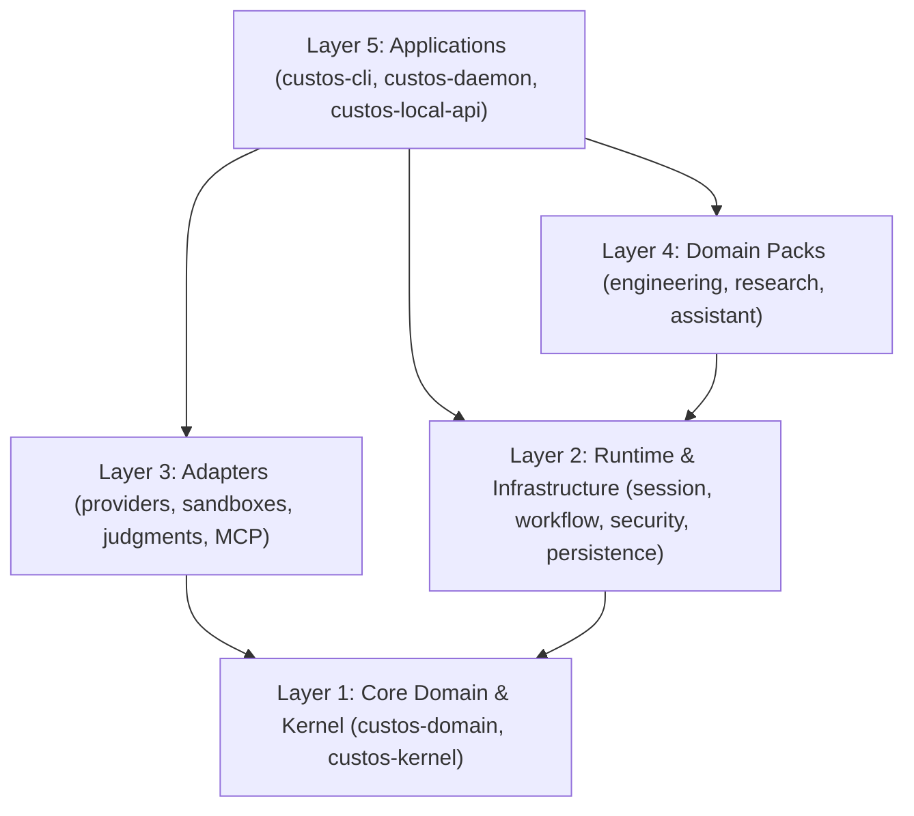

# Codebase Architecture & Monorepo Guide

> **Document ID:** DEV-CODEBASE-01  
> **Status:** Normative Engineering Guide  
> **Verified Baseline:** 42 Cargo packages in workspace (2026-09-28)  
> **Companion Document:** [`repository-structure.md`](repository-structure.md) (Measured dependency graph and debt register)

Custos is structured as an audited, high-discipline Rust monorepo leveraging Cargo workspace mechanics, complemented by versioned JSON/Protobuf schemas and client packages.

---

## 1. Verified Workspace Directory Layout

The workspace partitions responsibilities into 6 discrete crate layers under `crates/`:

```text
Custos/
├── Cargo.toml                       # Root Cargo workspace manifest (42 members)
├── rust-toolchain.toml              # Pinned Rust toolchain (1.82+ stable)
├── deny.toml                        # cargo-deny license and advisory security rules
│
├── crates/
│   ├── core/                        # Layer 1: Pure domain entities & zero-I/O contracts
│   │   ├── custos-domain            # Pure domain models (Task, Session, Evidence, Artifact)
│   │   ├── custos-kernel            # CQRS TaskService, StateMachine, CompletionGate
│   │   ├── custos-bridge            # Session-to-Task bridge and promotion logic
│   │   ├── custos-provider-sdk      # ProviderPort traits and event models
│   │   ├── custos-provider-types    # Provider message, completion, and stream types
│   │   └── custos-sdk-types         # Shared SDK primitives
│   │
│   ├── runtime/                     # Layer 2: Authoritative runtime engines & state machines
│   │   ├── custos-session           # Session lifecycle & journal persistence
│   │   ├── custos-workflow          # Durable workflow engine & step dispatch
│   │   ├── custos-cognitive         # CognitiveArbiter (System 0/1/2 routing)
│   │   ├── custos-context           # Context compilation & token optimization
│   │   ├── custos-context-management# Context summarization & structured output
│   │   ├── custos-security          # PathSandbox, DeterministicGate, EvidencePipeline
│   │   ├── custos-gateway           # Protocol gateway abstractions (frozen mock)
│   │   ├── custos-memory-service    # Memory indexing & persistent recall
│   │   └── custos-agent             # Agent loop execution & event coordination
│   │
│   ├── infrastructure/              # Layer 2b: Durable persistence drivers
│   │   └── custos-persistence       # SQLite WAL mode, migrations, event store, CAS outbox
│   │
│   ├── adapters/                    # Layer 3: Pluggable model providers, sandboxes & tools
│   │   ├── custos-adapters-mcp      # MCP (Model Context Protocol) client & adapter
│   │   ├── custos-mcp               # Core MCP protocol implementation
│   │   ├── custos-providers         # Provider hub & dynamic router
│   │   ├── custos-local-inference   # On-device inference adapter
│   │   ├── custos-roaming           # Roaming agent synchronization
│   │   ├── custos-download-manager  # Asset & model artifact downloader
│   │   ├── judgments/               # System One judgment backends
│   │   │   ├── contracts            # custos-judgment-contracts
│   │   │   ├── rules                # custos-adapter-judgment-rules
│   │   │   ├── jev                  # custos-adapter-judgment-jev
│   │   │   └── onnx                 # custos-adapter-judgment-onnx
│   │   ├── providers/               # LLM adapters
│   │   │   ├── claude               # custos-adapter-provider-claude
│   │   │   ├── codex                # custos-adapter-provider-codex
│   │   │   ├── antigravity          # custos-adapter-provider-antigravity
│   │   │   ├── fake                 # custos-adapter-provider-fake
│   │   │   └── local-model          # custos-adapter-provider-local-model
│   │   └── sandboxes/               # OS containment adapters
│   │       ├── linux-bubblewrap     # custos-adapter-sandbox-linux-bubblewrap
│   │       └── macos-seatbelt       # custos-adapter-sandbox-macos-seatbelt
│   │
│   ├── packs/                       # Layer 4: Specialized domain workflow packs
│   │   ├── custos-packs-engineering # Engineering domain workflows, git diff verifiers
│   │   ├── custos-packs-research    # Research domain workflows, citation validators
│   │   └── custos-packs-assistant   # Assistant domain workflows, note management
│   │
│   └── app/                         # Layer 5: Executable binaries & user-facing APIs
│       ├── custos-cli               # Operator CLI & interactive vibe terminal
│       ├── custos-daemon            # Composition root & local daemon process
│       └── custos-local-api         # IPC transport client, DTOs & versioned API protocol
│
├── schemas/                         # Versioned cross-process JSON Schemas
├── tests/                           # Workspace test suites
│   ├── contract/                    # Strict cross-team contract tests (custos-tests-contract)
│   └── e2e/                         # Multi-process daemon & CLI integration tests (custos-tests-e2e)
├── evals/                           # Evaluation benchmarks & regression harnesses
├── ui/                              # Web & desktop user interface components
├── docs/                            # Comprehensive technical documentation
└── xtask/                           # Workspace build automation & dev tasks
```

---

## 2. Dependency Direction Rules

To prevent circular dependencies and protect the trusted computing base (TCB), Custos enforces strict one-way dependency layering:



### Core Invariants:
1. **`custos-domain` is Pure (Zero I/O):** Must never depend on `tokio`, `reqwest`, `sqlx`, or any network/filesystem libraries.
2. **Adapters Do Not Cross-Depend:** An adapter in `crates/adapters/providers/` must never depend on a sibling provider adapter. All interop flows through traits defined in `crates/core/custos-provider-sdk`.
3. **Daemon is Sole Composition Root:** `crates/app/custos-daemon` is the only component authorized to wire together runtime engines, persistence databases, and physical adapters.

---

## 3. Build & Test Commands

```bash
# Check compilation across all 42 crates
cargo check --workspace --offline

# Run workspace unit and contract tests
cargo test --workspace --offline

# Run strict clippy linter with zero warnings
cargo clippy --workspace --offline -- -D warnings
```
