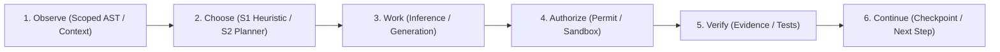

# Delivery Blueprint, Release Gates & Execution Sequence

> **Classification:** Normative Delivery Blueprint  
> **Source of Truth:** Authoritatively defined in [Custos Master Specification](../../Custos.md).  
> **Directory Index:** See [Custos Developer Hub](README.md).

Custos execution follows a strict **Vertical Slices** methodology: each milestone produces an end-to-end, runnable, verifiable system rather than disconnected horizontal abstraction layers.

---

## 1. The Adaptive Verified Work Loop

Every vertical feature slice must traverse the core work loop:

- **Observe:** Fetch source files, git diffs, and project metadata strictly within authorized scope.
- **Choose:** Select optimal execution topology (Direct, Single-Worker, Multi-Worker) within budget constraints.
- **Work:** Generate candidate code patches or research findings without executing physical mutations.
- **Authorize:** Intercept side-effect intents at the Authority Engine; verify single-use cryptographic permits.
- **Verify:** Bind test receipts, lint results, and citation checks to task criteria at the Completion Gate.
- **Continue:** Commit durable checkpoints; preserve state for subsequent interaction sessions.

---

## 2. Release Gates Matrix

| Release Gate | Focus Area | Mandatory Exit Criteria |
|---|---|---|
| **Gate 0** | **Baseline Architecture** | Clean compilation of all 11 product crates; baseline contract tests pass under `cargo test`. |
| **Gate 1** | **Read-Only Inspection** | Real ContextPack delivered to provider port; exact citation spans verified; session reload verified. |
| **Gate 2** | **Durable Effect Spine** | Durable action attempt recorded prior to execution; permit verified; sandboxed execution; crash reconciliation proven. |
| **Gate 3** | **Coding Bug Fix** | Atomic patch bundles and test receipts attached to task criteria; verified objective completion gate pass. |
| **Gate 4** | **Research-to-Code** | Versioned research claims, contradiction checks, and typed handoff into engineering patches. |
| **Gate 5** | **Self-Setup & Optional Profiles**| Doctor diagnostic commands, automated environment detection, and optional provider profile configurations. |

---

## 3. Pull Request Delivery Sequence

To maintain an audited, green CI pipeline, development follows an ordered sequence of focused pull requests:

| PR Number | PR Scope & Responsibilities | Upstream Dependency | Exit Verification |
|---|---|---|---|
| **PR-00** | Architectural Baseline & Workspace Manifests | None | Clean 11-crate Cargo check, strict Clippy, cargo-deny pass. |
| **PR-01** | Local API DTOs & Transport | PR-00 | Shared client DTOs, versioned command routing over domain sockets. |
| **PR-02** | Session Persistence Store | PR-01 | SQLite WAL session persistence, journal replay, restart recovery. |
| **PR-03** | ContextPack & Provider Traits | PR-00 | Deterministic context assembly, token ranking, streaming provider ports. |
| **PR-04** | Bounded Runtime & Task FSM | PR-00 | Task state machine transitions, step execution loops, lease renewal. |
| **PR-05** | Daemon Composition Root | PR-01–04 | End-to-end read-only query execution through daemon process. |
| **PR-06** | Action Ledger & Execution Permits | PR-00 | Durable attempt schema, cryptographic single-use permits, argument hashing. |
| **PR-07** | Effect Dispatcher & Sandboxing | PR-04, 06 | Sandboxed command execution, crash window reconciliation. |
| **PR-08** | Engineering Pack Workflows | PR-03, 04, 07 | Atomic patch bundles, three-path execution workspaces (isolated worktrees). |
| **PR-09** | Evidence Closure & Completion Gate | PR-06–08 | Verifier isolation, objective evidence binding, completion gate enforcement. |
| **PR-10** | Research Pack Workflows | PR-03, 09 | Claim extraction, reproducibility bundles, citation audit pipeline. |
| **PR-11** | Assistant Pack Workflows | PR-03, 09 | Autonomy levels, payload stability, safe automation scheduling. |

---

## 4. Empirical Verification Standard

All performance targets, latency numbers, and efficiency benchmarks stated in PR descriptions or plans remain `[Pending Empirical Verification]` until automated end-to-end test fixtures demonstrate repeatability under real workload conditions.
