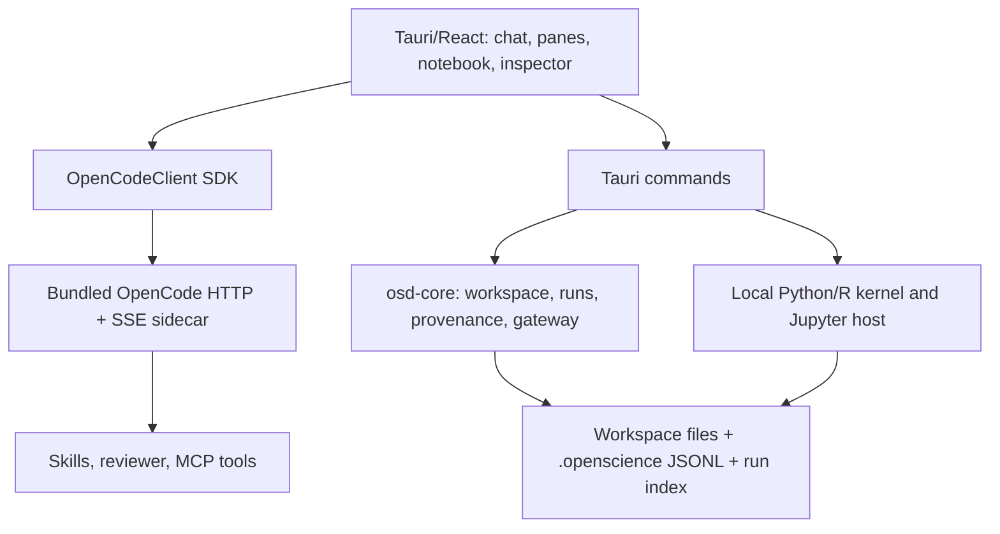

# Open Science Desktop source study for Custos Research Workbench

**Scope:** read-only study of local checkout `../open-science` at commit `04b64817c12e7fdbe0e052bfa1aeaf8802feecde`. This is the `ai4s-research/open-science` **Open Science Desktop** repository, not the separate `synthetic-sciences/openscience` product. The latter is described separately by [the upstream comparison](../../../open-science/docs/open-science-desktop-vs-openscience.md). No Open Science source was copied into Custos by this study.

**Method:** Nexus `RustParser` and `PythonParser` indexed the checkout into `/tmp/custos-open-science-nexus-index.db`: 784 readable files, 1,782 Rust/Python symbols, 13,937 parser call references and 5,195 text chunks. One discovered file did not index. Nexus does **not** parse TypeScript AST, so frontend conclusions below come from direct source and tests, not a claimed complete TS call graph. The temporary index is not part of either project's canonical state. README and design docs were compared with executable paths; README claims alone are not treated as feature proof.

## 1. What the product actually assembles

The agent loop is primarily **OpenCode**, pinned/bundled as a sidecar; UI calls it through [`packages/sdk`](../../../open-science/packages/sdk/src/index.ts), not through the Tauri renderer's own agent loop. The Rust workspace contains `osd-core`, `osd-cli` and the Tauri shell. [`apps/desktop/src-tauri/src/lib.rs`](../../../open-science/apps/desktop/src-tauri/src/lib.rs) composes Tauri commands for runtime, projects, files, provenance, runs, kernels, compute, gateway and MCP setup. Research-specific behavior is partly in skills and external connectors, not a monolithic Research Kernel. This is a coherent product composition, but it is not Custos's Task Kernel/authority/evidence model.

## 2. Verified user flows and their source owners

| Flow | Source evidence | What is reusable as a pattern |
|---|---|---|
| Start a research session and prompt | [`WorkflowStarters.tsx`](../../../open-science/apps/desktop/src/components/thread/WorkflowStarters.tsx) sends an end-to-end prompt; [`OpenCodeClient`](../../../open-science/packages/sdk/src/OpenCodeClient.ts) owns agent transport | Quick-start jobs can begin in chat, with plan/goal/approval visible; a prompt template is not by itself a typed workflow. |
| Keep parallel chats/resources | [`PaneTree.tsx`](../../../open-science/apps/desktop/src/components/session/PaneTree.tsx), [`ContentPane.tsx`](../../../open-science/apps/desktop/src/components/session/ContentPane.tsx), [`SessionView.tsx`](../../../open-science/apps/desktop/src/components/session/SessionView.tsx) | Recursive tiling of chat, file, notebook and terminal with stable pane identities. Custos needs Task and lens IDs *in addition* to pane ID. |
| Inspect artifact origin | [`provenance.rs`](../../../open-science/crates/osd-core/src/provenance.rs) appends file-version records; [`ProvenancePanel.tsx`](../../../open-science/apps/desktop/src/components/inspector/ProvenancePanel.tsx) shows code/env/run/session and drafts a user-reviewed reproduce prompt | Every figure/table/report should open its producing code, inputs, environment, run, messages and limitations. |
| Capture experiment run | [`runs.rs`](../../../open-science/crates/osd-core/src/runs.rs) records command, script hash, output candidates, log hash, environment, host/surface and status; [`runs_index.rs`](../../../open-science/crates/osd-core/src/runs_index.rs) indexes runs | A research run is a first-class artifact, not terminal scrollback. Failed and remote runs remain visible. |
| Use notebooks | [`NotebookEditor.tsx`](../../../open-science/apps/desktop/src/components/notebook/NotebookEditor.tsx), [`kernel.rs`](../../../open-science/apps/desktop/src-tauri/src/kernel.rs), [`jupyter.rs`](../../../open-science/apps/desktop/src-tauri/src/jupyter.rs) | `.ipynb` editing beside conversation, per-notebook Python/R kernel, reset/hung-cell handling, optional managed JupyterLab. |
| Review outputs | [`traceability-review/SKILL.md`](../../../open-science/runtime/skills/core/traceability-review/SKILL.md), [`ReviewerCard.tsx`](../../../open-science/apps/desktop/src/components/thread/ReviewerCard.tsx) | Structured citation/number/figure findings rendered inline, with explicit “traceability, not correctness” scope. |
| Connect data/compute | [`scienceConnectors.ts`](../../../open-science/apps/desktop/src/lib/scienceConnectors.ts), [`science_mcp.rs`](../../../open-science/apps/desktop/src-tauri/src/science_mcp.rs), [`compute.rs`](../../../open-science/apps/desktop/src-tauri/src/compute.rs) | Curated connectors with visible upstream/package/key requirements, managed environment, local/SSH/HPC probes. |
| Select and inspect in place | [`SelectionActions.tsx`](../../../open-science/apps/desktop/src/components/thread/SelectionActions.tsx) scopes a selection to one agent answer and offers quote/explain/remember; [`PresentedArtifactPane.tsx`](../../../open-science/apps/desktop/src/components/session/PresentedArtifactPane.tsx) renders an artifact as a stable pane with zoom and close confirmation; [`TrajectoryPane.tsx`](../../../open-science/apps/desktop/src/components/thread/TrajectoryPane.tsx) projects user/model/tool steps from thread blocks. | Custos should distinguish a selected excerpt from a source anchor, claim assessment or memory promotion; artifact pane controls must not rerun compute; trajectory is an event projection, not a second canonical journal. |
| Scientific file viewers and computer use | [`PdfInspector.tsx`](../../../open-science/apps/desktop/src/components/inspector/PdfInspector.tsx), [`MoleculeView.tsx`](../../../open-science/apps/desktop/src/components/inspector/MoleculeView.tsx), [`GenomeView.tsx`](../../../open-science/apps/desktop/src/components/inspector/GenomeView.tsx), [`FitsView.tsx`](../../../open-science/apps/desktop/src/components/inspector/FitsView.tsx) show domain-specific resources; [`computer.rs`](../../../open-science/apps/desktop/src-tauri/src/computer.rs) and [`browser.rs`](../../../open-science/apps/desktop/src-tauri/src/browser.rs) are separate OS/browser boundaries. | The Research resource registry should admit typed viewers for AI/Data and later specialist fields without putting every renderer in the kernel. Browser/computer-use actions need platform capabilities, exact target/effect policy and honest verification; UI panes alone do not establish safety. |

**End-to-end example observed in source:** `WorkflowStarter` asks for dataset → code → figure → report. Agent writes workspace files, tool events can append provenance, execution writes `RunRecord`, produced files may link to run, artifact/notebook appears beside conversation, and traceability reviewer reports structured findings. `ProvenancePanel`'s Reproduce action drafts a prompt for the user to review/send; it does not silently rerun. This is the interaction loop Custos should learn most closely.

## 3. Boundaries and limitations found in code

1. [`osd-core/provenance.rs`](../../../open-science/crates/osd-core/src/provenance.rs) stores a workspace-relative file/version and optional content/diff, env, session/model/run. Content is capped at 100 KB; missing capture or an indirect write leaves fields absent. Its `content_hash` is a short implementation hash, not a cryptographic integrity guarantee. Custos must distinguish recorded provenance from completeness/tamper resistance.
2. [`osd-core/runs.rs`](../../../open-science/crates/osd-core/src/runs.rs) identifies an entry script from command tokens, detects outputs using mtime in a bounded workspace scan, and omits hashes for files over 5 MB. This is useful best-effort observation, not exact dependency lineage. It records failed runs, but only successful-run outputs are linked as produced provenance; partial output from a failed run must not disappear from Custos's investigation view.
3. [`kernel.rs`](../../../open-science/apps/desktop/src-tauri/src/kernel.rs) runs persistent local Python/R children keyed by notebook path, with a reset path for a hung cell. A persistent process reduces reload cost but its hidden in-memory state makes strict replay/reproducibility conditional; no general OS sandbox proof follows from having a separate process. A cell with network/write effects needs Custos policy outside the notebook UI.
4. [`traceability-review`](../../../open-science/runtime/skills/core/traceability-review/SKILL.md) resolves identifiers and flags untraceable numbers or stale figures through a skill. It correctly says absence of findings is **not** correctness. A `ReviewerCard` is presentation of a review result, not a trusted completion gate.
5. [`science_mcp.rs`](../../../open-science/apps/desktop/src-tauri/src/science_mcp.rs) validates package-name syntax before installing into a managed `uv` environment. Syntax validation does not audit package behavior, versions, licenses or egress. Custos should pin and vet connectors per capability; never treat “one-click MCP” as automatic safety.
6. [`gateway.rs`](../../../open-science/crates/osd-core/src/gateway.rs) implements optional remote access, token modes and file tickets. This solves a different deployment job. Custos's first Research desktop slice does not need to import a LAN/phone gateway to gain artifact/review UX.
7. Open Science's goal plugin state is bridged through a per-session JSON file in [`goal.rs`](../../../open-science/apps/desktop/src-tauri/src/goal.rs). Custos must keep TaskContract, approval and Outcome in its canonical DB, not create a second goal authority by copying the plugin file model.

These are **tradeoffs and implementation observations**, not a security audit or a verdict that Open Science's features are broken. The local SHA and upstream licenses must be rechecked before any selective source reuse. The top-level checkout is MIT; third-party skills/connectors have their own licenses.

## 4. Custos matching decision

Custos should adopt the **research workbench loop and inspectability**, not replace its core with OpenCode or clone the entire desktop. Existing [Custos Research target](../../Custos.md#111-motivation) and [Workbench §12](../architecture/agent-workspace-and-ui.md#12-lịch-sử-hội-thoại-và-chuyển-workbench) already require source/claim/experiment lineage and cross-workbench continuity. The product difference is that a Research result remains connected to Task criteria, authority, exact source versions, selected handoff and uncertainty when Coding or Assistant consumes it.

| Open Science pattern | Custos target | Owner/boundary | Decision |
|---|---|---|---|
| Tiled chat + file/notebook/terminal | Shared resource pane canvas, Research preset | `ui/desktop`, presentation only | **Adapt selectively**; do not port its entire React store. |
| OpenCode session + goal plugin | `ConversationSession` + `TaskContract` + linked continuation | domain/core/bridge/runtime | **Do not transplant**; existing Custos authority remains canonical. OpenCode can be an `AgentRuntimePort` adapter. |
| File version JSONL | `ArtifactVersion`/CAS + source refs + evidence dependency | persistence/Research pack | **Adapt concept**, not dual-write a second canonical log. Optional export can be JSONL. |
| Run record and reproducer prompt | `ExperimentRun`/`ExperimentArtifact` with inputs, environment, output digests, negative results | Research pack + runtime + adapters | **Adopt strongly**, with explicit completeness status and resource budget. |
| Notebook side pane and per-notebook kernel | Research Experiments view with managed local kernel; Jupyter optional | desktop + adapters; Task state in daemon | **Prototype via fake kernel**, then integrate audited backend. No implicit rerun on pane restore. |
| Traceability reviewer skill | CriterionVerificationRecord: locator/extraction/semantic support separated | Research verifiers + core completion | **Adopt UI/reporting**, keep reviewer method/version/uncertainty and never equate citation resolution with claim truth. |
| Curated science MCP catalog | Connector profiles for paper/data sources in scope | adapter/catalog + consent/egress | **Selective**, begin software/AI/Data and one or two metadata/full-text connectors. |
| SSH/HPC/Modal/gateway/phone | Optional compute and remote clients | adapters/protocol layer | **Defer** until concrete jobs, threat model and conformance fixtures. |

### Research-specific topology without mandatory multiagent

For a direct paper question, one worker reads a versioned passage and answers with locator. For a literature map, independent source readers may fan out under a shared Task budget, followed by dedup/contradiction join; the **join** cannot promote metadata into support. For an AI/Data experiment, one worker prepares a plan and code; compute dispatch is its own approved effect; a verifier checks code/data/run/metrics alignment and may return `unknown`. A costly second reviewer is conditional on claim consequence, conflict or expected verification gain, not a default “science agent swarm”. OI chooses these topologies within Task scope; S1 may rank source relevance or detect ambiguity but cannot declare a claim true or authorize compute.

### Proposed workbench interaction

1. Chat starts a question. Research preset shows Library/Reader/Claims/Experiments/Synthesis resources while preserving the same `session_id` and Task anchor.
2. Selecting a source creates a versioned `SourceRecord`; Reader links page/span/table/parse gaps. A claim creates `ClaimEvidenceLink` with `support|contradict|mention|unknown`, method and reviewer.
3. An experiment plan displays dataset/version/split/license, environment, code, compute target, network, max time/cost and stop conditions before execution. Start yields a run ID; outputs link to producing code/input/environment or explicitly say provenance incomplete.
4. Artifact inspector presents `Source`, `Code`, `Inputs`, `Environment`, `Run`, `Review`, `Messages`, `Limits` according to available evidence. Empty tabs say `unavailable`, never fabricate “review passed”.
5. `Continue in Coding` transfers selected claims/experiment refs with caveats using the existing continuation manifest and ContextReceipt; Coding checks repo target and creates an Engineering obligation/patch under its own effect scope. The Research chat and artifact remain openable. `Draft in Copilot` similarly transfers only approved/redacted summary, never mail permission.

## 5. Implementation sequence and release gates

| Slice | Concrete delivery | Gate |
|---|---|---|
| A — inspectability | Research resource pane, real source/artifact IDs, artifact inspector, source version/freshness; disable mock proof | One PDF with table OCR gap: reader opens exact page, unsupported claim stays `unknown`. |
| B — runs | Fake compute adapter, typed ExperimentRun/Artifact, append/recovery, cost and negative-run display | Crash/restart retains run and partial outputs; opening pane never reruns. |
| C — local notebook | Managed per-notebook kernel behind CapabilityPort; code/env/dataset/output receipt | Long-running cell cancel, restart, out-of-scope file/network attempt, hidden-state caveat. |
| D — review | Locator/extraction/semantic-support records; structured findings card with method/version | DOI resolves but passage does not support claim: criterion remains `unknown` or `fail`. |
| E — handoff | Research → Coding linked session/selected refs; source and Task revisions revalidated | Full transcript remains viewable; model sees only consented refs; child Task inherits no grant. |
| F — optional ecosystem | Curated MCP, remote compute, richer domain viewers after demand and audit | Pin SHA/license/version, privacy/egress and fidelity/latency tests per connector. |

Do not make Open Science's benchmark rank or README numbers Custos metrics. Measure accepted Research outcomes, claim support precision, reproducibility coverage, source parse gaps, human review time, token/billed/unknown cost and cross-workbench handoff recall against a single-agent baseline.
