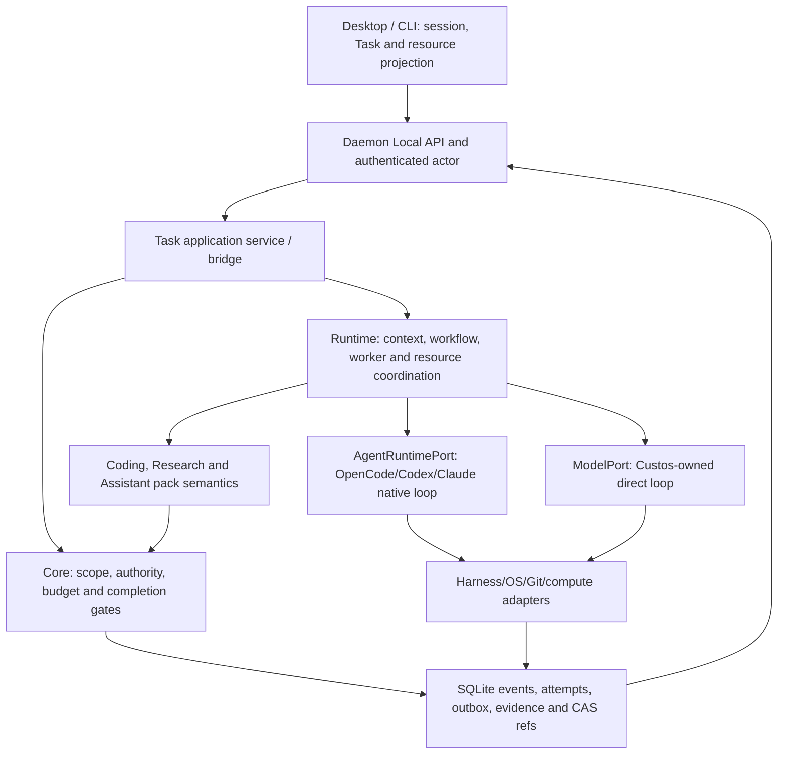

# Custos SADE: implementation plan for OrCa, OpenCode and Open Science capabilities

> **Status: review draft, not an implementation claim.** This document turns two supplied architecture drafts into code packets against the current Custos checkout. [Custos.md](../../Custos.md) remains the product authority. [Backend–desktop convergence](sade-frontend-backend-convergence-plan.md) remains the **priority queue**; [workspace restructuring](workspace-restructuring-plan.md) remains the broader dependency map. This document adds source-to-contract detail and acceptance gates, not a third competing roadmap.
>
> **Snapshot inspected:** Custos `vi` at `c672abe` on 10 October 2026; clean working tree before this document. Source and tests can change before implementation. Re-run the packet's read-only audit at its start. No code paths, UI journeys, or upstream binaries were executed for this draft.

**Tóm tắt để giao việc:** Trước hết khóa biên quyền thực thi và làm một đường hỏi repo bằng executor thật, có nguồn và mở lại được sau restart (B0–B1). Sau đó mới làm claim/launch bền vững, thống nhất worktree, tích hợp OpenCode như harness tùy chọn, hoàn thiện một vòng Research có bằng chứng, rồi nối ba workbench trên cùng Task (B2–B6). Assistant và OI dùng chung trục này nhưng chỉ bật tự động hóa/tối ưu sau các gate tương ứng (B7). Bản đính kèm thứ nhất là phân tích lỗi và pseudocode; bản thứ hai là phác thảo 7 packet. Tài liệu này giữ những điểm có căn cứ, sửa các giả định nguy hiểm và chỉ rõ file, transaction, phép thử, thứ tự phụ thuộc để triển khai.

## 1. Decision in one page

Custos owns one Task/Session/Run spine, authority, effect attempts, evidence and outcome. The three upstreams contribute *different* capabilities:

| Upstream | Selected capability | Custos boundary | Explicit non-goal |
|---|---|---|---|
| OrCa | Structured launch, durable dispatch/attention, execution workspaces, resource tabs and supervised workers | Existing `Run`, `WorkerRun`, `DispatchClaim`, `ExecutionWorkspace`, workflow runtime, adapters and desktop | A second OrCa Task database, scheduler or Electron runtime |
| Current OpenCode (`anomalyco/opencode`) | Optional native agent harness with sessions, tool loop, event stream, questions and usage | Existing `AgentRuntimePort` and harness adapter; normalize observations into Custos attempt/event records | Treat OpenCode as `ModelPort` or assume its native tools are Custos-mediated |
| Open Science Desktop | Research source→experiment→artifact→review loop, inspectable provenance, pane layout and scientific resources | Existing Research pack, artifact/source/run records, notebook/compute adapters and desktop views | JSONL as canonical Task/evidence store or traceability as proof of scientific truth |

The older Go checkout `../opencode` is not the OpenCode used by Open Science. Open Science pins the current TypeScript OpenCode binary at `1.18.32` in [`fetch-opencode.sh`](../../../open-science/scripts/dev/fetch-opencode.sh). Its [`OpenCodeClient`](../../../open-science/packages/sdk/src/OpenCodeClient.ts) uses HTTP and SSE; [`AcpRuntime`](../../../open-science/packages/sdk/src/acp/AcpRuntime.ts) is a separate runtime option. Old Go `fetch`/Sourcegraph/subagent files are historical design inputs, not an adapter specification.

OrCa's local `.git` was removed after the [OrCa source study](orca-source-study.md) recorded `3f6225deeb08a82448c5f0b0725073401629d462`; the local source cannot now prove it is still exactly that commit. Open Science was studied at `04b64817c12e7fdbe0e052bfa1aeaf8802feecde`. The [upstream source map](upstream-source-map.md) tracks provenance and the `inventory → compiled → composed → exercised → verified` ladder. No copied upstream code is authorized by this plan alone.

## 2. Corrections required before using the two supplied drafts as code instructions

The drafts are useful design reviews, **not compilable patches**. The following corrections are binding for implementation review:

1. `StartRunCommand`, `LaunchAttempt`, `DispatchClaim`, `ExecutionWorkspace`, `SourceRecord`, `PassageAnchor` and `ResearchExperimentRun` already exist. Extend their real definitions only when a failing flow requires it; do not introduce `start_work.rs`, `launch_attempt.rs`, `resource_ref.rs`, `KernelPort::request_permit` or a third `WorkerEvent` representation merely because pseudocode names them. First inventory consumers and serialization fixtures.
2. There is no evidence that `WorkerExecutor` is the daemon's production worker path. Its local `Permit::new` and simulated `execute_worker` are dangerous **if composed**; classify mounted/call-path status before replacing it. A text match is not an exploit proof. Test-only simulation must not issue a production receipt.
3. A SQLite lease expiry does not prove a native agent stopped or an external effect did not happen. Expired ownership must become `unknown/reconciling` until process/session/effect state is checked. No automatic second launch after an uncertain commit.
4. The draft's SQL `ON CONFLICT ... WHERE expires_at < now` is insufficient: it does not atomically test Task/node readiness, expected revision, budget reservation and competing WorkerRun state; its proposed FK `tasks(id)` must be checked against actual schema. The migration runner currently uses `include_str!` and idempotent scripts rather than an assumed migration framework.
5. Do not use `git worktree add -B` to reset an existing branch, `git worktree remove --force` to discard edits, or automatic `git merge` as a generic approval action. Worktree cleanup and integration are separate, recoverable operations with dirty-state and base-revision checks.
6. Git HEAD alone does not describe dirty or untracked bytes. A repo source anchor needs commit plus selected dirty manifest/content digest, path/range and parser coverage. A displayed hash is not proof that semantic interpretation is correct.
7. OpenCode HTTP/SSE events are *observations*. A tool-update event does not necessarily arrive before the tool executes, and pausing an SSE reader does not stop the server. Custos may claim `custos-mediated` only if an adapter demonstrably interposes before **every** in-scope effect. Otherwise declare `provider-governed` or `observe-only`, constrain the process/OS environment where possible, and verify post-state.
8. Do not hardcode event names such as `text_delta` or `/api/events` from the draft. Freeze a supported binary/API release, capture actual protocol fixtures and map those exact events. Open Science's client subscribes to `/event` and normalizes `message.part.updated` among other events; the Custos adapter must test the pinned protocol rather than assume Open Science's mapping is evergreen.
9. A DOI or URL being syntactically valid does not mean the source was fetched, the correct version was opened, or the claim is entailed. A numeric entailment score alone is not an oracle. Keep locator, extraction and semantic assessment as separately versioned records with `unknown` and reviewer paths.
10. Lens selection is correctly presentation-only in [`studio/page.tsx`](../../ui/desktop/src/app/studio/page.tsx). The gap is durable resource identity, server-backed capability truth and selected-artifact handoff, **not** moving the lens preference itself into canonical Task state.
11. UI does not directly mint a Permit. Approval is an authenticated command on a canonical `ActionIntent`/payload digest; authority validates and persists it. A diff preview is not equivalent to approving a Git merge or an agent's arbitrary future writes.
12. A denied tool attempt does not universally make the whole Task `Failed`; it may be `WaitingApproval`, `Limited`, blocked or recoverable. The Task FSM, effect FSM and criterion statuses must remain separate.

## 3. Ownership and dataflow

This is a runtime responsibility diagram, not a Rust import graph. `custos-daemon` is the sole composition root. `custos-domain` holds pure values; `custos-core` owns policy and ports; `custos-persistence` implements storage; `custos-runtime` orchestrates through ports; `custos-adapters` owns concrete external execution; `custos-packs` supplies domain semantics; `custos-bridge`/`custos-sdk` carry client contracts; `ui/desktop` only projects and requests operations. Preserve the 11 canonical crates and current host layout; create no OrCa/Open Science crate.

| Canonical identity | Existing starting point | Invariant to preserve |
|---|---|---|
| Task/revision and session binding | `custos-domain/src/task.rs`, session/bridge types | Session and lens are not grants; one Task can span sessions/lenses |
| Run/worker/node/launch | `custos-domain/src/run.rs`, migrations `0011`, `0013`–`0015` | Agent completion is not Task acceptance; unknown launch blocks blind retry |
| Workspace and resource | `custos-domain/src/workspace.rs`, migration `0016` | Worktree/folder/notebook are resources with owner, lineage and lifecycle, not security sandboxes |
| Source/claim/experiment/artifact | `custos-domain/src/claim.rs`, migrations `0017`–`0023` | Source/version, parse coverage and assessor method are distinct |
| Effect/permit/outbox | `custos-core/src/authority`, persistence `0009`–`0010` | Canonical payload, one-use claim, external uncertainty and receipts |
| Outcome | Core criterion gate and pack verifiers | Criterion-specific evidence; worker text, exit code and citation syntax cannot independently pass |

**Two worker paths:** `ModelPort` is one inference attempt inside a Custos-owned loop; `AgentRuntimePort` is a harness-owned loop inside a bounded `WorkerRun`. A local coder model is not automatically an agent. Either path can serve Coding, Research or Assistant if capabilities and policy allow. A pack is domain semantics, not an agent or provider.

## 4. Source-to-code extraction map

| Upstream source to inspect at packet start | Behavior to carry over | Custos target / gate |
|---|---|---|
| OrCa `src/main/runtime/orchestration/db/dispatch-row-writer.ts`, task store, coordinator | Transactional claim, ready dependencies, bounded dispatch, decision gate | Extend `DispatchClaim`/`RunPort` and SQLite repository; atomic claim and restart tests. OrCa's `decompose()` is not a general automatic planner in the studied source. |
| OrCa `src/main/agent-launch/agent-launch-executor.ts`, structured/terminal adapters | Requested vs actual launch, pre-commit refusal vs post-commit unknown, no duplicate fallback | Existing `LaunchAttempt`, `HarnessProfile`, adapter registry; process/session reconciliation fixtures |
| OrCa `src/main/runtime/orca-runtime-create-managed-worktree.ts`, worktree docs | Workspace lineage, Git baseline, setup, terminal/resource affinity | Existing `ExecutionWorkspace`, `WorkspaceProvider`, PTY; dirty and cleanup gates |
| OrCa renderer shell/resource tabs/attention | One shell with resource panes and durable decisions | Desktop resource canvas plus daemon-backed attention projection; no second UI Task store |
| OpenCode current server/API/SDK and `packages/opencode/src/tool/task.ts` | Session/subagent loop, permission/question events, bounded child runs | Optional `AgentRuntimePort` adapter. Treat native permission as a harness mechanism, not a Custos grant. Child session event visibility must be conformance-tested. |
| Open Science `packages/sdk/src/OpenCodeClient.ts` and `acp/AcpRuntime.ts` | Normalized stream, reconnect, runtime capability differences | Adapter event fixtures and per-harness capability profile; do not copy TS session state into Rust domain |
| Open Science `crates/osd-core/src/{runs,provenance}.rs`, desktop kernel | Experiment attempts, artifact lineage, persistent-kernel UX | Research run/evidence records; explicit completeness and compute mode. mtime scans/limited hashes are observations, not exact proof. |
| Open Science `PaneTree.tsx`, selection actions, artifact/trajectory/reviewer panes | Stable resource/pane identity, inspectable source→run→artifact, review in context | Desktop Research lens + Local API source/artifact refs; pane restore never reruns effects |

For each copied or materially adapted source file, add an entry to [upstream-source-map](upstream-source-map.md): original repository/commit/path, target path, copyright/license/notice, changed behavior, active composition path, platform assumptions and tests. A product pattern reimplemented independently can be documented as an influence; do not mislabel it literal copied source.

## 5. Packet dependency graph and gates

The queue below refines, rather than overrides, [convergence §2](sade-frontend-backend-convergence-plan.md#2-những-vấn-đề-hiện-tại-phải-xử-lý-theo-thứ-tự-rủi-ro). `B0` is the current P0 security boundary; `B1` the first real chat; `B2` durable delegation; `B3` Coding resources; `B4` native OpenCode; `B5` Research; `B6` UI continuity; `B7` cross-pack and optimization. UI work may develop against golden fixtures in parallel, but must not advertise a higher realization level than backend conformance.

| Packet | Depends on | Smallest releasable result | Blocking test |
|---|---|---|---|
| B0: ingress/execution admission | current checkout | Authenticated actor and capability truth for the existing Local API | Unauthenticated/cross-origin client cannot reach physical execution; unavailable pane has no active effect CTA |
| B1: truthful single worker | B0 for physical actions | Repo read→one real model/native response→persisted session/run/usage→restart | No fake success; source anchor survives restart or becomes stale |
| B2: durable claim/launch/effect | B1 contracts | Bounded delegated worker with safe unknown/reconcile | Two claimants, two daemon instances and crash windows never cause blind second launch/effect |
| B3: workspace convergence | B2 for parallel writes; B1 for read-only Git | One owned worktree, diff and integration decision | Dirty base/branch conflict/cleanup preserves user edits |
| B4: OpenCode adapter | B0+B1, B2 before delegated fan-out | One optional pinned native harness with honest capability | Prompt/event/question/usage/cancel/timeout/child-session fixtures; no false `custos-mediated` label |
| B5: Research vertical slice | B1; B0 for compute/network | Source→passage→claim→run→artifact→assessment | Fabricated or wrong-version citation never passes; failed run retains partial evidence |
| B6: unified workbench | B1 plus B3/B5 for live panes | Same Task across Copilot/Coding/Research with stable resources | Reopen/restore does not create Task, relaunch worker or repeat effect |
| B7: cross-pack/optimization | B3+B5+B6 | Selected research claims→Coding brief→Assistant draft under same Task | No implicit grant or raw-corpus leak; accepted-outcome cost and quality beat/meet pinned baseline before OI default |

### B0 — close the execution boundary before adding more surfaces

**Current evidence:** [convergence §2](sade-frontend-backend-convergence-plan.md#2-những-vấn-đề-hiện-tại-phải-xử-lý-theo-thứ-tự-rủi-ro) identifies unauthenticated HTTP/local caller identity, request-supplied actor, and execution paths without full admission. [`OrcaTabbedContainer.tsx`](../../ui/desktop/src/components/views/OrcaTabbedContainer.tsx) has default `available` operations that can outlive a failed capability fetch.

**Work:** inventory every physical path (shell, filesystem, notebook, PTY, Git, native harness, browser, MCP, network, mail). Define embedded/local/remote transport profiles and actor binding; reject caller-supplied actor as authority. At each path, record scope, egress, workspace, budget, mediation and receipt. UI capability fetch failure yields `unknown/offline`, not an optimistic default. Do not bolt auth solely onto HTTP while Tauri/stdio/daemon direct calls still bypass policy. **Immediately disable production workspace teardown until B3 hardens it:** current `LocalWorkspaceProvider::teardown` uses `git worktree remove --force` and falls back to recursive directory removal even on Git failure. A failed Git command is not proof that the directory is disposable.

**Gate:** unauthorized caller cannot execute a notebook cell, spawn a harness, write a file or use outbound tools; browser Origin and no-Origin cases have tests; supported operations shown by UI equal daemon-advertised operations for the selected profile. Document per-OS assurance, including known provider-governed bypasses.

### B1 — one real, restartable answer before multiagent breadth

**Existing surface:** `StartRunCommand` in [`run.rs`](../../crates/custos-domain/src/run.rs), [`WorkflowPort`](../../crates/custos-core/src/contracts/workflow.rs), [`task_runtime.rs`](../../crates/custos-runtime/src/workflow/task_runtime.rs), daemon composition and session journal. Audit the **current** provider composition: earlier plan text mentions default FakeProvider, but the current source must be read at packet start; do not repeat a historical diagnosis as current fact.

**Work:** require configured executor and source-backed `ContextPack`; persist `Run`/`WorkerRun`/`LaunchAttempt`, model/native attempt ID, output and usage `known|estimated|unknown`. Stream token text separately from durable lifecycle/event cursor. A completed worker returns an artifact/observation and triggers pack verification; Task acceptance remains a core decision. Make cancellation request vs observed stop distinct.

**Gate:** same repo snapshot and pinned model/harness: user asks about a symbol, gets a correct reopenable source anchor, sees actual executor and usage state, then restarts daemon and sees the same answer. Changed bytes make the anchor stale. Model unavailable fails visibly, never silently choosing a different provider against a pin/local-only constraint.

### B2 — durable dispatch, launch and effect fencing

**Existing surface:** [`dispatcher.rs`](../../crates/custos-runtime/src/workflow/dispatcher.rs) stores active claims in `RwLock<HashMap>` and only checks persisted WorkerRuns before the local lock. [`run.rs`](../../crates/custos-domain/src/run.rs) already defines `DispatchClaim` and `LaunchAttempt`; [`0011_runs_and_worker_runs.sql`](../../crates/custos-persistence/migrations/0011_runs_and_worker_runs.sql) has Run/WorkerRun tables, not durable claim rows.

**Proposed implementation sequence:**

1. Extend the existing storage port with narrow `try_claim_ready`, `mark_launch_prepared`, `record_launch_observation`, `release_or_reconcile` commands. Do not let runtime import SQLite. Use one transaction for ready/dependency/version/budget-admission checks, unique active claim at `(task_id, scope_kind, scope_id)`, fence epoch and event/projection update. Normalize task-vs-node scope rather than relying on SQLite `NULL` uniqueness.
2. Add an idempotent migration in the existing `migrations.rs` sequence **after auditing the highest applied version** (currently `0026`). Store claim ID, scope, assignee, worker/run link, epoch, status, lease time and command ID; index active scopes. Backfill only if a prior stable ID exists; otherwise mark historic active runs `reconciling`, not guessed claimed.
3. Before native launch persist the prepared `LaunchAttempt`; after a successful launch record external session/process handle and actual mode. A refusal known before commit can select a documented fallback. A timeout after possible commit becomes `Unknown` and must be queried/observed before retry. Lease expiry fences stale owners but does not prove the child process died.
4. Route in-scope effects via existing authority/outbox ports. Resolve whether [`worker_executor.rs`](../../crates/custos-runtime/src/workflow/worker_executor.rs) is production-reachable; if yes, remove locally minted `Permit` and simulation from production path first. Do not invent `KernelPort::request_permit` until its existing service/port shape is mapped. External effects after dispatch require receipt/reconcile, not an in-transaction claim of exactly-once delivery.
5. Make `HarnessProfile` default conservatively (`supports_cancel=false`, `supports_steer=false`, cost unknown unless proven), and make unsupported cancel/steer explicit. Preserve existing trait definition in [`harness.rs`](../../crates/custos-core/src/contracts/harness.rs); update adapters and tests together. Request-to-cancel is not an observed stopped process.

**Gate matrix:** same-process concurrent claims; separate DB connections/processes; crash before commit, after claim, after launch before receipt and after receipt; stale epoch cannot mutate; no auto-relaunch on unknown; releasing claim does not hide an active native process; one-use effect dispatch cannot double-send. Use fault injection at each transaction/external call boundary rather than only a 10-thread happy-path test.

### B3 — converge the workspace and patch lifecycle

**Existing surface:** [`LocalWorkspaceProvider`](../../crates/custos-adapters/src/workspace.rs) creates a real Git worktree but uses `git worktree add -B`; [`WorkspaceLeaseManager`](../../crates/custos-runtime/src/workflow/lease.rs) holds a separate in-memory directory lease and copies files using a string-prefix check. They are different abstractions. The existing `ExecutionWorkspace` and migration `0016` should own identity and lineage.

**Work:** use one workspace lifecycle and owner for folder, Git and later remote workspaces. Resolve canonical repo path, branch uniqueness, base commit, dirty/untracked manifest, worktree path and host before allocation. Prefer unique `git worktree add -b` or another reviewed non-resetting creation mode; never change an existing branch as a side effect of allocation. Run setup commands only through an admitted capability, with source/egress policy. Diff against **recorded base plus worktree dirty state**, including untracked/renamed/binary limitations. Review/apply/integrate through an explicit ActionIntent with base precondition; user approval of a patch does not authorize push. Teardown refuses dirty/unmerged worktrees by default and offers preserve/review. Worktree is file-conflict isolation, not process/network sandboxing.

**Migration:** keep a compatibility wrapper only for callers verified in the compiled path; make `merge_lease` unavailable to production until replaced, then remove after consumer tests. Do not run destructive cleanup on old `.custos/worktrees` paths based on guessed ownership.

**Gate:** two workers cannot own the same mutable workspace; independent branches do not overwrite shared checkout; dirty/untracked edits survive failed launch, cancelled run and restart; stale base rejects apply; symlink/path traversal and prefix-collision paths are denied; cleanup leaves user-modified worktree recoverable.

**Platform notes:** use argument arrays for Git commands; never shell-interpolate branch/path. Validate canonical path and symlink/reparse-point behavior at execution, not only intake. `git status --porcelain -z` and explicit untracked handling are safer for unusual filenames than newline parsing. Branch and worktree path uniqueness must be checked under a durable allocation owner. Folder workspaces need equally careful ownership: current folder teardown can recursively remove its path and must not be used on an arbitrary user-selected directory. Git worktree integration may use a reviewed patch/cherry-pick/merge strategy, but each is an independent effect with conflict and rollback/roll-forward behavior; no single `git merge` command is the universal implementation.

### B4 — optional pinned OpenCode runtime, not a new kernel

**Protocol audit first:** pin binary release/asset/hash/license, capture its actual HTTP routes and SSE payloads on macOS/Linux/Windows targets, record authentication/bind/config isolation and process lifecycle. Open Science pin `1.18.32` is a useful comparison, not automatic selection for Custos. Use official OpenCode [server API](https://github.com/anomalyco/opencode/blob/dev/packages/web/src/content/docs/server.mdx), [agents](https://opencode.ai/docs/agents/) and [tool documentation](https://docs.opencode.ai/docs/tools/) as current upstream references, then test the **pinned** release because `dev` can differ.

**Adapter location:** existing `custos-adapters/src/harness/` plus daemon composition. Implement existing `AgentRuntimePort`, not a second agent-loop interface. Keep OpenCode's session ID as external reference attached to `LaunchAttempt`/WorkerRun; keep Custos Task/Session IDs canonical. Normalize complete text-part updates by stable part ID (not by blindly appending every SSE payload), tool observations, permission/questions, child session references, usage and terminal states. Unknown event types become `unsupported/unknown`, never inferred success. Deduplicate reconnect/replay by event/part identity where protocol permits; preserve raw redacted fixture for debugging.

**Assurance:** If OpenCode executes its own `bash`, write, MCP or network tools, its native permission prompts are not Custos `Permit`s. Unless a pre-effect interception mechanism is proved by a failure fixture for every relevant tool path, label the action `provider-governed` or `observe-only`; constrain filesystem/network with a tested OS profile where possible, and capture post-diff/receipt. Do not route a permission event to Custos and then claim physical mediation if the tool already ran. Child agent permissions and event visibility need explicit tests. Pin/local-only/budget policies are upper-level admission rules; unknown harness usage is `unknown`, not zero.

**Conformance:** start, prompt, text/reasoning, tool/question, child worker, usage, cancel request vs stopped observation, crash/reconnect, timeout-after-start, version mismatch, missing binary and auth failure. Record capability per tested host/version. Do not compose OpenCode as default until B1 and these gates pass.

### B5 — Research from source to warranted claim and reproducible attempt

**Existing surface:** Research ingress in [`research_ingress.rs`](../../crates/custos-core/src/research_ingress.rs) lowers client claims to ungrounded draft; source/claim/run/artifact migrations exist; desktop has `LiteraturePane`, `ClaimsMatrixPane`, `NotebookWorkspacePane`, `RunsLedgerPane` and `ArtifactInspector`. The citation coverage verifier still defaults missing `verified` metadata to the presence of a citation string. The live notebook execution mode and any persistent kernel claim must be inspected; do not infer it from a pane name.

**Vertical slice:**

1. Acquire one source with canonical URL/DOI, fetched version, raw digest, privacy/egress record, parse coverage and inaccessible regions. External web content is data, not instruction or grant.
2. Store passage anchors with page/section/span and exact source revision. Verify locator and extraction separately; OCR/table/figure gaps remain explicit `unknown`.
3. Represent atomic claims with units, qualifiers and support/contradiction/mention/unknown links. An assessor records method/version/input digest, confidence calibration if available, and reviewer decision. A machine entailment score alone cannot auto-certify consequential claims.
4. Create an experiment attempt with code/script digest, input dataset versions, environment/kernel epoch, command and bounded resources. Record stdout/stderr, failure and partial outputs. Artifact lineage includes measured completeness; a best-effort mtime scan is not represented as exhaustive provenance.
5. Show a review card listing exact missing edges: absent source bytes, changed version, unlinked figure, missing environment, unreviewed semantic claim. A reproduction action drafts or requests a new run; reopening a pane never re-executes.
6. Handoff selected claim IDs only after checking **every** requested ID/status/source freshness/privacy in one command. No partial child Task on failure. Research evidence is input to an Engineering brief, not an automatic requirement or grant.

**Verifier correction:** the existing `citation_coverage_oracle.rs` may still report *citation coverage* as a metric, but it cannot call a claim `verified` solely on non-empty DOI/citation or caller metadata. Completion consumes separate locator/extraction/semantic records with dependencies and staleness. A wrong passage, paper v1/v2 mismatch, fabricated DOI, unsupported clause, table OCR gap and self-asserted `verified=true` must fail/abstain on the appropriate criterion.

**Compute gate:** isolated per-cell subprocess may be shipped honestly as such. A sessionful Python/R kernel is a separate feature: process identity, hidden-state epoch, reset/interrupt, network/file permissions, crash recovery and non-replayable side effects must be specified and tested before claiming persistent or fully reproducible compute.

### B6 — one desktop shell with three workbench lenses

**State contract:** backend owns Task, Session/turn, Run/attempt, resource metadata, approvals, effects, evidence, usage and event cursor. Frontend owns `lens`, pane layout, split size, focus, tab order and unsent drafts, keyed by stable workspace/session/task/resource IDs. `open in Coding/Research/Copilot` changes the view; `handoff selected artifacts`, `fork` or `add pack step` is an explicit command. Switching lens never silently changes Task, grants or executor.

**UI delivery order:**

1. Audit `AppContext`, [`studio/page.tsx`](../../ui/desktop/src/app/studio/page.tsx), [`OrcaTabbedContainer.tsx`](../../ui/desktop/src/components/views/OrcaTabbedContainer.tsx) and the existing daemon client. Identify static or mock success paths separately from live API paths; do not mass-rename components first.
2. Add typed resource descriptors from the daemon (`resource_id`, kind, owner IDs, version/freshness, status, supported operations, reason). Reuse a stable pane ID for presentation; keep resource ID distinct from pane ID. Backend query failure projects `offline/unknown`, not default `available`.
3. Move view composition toward a registry for chat, file/diff/test/terminal, source/passage/claim, notebook/run/artifact, and draft/calendar. Retain current routes and compatibility exports during migration. The shell stays typography-first, with lens identity conveyed by icon, workspace title, resource set and subtle accent rather than three unrelated themes.
4. Derive attention from durable approval/question/uncertain-effect/run events. Reveal and acknowledge are separate commands; stop/cleanup/close-pane are separate actions. Exact payload and target are visible before approval; changed bytes invalidate approval.
5. Restore layout from frontend preferences after fetching canonical resources. Missing/stale resource renders a recoverable pane. Never invoke rerun, resend, Git cleanup or model launch while restoring UI state.
6. Test Copilot-first, Coding-first and Research-first journeys, small/large window, keyboard/focus, offline/empty/error/unknown, multi-Task session and one Task across sessions. Every workbench must retain access to the same Task history and selected artifact refs without dumping full transcript into the next model prompt.

**Cross-lens acceptance:** Research claim→selected Engineering brief→Coding workspace/diff/test→Copilot summary uses one Task ID and explicit child Run/step IDs. Raw private corpus does not cross automatically. A Research notebook may contain code, but opening its file in Coding does not turn a research result into a verified patch.

### B7 — Assistant and measured orchestration on the shared spine

Assistant is not provided by OrCa or Open Science. It reuses the same Task/Run/resource/attention shell but has its own pack obligations: identity resolution, exact draft, time zone, external effect, outbox, receipt and reconciliation. `draft` is never `sent`; ambiguous recipient asks the human; timeout after send stays uncertain. A cross-pack Research→Coding→Assistant demo must not transfer send authority with text or artifacts.

S1/OI begins with direct pinned and one-worker baselines. [`candidate_builder.rs`](../../crates/custos-runtime/src/oi/candidate_builder.rs) and cost estimator currently contain fixed candidates/estimates; keep optimization experimental until availability, actual attempt usage, verifier cost, failed/retried runs and human time are measured. Evaluate direct vs rules vs S1 vs OI on paired same-task fixtures by pack; report accepted rate, quality margin, p95 first useful output, billed/estimated/unknown spend and cost per accepted Task. Multiagent or local-model routing is enabled only where it improves the relevant outcome without breaching hard policy.

## 6. Contract and migration rules for all packets

### Physical change map for code review

These are **existing owner files and expected deltas**, not an instruction to create every named file. The packet implementer must confirm the active call path and physical catalog before editing; if an owner has moved, update this map and the documentation triad first.

| Packet | Current file(s) to inspect/extend | Expected narrow delta | Proof required before retiring old path |
|---|---|---|---|
| B0 | `crates/custos-daemon/src/{http_server.rs,local_api/lib.rs,api.rs}`; `ui/desktop/src/components/views/OrcaTabbedContainer.tsx`; adapters' execution entrypoints | Transport identity/profile and pre-effect admission; UI capability status fail-closed; block unsafe teardown | Requests through every transport and pane cannot bypass policy; negative security fixtures |
| B1 | `crates/custos-domain/src/run.rs`; `crates/custos-core/src/contracts/workflow.rs`; `crates/custos-runtime/src/workflow/task_runtime.rs`; `crates/custos-daemon/src/{runtime.rs,api.rs}`; `crates/custos-persistence/src/repositories/run.rs` | One production path with source-backed context, actual output/attempt/usage and restart | Daemon-composed path and Desktop/API replay, not a `FakeProvider` unit test alone |
| B2 | `crates/custos-runtime/src/workflow/{dispatcher.rs,worker_executor.rs}`; `crates/custos-core/src/contracts/{storage.rs,harness.rs}`; `crates/custos-persistence/src/{migrations.rs,repositories/run.rs}` and next migration; daemon composition | Atomic DB claim/epoch; conservative harness capabilities; launch uncertainty; mediated effect route | Multi-connection contention, crash matrix, no double-dispatch and no executor-local permit |
| B3 | `crates/custos-domain/src/workspace.rs`; `crates/custos-core/src/contracts/workspace.rs`; `crates/custos-adapters/src/workspace.rs`; `crates/custos-runtime/src/workflow/lease.rs`; `crates/custos-persistence/src/repositories/workspace.rs` | One workspace owner, safe Git/folder lifecycle and explicit integration | Dirty/untracked/branch/path tests and consumer parity before disabling lease-copy path |
| B4 | `crates/custos-core/src/contracts/harness.rs`; `crates/custos-adapters/src/harness/{registry.rs,...}`; `crates/custos-daemon/src/runtime.rs`; provider stream types only if a real mapping requires change | Pinned OpenCode adapter with process, event, cost and cancel capability | Captured pinned-version protocol fixtures and active API call-path test |
| B5 | `crates/custos-domain/src/{claim.rs,artifact.rs}`; `crates/custos-core/src/research_ingress.rs`; `crates/custos-packs/src/research/`; research repositories/migrations; notebook runtime/adapters | Source version, grounded claim/experiment lineage and criterion-specific assessor | Wrong citation/version/failed-run and compute-fault fixtures; no metadata-based pass |
| B6 | `ui/desktop/src/app/studio/page.tsx`; `ui/desktop/src/components/views/OrcaTabbedContainer.tsx`; `ui/desktop/src/components/research/`; `ui/desktop/src/api/daemon_client.ts`; daemon capability/resource API | Stable resource/pane identity, live operation status and same-Task lens switching | UI/API tests with offline, stale, multi-Task and no-rerun restore |
| B7 | `crates/custos-packs/src/assistant/`; `crates/custos-runtime/src/oi/`; evaluation fixtures | Exact assistant effect truth and measured optional routing | Duplicate/uncertain send tests and paired baseline report |

Do not move native harness semantics into `custos-provider` merely for folder symmetry: [`ModelPort`](../../crates/custos-provider/src/port.rs) and [`AgentRuntimePort`](../../crates/custos-core/src/contracts/harness.rs) have different owners and failure modes. `custos-bridge` must not access persistence directly; daemon wires implementations. The `custos-runtime/src/engine/` legacy tree is not a reason to mount another loop wholesale. Source copied from Goose, OrCa or Open Science needs a separate attribution/conformance record.

1. **Extend, do not duplicate.** Start from [`StartRunCommand`/`LaunchAttempt`](../../crates/custos-domain/src/run.rs), [`WorkflowPort`](../../crates/custos-core/src/contracts/workflow.rs), [`AgentRuntimePort`](../../crates/custos-core/src/contracts/harness.rs), [`ModelPort`](../../crates/custos-provider/src/port.rs) and existing provider events. Draft examples `StartWork`, `ResourceRef` and `WorkerEvent` are vocabulary until a concrete consumer/golden fixture proves a field gap. Avoid another parallel provider event hierarchy.
2. **Version the wire boundary.** Commands carry command/correlation ID, authenticated actor binding, Task/revision, deadline and privacy. Events carry canonical sequence/attempt and causal reference. Additive DTO migration must preserve old client error behavior; unknown enum values cannot default to pass. UI reconnect snapshots state, subscribes after cursor, detects gaps and resyncs without replaying writes.
3. **Transaction boundaries:** Task transition + canonical event/projection in one DB transaction; claim + fence + ready precondition in one; reserve/settle tied to attempt identity; permit/outbox claim before external effect, external receipt after. SQLite cannot atomically commit a Git patch, agent launch, email or remote API call. Reconciliation is a first-class state.
4. **No disguised destructive action.** A worktree teardown, branch removal, file overwrite, email send, notebook run with side effects, or published connector action needs exact target/scope and a matching approved profile. Use recoverable preservation when result is dirty/unknown. Never use a broad path or `--force` as routine cleanup.
5. **Completeness labels:** a source locator, artifact digest, exit code or reported usage may be recorded as operational fact; semantic support, behavioral correctness, costs without provider receipt and provenance coverage remain assessed/estimated/unknown. UI labels must carry that distinction.
6. **Documentation triad:** once the design is approved, update the matching `Custos.md` section, the applicable architecture/topic spec and the exact physical entries in [`codebase-architecture.md`](codebase-architecture.md) before introducing new code boundaries, following `AGENTS.md`. This review draft alone does not amend the canonical specification.

## 7. Acceptance fixtures and evidence to attach to each packet

| Fixture | Input/fault | Required observation |
|---|---|---|
| A1: ingress | Unauthenticated Local HTTP, forged actor, disallowed Origin, notebook/native execution call | Reject before process/tool starts; audit reason without leaking secret |
| A2: single run | Real pinned executor, same repo snapshot; restart after answer | One persistent Task/Run/attempt; source-backed output and known/unknown usage preserved |
| A3: claim race | Two connections/processes claim same ready node | Exactly one committed claim; others conflict; status survives restart |
| A4: uncertain launch | Kill daemon after child starts before receipt | `LaunchAttempt::Unknown`; recovery queries process/session; no blind fallback duplicate |
| A5: uncertain effect | Crash after adapter effect but before DB receipt | Outbox/EffectAttempt uncertain; reconcile/post-read; no blind re-dispatch |
| A6: workspace | Existing branch, dirty checkout, symlink, untracked/binary file, stale base | No branch reset, copy-prefix overwrite or forced cleanup; correct diff/scope and preserved changes |
| A7: harness fidelity | OpenCode permission/question, child session, cancellation, reconnect, missing usage | Accurate capability/assurance; no false mediation or fake stopped status |
| A8: citation falsification | Correct URL but unsupported claim; wrong version; OCR gap; self-marked verified | Locator/extraction/semantic statuses distinct; criterion not passed |
| A9: experiment | Failed cell with partial artifact; kernel reset; stale data/env | Partial output visible; run provenance completeness explicit; rerun only by command |
| A10: workbench continuity | Research→Coding→Copilot; close/reopen panes; backend offline | Same Task and selected refs, no repeated effect, unavailable operations disabled |
| A11: cross-pack | Accepted patch summary→Assistant draft→ambiguous recipient/timeout | No implicit send grant, no duplicate send, truthful uncertain status |

For each packet PR, include: source SHA and current-to-target path map; mounted/composed call path; schema/fixture changes; focused test output; failure/recovery proof; capability status before/after; benchmark where cost/latency claimed; rollback/roll-forward instructions. `cargo check` or a screenshot alone does not raise status to `verified`.

## 8. Immediate handoff checklist for the implementing team

1. Re-read `AGENTS.md`, `Custos.md` relevant sections and [`codebase-architecture.md`](codebase-architecture.md); capture `git status --short`, `git rev-parse HEAD`, `cargo metadata --no-deps --offline`, active daemon/API composition and UI build baseline.
2. Label each target `inventory/compiled/composed/exercised/verified` in [upstream-source-map](upstream-source-map.md). Separate historical docs from current source, especially FakeProvider, OpenCode version and notebook kernel mode.
3. Implement B0 and B1 on the actual daemon-mounted path before moving broad folders. Use a production-shaped read-only repo question as the first vertical fixture.
4. Then execute B2/B3/B4/B5/B6 in the dependency order above, with an independently reviewable transaction and UI/API gate per packet. UI components may be prepared against fixtures but cannot claim capability until backend is composed and exercised.
5. Keep Assistant and OI in the same spine, but do not make multiagent, OpenCode or a persistent research kernel mandatory for the first useful Custos Task.

**Definition of absorbed:** the selected upstream behavior is reachable through a Custos Local API, uses Custos IDs/state/authority, has a truthful UI projection, passes a domain success and a negative/recovery fixture, and its code provenance is recorded. Presence of a copied module, a mock view or a green unit test without the active path is not absorption.

## 9. Sources and verification limits

Primary local studies: [OrCa](orca-source-study.md), [Open Science](open-science-source-study.md), [source map](upstream-source-map.md), [convergence queue](sade-frontend-backend-convergence-plan.md) and [workspace restructuring](workspace-restructuring-plan.md). Official upstream references: [OrCa orchestration](https://github.com/stablyai/orca/blob/main/docs/site/content/docs/cli/orchestration.mdx), [OrCa worktrees](https://github.com/stablyai/orca/blob/main/docs/site/content/docs/model/worktrees.mdx), [OpenCode server](https://github.com/anomalyco/opencode/blob/dev/packages/web/src/content/docs/server.mdx), [OpenCode agents](https://opencode.ai/docs/agents/), [Open Science README](https://github.com/ai4s-research/open-science/blob/master/README.md). `main`/`dev` web pages can differ from pinned local source; implementation must pin exact upstream versions and replay captured fixtures. The two user-supplied attachment drafts were read in full and treated as proposals to be checked, not as authority over source.

## 10. Browser, remote execution and parallel-worktree addendum

> **Review finding, not canonical architecture or an implementation claim.** This addendum was checked against the working tree on 10 October 2026 while the run, workspace, harness and Desktop paths had uncommitted edits. Recheck the exact source before implementing. The review-draft status in the introduction and the documentation-triad gate in §6 still apply.

### 10.1 What OrCa actually combines

[OrCa's per-worktree browser](https://www.onorca.dev/docs/browser/overview) is a real browser pane, not a table of URLs: tabs, history and scroll position belong to one worktree, and its agent CLI can operate on the same tab the human sees. Its source splits the browser manager, tab targeting, command queue, guest policy and agent command families under `../orca/src/main/browser/`; `agent-browser-bridge.ts` is only the facade. Browser profiles isolate browser identity and storage. The remote-browser transport is more elaborate: a page can render on a client while its HTTP, WebSocket, DNS and loopback traffic comes from a remote host. Custos need not copy that topology to get a useful local browser.

[OrCa's parallel-agent recipe](https://www.onorca.dev/docs/recipes/parallel-agents) deliberately starts multiple worktrees at the **same base ref**, launches a different agent in each, shows their panes side by side, compares diffs, then lets the human select, commit and remove candidates. This is a product workflow, not merely the ability to invoke `git worktree add`. OrCa's [orchestration commands](https://github.com/stablyai/orca/blob/main/docs/site/content/docs/cli/orchestration.mdx) separately support bounded dispatched workers. Custos should keep human-directed candidate racing distinct from OI-selected dependent DAG execution. The claim that racing is cheaper than retries is OrCa's rationale, not a measured Custos result.

OrCa exposes two different remote modes: [SSH worktrees](https://www.onorca.dev/docs/ssh) keep the controlling desktop/runtime local while a relay runs Git, agent and terminal operations on one SSH host; [Remote Orca Servers](https://www.onorca.dev/docs/remote-servers) move the owning runtime and durable state to a paired server. The local `../orca/src/main/providers/ssh-git-worktree-provider.ts` demonstrates host-scoped worktree listing/add/remove and refuses a falsely empty worktree catalog. These are not one generic fleet-command feature.

### 10.2 Custos realization snapshot

| Capability | Active source evidence | Honest current state | Missing acceptance gate |
|---|---|---|---|
| Browser | `custos-domain/src/browser.rs`, migration `0024_browser_fleet_automation.sql`, daemon `browser.sessions`/`browser.tabs` and Desktop browser pane | Metadata create/list/close is composed; `navigate` and `snapshot` explicitly return unavailable. No physical browser session is bound to the records. | Real scoped browser process/transport, authenticated tab identity, navigation/snapshot events, profile isolation, URL/redirect/DNS policy, negative and restart tests. |
| Remote host | `custos-domain/src/remote_fleet.rs`, same migration, daemon host list/register and Desktop fleet pane | Host inventory is composed; ping and execution explicitly return unavailable. `LocalWorkspaceProvider` rejects `RemoteSsh` provisioning. | One SSH-host capability negotiation and authenticated host-key path, remote worktree/agent/terminal execution, lease/reconnect/uncertain receipts, no local fallback after uncertain remote launch. |
| Git worktree | `custos-adapters/src/workspace.rs` provisions real Git worktrees through `WorkspaceCoordinator`; `workflow/lease.rs` allocates a second, process-local directory lease | Useful physical primitive exists, but no one Task→multiple isolated candidate workspaces→agent runs→comparison→integration path. A directory lease is not a Git worktree or a security sandbox. | Single workspace owner, durable worker binding, same-base fan-out, dirty/stale checks, trusted comparison, deliberate integration and non-destructive recovery. |
| Agent loop | Native harness registry and `TaskRuntime` are composed; `GraphRuntime` and `WorkerExecutor` exist | Direct `v1.harness.run_native` launches a harness outside the Task/Run path; graph `execute_worker` currently returns a simulated result. The non-mock OpenCode `execute_turn` returns no intents. Goose-derived `engine/` remains dormant. | One real daemon-mounted agent loop/path, source-backed context, structured events/attempts, durable continuation, actual usage/effects, scoped authority and an end-to-end accepted outcome. |

The direct Desktop agent pane calls `runNativeHarness` with a selected workspace and offers `steerHarness(..., 'active_run', ...)` with a literal placeholder run ID. The daemon's `METHOD_HARNESS_RUN_NATIVE` resolves a workspace or accepts a caller-provided `cwd`, then invokes the harness registry directly. This is an operator/raw-harness path, **not proof of Task-governed execution or a successful criterion**. Keep it visibly labelled provider-governed and separate from a governed Task run until admission and attempt linkage are proven. The `is_available` harness probe currently tests binary presence; it does not prove an adapter's session, cancel, stream or tool behavior.

### 10.3 Parallel worktree product contract

The first useful supervised multi-agent feature should be **compare candidates**, not an automatic `N`-agent default:

1. From a Coding Task, the human chooses `Single` or `Compare candidates` and a bounded candidate count. Record repo identity, exact base commit, dirty/untracked manifest, acceptance criteria, allowed paths, provider/harness pin or explicit alternatives, and a **total** budget before allocation. Default stays single worker until same-task evaluations support fan-out.
2. Allocate a unique Git branch and worktree for each candidate through the existing workspace owner. Bind `TaskId → Run/WorkerRun → ExecutionWorkspaceId → LaunchAttemptId → harness session/process` and persist the links before exposing Run as active. Each candidate receives the same accepted objective and base, but its own context, stream, effect/usage ledger and interruption state. Never treat a worktree as the Task, a copied directory as Git isolation, or worktree isolation as a sandbox.
3. Show a candidate board in Coding: live status, actual harness/model, attempt/unknown state, worktree/branch, diff, test receipts, cost quality and source freshness. Side-by-side terminal/diff/browser panes are projections of selected candidates. A human steering one candidate must target its real Run/session ID; steering does not silently propagate to siblings.
4. Run the same trusted acceptance suite on each candidate's exact snapshot. A self-written test is useful but not the sole oracle. Compare behavior and unresolved risks, not merely exit code or token count. Candidate disagreement is a signal to investigate, not majority proof.
5. The human selects a winner or asks for further work. Integration into the target branch is a **new guarded effect**: recheck base and dirty state, preview changed files/conflicts and obtain the applicable approval. Preserve losers until explicit cleanup; dirty, unknown or still-running candidates cannot be force-removed as routine housekeeping. Restart must rediscover worktrees and uncertain launches without starting duplicate agents.

For OI-created parallel work, use the same identities and UI but require DAG readiness, disjoint write sets or independent read scopes, bounded fan-out and an integration barrier. This avoids a second parallel-worktree subsystem. Candidate racing and parallel task decomposition are different topologies over the same workspace/worker primitives.

### 10.4 Browser and remote placement, without new crates

| Concern | Existing owner to extend | First deliverable | Explicitly defer |
|---|---|---|---|
| Browser contract and storage | `custos-domain::browser`, existing storage port/repository/migration | Stable session/tab/profile IDs scoped to Task/workspace; persisted metadata and snapshot references | A separate browser Task database |
| Browser execution and policy | `custos-adapters` browser edge; `custos-runtime` coordination; daemon composition/API | Local navigation and read-only DOM/AX/screenshot snapshot with source URL, timestamp/hash and explicit egress; optional scoped loopback preview for a Task's own dev server | Universal computer use, credential import, remote browser tunnelling and unattended browser writes |
| Browser UI | Existing Browser resource pane in Desktop | Open Coding preview or Research source in a real tab; show host/profile/privacy and read-only/interactive status; same Task across lens switches | Claiming a persisted tab row is a rendered page |
| SSH execution host | Existing `RemoteSsh` workspace kind, workspace adapter, harness/terminal ports and daemon composition | One host, one repo, one worktree and one agent with remote path identity and reconnection proof | Multi-host broadcast command, remote canonical Custos DB and automatic distributed scheduling |

The current `validate_browser_url` rejects localhost and private literals, which is a safe fail-closed metadata baseline but prevents Coding's own localhost preview. Add only a **scoped loopback exception** tied to the Task's dev-server process/port and host identity, with redirect and DNS revalidation; do not globally allow internal-network URLs. Browser read/navigation, form submission, file upload/download and authenticated actions require distinct effect/data policies. A Research page snapshot is source material, not a verified claim. Assistant browser access must not inherit permission to send a message or modify an external account.

Rename the UI concept `Remote Fleet` to `Execution Hosts` or `Machines` if product review agrees: one SSH host is a location for a workspace/worker, while fully remote Custos runtime is a later deployment architecture. Do not offer generic `FleetExecParams.command` fan-out as the first remote user journey. Secrets should be keychain references, host keys verified, credentials never copied into prompts/Task snapshots, and remote effects labelled by actual mediation level.

### 10.5 MVP gates and sequencing

`cargo check` passing means the inspected crates compile, **not** that the agent loop, browser, remote execution or a three-pack Task is usable. The minimum credible Coding MVP is one real local repository Task, one chosen model/agent path, source-backed context, persisted Run and attempt, actual output/usage or honest unknown, a safe patch/workspace path where mutation is requested, trusted criterion evidence, and resume/reconcile after restart. At this snapshot it is **not yet verified end to end**. Browser and SSH are not prerequisites for that minimum; label them unavailable/degraded without blocking the core slice.

After the single path passes, add: (a) one local `Compare candidates` two-worktree fixture; (b) local Browser preview/source snapshot; (c) one SSH execution host; (d) research experiment and assistant effect integration. A full SADE MVP spanning Coding, Research and Assistant additionally needs source/claim support checks, assistant exact-action/outbox reconciliation and cross-lens same-Task handoff. Do not call that full MVP complete on the strength of folder presence or a successful build.

**Required live proofs:** direct-harness API cannot bypass the stated Task/authority profile; two workers never share a write worktree; crash after spawn does not launch a duplicate; stale base/dirty/untracked files are preserved; candidate tests use trusted criteria; browser cannot navigate by redirect/DNS to forbidden targets and can preview only its approved loopback port; SSH host loss yields `unknown` rather than silent local rerun. UI capability status must change from degraded only after a real daemon-mounted adapter passes these paths.

### 10.6 Pinned Priority Backlog for Next Session

1. **Unified Agent Execution Path (Eliminate Fragmentation):**
   - Bind `v1.harness.run_native` to canonical `Task` and `RunHandle` lifecycle; remove raw un-governed harness execution.
   - Eliminate hardcoded `active_run` in `AgentsWorkbenchPane.tsx:85` and `api.rs:3401`; route guidance to real active `run_id`.
   - Replace simulated placeholder payload in `WorkerExecutor::execute_worker` (`worker_executor.rs:184`) with live model/harness routing.
   - Wire real HTTP/SSE turn loop in `OpenCodeHarnessAdapter::execute_turn` (`opencode.rs:304`) with truthful connection error handling instead of empty stub return.

2. **Parallel Worktrees & Compare Candidates UI Canvas:**
   - Implement `v1.workflow.compare_runs` creating two isolated Git worktrees (`candidate-a`, `candidate-b`) off the identical `base_commit`.
   - Build `CandidateComparisonBoard.tsx` in Coding Lens: side-by-side terminal logs, live diffs, test receipts, and token spend.
   - Implement `v1.workflow.integrate_winner`: verify dirty-tree invariants, apply winning patch, archive losing candidate non-destructively.

3. **Worktree-Scoped Local Browser Preview:**
   - Add scoped loopback port exception (`127.0.0.1:<port>`) in `validate_browser_url` for Task-owned dev server processes.
   - Connect real browser navigation and DOM snapshot extraction.

4. **Single-Host SSH Execution:**
   - Scope remote compute to one authenticated SSH host (`RemoteSsh` workspace provider) before any multi-host fleet scheduling.

