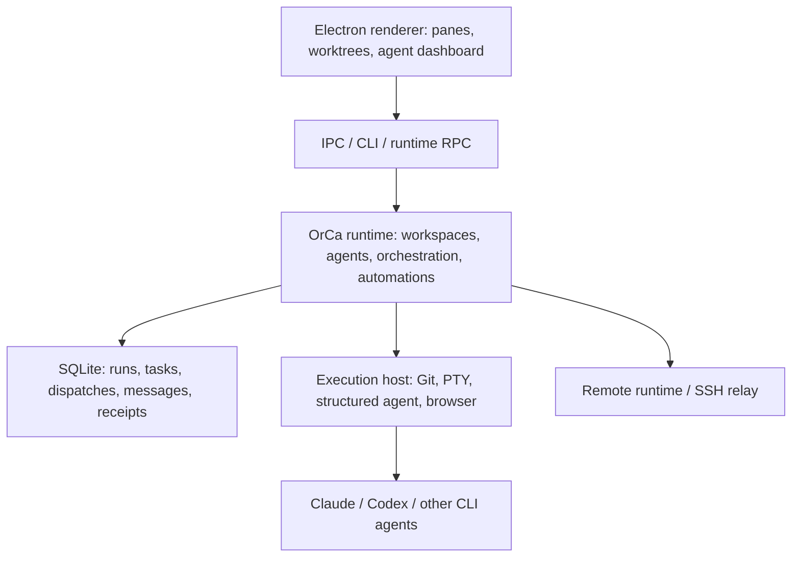
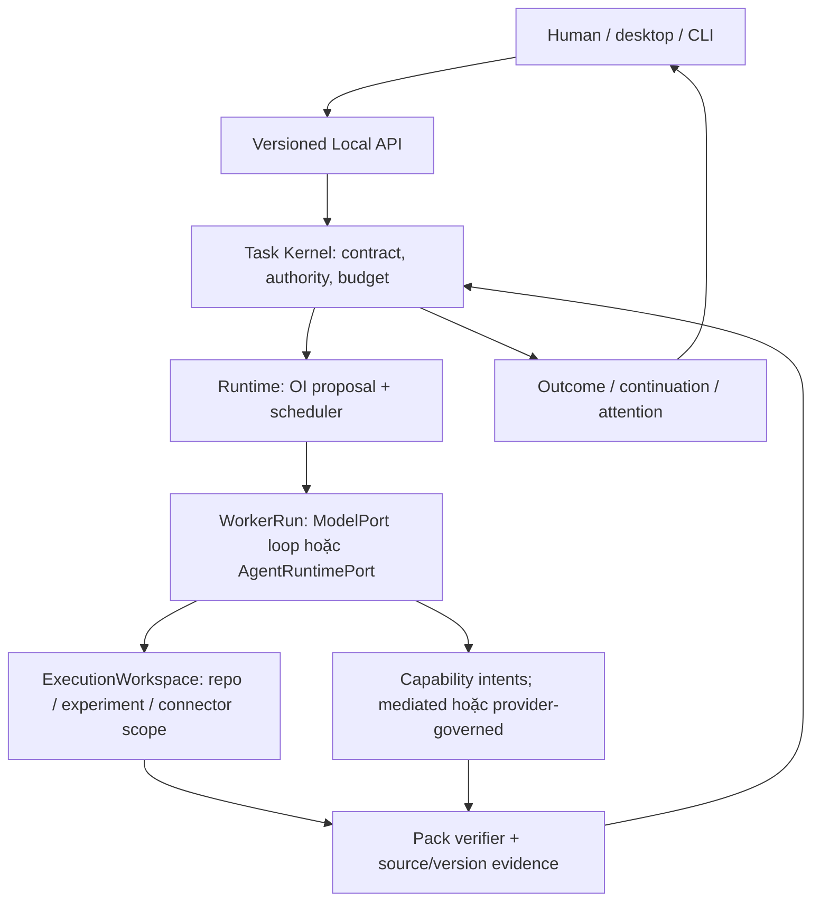

# Nghiên cứu mã nguồn OrCa và quyết định kiến trúc cho Custos

Tài liệu này là **source study**, không phải mô tả tính năng Custos đã chạy và không phải chỉ dẫn sao chép OrCa. Checkout được đọc tại `AgentHub/orca`, commit đã ghi nhận lúc audit là `3f6225deeb08a82448c5f0b0725073401629d462` (MIT, copyright Lovecast Inc.). Sau audit, `.git` của checkout local đã được xóa theo yêu cầu người dùng: source và license còn đó, nhưng SHA/clean-state không còn tái xác minh được từ bản local này. Đường dẫn dưới đây trỏ vào snapshot source đã đọc; nếu cần provenance mạnh hơn phải lấy lại upstream đúng revision. [README OrCa](../../../orca/README.md), [license](../../../orca/LICENSE).

## 1. Phương pháp và giới hạn

**Desktop/headless campaign:** [Superplan §21](workspace-restructuring-plan.md#21-superplan-kết-hợp-custos-và-orca-cho-desktop-và-headless) là bản giao triển khai cụ thể. Lượt đối chiếu mới dùng Nexus inventory read-only cho cả Custos/OrCa, đọc lại launch executor, dispatch-row writer, coordinator và boundary SDK/daemon/harness/UI Custos. Không lập TypeScript AST graph, không chạy app OrCa và không đọc mọi file. Mobile bị loại khỏi scope integration; shared runtime không bị bỏ chỉ vì có mobile consumers.

Đã dùng `AgentHub/Nexus/src/workspace.py` làm inventory nguồn: tạm ánh xạ repo `orca` trong lời gọi read-only của Nexus, nhận **32.534 tệp** không bị ignore, trong đó **29.053 tệp TypeScript/TSX**, khoảng **270 MB**. Sau đó đọc có mục tiêu mã runtime, CLI, schema, UI và hướng dẫn chính thức; checkout sạch/SHA được ghi nhận **trước khi `.git` bị xóa**. Nexus hiện chỉ dựng AST/call graph cho Rust/Python, nên số lượng tệp được liệt kê **không** có nghĩa đã có đồ thị symbol/call TypeScript hay đã đọc từng tệp. Chưa chạy OrCa app, e2e, đo hiệu năng hoặc audit security. Không đưa OrCa vào database index hiện có vì `index_repo` xóa chỉ mục theo repo trước khi nạp lại và việc nạp khối TypeScript lớn chỉ tạo text chunks, không chứng minh call graph.

Với claim sản phẩm có thể thay đổi, đối chiếu thêm [Worktrees](https://www.onorca.dev/docs/model/worktrees), [supported agents/permissions](https://www.onorca.dev/docs/agents/supported) và [orchestration skill chính thức](https://github.com/stablyai/orca/blob/main/skill-guides/orchestration.md). Tài liệu và source có thể khác thời điểm; nhận định bên dưới ưu tiên code ở SHA đã pin, không khẳng định mọi release hiện hành giống hệt.

## 2. OrCa thực sự gồm những gì

OrCa **không chỉ là UI bọc coding agents**. Nó sở hữu runtime, worktree lifecycle, task DAG/dispatch, mailbox, process identity, unknown-state recovery, structured agent sessions, automation và remote host. Đồng thời nó **không thay thế reasoning loop của mọi coding agent**: Claude/Codex/CLI agents vẫn có hành vi, tool và quyền riêng. Bảng là các điểm đã xác minh trong mã, không là bảng phủ định những tính năng chưa tìm thấy.

| Vùng | Bằng chứng ở OrCa | Điều Custos cần hiểu |
|---|---|---|
| Worktree lifecycle | [`orca-runtime-create-managed-worktree.ts`](../../../orca/src/main/runtime/orca-runtime-create-managed-worktree.ts) phân nhánh folder/local/SSH, setup, metadata, terminal và cache invalidation; [docs](../../../orca/docs/site/content/docs/model/worktrees.mdx) có create→work→review→ship→cleanup. | Worktree là đối tượng runtime có host, Git baseline, lineage, setup và tài nguyên; không chỉ gọi `git worktree add`. Folder workspace không có Git vẫn hợp lệ. |
| Unified launch còn đang tiến hóa | [`agent-launch-executor.ts`](../../../orca/src/main/agent-launch/agent-launch-executor.ts) chọn structured hay terminal theo settings/host, chỉ fallback khi **chứng minh** structured create chưa commit. Comment đầu file nói luồng `agent.launch` đã tập trung tại đây nhưng orchestration/mobile/CLI/tab còn các cách launch riêng. | Custos cần **một hợp đồng launch**, nhưng migration các surface phải có conformance, không giả upstream đã thống nhất hoàn toàn. Unknown create không được tự mở agent thứ hai. |
| Native agent fidelity | [`ClaudeStructuredSessionAdapter`](../../../orca/src/main/claude/claude-structured-session-adapter.ts) và [`CodexStructuredSessionAdapter`](../../../orca/src/main/codex/codex-structured-session-adapter.ts) khác nhau; [`AgentLaunchSurfaceFactory`](../../../orca/src/main/agent-launch/agent-launch-surface-factories.ts) tách terminal/structured/prompt delivery. | `AgentRuntimePort` phải là capability-conditional. Không ép native harness vào `ModelPort` hoặc tuyên bố mọi harness resume/rewind/usage giống nhau. |
| Orchestration thật | [`types.ts`](../../../orca/src/main/runtime/orchestration/types.ts) có Run, Task, Dispatch, Gate, message và worker states; [`task-store.ts`](../../../orca/src/main/runtime/orchestration/db/tasks/task-store.ts) tạo Task với dependencies và promote ready trong transaction; [`dispatch-row-writer.ts`](../../../orca/src/main/runtime/orchestration/db/dispatch-row-writer.ts) claim worker atomically và đóng dấu depth. | Custos không được tự nhận Task DAG, nested workers hay durable orchestration là tính riêng. Học `Run → Task → Dispatch attempt`, claim/fencing, nguồn liveness. |
| Decomposition phân đôi | [`coordinator.ts`](../../../orca/src/main/runtime/orchestration/coordinator.ts) ghi rõ **coordinator loop chưa tự AI-decompose**, task phải pre-created; [orchestration skill](../../../orca/skill-guides/orchestration.md) hướng dẫn agent coordinator tự phân việc và gọi CLI. | Không nói “OrCa không phân rã”. Đúng hơn: deterministic scheduler không tự sinh task; agent/skill có thể phân rã ở ngoài loop. Custos phải định nghĩa một owner cho mỗi graph revision. |
| Dispatch/uncertainty | [`coordinator-task-dispatch.ts`](../../../orca/src/main/runtime/orchestration/coordinator-task-dispatch.ts) chặn stale base, cảnh báo heartbeat chậm mà không auto-fail, giữ `dispatched-unobserved` khi prompt có thể đã gửi. [`worker-report-admission.ts`](../../../orca/src/main/runtime/orchestration/worker-report-admission.ts) phân biệt unknown khỏi exited. | `start_unknown`, `stop_unknown`, prompt-unobserved phải là trạng thái vận hành, không retry mù; liveness của PTY khác liveness của agent. |
| Message và lifecycle authority | [`lifecycle-reconciliation.ts`](../../../orca/src/main/runtime/orchestration/lifecycle-reconciliation.ts) đối chiếu sender pane với active dispatch; [`create-core-tables-sql.ts`](../../../orca/src/main/runtime/orchestration/db/schema/create-core-tables-sql.ts) có deliveries, mutation receipts, attempt observation facts. | OrCa đã có provenance/replay/receipts; Custos cần bổ sung đúng **criterion/source/effect semantics** theo pack, không tuyên bố OrCa không có audit. |
| User-visible supervision | [orchestration skill](../../../orca/skill-guides/orchestration.md) yêu cầu explicit outcome, evidence, cleanup owner; [`coordinator-dag-convergence.ts`](../../../orca/src/main/runtime/orchestration/coordinator-dag-convergence.ts) phát hiện blocked DAG. | Custos nên đo có làm supervision dễ hơn/đúng hơn không, thay vì nhận “supervision” làm slogan độc quyền. |
| Remote host | [orcad operations](../../../orca/docs/reference/orcad-operations.md) tách runtime với PTY daemon và mô tả giới hạn cgroup/lifecycle; [`runtime-rpc-request-admission.ts`](../../../orca/src/main/runtime/runtime-rpc/runtime-rpc-request-admission.ts) có auth và giới hạn long-poll. | Host thực thi sở hữu process/filesystem; contact loss không phải process death. Remote là giai đoạn sau local spine, cần endpoint, identity, capability negotiation, lifecycle test. |
| Automation | [`service.ts`](../../../orca/src/main/automations/service.ts) có scheduled runs, precheck, completion watcher và headless dispatcher. | Không nói OrCa thiếu automation; Custos khác ở exact external effect, grant/permit, recipient, reconciliation theo Assistant pack nếu chứng minh được. |
| Skills | [`discovery.ts`](../../../orca/src/main/skills/discovery.ts) và [`skill-install-service.ts`](../../../orca/src/main/skills/skill-install-service.ts) xử lý discovery/install/provider placement. | Skill là distribution/instruction surface, không thay domain capability, authority hay Task semantics. |
| UI/cost | [`WorkspaceSpacePage.tsx`](../../../orca/src/renderer/src/components/workspace-space/WorkspaceSpacePage.tsx) quản lý disk/worktree space; [`AgentKanbanBoard.tsx`](../../../orca/src/renderer/src/components/dashboard-popout/AgentKanbanBoard.tsx) nhóm Needs You/Working/Done/Idle; [`run-usage-collection.ts`](../../../orca/src/main/automations/run-usage-collection.ts) thu usage khi provider hỗ trợ. | OrCa đã có resource/fleet views và một số usage collection; Custos phải chứng minh cost-per-accepted-outcome/quality gate vượt baseline, không suy đối thủ không đo usage. |
| Permission boundary | [supported agents](../../../orca/docs/site/content/docs/agents/supported.mdx) nói launch CLI mặc định dùng bypass flags, có setting Manual, và worktree **không phải sandbox**. | Custos không thừa hưởng permission model từ OrCa. Với native agent ngoài mediated tools, UI bắt buộc hiện `provider-governed`; không tự gắn nhãn `custos-mediated`. |

### 2.1. Bốn trace cần hiểu trước khi thiết kế tương ứng

**Tạo workspace:** Desktop IPC đi qua [`register-worktree-create-handlers.ts`](../../../orca/src/main/ipc/worktrees/create/register-worktree-create-handlers.ts), kiểm repo/host route rồi phân folder/local/SSH; runtime path ở [`orca-runtime-create-managed-worktree.ts`](../../../orca/src/main/runtime/orca-runtime-create-managed-worktree.ts) còn xử lý lineage, setup, agent startup và invalidation. Không có một `Worktree.create()` thuần; transport, host owner và catalog generation tham gia vào receipt. Custos đặt `ExecutionWorkspace` ở runtime, Git/FS/PTY ở adapter, metadata/attempt ở persistence; UI chỉ gửi intent và nhận event.

**Khởi chạy agent:** [`executeAgentLaunch`](../../../orca/src/main/agent-launch/agent-launch-executor.ts) quyết định mode theo user settings, tạo worktree trước khi host xác nhận structured support, rồi tạo surface và giao prompt. [`structured-agent-session-create.ts`](../../../orca/src/main/runtime/rpc/methods/structured-agent-session-create.ts) tách prepare/pre-commit refusal khỏi attach/commit; lỗi publish tab sau attach trả `operation_unknown`, không là bằng chứng session chưa tạo. Custos cần `AgentLaunchAttempt` riêng với `prepared → committing → started | refused | unknown`; retry cùng `command_id`, reconcile theo session/process identity; UI không coi tab thiếu là agent chưa chạy.

**Supervised worker:** [orchestration skill](../../../orca/skill-guides/orchestration.md) tạo Run, Task/spec và `worker-start`; [`task-store.ts`](../../../orca/src/main/runtime/orchestration/db/tasks/task-store.ts) validate dependencies; [`dispatch-row-writer.ts`](../../../orca/src/main/runtime/orchestration/db/dispatch-row-writer.ts) claim ready task và depth; [`coordinator-task-dispatch.ts`](../../../orca/src/main/runtime/orchestration/coordinator-task-dispatch.ts) đưa preamble vào agent; [`lifecycle-reconciliation.ts`](../../../orca/src/main/runtime/orchestration/lifecycle-reconciliation.ts) xác thực report từ active assignee. Custos cần thêm domain `criterion_id/source_revision/verifier_id` và final integration gate, nhưng vẫn học atomic claim, exact assignee và unknown dispatch.

**Remote/automation:** [`orcad-operations.md`](../../../orca/docs/reference/orcad-operations.md) xác định runtime và PTY daemon là hai owner/lifetime; [`AutomationService`](../../../orca/src/main/automations/service.ts) có trigger, target, precheck, run history và completion watcher. Custos không nên chuyển user-space app shutdown thành “dừng mọi worker”, cũng không biến automation run thành standing grant vô hạn. Mỗi trigger tạo bounded Task/Run, chỉ thực thi hiệu ứng được phép, và giữ external effect uncertainty cho Assistant.

## 3. Quyết định sản phẩm: Custos không làm bản sao UI

OrCa giải quyết mạnh **fleet coding agents trong worktree-centric ADE**. Custos đích là **SADE ba miền**: một human giao việc Coding, Research hoặc Assistant riêng lẻ hay kết hợp; system giữ cùng Task/Run/Source/Authority/Evidence IDs qua model, session và pack. Khác biệt là **giả thuyết cần demo/benchmark**, không là claim OrCa thiếu tính năng tương ứng.

1. **Mượn vocabulary, không mượn source of truth:** OrCa Run/Task/Dispatch giúp soi lỗi lifecycle; Custos TaskContract/WorkflowNode/WorkerRun/EffectAttempt/EvidenceRecord vẫn là canonical trong DB của mình. Không nhúng OrCa DB schema hoặc electron store vào kernel Rust.
2. **Một active orchestration owner trên mỗi nhánh:** Custos OI/scheduler phân rã và giao node *hoặc* native agent tự làm trong một bounded WorkerRun. Không để hai planner cùng mở rộng cùng goal. Native child work được quan sát theo khả năng adapter, không mặc nhiên thành Custos child Task.
3. **Hai đường agent khác nhau:** model API/local coder đi qua `ModelPort` + Custos worker loop; Claude/Codex/Goose-style harness qua `AgentRuntimePort`. Terminal là fallback/observation surface, structured session có fidelity cao hơn khi adapter hỗ trợ. Receipt ghi `requested_mode`, `actual_mode`, `reason`, `host`, `prompt_delivery`, `tool_assurance`, `usage_quality`.
4. **Không worktree mặc định cho mọi turn:** read-only repo question dùng snapshot/index; one-writer patch có thể dùng isolated worktree khi cần; parallel candidates cần cùng base + dirty manifest và riêng worktree. Worktree không cấp OS isolation hay quyền. Research có dataset/experiment workspace; Assistant có connector/account scope, không ép Git.
5. **Supervision đi qua outcome:** UI nhìn được scope, model/harness, worktree/host, trạng thái worker, tiêu chí/evidence, cost/unknown, pending effects. `worker_done`, process exit hoặc test exit 0 chỉ là input cho completion gate miền.
6. **Chi phí rẻ nhưng không giảm reasoning mạnh:** direct pinned strong agent là baseline. S1 làm source scouts/test triage/claim extraction/identity candidates có budget; OI chỉ fan-out/cascade khi dự đoán lợi ích đã hiệu chỉnh vượt toàn bộ planning, worker, integration, verification và human-review cost. S2 thấy raw source khi cần và có quyền bác S1 hint.

## 4. Luồng Custos đích và quyền sở hữu

| Trách nhiệm | Địa chỉ Custos hiện/đích | Contract cần chốt |
|---|---|---|
| Task/Run/Workspace references | `custos-domain`, `custos-core` | IDs + revision + host/workspace binding, không UI pane ID làm authority. |
| Route/graph/worker/resource ownership | `custos-runtime/src/workflow/`, `cognitive/`, `agent/`; chỉ mở `workspace/` khi code thật cần | Một owner, bounded graph, lease, process/worktree release; `unknown` có next action. |
| Native agent vs model | `custos-core/src/contracts/harness.rs` và `custos-provider/src/port.rs` | Capability matrix per adapter, actual mode và assurance per action; native hidden state không giả chuyển được. |
| OS/Git/PTY/browser/protocol I/O | `custos-adapters` | Host-specific effect, path/base precondition, prompt dispatch/reconcile; no silent local fallback từ remote. |
| Canonical event/outbox/index | `custos-persistence` | Attempt/resource ownership và evidence cùng transaction boundary đúng; index rebuildable. |
| Coding/Research/Assistant semantics | `custos-packs` + declarative pack recipes | Verifier theo behavior/claim/recipient, không lặp runtime scheduler trong từng pack. |
| UI | `ui/desktop/src/features/{workspace,tasks,engineering,research,assistant,connections}/` khi implement | UI projection từ backend; pane layout local-only, Task/effect truth không nằm trong React store. |
| Composition/API | `custos-daemon` + `custos-sdk` + thin `custos-app` hosts | Một backend owner; command ID, expected version, event replay/capability negotiation. |

Các path trong bảng là target ownership, **không xác nhận module đã tạo hay tính năng đã chạy**. Đặc biệt UI desktop hiện còn mock state, runtime có nhiều agent-loop paths và một số protocol stubs: xem [refactor audit](workspace-restructuring-plan.md) và [physical catalog](codebase-architecture.md).

## 5. Product UX theo ba miền

| Miền | Workspace/pane cần có | Tác động và kết quả |
|---|---|---|
| Coding | Repo tree/symbol, native agent chat hoặc terminal, worktree/host, diff annotation, test/criterion matrix, candidate compare | Source snapshot và dirty main; patch/integration riêng; hidden/trusted verifier; cleanup có owner. |
| Research cho programming/AI/Data | Corpus/PDF/web/notebook/dataset/experiment, source spans, claims/contradictions, code/config/env/seed/metrics | Evidence theo source version, OCR/parse gaps, experiment resources; handoff claim chọn lọc sang Engineering. |
| Assistant | Task/notes, identity card, draft, calendar, automation timeline/outbox | Exact recipient/payload/account preview; revoke/expiry; timeout sau send là `uncertain`, không gửi lại mù. |

Một shell có layout presets nhưng không ép ba pack chạy đồng thời. Worktree/sidebar pattern của OrCa hữu ích cho Coding; không lấy worktree làm root identity cho Research/Assistant. Mọi pane có `task_id`, `run_id`, `resource_id` riêng; chuyển pane không đổi authority hay active Task âm thầm.

## 6. Lộ trình tái cấu trúc có gate

| Gate | Việc làm | Test chống ngộ nhận OrCa/Custos |
|---|---|---|
| A — Runtime truth | Trace `app → SDK → daemon → Task → one worker → event/outcome`, bỏ mock khỏi live path | Restart/replay cùng Task; agent báo done nhưng criterion vẫn unknown nếu thiếu verifier. |
| B — Agent launch contract | Chọn một model worker và một native harness, lưu requested/actual surface + prompt delivery | Refusal trước commit được fallback; unknown create không double-launch; native tool bypass hạ assurance. |
| C — Execution workspace | Local Git snapshot/worktree và resource ledger, không động dirty main | Same-base candidate, stale base, symlink/path, cleanup không xóa untracked hoặc external worktree. |
| D — Orchestration | Compiler typed DAG, one-owner delegation, bounded scheduling và explicit gate | Duplicate dispatch, blocked deps, lost worker/remote unknown, worker_done không bypass criterion. |
| E — Ba pack | Research claim/experiment và Assistant exact effect trên chung Task IDs | Citation đúng locator nhưng sai support; wrong-recipient; mail timeout; cross-pack không chuyển grant. |
| F — Product economics | Paired ablation direct strong agent vs retrieval/S1/OI và UI cost ledger | Cost per accepted task gồm retries/candidates/human time, latency p95, quality noninferiority. |

Remote host, browser act, mobile và đa protocol là các gói riêng **sau** local end-to-end. `MCP` chỉ expose capabilities được chọn, `ACP` là editor-agent interoperability nếu cần, `A2A` chỉ cho remote delegation có identity; không xây ba hub chỉ vì OrCa có CLI/RPC hoặc vì tên chuẩn hấp dẫn. Mọi lần lấy upstream code cần pin SHA, license notice, dependency/security review và conformance tests; MIT cho phép dùng theo điều kiện license nhưng không làm code phù hợp kiến trúc Rust/Tauri một cách tự động.

## 7. Những điều chưa được kết luận

- Chưa chứng minh OrCa thiếu criterion-specific evidence, cost optimization, Research hay Assistant ở toàn bộ branch/release; các mục trên chỉ phản ánh đường mã đã đọc và định hướng Custos.
- Chưa chứng minh Nexus hiện đủ để index TypeScript của OrCa. Nếu muốn dùng Nexus lâu dài cho OrCa, cần thêm TypeScript parser/import graph, scope index theo source, generation/hash, kiểm latency và migration của DB trước khi quảng bá “full code graph”.
- Chưa build/test Custos theo thiết kế này. Cây code là chỗ đặt trách nhiệm, không là lệnh refactor toàn bộ ngay.

## 8. Bản đồ hấp thụ năng lực OrCa vào Custos

“Đắp full OrCa” trong kế hoạch Custos nghĩa là **lập bản đồ đầy đủ các họ năng lực và đạt functional coverage cần thiết**, không import nguyên Electron runtime, SQLite schema hoặc React state của OrCa. Mỗi track phải có source trace, Custos contract, adapter, persistence, API projection, UI và failure fixture trước khi gọi là absorbed.

| Track | Cụm OrCa cần tiếp tục mổ xẻ | Địa chỉ Custos | Outcome bắt buộc |
|---|---|---|---|
| O1 — Shell/API truth | Electron IPC/preload/runtime RPC, renderer stores | SDK + daemon Local API + thin app hosts + desktop shared API | Một command/event truth; reconnect/replay; UI không giữ Task canonical |
| O2 — Host/workspace resources | Worktree create/cleanup, folder/local/SSH, host catalog | Runtime workspace coordination; Git/FS/process adapters; persistence resource ledger | Folder/Git/worktree cùng contract; dirty baseline; ownership/retention/cleanup; remote uncertainty |
| O3 — Agent profiles/launch/session | Claude/Codex/OpenCode/etc., structured/terminal launch, accounts | `AgentRuntimePort`, adapter capability profiles, launch/session attempts | Requested/actual mode, prompt delivery, started/refused/unknown, attach/cancel/steer theo support |
| O4 — Interactive surfaces | PTY, terminal, browser, computer/emulator | Capability adapters + resource leases; workspace/task UI panes | Streams có backpressure/cancel; process/browser identity; no hidden authority from pane focus |
| O5 — Source control/delivery | Git, worktree, source-control, GitHub/GitLab/Bitbucket/Gitea/Azure integrations | Git/provider adapters; Engineering artifacts/effects | Diff/base/dirty lineage; integration owner; PR/push là effect riêng, không suy từ patch permission |
| O6 — Durable orchestration | Run/Task/Dispatch, atomic claim, dependencies, mailbox, gates, convergence | Runtime workflow + persistence attempts/deliveries + Kernel completion | One graph owner; lease/fencing; blocked/unknown states; worker done không bypass criterion |
| O7 — Automations | Schedules, precheck, headless dispatch, completion watcher | Runtime trigger scheduler + Assistant automation semantics | Definition/occurrence tách biệt; expiry/max runs/revoke; mỗi occurrence có Task/Run và receipt |
| O8 — Remote runtime | orcad, SSH, runtime RPC, relay/push | Optional remote host adapter/protocol after local spine | Auth/capability negotiation; contact loss ≠ process death; reconcile/reattach; no silent local fallback |
| O9 — Skills/plugins/connectors | Discovery/install, plugins, Linear/Jira/Git providers | Capability catalog + adapters + pack recipes | Install/config không cấp grant; versions/provenance; connector conformance and revocation |
| O10 — Operations/economics | Usage/rate limits, telemetry/observability, crash/update | Cost ledger + health/telemetry + daemon lifecycle | Billed/estimated/unknown attempts; rate/backoff; redacted diagnostics; crash recovery; update outside Task truth |
| O11 — Product workspace UX | Workspace space, Kanban, tabs/panes, attention, settings | Desktop workspace/tasks/connections + three domain views | Fleet status, criteria/evidence/cost/attention visible; layout state separated from backend state |
| O12 — Secrets/profile boundaries | AI vault, account/profile settings, provider credentials | OS credential adapter + profile references + privacy/egress policy | No plaintext secret in Task/event/prompt; account identity bound to attempt/effect; rotate/revoke paths |

Tracks O1–O6 và O10–O12 tạo **OrCa-class local foundation**. O7 automation chỉ bật outbound sau Authority/effect recovery. O8/O9 có full target map nhưng không chặn local foundation; từng remote/connector cần một user job và conformance suite. Browser/computer là capability, không là quyền tự động duyệt web hoặc thao tác máy.

Chi tiết dependency, packets và gates nằm ở [refactor plan §20](workspace-restructuring-plan.md#20-chương-trình-hấp-thụ-orca-vào-nền-custos). Source study phải được bổ sung theo trace khi một track bắt đầu; inventory filename không đủ để ký gate.

## 9. Orchestration failure semantics và crate transfer

Lượt audit crate blueprint đọc implementation spans và test cases bên dưới, đối chiếu Cargo metadata/exports/source paths Custos. OrCa tests chưa được chạy; tên test hoặc assertion là evidence về intended behavior tại snapshot, không là kết quả runtime đã đo. [Blueprint §22](workspace-restructuring-plan.md#22-crate-blueprint-và-chuyển-lõi-orca-theo-trách-nhiệm) giữ target ownership/atomic contracts và migration sequence.

| Source đọc | Behavior quan trọng | Nơi tái hiện |
|---|---|---|
| [Dispatch row writer](../../../orca/src/main/runtime/orchestration/db/dispatch-row-writer.ts) | Ready-task claim và active assignee exclusion; depth stamped; caller sở hữu transaction | Persistence atomic claim; runtime dispatch service; core admission/depth/budget rules |
| [Lifecycle transition](../../../orca/src/main/runtime/orchestration/db/lifecycle-transition.ts) | Transition/write projection boundary và transaction-neutral operations; caller guards một số Task mutations | Core policy graph; persistence transaction, runtime command orchestrator. Không copy public Task status updates rộng |
| [Transaction runner](../../../orca/src/main/runtime/orchestration/db/lifecycle-write-transaction-runner.ts) | Begin/savepoint, commit, rollback theo caller-owned operation | Narrow storage transaction operations; không expose SQLite ra runtime |
| [Mailbox consumer fencing tests](../../../orca/src/main/runtime/orchestration/db/dispatch-mailbox-consumer-fencing.test.ts) | Reattach worker B tăng generation, fence delivery/ack A, B vẫn nhận unread mail | Persistent consumer epoch/delivery state + runtime reattach/ack; IDs không phụ thuộc UI pane |
| [Unobserved prompt tests](../../../orca/src/main/runtime/orchestration/coordinator-dispatch-unobserved-prompt.test.ts) | Possibly sent prompt giữ dispatched/unobserved, không paste lại; late worker report có thể settle; definitive undelivered error là failure khác | Runtime native/dispatch reconciliation; records unknown và current assignment; parent criterion riêng |
| [Lifecycle reconciliation](../../../orca/src/main/runtime/orchestration/lifecycle-reconciliation.ts) | Sender/assignee, task/dispatch, active/stale validation; suppressed heartbeat khác unread ignored message | Core report admission + runtime message normalization + persistence observation receipts |
| [DAG convergence](../../../orca/src/main/runtime/orchestration/coordinator-dag-convergence.ts) | Empty/all-terminal/active; blocked with no active tasks emits stuck warning | Runtime progress/blocker detection; Kernel criterion decides outcome, không all-terminal ⇒ success |

Custos findings mới: runtime manifest phụ thuộc persistence nhưng search source chưa thấy direct SQLite/import usage; cần consumer/feature audit trước remove manifest edge. `workflow/dispatcher.rs` chỉ là struct khung. `workflow/lease.rs` dùng directory/copy và string prefix, không Git worktree; validation/copy xen kẽ tạo partial-write window. Daemon production dependencies chưa chứa packs; runtime compiled exports chưa mount `engine/`. Claude harness có subprocess implementation cần conformance/injection, không chỉ source stub. Catalog hiện hữu cần phản ánh các mức present/compiled/wired/verified riêng.

Đây là lý do lấy OrCa lifecycle behavior theo từng trace rồi chia pure types → policy/ports → runtime coordination → concrete adapter/store → daemon composition → UI projection. Một folder OrCa chứa nhiều responsibilities không có một đích crate duy nhất. Mobile vẫn excluded khỏi campaign.
