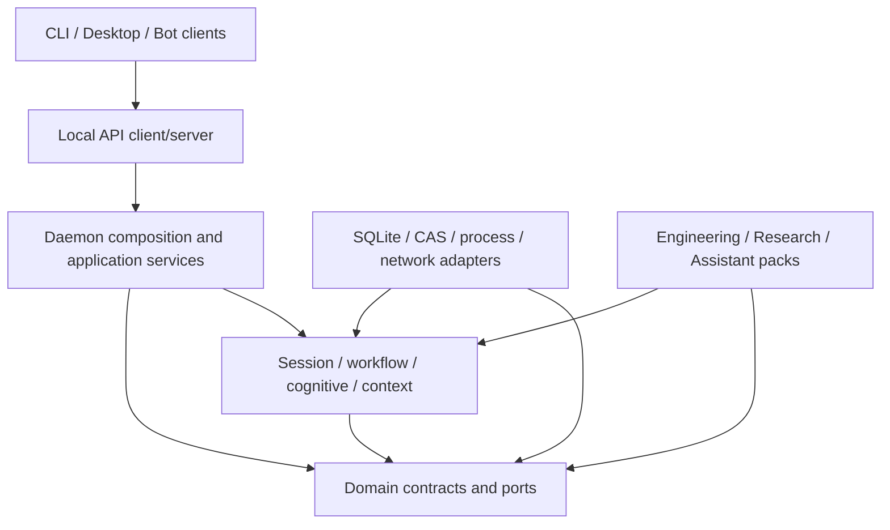

# Repository structure and dependency boundaries

**Document ID:** DEV-REPO-01. **Status:** target codebase organization with a measured 2026-09-28 snapshot. The worktree is mid-migration and has uncommitted file moves/deletions. This map does not authorize bulk moves or imply that every directory is wired into the daemon.

## 1. What is in the repository

```text
Custos/
├── crates/                 Rust workspace: domain, runtime, adapters, apps, packs
├── tools/repo_intelligent/ Repo/Nexus indexing and source retrieval utility
├── schemas/                Versioned protocol, pack and fixture schemas
├── tests/                  Contract, process E2E, crash, support and eval tests
├── evals/                  Quality datasets/runners; distinct from correctness tests
├── workflow_recipes/       Runnable examples; must not become hidden core workflow
├── docs/                   Product/architecture/research/status/vendor/archive
├── dev_docs/               Current 3-person work hub and owner notes
├── ui/                     Desktop and Goose-derived ACP/UI packages
├── services/               Ask-AI bot integration service
├── oidc-proxy/             Separate Cloudflare Worker for CI OIDC-to-upstream auth
├── packages/               NPM distribution wrapper for compiled Custos binaries
├── examples/, fixtures/    Samples and immutable test repositories
├── scripts/, xtask/        Developer automation and workspace maintenance
├── config/, templates/     Runtime defaults and reusable authoring templates
└── buzz/                   Experimental project/surface; document owner and release role
```

The top-level packages/services/UI/oidc proxy are adjunct clients or deployables. They must communicate with the Custos daemon through supported APIs or documented IPC; none receives direct ownership of Task SQLite. `docs/goose/` is imported upstream material, not Custos product documentation. Goose-derived names are classified by the [naming migration register](../status/goose-naming-migration.md), not changed by blind substitution. `tools/repo_intelligent/` may build an index, but source snapshots and exact citation verification remain tied to current bytes.

## 2. Workspace inventory snapshot

`cargo metadata --offline --no-deps --format-version 1` reports **42 workspace members**. The following names are exact metadata package names, grouped by current manifest path:

| Group | Workspace packages |
|---|---|
| `crates/core` (6) | `custos-domain`, `custos-kernel`, `custos-bridge`, `custos-provider-sdk`, `custos-provider-types`, `custos-sdk-types` |
| `crates/runtime` (9) | `custos-session`, `custos-workflow`, `custos-cognitive`, `custos-context`, `custos-security`, `custos-gateway`, `custos-memory-service`, `custos-agent`, `custos-context-management` |
| `crates/infrastructure` (1) | `custos-persistence` |
| `crates/adapters` (17) | `custos-adapters-mcp`, `custos-mcp`, `custos-providers`, `custos-local-inference`, `custos-roaming`, `custos-download-manager`; providers `custos-adapter-provider-{claude,antigravity,codex,fake,local-model}`; judgments `custos-judgment-contracts`, `custos-adapter-judgment-{jev,onnx,rules}`; sandboxes `custos-adapter-sandbox-{linux-bubblewrap,macos-seatbelt}` |
| `crates/packs` (3) | `custos-packs-engineering`, `custos-packs-research`, `custos-packs-assistant` |
| `crates/app` (3) | `custos-cli`, `custos-daemon`, `custos-local-api` |
| `tests` and `xtask` (3) | `custos-tests-contract`, `custos-tests-e2e`, `xtask` |

The sum is 42. The workspace also contains five non-member manifests: `crates/core/custos-sdk`, `crates/runtime/custos-engine`, `crates/adapters/custos-acp-macros`, `tests/custos-test`, and `tests/custos-test-support`; `custos-vscode` appears as a directory but is not one of the 42 metadata members. Re-run metadata before any membership change. Presence does not establish obsolete status; absence does not justify deletion.

## 3. Stable target dependency graph



Dependency rule: source code points toward stable domain contracts/ports; composition code at the outer edge can know concrete adapters. The daemon is the only composition root. Domain stays free of workspace dependencies and I/O. Persistence implements repository/store ports. Session, Bridge, Workflow and Cognitive call ports/use cases, not concrete SQLite or provider crates. Packs declare workflows/capabilities and cannot mint permits. CLI and desktop call Local API; they do not assemble production services.

### Layer ownership, not folder aesthetics

| Logical layer | Current homes | Permitted dependency direction |
|---|---|---|
| Domain | `crates/core/custos-domain` | Standard library/serialization only; no workspace crate, storage, provider or runtime. |
| Application commands and ports | `custos-kernel`, `custos-bridge`, `custos-local-api` after boundary review | Domain and port traits; no concrete persistence or UI. |
| Runtime orchestration | `custos-session`, `custos-workflow`, `custos-agent`, `custos-cognitive`, `custos-context`, `custos-security` | Domain/application ports; no provider-specific or SQLite implementation dependencies. |
| Infrastructure/adapters | `crates/infrastructure`, `crates/adapters/**` | Domain and ports; adapter-to-adapter only through explicit composition interfaces. Never depend on app binaries. |
| Composition | `crates/app/custos-daemon` | May depend on application/runtime/ports and concrete adapters, constructs them once. |
| Clients | `custos-cli`, desktop, bot, npm wrapper | Local API or ACP/agent API; must not depend on persistence or executor implementations. |
| Packs and configuration | `crates/packs`, `schemas/packs`, recipes | Declarative workflow/capability contracts; no direct state writes, network secrets or executor access. |
| Tests/evals | `tests`, `evals`, fixtures | Test support may compose concrete adapters; production crates must not depend on test crates. |

## 4. Measured dependency debt

The metadata graph exposes these concrete boundary leaks. Fix through dependency inversion and compatibility adapters, not mass file movement:

| Current edge | Why it breaks the target | Destination |
|---|---|---|
| `custos-bridge → custos-session + custos-persistence` | A core package reaches into runtime and concrete storage. | Move bridge orchestration under runtime/application; depend on `SessionPort` and `TaskCommandPort`; composition supplies implementations. |
| `custos-cli → model/MCP/provider adapters` | CLI now uses `LocalApiClient`, but unused or legacy runtime dependencies keep product logic available in the client package. | Remove dependencies not required by the thin client after confirming no supported command uses them. |
| `custos-daemon → adapters-mcp + cognitive + persistence + session + workflow` | Some composition is correctly outermost, but broad concrete wiring has not yet been proven as F1/F2. | Keep concrete dependencies only here; construct typed ports and process the same API path used by CLI. |
| `custos-workflow → custos-kernel` | May be acceptable if it depends on a command/query port; direct concrete service coupling creates cycles as orchestration grows. | Verify exact exported type usage; depend on narrow command/store ports, not kernel internals. |
| `custos-agent → custos-provider-types`; `custos-context-management → provider-types` | Wire-format package is leaking into runtime contracts. | Move shared inference event/tool abstractions into provider SDK/domain port; keep vendor wire types inside adapters. |
| `custos-providers → custos-local-inference + provider-types` | Umbrella adapter can become an adapter-to-adapter dependency hub. | Limit it to registry/composition or move local inference implementation behind provider port registration. |

First hard boundaries: `custos-domain` has no workspace dependency; adapter and runtime packages cannot depend on app binaries; clients cannot depend on persistence; no cycles among workspace packages. Add stricter edges only after ports exist, then enable strict CI mode. Until then report the debt rather than make every developer command fail on known transitional edges.

## 5. Crate consolidation rule

Forty-two packages are not automatically too many, and merging all crates would erase useful safety boundaries. Consolidate only when two crates share one owner, lifecycle and release cadence and no boundary test depends on their separation. Keep separate: domain, kernel, persistence adapter, controlled effect gateway, provider port/adapters, workflow, context/index, packs and apps. Review `custos-gateway` before adoption because it currently duplicates cognitive routing and dispatches mocks; it is not the controlled effect gateway. Other candidates are `provider-types` vs `sdk-types` and `context` vs `context-management`. `custos-engine` remains outside the workspace until a small needed capability is extracted and verified. No new orchestration microservice is needed for the Intelligence Hub.

## 6. Physical folder policy

Do not rename or move the 42 package directories while the working tree is already mid-migration. First make package boundaries match the dependency graph, add metadata-based checks, and pin a clean baseline. A later folder move must be a pure mechanical commit with no semantic changes, preserved manifest names, full Cargo metadata diff and code owner review. Move vendor docs only after provenance and inbound-link checks.

## 7. Repository-level quality gates

`cargo metadata` is the inventory authority. Dependency rules are checked against package names and `path` edges, not grep patterns for an old tree. F1/F2/F3 process flows and status recording are defined in the [reference architecture](../architecture/reference-architecture.md), [gap matrix](../status/architecture-gap-matrix.md), and [workboard](../../dev_docs/SPRINT_STATUS.md). Update the map when crate membership changes; preserve old inventories with date and SHA.
