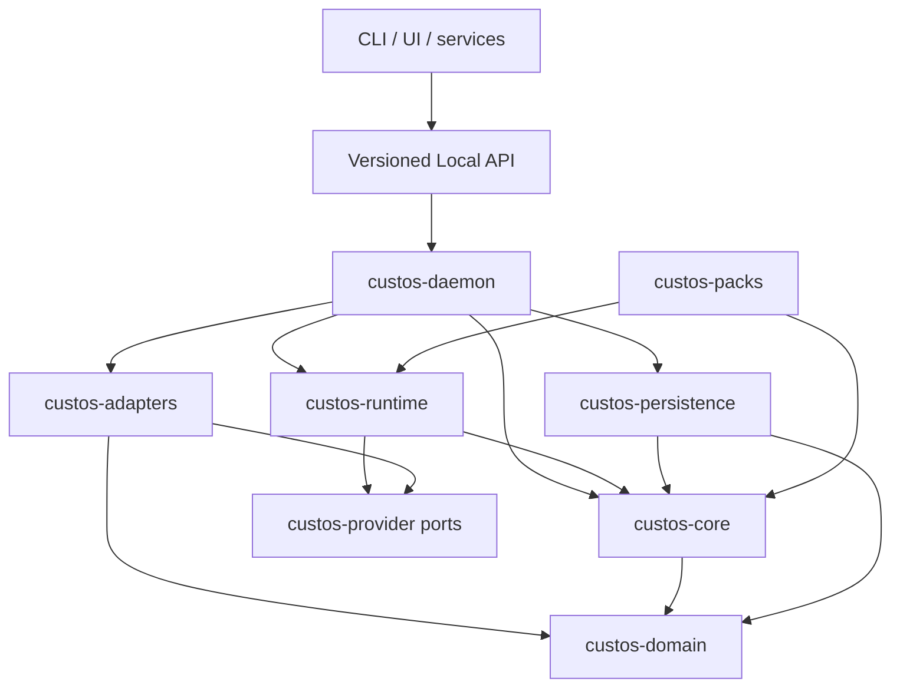

# Repository structure and dependency boundaries

**Document ID:** DEV-REPO-01
**Status:** Canonical physical topology
**Measured:** 2026-09-30 from root Cargo metadata

## Workspace inventory

The Rust workspace contains fourteen members: eleven product crates, two test
crates, and `xtask`.

| Product crate | Responsibility |
|---|---|
| `custos-domain` | Pure entities, identifiers, states, and validation; zero workspace dependencies and no I/O |
| `custos-core` | Task Kernel, commands/events, authority, capability policy, evidence, completion |
| `custos-provider` | Stable provider and runtime port contracts plus canonical provider request/event types |
| `custos-persistence` | SQLite connection, migrations, repositories, artifact/CAS implementation |
| `custos-bridge` | Session-to-Task promotion, attachment, steering, observation, and recall |
| `custos-runtime` | Agent loop, cognitive routing, context, memory, workflow, session, and experimental gateway policy |
| `custos-adapters` | Model providers, MCP, roaming, local inference, sandboxes, downloads, and connectors |
| `custos-sdk` | External client bindings and protocol integration |
| `custos-daemon` | Sole production composition root and Local API process |
| `custos-cli` | Thin command-line client and terminal experience |
| `custos-packs` | Engineering, Research, and Assistant pack registry and logic |

Additional members are `custos-tests-contract`, `custos-tests-e2e`, and
`xtask`. `tests/custos-test` and `tests/custos-test-support` contain manifests
but are not current workspace members. Presence outside Cargo membership does
not establish production readiness.

## Repository map

```text
Custos/
├── crates/                 eleven Rust product crates
├── tests/                  contract, process E2E, support, and fixtures
├── xtask/                  repository automation workspace member
├── schemas/                versioned protocol and pack contracts
├── evals/                  quality, calibration, and cost evaluation
├── workflow_recipes/       examples and validated workflow data
├── docs/                   minimal canonical architecture, contracts, status, research
├── dev_docs/               sprint board, decision queue, and working protocol
├── tools/                  repository intelligence and maintenance tools
├── ui/                     desktop and imported UI/ACP packages
├── packages/               distribution packages and client integrations
├── services/               external service integrations
└── oidc-proxy/             separate CI authentication worker
```

This map lists directories observed in the checkout; the target-only groups
`compatibility/`, `vendor/`, and `config/profiles/` in
[`ARCH-TOPOLOGY-01`](../architecture/polyglot-repository-topology.md) must not
be created as empty placeholders. A module enters the supported product only
through a named owner, contract, daemon or client entrypoint, and tests.

| Existing surface | Disposition now | Admission or cleanup gate |
|---|---|---|
| `config/default.example.toml`, `schemas/`, `workflow_recipes/` | Configuration and versioned boundary inputs | Validate schemas; no secrets or implicit executable authority |
| `tests/contract`, `tests/e2e` | Cargo workspace tests | Keep producer/consumer and daemon-process fixtures separate |
| `tests/crash`, `tests/fixtures`, `tests/support` | Test sources/fixtures, not proof by presence | Attach to executable Cargo/CI targets before claiming coverage |
| `tests/custos-test*` | Existing manifests outside the current workspace | Decide migrate/reuse/retire after inventory; do not count as passing workspace tests |
| `ui/desktop`, `packages/custos-vscode`, `packages/custos-npm-package` | Product client and distribution candidates | Local API conformance, install smoke tests, release ownership |
| `ui/goose-acp*`, `ui/goose-binary`, `ui/text` | Imported/compatibility UI surface | Pin upstream provenance; keep only tested Custos use cases, then rename or retire by separate PR |
| `tools/repo_intelligent`, `evals/`, `templates/`, `examples/` | Research/evaluation and examples | Keep outside trusted runtime; examples never become default installed capabilities |
| `services/ask-ai-bot`, `oidc-proxy/` | External integration and CI worker | Versioned API/identity boundary; no direct SQLite or Kernel imports |
| `buzz/`, `scratch/` | Non-product automation and local audit material | Read-only/unassigned until lead records owner and release role; not a product dependency |
| `scripts/goose_scripts/`, `scripts/migration/` | Legacy/transition scripts | Source, security and removal review before reuse; no implicit install hooks |

## Dependency direction



The diagram expresses allowed knowledge, not a requirement that every arrow be
present. Dependencies point toward stable contracts; the daemon may know
concrete outer implementations because it constructs the process.

## Hard boundaries

- `custos-domain` has no workspace-crate dependency and performs no I/O.
- `custos-core` does not import runtime, adapters, clients, or provider-specific
  wire implementations.
- Runtime calls model/agent/capability/judgment/gateway ports; concrete provider
  and tool implementations stay in adapters.
- Adapters never depend on app binaries.
- CLI, UI, services, sidecars, and gateways do not access Custos SQLite.
- Packs declare workflows, context, capabilities, criteria, and verifiers; they
  cannot mint permits or mutate Task state directly.
- `custos-daemon` is the only production composition root.

The current automated dependency check reports one transitional edge:
`custos-bridge -> custos-persistence`. Remove it through narrow bridge/session
ports or move orchestration outward; do not create another facade crate merely
to hide the edge.

## Logical modules inside consolidated crates

Crate consolidation does not erase boundaries. Each consolidated crate keeps
internal modules with explicit ownership and ports:

| Crate | Internal boundaries that must remain distinct |
|---|---|
| `custos-core` | Kernel, authority, effects, evidence, sandbox policy |
| `custos-runtime` | Agent, cognitive, context, memory, session, workflow, gateway policy |
| `custos-adapters` | Model adapters, agent adapters, MCP, capability adapters, OS sandbox, connectors |
| `custos-persistence` | Connection/migrations, repositories, CAS, outbox/lease stores |
| `custos-packs` | Pack registry, Engineering, Research, Assistant |

Compatibility re-exports may exist during migration, but new code uses the
canonical eleven package names. Aliases are migration debt, not additional
architectural components.

## Work-ready module ownership and first bounded change

This is a coding map, not permission to change shared contracts without the
reviews in `AGENTS.md`. A `first change` is a reviewable entry point; it is not
claimed complete because the directory exists.

| Edit zone | Driver | First bounded change | Evidence to hand off |
|---|---|---|---|
| `custos-domain` Task/authority/evidence values | Truong; Vi specifies criteria, Vinh reviews | Pin C-01/C-03/C-04 IDs, revisions and invalid transitions without new crate | Unit fixtures for duplicate/stale/mismatched inputs |
| `custos-core/src/kernel`, `authority`, `evidence`, `capability` | Truong; Vi reviews evidence, Vinh reviews lifecycle | Resolve trusted evidence IDs and exact permit/attempt rules | Forged claim and stale permit denied in core tests |
| `custos-persistence/src/repositories`, `artifacts`, migrations | Truong; Vinh reviews recovery | Patched SQLite baseline, atomic event/attempt/evidence stores | Version assertion, concurrent WAL and kill/restart fixtures |
| `custos-provider` and provider/local inference adapters | Vi; Truong reviews egress, Vinh reviews run interface | Pin one direct ModelPort attempt contract and fake/real conformance | Actual model identity, usage/unknown, privacy and retry cases |
| `custos-runtime/src/context`, `context_management`, `memory_service`, `cognitive` | Vi; Truong reviews data, Vinh reviews handoff | Choose one ContextPack compiler; mark other paths transitional; direct-route baseline | Exact source spans, omission/redaction and cache-scope fixtures |
| `custos-packs/{engineering,research,assistant}` | Vi; subject reviewers | Define one criterion/verifier profile per vertical slice | Pack fixtures distinguish source location, support, execution and acceptance |
| `custos-bridge`, `custos-runtime/src/{session,workflow,agent}` | Vinh; Truong reviews state, Vi reviews worker semantics | C-01 promotion and C-02 ready-frontier/checkpoint boundaries | Idempotent promotion, stale lease and restart fixtures |
| `custos-adapters/src/mcp`, agent/protocol adapters | Vinh; Truong reviews capability path | Capability discovery and provider-native-tool assurance mapping | Schema-change, cancel, reconnect and denied-tool fixtures |
| `custos-adapters/src/sandbox`, capability/download paths | Truong; Vinh reviews protocol use | One tested OS isolation profile and exact effect executor | Symlink/escape/egress denial and ambiguous receipt fixtures |
| `custos-daemon` | Truong; Vi and Vinh review composed paths | Wire C-03/C-04 and direct F1 through one production entrypoint | Process E2E plus crash/restart, not in-process assembly |
| `custos-sdk`, `custos-cli`, `ui/`, `packages/`, `services/` | Vinh; Truong reviews API/release, Vi reviews UX | Versioned read-only Task/outcome client before effect UI | Contract and install smoke tests; zero direct DB access |

The two SEs own safety-critical state and execution code even when Vi drives
most of the total program effort. Vi supplies product decisions, source
research, evaluation fixtures, context/model/pack implementations, and review
of evidence semantics. A single owner writes each state family; reviewers may
challenge semantics but do not become duplicate writers.

## Immediate independent work without contract drift

| Lane | Can start on the dirty branch as a bounded PR | Waits for accepted shared contract |
|---|---|---|
| Vi | F1 ContextPack and citation fixtures; single-model route benchmark; Jev/9Router/Agentgateway source pins and conformance plans | C-04 evidence DTO changes, gateway activation, budget schema |
| Truong | Format/dependency baseline; SQLite upgrade and version assertion; forged-claim failing test | C-03/C-04 production schema and completion semantics |
| Vinh | Session promotion/restart fixtures; ACP/MCP capability inventory; CLI Local API conformance fixture | C-01/C-02 DTO changes, agent-native effect admission |

Do not merge experimental adapters to make a demo look complete. Merge order:
clean baseline -> reviewed contract/fixture -> owner implementation -> daemon
composition -> process success/failure proof -> client activation. A later lane
may research or write test fixtures in parallel but cannot bypass its upstream
gate. Record exact paths and tests in the [workboard](../../dev_docs/SPRINT_STATUS.md).

## External and imported source

Goose-derived engine, provider, UI, and ACP material is an upstream source pool.
The repository does not vendor the upstream documentation website. Adopt a
bounded capability only after recording source revision, license, security
impact, new owner, destination module, conformance tests, and retained Custos
authority. Do not activate a whole imported engine because its source is
present. Follow the
[`upstream-dissection`](../research/upstream-dissection.md) protocol.

9Router, Agentgateway, and CLIProxyAPI remain optional external deployment
profiles. They connect through explicit ports and never become Cargo-level
owners of Task, authority, evidence, or budget state.

## Change rules

1. Update Cargo metadata and this document in the same topology change.
2. Separate mechanical moves/renames from semantic changes.
3. Add no new crate without an ADR explaining why a module in one of the eleven
   crates is insufficient.
4. Preserve compatibility only with an owner, removal gate, and test.
5. Run dependency, naming, formatting, workspace test, and relevant non-Rust
   checks before proposing an integration merge.
