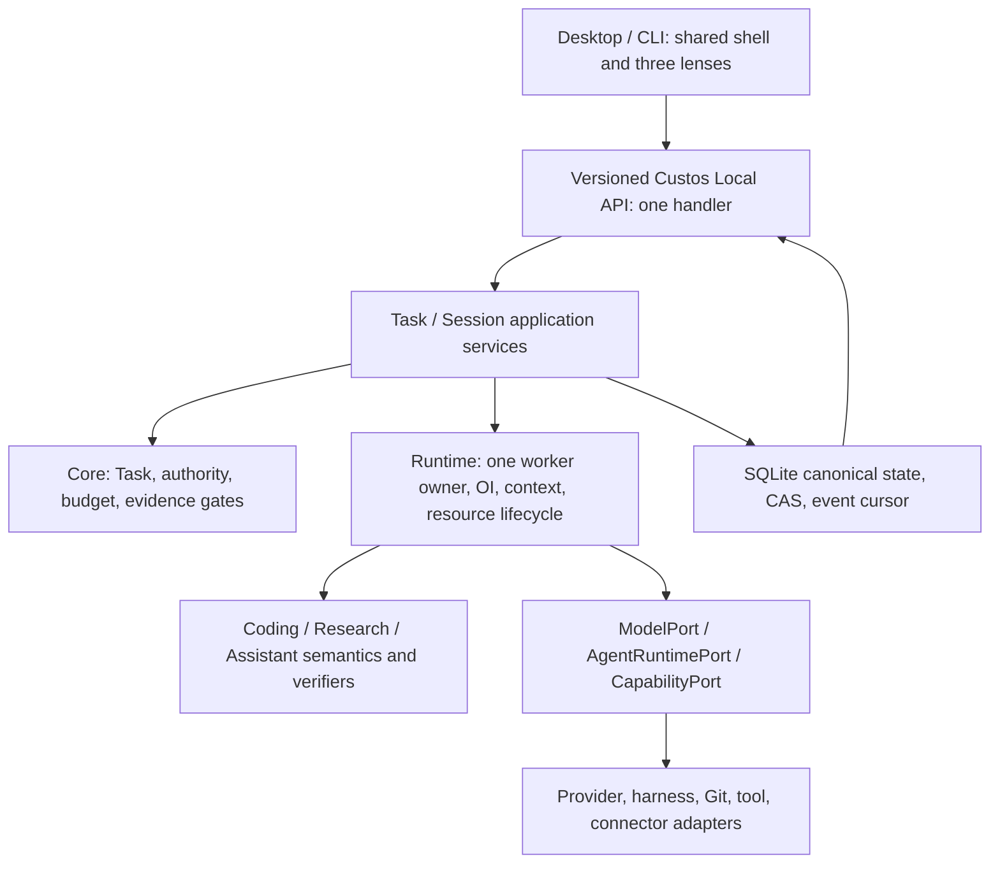
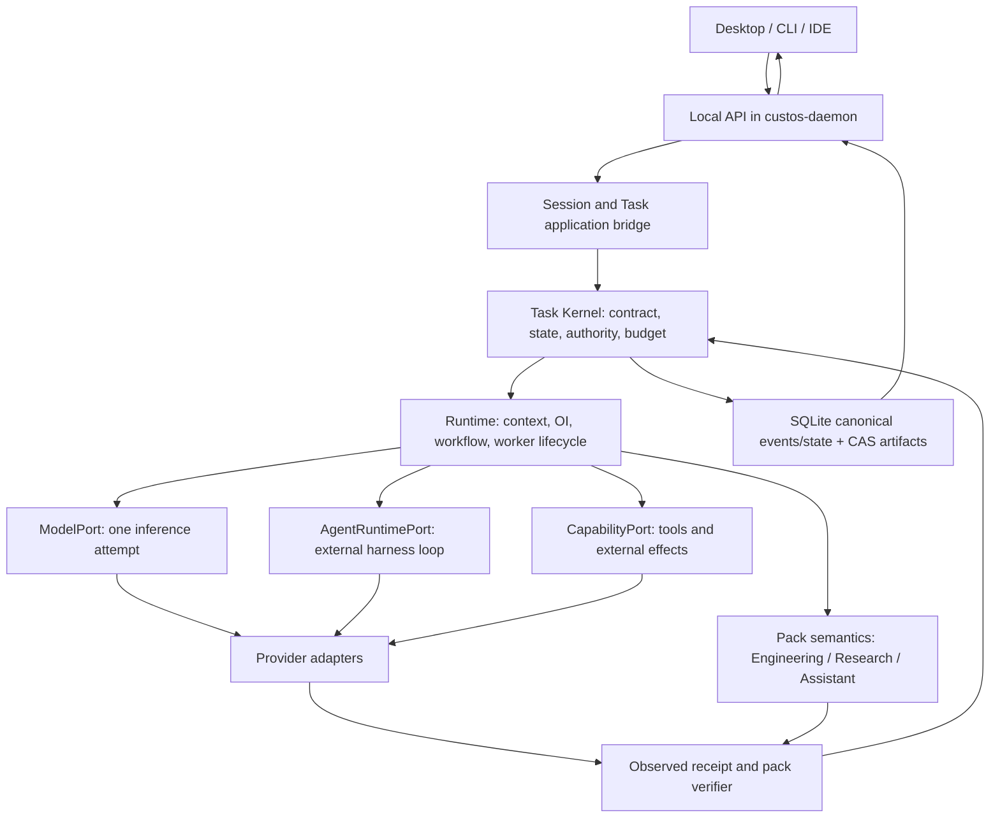
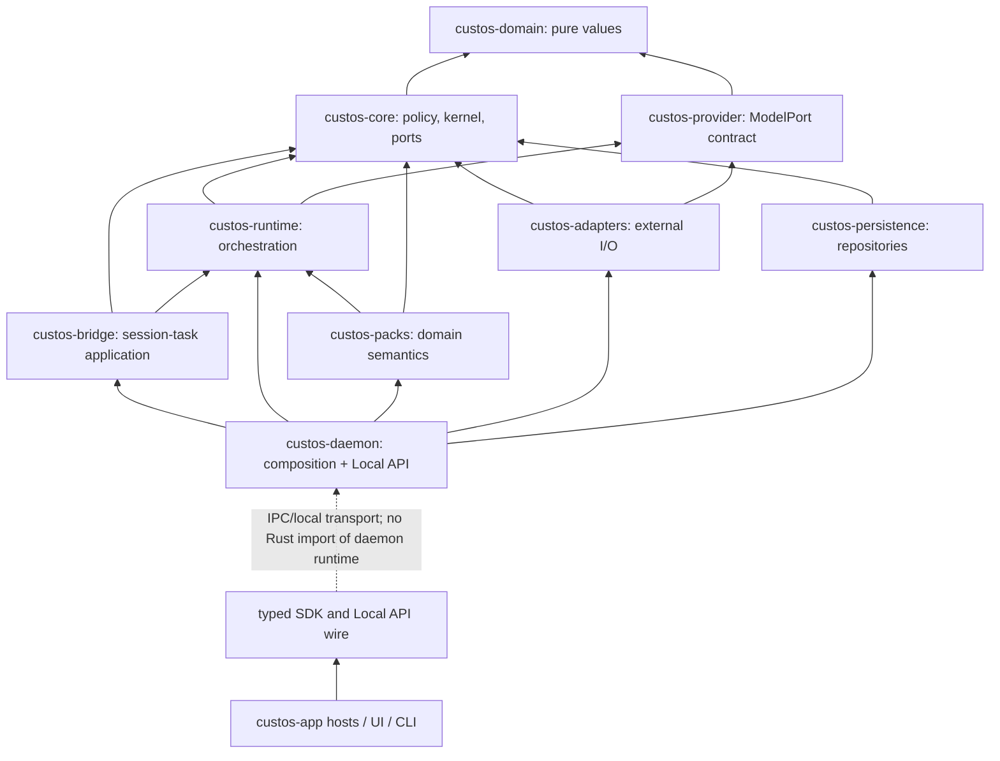

# Kế hoạch hội tụ backend và desktop Custos SADE

**Đường đọc để triển khai desktop:** §11–23 là blueprint chi tiết bổ sung cho các quyết định và findings §1–10: trải nghiệm ba lens, lịch sử, layout, backend services, API/events, reuse upstream, migration và release gates. Những lỗi được ghi ở ảnh chụp cũ phải được tái kiểm trước khi sửa; §12 ghi các điểm đã đối chiếu lại. Đây là kế hoạch thiết kế, không ghi nhận frontend/backend mới đã được xây.

**Trạng thái:** đề xuất để review, không phải chứng nhận tính năng đã hoàn thành hoặc quyết định thay thế [Custos.md](../../Custos.md). Kế hoạch này chuyển các nghiên cứu [OrCa](orca-source-study.md), [Open Science Desktop](open-science-source-study.md) và [workspace restructuring](workspace-restructuring-plan.md) thành một thứ tự triển khai kiểm được. Không thêm mobile trong đợt này. Không sao chép cả OrCa/Open Science thành một runtime thứ hai.

**Tiến độ hiện thực đầu tiên:** research ingress trong `custos-core` hạ mọi source/claim do client gửi xuống draft, tính lại digest của passage, không chấp nhận client-created successful run; daemon tra claim canonical khi tạo Coding handoff. Ba pane Research chỉ nạp mock khi ở web demo, không dùng mock làm fallback khi backend live rỗng/lỗi. Daemon không còn bỏ qua lỗi outbox recovery khi khởi động. Test Local API tạo Research folder workspace và lưu source/claim trên cùng dispatcher chứng minh hai đường có thể cùng tồn tại. Đây mới là phần trust/data boundary của P0, **chưa** hoàn thành verifier, source-byte anchoring, Research execution, OrCa durable orchestration hay một cuộc refactor UI toàn phần. Các hàng P0 dưới đây mô tả lỗi trong ảnh chụp ban đầu và cổng hoàn thiện cuối, không phải mọi lỗi vẫn còn nguyên trạng.

**Ảnh chụp hiện trạng:** checkout Custos tại `529140b006ba813653ff180477d61bc934aaa701` ngày 07-10-2026, có nhiều thay đổi chưa commit trong daemon, Research persistence và desktop. Open Science checkout tại `04b64817c12e7fdbe0e052bfa1aeaf8802feecde`. OrCa checkout local đã mất `.git`; source study ghi SHA tại thời điểm audit là `3f6225deeb08a82448c5f0b0725073401629d462`, nhưng không thể tái xác minh SHA từ checkout hiện tại. Trước khi sao chép mã literal, lấy lại source upstream đúng revision và kiểm license/dependencies. Đây là khảo sát các đường kiến trúc và luồng sản phẩm trọng yếu, **không** là tuyên bố đã đọc từng tệp trong hơn 25.000 tệp source OrCa hay đã chạy toàn bộ e2e của ba dự án.

## 1. Kết luận cần chốt trước khi chia việc

Custos nên là **một SADE với một backend owner và một Task spine**, không là LLM gateway cộng ba giao diện. Desktop có **một shell, một conversation model và ba workbench lens**: Copilot/Assistant, Coding, Research. Người dùng đổi lens để đổi cách xem và thao tác với cùng công việc; không tự tạo session, Task, grant hoặc agent mới. Khi muốn phân việc thực sự, UI tạo bước/child Task/handoff tường minh, có selected artifacts và phạm vi dữ liệu. Một user chỉ dùng Coding vẫn có trải nghiệm hoàn chỉnh.

Sơ đồ là **luồng trách nhiệm**, không phải hướng Rust import. Pure values ở `custos-domain`; `custos-core` giữ policy/invariants, không là DTO crate cho gateway. `custos-daemon` là composition root và Local API host. `custos-provider` giữ ModelPort; native coding harness dùng `AgentRuntimePort`, không bị giả làm model API. MCP, ACP và A2A là các giao thức ở biên có use case riêng, không thành lớp bắt buộc trước mọi tác vụ. Đối chiếu [protocol map](../architecture/protocol-and-connectivity-hubs.md).

## 2. Những vấn đề hiện tại phải xử lý theo thứ tự rủi ro

| Mức | Bằng chứng trong checkout | Hệ quả sản phẩm | Gate đề xuất |
|---|---|---|---|
| P0 — tính trung thực | [`daemon_client.ts`](../../ui/desktop/src/api/daemon_client.ts) tự bật web fallback khi không có Tauri, dựng Task/Run/Research source/claim giả. [`LiteraturePane.tsx`](../../ui/desktop/src/components/research/LiteraturePane.tsx), [`ClaimsMatrixPane.tsx`](../../ui/desktop/src/components/research/ClaimsMatrixPane.tsx), [`RunsLedgerPane.tsx`](../../ui/desktop/src/components/research/RunsLedgerPane.tsx) còn dùng mock khi API trả rỗng/lỗi; [`DeepInspectorPane.tsx`](../../ui/desktop/src/components/research/DeepInspectorPane.tsx) luôn hiện artifact mẫu và `reviewPassed: true`. | Trạng thái trống/lỗi có thể trông như dữ liệu thật, gồm DOI, số liệu và nhãn verified. Đây là lỗi UX **và** epistemic safety, không chỉ placeholder. | Tách `DemoDataSource` do người dùng chủ động bật; mọi record có `origin=demo`; live trống/lỗi hiển thị empty/error thật; bỏ badge “verified/sealed” nếu không có verifier receipt. |
| P0 — handoff sai | [`ClaimsMatrixPane.tsx`](../../ui/desktop/src/components/research/ClaimsMatrixPane.tsx) bắt lỗi từng claim rồi vẫn gọi callback và toast “Handed off ... verified”; [`api.rs`](../../crates/custos-daemon/src/api.rs) tạo Task từ `claim_id`/`statement` do client gửi, không đọc lại claim/source/permission trước khi tạo. | Người dùng tưởng đã chuyển kết quả Research sang Coding dù có thể thất bại hoặc không giữ provenance. | Handoff command nhận IDs + expected revisions; backend đọc source/claim, kiểm scope/status, ghi typed handoff và trả receipt; UI chỉ báo thành công từ receipt. Không gọi mọi claim đã chọn là verified. |
| P0 — write path Research | [`api.rs`](../../crates/custos-daemon/src/api.rs) nhận `SourceRecord`, `PassageAnchor`, `ResearchClaim`, `ResearchExperimentRun` từ client rồi gọi save; [`claim.rs`](../../crates/custos-domain/src/claim.rs) để client truyền `verified`, `level`, `confidence_score`, `sealed_proof_uri`; [`research.rs`](../../crates/custos-persistence/src/repositories/research.rs) lưu các field này. | Client có thể tự gắn trạng thái bằng chứng cao mà chưa qua kiểm chứng. | Tách proposed claim/observation khỏi `CriterionVerificationRecord`; verifier backend tính locator/hash và ghi method/status; semantic support giữ unknown/reviewer. API save không nhận trusted status từ client. |
| P0 — ingress/identity | [`main.rs`](../../crates/custos-daemon/src/main.rs) bind TCP loopback mặc định nhưng cho `CUSTOS_BIND` override; [`ApiRequest`](../../crates/custos-daemon/src/local_api/lib.rs) chỉ có `id, method, params`, chưa có actor/expected revision/deadline/auth. | Loopback không là ranh giới quyền giữa các local process; non-loopback do cấu hình sẽ là rủi ro lớn hơn. Retry write chưa có idempotency envelope nhất quán. | Khóa non-loopback trước khi có auth/CSRF/origin model; chuẩn hóa command envelope và per-method actor/scope checks; thử duplicate, stale revision, malformed payload. |
| P1 — execution truth | [`runtime.rs`](../../crates/custos-daemon/src/runtime.rs) mặc định `FakeProvider`; [`task_runtime.rs`](../../crates/custos-runtime/src/workflow/task_runtime.rs) có native path với `ContextPack` rỗng; [`worker_executor.rs`](../../crates/custos-runtime/src/workflow/worker_executor.rs) còn action `execute_worker` tương thích simulation. | `Run Active` hoặc worker output không bảo đảm một model/harness thật đã giải công việc. | Profile demo/test tách hẳn live; không nhận live run nếu selected executor/capability/context chưa hợp lệ; persist actual response, usage, errors và outcome. |
| P1 — chat không trả lời | [`AppContext.tsx`](../../ui/desktop/src/context/AppContext.tsx) append user message, gọi `startRun`, rồi thêm câu “Run accepted... result is not available in this view yet.” Không có event/cursor để nhận assistant output; state khởi từ `mockData`. | UI có vẻ chat nhưng không phải conversation với agent. Chuyển lens giữ mảng message trong React, chưa chứng minh resume sau restart. | Backend stream/replay events; UI projection từ persisted session journal + run events; send có pending/error/retry theo command ID. |
| P1 — desktop state và tab | [`studio/page.tsx`](../../ui/desktop/src/app/studio/page.tsx) lưu lens qua localStorage và tab map trong component keyed bằng project + active session, route `studio/:sessionId`. [`OrcaTabbedContainer.tsx`](../../ui/desktop/src/components/views/OrcaTabbedContainer.tsx) trộn browser, fake repo files, terminal, Research panes trong một file lớn. | Tab/resource không có ID bền; đổi Task/lens/restart dễ mất hoặc gắn sai view, khó test và mở rộng ba miền. | Một pane/resource registry + layout projection riêng; canonical Task/session/run refs từ backend; layout-only state ở frontend. Restore chỉ mở view, tuyệt đối không launch agent/execute cell. |
| P1 — build gate | Chạy `ui/desktop/node_modules/.bin/tsc --noEmit` trên checkout này báo TS6133 `colorTheme` không dùng tại `ClaimsMatrixPane.tsx:363`. `cargo check -p custos-daemon --offline` thành công. `pnpm run build` bị wrapper cố kiểm lockfile trên npm registry trong sandbox không có DNS và đã dừng; không có kết luận build Vite. | UI chưa qua typecheck; Rust daemon compile không chứng minh các luồng e2e. | Sửa TS error trong packet đầu; chạy trực tiếp local toolchain/CI offline phù hợp rồi smoke test. Không gọi package/network failure là lỗi source. |

Các dòng trên mô tả **worktree hiện tại**, gồm code chưa commit; không suy rộng thành security audit toàn diện. Cần giữ nguyên user changes và ghi diff/owner khi bắt đầu từng packet.

## 3. Backend base để cả nhóm phát triển cùng một hướng

### 3.1 Một backend owner, nhiều transport

`custos-daemon` sở hữu profile/SQLite/CAS, Task services, pack registry, adapter wiring, lifecycle và recovery. Tauri host trong [`crates/custos-app/desktop/src/lib.rs`](../../crates/custos-app/desktop/src/lib.rs) đã mỏng hơn trước: chuyển `custos_request` sang `LocalApiClient` thay vì tự bootstrap runtime. Giữ hướng này. Desktop/CLI không mở DB, không khởi scheduler khác. Stdio JSONL và local TCP hiện có phải gọi **cùng handler**; HTTP/WS/SSE chỉ thêm khi có client cần, không cần `custos-gateway` crate mới. Browser dev mode không thể lén thay backend bằng success simulator.

Local API target gồm `schema_version, command_id, correlation_id, actor, task_id?, expected_revision?, deadline, privacy_class, payload`; response có typed error `invalid|conflict|unauthorized|unsupported|unavailable|uncertain` và `request_id`. Read-only query có thể đơn giản hơn; write command bắt buộc idempotency/optimistic concurrency. `WatchEvents(after_seq)` trả các **lifecycle/decision/effect** events; token/PTY output là stream riêng, bounded, có attempt ID. Reconnect: lấy snapshot/version → subscribe sau cursor → apply theo seq → phát hiện gap → resync, không tự resend write.

### 3.2 Canonical objects và quyền sở hữu

| Object | Owner | Điều không được suy ra |
|---|---|---|
| `ConversationSession`, turn, binding | bridge/application + persistence | Session hay đổi lens không tự grant. Một session có thể gắn nhiều Task; một Task qua nhiều session. |
| `TaskContract/Revision`, criterion | domain/core + persistence | `Run Active` không là Task completed. |
| `Run/WorkerRun/LaunchAttempt` | core/runtime + persistence | Process spawn, tab mở hoặc prompt dispatch không là agent đã hoàn tất. |
| `ExecutionWorkspace/Resource` | runtime coordinate, adapter execute, persistence record | Git worktree không là sandbox; Research dataset/notebook không phải worktree. |
| `ActionIntent/Permit/EffectAttempt` | core authority + adapter/ledger | Tool result text không phải receipt; timeout không phải chưa effect. |
| `Source/Artifact/VerifierRecord/Outcome` | packs/verifier + core gate + persistence | DOI/hash/exit 0 không chứng minh semantic claim/bug fixed. |
| `UsageRecord` | per attempt ledger | Unknown usage không là `$0`; OI không tự phá model pin để giảm giá. |

Các type và migrations mới chỉ được thêm khi flow cần. Không tạo hai source of truth: Open Science JSONL/goal plugin và OrCa SQLite schema là tham khảo, không nhập làm canonical DB song song. Derived index, pane layout và memory projection có thể rebuild.

### 3.3 Execution path production

`Create/Select Task → Admit contract/scope/budget → OI candidate within hard policy → compile source-backed ContextPack → choose ModelPort + Custos loop OR AgentRuntimePort → launch attempt → mediated capability intent / declared provider-governed effect → verifier per criterion → Outcome + continuation`. Chỉ một owner phân rã mỗi nhánh: Custos workflow bên ngoài hoặc native harness tự phân rã **bên trong một bounded WorkerRun**. S1 được phép hỗ trợ search/ranking/extraction/risk signal, không ký permit hay thay reasoning S2 mạnh bằng một bản tóm tắt không đủ nguồn. Direct pinned strong model/agent là baseline đầu tiên.

`custos-runtime` cần chọn một production worker loop, chứng minh đường từ `startRun` đến model/harness output/events/usage, và cô lập simulation trong test/demo. `custos-provider` giữ một inference attempt; `AgentRuntimePort` giữ start/steer/cancel/resume thật theo capability của từng harness. `custos-packs` khai báo obligations và verifiers; daemon compose, không để endpoint Research bypass pack/core policy. Persistence cung cấp atomic `claim`, reserve/settle, outbox/effect/reconcile, source/version invalidation; runtime không cầm SQLite connection.

### 3.4 Thư mục đích: sửa trách nhiệm, không nở crate

| Chỗ hiện hữu | Trách nhiệm phát triển tiếp |
|---|---|
| `crates/custos-domain` | Task/session/run/workspace/source/effect/evidence IDs và value invariants thuần. |
| `crates/custos-core` | FSM, admission, authority, budget/completion policies, ports; không tự đọc/ghi filesystem production. |
| `crates/custos-runtime` | one worker loop, workflow/OI, ContextPack, resource coordinator, event normalization. |
| `crates/custos-provider` | ModelPort, stream/usage/capability contracts; không đóng vai native agent runtime. |
| `crates/custos-adapters` | provider APIs, native harness, Git/PTY/kernel/PDF/MCP/connector implementation theo capability thực. |
| `crates/custos-packs` | Coding/Research/Assistant jobs, output schemas và verifiers; Research import/experiment, Assistant identity/send thuộc pack semantics. |
| `crates/custos-persistence` | canonical DB, CAS, migrations, event cursor, transactions, rebuildable indexes. |
| `crates/custos-bridge` / `custos-sdk` | session-to-task/turn binding; typed client contracts/transport. |
| `crates/custos-daemon` | composition, Local API handler/listeners, profile, recovery, supervision. |
| `crates/custos-app/desktop`, `ui/desktop` | thin host và React presentation; không có authority/runtime riêng. |

## 4. Frontend đích: một product, ba lens, không ba chatbot

**Navigation hierarchy:** profile/workspace → conversation + Task anchor → lens/preset → panes/resources → inspector. Workbench switcher đổi `lens`, không đổi `session_id` hay `task_id`. `Open in Coding/Research/Copilot` chỉ mở cùng Task trong lens khác; `Add pack step` tạo node có typed handoff; `Fork` tạo child Task tường minh. Không bê toàn bộ raw chat sang prompt mới: transcript vẫn đọc được; context mới chứa selected refs, citations, decisions, omissions và privacy. Cần cả trường hợp Taskless chat và một session có hai Task.

**Shell tối thiểu:** navigation rail + workspace/task sidebar + conversation pane có thể thu/phóng + resource canvas + contextual inspector + attention bar. Header hiện Task/Run thực, executor thực, nguồn/branch/dataset và spend known/estimated/unknown. Pending approval/uncertain effect phải hiện dù inspector đóng. Không bắt mọi mode ba cột cố định. Màn hình hẹp rút thành một pane, không ép 3× sidebar.

**State model:**

- Backend canonical: Task, Session/turn, Run/attempt, source/artifact, grant/effect, evidence/usage và event cursor.
- Frontend persisted presentation: pane layout, tab order, pinned resources, split ratio, focus và lens preference, keyed bởi stable workspace/task/resource IDs. Không dùng tên project hay mảng index làm identity.
- Ephemeral UI: hover, composer draft, search/filter, transient toast. Draft cần key theo session+Task+composer target để không chảy sang pane khác.
- Connection: `connecting|live|degraded|offline|resyncing`, không auto-show demo data khi backend mất kết nối.

**Resource tab contract:** `pane_id`, `resource_kind`, `resource_ref`, `workspace_id?`, `task_id?`, `run_id?`, `title`, `pinned`, `layout_group_id`. Registry render theo kind: chat, source reader, claim, experiment, file, diff, test, terminal, browser, draft/calendar, evidence. Tab close chỉ đóng view; stop worker hoặc xóa worktree là command riêng với confirmation. Restore validates resource existence/version và hiển thị stale/unavailable pane, **không** rerun code, resend email hoặc khởi agent.

**Frontend modules sau migration theo consumer, không mass rename:** `app/shell`, `features/conversation`, `features/tasks`, `features/workspace-layout`, `features/coding`, `features/research`, `features/assistant`, `features/connections`, `shared/api`, `shared/ui`. Tách [`OrcaTabbedContainer.tsx`](../../ui/desktop/src/components/views/OrcaTabbedContainer.tsx) theo pane registry; tách [`AppContext.tsx`](../../ui/desktop/src/context/AppContext.tsx) thành backend projection store và UI preferences. `ResearchView`, `CodexOrcaView`, `ClaudeChatView` trở thành lens compositions dùng cùng Conversation/Task/Resource components; không nhân ba nguồn transcript. Giữ compatibility exports/routes cho đến khi UI tests và deep links qua.

**Visual/interaction quality gate:** trước polish màu sắc, làm rõ information hierarchy, empty/loading/error/unknown/draft/sent, keyboard/focus, resize/restore, selection/scroll, accessible labels và không có status chỉ dựa màu. Một design token system, không tiếp tục rải màu/spacing literal theo từng pane. Vẽ và thử ba density presets (chat focus, code review, source+experiment) trên cửa sổ nhỏ/vừa/lớn; mỗi preset dùng cùng primitives. So usability bằng time-to-first-useful-action, số lần lạc Task, handoff success, approval comprehension và resume accuracy; screenshot đẹp không thay gate hành vi.

## 5. Mổ xẻ OrCa: chuyển capability nào, bằng cách nào

OrCa thực tế có worktree lifecycle, Run/Task/Dispatch, mailbox/reconciliation, structured/native agent launch và UI fleet; không chỉ là vỏ UI. Source study đã map các file chính; nguồn upstream công khai [worktree model](https://github.com/stablyai/orca/blob/main/docs/site/content/docs/model/worktrees.mdx) và [orchestration model](https://github.com/stablyai/orca/blob/main/docs/site/content/docs/cli/orchestration.mdx) xác nhận ý nghĩa sản phẩm. **Không bê nguyên Electron main, DB schema, status enum hoặc permission bypass.**

| OrCa source/pattern | Custos tiếp nhận | Phương pháp | Gate |
|---|---|---|---|
| [`agent-launch-executor.ts`](../../../orca/src/main/agent-launch/agent-launch-executor.ts) | Launch attempt + requested/actual mode + definitive refusal vs unknown | Reimplement sequencing ở runtime/harness adapters; không copy TS sang Rust cơ học. | Unknown attach không mở agent thứ hai; terminal fallback chỉ sau refusal trước commit. |
| [`orca-runtime-create-managed-worktree.ts`](../../../orca/src/main/runtime/orca-runtime-create-managed-worktree.ts) | ExecutionWorkspace với host, Git base, dirty manifest, owner, setup, retention | Git/folder adapter + persisted resource lifecycle. | Restart vẫn tìm đúng resource; cleanup không xóa user changes; folder workspace hợp lệ. |
| [`dispatch-row-writer.ts`](../../../orca/src/main/runtime/orchestration/db/dispatch-row-writer.ts) và mailbox | Atomic worker claim, epoch fencing, ack/replay | Narrow persistence operations dưới Custos Task/Run IDs. | Hai claimers chỉ một thắng; stale worker không settle/ack thay worker mới. |
| [`coordinator-task-dispatch.ts`](../../../orca/src/main/runtime/orchestration/coordinator-task-dispatch.ts) | Prompt delivery/worker liveness có trạng thái unknown | Attempt + receipt + reconcile, không retry mù. | Mất kết nối sau prompt gửi không tạo duplicate worker/prompt. |
| [`tabs-slice-contract.ts`](../../../orca/src/renderer/src/store/slices/tabs/tabs-slice-contract.ts) và UI worktree/diff | Stable tab/group identity, split/preview/pin, compare/attention | Lấy interaction model, viết pane registry mới theo Task/resource; port React component chỉ sau audit Electron deps. | Tab restore/deep link/focus đúng; đóng tab không đóng worker; Coding candidate compare cùng baseline. |

OrCa có nhiều launch paths ngay trong comment của `agent-launch-executor.ts`; Custos không nên copy giả định upstream đã hoàn toàn thống nhất. Worktree là đơn vị resource mạnh cho Coding, **không** là root identity của Assistant hay Research và không là OS sandbox. User pin Codex/Claude được giữ; một local coder model chỉ trở thành coding agent khi Custos worker loop cấp tool/context/lifecycle, không do tên provider.

## 6. Mổ xẻ Open Science Desktop: nghiên cứu cần lấy sâu hơn chat/PDF

Open Science Desktop ở local SHA nêu trên dùng Tauri/React, Rust core và OpenCode sidecar; mã có pane tree, notebook, run index, provenance inspector, review skill và connectors. [Upstream repo](https://github.com/ai4s-research/open-science) mô tả research loop và cũng tự cảnh báo output phải được kiểm lại. Custos nên lấy **interaction và inspectability**, không đổi Task Kernel sang OpenCode/goal JSON hoặc gắn “reproducible” chỉ vì có notebook.

| Open Science source/pattern | Custos Research workbench | Điều phải làm chặt hơn |
|---|---|---|
| [`SessionView.tsx`](../../../open-science/apps/desktop/src/components/session/SessionView.tsx), [`PaneTree.tsx`](../../../open-science/apps/desktop/src/components/session/PaneTree.tsx) | Chat, reader, notebook, artifact và run panes có stable identity; hidden panes giữ state nhưng ngừng side effects. | Pane ID khác Task/session/run ID; switching lens không làm stream/prompt chạy lại. |
| [`provenance.rs`](../../../open-science/crates/osd-core/src/provenance.rs), [`ProvenancePanel.tsx`](../../../open-science/apps/desktop/src/components/inspector/ProvenancePanel.tsx) | Artifact inspector mở từ figure/table/report tới source, code, input, env, run, message và gaps. | Ghi mức completeness; hash/mtime best-effort không là proof đầy đủ; user thấy thiếu lineage. |
| [`runs.rs`](../../../open-science/crates/osd-core/src/runs.rs), [`runs_index.rs`](../../../open-science/crates/osd-core/src/runs_index.rs) | ExperimentRun là record bền kể cả fail/partial; command/env/output/cost/exit và host. | Không tự suy mọi output từ mtime; failed run vẫn giữ partial outputs và uncertainty. |
| [`NotebookEditor.tsx`](../../../open-science/apps/desktop/src/components/notebook/NotebookEditor.tsx), [`kernel.rs`](../../../open-science/apps/desktop/src-tauri/src/kernel.rs) | Notebook pane + bounded local kernel như resource/capability tùy chọn. | Kernel hidden state làm replay conditional; execution cần path/network/compute grant; restore không execute cell. |
| [`traceability-review/SKILL.md`](../../../open-science/runtime/skills/core/traceability-review/SKILL.md), [`ReviewerCard.tsx`](../../../open-science/apps/desktop/src/components/thread/ReviewerCard.tsx) | Structured finding card: citation, number, figure, discrepancy và next action. | Traceability review không là semantic correctness oracle; criterion vẫn có pass/fail/unknown/stale theo verifier method. |
| [`science_mcp.rs`](../../../open-science/apps/desktop/src-tauri/src/science_mcp.rs) | Curated source/data/compute connector catalog theo Research jobs. | Install dependency/remote egress cần approval/version/license; không một-click auto-trust MCP metadata. |

Research cho software/AI/data nên có **bốn luồng đầu tiên**: `read/compare sources`, `claims + contradiction`, `dataset/experiment run`, `synthesis → Coding brief`. Library lưu version/parse coverage; Reader mở exact passage/table và nêu OCR gap; Claim matrix tách locator validity, extraction fidelity và semantic support; Experiment pane có dataset split/seed/baseline/env/compute/metrics/output/partial failures; Inspector nối artifact lineage. Multi-reader/OI fan-out chỉ khi corpus/task có lợi, không là default cho một paper. Assistant có draft/identity/calendar/outbox cùng Task spine, nhưng Research notebook không tự được quyền gửi mail.

## 7. Packets triển khai có thứ tự và đầu ra kiểm được

| Packet | Backend | Frontend | Acceptance gate |
|---|---|---|---|
| **F0 — Reality & truth** | Inventory active/dormant/fake paths, actor/endpoint threat model; pin upstream source/license. | Xóa live mock fallback, dán nhãn demo, sửa TS typecheck, chặn toast thành công giả. | Backend offline trả error/empty thật; không có fake DOI/receipt trong live; `tsc --noEmit` sạch. |
| **F1 — API/event contract** | Versioned write envelope, actor/command ID/expected revision, typed errors, event cursor/snapshot, local ingress limits. | Một typed API facade, connection state, optimistic composer với reconciliation; không direct `any` DTO cho writes. | Duplicate/stale command tests; reconnect sau event gap đúng state; CLI+desktop cùng profile. |
| **F2 — One real Task→worker** | Chọn production loop, fail closed nếu executor thiếu; ContextPack thật, actual model/harness, output/usage/error persist; startup reconcile. | Chat nhận stream/finished output thật, run timeline, cancel/unknown state. | Từ prompt đến câu trả lời source-backed, restart/resume; FakeProvider chỉ ở demo/test. |
| **F3 — Shared shell/pane base** | Read APIs cho Task/session/resource/bindings; no UI layout authority. | Một conversation, Task strip, pane registry, stable IDs, route migration, focus/restore. | Chat→Coding→Research→Chat cùng Task/turn; reload không launch worker; 3 viewport sizes và keyboard tests. |
| **F4 — Coding OrCa-grade** | Worktree/folder lifecycle, launch receipt, mediated apply/base hash, diff/test verifier; dispatch fencing nếu parallel. | Repo/diff/test/terminal, candidate compare, exact approval, status/attention. | Dirty base preserved; unknown launch không double-start; test exit 0 không tự pass feature criterion. |
| **F5 — Research Open-Science-grade** | Source import/version/parse coverage, validator-owned anchors/claims, ExperimentRun + lineage, fake then real kernel. | Library/reader/claims/runs/notebook/inspector và “unknown” UX. | DOI đúng nhưng claim unsupported vẫn unknown; failed run + partial artifact còn thấy; restore không rerun cell. |
| **F6 — Assistant controlled effects** | Identity resolution, draft, fake send connector, exact permit/outbox/reconcile, expiry/revoke. | Draft/recipient card/calendar/outbox/uncertain timeline. | Hai contact cùng tên; edit payload vô hiệu permit; timeout sau send không retry mù. |
| **F7 — Cross-pack + economics** | Typed selected-artifact handoff, budget/usage per attempt, S1/OI ablation; no implicit grant. | Continuation preview, omissions/redaction, shared outcome/evidence/cost across lenses. | Research claim→Coding patch→Copilot draft cùng Task; quyền không chuyển; single strong baseline vs routed path theo accepted outcome. |

F0/F1/F2 là **blocking backend foundation**; shell và visual exploration có thể làm song song trên fixtures được gắn `demo`, nhưng không bật production CTA khi effect gate còn thiếu. F4–F6 có thể triển khai theo vertical slice độc lập sau F1–F3. F7 chỉ tối ưu topology sau khi có đo cost/quality của single path; không cần A2A, ACP server hay provider-compatible public gateway để hoàn thành desktop đầu tiên.

### 7.1 Gói giao việc đầu tiên cho coding agents

1. **F0-A UI truth:** `daemon_client.ts`, Research panes và `OrcaTabbedContainer.tsx`. Output: demo mode explicit, live empty/error state, không fake verified/cost/receipt; TS check + screenshot fixtures. Không sửa backend policy ở packet này.
2. **F0-B Research trust:** `api.rs`, `claim.rs`, Research repository/tests. Output: client chỉ propose source/claim, backend-owned verification status; handoff đọc lại stored IDs và trả receipt/error. Migration forward-only nếu schema đã dùng; không xóa dữ liệu người dùng. Review boundary core/packs.
3. **F1-A Local API:** `local_api`, daemon ingress, SDK/Tauri bridge, generated/golden TS fixtures. Output: versioned commands/errors/cursor, loopback confinement. Giữ old method names qua compatibility window.
4. **F2-A Real conversation:** daemon `TaskRuntime`, provider/harness adapter, journal/events; frontend `AppContext`/conversation. Output: selected actual executor, prompt→answer, cancel, retry/reconnect với attempt ID. Gỡ default FakeProvider khỏi live path sau khi tests đi qua.
5. **F3-A UI shell:** `studio/page`, shared sidebar/header, pane registry, route state. Output: một conversation mounted, Task anchor, ba lens, source/diff/draft panes có stable refs. Không chuyển nguyên OrCa store hoặc Open Science pane tree trước khi contract F1 rõ.

Mỗi packet ghi `current path → target owner`, người gọi, migration/schema, dirty-file overlap, rollback/forward, tests và cập nhật [codebase catalog](codebase-architecture.md). Có thể dùng nhiều coding agents cho packet độc lập nhưng **một integration owner** kiểm contract và compile/e2e của từng checkpoint; không merge ba mô hình state khác nhau chỉ vì các nhánh đều build xanh.

## 8. Những quyết định không làm trong đợt này

- Không triển khai sơ đồ “một gateway + router + MCP/A2A/ACP crates” nguyên trạng; chỉ thêm protocol adapter khi có user job, conformance và permission model rõ.
- Không bê OrCa Electron main, DB, agent bypass permissions hoặc worktree-as-security vào Custos Tauri/Rust core.
- Không thay Task Kernel bằng OpenCode sidecar hoặc Open Science per-session goal JSONL. OpenCode nếu cần là một harness adapter có capability matrix.
- Không thêm S1/OI classifier vào mọi turn, không fan-out mặc định, không lấy mock benchmark/DOI làm product evidence.
- Không refactor tên 11–12 crates vì thẩm mỹ; chỉ tách crate khi import graph, build isolation hoặc ownership test chứng minh cần.
- Không đổi toàn bộ UI bằng một PR “mass port”; chốt resource identity và event state trước, sau đó chuyển component theo vertical slice.

## 9. Checklist duyệt kiến trúc

1. Một Task có thể mở lại trên Copilot, Coding và Research mà vẫn giữ **cùng lịch sử có thể truy cập**, selected source/artifact refs và pending effect không?
2. Khi backend offline, source không tồn tại, model chưa cấu hình hoặc effect uncertain, UI có nói đúng sự thật không?
3. Mỗi action có owner thật: UI layout, daemon API, core policy, runtime decision, adapter execution, verifier outcome — không có hai component cùng sở hữu?
4. Native agent có profile về tool interception, worktree/host, usage, cancel/resume; mức assurance giảm trung thực khi không intercept được?
5. Research citation/experiment có mở được source/code/input/env/run và hiện rõ chỗ thiếu provenance, thay vì chỉ có “CAS Verified” badge?
6. F0–F3 có tạo được một đường production thật trước khi thêm nhiều protocol, multiagent hoặc visual polish không?

**Quyết định cuối cần người dùng duyệt:** dùng tài liệu này làm thứ tự triển khai hiện hành; sau khi chốt, đồng bộ điểm kiến trúc thay đổi vào `Custos.md`, topic specs và physical catalog theo `AGENTS.md`. Tài liệu này chưa tự cấp quyền sửa/di chuyển source rộng hoặc tuyên bố các packet đã code xong.

## 10. Bản đồ backend để nhóm code không nhầm lớp

### 10.1 Luồng chạy khi người dùng giao một việc

**Đọc sơ đồ đúng:** đây là đường **điều khiển**, không có nghĩa mọi lượt bắt buộc qua S1/OI LLM, không có nghĩa mọi native agent tool được Custos chặn trước, và không có nghĩa SQLite commit được email/shell atomically. Read-only chat có thể đi một worker direct. Với native harness, receipt phải khai báo `custos-mediated|provider-governed|observe-only|unknown` theo action. Research/source verification và Assistant send có gate khác nhau dù dùng cùng Task.

### 10.2 Hướng phụ thuộc source code — khác luồng chạy

Đây là **hướng đích cần kiểm bằng `cargo metadata` và import tests**, không là khẳng định mọi edge trong checkout đã sạch. Đặc biệt hiện [`custos-daemon/src/local_api`](../../crates/custos-daemon/src/local_api/lib.rs) còn chứa client/wire DTO và [`custos-sdk`](../../crates/custos-sdk/src/lib.rs) chưa là Local API client đầy đủ; [`custos-packs`](../../crates/custos-packs/src/lib.rs) đang đăng ký một số concrete I/O skills; `custos-runtime` có overlap về loop/context/gateway. Refactor phải làm hẹp các seam này, không thay toàn bộ tên crate.

### 10.3 Năm ranh giới không được đánh tráo

| Ranh giới | Ai sở hữu | Ví dụ quyết định đúng | Sai lầm từ sơ đồ “gateway/router/core” đơn giản hóa |
|---|---|---|---|
| **Ingress** | daemon Local API, typed SDK | Xác thực client/actor, parse command, version, idempotency, stream cursor. | Cho OpenAI-compatible endpoint thành API chuẩn cho toàn bộ Custos Task. |
| **Decision** | runtime OI/S1 + pack plan dưới hard policy | Chọn direct/model/native worker, topology, source context trong budget/pin. | Router của provider tự quyết quyền, Task success hoặc tự thay model pin. |
| **Authority** | core + effect ledger | Scope, exact target/payload/preconditions/permit, uncertain effect. | MCP/ACP/A2A metadata hoặc model output được coi là grant. |
| **Execution** | runtime worker + adapters | Model turn, harness session, Git/PTY/kernel/tool/connector attempt với actual mode. | Worktree hoặc spawn success bị coi là Task completion. |
| **Verification** | pack verifier + core completion gate | Check criterion với source revision, method, receipt và uncertainty. | Exit 0, DOI/hash hay agent `done` tự biến thành verified outcome. |

### 10.4 Backend jobs theo ba miền, cùng một nền

| Shared backend spine | Coding | Research | Assistant |
|---|---|---|---|
| Task/Session/Run, ContextPack, budget, authority, evidence, events, persistence | Repo snapshot/index, Git/folder execution workspace, patch/diff/test/review; worktree tùy nhu cầu | Source/corpus/version, PDF/span/claim/experiment/notebook/run lineage; compute riêng có grant | Contact/account/identity/time, draft, exact send/calendar effect, outbox/reconcile, automation grant |
| Một worker direct vẫn hợp lệ | Trusted behavior tests và base-hash check | Locator/extraction/semantic-support checks tách riêng | Recipient/payload/connector receipt chính xác |
| Same outcome/continuation API | Có thể nhận selected Research brief | Có thể xuất selected claim/experiment refs | Chỉ nhận redacted/approved summary; không kế thừa send grant |

**Protocol placement:** Local API/IPC là đường client vào daemon. Model APIs nằm ở provider adapters. MCP là một cách gọi tool/data ngoài qua adapter; ACP là một cách tích hợp editor/coding harness; A2A là delegation tới peer agent từ xa khi thật sự cần. Chúng không cùng một `Tool & Agent Layer` và không phải bốn cổng bắt buộc nối tiếp nhau. Chi tiết và trạng thái hỗ trợ nằm ở [protocol map](../architecture/protocol-and-connectivity-hubs.md).

### 10.5 Nên refactor bao nhiêu?

**Không “refactor lại hết”.** Giữ domain/core/runtime/packs/adapters/persistence/daemon và các contracts nào đang có test tốt. Refactor **năm seam gây lệch sản phẩm** theo thứ tự: (1) demo/live và false-success UI; (2) Local API + event/idempotency/auth; (3) một execution path thật và ModelPort/AgentRuntimePort tách bạch; (4) authority/verifier cho Research/Assistant/effects; (5) shared pane/session/Task projection. Sau mỗi seam có một user journey chạy được và regression gate. Chỉ tách crate mới khi edge phụ thuộc hoặc ownership test không thể giữ sạch trong crate hiện hữu.

## 11. Blueprint desktop SADE và quyết định sản phẩm

Custos là môi trường làm việc nơi một người có thể hỏi, nghiên cứu, thực nghiệm, sửa code và chuẩn bị hành động từ cùng một mạch công việc. **Copilot, Coding, Research là ba lens của cùng desktop**. Mỗi lens thay bố cục, lối tắt và tài nguyên ưu tiên; người dùng vẫn truy cập cùng conversation, Task, sources, artifacts và kết quả. Một lens không quyết định model, không tự đổi quyền, không tạo process.

SADE ở đây được thể hiện qua bốn hành vi: giao việc dễ như chat; mở và thao tác trên sản phẩm công việc; quan sát/điều chỉnh agent trong lúc chạy; kiểm kết quả và tiếp tục sau restart. Điểm khác biệt cần chứng minh là **continuity có nguồn + supervision + chi phí trên kết quả được chấp nhận** xuyên ba miền. Đây là giả thuyết sản phẩm riêng của Custos, không phải một tiêu chuẩn SADE bên ngoài.

Các quyết định đích:

1. Một desktop shell, một conversation renderer và một pane registry; các lens là composition/preset.
2. Một conversation có thể gắn nhiều Task qua turn bindings; một Task có thể có nhiều conversation. Sidebar được phép lọc theo lens nhưng luôn có All activity và link về nguồn.
3. Project là nhóm công việc; execution workspace là tài nguyên chạy. Copilot không bắt chọn Git repo; Research có corpus/dataset/folder; Coding có folder/checkout/worktree.
4. Chọn executor là lựa chọn riêng: model qua Custos loop hoặc native agent harness. UI hiện lựa chọn thực tế và capability của nó.
5. Agent được phép đề xuất mở artifact; thay focus, đổi lens và khởi execution là những hành động khác nhau.
6. Một daemon mỗi profile giữ state và process ownership. Desktop restart chỉ reconnect. Shutdown daemon là thao tác riêng có chính sách rõ cho công việc đang chạy.
7. MVP hoàn thành một đường thật ở cả ba miền, sau đó tăng độ sâu. Đo cost/quality từ đầu; S1/OI phức tạp được bật theo bằng chứng.

## 12. Căn cứ hiện tại và phần cần sửa trước

Đối chiếu source ngày 07-10-2026; Custos có thay đổi chưa commit. Đọc các entrypoint và đường chức năng được dẫn dưới đây, không coi inventory là đã audit từng dòng. OrCa thiếu `.git`, vì vậy source local không còn đủ để xác nhận SHA; Open Science vẫn ở `04b64817c12e7fdbe0e052bfa1aeaf8802feecde`.

| Source hiện có | Quan sát đã kiểm lại | Quyết định triển khai |
|---|---|---|
| `ui/desktop/src/app/studio/page.tsx` | Lens đã giữ session; tabs là React state keyed bằng project name + session; ba view được mount có điều kiện | Giữ UX đổi lens, chuyển conversation và pane identity lên shell ổn định; layout có version và key bằng ID |
| `ui/desktop/src/context/AppContext.tsx` | Trộn project/session projection, settings, modals, provider mẫu và send action; send append journal rồi gọi startRun riêng, thêm thông báo result chưa có | Tách entity projection, command controller, layout, preferences; một submit command liên kết turn và run |
| `ui/desktop/src/api/daemon_client.ts` | `isDemoMode = !isTauri`; type assertions được dùng cho response | Demo phải chọn tường minh; browser không có transport hiện trạng thái disconnected; boundary decode/golden fixtures |
| `DeepInspectorPane.tsx` | `MOCK_ARTIFACT_DATA` luôn được khởi tạo, có `reviewPassed: true` | Inspector đọc artifact ID; demo gắn nhãn; live missing provenance hiển thị unknown |
| `crates/custos-daemon/src/local_api/lib.rs` | Envelope `id, method, params`; response error là string; DTO/client cùng daemon | Tiến hóa envelope/errors/capability discovery và chuyển client/wire sang SDK qua compatibility exports |
| `crates/custos-app/desktop/src/lib.rs` | Host gọi LocalApiClient, tạo request ID mỗi invocation | Giữ host mỏng; truyền command ID của logical action từ caller qua retries, không tạo ID mới cho mỗi retry |
| `runtime/workflow/task_runtime.rs` | Có model/harness ports và active maps; chưa đủ chứng cứ cho durable streaming toàn đường | Chuẩn hóa một run controller, journal/event sink và recovery trước khi đổi giao diện status |
| `daemon/api.rs` + research repository | Research ingress đã hạ trusted status; canonical claim lookup đã có | Giữ sửa này; chuyển use-case orchestration khỏi handler lớn sang application services theo packet |
| `runtime/src/engine/` | Goose-derived source chưa mounted từ `lib.rs` | Chọn chức năng có nhu cầu và conformance để port; không bật cả cây như một loop thứ hai |

Ba Research pane đã hạn chế mock fallback ở live trong thay đổi trước; vì vậy không giao lại việc đó như chưa làm. Vẫn cần xử lý chế độ demo tự động, inspector mẫu, dữ liệu provider mẫu và stream chat. Các sửa ingress hiện tại chưa chứng minh semantic verification hay notebook execution.

## 13. Danh tính dữ liệu và continuity

| Object | Trả lời câu hỏi | Owner canonical |
|---|---|---|
| Profile | Dữ liệu/cấu hình của môi trường sử dụng nào? | daemon/profile + persistence |
| Project | Các công việc/tài nguyên được nhóm theo mục tiêu nào? | application + persistence |
| Conversation / Turn | Người dùng đã nói gì, ở đâu, theo thứ tự nào? | session journal đã chọn canonical |
| Task / Revision | Công việc nào, scope/criteria nào đang có hiệu lực? | core + persistence |
| Run / Attempt | Lần thực hiện nào, executor nào và trạng thái quan sát nào? | runtime + persistence |
| ExecutionWorkspace | Filesystem/host/kernel/resource nào phục vụ lần chạy? | runtime coordinator + adapters + persistence |
| Resource / ArtifactVersion | Người dùng đang đọc/chỉnh đối tượng và phiên bản nào? | domain/packs + persistence/CAS |
| Pane / Layout | Đối tượng đó đang được hiển thị ở đâu? | frontend presentation store |

Tên trong bảng là vocabulary thiết kế; ưu tiên mở rộng type hiện hữu trước khi tạo type mới. Pane không sở hữu process; resource có thể được nhiều pane mở; một Task có thể sử dụng nhiều execution workspace. Không dùng file path hoặc project title làm ID chung. Path locator phải luôn kèm workspace/host; artifact snapshot có version/digest độc lập với file đang sửa.

**Ba thao tác continuity:**

| Thao tác UI | Thay đổi | Context và quyền |
|---|---|---|
| Open in Coding/Research/Copilot | Đổi lens/preset, giữ conversation và Task hiện hành | Không gọi model, không cấp quyền; transcript vẫn hiện |
| Continue with another executor | Tạo attempt mới dưới cùng Task; giữ native session khi adapter thật sự hỗ trợ | Compile ContextPack từ turns/decisions/artifacts hợp scope; ghi phần thiếu; pin/quyền được kiểm lại |
| Branch this work | Tạo conversation/Task nhánh khi người dùng muốn mục tiêu độc lập | Lưu link về turns và artifacts đã chọn; scope được xác lập, không sao chép usable permits |

Transcript đọc được không đồng nghĩa toàn bộ transcript được gửi vào model. Mỗi attempt có context receipt: selected turn/source/artifact IDs, revisions, summary version, redactions, omissions, token estimate và executor. UI trình bày “Nguồn dùng cho lượt này” có thể mở rộng; không bắt người dùng đọc manifest khi chỉ đổi lens.

Nếu một conversation có nhiều Task, composer hiện Task anchor hiện hành. Topic mới có thể trả lời trực tiếp; trước mutation/background run phải xác lập đúng Task. Native agent đang chạy không bị chuyển executor bởi đổi lens. Tin nhắn mới có đích rõ: steer current run nếu supported, queue next turn, hoặc start separate task; không ngầm khởi hai worker trên cùng write scope.

Journal migration: đối chiếu `session_messages` và `session_journal`, chọn một writer canonical bằng fixtures, backfill link có nguồn và đánh dấu bản ghi không nối được. Không dedup theo text vì hai message giống nhau có thể hợp lệ. Retention/delete phải xử lý linked views và derived summaries; fork không là lý do giữ lại nội dung đã bị xóa trái retention policy.

## 14. Desktop shell và hệ thống tab

Shell gồm navigation sidebar, work header, conversation, resource canvas và inspector có thể đóng. Attention strip chỉ xuất hiện khi cần quyết định/lỗi/uncertain; activity drawer chứa agents/runs và chi phí chi tiết. Home mở chat ngay, cho chọn project khi hữu ích; Settings/Connections không chiếm workspace tab của một Task.

| Vùng | Nội dung | Quy tắc tương tác |
|---|---|---|
| Sidebar | Recent, pinned, projects, All activity; filter theo lens | Lens filter không xóa lịch sử; item hiển thị trạng thái cần chú ý |
| Work header | Tên conversation, Task anchor, lens, execution location | Dùng tên người dùng hiểu; ID/protocol trong details |
| Conversation | Turns, source chips, tool summaries, result cards | Stream không kéo scroll nếu người dùng đang đọc phía trên; có nút về latest |
| Resource canvas | File/diff/PDF/notebook/figure/draft tabs, split groups | Preview thay preview chưa dirty; pin hoặc edit làm tab bền |
| Inspector | Provenance, run inputs, evidence, limits của selection | Selection đổi inspector, không đổi Task/run đang chạy |
| Activity drawer | Waiting/working/needs attention/completed, actual usage | Nhấn item mở đúng Task/attempt; closed pane không mất run |

**Layout presets đích:** Copilot ưu tiên conversation và canvas mở theo artifact; Coding đặt conversation cạnh file/diff và terminal/test ở dưới khi cần; Research đặt conversation cạnh reader/notebook/figure với library và inspector mở theo context. Mỗi preset có reset; tùy biến giữ theo profile + conversation + lens, nhưng resource refs dùng chung. Project-level default chỉ áp dụng lần mở đầu, không ghi đè layout đã sửa.

Đề xuất kích thước để prototype: conversation đọc dài khoảng 640–800 px; sidebar khoảng 220–280 px; inspector khoảng 280–360 px khi đủ rộng. Cửa sổ hẹp dưới khoảng 1000 px chuyển inspector/sidebar thành drawer, không bóp editor thành cột khó dùng. Đây là thông số khởi đầu để thử ở 1024×768, 1440×900, 1920×1080 và zoom 125–150%, chưa phải benchmark UX.

Layout model dự kiến: `LayoutDocument{version,scope,root,focused_pane,zoomed_pane}`; root là split node hoặc tab group; `PaneDescriptor{pane_id,kind,resource_ref,view_state}`. Resource có scope riêng; `view_state` chứa cursor/scroll/selection, không chứa grant, credential hay process handle có hiệu lực. Một resource có thể mở hai view để so sánh, do đó dedup theo policy mở tab chứ không đồng nhất pane ID với resource ID.

**Lifecycle tab/pane:** mở → preview/pinned → dirty nếu chỉnh sửa → close view. Với dirty file/notebook/draft chưa lưu, yêu cầu save/discard/cancel theo thao tác đóng cụ thể. Terminal close mặc định detach view; stop process là action riêng. Archive Task, stop run, close tab và delete workspace có tên/receipt khác nhau. Khôi phục layout chỉ resolve refs; resource mất thì hiện unavailable và lựa chọn locate/reopen; không tự execute notebook hay relaunch native agent.

Giữ editor/notebook state trong resource controller ổn định khi đổi lens; pane nặng không cần giữ toàn bộ DOM vô hạn. Dùng giới hạn số viewer giữ mounted, lưu view state rồi unmount viewer idle; process/kernel vẫn ở daemon. Một resource subscription có thể fan-out nhiều pane để tránh poll/API nhân đôi. Hidden panes không nhận global keyboard action.

Dùng semantic design tokens cho surface/text/border/attention/status, typography và spacing. Bỏ branding nội bộ `ClaudeChatView`/`CodexOrcaView` dần qua compatibility exports thành tên chức năng. Status có chữ/icon, không dựa màu. Tabs có keyboard navigation và focus đúng; splitter kéo được bằng phím. Tham khảo [WAI tabs](https://www.w3.org/WAI/ARIA/apg/patterns/tabs/) và [window splitter](https://www.w3.org/WAI/ARIA/apg/patterns/windowsplitter/); kiểm thực tế bằng keyboard và screen reader.

## 15. Ba workbench và các luồng sản phẩm

### 15.1 Copilot

Mở lên là composer và lịch sử. Attachment/source chips cho biết phạm vi context; model/agent selector nằm cạnh composer nhưng không bắt người dùng chọn topology. Kết quả có thể là answer, note, draft, plan hoặc resource card. Một câu hỏi ngắn không mở dashboard agent; khi có delegated run mới xuất hiện progress và controls.

Assistant tools mở theo việc: note editor, recipient card, calendar proposal, draft preview, outbox. Draft version được giữ khi đổi lens; nút Send gắn exact current version/account/recipient. Nếu payload đổi sau approve, UI nói cần approve bản mới. Timeout sau gửi hiện “Chưa xác định”; phục hồi trạng thái từ connector trước retry. MVP có draft + notes thật; send/calendar connector chỉ xuất hiện như khả năng live sau khi gate connector qua.

### 15.2 Coding

Luồng chính: chọn repository hoặc folder → hỏi/sửa → agent stream và hiện changed files → mở diff → chạy kiểm tra → review outcome. Worktree là lựa chọn execution location khi cần isolation giữa thay đổi; không buộc mọi chat tạo worktree. Repo intelligence cung cấp source anchors/symbol/test candidates cho conversation và editor, không là một chatbot riêng.

Tài nguyên: file tree/search, editor, diff với base snapshot, test results, terminal, preview/browser, workspace details. Terminal phải có process/session ID, cwd và lifecycle thật; chưa có adapter thì hiện unavailable. User manual edit cũng làm source revision đổi; evidence cũ chuyển stale theo dependency. Apply/merge check base hash; conflict mở compare/resolve thay vì apply mù.

Native structured agent là execution surface trong cùng workbench. Nếu chỉ có PTY, mở terminal phù hợp và gắn mức quan sát; không tự phân tích text terminal thành trusted completion. Candidate comparison chỉ thêm khi đã có same-base workspace, cost reservation, verifier và integration gate. Người dùng có thể dùng một agent duy nhất cho cả việc lớn.

### 15.3 Research cho programming, AI và Data

**Đặc tả sâu và triển khai:** [Research Workbench blueprint](../architecture/research-workbench-blueprint.md) mở rộng D5/D6/D8 thành R0–R7: artifact/annotation lifecycle, acquisition, datasets, environments, kernels, reviewer/reproduction và source reuse. Nó tách rõ Claude Science chính thức với Open Science checkout local; không thêm một backend song song.

Đường sản phẩm đầu tiên: question → sources → passages/claims → experiment hoặc synthesis → artifact → dùng trong Coding/Copilot. Research không ép mọi câu hỏi thành literature review. Có starters: đọc paper, so sánh phương pháp, khảo sát thư viện, kiểm số liệu, thử baseline trên dataset, reproduce figure.

| Tài nguyên | Nội dung cần thấy | Backend tối thiểu |
|---|---|---|
| Library | Source/version, inclusion reason, parse coverage | Import/dedup/source registry và raw refs |
| Reader | PDF/web/text, passage/page, tables và gaps | Locator versioned; viewer không tự đánh verified |
| Claims | Proposition, support/contradict/unknown, passage, method | Claim links + verifier records |
| Dataset | Schema/sample, version, split, license/access note | Scoped data refs, bounded preview; không load cả dataset vào renderer |
| Notebook | Cells, outputs, execution order, kernel/epoch | Kernel adapter + cell attempts + artifacts |
| Experiments | Config/code/data/env/seed/baseline/metrics/cost | Run ledger, partial outputs, lineage |
| Synthesis | Brief/report với nguồn và caveats | Artifact versions và selected evidence refs |

Figure/table mở inspector gồm Source, Inputs, Code, Environment, Run, Review, Messages, Limits. Chỉ hiện dữ liệu có thật; provenance incomplete được ghi riêng với claim validity. “Reproduce” tạo draft plan từ run record, người dùng xem rồi chạy; không lấy mở artifact làm consent compute.

Notebook lưu code/output vào artifact/file qua controlled write; kernel memory là state có thể mất. Một kernel restart tăng epoch; output cũ giữ epoch cũ và không được xem là phản ánh biến hiện tại. Correlate output bằng request/cell/attempt + kernel epoch; không gắn output vào cell đang focus. Jupyter tách execution, IOPub và control, dùng parent message để liên kết output; Custos adapter nên bảo toàn các thông tin đó. [Jupyter messaging](https://jupyter-client.readthedocs.io/en/stable/messaging.html).

MVP compute chọn local Python trong môi trường được cấu hình rõ; fake kernel chỉ cho fixture. R/JupyterLab/remote GPU/HPC là expansion sau local run/provenance/cancel. Run plan khai báo time/output/disk limits, inputs và environment. Sau interrupt, nếu kernel chưa xác nhận thì hiện cancelling/unknown; force restart là action khác. Rich HTML/SVG/notebook outputs phải được sanitize hoặc sandbox viewer; output không có bridge quyền Tauri.

### 15.4 Hành trình chứng minh SADE

Người dùng hỏi trong Copilot về một kỹ thuật retrieval → mở cùng chat trong Research → đọc hai paper và chạy một baseline → chọn claim/figure để “Implement in Coding” → chọn repo và criteria → agent sửa code, chạy kiểm tra → mở Copilot để soạn báo cáo từ outcome. Chuyển lens chỉ đổi view; thao tác Implement tạo/revise obligation và execution scope. Mọi bước mở được transcript gốc, source version và artifacts. Không bắt ba agent chạy cùng lúc để hoàn thành hành trình.

## 16. Tổ chức frontend đích

Các path sau là địa chỉ triển khai dự kiến trong `ui/desktop/src`, không tạo toàn bộ folder rỗng. Ưu tiên chuyển consumer theo từng packet và giữ route cũ qua shim.

| Module đích | Nhiệm vụ | Code hiện tại bắt đầu tách |
|---|---|---|
| `app/shell/` | Shell, navigation, work header, attention, command palette | StudioPage, shell/sidebar components |
| `features/conversation/` | Timeline, composer, draft, turn selection, branching | ChatSection + AppContext send/hydrate |
| `features/tasks/` | Task anchor, outcomes, approvals, run activity | task modals + status components |
| `features/workspace-layout/` | Pane registry, split/tab groups, persistence, focus | OrcaTabbedContainer + Studio tab state |
| `features/coding/` | Repo/file/diff/test/terminal compositions | CodexOrcaView, diff, explorer |
| `features/research/` | Library/reader/claims/notebook/experiments/inspector | ResearchView + research components |
| `features/assistant/` | Notes/drafts/identity/calendar/outbox | Copilot resources khi nối API |
| `features/connections/` | Executor profiles, capability, credentials references | ProvidersView/settings |
| `shared/api/` | Typed client, runtime decode, streams, errors | daemon_client + domain/research DTOs |
| `shared/state/` | Entity cache, event reducer, connection state | Phần canonical projection của AppContext |
| `shared/ui/` | Tokens/primitives/accessibility | Các component chung và CSS |

Domain features không import internal store của nhau; dùng resource refs và application actions. Layout registry render resource kind; tool/skill registry ở backend là registry khác. Dùng state primitives/library hiện có khi đáp ứng được; chưa cần thêm dependency để đạt modularity.

Tách bốn loại state: canonical projection (entities, versions, cursor); presentation persisted (layout/lens); local drafts (key theo profile/conversation/composer target); transient interaction (hover/drag). Optimistic message có client ID và pending state; server receipt reconcile thành turn ID, không append bản sao. Fetch response đến muộn cho session A không ghi đè session B; use keyed cache và cancellation/generation guard.

File/notebook editor dùng optimistic concurrency khi save. Draft text có thể lưu local phục hồi nhưng không chứa secrets từ connector theo mặc định; xóa conversation phải dọn draft liên quan. Settings/provider forms chỉ giữ key reference/status sau lưu credential, không đưa API key plaintext vào global store/log.

## 17. Backend base và nơi đặt code

Giữ các crate hiện có; sửa ranh giới trước khi cân nhắc tách crate. Application use cases điều phối các port; core kiểm quyết định; daemon compose concrete implementations. Runtime không import packs: daemon inject pack profile/strategy qua contract để tránh dependency cycle hiện hữu `packs → runtime`.

| Chủ đề | Nơi hiện thực | Frontend dùng qua |
|---|---|---|
| Session/turn/Task binding, continuation | domain values; core/bridge policy/use case; persistence transaction | Conversation APIs |
| Run controller/launch/steer/cancel/reconcile | runtime/workflow + harness contract; adapters process | Run APIs và events |
| Workspace lifecycle | runtime/workspace; adapters/workspace; persistence repository | Workspace actions/resource projections |
| Coding jobs/repo context/verifiers | packs/engineering; runtime/context; adapters Git/filesystem | Coding resources/outcomes |
| Research source/claim/experiment | packs/research; runtime coordination; adapters parser/kernel | Research resources/outcomes |
| Assistant identity/draft/effect | packs/assistant; core authority; adapter connector | Draft/approval/outbox APIs |
| Task authority, effect, budgets/completion | core policies + persistence ledger | Typed decision/receipt, never UI-computed pass |
| Model/harness fidelity | provider contract + core harness contract + adapters | Executor capabilities/attempt details |
| Client transport/DTO | target SDK with generated TS facade; daemon handlers | Thin Tauri forwarding |

`custos-sdk` tiến hóa thành client surface không link runtime/DB: chuyển Local API wire/client từ daemon từng bước; daemon tạm re-export để giữ consumers. Tauri cần một bootstrap/connection helper nhẹ, có thể đặt trong SDK dưới feature local connection chỉ thực hiện discover/spawn daemon binary/handshake; không import daemon implementation để khởi backend trong process. CLI host hiện là Tauri phải được gọi đúng trong docs; terminal CLI thật là packet riêng.

Daemon handler chỉ decode/admit/call use case/map response. Tránh để Research endpoints tự orchestrate validator/storage lâu dài. Persistence transaction trả committed records/cursor; event publisher chỉ công bố sau commit. Artifact bytes lớn ở CAS/filesystem có manifest; mất file phải thành unavailable, không tạo proof từ metadata còn sót.

Process supervisor ghi owner/attempt/session identity, PID kèm start identity khi phù hợp, workspace, recovery strategy và observed status. GUI tắt vẫn có thể để run tiếp tục theo profile policy; daemon shutdown phải checkpoint/cancel hoặc ghi unknown. OS process existence không chứng minh agent đã nhận prompt hoặc Task đã xong.

## 18. API, streams và recovery

Giữ tên method hiện có trong compatibility window; bảng này mô tả use case đích, chưa là API đã xuất bản. Version negotiation báo supported commands, resource kinds, event version và executor capabilities.

| Use case | Input chính | Kết quả/UI |
|---|---|---|
| SubmitTurn | command ID, conversation, Task binding/revision, text/attachments, executor preference | turn ID + run/queued receipt; stream assistant output |
| WatchEvents / GetSnapshot | scope/cursor | Entity updates + coherent snapshot watermark |
| GetCommandResult | command ID | Recovery khi response mất; không duplicate write |
| ContinueWithExecutor | Task/revision, executor, selected context refs | attempt + context receipt; resume/rehydrate distinction |
| BranchConversation | origin turns + selected artifacts, intended goal | lineage + target IDs; không tự dispatch |
| OpenResource | typed reference/version | Read descriptor; không execute |
| CreateExecutionWorkspace / LaunchRun | scope/base/host/executor | durable attempt + lifecycle events |
| ExecuteCell / InterruptKernel | notebook/cell/code version/kernel epoch | correlated outputs + run receipt |
| PrepareHandoff / CommitHandoff | selected IDs/revisions/target pack | preview rồi committed link/obligation |
| ApproveEffect / CancelRun | exact digest/version hoặc run ID | authoritative receipt, pending/uncertain khi cần |

SubmitTurn transaction ghi turn, command receipt và run request/outbox phù hợp. Runtime thực hiện sau commit; API không giữ DB transaction trong lúc gọi model. Nếu chưa đủ scope, response có needs-input; turn vẫn tồn tại, không giả đã chạy. Submission tiếp theo trên active run phải có policy queue/steer rõ.

Durable event envelope: schema version, event ID, scope, seq/cursor, aggregate ID/version, occurred_at, causal command/attempt IDs, typed payload. Không yêu cầu global seq liền nhau ở một stream đã filter; gap phát hiện bằng cursor retention/epoch hoặc scoped sequence. Snapshot lấy state và watermark nhất quán; subscribe after watermark, dedup event IDs; cursor hết hạn trả resync-required. Client không suy “không có event” thành run chết.

Token/PTY/kernel outputs là stream có attempt ID và chunk offset riêng; cap buffer, backpressure, truncate marker, final artifact/log ref. Persist completed assistant message trước event finished; crash giữa partial chunks chỉ phục hồi phần thật sự giữ được và ghi interrupted/incomplete. Tauri channel dùng cho delivery nếu phù hợp; durability nằm ở daemon journal, không ở UI events. [Tauri Rust-to-frontend](https://v2.tauri.app/develop/calling-frontend/) mô tả channels cho stream có thứ tự và events cho thông báo; chúng không thay application replay.

Errors typed: invalid, conflict, unauthorized, unsupported, unavailable, cancelled, uncertain. UI map từng loại sang hành động recoverable; không hiển thị raw stack/secret. Retry query có bounded backoff; retry command giữ command ID và payload digest. Same ID + khác payload là conflict. Native launch unknown yêu cầu reconcile trước fallback.

## 19. Hấp thụ OrCa và Open Science theo chức năng

| Nguồn đã đọc | Lấy vào Custos | Cách thực hiện và cổng kiểm |
|---|---|---|
| OrCa `agent-launch-executor.ts` | Sequencing workspace → surface → prompt delivery; phân refused/unknown | Reimplement qua AgentRuntimePort/launch attempt; test lost response không double-launch |
| OrCa worktree runtime và orchestration source study | Workspace ownership, dispatch identity, durable claim/reconciliation | Runtime coordinator + repository transactions + adapter; preserve dirty files và stable base |
| OrCa tabs/store, `pinned-tab-close-guard.test.ts` | Stable tab identity, pin/close behavior | Adapt tests thành behavior fixtures cho pane registry; không đem cả store Electron |
| Open Science `PaneTree.tsx` | Recursive layout, independent pane identity, active khác measurable | Adapt thuật toán/UI concept; test hidden keyboard, draft bleed, resize/zoom restore |
| Open Science `ProvenancePanel.tsx` | Artifact → code/environment/run/conversation; reproduce draft | Research inspector đọc Custos IDs/records; incomplete provenance hiện rõ |
| Open Science runs/kernel/NotebookEditor theo source study | Notebook execution, failed runs, output lineage | Adapter dưới daemon + Research semantics; epoch/cell correlation/cancel fixtures |
| Open Science OpenCode client/goal files | Harness integration pattern | OpenCode optional adapter; Task/goal state vẫn do Custos quản lý |
| Goose-derived provider/context source trong Custos | Provider normalization/compaction có ích cho production loop | Selective audit, preserve attribution, contract tests; không mount dormant tree wholesale |

Source study là [OrCa](orca-source-study.md) và [Open Science](open-science-source-study.md). Mỗi phần copy literal cần exact source revision, license notice và dependency inventory; source local OrCa thiếu Git metadata nên phải khôi phục provenance trước copy. Học interaction pattern/reimplement contract không được ghi thành “đã tích hợp full upstream”.

Tham khảo ngoài: [Codex worktrees](https://learn.chatgpt.com/docs/environments/git-worktrees) xác nhận worktree gắn công việc và có handoff môi trường; Custos áp dụng principle environment continuity nhưng thêm continuity xuyên pack theo thiết kế riêng. [OrCa worktrees](https://www.onorca.dev/docs/model/worktrees) mô tả lifecycle coding. [Open Science upstream](https://github.com/ai4s-research/open-science) xác định đúng repository đang tham khảo; không đồng nhất nó với mọi sản phẩm có tên Claude Science/OpenScience.

## 20. Nối lõi AI sau khi desktop và backend ổn định

UI dùng executor capability thay vì hardcode tên provider: structured output, tools, streaming, steering, cancellation, native resume, usage visibility, workspace ownership và mediation. Model API + Custos loop có thể tạo coding/research/assistant worker bằng pack tools/context/verifiers. Native harness giữ loop riêng trong bounded WorkerRun; parent workflow chỉ điều phối ranh giới công việc. Đổi provider/harness không hứa chuyển hidden state hoặc prompt cache.

S1 dùng cho tác vụ hẹp có output kiểm được: rank code/source, test candidates, dedup, extraction hints, classify ambiguity, local summaries có source refs. Micro-worker có scope/budget/attempt như worker khác. S2 được đọc raw source và bỏ hint; không bắt S2 suy luận trên summary mất bằng chứng. UI chỉ cần giải thích route khi ảnh hưởng chất lượng/chi phí, không phô mọi classifier lên conversation.

OI chọn direct, assisted single-worker, parallel readers, disjoint coding workers, iterative experiment hoặc sequential effects theo dependencies và budget. Một authority giữ hard constraints. Meta đọc traces để đề xuất policy phiên bản mới; không tự đổi policy của run đang chạy. Đây là seam để phát triển sau, không cần một OI LLM mới trên mỗi chat turn.

Instrumentation đầu tiên: attempt/model/harness thực, input/output/cache tokens nếu có, billed/estimated/unknown cost, verifier/retry cost và time-to-useful-output. Tránh cộng failed attempt cost hai lần nếu đã nằm trong model/tool ledger. Target là giảm cost per accepted task ở chất lượng định trước, report cả failure/abstention và human time. Native subscription agent thiếu giá per-run phải hiện unknown hoặc metric usage riêng.

## 21. Kế hoạch triển khai chi tiết và dependency

Các packet mở rộng F0–F7, không phải một roadmap thứ hai. Mỗi packet có PR/commit checkpoint reviewable; danh sách file là vùng thay đổi dự kiến, trước implementation phải kiểm diff hiện hữu. Không cần chờ hoàn thiện AI optimization mới có desktop dùng được.

| Packet | Vùng code và công việc | Phụ thuộc | Nghiệm thu |
|---|---|---|---|
| D0 — Truth baseline | Demo flag explicit; DeepInspector source; provider mẫu; map current DTO/capabilities; ghi known failures | Không | Live rỗng/offline không sinh kết quả giả; fixture demo có label |
| D1 — Contract seam | SDK wire/client extraction; versioned envelope/errors; command receipts; TS decode fixtures | D0 | Same command retry một logical write; stale version conflict; app không import runtime/DB |
| D2 — Conversation spine | Canonical journal/bindings; SubmitTurn; selected executor; run events/final response; cursor recovery | D1 | Prompt→answer thật, reload/reconnect giữ turn/run, cancel có kết quả thật |
| D3 — Shell/layout | Stable IDs, pane registry, presentation store, shared conversation; compatibility routes | D1; live integration D2 | Đổi ba lens giữ draft/scroll/resource; close tab không kill/run; layout restore |
| D4 — Coding resource path | Workspace coordinator, launch receipt, file/diff/test/PTY; base checks | D2–D3 | Repo question và một patch được kiểm; dirty base/conflict/unknown launch có UX |
| D5 — Research reading | Import/version/parse coverage; reader/claim/inspector; backend verifiers | D2–D3 | Một paper hỏi đáp nguồn thật; unsupported claim giữ unknown; stale source invalidation |
| D6 — Research compute | Local kernel supervisor; cell attempts/output artifacts; notebook view; run compare | D5 | Baseline AI/Data tái chạy có config/env/data refs; failed/partial output retained |
| D7 — Copilot artifacts | Notes/draft persistence; selected summary; identity; connector capability | D2–D3 | Draft dùng được, sửa/restore được; chưa có send connector không hiện success giả |
| D8 — Cross-lens delivery | Handoff prepare/commit; context receipt; task obligations; related history | D4–D7 | Research→Coding→Copilot giữ nguồn/criteria; double-submit không tạo trùng |
| D9 — Controlled actions | One connector thật sau fake fault tests; exact permit/outbox/reconcile | D7, D1–D2 | Ambiguous contact, edited payload, timeout-after-send xử lý đúng |
| D10 — Release hardening | Accessibility, large histories, output bounds, startup/recovery, packaging | D0–D8; D9 nếu publish send | Desktop installed build hoàn thành ba domain journeys và restore |
| D11 — AI optimization | S1 assist, OI topology, cache-aware context và paired eval | D10 + baseline traces | Chất lượng không thua margin đã chọn; cost/latency report có failures |

Critical path: D0 → D1 → D2 → D3 → một flow D4/D5/D7 → D6/D8 → D10. D3 visual fixtures có thể làm khi D1 ổn; D4/D5/D7 phát triển độc lập trên contract chung. Với mục tiêu MVP sớm, chọn một model provider hoạt động + một native harness, một local environment, một parser path và một notebook kernel. Tăng số provider/connector sau conformance. Không ước lượng ngày cứng trước khi D0 xác nhận toolchain và baseline tests.

## 22. Migration, validation và release definition

Giữ `StudioPage` như compatibility composition trong lúc đưa features mới vào. Chuyển một consumer mỗi lần; tránh dual canonical stores. Adapter cũ có shim chuyển DTO; decoder strict tại boundary, giữ unsupported state thay vì default success. Đường cũ và mới dùng cùng command handler; feature flag không tạo scheduler hay journal riêng.

Migrations additive: backup/profile compatibility check → thêm bảng/index → backfill deterministic có checkpoint → verify count/references → chuyển writer một lần → giữ legacy reader trong compatibility window. Downgrade sau schema mới cần restore backup hoặc reader tương thích đã thử; không hứa rollback binary là rollback dữ liệu. Profile đang mở ở binary khác version phải được handshake phát hiện.

| Nhóm kiểm | Fixture có giá trị |
|---|---|
| Continuity | Một session hai Task; một Task hai session; same lens switch; branch selected turns; local-only context |
| Events | Disconnect trước/ sau submit receipt, duplicate event, cursor expired, late result sau đổi session, final result persisted |
| Layout | Duplicate view một resource, dirty close, hidden keyboard, narrow viewport, restart, missing file, focus restore |
| Coding | Dirty base, concurrent file edit, unknown native launch, actual diff/test artifact, cancel process |
| Research | Citation locator đúng/support sai, parser gap, changed paper, cell output trễ, kernel epoch đổi, partial failed experiment |
| Assistant | Draft khác sent, recipient ambiguity, payload edit, send timeout, connector disconnected |
| Economics | Unknown usage, cache miss, fallback, concurrent reservation, verifier cost, failed attempts |

Build/typecheck là gate kỹ thuật; live journey là gate sản phẩm. Docs-only blueprint chưa chạy các fixture này và không chứng nhận desktop hiện tại. Khi triển khai, ghi command/toolchain/platform, fixture IDs và kết quả thật. UI performance đo trên history/outputs lớn: scroll/input responsiveness, memory sau đóng pane, event queue bounds; đặt threshold theo baseline thiết bị trước khi gọi SLO.

**MVP SADE được phát hành khi:** user bắt đầu một conversation thật, chuyển cả ba lens giữ lịch sử; Coding đọc/sửa/verify một repo; Research đọc nguồn, tạo claim có status và chạy một experiment local với lineage; Copilot lưu/sửa draft từ selected outcome; restart không mất công việc; costs/unknown và approvals hiển thị đúng. Outbound send chỉ nằm trong release nếu D9 pass. Mobile, remote fleet/HPC, plugin marketplace, arbitrary layout extensions và trained OI là expansion có contract sẵn, chưa là điều kiện để dùng MVP mỗi ngày.

## 23. Đầu ra cần bàn giao sau mỗi packet

Mỗi packet bàn giao: user journey hoạt động, current→target ownership map, contracts/events liên quan, migration/recovery note, failure fixtures, screenshot của loading/empty/error/success, và status implemented/partial/planned trong catalog. Source reuse ghi exact path/license/revision. Chỉ gọi một năng lực đã tích hợp khi UI gọi API thật, backend thực hiện thật và kết quả mở lại được sau restart ở phạm vi đã kiểm.

Quyết định review ưu tiên: xác nhận shell ba lens và continuity; xác nhận journal/API ownership; xác nhận một execution path thật; xác nhận Research notebook/artifact model. Các quyết định này đủ làm nền để phát triển S1/S2/OI tiếp theo mà không phải thay lại danh tính công việc hoặc viết lại desktop mỗi khi thêm agent.
