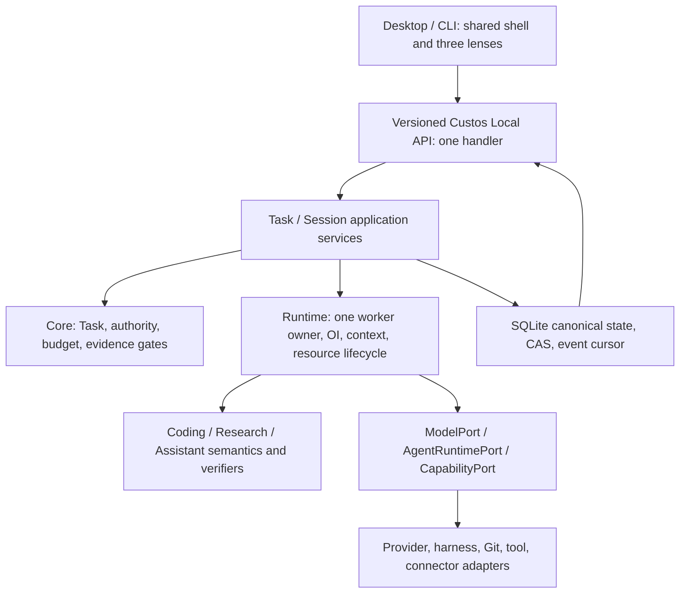
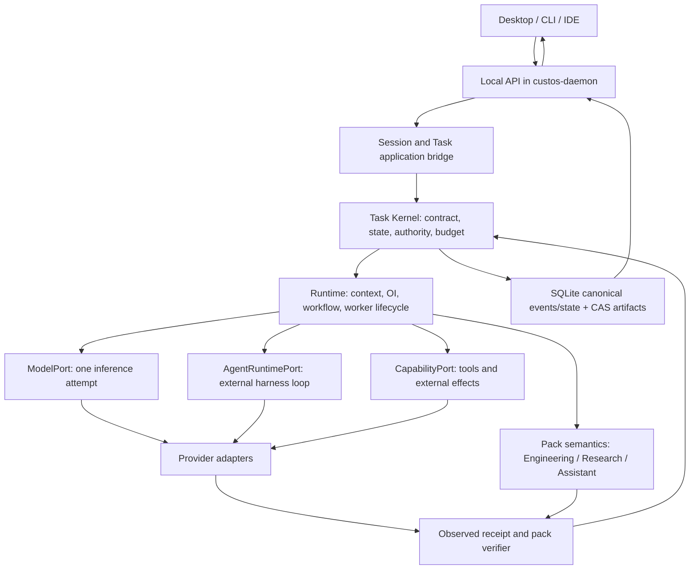
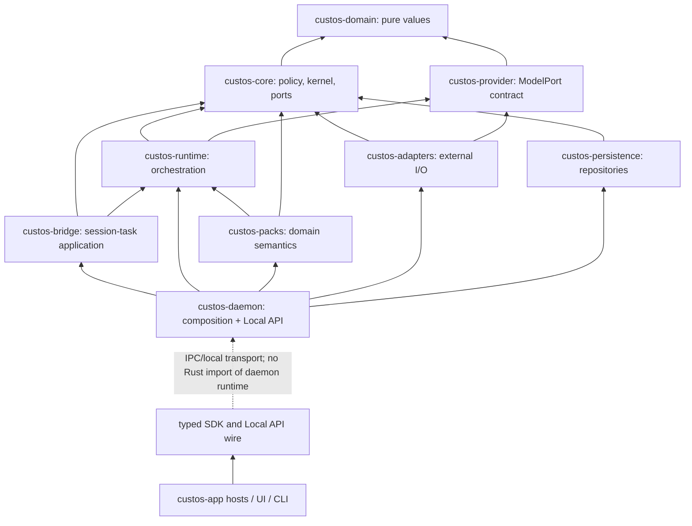

# Kế hoạch hội tụ backend và desktop Custos SADE

**Trạng thái:** thứ tự triển khai hiện hành để nhóm review và giao việc; [Custos.md](../../Custos.md) giữ hợp đồng sản phẩm. Kế hoạch này chuyển các nghiên cứu [OrCa](orca-source-study.md), [Open Science Desktop](open-science-source-study.md) và [workspace restructuring](workspace-restructuring-plan.md) thành các lát cắt kiểm được. Mobile nằm ngoài campaign hiện tại.

**Ảnh chụp hiện trạng:** checkout Custos `65132de` trên nhánh `vi`, đồng bộ từ `origin/dev` ngày 09-10-2026. Các mục trong §2 đã được kiểm lại với mã hiện hành; mô tả ở phần sau vốn viết từ checkout cũ là thiết kế đích hoặc ảnh chụp lịch sử khi chúng khác §2. Open Science source study ghi `04b64817c12e7fdbe0e052bfa1aeaf8802feecde`. OrCa checkout local đã mất `.git`; source study ghi SHA lúc audit là `3f6225deeb08a82448c5f0b0725073401629d462`, không thể tái xác minh từ bản local. [Nexus matching ledger](upstream-source-map.md#cross-source-nexus-audit-orca-and-open-science) phân biệt source hiện diện với đường đã được compose/kiểm chứng. Trước khi sao chép mã literal, lấy lại upstream revision và kiểm license/dependencies.

**Đường nhanh cần chứng minh:** `người dùng gửi một câu hỏi repo → daemon chọn executor thật → ContextPack chứa source đã kiểm scope → model/native harness trả output thật → session lưu answer và attempt/usage → Desktop đọc lại được sau restart`. Đây là mốc đầu tiên để gọi Custos dùng được như một SADE. Trong cùng campaign, đóng biên Local API và các đường thực thi vật lý đang mở để demo không đi trước quyền kiểm soát.

## 1. Kết luận cần chốt trước khi chia việc

Custos nên là **một SADE với một backend owner và một Task spine**, không là LLM gateway cộng ba giao diện. Desktop có **một shell, một conversation model và ba workbench lens**: Copilot/Assistant, Coding, Research. Người dùng đổi lens để đổi cách xem và thao tác với cùng công việc; không tự tạo session, Task, grant hoặc agent mới. Khi muốn phân việc thực sự, UI tạo bước/child Task/handoff tường minh, có selected artifacts và phạm vi dữ liệu. Một user chỉ dùng Coding vẫn có trải nghiệm hoàn chỉnh.

Sơ đồ là **luồng trách nhiệm**, không phải hướng Rust import. Pure values ở `custos-domain`; `custos-core` giữ policy/invariants, không là DTO crate cho gateway. `custos-daemon` là composition root và Local API host. `custos-provider` giữ ModelPort; native coding harness dùng `AgentRuntimePort`, không bị giả làm model API. MCP, ACP và A2A là các giao thức ở biên có use case riêng, không thành lớp bắt buộc trước mọi tác vụ. Đối chiếu [protocol map](../architecture/protocol-and-connectivity-hubs.md).

## 2. Những vấn đề hiện tại phải xử lý theo thứ tự rủi ro

| Ưu tiên | Bằng chứng tại `65132de` | Việc cần làm và gate |
|---|---|---|
| **P0 — biên thực thi** | [`http_server.rs`](../../crates/custos-daemon/src/http_server.rs) nay mặc định loopback, yêu cầu opt-in cho non-loopback, giới hạn body/deadline và lọc browser Origin; origin matcher được khóa exact authority ở change set này. Nhưng TCP/HTTP vẫn không có client authentication/actor binding, request không có `Origin` vẫn vào chung handler, và bind/profile có thể đổi bằng môi trường. [`ApiRequest`](../../crates/custos-daemon/src/local_api/lib.rs) chỉ có `id/method/params`; `StartRunRequest.actor` còn do caller gửi hoặc mặc định `daemon_user`. Notebook và native harness vẫn có đường gọi subprocess từ daemon/runtime mà chưa đi trọn Task authority/sandbox admission. | Định danh client/actor từ transport đã xác thực, không từ payload tự khai; phân profile embedded/local/remote; mọi physical execution qua admission scope/workspace/budget và receipt. Cho đến khi có cổng ấy, không quảng bá notebook/native harness là `custos-mediated`. Gate: request không có quyền không thể gọi code execution hay write; cross-origin, unauthenticated local caller, non-loopback, oversized và slow request bị từ chối theo profile. |
| **P0 — UI và capability truth** | [`OrcaTabbedContainer.tsx`](../../ui/desktop/src/components/views/OrcaTabbedContainer.tsx) có catalog mặc định `available`, giữ nguyên nếu không tải được capabilities, rồi render Browser/Fleet pane trước nhánh `UnavailableResource`. Browser pane còn tạo DOM snapshot giả ở client; Fleet pane vẫn cho Ping/Exec. Daemon đánh dấu hai capability này `degraded` và effect endpoint fail closed. | Cho pane đọc `status` cùng `supported_operations`; disable action không được daemon quảng bá, giải thích lý do; khi capability fetch lỗi thì `unknown/offline`, không fallback `available`; bỏ snapshot DOM tự dựng. Gate: mở pane metadata được nhưng không có CTA effect giả. |
| **P1 — đường chat có kết quả thật** | `StartRunCommand` nay mang `session_id`, `turn_id` và `prompt`; nhánh model trong [`task_runtime.rs`](../../crates/custos-runtime/src/workflow/task_runtime.rs) gọi provider bằng prompt thật, giữ output/token/model, settle Run/WorkerRun và có mock contract test. Daemon ghi assistant output vào session journal, Desktop đọc output thay vì dựng “Run accepted”. Khoảng trống còn lại: [`runtime.rs`](../../crates/custos-daemon/src/runtime.rs) vẫn compose `FakeProvider` mặc định, chưa có `ContextPack` source-backed/anchor, usage-attempt ledger production và restart/provider-harness e2e; nhánh native còn nhận context rỗng. | Chọn một direct provider hoặc native harness production và fail closed nếu chưa cấu hình; compile source-backed context; persist attempt/output/usage `known|estimated|unknown`, cancel/restart state và source anchors. Gate: cùng repo/snapshot, câu hỏi thật tới executor thật, answer có anchor, restart mở lại đúng answer và trạng thái. |
| **P1 — claim/recovery tối thiểu** | [`WorkflowDispatcher`](../../crates/custos-runtime/src/workflow/dispatcher.rs) giữ claim trong RAM dù có kiểm WorkerRun đã persist; release sau crash không có fencing transaction. [`WorkspaceLeaseManager`](../../crates/custos-runtime/src/workflow/lease.rs) cũng giữ lease trong RAM. | Trước khi bật delegated/parallel worker, persist claim và lease epoch trong transaction, reconcile launch/effect `unknown`, test cạnh tranh hai worker qua restart. Direct single worker chỉ cần một đường run idempotent có attempt bền; không chờ toàn bộ mailbox/OrCa parity để trả lời câu hỏi read-only. |
| **P2 — Coding workspace thật** | [`LocalWorkspaceProvider`](../../crates/custos-adapters/src/workspace.rs) đã gọi `git worktree add`; luồng workflow lease hiện tạo thư mục riêng và copy file khi merge. | Dùng một `ExecutionWorkspace` owner, base/dirty manifest, diff/patch/test receipts; ngừng gọi thư mục lease là Git worktree. Gate: patch trên base đúng, nguồn đổi thì stale, restart recover tài nguyên không replay effect. |
| **P2 — Research có kết quả truy vết** | Research ingress đã hạ source/claim/run client gửi về draft qua [`research_ingress.rs`](../../crates/custos-core/src/research_ingress.rs); [`ClaimsMatrixPane`](../../ui/desktop/src/components/research/ClaimsMatrixPane.tsx) nay gọi synthesis handoff và báo lỗi khi cổng từ chối. `synthesis.handoff.execute` hiện chỉ cần **một** claim được verified trong cả tập, bỏ qua ID không tìm thấy, và có thể tạo Task một phần trước lỗi. Notebook chạy subprocess mới cho từng cell. | Khép một lát cắt source→passage→claim→review→artifact→criterion; handoff kiểm **từng** ID và status trong một transaction, trả receipt; notebook hiện nhãn isolated script cho tới khi có kernel bền có admission. Gate: claim thiếu nguồn/ID hoặc fail review không vào Coding như verified; thất bại không để lại handoff nửa chừng. |
| **P3 — UI continuity và tối ưu** | Pane/lens giữ phần lớn state tại frontend; OI/S1 chưa có paired baseline trên đường live. | Sau đường chat/Coding/Research thật, ổn định resource IDs, layout restore, attention projection và selected-artifact handoff. Chỉ bật routing/multiworker mặc định khi cost per accepted outcome và chất lượng vượt baseline đã chốt. |

Đính kèm audit cũ đúng về dispatch RAM và notebook subprocess, nhưng mô tả Research ingress chưa cập nhật: server hiện đã reset claim client về `L0Ungrounded`, `confidence_score=0` và bỏ sealed proof. Nhánh `v1.research.handoff_coding` cũ cũng đã đọc claim từ repository; vấn đề còn lại là tính nguyên tử và độ đầy đủ của nhánh synthesis handoff đang dùng. Đây là source inspection, chưa phải kết quả e2e hay security audit toàn diện.

**Ranh giới cần phân biệt khi xử lý P0:** bind `127.0.0.1` mặc định chỉ hạn chế truy cập trực tiếp từ máy khác; nó không xác thực ứng dụng cục bộ và không ngăn một trang web gọi endpoint nếu CORS/origin cho phép. Tauri invoke, TCP JSONL, HTTP RPC và stdio cùng vào một handler nhưng có mức tin cậy khác nhau. Cần định nghĩa transport profile (`embedded`, `local trusted client`, `browser/remote opt-in`) và kiểm tra quyền ở điểm vào lẫn trước effect; việc thêm token vào HTTP không tự sửa những endpoint gọi subprocess trực tiếp. Không mở LAN chỉ bằng đổi biến môi trường nếu chưa có auth, TLS/transport policy và threat model.

## 3. Backend base để cả nhóm phát triển cùng một hướng

### 3.1 Một backend owner, nhiều transport

`custos-daemon` sở hữu profile/SQLite/CAS, Task services, adapter wiring, lifecycle và recovery; pack registry vẫn cần được compose cho domain acceptance thật. Tauri host trong [`crates/custos-app/desktop/src/lib.rs`](../../crates/custos-app/desktop/src/lib.rs) chuyển `custos_request` sang `LocalApiClient` thay vì tự bootstrap runtime. Desktop/CLI không mở DB, không khởi scheduler khác. Stdio JSONL, local TCP và HTTP hiện cùng gọi handler; HTTP RPC cần policy/auth trước khi dùng như ingress production. WS/SSE chỉ thêm khi stream use case và lifecycle đã rõ. Browser dev mode không được thay backend bằng success simulator.

Local API target gồm `schema_version, command_id, correlation_id, actor, task_id?, expected_revision?, deadline, privacy_class, payload`; response có typed error `invalid|conflict|unauthorized|unsupported|unavailable|uncertain` và `request_id`. Read-only query có thể đơn giản hơn; write command bắt buộc idempotency/optimistic concurrency. `WatchEvents(after_seq)` trả các **lifecycle/decision/effect** events; token/PTY output là stream riêng, bounded, có attempt ID. Reconnect: lấy snapshot/version → subscribe sau cursor → apply theo seq → phát hiện gap → resync, không tự resend write.

### 3.2 Canonical objects và quyền sở hữu

| Object | Owner | Điều không được suy ra |
|---|---|---|
| `ConversationSession`, turn, binding | bridge/application + persistence | Session hay đổi lens không tự grant. Một session có thể gắn nhiều Task; một Task qua nhiều session. |
| `TaskContract/Revision`, criterion | domain/core + persistence | `Run Active` không là Task completed. |
| `Run/WorkerRun/LaunchAttempt` | core/runtime + persistence | Process spawn, tab mở hoặc prompt dispatch không là agent đã hoàn tất. |
| `ExecutionWorkspace/Resource` | runtime coordinate, adapter execute, persistence record | Git worktree không là sandbox; Research dataset/notebook không phải worktree. |
| `ActionIntent/Permit/EffectAttempt` | core authority + adapter/ledger | Tool result text không phải receipt; timeout không phải chưa effect. |
| `Source/Artifact/VerifierRecord/Outcome` | packs/verifier + core gate + persistence | DOI/hash/exit 0 không chứng minh semantic claim/bug fixed. |
| `UsageRecord` | per attempt ledger | Unknown usage không là `$0`; OI không tự phá model pin để giảm giá. |

Các type và migrations mới chỉ được thêm khi flow cần. Không tạo hai source of truth: Open Science JSONL/goal plugin và OrCa SQLite schema là tham khảo, không nhập làm canonical DB song song. Derived index, pane layout và memory projection có thể rebuild.

### 3.3 Execution path production

`Create/Select Task → Admit contract/scope/budget → OI candidate within hard policy → compile source-backed ContextPack → choose ModelPort + Custos loop OR AgentRuntimePort → launch attempt → mediated capability intent / declared provider-governed effect → verifier per criterion → Outcome + continuation`. Chỉ một owner phân rã mỗi nhánh: Custos workflow bên ngoài hoặc native harness tự phân rã **bên trong một bounded WorkerRun**. S1 được phép hỗ trợ search/ranking/extraction/risk signal, không ký permit hay thay reasoning S2 mạnh bằng một bản tóm tắt không đủ nguồn. Direct pinned strong model/agent là baseline đầu tiên.

`custos-runtime` cần chọn một production worker loop, chứng minh đường từ `startRun` đến model/harness output/events/usage, và cô lập simulation trong test/demo. `custos-provider` giữ một inference attempt; `AgentRuntimePort` giữ start/steer/cancel/resume thật theo capability của từng harness. `custos-packs` khai báo obligations và verifiers; daemon compose, không để endpoint Research bypass pack/core policy. Persistence cung cấp atomic `claim`, reserve/settle, outbox/effect/reconcile, source/version invalidation; runtime không cầm SQLite connection.

### 3.4 Thư mục đích: sửa trách nhiệm, không nở crate

| Chỗ hiện hữu | Trách nhiệm phát triển tiếp |
|---|---|
| `crates/custos-domain` | Task/session/run/workspace/source/effect/evidence IDs và value invariants thuần. |
| `crates/custos-core` | FSM, admission, authority, budget/completion policies, ports; không tự đọc/ghi filesystem production. |
| `crates/custos-runtime` | one worker loop, workflow/OI, ContextPack, resource coordinator, event normalization. |
| `crates/custos-provider` | ModelPort, stream/usage/capability contracts; không đóng vai native agent runtime. |
| `crates/custos-adapters` | provider APIs, native harness, Git/PTY/kernel/PDF/MCP/connector implementation theo capability thực. |
| `crates/custos-packs` | Coding/Research/Assistant jobs, output schemas và verifiers; Research import/experiment, Assistant identity/send thuộc pack semantics. |
| `crates/custos-persistence` | canonical DB, CAS, migrations, event cursor, transactions, rebuildable indexes. |
| `crates/custos-bridge` / `custos-sdk` | session-to-task/turn binding; typed client contracts/transport. |
| `crates/custos-daemon` | composition, Local API handler/listeners, profile, recovery, supervision. |
| `crates/custos-app/desktop`, `ui/desktop` | thin host và React presentation; không có authority/runtime riêng. |

## 4. Frontend đích: một product, ba lens, không ba chatbot

**Navigation hierarchy:** profile/workspace → conversation + Task anchor → lens/preset → panes/resources → inspector. Workbench switcher đổi `lens`, không đổi `session_id` hay `task_id`. `Open in Coding/Research/Copilot` chỉ mở cùng Task trong lens khác; `Add pack step` tạo node có typed handoff; `Fork` tạo child Task tường minh. Không bê toàn bộ raw chat sang prompt mới: transcript vẫn đọc được; context mới chứa selected refs, citations, decisions, omissions và privacy. Cần cả trường hợp Taskless chat và một session có hai Task.

**Shell tối thiểu:** navigation rail + workspace/task sidebar + conversation pane có thể thu/phóng + resource canvas + contextual inspector + attention bar. Header hiện Task/Run thực, executor thực, nguồn/branch/dataset và spend known/estimated/unknown. Pending approval/uncertain effect phải hiện dù inspector đóng. Không bắt mọi mode ba cột cố định. Màn hình hẹp rút thành một pane, không ép 3× sidebar.

**State model:**

- Backend canonical: Task, Session/turn, Run/attempt, source/artifact, grant/effect, evidence/usage và event cursor.
- Frontend persisted presentation: pane layout, tab order, pinned resources, split ratio, focus và lens preference, keyed bởi stable workspace/task/resource IDs. Không dùng tên project hay mảng index làm identity.
- Ephemeral UI: hover, composer draft, search/filter, transient toast. Draft cần key theo session+Task+composer target để không chảy sang pane khác.
- Connection: `connecting|live|degraded|offline|resyncing`, không auto-show demo data khi backend mất kết nối.

**Resource tab contract:** `pane_id`, `resource_kind`, `resource_ref`, `workspace_id?`, `task_id?`, `run_id?`, `title`, `pinned`, `layout_group_id`. Registry render theo kind: chat, source reader, claim, experiment, file, diff, test, terminal, browser, draft/calendar, evidence. Tab close chỉ đóng view; stop worker hoặc xóa worktree là command riêng với confirmation. Restore validates resource existence/version và hiển thị stale/unavailable pane, **không** rerun code, resend email hoặc khởi agent.

**Frontend modules sau migration theo consumer, không mass rename:** `app/shell`, `features/conversation`, `features/tasks`, `features/workspace-layout`, `features/coding`, `features/research`, `features/assistant`, `features/connections`, `shared/api`, `shared/ui`. Tách [`OrcaTabbedContainer.tsx`](../../ui/desktop/src/components/views/OrcaTabbedContainer.tsx) theo pane registry; tách [`AppContext.tsx`](../../ui/desktop/src/context/AppContext.tsx) thành backend projection store và UI preferences. `ResearchView`, `CodexOrcaView`, `ClaudeChatView` trở thành lens compositions dùng cùng Conversation/Task/Resource components; không nhân ba nguồn transcript. Giữ compatibility exports/routes cho đến khi UI tests và deep links qua.

**Visual/interaction quality gate:** trước polish màu sắc, làm rõ information hierarchy, empty/loading/error/unknown/draft/sent, keyboard/focus, resize/restore, selection/scroll, accessible labels và không có status chỉ dựa màu. Một design token system, không tiếp tục rải màu/spacing literal theo từng pane. Vẽ và thử ba density presets (chat focus, code review, source+experiment) trên cửa sổ nhỏ/vừa/lớn; mỗi preset dùng cùng primitives. So usability bằng time-to-first-useful-action, số lần lạc Task, handoff success, approval comprehension và resume accuracy; screenshot đẹp không thay gate hành vi.

## 5. Mổ xẻ OrCa: chuyển capability nào, bằng cách nào

OrCa thực tế có worktree lifecycle, Run/Task/Dispatch, mailbox/reconciliation, structured/native agent launch và UI fleet; không chỉ là vỏ UI. Source study đã map các file chính; nguồn upstream công khai [worktree model](https://github.com/stablyai/orca/blob/main/docs/site/content/docs/model/worktrees.mdx) và [orchestration model](https://github.com/stablyai/orca/blob/main/docs/site/content/docs/cli/orchestration.mdx) xác nhận ý nghĩa sản phẩm. **Không bê nguyên Electron main, DB schema, status enum hoặc permission bypass.**

| OrCa source/pattern | Custos tiếp nhận | Phương pháp | Gate |
|---|---|---|---|
| [`agent-launch-executor.ts`](../../../orca/src/main/agent-launch/agent-launch-executor.ts) | Launch attempt + requested/actual mode + definitive refusal vs unknown | Reimplement sequencing ở runtime/harness adapters; không copy TS sang Rust cơ học. | Unknown attach không mở agent thứ hai; terminal fallback chỉ sau refusal trước commit. |
| [`orca-runtime-create-managed-worktree.ts`](../../../orca/src/main/runtime/orca-runtime-create-managed-worktree.ts) | ExecutionWorkspace với host, Git base, dirty manifest, owner, setup, retention | Git/folder adapter + persisted resource lifecycle. | Restart vẫn tìm đúng resource; cleanup không xóa user changes; folder workspace hợp lệ. |
| [`dispatch-row-writer.ts`](../../../orca/src/main/runtime/orchestration/db/dispatch-row-writer.ts) và mailbox | Atomic worker claim, epoch fencing, ack/replay | Narrow persistence operations dưới Custos Task/Run IDs. | Hai claimers chỉ một thắng; stale worker không settle/ack thay worker mới. |
| [`coordinator-task-dispatch.ts`](../../../orca/src/main/runtime/orchestration/coordinator-task-dispatch.ts) | Prompt delivery/worker liveness có trạng thái unknown | Attempt + receipt + reconcile, không retry mù. | Mất kết nối sau prompt gửi không tạo duplicate worker/prompt. |
| [`tabs-slice-contract.ts`](../../../orca/src/renderer/src/store/slices/tabs/tabs-slice-contract.ts) và UI worktree/diff | Stable tab/group identity, split/preview/pin, compare/attention | Lấy interaction model, viết pane registry mới theo Task/resource; port React component chỉ sau audit Electron deps. | Tab restore/deep link/focus đúng; đóng tab không đóng worker; Coding candidate compare cùng baseline. |
| [`agent-browser-bridge.ts`](../../../orca/src/main/browser/agent-browser-bridge.ts) và CDP bridge | Browser execution, DOM/AX tree extraction, live preview, web searching | Adapter CDP scoped + UI browser/search canvas; không lưu mock DOM tĩnh. | Chặn `file://` URIs; search & documentation reader phục vụ cả Coding và Research. |
| [`simctl-simulator-devices.ts`](../../../orca/src/main/emulator/simctl-simulator-devices.ts) & `android/` | Phone Simulator (iOS/Android/Responsive), touch gestures, mobile screen sizing, AX-tree | `MobileSimulatorWorkbenchPane` với device frame, orientation toggle, touch simulation, AX tree inspector. | Coding agent có cả màn hình Desktop lẫn Phone để kiểm tra responsive UI và đọc cây Accessibility. |

OrCa có nhiều launch paths ngay trong comment của `agent-launch-executor.ts`; Custos không nên copy giả định upstream đã hoàn toàn thống nhất. Worktree là đơn vị resource mạnh cho Coding, **không** là root identity của Assistant hay Research và không là OS sandbox. User pin Codex/Claude được giữ; một local coder model chỉ trở thành coding agent khi Custos worker loop cấp tool/context/lifecycle, không do tên provider.

## 6. Mổ xẻ Open Science Desktop: nghiên cứu cần lấy sâu hơn chat/PDF

Open Science Desktop ở local SHA nêu trên dùng Tauri/React, Rust core và OpenCode sidecar; mã có pane tree, notebook, run index, provenance inspector, review skill và connectors. [Upstream repo](https://github.com/ai4s-research/open-science) mô tả research loop và cũng tự cảnh báo output phải được kiểm lại. Custos nên lấy **interaction và inspectability**, không đổi Task Kernel sang OpenCode/goal JSON hoặc gắn “reproducible” chỉ vì có notebook.

| Open Science source/pattern | Custos Research workbench | Điều phải làm chặt hơn |
|---|---|---|
| [`SessionView.tsx`](../../../open-science/apps/desktop/src/components/session/SessionView.tsx), [`PaneTree.tsx`](../../../open-science/apps/desktop/src/components/session/PaneTree.tsx) | Chat, reader, notebook, artifact và run panes có stable identity; hidden panes giữ state nhưng ngừng side effects. | Pane ID khác Task/session/run ID; switching lens không làm stream/prompt chạy lại. |
| [`provenance.rs`](../../../open-science/crates/osd-core/src/provenance.rs), [`ProvenancePanel.tsx`](../../../open-science/apps/desktop/src/components/inspector/ProvenancePanel.tsx) | Artifact inspector mở từ figure/table/report tới source, code, input, env, run, message và gaps. | Ghi mức completeness; hash/mtime best-effort không là proof đầy đủ; user thấy thiếu lineage. |
| [`runs.rs`](../../../open-science/crates/osd-core/src/runs.rs), [`runs_index.rs`](../../../open-science/crates/osd-core/src/runs_index.rs) | ExperimentRun là record bền kể cả fail/partial; command/env/output/cost/exit và host. | Không tự suy mọi output từ mtime; failed run vẫn giữ partial outputs và uncertainty. |
| [`NotebookEditor.tsx`](../../../open-science/apps/desktop/src/components/notebook/NotebookEditor.tsx), [`kernel.rs`](../../../open-science/apps/desktop/src-tauri/src/kernel.rs) | Notebook pane + bounded local kernel như resource/capability tùy chọn. | Kernel hidden state làm replay conditional; execution cần path/network/compute grant; restore không execute cell. |
| [`traceability-review/SKILL.md`](../../../open-science/runtime/skills/core/traceability-review/SKILL.md), [`ReviewerCard.tsx`](../../../open-science/apps/desktop/src/components/thread/ReviewerCard.tsx) | Structured finding card: citation, number, figure, discrepancy và next action. | Traceability review không là semantic correctness oracle; criterion vẫn có pass/fail/unknown/stale theo verifier method. |
| [`science_mcp.rs`](../../../open-science/apps/desktop/src-tauri/src/science_mcp.rs) | Curated source/data/compute connector catalog theo Research jobs. | Install dependency/remote egress cần approval/version/license; không một-click auto-trust MCP metadata. |

Research cho software/AI/data nên có **bốn luồng đầu tiên**: `read/compare sources`, `claims + contradiction`, `dataset/experiment run`, `synthesis → Coding brief`. Library lưu version/parse coverage; Reader mở exact passage/table và nêu OCR gap; Claim matrix tách locator validity, extraction fidelity và semantic support; Experiment pane có dataset split/seed/baseline/env/compute/metrics/output/partial failures; Inspector nối artifact lineage. Multi-reader/OI fan-out chỉ khi corpus/task có lợi, không là default cho một paper. Assistant có draft/identity/calendar/outbox cùng Task spine, nhưng Research notebook không tự được quyền gửi mail.

## 7. Packets triển khai có thứ tự và đầu ra kiểm được

| Packet | Backend | Frontend | Acceptance gate |
|---|---|---|---|
| **F0 — Ingress và UI truth** | Khóa HTTP/TCP ingress theo profile; command/actor admission tối thiểu cho physical actions; capabilities chỉ quảng bá operation thật. | Browser/Fleet/Notebook disable effect chưa có quyền hoặc adapter; offline/unknown riêng với available; không tự dựng snapshot. | Browser tab metadata vẫn đọc được; web origin lạ và caller thiếu quyền không gọi RPC/execute; UI không phát request cho operation bị chặn. |
| **F1 — Một câu trả lời thật** | Một direct model hoặc harness thật với ContextPack có source, attempt/output/usage bền và một `Run` idempotent; FakeProvider chỉ trong test/demo. | Composer hiển thị output thật, failure/unknown, có thể mở lại sau restart. | Một repo question → answer có source anchors → restart vẫn đúng; cùng model baseline đo latency/cost. |
| **F2 — Coding được kiểm** | Hợp nhất workspace owner, base/dirty manifest, patch preview, mediated apply và verifier phù hợp criterion. | Repo/diff/test/approval trên cùng Task và Run. | Repo đổi sau đọc làm stale; test do agent sửa không tự pass; cancel hoặc crash không nói effect đã hoàn thành khi còn unknown. |
| **F3 — Research được kiểm** | Source/version/anchor validator, claim assessment, typed run/artifact/reviewer linkage, handoff transaction; isolated notebook được ghi đúng tên. | Library/reader/claim/run/artifact inspector và handoff preview. | Citation đúng URL nhưng sai support ở `unknown`; failed run còn thấy; handoff nhiều claim hoặc toàn thành công hoặc không tạo Task nào. |
| **F4 — Continuity ba lens** | Binding/journal/context receipt và event cursor; resource/attention projections build từ canonical IDs. | Một conversation, ba lens, pane layout restore, selected-artifact continuation. | Chat→Research→Coding→Copilot giữ đúng Task/refs, không chuyển grant, restore không rerun. |
| **F5 — Assistant effect** | Recipient resolution, draft, exact permit/outbox/reconcile với fake connector trước khi nối connector thật. | Draft/recipient/outbox/uncertain timeline. | Hai người cùng tên; sửa payload làm approval cũ hết hiệu lực; timeout sau send không retry mù. |
| **F6 — Delegated OrCa parity** | SQLite claim/epoch/mailbox, native launch `unknown`, workspace lease và recovery; chỉ bật parallel khi gate này qua. | Attention/worker comparison có receipt và state thật. | Hai worker tranh một node qua restart chỉ một owner; không double-launch sau timeout; worktree release không mất user data. |
| **F7 — Cost/OI optimization** | Usage ledger, bounded S1/OI topology theo policy version, held-out paired ablation. | Actual/estimated/unknown spend và route explanation. | So với direct strong baseline trên accepted outcomes; không vượt pin/scope/local-only, không tăng false pass. |

F0 và F1 là đường chặn hiện tại. F2–F5 đem ba miền thành sản phẩm dùng được; F6 là điều kiện cho delegated multiworker, không phải điều kiện để một câu hỏi read-only trả lời thật. Instrumentation attempt/usage phải có từ F1 để F7 đo được, dù OI chỉ bật sau benchmark.

### 7.0 Hợp đồng tối thiểu để F1 không còn là nút “Start Run” rỗng

`AppendUserTurn` cần ghi một turn có ID, actor, lens, Task binding nếu có, privacy và source refs trong journal; trả `turn_id` (không chỉ `status: appended`). `StartRun` tham chiếu **turn đã commit** cùng Task/revision và command ID; daemon xác minh binding và scope, chọn executor thật, lập `ContextPack` có source digest/omissions, rồi tạo `ModelAttempt` hoặc `AgentLaunchAttempt`. Output của executor trở thành assistant turn/artifact gắn attempt; cuối cùng Run nhận trạng thái terminal hoặc `unknown` có next action. Desktop subscribe/read lại từ backend; không tự chèn câu “Run accepted” làm answer. Đây là target contract, không phải mô tả API đã có.

Fixture tối thiểu: prompt có một token đặc trưng chỉ ở user turn và một nguồn repo có anchor → fake transport *test-only* xác nhận prompt/context nhận đúng token/source → provider trả output/usage → DB giữ assistant turn/attempt → mở Desktop lại thấy cùng nội dung và `known|estimated|unknown` hợp lệ. Thêm negative fixtures cho turn không thuộc Task, source stale, model chưa cấu hình, cancel giữa stream và provider trả usage muộn. Sau contract test mới chạy một provider/harness thật; không dùng fake provider làm bằng chứng đường production.

### 7.1 Gói giao việc đầu tiên cho coding agents

1. **F0-A Local API boundary:** `http_server.rs`, `main.rs`, `local_api/lib.rs`, physical effect handlers. Output: loopback-only bind, explicit enabled HTTP profile, caller/origin policy, request size/deadline, server-resolved actor và test từ chối request thiếu quyền; không phá Tauri transport đang dùng.
2. **F0-B Capability UI:** `OrcaTabbedContainer.tsx`, Browser/Fleet/Notebook panes và capability DTO. Output: operation gating từ daemon, offline/unknown state, không fabricate DOM/status/receipt. Giữ read-only metadata views hoạt động.
3. **F1-A Real conversation:** `StartRunCommand`/turn binding, `TaskRuntime`, provider/harness adapter, context, journal/event API, `AppContext`. Output: user turn thật tới executor đã chọn, answer/terminal state persist theo attempt, source anchors, cancel/reopen và usage truth. Test phải bác bỏ literal placeholder prompt, discarded provider output và FakeProvider trong production profile. Không chèn planner hay parallel node vào hot path.
4. **F2-A Coding workspace:** `WorkspaceCoordinator`, `LocalWorkspaceProvider`, workflow lease, patch/test gateway. Output: một workspace lifecycle, base-hash compare, diff/test evidence; làm trước candidate racing.
5. **F3-A Research vertical:** `research_ingress`, Research repository/pack, synthesis handoff và reader/run/inspector. Output: source/claim/review/criterion chain cho một paper; handoff transaction kiểm toàn bộ selected IDs. Quyết định rõ isolated script hay persistent notebook trước khi quảng bá kernel.
6. **F4-A Continuity:** bridge/persistence binding và event cursor, shared shell/pane registry. Output: một Task qua ba lens, view restore an toàn và context receipt cho selected handoff.

Mỗi packet ghi `current path → target owner`, người gọi, migration/schema, dirty-file overlap, rollback/forward, tests và cập nhật [codebase catalog](codebase-architecture.md). Có thể dùng nhiều coding agents cho packet độc lập nhưng **một integration owner** kiểm contract và compile/e2e của từng checkpoint; không merge ba mô hình state khác nhau chỉ vì các nhánh đều build xanh.

## 8. Những quyết định không làm trong đợt này

- Không triển khai sơ đồ “một gateway + router + MCP/A2A/ACP crates” nguyên trạng; chỉ thêm protocol adapter khi có user job, conformance và permission model rõ.
- Không bê OrCa Electron main, DB, agent bypass permissions hoặc worktree-as-security vào Custos Tauri/Rust core.
- Không thay Task Kernel bằng OpenCode sidecar hoặc Open Science per-session goal JSONL. OpenCode nếu cần là một harness adapter có capability matrix.
- Không thêm S1/OI classifier vào mọi turn, không fan-out mặc định, không lấy mock benchmark/DOI làm product evidence.
- Không refactor tên 11–12 crates vì thẩm mỹ; chỉ tách crate khi import graph, build isolation hoặc ownership test chứng minh cần.
- Không đổi toàn bộ UI bằng một PR “mass port”; chốt resource identity và event state trước, sau đó chuyển component theo vertical slice.

## 9. Checklist duyệt kiến trúc

1. Một Task có thể mở lại trên Copilot, Coding và Research mà vẫn giữ **cùng lịch sử có thể truy cập**, selected source/artifact refs và pending effect không?
2. Khi backend offline, source không tồn tại, model chưa cấu hình hoặc effect uncertain, UI có nói đúng sự thật không?
3. Mỗi action có owner thật: UI layout, daemon API, core policy, runtime decision, adapter execution, verifier outcome — không có hai component cùng sở hữu?
4. Native agent có profile về tool interception, worktree/host, usage, cancel/resume; mức assurance giảm trung thực khi không intercept được?
5. Research citation/experiment có mở được source/code/input/env/run và hiện rõ chỗ thiếu provenance, thay vì chỉ có “CAS Verified” badge?
6. F0–F1 có khóa ingress và tạo được một đường chat production thật trước khi thêm nhiều protocol, multiagent hoặc visual polish không?

**Cách dùng:** đây là thứ tự giao việc hiện hành. Mỗi packet chỉ được nâng mức `compiled/composed/exercised/verified` sau gate tương ứng trong [upstream source map](upstream-source-map.md#one-realization-ladder-for-code-documentation-and-ui). Khi thay một boundary, cập nhật master, topic spec và physical catalog trong cùng change set. Không ghi các packet trên thành tính năng đã hoàn tất chỉ vì có tên file hay API.

## 10. Bản đồ backend để nhóm code không nhầm lớp

### 10.1 Luồng chạy khi người dùng giao một việc

**Đọc sơ đồ đúng:** đây là đường **điều khiển**, không có nghĩa mọi lượt bắt buộc qua S1/OI LLM, không có nghĩa mọi native agent tool được Custos chặn trước, và không có nghĩa SQLite commit được email/shell atomically. Read-only chat có thể đi một worker direct. Với native harness, receipt phải khai báo `custos-mediated|provider-governed|observe-only|unknown` theo action. Research/source verification và Assistant send có gate khác nhau dù dùng cùng Task.

### 10.2 Hướng phụ thuộc source code — khác luồng chạy

Đây là **hướng đích cần kiểm bằng `cargo metadata` và import tests**, không là khẳng định mọi edge trong checkout đã sạch. Đặc biệt hiện [`custos-daemon/src/local_api`](../../crates/custos-daemon/src/local_api/lib.rs) còn chứa client/wire DTO và [`custos-sdk`](../../crates/custos-sdk/src/lib.rs) chưa là Local API client đầy đủ; [`custos-packs`](../../crates/custos-packs/src/lib.rs) đang đăng ký một số concrete I/O skills; `custos-runtime` có overlap về loop/context/gateway. Refactor phải làm hẹp các seam này, không thay toàn bộ tên crate.

### 10.3 Năm ranh giới không được đánh tráo

| Ranh giới | Ai sở hữu | Ví dụ quyết định đúng | Sai lầm từ sơ đồ “gateway/router/core” đơn giản hóa |
|---|---|---|---|
| **Ingress** | daemon Local API, typed SDK | Xác thực client/actor, parse command, version, idempotency, stream cursor. | Cho OpenAI-compatible endpoint thành API chuẩn cho toàn bộ Custos Task. |
| **Decision** | runtime OI/S1 + pack plan dưới hard policy | Chọn direct/model/native worker, topology, source context trong budget/pin. | Router của provider tự quyết quyền, Task success hoặc tự thay model pin. |
| **Authority** | core + effect ledger | Scope, exact target/payload/preconditions/permit, uncertain effect. | MCP/ACP/A2A metadata hoặc model output được coi là grant. |
| **Execution** | runtime worker + adapters | Model turn, harness session, Git/PTY/kernel/tool/connector attempt với actual mode. | Worktree hoặc spawn success bị coi là Task completion. |
| **Verification** | pack verifier + core completion gate | Check criterion với source revision, method, receipt và uncertainty. | Exit 0, DOI/hash hay agent `done` tự biến thành verified outcome. |

### 10.4 Backend jobs theo ba miền, cùng một nền

| Shared backend spine | Coding | Research | Assistant |
|---|---|---|---|
| Task/Session/Run, ContextPack, budget, authority, evidence, events, persistence | Repo snapshot/index, Git/folder execution workspace, patch/diff/test/review; worktree tùy nhu cầu | Source/corpus/version, PDF/span/claim/experiment/notebook/run lineage; compute riêng có grant | Contact/account/identity/time, draft, exact send/calendar effect, outbox/reconcile, automation grant |
| Một worker direct vẫn hợp lệ | Trusted behavior tests và base-hash check | Locator/extraction/semantic-support checks tách riêng | Recipient/payload/connector receipt chính xác |
| Same outcome/continuation API | Có thể nhận selected Research brief | Có thể xuất selected claim/experiment refs | Chỉ nhận redacted/approved summary; không kế thừa send grant |

**Protocol placement:** Local API/IPC là đường client vào daemon. Model APIs nằm ở provider adapters. MCP là một cách gọi tool/data ngoài qua adapter; ACP là một cách tích hợp editor/coding harness; A2A là delegation tới peer agent từ xa khi thật sự cần. Chúng không cùng một `Tool & Agent Layer` và không phải bốn cổng bắt buộc nối tiếp nhau. Chi tiết và trạng thái hỗ trợ nằm ở [protocol map](../architecture/protocol-and-connectivity-hubs.md).

### 10.5 Nên refactor bao nhiêu?

**Không “refactor lại hết”.** Giữ domain/core/runtime/packs/adapters/persistence/daemon và các contracts nào đang có test tốt. Refactor **năm seam gây lệch sản phẩm** theo thứ tự: (1) demo/live và false-success UI; (2) Local API + event/idempotency/auth; (3) một execution path thật và ModelPort/AgentRuntimePort tách bạch; (4) authority/verifier cho Research/Assistant/effects; (5) shared pane/session/Task projection. Sau mỗi seam có một user journey chạy được và regression gate. Chỉ tách crate mới khi edge phụ thuộc hoặc ownership test không thể giữ sạch trong crate hiện hữu.
