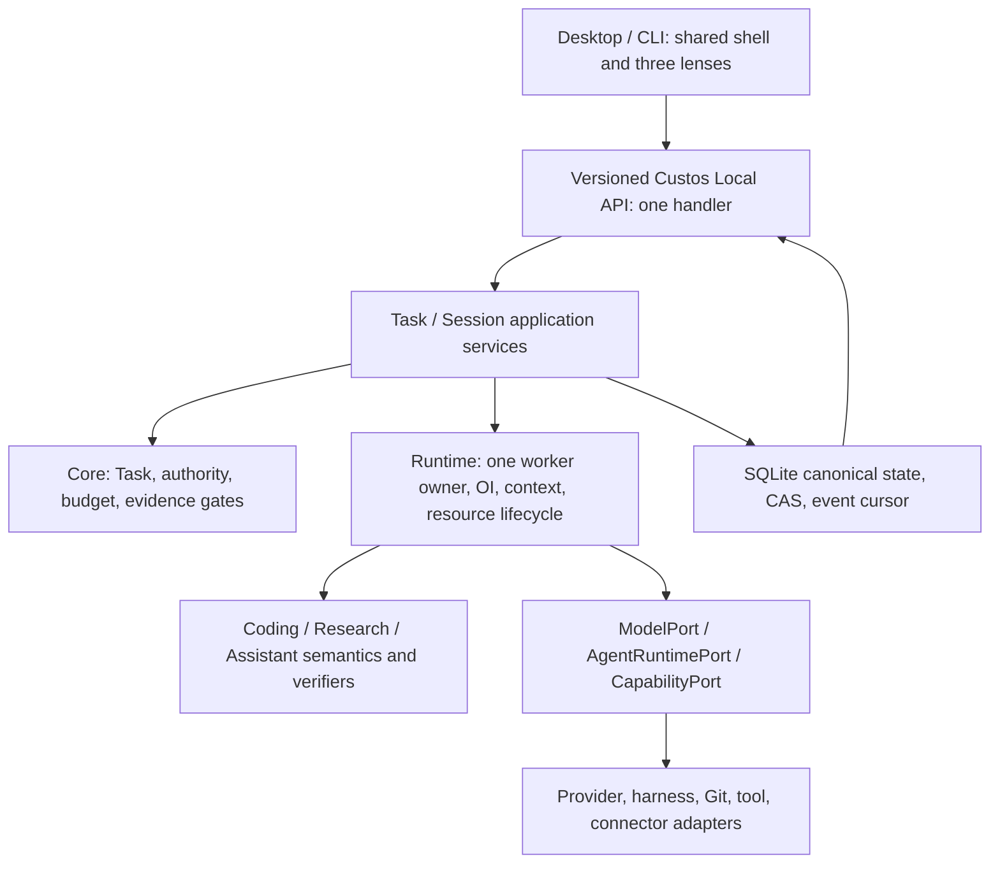
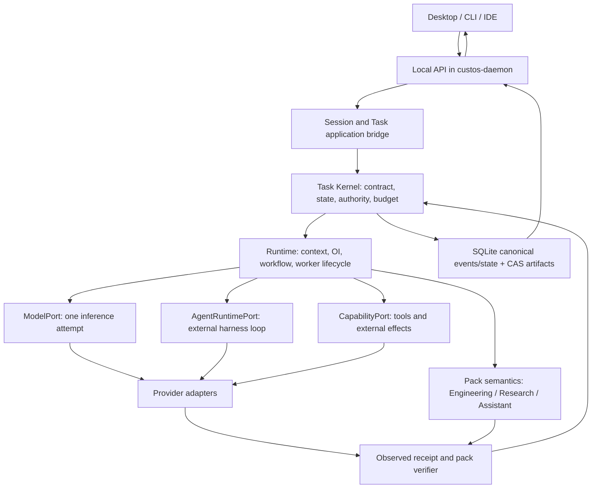
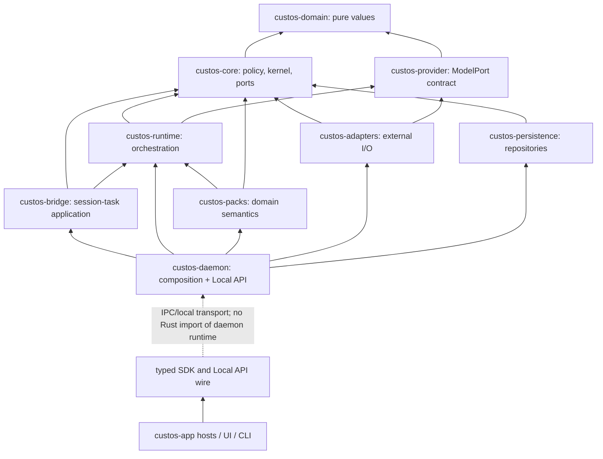

# Kế hoạch hội tụ backend và desktop Custos SADE

**Trạng thái:** đề xuất để review, không phải chứng nhận tính năng đã hoàn thành hoặc quyết định thay thế [Custos.md](../../Custos.md). Kế hoạch này chuyển các nghiên cứu [OrCa](orca-source-study.md), [Open Science Desktop](open-science-source-study.md) và [workspace restructuring](workspace-restructuring-plan.md) thành một thứ tự triển khai kiểm được. Không thêm mobile trong đợt này. Không sao chép cả OrCa/Open Science thành một runtime thứ hai.

**Ảnh chụp hiện trạng:** checkout Custos tại `529140b006ba813653ff180477d61bc934aaa701` ngày 07-10-2026, có nhiều thay đổi chưa commit trong daemon, Research persistence và desktop. Open Science checkout tại `04b64817c12e7fdbe0e052bfa1aeaf8802feecde`. OrCa checkout local đã mất `.git`; source study ghi SHA tại thời điểm audit là `3f6225deeb08a82448c5f0b0725073401629d462`, nhưng không thể tái xác minh SHA từ checkout hiện tại. Trước khi sao chép mã literal, lấy lại source upstream đúng revision và kiểm license/dependencies. Đây là khảo sát các đường kiến trúc và luồng sản phẩm trọng yếu, **không** là tuyên bố đã đọc từng tệp trong hơn 25.000 tệp source OrCa hay đã chạy toàn bộ e2e của ba dự án.

## 1. Kết luận cần chốt trước khi chia việc

Custos nên là **một SADE với một backend owner và một Task spine**, không là LLM gateway cộng ba giao diện. Desktop có **một shell, một conversation model và ba workbench lens**: Copilot/Assistant, Coding, Research. Người dùng đổi lens để đổi cách xem và thao tác với cùng công việc; không tự tạo session, Task, grant hoặc agent mới. Khi muốn phân việc thực sự, UI tạo bước/child Task/handoff tường minh, có selected artifacts và phạm vi dữ liệu. Một user chỉ dùng Coding vẫn có trải nghiệm hoàn chỉnh.

Sơ đồ là **luồng trách nhiệm**, không phải hướng Rust import. Pure values ở `custos-domain`; `custos-core` giữ policy/invariants, không là DTO crate cho gateway. `custos-daemon` là composition root và Local API host. `custos-provider` giữ ModelPort; native coding harness dùng `AgentRuntimePort`, không bị giả làm model API. MCP, ACP và A2A là các giao thức ở biên có use case riêng, không thành lớp bắt buộc trước mọi tác vụ. Đối chiếu [protocol map](../architecture/protocol-and-connectivity-hubs.md).

## 2. Những vấn đề hiện tại phải xử lý theo thứ tự rủi ro

| Mức | Bằng chứng trong checkout | Hệ quả sản phẩm | Gate đề xuất |
|---|---|---|---|
| P0 — tính trung thực | [`daemon_client.ts`](../../ui/desktop/src/api/daemon_client.ts) tự bật web fallback khi không có Tauri, dựng Task/Run/Research source/claim giả. [`LiteraturePane.tsx`](../../ui/desktop/src/components/research/LiteraturePane.tsx), [`ClaimsMatrixPane.tsx`](../../ui/desktop/src/components/research/ClaimsMatrixPane.tsx), [`RunsLedgerPane.tsx`](../../ui/desktop/src/components/research/RunsLedgerPane.tsx) còn dùng mock khi API trả rỗng/lỗi; [`DeepInspectorPane.tsx`](../../ui/desktop/src/components/research/DeepInspectorPane.tsx) luôn hiện artifact mẫu và `reviewPassed: true`. | Trạng thái trống/lỗi có thể trông như dữ liệu thật, gồm DOI, số liệu và nhãn verified. Đây là lỗi UX **và** epistemic safety, không chỉ placeholder. | Tách `DemoDataSource` do người dùng chủ động bật; mọi record có `origin=demo`; live trống/lỗi hiển thị empty/error thật; bỏ badge “verified/sealed” nếu không có verifier receipt. |
| P0 — handoff sai | [`ClaimsMatrixPane.tsx`](../../ui/desktop/src/components/research/ClaimsMatrixPane.tsx) bắt lỗi từng claim rồi vẫn gọi callback và toast “Handed off ... verified”; [`api.rs`](../../crates/custos-daemon/src/api.rs) tạo Task từ `claim_id`/`statement` do client gửi, không đọc lại claim/source/permission trước khi tạo. | Người dùng tưởng đã chuyển kết quả Research sang Coding dù có thể thất bại hoặc không giữ provenance. | Handoff command nhận IDs + expected revisions; backend đọc source/claim, kiểm scope/status, ghi typed handoff và trả receipt; UI chỉ báo thành công từ receipt. Không gọi mọi claim đã chọn là verified. |
| P0 — write path Research | [`api.rs`](../../crates/custos-daemon/src/api.rs) nhận `SourceRecord`, `PassageAnchor`, `ResearchClaim`, `ResearchExperimentRun` từ client rồi gọi save; [`claim.rs`](../../crates/custos-domain/src/claim.rs) để client truyền `verified`, `level`, `confidence_score`, `sealed_proof_uri`; [`research.rs`](../../crates/custos-persistence/src/repositories/research.rs) lưu các field này. | Client có thể tự gắn trạng thái bằng chứng cao mà chưa qua kiểm chứng. | Tách proposed claim/observation khỏi `CriterionVerificationRecord`; verifier backend tính locator/hash và ghi method/status; semantic support giữ unknown/reviewer. API save không nhận trusted status từ client. |
| P0 — ingress/identity | [`main.rs`](../../crates/custos-daemon/src/main.rs) bind TCP loopback mặc định nhưng cho `CUSTOS_BIND` override; [`ApiRequest`](../../crates/custos-daemon/src/local_api/lib.rs) chỉ có `id, method, params`, chưa có actor/expected revision/deadline/auth. | Loopback không là ranh giới quyền giữa các local process; non-loopback do cấu hình sẽ là rủi ro lớn hơn. Retry write chưa có idempotency envelope nhất quán. | Khóa non-loopback trước khi có auth/CSRF/origin model; chuẩn hóa command envelope và per-method actor/scope checks; thử duplicate, stale revision, malformed payload. |
| P1 — execution truth | [`runtime.rs`](../../crates/custos-daemon/src/runtime.rs) mặc định `FakeProvider`; [`task_runtime.rs`](../../crates/custos-runtime/src/workflow/task_runtime.rs) có native path với `ContextPack` rỗng; [`worker_executor.rs`](../../crates/custos-runtime/src/workflow/worker_executor.rs) còn action `execute_worker` tương thích simulation. | `Run Active` hoặc worker output không bảo đảm một model/harness thật đã giải công việc. | Profile demo/test tách hẳn live; không nhận live run nếu selected executor/capability/context chưa hợp lệ; persist actual response, usage, errors và outcome. |
| P1 — chat không trả lời | [`AppContext.tsx`](../../ui/desktop/src/context/AppContext.tsx) append user message, gọi `startRun`, rồi thêm câu “Run accepted... result is not available in this view yet.” Không có event/cursor để nhận assistant output; state khởi từ `mockData`. | UI có vẻ chat nhưng không phải conversation với agent. Chuyển lens giữ mảng message trong React, chưa chứng minh resume sau restart. | Backend stream/replay events; UI projection từ persisted session journal + run events; send có pending/error/retry theo command ID. |
| P1 — desktop state và tab | [`studio/page.tsx`](../../ui/desktop/src/app/studio/page.tsx) lưu lens qua localStorage và tab map trong component keyed bằng project + active session, route `studio/:sessionId`. [`OrcaTabbedContainer.tsx`](../../ui/desktop/src/components/views/OrcaTabbedContainer.tsx) trộn browser, fake repo files, terminal, Research panes trong một file lớn. | Tab/resource không có ID bền; đổi Task/lens/restart dễ mất hoặc gắn sai view, khó test và mở rộng ba miền. | Một pane/resource registry + layout projection riêng; canonical Task/session/run refs từ backend; layout-only state ở frontend. Restore chỉ mở view, tuyệt đối không launch agent/execute cell. |
| P1 — build gate | Chạy `ui/desktop/node_modules/.bin/tsc --noEmit` trên checkout này báo TS6133 `colorTheme` không dùng tại `ClaimsMatrixPane.tsx:363`. `cargo check -p custos-daemon --offline` thành công. `pnpm run build` bị wrapper cố kiểm lockfile trên npm registry trong sandbox không có DNS và đã dừng; không có kết luận build Vite. | UI chưa qua typecheck; Rust daemon compile không chứng minh các luồng e2e. | Sửa TS error trong packet đầu; chạy trực tiếp local toolchain/CI offline phù hợp rồi smoke test. Không gọi package/network failure là lỗi source. |

Các dòng trên mô tả **worktree hiện tại**, gồm code chưa commit; không suy rộng thành security audit toàn diện. Cần giữ nguyên user changes và ghi diff/owner khi bắt đầu từng packet.

## 3. Backend base để cả nhóm phát triển cùng một hướng

### 3.1 Một backend owner, nhiều transport

`custos-daemon` sở hữu profile/SQLite/CAS, Task services, pack registry, adapter wiring, lifecycle và recovery. Tauri host trong [`crates/custos-app/desktop/src/lib.rs`](../../crates/custos-app/desktop/src/lib.rs) đã mỏng hơn trước: chuyển `custos_request` sang `LocalApiClient` thay vì tự bootstrap runtime. Giữ hướng này. Desktop/CLI không mở DB, không khởi scheduler khác. Stdio JSONL và local TCP hiện có phải gọi **cùng handler**; HTTP/WS/SSE chỉ thêm khi có client cần, không cần `custos-gateway` crate mới. Browser dev mode không thể lén thay backend bằng success simulator.

Local API target gồm `schema_version, command_id, correlation_id, actor, task_id?, expected_revision?, deadline, privacy_class, payload`; response có typed error `invalid|conflict|unauthorized|unsupported|unavailable|uncertain` và `request_id`. Read-only query có thể đơn giản hơn; write command bắt buộc idempotency/optimistic concurrency. `WatchEvents(after_seq)` trả các **lifecycle/decision/effect** events; token/PTY output là stream riêng, bounded, có attempt ID. Reconnect: lấy snapshot/version → subscribe sau cursor → apply theo seq → phát hiện gap → resync, không tự resend write.

### 3.2 Canonical objects và quyền sở hữu

| Object | Owner | Điều không được suy ra |
|---|---|---|
| `ConversationSession`, turn, binding | bridge/application + persistence | Session hay đổi lens không tự grant. Một session có thể gắn nhiều Task; một Task qua nhiều session. |
| `TaskContract/Revision`, criterion | domain/core + persistence | `Run Active` không là Task completed. |
| `Run/WorkerRun/LaunchAttempt` | core/runtime + persistence | Process spawn, tab mở hoặc prompt dispatch không là agent đã hoàn tất. |
| `ExecutionWorkspace/Resource` | runtime coordinate, adapter execute, persistence record | Git worktree không là sandbox; Research dataset/notebook không phải worktree. |
| `ActionIntent/Permit/EffectAttempt` | core authority + adapter/ledger | Tool result text không phải receipt; timeout không phải chưa effect. |
| `Source/Artifact/VerifierRecord/Outcome` | packs/verifier + core gate + persistence | DOI/hash/exit 0 không chứng minh semantic claim/bug fixed. |
| `UsageRecord` | per attempt ledger | Unknown usage không là `$0`; OI không tự phá model pin để giảm giá. |

Các type và migrations mới chỉ được thêm khi flow cần. Không tạo hai source of truth: Open Science JSONL/goal plugin và OrCa SQLite schema là tham khảo, không nhập làm canonical DB song song. Derived index, pane layout và memory projection có thể rebuild.

### 3.3 Execution path production

`Create/Select Task → Admit contract/scope/budget → OI candidate within hard policy → compile source-backed ContextPack → choose ModelPort + Custos loop OR AgentRuntimePort → launch attempt → mediated capability intent / declared provider-governed effect → verifier per criterion → Outcome + continuation`. Chỉ một owner phân rã mỗi nhánh: Custos workflow bên ngoài hoặc native harness tự phân rã **bên trong một bounded WorkerRun**. S1 được phép hỗ trợ search/ranking/extraction/risk signal, không ký permit hay thay reasoning S2 mạnh bằng một bản tóm tắt không đủ nguồn. Direct pinned strong model/agent là baseline đầu tiên.

`custos-runtime` cần chọn một production worker loop, chứng minh đường từ `startRun` đến model/harness output/events/usage, và cô lập simulation trong test/demo. `custos-provider` giữ một inference attempt; `AgentRuntimePort` giữ start/steer/cancel/resume thật theo capability của từng harness. `custos-packs` khai báo obligations và verifiers; daemon compose, không để endpoint Research bypass pack/core policy. Persistence cung cấp atomic `claim`, reserve/settle, outbox/effect/reconcile, source/version invalidation; runtime không cầm SQLite connection.

### 3.4 Thư mục đích: sửa trách nhiệm, không nở crate

| Chỗ hiện hữu | Trách nhiệm phát triển tiếp |
|---|---|
| `crates/custos-domain` | Task/session/run/workspace/source/effect/evidence IDs và value invariants thuần. |
| `crates/custos-core` | FSM, admission, authority, budget/completion policies, ports; không tự đọc/ghi filesystem production. |
| `crates/custos-runtime` | one worker loop, workflow/OI, ContextPack, resource coordinator, event normalization. |
| `crates/custos-provider` | ModelPort, stream/usage/capability contracts; không đóng vai native agent runtime. |
| `crates/custos-adapters` | provider APIs, native harness, Git/PTY/kernel/PDF/MCP/connector implementation theo capability thực. |
| `crates/custos-packs` | Coding/Research/Assistant jobs, output schemas và verifiers; Research import/experiment, Assistant identity/send thuộc pack semantics. |
| `crates/custos-persistence` | canonical DB, CAS, migrations, event cursor, transactions, rebuildable indexes. |
| `crates/custos-bridge` / `custos-sdk` | session-to-task/turn binding; typed client contracts/transport. |
| `crates/custos-daemon` | composition, Local API handler/listeners, profile, recovery, supervision. |
| `crates/custos-app/desktop`, `ui/desktop` | thin host và React presentation; không có authority/runtime riêng. |

## 4. Frontend đích: một product, ba lens, không ba chatbot

**Navigation hierarchy:** profile/workspace → conversation + Task anchor → lens/preset → panes/resources → inspector. Workbench switcher đổi `lens`, không đổi `session_id` hay `task_id`. `Open in Coding/Research/Copilot` chỉ mở cùng Task trong lens khác; `Add pack step` tạo node có typed handoff; `Fork` tạo child Task tường minh. Không bê toàn bộ raw chat sang prompt mới: transcript vẫn đọc được; context mới chứa selected refs, citations, decisions, omissions và privacy. Cần cả trường hợp Taskless chat và một session có hai Task.

**Shell tối thiểu:** navigation rail + workspace/task sidebar + conversation pane có thể thu/phóng + resource canvas + contextual inspector + attention bar. Header hiện Task/Run thực, executor thực, nguồn/branch/dataset và spend known/estimated/unknown. Pending approval/uncertain effect phải hiện dù inspector đóng. Không bắt mọi mode ba cột cố định. Màn hình hẹp rút thành một pane, không ép 3× sidebar.

**State model:**

- Backend canonical: Task, Session/turn, Run/attempt, source/artifact, grant/effect, evidence/usage và event cursor.
- Frontend persisted presentation: pane layout, tab order, pinned resources, split ratio, focus và lens preference, keyed bởi stable workspace/task/resource IDs. Không dùng tên project hay mảng index làm identity.
- Ephemeral UI: hover, composer draft, search/filter, transient toast. Draft cần key theo session+Task+composer target để không chảy sang pane khác.
- Connection: `connecting|live|degraded|offline|resyncing`, không auto-show demo data khi backend mất kết nối.

**Resource tab contract:** `pane_id`, `resource_kind`, `resource_ref`, `workspace_id?`, `task_id?`, `run_id?`, `title`, `pinned`, `layout_group_id`. Registry render theo kind: chat, source reader, claim, experiment, file, diff, test, terminal, browser, draft/calendar, evidence. Tab close chỉ đóng view; stop worker hoặc xóa worktree là command riêng với confirmation. Restore validates resource existence/version và hiển thị stale/unavailable pane, **không** rerun code, resend email hoặc khởi agent.

**Frontend modules sau migration theo consumer, không mass rename:** `app/shell`, `features/conversation`, `features/tasks`, `features/workspace-layout`, `features/coding`, `features/research`, `features/assistant`, `features/connections`, `shared/api`, `shared/ui`. Tách [`OrcaTabbedContainer.tsx`](../../ui/desktop/src/components/views/OrcaTabbedContainer.tsx) theo pane registry; tách [`AppContext.tsx`](../../ui/desktop/src/context/AppContext.tsx) thành backend projection store và UI preferences. `ResearchView`, `CodexOrcaView`, `ClaudeChatView` trở thành lens compositions dùng cùng Conversation/Task/Resource components; không nhân ba nguồn transcript. Giữ compatibility exports/routes cho đến khi UI tests và deep links qua.

**Visual/interaction quality gate:** trước polish màu sắc, làm rõ information hierarchy, empty/loading/error/unknown/draft/sent, keyboard/focus, resize/restore, selection/scroll, accessible labels và không có status chỉ dựa màu. Một design token system, không tiếp tục rải màu/spacing literal theo từng pane. Vẽ và thử ba density presets (chat focus, code review, source+experiment) trên cửa sổ nhỏ/vừa/lớn; mỗi preset dùng cùng primitives. So usability bằng time-to-first-useful-action, số lần lạc Task, handoff success, approval comprehension và resume accuracy; screenshot đẹp không thay gate hành vi.

## 5. Mổ xẻ OrCa: chuyển capability nào, bằng cách nào

OrCa thực tế có worktree lifecycle, Run/Task/Dispatch, mailbox/reconciliation, structured/native agent launch và UI fleet; không chỉ là vỏ UI. Source study đã map các file chính; nguồn upstream công khai [worktree model](https://github.com/stablyai/orca/blob/main/docs/site/content/docs/model/worktrees.mdx) và [orchestration model](https://github.com/stablyai/orca/blob/main/docs/site/content/docs/cli/orchestration.mdx) xác nhận ý nghĩa sản phẩm. **Không bê nguyên Electron main, DB schema, status enum hoặc permission bypass.**

| OrCa source/pattern | Custos tiếp nhận | Phương pháp | Gate |
|---|---|---|---|
| [`agent-launch-executor.ts`](../../../orca/src/main/agent-launch/agent-launch-executor.ts) | Launch attempt + requested/actual mode + definitive refusal vs unknown | Reimplement sequencing ở runtime/harness adapters; không copy TS sang Rust cơ học. | Unknown attach không mở agent thứ hai; terminal fallback chỉ sau refusal trước commit. |
| [`orca-runtime-create-managed-worktree.ts`](../../../orca/src/main/runtime/orca-runtime-create-managed-worktree.ts) | ExecutionWorkspace với host, Git base, dirty manifest, owner, setup, retention | Git/folder adapter + persisted resource lifecycle. | Restart vẫn tìm đúng resource; cleanup không xóa user changes; folder workspace hợp lệ. |
| [`dispatch-row-writer.ts`](../../../orca/src/main/runtime/orchestration/db/dispatch-row-writer.ts) và mailbox | Atomic worker claim, epoch fencing, ack/replay | Narrow persistence operations dưới Custos Task/Run IDs. | Hai claimers chỉ một thắng; stale worker không settle/ack thay worker mới. |
| [`coordinator-task-dispatch.ts`](../../../orca/src/main/runtime/orchestration/coordinator-task-dispatch.ts) | Prompt delivery/worker liveness có trạng thái unknown | Attempt + receipt + reconcile, không retry mù. | Mất kết nối sau prompt gửi không tạo duplicate worker/prompt. |
| [`tabs-slice-contract.ts`](../../../orca/src/renderer/src/store/slices/tabs/tabs-slice-contract.ts) và UI worktree/diff | Stable tab/group identity, split/preview/pin, compare/attention | Lấy interaction model, viết pane registry mới theo Task/resource; port React component chỉ sau audit Electron deps. | Tab restore/deep link/focus đúng; đóng tab không đóng worker; Coding candidate compare cùng baseline. |

OrCa có nhiều launch paths ngay trong comment của `agent-launch-executor.ts`; Custos không nên copy giả định upstream đã hoàn toàn thống nhất. Worktree là đơn vị resource mạnh cho Coding, **không** là root identity của Assistant hay Research và không là OS sandbox. User pin Codex/Claude được giữ; một local coder model chỉ trở thành coding agent khi Custos worker loop cấp tool/context/lifecycle, không do tên provider.

## 6. Mổ xẻ Open Science Desktop: nghiên cứu cần lấy sâu hơn chat/PDF

Open Science Desktop ở local SHA nêu trên dùng Tauri/React, Rust core và OpenCode sidecar; mã có pane tree, notebook, run index, provenance inspector, review skill và connectors. [Upstream repo](https://github.com/ai4s-research/open-science) mô tả research loop và cũng tự cảnh báo output phải được kiểm lại. Custos nên lấy **interaction và inspectability**, không đổi Task Kernel sang OpenCode/goal JSON hoặc gắn “reproducible” chỉ vì có notebook.

| Open Science source/pattern | Custos Research workbench | Điều phải làm chặt hơn |
|---|---|---|
| [`SessionView.tsx`](../../../open-science/apps/desktop/src/components/session/SessionView.tsx), [`PaneTree.tsx`](../../../open-science/apps/desktop/src/components/session/PaneTree.tsx) | Chat, reader, notebook, artifact và run panes có stable identity; hidden panes giữ state nhưng ngừng side effects. | Pane ID khác Task/session/run ID; switching lens không làm stream/prompt chạy lại. |
| [`provenance.rs`](../../../open-science/crates/osd-core/src/provenance.rs), [`ProvenancePanel.tsx`](../../../open-science/apps/desktop/src/components/inspector/ProvenancePanel.tsx) | Artifact inspector mở từ figure/table/report tới source, code, input, env, run, message và gaps. | Ghi mức completeness; hash/mtime best-effort không là proof đầy đủ; user thấy thiếu lineage. |
| [`runs.rs`](../../../open-science/crates/osd-core/src/runs.rs), [`runs_index.rs`](../../../open-science/crates/osd-core/src/runs_index.rs) | ExperimentRun là record bền kể cả fail/partial; command/env/output/cost/exit và host. | Không tự suy mọi output từ mtime; failed run vẫn giữ partial outputs và uncertainty. |
| [`NotebookEditor.tsx`](../../../open-science/apps/desktop/src/components/notebook/NotebookEditor.tsx), [`kernel.rs`](../../../open-science/apps/desktop/src-tauri/src/kernel.rs) | Notebook pane + bounded local kernel như resource/capability tùy chọn. | Kernel hidden state làm replay conditional; execution cần path/network/compute grant; restore không execute cell. |
| [`traceability-review/SKILL.md`](../../../open-science/runtime/skills/core/traceability-review/SKILL.md), [`ReviewerCard.tsx`](../../../open-science/apps/desktop/src/components/thread/ReviewerCard.tsx) | Structured finding card: citation, number, figure, discrepancy và next action. | Traceability review không là semantic correctness oracle; criterion vẫn có pass/fail/unknown/stale theo verifier method. |
| [`science_mcp.rs`](../../../open-science/apps/desktop/src-tauri/src/science_mcp.rs) | Curated source/data/compute connector catalog theo Research jobs. | Install dependency/remote egress cần approval/version/license; không một-click auto-trust MCP metadata. |

Research cho software/AI/data nên có **bốn luồng đầu tiên**: `read/compare sources`, `claims + contradiction`, `dataset/experiment run`, `synthesis → Coding brief`. Library lưu version/parse coverage; Reader mở exact passage/table và nêu OCR gap; Claim matrix tách locator validity, extraction fidelity và semantic support; Experiment pane có dataset split/seed/baseline/env/compute/metrics/output/partial failures; Inspector nối artifact lineage. Multi-reader/OI fan-out chỉ khi corpus/task có lợi, không là default cho một paper. Assistant có draft/identity/calendar/outbox cùng Task spine, nhưng Research notebook không tự được quyền gửi mail.

## 7. Packets triển khai có thứ tự và đầu ra kiểm được

| Packet | Backend | Frontend | Acceptance gate |
|---|---|---|---|
| **F0 — Reality & truth** | Inventory active/dormant/fake paths, actor/endpoint threat model; pin upstream source/license. | Xóa live mock fallback, dán nhãn demo, sửa TS typecheck, chặn toast thành công giả. | Backend offline trả error/empty thật; không có fake DOI/receipt trong live; `tsc --noEmit` sạch. |
| **F1 — API/event contract** | Versioned write envelope, actor/command ID/expected revision, typed errors, event cursor/snapshot, local ingress limits. | Một typed API facade, connection state, optimistic composer với reconciliation; không direct `any` DTO cho writes. | Duplicate/stale command tests; reconnect sau event gap đúng state; CLI+desktop cùng profile. |
| **F2 — One real Task→worker** | Chọn production loop, fail closed nếu executor thiếu; ContextPack thật, actual model/harness, output/usage/error persist; startup reconcile. | Chat nhận stream/finished output thật, run timeline, cancel/unknown state. | Từ prompt đến câu trả lời source-backed, restart/resume; FakeProvider chỉ ở demo/test. |
| **F3 — Shared shell/pane base** | Read APIs cho Task/session/resource/bindings; no UI layout authority. | Một conversation, Task strip, pane registry, stable IDs, route migration, focus/restore. | Chat→Coding→Research→Chat cùng Task/turn; reload không launch worker; 3 viewport sizes và keyboard tests. |
| **F4 — Coding OrCa-grade** | Worktree/folder lifecycle, launch receipt, mediated apply/base hash, diff/test verifier; dispatch fencing nếu parallel. | Repo/diff/test/terminal, candidate compare, exact approval, status/attention. | Dirty base preserved; unknown launch không double-start; test exit 0 không tự pass feature criterion. |
| **F5 — Research Open-Science-grade** | Source import/version/parse coverage, validator-owned anchors/claims, ExperimentRun + lineage, fake then real kernel. | Library/reader/claims/runs/notebook/inspector và “unknown” UX. | DOI đúng nhưng claim unsupported vẫn unknown; failed run + partial artifact còn thấy; restore không rerun cell. |
| **F6 — Assistant controlled effects** | Identity resolution, draft, fake send connector, exact permit/outbox/reconcile, expiry/revoke. | Draft/recipient card/calendar/outbox/uncertain timeline. | Hai contact cùng tên; edit payload vô hiệu permit; timeout sau send không retry mù. |
| **F7 — Cross-pack + economics** | Typed selected-artifact handoff, budget/usage per attempt, S1/OI ablation; no implicit grant. | Continuation preview, omissions/redaction, shared outcome/evidence/cost across lenses. | Research claim→Coding patch→Copilot draft cùng Task; quyền không chuyển; single strong baseline vs routed path theo accepted outcome. |

F0/F1/F2 là **blocking backend foundation**; shell và visual exploration có thể làm song song trên fixtures được gắn `demo`, nhưng không bật production CTA khi effect gate còn thiếu. F4–F6 có thể triển khai theo vertical slice độc lập sau F1–F3. F7 chỉ tối ưu topology sau khi có đo cost/quality của single path; không cần A2A, ACP server hay provider-compatible public gateway để hoàn thành desktop đầu tiên.

### 7.1 Gói giao việc đầu tiên cho coding agents

1. **F0-A UI truth:** `daemon_client.ts`, Research panes và `OrcaTabbedContainer.tsx`. Output: demo mode explicit, live empty/error state, không fake verified/cost/receipt; TS check + screenshot fixtures. Không sửa backend policy ở packet này.
2. **F0-B Research trust:** `api.rs`, `claim.rs`, Research repository/tests. Output: client chỉ propose source/claim, backend-owned verification status; handoff đọc lại stored IDs và trả receipt/error. Migration forward-only nếu schema đã dùng; không xóa dữ liệu người dùng. Review boundary core/packs.
3. **F1-A Local API:** `local_api`, daemon ingress, SDK/Tauri bridge, generated/golden TS fixtures. Output: versioned commands/errors/cursor, loopback confinement. Giữ old method names qua compatibility window.
4. **F2-A Real conversation:** daemon `TaskRuntime`, provider/harness adapter, journal/events; frontend `AppContext`/conversation. Output: selected actual executor, prompt→answer, cancel, retry/reconnect với attempt ID. Gỡ default FakeProvider khỏi live path sau khi tests đi qua.
5. **F3-A UI shell:** `studio/page`, shared sidebar/header, pane registry, route state. Output: một conversation mounted, Task anchor, ba lens, source/diff/draft panes có stable refs. Không chuyển nguyên OrCa store hoặc Open Science pane tree trước khi contract F1 rõ.

Mỗi packet ghi `current path → target owner`, người gọi, migration/schema, dirty-file overlap, rollback/forward, tests và cập nhật [codebase catalog](codebase-architecture.md). Có thể dùng nhiều coding agents cho packet độc lập nhưng **một integration owner** kiểm contract và compile/e2e của từng checkpoint; không merge ba mô hình state khác nhau chỉ vì các nhánh đều build xanh.

## 8. Những quyết định không làm trong đợt này

- Không triển khai sơ đồ “một gateway + router + MCP/A2A/ACP crates” nguyên trạng; chỉ thêm protocol adapter khi có user job, conformance và permission model rõ.
- Không bê OrCa Electron main, DB, agent bypass permissions hoặc worktree-as-security vào Custos Tauri/Rust core.
- Không thay Task Kernel bằng OpenCode sidecar hoặc Open Science per-session goal JSONL. OpenCode nếu cần là một harness adapter có capability matrix.
- Không thêm S1/OI classifier vào mọi turn, không fan-out mặc định, không lấy mock benchmark/DOI làm product evidence.
- Không refactor tên 11–12 crates vì thẩm mỹ; chỉ tách crate khi import graph, build isolation hoặc ownership test chứng minh cần.
- Không đổi toàn bộ UI bằng một PR “mass port”; chốt resource identity và event state trước, sau đó chuyển component theo vertical slice.

## 9. Checklist duyệt kiến trúc

1. Một Task có thể mở lại trên Copilot, Coding và Research mà vẫn giữ **cùng lịch sử có thể truy cập**, selected source/artifact refs và pending effect không?
2. Khi backend offline, source không tồn tại, model chưa cấu hình hoặc effect uncertain, UI có nói đúng sự thật không?
3. Mỗi action có owner thật: UI layout, daemon API, core policy, runtime decision, adapter execution, verifier outcome — không có hai component cùng sở hữu?
4. Native agent có profile về tool interception, worktree/host, usage, cancel/resume; mức assurance giảm trung thực khi không intercept được?
5. Research citation/experiment có mở được source/code/input/env/run và hiện rõ chỗ thiếu provenance, thay vì chỉ có “CAS Verified” badge?
6. F0–F3 có tạo được một đường production thật trước khi thêm nhiều protocol, multiagent hoặc visual polish không?

**Quyết định cuối cần người dùng duyệt:** dùng tài liệu này làm thứ tự triển khai hiện hành; sau khi chốt, đồng bộ điểm kiến trúc thay đổi vào `Custos.md`, topic specs và physical catalog theo `AGENTS.md`. Tài liệu này chưa tự cấp quyền sửa/di chuyển source rộng hoặc tuyên bố các packet đã code xong.

## 10. Bản đồ backend để nhóm code không nhầm lớp

### 10.1 Luồng chạy khi người dùng giao một việc

**Đọc sơ đồ đúng:** đây là đường **điều khiển**, không có nghĩa mọi lượt bắt buộc qua S1/OI LLM, không có nghĩa mọi native agent tool được Custos chặn trước, và không có nghĩa SQLite commit được email/shell atomically. Read-only chat có thể đi một worker direct. Với native harness, receipt phải khai báo `custos-mediated|provider-governed|observe-only|unknown` theo action. Research/source verification và Assistant send có gate khác nhau dù dùng cùng Task.

### 10.2 Hướng phụ thuộc source code — khác luồng chạy

Đây là **hướng đích cần kiểm bằng `cargo metadata` và import tests**, không là khẳng định mọi edge trong checkout đã sạch. Đặc biệt hiện [`custos-daemon/src/local_api`](../../crates/custos-daemon/src/local_api/lib.rs) còn chứa client/wire DTO và [`custos-sdk`](../../crates/custos-sdk/src/lib.rs) chưa là Local API client đầy đủ; [`custos-packs`](../../crates/custos-packs/src/lib.rs) đang đăng ký một số concrete I/O skills; `custos-runtime` có overlap về loop/context/gateway. Refactor phải làm hẹp các seam này, không thay toàn bộ tên crate.

### 10.3 Năm ranh giới không được đánh tráo

| Ranh giới | Ai sở hữu | Ví dụ quyết định đúng | Sai lầm từ sơ đồ “gateway/router/core” đơn giản hóa |
|---|---|---|---|
| **Ingress** | daemon Local API, typed SDK | Xác thực client/actor, parse command, version, idempotency, stream cursor. | Cho OpenAI-compatible endpoint thành API chuẩn cho toàn bộ Custos Task. |
| **Decision** | runtime OI/S1 + pack plan dưới hard policy | Chọn direct/model/native worker, topology, source context trong budget/pin. | Router của provider tự quyết quyền, Task success hoặc tự thay model pin. |
| **Authority** | core + effect ledger | Scope, exact target/payload/preconditions/permit, uncertain effect. | MCP/ACP/A2A metadata hoặc model output được coi là grant. |
| **Execution** | runtime worker + adapters | Model turn, harness session, Git/PTY/kernel/tool/connector attempt với actual mode. | Worktree hoặc spawn success bị coi là Task completion. |
| **Verification** | pack verifier + core completion gate | Check criterion với source revision, method, receipt và uncertainty. | Exit 0, DOI/hash hay agent `done` tự biến thành verified outcome. |

### 10.4 Backend jobs theo ba miền, cùng một nền

| Shared backend spine | Coding | Research | Assistant |
|---|---|---|---|
| Task/Session/Run, ContextPack, budget, authority, evidence, events, persistence | Repo snapshot/index, Git/folder execution workspace, patch/diff/test/review; worktree tùy nhu cầu | Source/corpus/version, PDF/span/claim/experiment/notebook/run lineage; compute riêng có grant | Contact/account/identity/time, draft, exact send/calendar effect, outbox/reconcile, automation grant |
| Một worker direct vẫn hợp lệ | Trusted behavior tests và base-hash check | Locator/extraction/semantic-support checks tách riêng | Recipient/payload/connector receipt chính xác |
| Same outcome/continuation API | Có thể nhận selected Research brief | Có thể xuất selected claim/experiment refs | Chỉ nhận redacted/approved summary; không kế thừa send grant |

**Protocol placement:** Local API/IPC là đường client vào daemon. Model APIs nằm ở provider adapters. MCP là một cách gọi tool/data ngoài qua adapter; ACP là một cách tích hợp editor/coding harness; A2A là delegation tới peer agent từ xa khi thật sự cần. Chúng không cùng một `Tool & Agent Layer` và không phải bốn cổng bắt buộc nối tiếp nhau. Chi tiết và trạng thái hỗ trợ nằm ở [protocol map](../architecture/protocol-and-connectivity-hubs.md).

### 10.5 Nên refactor bao nhiêu?

**Không “refactor lại hết”.** Giữ domain/core/runtime/packs/adapters/persistence/daemon và các contracts nào đang có test tốt. Refactor **năm seam gây lệch sản phẩm** theo thứ tự: (1) demo/live và false-success UI; (2) Local API + event/idempotency/auth; (3) một execution path thật và ModelPort/AgentRuntimePort tách bạch; (4) authority/verifier cho Research/Assistant/effects; (5) shared pane/session/Task projection. Sau mỗi seam có một user journey chạy được và regression gate. Chỉ tách crate mới khi edge phụ thuộc hoặc ownership test không thể giữ sạch trong crate hiện hữu.
