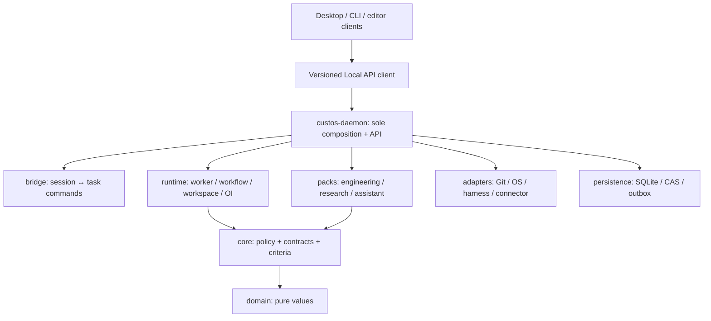
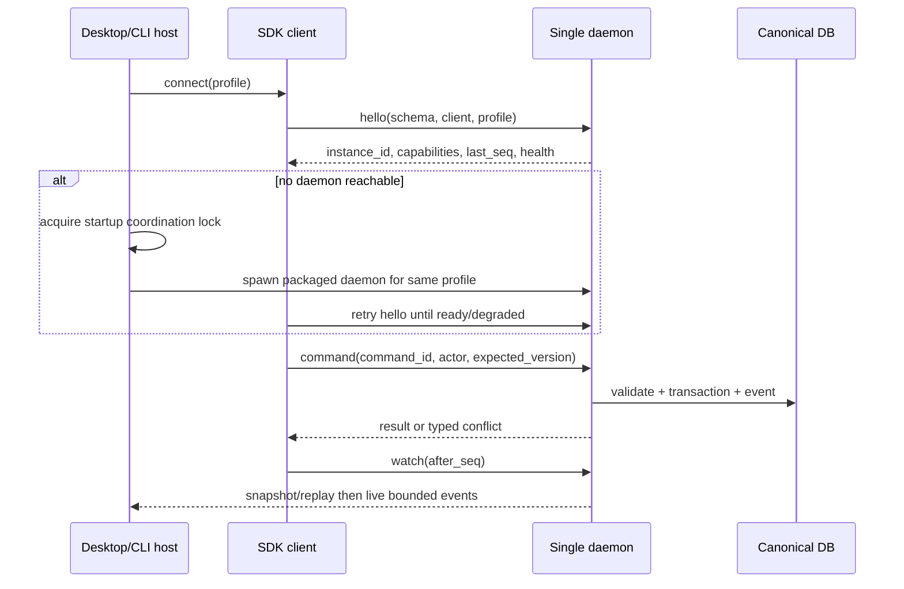

# Kế hoạch triển khai lõi Custos SADE và hấp thụ OrCa

**Trạng thái:** đề xuất triển khai dựa trên source Custos và snapshot OrCa đã đối chiếu; chưa phải xác nhận code đã chuyển hoặc các gate đã đạt. [Custos.md](../../Custos.md) giữ quyết định sản phẩm, [source study OrCa](orca-source-study.md) giữ provenance, [kế hoạch refactor tổng](workspace-restructuring-plan.md) giữ các packet đã có. Tài liệu này chốt cây repo đích, ownership, trình tự chuyển code và cách làm mỏng app hosts để nhóm có thể chia việc mà vẫn chạy được một đường sản phẩm.

## 1. Câu trả lời về cây repo

Giữ các **crate sản phẩm đang tồn tại** làm ranh giới cấp cao. Refactor đáng kể ở *bên trong* crate và đường lắp ráp. Không thêm `custos-sade`, `custos-orca`, một database OrCa hoặc một runtime Node/Electron vào production Rust. `custos-daemon` là backend owner duy nhất. Desktop và CLI là clients, không bootstrap `CustosRuntime` hoặc mở canonical SQLite.



Mũi tên thể hiện ownership và gọi ở mức sản phẩm, không phải toàn bộ Cargo imports. Daemon inject implementations; runtime/packs dùng contracts, không gọi `custos-adapters` hoặc SQL trực tiếp. `custos-provider` giữ ModelPort; `AgentRuntimePort` canonical hiện ở `custos-core/contracts/harness.rs`. Không tạo definition thứ hai.

### 1.1 Cây đích ở mức module

Tên thư mục sau là **địa chỉ trách nhiệm** khi packet tương ứng được code. Không tạo cây rỗng trước khi có consumer. Giữ tên file đang hoạt động và compatibility exports cho tới khi đường mới đạt parity.

```text
Custos/
├── Custos.md
├── AGENTS.md
├── Cargo.toml
├── crates/
│   ├── custos-domain/src/
│   │   ├── task, session, run, workflow, evidence, action, budget ...
│   │   └── workspace/             # refs, kinds, baseline, ownership values
│   ├── custos-core/src/
│   │   ├── contracts/             # canonical consumer ports, including harness/resource/storage
│   │   ├── kernel/                # Task/Run commands, transitions, completion
│   │   ├── authority/             # scope, grants, permits, effect admission
│   │   ├── evidence/              # criterion gate and staleness rules
│   │   └── resource/              # admission, ownership, integration preconditions
│   ├── custos-provider/src/       # ModelPort, inference events, usage/capabilities
│   ├── custos-runtime/src/
│   │   ├── agent/                 # one mounted worker-loop implementation
│   │   ├── workflow/              # compile, schedule, dispatch, mailbox, reconcile
│   │   ├── workspace/             # host/resource allocation, lease and integration coordination
│   │   ├── context/               # source selection, Repo Intelligence, compaction
│   │   ├── cognitive/ and oi/     # S1 hints, routing proposals, cost estimator
│   │   └── session/               # session execution coordination; not Task authority
│   ├── custos-packs/src/
│   │   ├── engineering/           # repo jobs, patch/test/review, domain verifiers
│   │   ├── research/              # source/claims/dataset/experiment, domain verifiers
│   │   └── assistant/             # identity/draft/calendar/effect/automation semantics
│   ├── custos-adapters/src/
│   │   ├── harness/               # native coding agents and future domain agents
│   │   ├── providers/             # model API and local inference implementations
│   │   ├── resources/             # Git, filesystem, process/PTY, browser, execution host
│   │   ├── connectors/            # email/calendar/notes/source integrations as needed
│   │   └── mcp/ and roaming/      # protocol translations, only where deployed
│   ├── custos-persistence/
│   │   ├── src/repositories/      # Task, Run, workspace, dispatch, mailbox, usage, outbox
│   │   ├── src/artifacts/         # CAS and rebuildable index owner
│   │   └── migrations/            # versioned schema
│   ├── custos-bridge/src/         # conversation-turn-to-Task application commands
│   ├── custos-daemon/src/         # bootstrap, Local API, supervisor, recovery, transport
│   ├── custos-sdk/src/            # typed Local API client, events, errors, cursor
│   └── custos-app/
│       ├── desktop/               # Tauri window, daemon attach/start, SDK forwarding
│       └── cli/                   # headless CLI client after current Tauri host migration
├── ui/desktop/src/
│   ├── app/                      # shared shell and routes
│   ├── features/workspace/       # lens, pane tree, resources and restore
│   ├── features/tasks/           # Task, Run, attention, evidence, approval
│   ├── features/{engineering,research,assistant}/
│   └── shared/{api,ui}/          # generated client facade, event sync, components
├── schemas/                    # versioned Local API and pack fixtures
├── tests/                      # contract, recovery, security, end-to-end
├── evals/                      # strong-single baseline, cost and quality by pack
└── docs/                       # product/architecture, source map, physical catalog
```

`ui/cli` hiện là React frontend khác và `crates/custos-app/cli` hiện là **Tauri app**, không phải headless CLI thật. Trong migration giữ hai entrypoint hoạt động hoặc ghi rõ demo; sau khi desktop có parity, chuyển `custos-app/cli` thành CLI client trong **cùng path/crate identity** nếu packaging cho phép, còn `ui/cli` được merge/retire sau consumer audit. Nếu packaging bắt buộc đổi crate name, đó là ADR riêng kèm migration, không phải điều kiện của kiến trúc SADE.

### 1.2 Quy tắc đặt feature mới

Một feature trộn nhiều trách nhiệm phải được cắt theo *loại quyết định*: domain values ở `domain`; quyền/trạng thái/completion ở `core`; điều phối worker/source/resource ở `runtime`; meaning và verifier theo Coding/Research/Assistant ở `packs`; OS/vendor bytes ở `adapters`; transaction/CAS/index ở `persistence`; app command mapping ở `bridge`/Local API; trình bày ở UI. Ví dụ Repo Intelligence dùng `domain/repo` cho refs, `runtime/context/repo_intelligence` cho query plan, adapters cho file/Git/LSP, persistence cho index, Engineering Pack cho rubric `repo_explain`. MCP chỉ expose một subset khi cần. Chi phí là core admission + runtime estimator + persistence usage ledger + UI projection, không thuộc riêng một pack.

## 2. Nền hiện tại: chỗ phải sửa trước khi ghép OrCa

| Source hiện có | Kết luận kiểm từ file | Quyết định migration |
|---|---|---|
| `crates/custos-app/desktop/src/lib.rs` và `crates/custos-app/cli/src/lib.rs` | Cả hai Tauri hosts đều gọi `CustosRuntime::bootstrap` và mặc định `custos.db`; expose `custos_request` riêng | Thay bằng daemon connection/client, chỉ daemon được bootstrap/open DB; một UI command facade dùng SDK. |
| `crates/custos-daemon/src/main.rs` | Binary hiện dùng stdio JSONL và `CUSTOS_DB_PATH`; hai hosts dùng `CUSTOS_DATABASE` | Chọn một cấu hình profile/path resolver ở daemon; thêm local listener khi implementation packet tới; stdio giữ compatibility nếu có caller. |
| `crates/custos-daemon/src/runtime.rs` | Compose store, kernel, fake provider fallback, Claude harness, `TaskRuntime`; startup reconcile result bị bỏ qua; chưa thấy pack dependency | Bootstrap thành validated runtime profile; lỗi recovery hiện `degraded/blocked`; mock chỉ trong explicit demo/test profile; inject pack registry/verifiers. |
| `ui/desktop/src/api/daemon_client.ts` và Local API DTO | Client gọi Tauri trực tiếp và có web fallback mô phỏng; `advanceTask` gửi `phase/status` trong khi backend cần `target_status`; `completeTask` gửi `evidence` trong khi backend cần `evidence_claims/summary` | Golden fixtures giữa Rust và TS; generated/typed client; demo API có namespace/watermark, không trả fake success trên live route. |
| `custos-runtime/src/workflow/lease.rs` | Directory copy và in-memory ownership, chưa là Git worktree | Reuse call site qua compatibility port; tạo Git adapter + durable resource ledger/lease, rồi retire copy behavior. |
| `custos-runtime/src/engine` và `src/agent` | Goose-derived engine chưa mounted; current agent/workflow path có code đang dùng | Audit call graph và conformance; chọn một mounted loop, trích reusable features có provenance; không chạy hai planners. |
| `custos-core` filesystem calls và runtime→persistence manifest edge | Core policy còn dính concrete I/O; runtime manifest phụ thuộc persistence dù search chưa thấy production import | Tách I/O qua ports/adapters và kiểm consumer trước khi gỡ manifest edge. |
| `ui/cli/bin/custos-cli.js`, `packages/custos-npm-package/bin/index.js`, `.github/workflows/release-cli.yml` | Bên cạnh hai Tauri hosts còn có Node CLI và npm installer. Installer hiện tự xóa `~/.cargo/bin/custos` nếu thấy và dọn các bản binary cache cũ; release workflow gọi `cargo build -p custos-cli` trong khi package trong `crates/custos-app/cli/Cargo.toml` tên `custos-app-cli` | Inventory các entrypoint người dùng đang dùng trước khi chốt CLI duy nhất; loại bỏ hành vi tự xóa binary ngoài phạm vi installer; release artifact và package name phải khớp binary thật. Không chạy installer trong audit. |

Các nhận định này là source inspection; chưa là build/test result. Đặc biệt, SQLite WAL cho phép nhiều connection đọc và chỉ một writer giao dịch tại một thời điểm, nhưng **điều đó không bảo đảm chỉ có một Custos runtime/scheduler/lease owner**. Singleton daemon là invariant sản phẩm, cần process/profile lock và recovery khi khởi động. [SQLite WAL](https://www.sqlite.org/wal.html).

## 3. Host mỏng: một backend owner cho mọi surface

### 3.1 Quyết định runtime

`custos-daemon` giữ duy nhất `CustosRuntime::bootstrap`, canonical DB connection, migrations, outbox reconciler, scheduler, provider/harness registry và pack registry. Desktop, CLI và extension kết nối tới daemon bằng **cùng versioned Local API**. Tauri chỉ quản lý window, lifecycle kết nối, native file picker/notifications nếu cần và một bridge command tới SDK. Các command `list_tasks/create_task/advance_task` viết tay trong CLI host được chuyển thành client methods, không còn truy cập TaskService hay direct domain mutation.

Local production transport: Unix domain socket trên macOS/Linux, named pipe có ACL trên Windows, hoặc authenticated loopback nếu deployment thực tế yêu cầu. stdio JSONL hiện có giữ như dev/compatibility transport cùng dispatcher; nó không phải cơ chế hai app desktop attach vào cùng daemon. SDK phải support request/response, bounded stream/events `after_seq`, cancellation, protocol version/capability negotiation và typed errors. UI không tự quyết “daemon offline” thành demo mode.



**Conflict rules:** canonical profile resolves one absolute DB/CAS/socket path. Daemon locks profile before migration/scheduler start; a second daemon exits or attaches to existing instance, never creates another writer service. Socket stale after crash is checked against live process/lock before cleanup. Client spawn race converges on the same daemon `instance_id`. Readiness is emitted only after migration, required adapter wiring and recovery result are known. If recovery is uncertain, daemon may serve read-only/status and block new effect dispatch. Opening a second window must not create another runtime. Closing a window must not cancel active Task; explicit stop/cancel follows Task policy. App updater/daemon version mismatch blocks incompatible writes and explains upgrade path.

**Secrets and trust:** local socket/pipe permissions bind to OS user/profile; loopback variant needs authentication and origin checks. Tauri command allowlist forwards approved Local API calls; renderer cannot call arbitrary shell or open DB. Sidecar packaging can bundle the daemon binary, but the host still attaches to a running instance and does not own a separate scheduler. Tauri documents external binaries/sidecars and capability scoping; implement the exact packaging method against the selected host version. [Tauri sidecar guide](https://v2.tauri.app/develop/sidecar/), [runtime authority](https://v2.tauri.app/security/runtime-authority/).

### 3.2 Host migration in reviewable steps

1. Add Local API envelope conformance fixtures and SDK transport behind existing `custos_request`; fix TS/Rust DTO mismatches first. Existing in-process Tauri command remains as a temporary adapter.
2. Move DB path/profile resolution into daemon bootstrap. Make fake provider explicit `demo/test`; display actual selected model/harness and `unknown` capability. Surface startup reconcile errors.
3. Introduce daemon listener and client connector; run daemon as a separate process for desktop and CLI. Keep stdio JSONL behind the same handler for old clients until callers are audited.
4. Replace `Arc<CustosRuntime>` in desktop with `Arc<LocalApiClient>`; Tauri bridge forwards only typed command/query/event methods. Remove `custos-daemon` and `custos-domain` from desktop production dependencies once no consumer remains.
5. Migrate `custos-app/cli` from Tauri launcher to headless client; move any reusable visual elements to desktop/shared TS only after checking consumers. During transition do not install two same-name apps with independent `custos.db` defaults.
6. Retire in-process bootstrap in hosts only after multiwindow, CLI+desktop simultaneous, daemon crash/restart, schema mismatch and app upgrade tests pass. Keep migration reversible through compatibility adapter until that gate.
7. Consolidate CLI packaging: decide which binary is the supported `custos` command, then align Cargo package/bin name, `ui/cli` Node wrapper, npm installer and release workflow. Any old binary removal must be explicit, targeted and user-approved, with a safe migration path; running the new CLI must not delete another install automatically.

## 4. OrCa extraction ledger: what enters and how

The pinned local source study records OrCa checkout SHA `3f6225deeb08a82448c5f0b0725073401629d462` and MIT license. Its `.git` was removed after inspection; before copying literal code, restore provenance from official upstream SHA, check notice/dependencies and record exact source→destination/diff. Most Rust backend work should **reimplement behavior against Custos contracts**; TS/React components may be ported selectively after license and Electron dependency audit. The ledger below is implementation guidance, not a claim of ported code.

| OrCa source/behavior inspected | Custos destination | Transfer mode and required transformation | First gate |
|---|---|---|---|
| `agent-launch/agent-launch-executor.ts`: structured vs terminal, host support after workspace exists, definitive refusal vs unknown | domain launch observations; `core/contracts/harness`; runtime agent launch; native harness adapters; persistence attempt | Reimplement sequencing. Bind attempt to Task/Run/WorkerRun, model pin, capability, cost reservation; terminal launch has honest `provider-governed` assurance | No double launch on unknown; refusal fallback only before commit; actual mode/status in UI. |
| `runtime/orca-runtime-create-managed-worktree.ts` and local/folder/remote helpers: repo/host routing, setup, lineage, tabs | domain ExecutionWorkspace; runtime workspace coordinator; Git/FS/process adapters; resource repository | Reimplement resource lifecycle. Folder workspace and research experiment workspace are valid; Git worktree only for Git repo. Separate setup from agent launch; record base/dirty manifest and owner | Create/open/restart/diff/cleanup same resource; symlink/path/base checks; preserve user files. |
| `runtime/orchestration/db/dispatch-row-writer.ts`: one active claim/depth | core admission; runtime dispatcher; persistence atomic claim | Translate SQL semantics into narrow transactional port; add Task revision, budget reservation, idempotency key and lease epoch | Two claimers yield one authoritative assignment; stale worker cannot settle. |
| `runtime/orchestration/db/lifecycle-transition.ts` and transaction runner | core transition policy; persistence compare-and-transition | Reimplement transaction boundaries using Custos Task/Run FSM and events | Command retry is idempotent; no worker report directly completes criterion. |
| `dispatch-mailbox-consumer-fencing.test.ts` and mailbox store | domain delivery identity; runtime mailbox; persistence deliveries/consumer generation | Reproduce behavior fixtures: reattach fences old consumer/ack, unread messages survive | Old ack rejected; new worker receives retained message once in active generation. |
| `coordinator-task-dispatch.ts` and unobserved prompt tests | runtime dispatch/reconcile; native harness observations; persistence attempt | Preserve unknown prompt-delivery state. Late reports checked against assignment; no blind resend | Possibly sent prompt never repasted automatically; definitive undelivered path can retry. |
| `lifecycle-reconciliation.ts` and worker report admission | core sender/assignment admission; runtime message normalization; persistence receipt | Use actor/session/incarnation/epoch identity, not UI pane alone; treat message content as untrusted | Stale/wrong assignee report cannot advance Run or mask liveness. |
| `coordinator-dag-convergence.ts` | runtime workflow convergence; core criterion/dependency statuses | Add causal blocked/unknown outcome when no ready or active nodes | Failed/blocked child cannot make parent Task succeed. |
| `automations/service.ts`, headless dispatcher and usage collection | Assistant pack trigger/grant policy; runtime occurrence; persistence unique run/usage; connector adapters | Reimplement selected local use cases after manual effect flow works | Revocation/expiry/max-runs honored; timeout after external send remains uncertain. |
| `WorkspaceSpacePage`, `TaskPage`, `AgentKanbanBoard`, chat/diff/terminal/browser panes | `ui/desktop/features/*` | Port interaction patterns or selected React components through Custos SDK; remove Electron IPC/store assumptions; map Task/Run/Resource IDs and a11y tokens | Same Task across Copilot/Research/Coding; status/usage/evidence from backend. |

**Explicit exclusions for this campaign:** OrCa SQLite schema and Task status as canonical data; entire Electron main process; its package manager/build pipeline; remote/mobile relay; all provider integrations; permission bypass flags; broad browser automation; automatic copying of `.env` into worktrees. Revisit specific capability when a Custos user job and a safe source/credential policy require it. Worktree is an execution resource, not a security sandbox or Task identity. [OrCa worktree model](https://www.onorca.dev/docs/model/worktrees), [OrCa orchestration model](https://www.onorca.dev/docs/cli/orchestration).

## 5. Backend refactor by subsystem

### 5.1 Domain and core

Add only value types needed by the first live path: `ExecutionWorkspaceRef` with kind/host/owner/baseline, `LaunchAttempt`, `DispatchAssignment`, `Delivery`, `EffectAttempt`, source revision and usage attribution. Task remains the user goal; OrCa's internal Task becomes a WorkflowNode/WorkerRun concept where appropriate. Keep versions/IDs independent; a pane ID, PTY handle and path are presentation/adapter handles and cannot authorize a worker report.

Core validates state transitions, contract scope, provider/local-only pin, worktree/integration preconditions, bounded fan-out/depth, permit/effect digest, budget admission and completion gate. Move physical filesystem reads/writes currently inside core context/capability/evidence paths behind ports while keeping canonical path checks at dispatch. A command succeeds only after persistent state accepts it; external OS/provider effects have separate observed/uncertain receipts.

### 5.2 Runtime and agents

Trace daemon `TaskRuntime` → `runtime/agent`, `workflow`, `gateway` and dormant Goose-derived `engine` with caller/feature flag inventory. Choose one production worker loop based on ability to stream events, call mediated tools, cancel, emit attempt usage and recover; keep incompatible Goose features as identified source material until integrated one by one. Native Codex/Claude/Goose harnesses keep their own internal loop; Custos owns outer Run/WorkerRun/authority/evidence and records which native effects it cannot mediate.

Workflow compiler/scheduler owns ready nodes, write-set conflicts, one planner owner, bounded retries, resource placement, delivery and convergence. OI proposes a plan inside hard constraints; Core admits it. S1 can run source-backed scouts in a workspace, but cannot mint permits or override strong S2 reasoning. The direct single-agent path remains a first-class topology.

### 5.3 Resources, persistence and recovery

Replace directory-copy lease with a resource port and Git adapter. Persist identity, host, baseline, parent/child lineage, owner, retention, lease epoch, setup status and last observation. Research experiments receive dataset/environment/compute resource refs without pretending they are Git worktrees; Assistant connectors use account/recipient scope, not a filesystem workspace.

Persistence implements narrow atomic operations: `claim_dispatch`, `reattach_consumer`, `ack_delivery`, `settle_worker`, `reserve/settle_budget`, `prepare_effect`, `record_observation`, `claim_trigger_occurrence`. Runtime never receives a SQLite connection. Every operation has `already_applied/conflict/unknown` behavior and an event sequence. Startup reconciliation identifies `launch_unknown`, `prompt_delivery_unknown`, `effect_uncertain`, stale lease and missing CAS; it does not retry irreversible effects merely because there is no receipt.

### 5.4 Packs, skills and protocols

Engineering owns repo explain/debug/patch/refactor/migration criteria; Repo Intelligence is shared context infrastructure. Research owns acquisition/source version/claim support/dataset experiments; Assistant owns identity/draft/calendar/send/recurring grants. Each pack declares required capability and verifier obligations; daemon wires the registered pack services. Cross-pack handoff sends typed selected artifacts with redaction, not raw session history or inherited permission.

MCP client/server exposure lives at protocol adapter boundary; ACP is editor-to-agent integration where supported; A2A is remote delegation only when identity and deployment require it. Neither protocol becomes Task authority, workspace owner or a general tool folder. Provider APIs implement ModelPort; Codex/Claude native coding agents implement AgentRuntimePort with their actual tool/usage/continuation limits. A local coder model through ModelPort becomes a coding agent only when a Custos worker loop wraps it with tool orchestration; model identity alone does not grant agent semantics.

## 6. End-to-end data contracts to freeze

| Contract | Minimum fields and invariant | First consumer |
|---|---|
| Local API command | schema version, command ID, actor, Task/expected revision, deadline, payload, privacy | All hosts/UI and daemon. |
| Event cursor | sequence, causal parent, Task/Run/attempt IDs, event version, resumable `after_seq` | Desktop/CLI reconnect and attention view. |
| SessionTaskBinding | session/turn range, Task ID, actor, role, created_at | Chat → Research/Coding/Assistant continuity. |
| ExecutionWorkspace | kind, host, canonical resource ref, source/baseline, owner, lease generation, retention | Git/folder/experiment resource panes. |
| WorkerRun/LaunchAttempt | selected harness/model, source and workspace refs, actual launch mode, attempt ID, observed/unknown status | Agent timeline, cancellation/recovery. |
| Dispatch/Delivery | Task/workflow revision, node, assignee/incarnation/epoch, message ID, ack generation | Multiworker DAG and mailbox. |
| ActionIntent/EffectAttempt | exact target/arguments digest, provenance, scope, permit, preconditions, idempotency strategy | File apply, external Assistant effects. |
| CriterionVerificationRecord | criterion/source revision, verifier identity/version, method, status, artifacts, human waiver separate | Outcome across three packs. |
| UsageRecord | attempt, billed/estimated/unknown, tokens/cache/paid tools, timestamp | Budget and cost per accepted Task. |

Current `ApiRequest{id,method,params}` has no command id or expected version, and UI DTOs are manually duplicated. Extend via versioned envelope and compatible dispatcher path with golden Rust/TS fixtures; do not silently reinterpret old `id` as sufficient idempotency if retries can mutate state. Avoid putting raw terminal/token stream bytes in canonical event rows; persist causal lifecycle/effect events and stream bulk output separately with bounded buffers.

## 7. Delivery sequence and review gates

Every packet lists current path → target path, callers, schema changes, compatibility shim, fixtures, rollback/roll-forward and status in the physical catalog. A packet is complete only when one real user action follows the new path and old clients either continue to work or fail with a versioned error. Avoid a one-commit repository move.

| Wave | Packets | User-visible result and gate |
|---|---|---|
| **Foundation** | F0 source/provenance and dirty-tree inventory; F1 Rust/TS Local API fixtures; F2 actual runtime/provider/loop status map | Clear demo/live labels and one documented command→worker→artifact trace. No code copied before license/source gate. |
| **Single backend** | H0 profile/path resolver and startup lock; H1 daemon local transport/health; H2 SDK client/events; H3 desktop attach; H4 CLI attach/migration | Launch desktop twice plus CLI: one daemon instance, one DB profile, no duplicate scheduler; daemon crash/restart and schema mismatch are visible. |
| **Trusted spine** | K0 Task/Run/Worker/Workspace/Attempt IDs; K1 pure core/I/O extraction; K2 atomic storage contracts; K3 outbox/recovery | Same Task survives restart; stale command/effect rejected; uncertain effect not repeated. |
| **OrCa operational core** | O0 launch contract; O1 Git/folder/experiment resources; O2 dispatch claim/mailbox/fencing; O3 convergence and recovery | Real worktree/agent starts once; worker replacement cannot report for old assignment; blocked DAG does not pass Task. |
| **Three domains** | D0 Engineering single worker + trusted verify; D1 Research source/claim/experiment; D2 Assistant draft/fake send; D3 typed handoff | Each pack works alone; a selected Research claim can lead to Coding patch and Assistant draft under same Task with separate rights. |
| **Workbench** | U0 truth cleanup; U1 shared chat shell; U2 Task bindings; U3 pane/lens; U4 Coding; U5 Research; U6 Assistant; U7 fleet/attention | Chat → Research → Coding → Copilot keeps Task and source lineage. Reopen does not spawn/retry worker. UI shows actual vs unknown statuses. |
| **Optimization** | Q0 strong single baseline; Q1 context/cache; Q2 bounded S1 scouts; Q3 OI topology; Q4 Meta proposal | Per-pack quality noninferiority and cost per accepted Task measured against same-model direct baseline; losing route stays opt-in. |

Dependency details: H/F and UI read-only components can progress in parallel against marked fixtures; mutation/live claims require H+K. O1 depends on resource port and persistence ownership; O2 depends on atomic claim/worker IDs; D2 external send depends on outbox/reconcile; U4/U5/U6 live actions depend on corresponding D packets. Remote hosts, federation and mobile remain separate campaigns. The existing §21–24 packets map to these waves; this table does not create a second scheduler or roadmap authority.

### 7.1 First six implementation PRs

1. **Contract audit:** pin exact current OrCa/Custos file+license map; generated Rust/TS fixtures for current API; characterize UI/backend DTO mismatches and live/demo status. No behavior migration.
2. **Daemon owner:** profile path resolver, lock/instance ID, explicit provider profile, recovery result, health/readiness response. Preserve stdio path.
3. **Client transport:** local listener + SDK connect/hello/request/watch; desktop bridge attaches via SDK; test two windows/CLI against one daemon. Keep in-process compatibility briefly.
4. **Core I/O extraction:** move one vertical file/source read and verifier observation at a time to adapters, with identical permission/stale behavior; remove direct dependency only after consumers move.
5. **ExecutionWorkspace:** value/port/repository/Git adapter plus read-only diff and restart recovery; migrate `workflow/lease.rs` consumer behind adapter without deleting user resources.
6. **One real Engineering run:** selected model or native harness, source snapshot, attempt usage, patch proposal/verify/Outcome through daemon+SDK; this becomes baseline for further OrCa dispatch and three-pack work.

PR 1–6 are an ordered starting slice, not a promise that the entire SADE is complete. After each PR update `Custos.md` for architecture decisions, the relevant topic doc for HOW and `codebase-architecture.md` for actual file/symbol changes; record `exists/partial/experimental/absent` rather than marking target modules implemented.

### 7.2 Work packets for one daemon and thin hosts

| Packet | Current → target files/ownership | Contract and migration detail | Acceptance and fallback |
|---|---|---|---|
| H0 profile | `daemon/src/runtime.rs`, `daemon/src/main.rs`, both Tauri `lib.rs` → daemon profile resolver | Define profile ID, absolute DB/CAS/runtime socket, selected provider and retention in one config. Remove host-specific `CUSTOS_DATABASE`/daemon `CUSTOS_DB_PATH` divergence through a compatible env alias with warning. Validate no ambiguous relative `custos.db` at production startup. | Desktop and CLI show same profile ID/path and reject attempts to attach to another profile. Existing dev DB can be selected explicitly; no implicit migration of user data. |
| H1 singleton | daemon startup/bootstrap → profile lock + instance ID + health | Acquire lock before opening write services, migrations and scheduler. Resolve stale socket against lock/process. Publish `starting/ready/degraded/incompatible`, API version and last event sequence. Recovery errors become health facts. | Two simultaneous starts converge on one instance; competing version does not migrate DB. If daemon unavailable, clients show connection error with retry, not demo Task results. |
| H2 transport | daemon stdio JSONL handler → shared dispatcher behind stdio and local listener | Keep one request validator and one event publisher; local IPC has peer identity/profile scope, max frame, timeout, cancellation and bounded subscriptions. Compatibility stdio adapter continues until its callers are enumerated. | Same golden request yields same response over both transports. Slow subscriber cannot stall canonical writer; reconnect resumes by cursor/snapshot gap. |
| H3 SDK | `custos-sdk` ACP-oriented wire crate + TS `daemon_client.ts` → Local API client facade | Do not delete ACP bindings used elsewhere. Add separate `local_api` client surface under existing SDK boundary and generated TS types from fixtures/schema. Convert call errors to typed `offline/unsupported/conflict/uncertain`. Commands carry stable command IDs, not a new random ID on retry. | Rust and TS round-trip fixtures for Task/Run/session/effect/unknown enum; `advance/complete` parameters match backend. Browser demo driver is explicitly selected, never auto fallback from failed live connection. |
| H4 desktop | `custos-app/desktop/src/lib.rs` → Tauri window and SDK bridge | Replace `Arc<CustosRuntime>` state with client connection/supervisor handle. Reduce Tauri commands to connect/request/watch/open-native-resource needed by UI; Tauri is not TaskService owner. | Two windows share daemon instance and event cursor. App close leaves active Run state unchanged. Bridge errors propagate actual daemon health. |
| H5 CLI | `custos-app/cli/src/lib.rs` Tauri app → headless CLI client in same package path where feasible | Inventory installed command expectations and `ui/cli` consumers. Preserve current launcher during compatibility phase; then point CLI commands at SDK, with streaming/status/approve/cancel on same API. Remove duplicated task DTO/command handlers when parity holds. | `custos task list/status/resume` sees desktop Task IDs; concurrent CLI and desktop writes respect expected revision. No second Tauri backend remains for production. |
| H6 packaging | `ui/cli/bin/custos-cli.js`, npm installer, release workflow → one supported CLI distribution | Align native binary/package names and versioned releases. Installer may install into its own managed directory; it must not remove `~/.cargo/bin/custos` or unrelated cached versions during routine launch. Audit copied Goose download scripts before they enter Custos release. | Clean install, upgrade, side-by-side existing Cargo install and uninstall preserve user binaries/data. Release CI builds the named package it actually publishes. |

Packaging decision: daemon can be installed separately or shipped with desktop as a Tauri external binary. The launcher may spawn it under a startup lock, then must **attach by API**; the spawned process is not the Tauri command handler. On Linux/macOS use user scoped runtime directory/socket permissions; on Windows use named pipe ACL or authenticated loopback. Signing/updater, executable naming and portable mode need per-platform packaging checks, but they must all preserve one daemon instance per profile. Stop/restart commands act on the daemon explicitly; closing UI is not a stop signal for an active delegated run.

### 7.3 Work packets for core and execution ownership

| Packet | Files to inspect/migrate | Done condition |
|---|---|---|
| K0 IDs and projections | Existing `domain/{task,session,run,workflow,action,evidence,budget}.rs`, `core/contracts/*`, `bridge`, `daemon/local_api` | Formal mapping `Task ↔ Session` many-to-many, `Task → Runs`, `Run → WorkerRuns`, `WorkerRun → launch/dispatch attempts`, `Run → Resources`; no duplicate ID semantics from UI pane or OrCa Task. Every command/event has actor/correlation/revision. |
| K1 core I/O | `core/context/mod.rs`, `core/capability/deterministic.rs`, `core/evidence/verifier.rs`, `core/sandbox_policy/*` | Business decisions consume source metadata/bytes/receipts provided by ports. Adapter revalidates physical target at effect time. Core unit tests can use in-memory observations without filesystem; production path still rejects symlink/path drift. |
| K2 atomic storage | `core/contracts/storage.rs`, `persistence/src/repositories/*`, `runtime/workflow/{dispatcher,outbox,task_runtime}.rs` | Narrow operations own transactions; expected state version, unique command/attempt identity, budget reservation and event/projection commit are consistent. Runtime cannot call SQLite methods directly. |
| K3 completion and recovery | `core/kernel/completion.rs`, `core/evidence/*`, `daemon/runtime.rs`, persistence outbox | Worker terminal state, command exit and citation locator cannot alone mark criterion pass. `unknown/stale/waived` remain distinct. Startup reconcile result is returned to daemon health, not dropped. |

Migration technique: introduce a port and adapter for one consumer, run old and new observation paths in a controlled fixture where possible, then switch daemon wiring. Keep an adapter-level compatibility wrapper for callers rather than maintaining two policy implementations. `custos-runtime` manifest may drop its persistence dependency only after feature/cfg consumer search and cargo metadata/build check show no production use. The old source tree can remain unmounted with a clear status until provenance and consumer migration are complete; deletion is a final, separately reviewed cleanup.

### 7.4 Work packets for OrCa operational behavior

| Packet | OrCa behavior → Custos implementation | Failure cases that must be represented |
|---|---|---|
| O0 launch | `agent-launch-executor` sequencing → `AgentLaunchAttempt` in domain, launch coordinator in runtime, native harness/PTY adapters, persistent observation | Workspace created but no agent; definitive structured refusal; attach unknown after process/session may exist; prompt maybe delivered; mode unsupported by host; user model pin unsupported. Store requested and actual mode separately. |
| O1 workspace | managed worktree lifecycle → `ExecutionWorkspace` resource registry, adapter create/open/status/diff/remove, durable lease/owner/retention | Dirty baseline, shared ignored paths, setup hook failure, remote/host mismatch, branch already exists, symlink escape, process still owns resource, user files present during cleanup. Never auto-delete ambiguous resource. |
| O2 dispatch | dispatch-row claim → atomic claim with Task/workflow revision, ready deps, budget headroom, write-set/reservation and assignment epoch | Duplicate claimers, stale revision, budget race, worker launch after claim but before receipt, process died with unknown prompt delivery. |
| O3 mailbox | consumer generation and lifecycle reconciliation → durable deliveries plus active assignment identity | Old consumer ack, stale heartbeat, wrong sender, malformed `worker_done`, late result from superseded attempt, unread mail on restart. Native agent text remains untrusted even when sender identity is known. |
| O4 convergence | DAG convergence/decision gates → bounded scheduler with causal blocked reason and human attention event | Failed required dependency, no ready node and no active worker, approval expiry, verifier unavailable, OI replan budget exhausted. Never infer success from no pending worker. |
| O5 automation | selected OrCa schedule/usage patterns → trigger occurrence transaction, Assistant scope/grant, normal Task/Run/effect pipeline | Two schedulers claim same due run, grant revoked, account changed, external effect timeout, unknown usage, user offline. Auto-send requires standing grant matching exact effect class. |

**One source file may cross several Custos crates.** For example an OrCa worktree create function mixes admission, Git, setup, terminal startup, metadata and UI activation; Custos separates those into core, adapters, persistence, runtime and UI events. Literal TypeScript backend copy into Rust is not the migration strategy. For selective UI source ports, component dependencies on `window.api`, Orca pane IDs, Electron stores and theme tokens must be replaced by SDK/resource props; record license notice and the lines/files actually adapted.

### 7.5 Three pack vertical slices

| Slice | Input → output | Core/workspace/OrCa dependency | Domain acceptance |
|---|---|---|---|
| Engineering read | Repo scope + question → anchored explanation | SDK, source snapshot, Repo Intelligence, one selected model/agent | Anchors reopen at same source revision; unavailable files/index coverage labeled; local-only respected. No worktree needed. |
| Engineering mutate | Behavior criterion + allowed paths → patch/test/review/outcome | O0/O1/O2, exact base hash, permit/receipt, trusted verifier | Patch remains inside scope, tests relate to criterion; agent-authored test alone cannot close acceptance; dirty main protected. |
| Research read | PDF/web/corpus + question → passages/atomic claims/brief | Source registry/parser/coverage, claim graph, typed context | Correct page/version; valid citation with insufficient support is `unknown`; parse gaps visible. |
| Research experiment | Dataset/method/compute cap → reproducibility bundle | Experiment resource host/lease, environment/dataset digest, worker attempt and cost | Config/seed/data/version/artifacts preserved; failed or partial experiment not reported as confirmed claim. |
| Assistant proposal | Scoped context + person/time → draft/schedule proposal | Contact/calendar adapters, identity/time resolution, source privacy | Ambiguous recipient/time asks human; draft never reported sent. |
| Assistant effect | Exact approved payload → observed/uncertain receipt | K2/K3 outbox, connector reconciliation, standing grant where automation | One-byte edit invalidates permit; timeout after send remains uncertain; no blind retry. |
| Cross-pack | Selected Research claim → EngineeringSpec/patch → Assistant draft | Handoff envelope, redaction, source and criterion lineage | Same parent Task and budget lineage; each pack keeps distinct obligations; permission never inherited by artifact transfer. |

Each slice must be runnable alone before cross-pack composition. A native coding agent, direct model worker and future research agent are interchangeable only at the `WorkerRun` contract where their capabilities match; the pack verifier remains domain-specific. A local coder model through ModelPort uses Custos' worker loop to perform actions, while Claude Code/Codex native harnesses report their own tool mediation limits. The workbench shows actual executor and assurance per action.

### 7.6 UI and protocol migration gates

`ui/desktop/src/context/AppContext.tsx` currently conflates Task and Session projections, and several workspace panes still contain hard-coded data. UI packets in [workspace plan §23](workspace-restructuring-plan.md#23-implement-plan-ui-chat-và-workbench-linh-hoạt) are authoritative. The backend gate for each pane is a typed query/command and an event projection. A pane may be built against fixtures earlier, but live mode must show `unavailable` for absent APIs. Layout/lens switches never create Task or Run; `AddPackObligation` and `ForkTaskFromSelection` are explicit commands with revision ack. Notification/attention derives from persistent approval, effect and worker states, not client timers.

Protocol rollout remains local first: one Local API transport for desktop/CLI; MCP client to reach selected tools; expose an MCP server or ACP adapter only when a real client needs it; A2A after a remote delegation identity/host contract exists. The `mcp/` and `roaming/` source already present in adapters need mock/live classification before they are listed in product capability registry. No protocol translator may mint Custos grants or directly write canonical Task state.

### 7.7 Release and rollback discipline

For each packet, identify old caller and new caller, migrate one at a time, keep a bounded compatibility facade, then remove it after evidence of parity. Schema changes use forward migrations and a backup/restore rehearsal on fixtures; rollback after irreversible schema/data changes is a versioned forward repair, not file deletion. Adapter release toggles can disable a new harness/worktree/connector without rewriting Task history. A new UI renderer can revert while daemon still serves old versioned reads. If a launch/effect has unknown external status, rolling back code does not roll back the effect; reconciliation stays available in the old or emergency path.

Feature status vocabulary in docs and UI: `planned` (design only), `implemented` (source path exists), `mounted` (daemon wires it), `verified` (acceptance fixture passes on named platform), `degraded` (known missing dependency/uncertain recovery). These labels must not be collapsed into a single checkmark. Release note for every enabled capability records host OS, adapter/harness version, protocol version, assurance path, dataset/benchmark slice and known unknown states.

## 8. Acceptance scenarios for the final structure

1. Open desktop and CLI concurrently, create a Task from either, observe the same ID/events and a single daemon instance. No process silently opens another `custos.db` or changes provider profile.
2. Ask a read-only coding question with pinned model; no worktree is created, source anchors and billed/unknown usage are visible. Then request patch: choose execution workspace, preview exact diff/base, apply within scope and verify against trusted criteria.
3. Launch native agent in a new Git worktree. Structured path refuses definitively before create → terminal fallback in same resource; ambiguous launch → `unknown`, no second launch. Restart restores observed workspace/attempt identity.
4. Two workers race for a DAG node → one dispatch claim. Replace worker A with B → old heartbeat/ack/report cannot settle B's work. Lost prompt reply stays uncertain; blocked graph yields causal blocker instead of success.
5. Start with Copilot chat, save selected sources as Research obligation, inspect claim/page/version, open Coding lens on same Task, create an EngineeringSpec and patch, return to Copilot to draft a message. Session/Task IDs remain distinct; no grant crosses pack automatically.
6. Edit one byte of assistant recipient/payload after approval or time out after external send → old permit invalid/attempt uncertain. Reconcile before any retry; UI and CLI report the same truth.
7. Compare strong single agent with S1/OI route on paired Coding, Research and Assistant fixtures. Report accepted rate, false pass, billed/estimated/unknown cost, retries, human effort and latency; optimization only becomes default when its quality gate holds.

## 9. Decisions to retain in source review

The target is one canonical Custos backend and three domain workbenches over the same Task graph. The largest refactors are host/bootstrap ownership, core I/O boundary, durable workspace/dispatch, one worker loop and API/schema truth. These are implementation commitments for the plan, not evidence that current binaries pass the scenarios. OrCa source provides behavior patterns and some UI candidates; concrete source reuse is decided per file after provenance, license, dependency and parity review. Maintain an explicit mapping in [OrCa source study](orca-source-study.md) as packets land.
