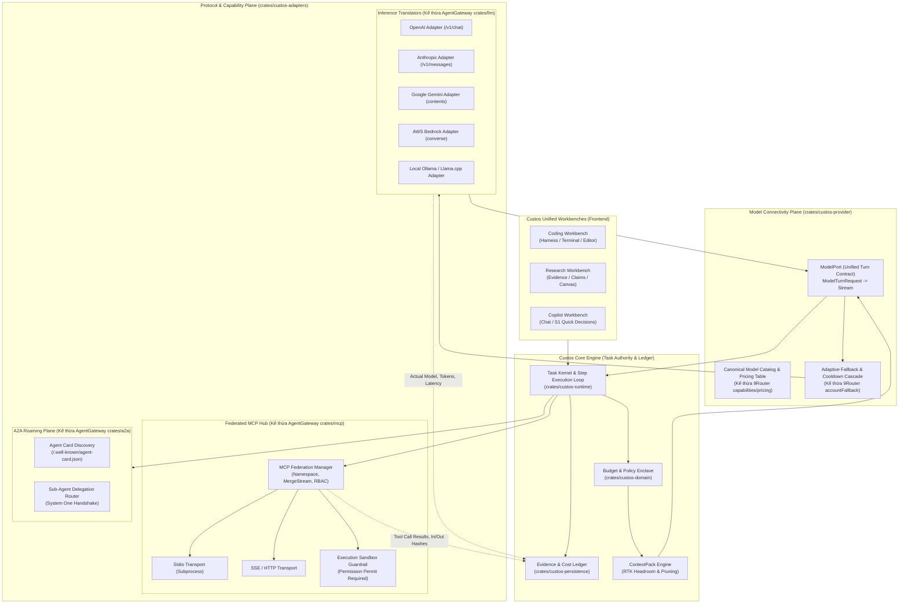
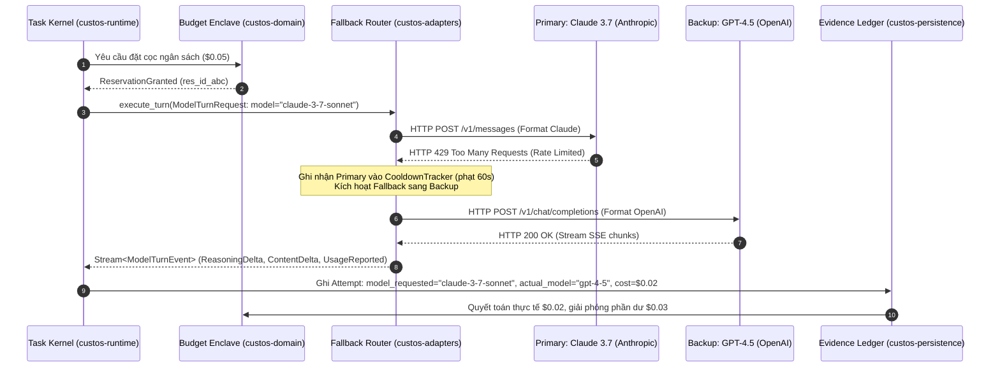
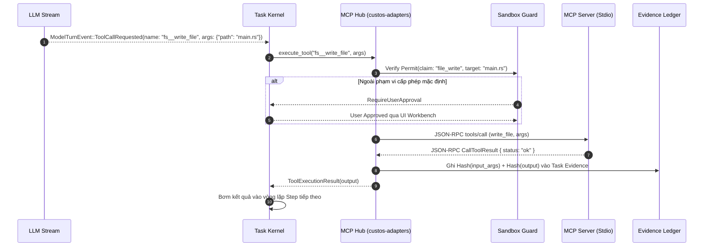

# HỆ THỐNG SYSTEM DESIGN & BẢN ĐỒ CODEBASE HỢP NHẤT: CUSTOS x 9ROUTER x AGENTGATEWAY
## Hướng dẫn Kỹ thuật Master dành cho Core Engineering Team

> **Mục tiêu:** Bản đặc tả kiến trúc (System Design Blueprint) và phân bổ codebase chi tiết chuẩn công nghiệp. Giúp bất kỳ kỹ sư / đồng đội nào bước vào dự án đều lập tức nắm trọn bản chất của **9Router** và **AgentGateway**, hiểu rõ cách **Custos** hấp thụ tinh hoa vào lõi Rust, và có thể bắt tay phát triển tính năng mới ("siêu update") ngay lập tức mà không phá vỡ kiến trúc hệ thống.

---

## 1. ĐỊNH VỊ KIẾN TRÚC & TRIẾT LÝ HỆ THỐNG (THE ARCHITECTURAL PHILOSOPHY)

Để tránh nhầm lẫn tai hại trong quá trình triển khai, mọi kỹ sư trong team phải khắc cốt ghi tâm định vị của 3 codebase:

| Tiêu chí | 9Router (`/9router`) | AgentGateway (`/agentgateway`) | Custos (`/Custos`) - **LÕI HỆ THỐNG** |
| :--- | :--- | :--- | :--- |
| **Bản chất** | **Inference Broker & Heuristic Proxy** | **Enterprise Protocol Ingress Gateway** | **Autonomous Agent OS & Verification Ledger** |
| **Ngôn ngữ** | JavaScript / Node.js (Next.js) | Rust (Tokio, Axum, Tower, Hyper) | Rust (Domain, Runtime, Adapters, Daemon, UI) |
| **Thế mạnh ăn tiền** | • Catalog giá & năng lực model phong phú.<br>• Heuristics xử lý 429/503 fallback & cooldown.<br>• RTK Context Compression (Headroom/Caveman).<br>• Bảng giá token chi tiết (Prompt/Cache/Output). | • Chuẩn hóa MCP Federation & Mergestream.<br>• Chuẩn hóa Google A2A protocol (Agent Card).<br>• Engine dịch giao thức LLM thuần Rust (`crates/llm`).<br>• Zero-copy streaming, Tower middleware & CEL. | • **Task Authority & Step Execution Kernel**.<br>• **Budget Reservation & Verification Ledger**.<br>• Workspace Sandboxing & Tool Mediation.<br>• Nhận thức 2 tầng (S1 quick signal / S2 deep reasoning / OI router). |
| **Giới hạn / Điểm mù** | • Không sở hữu state của Task.<br>• Không quản lý được file system / sandbox.<br>• Không có bằng chứng kiểm chứng (evidence).<br>• Proxy đơn luồng qua Node.js. | • Chỉ là Ingress/Edge proxy.<br>• Không sở hữu vòng lặp suy luận (Agent Loop).<br>• Không có Human-in-the-loop workspace.<br>• Không biết mục tiêu người dùng là gì. | **Không tự viết lại từ đầu những thứ thế giới đã giải quyết tốt:** Hấp thụ toàn bộ tinh hoa của 9Router & AgentGateway vào Ports & Adapters của Custos. |

### Các Nguyên tắc Bất biến (Architectural Invariants):
1. **Custos là Cơ quan Thẩm quyền Tuyệt đối (Absolute Authority):** Không bao giờ để 9Router hay AgentGateway nắm quyền quyết định Task sống hay chết, trừ bao nhiêu tiền, hay lệnh shell có được chạy không. Custos sở hữu Task Contract, Budget Reservation Ledger và Permission Enclave.
2. **Không bọc Proxy Mù quáng (First-Party Native):** Không dựng 9Router hay AgentGateway thành các tiến trình sidecar độc lập rồi forward HTTP lòng vòng nếu logic đó có thể chạy thuần Rust trong in-process. Mọi cơ chế dịch format, fallback cooldown, nén context được chuyển hóa thành module Rust chạy thẳng trong `custos-provider` và `custos-adapters`.
3. **Evidence-Driven:** Mọi lần gọi model (Attempt), mọi công cụ MCP được gọi, mọi task ủy quyền qua A2A đều phải ghi nhận log vào Ledger với hash chứng thực (Verifiable Evidence).
4. **Zero Silent Fallback:** Khi fallback từ Model đắt sang Model rẻ hơn, hệ thống phải ghi nhận `actual_model` khác với `requested_model` vào Ledger để đối soát chi phí minh bạch với user.

---

## 2. MỔ XẺ TOÀN DIỆN RUỘT 9ROUTER (`/9router`)

9Router là một reverse-proxy tối ưu hóa cho LLM viết bằng Node.js. Cốt lõi của nó nằm trọn trong thư mục `open-sse/`.

```
9router/
├── open-sse/                     # TRÁI TIM CỦA 9ROUTER
│   ├── config/                  # Provider endpoints & hằng số hệ thống
│   ├── executors/               # Execution logic cho từng provider (anthropic, openai, gemini, codex, etc.)
│   ├── handlers/                # HTTP route handlers (chatCore, systemoneCore, search, embeddingsCore)
│   ├── providers/               # Tri thức về model & định giá (VÀNG RÒNG)
│   │   ├── capabilities.js      # Matrix năng lực: vision, tools, reasoning, context_window (54KB)
│   │   ├── pricing.js           # Bảng giá chi tiết: prompt, cached_prompt, completion per model (39KB)
│   │   ├── thinkingLevels.js    # Cấu hình reasoning effort (low, medium, high) cho Claude/o-series
│   │   ├── registry/            # Danh mục các endpoint provider
│   │   └── schema.js            # Validate model request schema
│   ├── rtk/                     # Real-Time Context Compression (RTK)
│   │   ├── headroom.js          # Tính toán context headroom, cắt tỉa prompt trước khi tràn context
│   │   ├── caveman.js           # Prompt injection: ép model trả lời ngắn gọn (tiết kiệm token)
│   │   ├── ponytail.js          # Prompt injection: lược bỏ code thừa
│   │   ├── pxpipe.js            # Pipeline lọc token và text filter
│   │   └── systemInject.js      # Dynamic injection system prompts
│   ├── services/                # Quản lý tài khoản và fallback
│   │   ├── provider.js          # Dynamic provider selection
│   │   ├── accountFallback.js   # Xử lý 429/quota cooldown, retry cascade
│   │   └── usage/               # Ghi nhận usage & quota
│   └── translator/              # Format conversion engine
│       ├── index.js             # Entrypoint chuyển đổi giữa các schema
│       ├── request/             # Map request OpenAI -> Claude -> Gemini -> Bedrock
│       ├── response/            # Map streaming SSE chunk giữa các format
│       └── formats/             # Schema definitions
└── src/                         # Next.js web UI, MITM proxy, auth, SQLite local DB
```

### Các Module Trọng Điểm của 9Router và Sự Chuyển Hóa sang Custos:

#### 1. `providers/capabilities.js` & `pricing.js` (Catalog & Economics)
- **Bản chất trong 9Router:** Lưu trữ dictionary khổng lồ chứa metadata của hơn 100 models (Claude 3.7 Sonnet, GPT-4.5, o1/o3-mini, Gemini 2.0 Flash, DeepSeek R1, Groq Llama 3.3). Bao gồm: max context window, max output tokens, hỗ trợ vision/function call/thinking, giá token prompt thường, giá token prompt cache-read, giá output token.
- **Chuyển hóa vào Custos:**
  - Vị trí: `crates/custos-provider/src/catalog/` (`models.rs`, `pricing.rs`, `capabilities.rs`).
  - Cấu trúc Rust:
    ```rust
    pub struct ModelDescriptor {
        pub id: ModelId,
        pub provider: ProviderKind,
        pub context_window: u32,
        pub max_output_tokens: u32,
        pub supports_tools: bool,
        pub supports_reasoning: bool,
        pub supports_vision: bool,
    }

    pub struct ModelPricing {
        pub prompt_per_million: Decimal,
        pub cached_prompt_per_million: Decimal,
        pub output_per_million: Decimal,
    }
    ```

#### 2. `services/accountFallback.js` (Resilience & Failover)
- **Bản chất trong 9Router:** Khi một upstream API trả về HTTP 429 (Rate Limit), 503 (Overloaded) hoặc 401 (Quota Exhausted), 9Router đưa provider/key đó vào một `cooldown_map` với thời gian phạt (ví dụ: 30s - 120s), và ngay lập tức redirect request sang account/provider dự phòng trong danh sách `fallback_chain`.
- **Chuyển hóa vào Custos:**
  - Vị trí: `crates/custos-adapters/src/providers/fallback.rs`.
  - Cấu trúc Rust: `FallbackCascade` kết hợp `CooldownTracker` bảo vệ bằng `Arc<RwLock<HashMap<ProviderId, Instant>>>`. Không bao giờ để lỗi 429 làm crash vòng lặp Task của Custos!

#### 3. `rtk/headroom.js` & `rtk/pxpipe.js` (Context Compression Engine)
- **Bản chất trong 9Router:** Đo đếm token dự kiến của toàn bộ tin nhắn trước khi dispatch. Nếu kích thước vượt quá ngưỡng `context_window - safety_headroom`, RTK sẽ tự động:
  1. Cắt tỉa (prune) các output quá dài của các lần gọi tool cũ trong lịch sử hội thoại.
  2. Nén các đoạn code trùng lặp.
  3. Bơm hướng dẫn yêu cầu model trả lời súc tích (`caveman.js`).
- **Chuyển hóa vào Custos:**
  - Vị trí: `crates/custos-runtime/src/context/rtk.rs`.
  - Kết nối trực tiếp vào `ContextPack` của Task Kernel trước khi tạo `ModelTurnRequest`.

---

## 3. MỔ XẺ TOÀN DIỆN RUỘT AGENTGATEWAY (`/agentgateway`)

AgentGateway là một Ingress & Protocol Gateway viết hoàn toàn bằng Rust hiệu năng cao. Đây là mỏ vàng giao thức chuẩn công nghiệp cho Custos.

```
agentgateway/
├── crates/
│   ├── core/                    # Primitives cốt lõi (telemetry, serdes, zero-copy buffer, drain, signals)
│   ├── llm/                     # THƯ VIỆN CHUYỂN ĐỔI LLM THUẦN RUST
│   │   ├── src/
│   │   │   ├── conversion/      # Engine dịch format cực kỳ đầy đủ
│   │   │   │   ├── bedrock.rs         # AWS Bedrock format
│   │   │   │   ├── completions.rs     # OpenAI legacy completions
│   │   │   │   ├── messages.rs        # Anthropic Messages API
│   │   │   │   ├── openai_compat.rs   # OpenAI Chat Completions
│   │   │   │   ├── responses.rs       # OpenAI Responses API
│   │   │   │   ├── systemone.rs       # Typed Decision API
│   │   │   │   ├── vertex_gemini.rs   # Google Cloud Vertex / Gemini API
│   │   │   │   └── namespace_tools.rs # Tool namespaces translation
│   │   │   ├── model_catalog.rs # Registry metadata model
│   │   │   └── lib.rs           # Core traits & error handling (AIError)
│   ├── agentgateway/            # PROXY RUNTIME CHÍNH
│   │   ├── src/
│   │   │   ├── mcp/             # MCP GATEWAY SIÊU CẤP
│   │   │   │   ├── handler.rs         # Routing JSON-RPC qua MCP
│   │   │   │   ├── session.rs         # MCP Session state & lifecycle
│   │   │   │   ├── mergestream.rs     # Hợp nhất stream từ nhiều MCP server (Federation)
│   │   │   │   ├── streamablehttp.rs  # Transport Streamable HTTP (spec mới nhất của MCP)
│   │   │   │   ├── sse.rs             # Transport Server-Sent Events
│   │   │   │   ├── rbac.rs            # Phân quyền gọi tool (Role-Based Access Control)
│   │   │   │   ├── guardrails/        # Lọc nội dung tool call (Regex, Moderation, Webhooks)
│   │   │   │   └── upstream/          # Kết nối MCP server qua Stdio, SSE, HTTP
│   │   │   ├── a2a/             # GOOGLE A2A (AGENT-TO-AGENT) GATEWAY
│   │   │   │   ├── mod.rs             # Discovery /.well-known/agent-card.json, JSON-RPC router
│   │   │   │   └── tests.rs           # Bộ test case A2A handshake
│   │   │   ├── llm/             # LLM Router & Policy (model_router.rs, router_callout.rs)
│   │   │   └── cel/             # Google Common Expression Language (CEL) policy engine
```

### Các Module Trọng Điểm của AgentGateway và Sự Chuyển Hóa sang Custos:

#### 1. `crates/llm/conversion/` (Type-Safe LLM Translation)
- **Bản chất trong AgentGateway:** Bộ parser thuần Rust, zero-copy, chuyển đổi bidirectional giữa:
  - Canonical format <-> Anthropic Messages API (`messages.rs`)
  - Canonical format <-> OpenAI Chat Completions & Responses API (`openai_compat.rs`, `responses.rs`)
  - Canonical format <-> Google Vertex/Gemini Content API (`vertex_gemini.rs`)
  - Canonical format <-> AWS Bedrock Converse API (`bedrock.rs`)
  - Xử lý tool namespaces (`namespace_tools.rs`): chuyển đổi tool calls của model sang namespace của target server.
- **Chuyển hóa vào Custos:**
  - Vị trí: `crates/custos-adapters/src/providers/translator/`.
  - Thay vì phụ thuộc vào JS runtime, Custos dùng trực tiếp logic Rust này để format request và parse SSE stream sang `ModelTurnEvent`.

#### 2. `crates/agentgateway/src/mcp/` (Federated MCP Hub)
- **Bản chất trong AgentGateway:**
  - `mergestream.rs`: Gộp luồng phản hồi từ nhiều server MCP độc lập thành một catalog duy nhất cho LLM.
  - `session.rs` & `upstream/`: Quản lý vòng đời kết nối Stdio subprocess, SSE HTTP và Streamable HTTP transport.
  - `rbac.rs` & `guardrails/`: Phân quyền gọi tool, ngăn chặn lệnh nguy hiểm trước khi chuyển đến tool runner.
- **Chuyển hóa vào Custos:**
  - Vị trí: `crates/custos-adapters/src/mcp/hub.rs`, `client.rs`, `gateway_wrap.rs`.
  - Bọc thêm lớp Sandbox Guard của Custos: Tool call được phép chạy hay không phải được kiểm tra với `Claim` và `PermissionPermit` của Custos Task Kernel.

#### 3. `crates/agentgateway/src/a2a/` (Agent-to-Agent Federation)
- **Bản chất trong AgentGateway:** Cài đặt chuẩn giao thức Google A2A (Agent-to-Agent). Cho phép phát hiện năng lực agent đối tác thông qua `/.well-known/agent-card.json` và phân quyền ủy thác công việc (Delegation) qua JSON-RPC.
- **Chuyển hóa vào Custos:**
  - Vị trí: `crates/custos-adapters/src/roaming/a2a.rs` & `crates/custos-adapters/src/roaming/card.rs`.
  - Cho phép Custos hoạt động như cả **Client** (ủy thác sub-task sang remote agent) và **Server** (nhận sub-task từ agent khác trong cụm phân tán).

---

## 4. SYSTEM DESIGN: TOÀN BỘ KIẾN TRÚC HỢP NHẤT TRONG CUSTOS

Dưới đây là sơ đồ kiến trúc tổng thể toàn hệ thống:



---

## 5. BẢN ĐỒ CODEBASE CHI TIẾT DÀNH CHO KỸ SƯ (CODEBASE BLUEPRINT)

Bảng phân bổ chi tiết từng thư mục, struct, trait để kỹ sư biết chính xác code nằm ở đâu:

```
Custos/
├── crates/
│   ├── custos-domain/                     # Domain Entities, Budget & Permissions
│   │   └── src/
│   │       ├── budget.rs                  # BudgetReservation, CostLimit
│   │       ├── identity.rs                # TaskId, SessionId, AttemptId
│   │       └── permission.rs              # CapabilityPermit, ToolApprovalPolicy
│   │
│   ├── custos-provider/                   # MODEL CONNECTIVITY CONTRACTS
│   │   └── src/
│   │       ├── turn.rs                    # ModelTurnRequest, ModelTurnEvent, TurnDelta, TurnUsage
│   │       ├── port.rs                    # ModelPort trait definition
│   │       ├── catalog/                   # Catalog & Model Knowledge Base (từ 9Router)
│   │       │   ├── models.rs              # ModelDescriptor, Modalities
│   │       │   ├── pricing.rs             # ModelPricing, TokenCostCalculator
│   │       │   └── capabilities.rs        # Tool/Reasoning support matrix
│   │       └── lib.rs                     # Module exports
│   │
│   ├── custos-adapters/                   # PROTOCOL ADAPTERS & NETWORKING
│   │   └── src/
│   │       ├── providers/                 # Model Inferences (từ 9Router + AgentGateway)
│   │       │   ├── fallback.rs            # FallbackCascade, CooldownTracker (429/503)
│   │       │   ├── translator/            # Pure Rust LLM protocol translation
│   │       │   │   ├── openai.rs          # ChatCompletions & Responses API serializer
│   │       │   │   ├── anthropic.rs       # Messages API serializer with Thinking config
│   │       │   │   ├── gemini.rs          # Google Vertex/Gemini serializer
│   │       │   │   └── bedrock.rs         # AWS Bedrock serializer
│   │       │   ├── api_client.rs          # Reqwest HTTP streaming client
│   │       │   ├── catalog.rs             # Runtime catalog merger
│   │       │   └── pricing.rs             # Concrete pricing engine
│   │       ├── mcp/                       # Federated MCP Plane (từ AgentGateway MCP)
│   │       │   ├── adapters/
│   │       │   │   ├── client.rs          # MCP JSON-RPC Client session
│   │       │   │   └── gateway_wrap.rs    # Sandbox wrap, claim verification
│   │       │   ├── hub.rs                 # MCP Hub, tool merging & auto-namespacing
│   │       │   └── transport/             # Stdio, SSE, StreamableHTTP
│   │       ├── roaming/                   # A2A Mesh Plane (từ AgentGateway A2A)
│   │       │   ├── a2a.rs                 # System One A2A delegation handler
│   │       │   ├── card.rs                # AgentCard parse & verification
│   │       │   ├── peerbook.rs            # Peer discovery persistence
│   │       │   └── node.rs                # Roaming node runtime
│   │       └── sandbox/                   # Sandbox execution isolation
│   │
│   ├── custos-runtime/                    # AGENT RUNTIME & EXECUTION KERNEL
│   │   └── src/
│   │       ├── kernel/
│   │       │   └── step_loop.rs           # Core Agent Loop (Context -> Model -> Tool -> Ledger)
│   │       └── context/
│   │           └── rtk.rs                 # Context Headroom & History Pruner (từ 9Router RTK)
│   │
│   └── custos-persistence/                # VERIFIABLE EVIDENCE & AUDIT LEDGER
│       └── src/
│           ├── ledger.rs                  # Append-only transaction ledger
│           └── evidence.rs                # Hash chains of prompts, outputs & tool calls
```

---

## 6. HỢP ĐỒNG GIAO TIẾP CỐT LÕI (CORE CONTRACTS)

### 1. `ModelTurnRequest` & `ModelTurnEvent` (`crates/custos-provider/src/turn.rs`)
Đây là trái tim giao tiếp mới, giải quyết triệt để hạn chế của prompt phẳng cũ:

```rust
pub struct ModelTurnRequest {
    pub attempt_id: String,
    pub task_id: Option<String>,
    pub model_id: String,
    pub messages: Vec<TurnMessage>,
    pub tools: Vec<TurnToolDefinition>,
    pub reasoning: Option<TurnReasoningConfig>,
    pub budget_reservation: Option<BudgetReservation>,
    pub privacy_class: Option<String>,
    pub stream: bool,
}

pub enum ModelTurnEvent {
    ContentDelta { delta: TurnDelta },
    ReasoningDelta { text: String },
    ToolCallRequested { id: String, name: String, arguments: serde_json::Value },
    UsageReported { usage: TurnUsage },
    TurnCompleted { finish_reason: String },
    TurnFailed { error: String, retryable: bool },
}
```

### 2. Trait `ModelPort` (`crates/custos-provider/src/port.rs`)
```rust
#[async_trait]
pub trait ModelPort: Send + Sync {
    async fn execute_turn(
        &self,
        request: ModelTurnRequest,
    ) -> Result<Pin<Box<dyn Stream<Item = Result<ModelTurnEvent, ProviderError>> + Send>>, ProviderError>;

    async fn estimate_cost(&self, request: &ModelTurnRequest) -> Result<EstimatedCost, ProviderError>;
    async fn check_health(&self, provider_id: &ProviderId) -> HealthStatus;
}
```

---

## 7. CÁC LUỒNG DỮ LIỆU ĐIỂN HÌNH (DATAFLOW SEQUENCES)

### Sequence 1: Vòng lặp Model Turn & Fallback Cascade (Xử lý 429/503)



### Sequence 2: Federated MCP Tool Call qua Sandbox Bảo Mật



---

## 8. HƯỚNG DẪN THỰC CHIẾN DÀNH CHO ĐỒNG ĐỘI (DEVELOPER PLAYBOOK)

Khi bạn hoặc đồng đội bắt tay vào phát triển tính năng mới ("siêu update"), hãy làm theo 4 quy trình chuẩn sau:

### Quy trình 1: Thêm một Model Provider mới (Ví dụ: DeepSeek R1 hoặc Groq)
1. **Bước 1 (Đăng ký Catalog):** Mở `crates/custos-provider/src/catalog/pricing.rs` và `capabilities.rs`.
   - Thêm model ID (ví dụ: `deepseek/deepseek-r1`).
   - Cung cấp: `context_window: 64_000`, `supports_reasoning: true`, bảng giá token ($0.55 prompt / $2.19 output). (Tham khảo thông số chính xác từ `9router/open-sse/providers/pricing.js`).
2. **Bước 2 (Viết/Tái sử dụng Translator):**
   - Nếu provider tuân thủ OpenAI protocol (như Groq, DeepSeek, Together): Tận dụng ngay `crates/custos-adapters/src/providers/translator/openai.rs`. Chỉ cần cấu hình custom base URL và header `Authorization: Bearer <key>`.
   - Nếu provider có định dạng riêng: Thêm file translator mới trong `crates/custos-adapters/src/providers/translator/` kế thừa từ `agentgateway/crates/llm/conversion/`.
3. **Bước 3 (Thêm Unit Test với Mock Fixtures):**
   - Tạo fixture `groq_response.json` trong `crates/custos-adapters/tests/fixtures/`.
   - Viết test kiểm tra request serialize đúng và response parse ra đúng `ModelTurnEvent::ReasoningDelta` & `ModelTurnEvent::ContentDelta`.

### Quy trình 2: Tích hợp một MCP Tool Server mới (Ví dụ: GitHub hoặc PostgreSQL)
1. Thêm cấu hình trong file settings:
   ```json
   {
     "mcp_servers": {
       "postgres": {
         "transport": "stdio",
         "command": "mcp-server-postgres",
         "args": ["postgresql://localhost/mydb"]
       }
     }
   }
   ```
2. `McpHub` trong `custos-adapters` sẽ tự động khởi động tiến trình, bắt tay JSON-RPC `initialize`, tự động gắn prefix `postgres__*` cho tất cả tool.
3. Khi model gọi `postgres__query`, `SandboxGuard` tự động kiểm tra xem query có phải là read-only hay write để kích hoạt Human Approval nếu cần. Kỹ sư không cần viết thêm code bảo mật cho từng tool!

### Quy trình 3: Mở rộng Fallback Heuristics & Cooldown
1. Mở `crates/custos-adapters/src/providers/fallback.rs`.
2. Định cấu hình `FallbackRoute`:
   ```rust
   let route = FallbackRoute::new("primary-claude")
       .with_backup("openai-gpt45")
       .with_backup("deepseek-r1")
       .with_cooldown(Duration::from_secs(60));
   ```
3. Khi bắt được lỗi 429 từ `api_client.rs`, router tự động đánh dấu cooldown và gọi route tiếp theo mà không làm gián đoạn Task đang chạy.

### Quy trình 4: Viết Test Chuẩn Custos (Không Tốn Tiền API Thật)
Luôn dùng Mock Provider hoặc Loopback Server:
```rust
#[tokio::test]
async fn test_turn_fallback_on_rate_limit() {
    let mock_primary = MockProvider::failing_with_status(429);
    let mock_backup = MockProvider::returning_text("Resolved by backup model");
    
    let router = FallbackRouter::new(vec![mock_primary, mock_backup]);
    let req = ModelTurnRequest::builder()
        .model_id("primary-model")
        .prompt("Hello world")
        .build();
        
    let mut stream = router.execute_turn(req).await.unwrap();
    let event = stream.next().await.unwrap().unwrap();
    
    assert!(matches!(event, ModelTurnEvent::ContentDelta { .. }));
}
```

---

## 9. LỘ TRÌNH TRIỂN KHAI SONG SONG (WORK BREAKDOWN STRUCTURE)

Để 2 kỹ sư làm việc song song hiệu quả cao mà không giẫm chân lên nhau:

| Giai đoạn | Kỹ sư A: Inference & Economics Plane | Kỹ sư B: Capability & MCP/A2A Plane |
| :--- | :--- | :--- |
| **Giai đoạn 1** | **Hoàn thiện Model Turn & Translation:**<br>• Cài đặt đầy đủ `ModelPort` cho `ModelTurnRequest`.<br>• Hoàn thiện translator thuần Rust (OpenAI, Claude, Gemini).<br>• Tích hợp bảng giá `pricing.rs` từ 9Router. | **Hoàn thiện MCP Hub & Transports:**<br>• Cài đặt `McpHub` quản lý session pool.<br>• Hoàn thiện Stdio & SSE transports.<br>• Tự động hợp nhất tools và gắn prefix namespace. |
| **Giai đoạn 2** | **Fallback Cascade & Cooldown:**<br>• Xây dựng `CooldownTracker` (429/503).<br>• Viết test suite mô phỏng rớt mạng, chuyển route tự động.<br>• Báo cáo usage thực tế cho Cost Ledger. | **Sandbox Guardrails & A2A Discovery:**<br>• Tích hợp cơ chế kiểm soát quyền sandbox cho MCP tool.<br>• Parse `agent-card.json` theo chuẩn Google A2A.<br>• Cài đặt A2A delegation client & server. |
| **Giai đoạn 3** | **RTK Context Pruning & Zero-Copy Streaming:**<br>• Tính toán Headroom trước khi dispatch request.<br>• Stream delta trực tiếp ra UI mà không đệm toàn bộ body.<br>• Đo đếm TTFT (Time To First Token). | **Hợp nhất vào Task Kernel:**<br>• Nối `McpHub` và `A2A` vào `step_loop.rs` của Custos.<br>• Ghi nhận hash của mọi input/output tool vào Ledger.<br>• Viết end-to-end integration tests. |

---

*Tài liệu này là kim chỉ nam kỹ thuật chính thức. Mọi PR và refactor liên quan đến Provider, Model, Routing, MCP và A2A trong Custos đều phải tuân thủ nghiêm ngặt các ranh giới kiến trúc được mô tả ở trên.*
