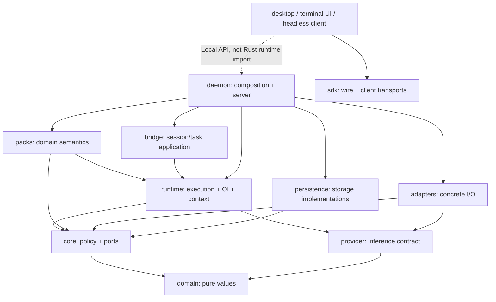
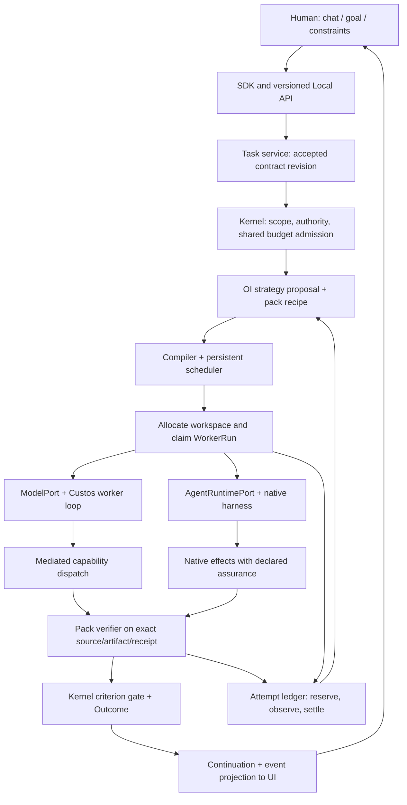
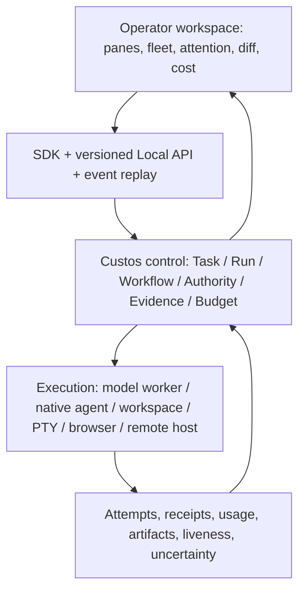
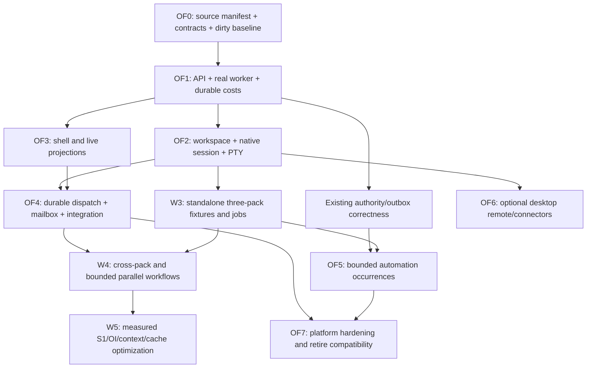
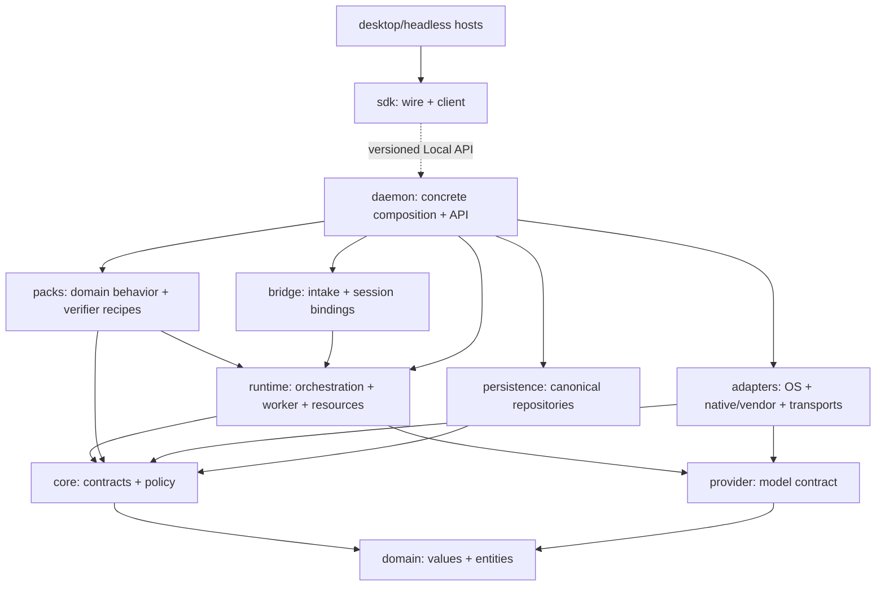
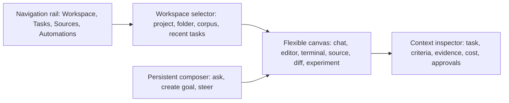
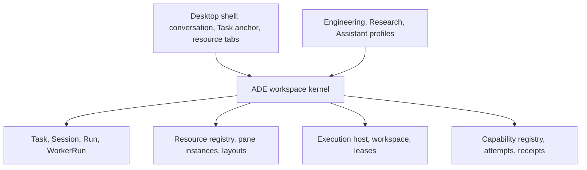

# Kế hoạch refactor Custos SADE và tối ưu chi phí

**Deliverable:** bản kế hoạch kiến trúc và migration để triển khai trên checkout hiện có. Phần 1–10 giữ inventory và các packet R0–R10; phần 11–19 cụ thể hóa execution spine, economics, ba pack, thứ tự tích hợp và nghiệm thu; §20 map đầy đủ nền năng lực OrCa vào chương trình refactor Custos OF0–OF7. Đây là kế hoạch, chưa là chứng nhận refactor đã thực hiện. Không thay source of truth của [Custos.md](../../Custos.md).

**Cách đọc để bắt đầu:** đọc §11 cho quyết định khóa, §12 cho đường chạy và contracts, §13 cho cost core, §14 cho ba miền, §15 cho waves, §16 cho evaluation, §17 cho cách giao packet, §20 cho OrCa foundation, và §23 cho kế hoạch UI chat/workbench. Những chỗ ghi **đích/proposed** chưa phải module hay API đã tồn tại. Tên R/P/OF/C là địa chỉ gói việc hoặc capability track trong tài liệu này, không phải protocol hoặc public enum.

**Bản giao triển khai desktop/headless:** [§21](#21-superplan-kết-hợp-custos-và-orca-cho-desktop-và-headless) chốt strategy tái sử dụng, module map, milestone dependency, migrations, UI/streaming, ba domain và packets đầu. Phạm vi hiện tại loại mobile, push/relay chỉ phục vụ mobile và mobile release pipeline. §21 điều chỉnh thứ tự ưu tiên của §20; OF/R/P vẫn là cùng campaign.

**Crates và lõi OrCa cần chuyển:** [§22](#22-crate-blueprint-và-chuyển-lõi-orca-theo-trách-nhiệm) là bản chi tiết dependency, chia module, transaction boundaries, mailbox fencing, resource integration và nơi phát triển feature tiếp theo. Đọc §22 trước khi di chuyển runtime/adapters/storage hoặc port orchestration source.

**Cây đích và kế hoạch chuyển source:** [SADE–OrCa implementation plan](sade-orca-integration-plan.md) đưa ra cây module đích, extraction ledger theo file OrCa, host-thinning cho `custos-app`, Local API contracts, các wave và sáu PR mở đầu. Kế hoạch này cụ thể hóa §22–24, không thay các quyết định trong master.

**Thiết kế trải nghiệm:** [§23](#23-implement-plan-ui-chat-và-workbench-linh-hoạt) phân loại UI prototype Custos đang làm, surface Orca cần tái sử dụng có chọn lọc và lộ trình hợp nhất thành một workspace có chat, coding và research.

**SADE alignment:** [Design và supervision](../architecture/sade-design-and-supervision.md) defines the product identity. P1–P7 implement the SADE through the existing workspace/runtime architecture, not by adding another shell crate. Include single-owner nested delegation, source-backed S1 assistance and full-route cost/quality ablations in relevant gates. [§24](#24-refactor-lõi-để-custos-thành-sade-và-hấp-thụ-orca-đúng-trách-nhiệm) turns that principle into a core-boundary refactor and OrCa capability map.

**Docs-first implementation plan.** Quyết định sản phẩm nằm ở [master](../../Custos.md); behavior ở [workspace/UI spec](../architecture/agent-workspace-and-ui.md), [skills](../architecture/capability-catalog-and-skills.md), [protocols](../architecture/protocol-and-connectivity-hubs.md), [OI](../architecture/cognitive-fabric-and-orchestration.md). Tài liệu này thay việc suy ra kế hoạch chỉ từ cây folder; chưa chứng nhận code đã di chuyển hoặc runtime đã chạy.

**Upstream comparison:** [OrCa source study](orca-source-study.md) pin SHA và đối chiếu worktree, agent launch, Run/Task/Dispatch, remote, automation và UX với Custos. OrCa đã có durable orchestration; đợt tái cấu trúc này không lấy “có DAG” làm uniqueness claim. Source study là input cho R4/R6/R7/R8, không mở một runtime thứ hai.

## 1. Điểm xuất phát kiểm trong checkout

Đối chiếu ngày 05-10-2026 trên worktree đang có thay đổi chưa commit; các ghi chú ở catalog gắn SHA cũ vẫn là lịch sử, không thay audit hiện tại.

| Hiện có | Nhận định có căn cứ | Việc tiếp theo |
|---|---|---|
| `ui/desktop/src/App.tsx` | React routes studio/providers/chains/telemetry/cache/dashboard/docs/settings | Đặt Workspace thành primary route; các trang quản trị là secondary |
| `ui/desktop/src/context/AppContext.tsx` | State khởi tạo bằng `mockData`, gồm session/provider và actions UI | Tách demo fixtures khỏi backend state; không gọi UI prototype là product completion |
| `ui/cli/src/` | Frontend React/Vite riêng, có API service và task/diff/terminal components | Inventory reusable behavior; không xem đây là Rust CLI |
| `crates/custos-app/{cli,desktop}` | Rust app hosts tồn tại | Chốt entrypoints và giảm desktop host về platform/transport lifecycle |
| `crates/custos-daemon` | `cargo metadata --no-deps --offline` xác nhận workspace member qua path dependency dù không liệt kê trực tiếp trong `members` | Không coi absence trong explicit list là lỗi; audit composition và transport thực |
| Runtime `engine` và `agent` | Có nhiều đường agent/provider tồn tại trong source | Chọn compiled entrypoint, ghi provenance/upstream; không fuse cả hai loop mù |
| `tools/repo_intelligent` + Rust repo modules | Python implementation và worktree changes ở domain/core/runtime/packs | Preserve changes; establish typed conformance trước đổi đường gọi/xóa folder |
| Engineering declarative pack | Manifests/recipes có chỗ đặt thật | Extend cùng pattern cho research/assistant khi implementing; không generate folder rỗng |

Đây là inspection, chưa phải kết quả build/test. Các implementation mock/stub trong protocol cần fail-closed khi vào product path; không trả success mô phỏng mà UI hiểu như external receipt thật.

## 2. Cấu trúc đích: giữ crate boundaries, tổ chức lại bên trong

Không thêm `custos-ade-shell`, `custos-ade-ui`, `custos-gui`, sản phẩm Rook hay microservices chỉ để đặt tên. Những module dưới đây là địa chỉ đích; chỉ tạo khi chuyển trách nhiệm thực và không duplicate existing module.

| Nơi | Chủ đề quản lý | Không đặt ở đây |
|---|---|---|
| `custos-domain` | Pure Task/run/source/effect/evidence/workspace reference values | FS/DB/provider/process calls |
| `custos-core` | Trusted state, scope, authority, budget/completion policy và ports cần thiết | UI, provider concrete, OCR |
| `custos-provider` | Model contract, streaming/usage/capabilities; canonical execution facade theo contract audit | Task authority, credential bypass |
| `custos-runtime` | Worker loop; workflow/OI; context/memory; execution workspace/process coordination | OS concrete và frontend layout |
| `custos-packs` | Engineering/Research/Assistant semantics, task kinds, skills/rubrics | Canonical DB ownership |
| `custos-adapters` | Provider/native harness, fs/Git/PTY/browser/parser/connectors, protocol transport | Goal/permission policy |
| `custos-persistence` | Canonical DB, repositories/migrations, CAS, rebuildable indexes | Model decisions |
| `custos-bridge` | Session/turn→Task binding, application bridge | SQLite production writes/listener ownership |
| `custos-daemon` | Sole concrete composition, API hosting, startup/recovery/shutdown | Pack duplicate logic |
| `custos-sdk` | Client API/events, version negotiation | Linking core runtime/DB into clients |
| `crates/custos-app` | CLI and desktop thin hosts | Second scheduler/composition root |
| `ui/desktop` | Main TS workspace experience and domain views | Mint permits/derive success from transcript |
| `ui/cli` | Existing alternate frontend, compatibility while consolidated | New independent domain runtime |
| `tools/` | Existing development/eval/compatibility tools | Default dumping ground for every new capability |

**Contract decision:** Giữ `ModelPort` canonical tại `custos-provider/src/port.rs` và `AgentRuntimePort` tại `custos-core/src/contracts/harness.rs` trong đợt migration này. Chúng khác semantics; không chuyển trait sang provider chỉ vì muốn tên folder đối xứng. Nếu sau này facade cần re-export, dùng đúng definition, không copy trait. Sửa comment trong `agent/runtime_port.rs` đang trỏ sai sang `custos_provider::AgentRuntimePort` khi làm packet agent.

### Frontend feature boundaries

Within `ui/desktop/src`, target modules are:

- `app/`: routes, shell, composition of presentation providers.
- `features/workspace/`: pane layout, resource references, presets, selection.
- `features/tasks/`: anchors, run timeline, resume/outcome and candidate comparison.
- `features/engineering/`: repo/source/diff/test/browser selection.
- `features/research/`: corpus/PDF/claim/experiment views.
- `features/assistant/`: draft/identity/calendar/automation views.
- `features/connections/`: model/harness/tool connector profiles; no plaintext credential store.
- `shared/api/`: typed SDK facade/event synchronization; adapt generated contracts instead of hand-copying DTOs.
- `shared/ui/`: accessible presentation components; no domain policies.
- `shared/testing/`: explicit demo fixtures and reusable UI test helpers when needed.

Move existing components by actual usage, preserving exports/routes through compatibility re-exports. Prefer one tested feature move at a time over renaming every component. Do not duplicate SettingsModal/provider management across applications. Layout preference and backend state use separate stores.

## 3. Dependency-ordered work packages

| Package | Deliverable | Gate trước bước kế |
|---|---|---|
| P0 — Docs/structure | Master + topic specs + physical/target distinction | Agreed vocabulary and import boundaries; no claims code moved |
| P1 — Runnable workspace spine | Workspace read-only UI + Task/run/events + one real execution path | App→API→worker→source answer→restart/resume; mocks explicitly labeled |
| P2 — Controlled coding | Scope/base hash/permit/effect receipt + diff/test panes | Dirty changes preserved, stale approval rejected, crash reconciliation |
| P3 — Native harness | One adapter with profile and process lifecycle | Steer/cancel/resume where supported, native bypass honestly labeled |
| P4 — Multi-run workspaces | Writer isolation, comparison, integration and shared budget | Same baseline/verifier, conflict handling, no unapproved merge/cleanup |
| P5 — Research | Source parser/coverage/claim + experiment plane UI | Citation support falsification, data versions, reproducibility and compute cap |
| P6 — Assistant | Draft/identity/calendar + fake then real effects/automations | Duplicate/timeout/expiry/revoke/timezone/privacy fixtures |
| P7 — Cross-pack and optimization | Typed handoff; S1/OI rules then calibrated variants | No implicit grant; quality/cost/latency compared against strong single baseline; ledger và baseline instrumentation phải có từ P1, không chờ P7 |

Independent presentation work can run alongside backend work against golden fixtures. Production feature enablement depends on its gate, not on screenshot completion. A large coordinated refactor is possible, but must contain bounded patches and integration checkpoints; no arbitrary month schedule or LOC quota.

## 4. Migration protocol

Each work packet declares current path → target path, symbol/contract consumers, effects and snapshot preconditions, compatibility exports, tests, rollback/roll-forward and catalog delta. Rename-only patch and behavior patch should remain independently reviewable where practical. DB migrations require fixture backup/forward compatibility, not file renames.

Before removing Python Repo Intelligence/tool folder: inventory CLI/MCP/CI callers; prove lexical/symbol/relations/coverage/freshness parity; preserve cache rebuild semantics and data; point consumers to tested replacement; only then remove deprecated entrypoint. No assumption “crate exists ⇒ migrated”. External/model/native agent paths must use same source contracts with honest feature limits.

Before consolidating frontend: inspect both host configs/build scripts, routes and actual API use; port components with smoke tests; preserve installed entrypoints until compatibility is verified. Current `ui/desktop` remains primary target; no root `apps/` rename needed to accomplish it.

Before upstream reuse: pin official namespace/SHA, license/attribution, module/dependency map, security and platform implications, then take a component behind a Custos contract. Orca UI/Electron code is not drop-in Rust/Tauri runtime. Goose-derived source must have an explicit compiled-path/integration status; imported text alone does not mean it powers current Custos.

## 5. Verification and release status

For code packages: `cargo metadata --no-deps`, relevant crate check/tests then workspace checks; frontend's existing package-manager build/test; golden payload/event fixtures; Local API reconnect and cancellation; OS-specific process/browser/worktree tests. Commands must use toolchains declared by this checkout, not speculative new dependencies.

Report implemented/experimental/planned per user job, transport and platform. Spend includes failed candidates, verifier/recovery and unknown usage; track accepted rate, quality, human time and p95 useful output. Shared Task success requires criterion evidence and resolved/explicit uncertain effects, not the number of completed worker processes.

This documentation change completes P0 design deliverables only. Physical source migration and runtime/UI verification remain P1–P7 work; existing uncommitted code changes are preserved rather than counted as completed by this plan.

## 6. Audit code và quyết định giữ/chuyển/hợp nhất

Inspection dưới đây đọc manifests/module declarations và các call sites trọng yếu trên worktree hiện tại. `cargo metadata --no-deps --format-version 1 --offline` chạy thành công: **16 workspace packages**, gồm **12 product packages** (hai app hosts riêng), 3 test packages và xtask. Metadata không phải compilation/test. Catalog cũ nói 11 product crates và Rust CLI cần được đọc như lịch sử, không là package truth hiện tại.

| Source hiện tại | Vấn đề/ranh giới quan sát được | Quyết định migration |
|---|---|---|
| `custos-daemon/src/local_api/lib.rs` | Chứa DTO, client, ProcessTransport và reference `custos_runtime::oi::ExplainReport` | Client/transport + wire DTO chuyển sang SDK; server dispatch giữ daemon; shared report không kéo runtime vào client |
| `custos-runtime/Cargo.toml` | Production dependency `custos-persistence` dù các active paths đọc đã dùng ports | Audit toàn consumers/features; bỏ production dependency khi chứng minh không cần, test concrete storage dùng dev-dependency nếu cần |
| `custos-runtime/src/agent/` | Active module; machine/inference/tool primitives và `GovernedAgentRuntime` | Giữ làm đường agent nội bộ; nâng lifecycle/tool execution theo TaskRuntime, không mount toàn engine |
| `custos-runtime/src/engine/` | Không export trong runtime `lib.rs` | Dormant upstream source; giữ audit/provenance, trích chọn qua replay parity, chưa xóa hoặc bật toàn bộ |
| `custos-provider/src/port.rs` + `types/` | Canonical ModelProvider alias ModelPort và legacy Goose-style types | Giữ canonical facade, map legacy types ở compatibility boundary; không hai public inference contracts phục vụ cùng path |
| `custos-runtime/src/cognitive/skills/{fs,http,process,search}` | Concrete FS/network/process behavior ở runtime; registry/Skill trait dùng bởi packs | Giữ registry/wrappers, đưa concrete I/O qua adapter và core execution ports; tránh adapters import runtime tạo cycle |
| `custos-packs/src/lib.rs` | `create_default_skill_registry()` khởi tạo foundation I/O skills | Pack đăng ký semantics; daemon cung cấp concrete capability implementations cho runtime registry |
| `custos-runtime/src/memory_service/traits.rs` và `context/memory/traits.rs` | Hai `MemoryStore/MemoryTier` definitions giống nhau | Một compatibility definition trong memory_service, path còn lại re-export; public scoped MemoryPort vẫn canonical ở core |
| `custos-runtime/src/context/compiler.rs` + `context/compiler/` | Cùng tên file/folder; mounted code theo Rust declarations, không theo folder size | Kiểm `mod`/`#[path]`, chọn một implementation có parity; không sửa dormant file rồi claim feature đổi |
| `custos-runtime/src/context_management/` và `custos-core/src/context/` | Runtime compaction/model orchestration khác pure context helpers ở core | Giữ pure validation/redaction/helpers khi hợp boundary; gom orchestration dưới runtime context sau parity, không chuyển logic I/O vào core |
| `custos-runtime/src/gateway/gateway.rs` | Route/dispatch/budget facade, không đồng nghĩa authority gateway | Route selection hội tụ OI; effect mediation giữ core policy + runtime dispatch + adapters; compatibility facade không tự grant |
| `custos-domain/core/runtime/src/oi` | Đã có types, hard filters/compiler và candidate/selector/replanner | Giữ phân tách; không tạo `orchestrator`/`sade-brain` thứ hai; `cognitive` hỗ trợ signals/judgment/registry |
| `custos-app/cli/src/main.rs` + `Cargo.toml` | Hiện là Tauri host gọi `cli_lib::run`, không headless Rust CLI; lib có in-memory AppState | Giữ terminal-style UI compatibility; loại duplicate Task truth khi chuyển SDK; headless interface audit Node CLI trước chọn replacement |
| `custos-app/desktop/src/lib.rs` | Tauri template chỉ đăng ký `greet` | Thêm client transport bridge/lifecycle, không coi desktop đã nối execution spine |
| Root `package.json`, lockfiles | Scripts dùng npm/ui-cli; root pnpm importer trống, desktop có pnpm lock; không pnpm-workspace.yaml | Chốt pnpm workspace là target nhưng chưa đổi lockfiles trong plan; chuyển scripts/CI/runners cùng một packet |

Không xóa broad folders vì tên “cũ”. Mỗi DELETE yêu cầu zero production consumers, compatibility window kết thúc, tests và retention/provenance đã xử lý. File present/declared/compiled/wired/verified là năm mức khác nhau.

## 7. Import graph và bề mặt public đích



Diagram là target production dependencies; test dependencies có thể khác. SDK wire types không import runtime/core orchestration; DTO mapping nằm server boundary. Không kéo persistence vào runtime hay SDK vào core để tiện composition.

Public facade nên explicit exports, không `pub use ...::*` làm namespace contract vô hạn. Không xóa glob exports ngay: thêm explicit facade rồi deprecate qua consumers audit. `AgentRuntimePort` giữ core; `ModelPort` giữ provider; workflow/storage/memory/judgment contracts giữ core hiện có. Skill wrapper nhận ports, không concrete adapter.

## 8. Code refactor packets và thứ tự integration

Các R packets làm nền cho P1–P7; mỗi packet có rename/compatibility patch riêng với behavior patch khi có thể. Implementation có thể phối hợp trong một chiến dịch lớn, nhưng integration gates không bỏ.

| Packet | File/module trọng tâm | Thực hiện | Gate cụ thể |
|---|---|---|---|
| R0 — Baseline | root manifests, `lib.rs`, catalog, tests/e2e inventory | Record metadata/import graph, build/test results và dirty manifest trước migration | Baseline failures được ghi; không quy lỗi có sẵn cho refactor |
| R1 — Client/server split | daemon `local_api/lib.rs`; SDK `lib.rs`/wire_types; daemon `api.rs` | Move DTO/client/ProcessTransport vào SDK; daemon re-export compatibility tạm; map ExplainReport sang wire-owned shape | Request/response golden parity, malformed input, process exit/cancel, no runtime dependency client |
| R2 — App state alignment | app hosts `src/lib.rs`; TS API services/AppContext | SDK-backed thin Tauri commands; mock mode explicit; remove parallel in-memory Task truth trên live path | UI sees server IDs/status, reconnect/replay, rejected approval không báo success |
| R3 — Shared execution boundary | runtime skills modules, core ToolGate/SandboxPort, adapters sandbox, pack registry | Delegate concrete effects qua existing ports; tighten missing target/preconditions; daemon inject implementations | Read scope/privacy, path/symlink, cancel, missing permit, no adapter→runtime cycle |
| R4 — One worker path | TaskRuntime, agent/runtime_port, machine/inference/tool, provider | Integrate canonical model worker loop và one native harness path; keep adapter capability-specific | Model pin thật, attempts/tools/errors/cancel; no declared support without execution behavior |
| R5 — Context/memory consolidation | context compiler + context_management + memory_service + core MemoryPort | Select mounted implementations; compatibility adapters; preserve source refs/expiry and propose-not-write semantics | Snapshot stale, privacy, lost-source compaction, temporal update, restart parity |
| R6 — OI/effects consolidation | runtime oi/cognitive/gateway/workflow; core oi/authority | One strategy owner per branch; shared budget reservations/settlement; deterministic scheduler | No double dispatch/decomposition, uncertain reconcile, policy/pin limits, replan cap |
| R7 — Execution resources | runtime workflow + adapters harness/sandbox/fs/Git; domain workspace refs | Worktree/process ownership, candidate runs, integration intents; add resource modules only when implemented | Dirty main preserved, writer conflict, same baseline, cleanup ownership, merge effect check |
| R8 — Domain product features | packs engineering/research/assistant + declarative recipes + UI features | Move domain behavior not foundations; source-aware verifiers, AI/Data experiment and Assistant drafts/effects | Domain-specific acceptance and cross-pack no implicit grant |
| R9 — JS workspace/tooling | root package scripts, both UI manifests/locks, Tauri runners/configs, CI | One pnpm workspace if selected target; preserve command compatibility; prune old locks only after install/build verified | Frozen install + both UI builds + host assets/entrypoint paths |
| R10 — Retire compatibility | exports/shims, dormant source manifest, tools consumers | Remove only proven unused duplicate implementations, old API paths and deprecated entrypoints | rg consumers + metadata + builds/test parity; upstream notices retained |

R1→R2/R3; R3→R4; R4→R6/R7; R5 supports R4/R8 context; R7→candidate comparison; R8 can develop views against fixtures in parallel but live enablement needs corresponding backend gate. R9 independent of semantic refactor except app/runners coordination. R10 last. Không refactor directory tree, transport, worker loop và DB schema trong một opaque diff.

### R4 không được bỏ qua

`GovernedAgentRuntime` hiện tạo intents từ một `generate` response; method không tự chứng minh full multi-turn tool loop/steer/cancel. Profile declares hỗ trợ không đủ. `CustosRuntime::bootstrap` hiện chọn FakeProvider, và source `main.rs` dispatch qua `local_api`; cần trace caller để chứng minh workflow field thật được sử dụng. Startup hiện bỏ return của `reconcile_on_startup`; kế hoạch cần typed startup failure handling, không tự claim reconciliation thành công.

R4 phải test: requested model khác provider ID; source-taint không biến thành instruction authority; missing/unknown tool target không được default rồi dispatch; response có tool calls thực qua effect pipeline; cancel/steer xảy ra khi run đang hoạt động; native hidden children không tự có Custos grants.

**OrCa-derived contract additions:** R4 ghi `requested_mode/actual_mode`, host capability, prompt delivery và `start_unknown`; chỉ fallback structured→terminal khi adapter chứng minh create bị từ chối trước commit. R6 tách scheduler claim, agent-reported completion và pack criterion gate; có đúng một graph owner cho mỗi nhánh. R7 quản lý host/worktree/PTY/process theo owner, resource release/retention và remote `unverifiable`; không coi worktree là sandbox. R8 hiển thị Task outcome xuyên ba pack chứ không tái dùng OrCa worktree ID làm root cho Research/Assistant. Các behavior này cần golden receipts và crash fixtures trước khi đổi live path.

## 9. Địa chỉ feature mới và nguyên tắc tăng trưởng

Target module addresses sau đây chỉ tạo khi có implementation; tận dụng existing module trước, không thêm crate:

| Feature | Runtime coordination | Domain semantics | Concrete implementation | UI |
|---|---|---|---|---|
| Repo Intelligence | `context/repo_intelligence` | packs `engineering` | adapters parser/Git/fs; persistence index | `features/engineering` |
| Worktrees/PTY/browser | workflow-managed resources, proposed `runtime/src/workspace/` khi cần | Engineering task/evidence obligations | proposed adapters `workspace/` + existing harness/sandbox | workspace + engineering panes |
| Research source/corpus/experiment | context/memory + workflow/run resources | packs `research` | parser/browser/dataset/process/GPU adapters | `features/research` |
| Assistant identity/draft/automation | workflow/continuation + trigger execution | packs `assistant` | contacts/calendar/mail/notification adapters | `features/assistant` |
| S1 scouts/micro-workers | existing `cognitive/s1` + worker path + OI | per-pack source/rubric | judgment/inference/capability adapters | task inspector, not new mandatory screen |
| Cost optimization | OI estimator/selector + attempt ledger/runtime | per-pack quality/freshness constraints | provider usage/cache features | run cost/unknown + choice card |

MCP exposes selected capability contracts; A2A only remote delegation; ACP/native runtime integrations declare actual capabilities. Không có `mcp/skills` canonical business logic copy. New feature checklist: source/contracts→scope/effects→capability availability→pack rubric→worker routes→verifier→UI view→fixtures/catalog.

## 10. Research rationale và kiểm chứng

- [Cargo workspaces](https://doc.rust-lang.org/cargo/reference/workspaces.html) giải thích path dependencies có thể tự thành members: kiểm metadata thay đếm folder/explicit list.
- [Tauri architecture](https://v2.tauri.app/concept/architecture/) phân biệt frontend/Rust host; việc đặt Task authority ở daemon riêng là quyết định Custos, không phải requirement của Tauri.
- [Goose upstream](https://github.com/aaif-goose/goose) là nguồn pattern/retained code có provenance; không chứng minh dormant engine của Custos đã được wire.
- [SADE research/design](../architecture/sade-design-and-supervision.md) và [protocol boundary](../architecture/protocol-and-connectivity-hubs.md) giải thích lý do giữ native reasoning, một orchestration owner và cost/assurance theo path.

Kết quả inspection lượt này: metadata pass, source/manifest/module review; chưa chạy compilation, e2e hoặc frontend build. Commands khi implementing: `cargo check -p custos-sdk`, `cargo test -p custos-tests-contract`, chọn relevant `custos-tests-e2e` test targets, rồi workspace check. SDK feature variants, host builds từng OS và UI build theo package-manager đã chốt cũng là gates; metadata không thay được chúng.

Done của tái cấu trúc không phải hết folder cũ: một live path app/headless→SDK→daemon→TaskRuntime→model/native worker→scoped capabilities→domain verifier→persisted outcome/resume, với import graph đúng, cost/unknown trung thực và không phá các entrypoints cần compatibility.

## 11. Quyết định khóa cho chiến dịch SADE

Custos là **Supervised Agent Development Environment cho Coding, Research và Assistant**, local-first, hỗ trợ cả model API/local inference và agent runtime của người dùng. Mục tiêu kinh tế là đạt criterion với tổng chi phí hợp lý dưới constraints của user. Chất lượng, scope, privacy, model pin và required verification là constraints trước khi so giá.

Các quyết định sau là cơ sở của mọi packet:

1. **Một execution spine:** mọi run production đi qua accepted Task revision, resource allocation, attempt, verifier, persisted outcome và continuation. `start_run` có nghĩa bắt đầu execution đã được admit; field `Active` riêng lẻ không là bằng chứng worker đã chạy.
2. **Một owner orchestration mỗi nhánh:** Custos quản lý graph bên ngoài; S2/native harness giữ reasoning/tool loop bên trong worker. Native children chỉ được nhập vào graph khi adapter có identity/events và conformance tương ứng.
3. **Hai execution paths ngang hàng:** model inference + Custos worker loop, hoặc native harness. Chọn theo capability, user pin và evidence; không cố chuyển harness thành model API hoặc ép local coder thành S1.
4. **Economics bắt đầu ở attempt đầu tiên:** budget admission và usage attribution có ngay trên single-worker path. S1, fan-out, candidate comparison và routing học máy là các lever bật sau baseline.
5. **Ba pack là semantics, không ba engine:** dùng chung lifecycle/context/budget/resources nhưng có task kinds, artifact, rubric và verifier riêng. Người dùng có thể dùng trọn một pack độc lập.
6. **Supervision theo quyết định:** chat/steer/pause/stop/resume luôn truy cập được; exact approval xuất hiện khi effect cần nó. Không yêu cầu user điều hành từng scout/tool call trong standing scope.
7. **Trạng thái truthful:** observation, authorization, dispatch, external outcome và criterion pass được ghi riêng. Source hoặc metadata do worker cung cấp phải được đối chiếu trước acceptance.
8. **Refactor theo behavior và consumers:** giữ các module có ích, migrate compiled paths, rồi retire compatibility sau conformance. Không dùng việc đổi folder hoặc tạo crate như thước đo tiến độ sản phẩm.

### 11.1 Khoảng trống mới xác minh bằng source

| Source hiện tại | Quan sát | Gate refactor bắt buộc |
|---|---|---|
| [`daemon/api.rs`](../../crates/custos-daemon/src/api.rs), [`runtime.rs`](../../crates/custos-daemon/src/runtime.rs) | Dispatcher nhận TaskService/SessionManager/BridgeService, không nhận WorkflowPort; bootstrap xây workflow bằng FakeProvider và không inject harness | Trace command start/stop/resume tới worker thật; fake chỉ trong test/demo được khai báo; startup reconcile error được xử lý |
| [`workflow/task_runtime.rs`](../../crates/custos-runtime/src/workflow/task_runtime.rs) | Ports optional; run có thể Active khi không có executor; harness nhận context rỗng; model fallback bỏ response; non-mediated intent có thể được ghi Succeeded | Required dependencies được validate theo execution mode; persist output/events/usage; native observation không tự thành external success |
| [`workflow/worker_executor.rs`](../../crates/custos-runtime/src/workflow/worker_executor.rs) | Trả payload simulated, token/cost cố định và status Sufficient | Production dispatch gọi worker thật; simulator có namespace test/demo và không đủ quyền pass criterion |
| [`contracts/harness.rs`](../../crates/custos-core/src/contracts/harness.rs), [`agent/runtime_port.rs`](../../crates/custos-runtime/src/agent/runtime_port.rs) | Default cancel/steer trả Ok; profile có thể báo hỗ trợ dù method chưa thực thi; model được điền bằng provider ID | Unsupported explicit; requested model khác provider ID; cancel accepted khác stopped observed; capability tests theo adapter |
| [`domain/budget.rs`](../../crates/custos-domain/src/budget.rs), [`kernel/budget.rs`](../../crates/custos-core/src/kernel/budget.rs) | `max_cost_cents` tồn tại nhưng reserve/settle hiện kiểm spans/tokens; reservations của governor ở memory | Quota tiền và tài nguyên được admit thật; settle bằng reservation identity; durable crash/concurrency semantics; overage không trừ nhầm reservation khác |
| [`gateway/budget/tracker.rs`](../../crates/custos-runtime/src/gateway/budget/tracker.rs), [`0004_usage.sql`](../../crates/custos-persistence/migrations/0004_usage.sql) | Tracker memory và ledger SQL cùng tồn tại; chưa chứng minh wired durable accounting | SQLite canonical, memory projection; dedup attempt, restart, late/unknown usage và parent rollup không double-count |
| [`oi/candidate_builder.rs`](../../crates/custos-runtime/src/oi/candidate_builder.rs), [`estimator.rs`](../../crates/custos-runtime/src/oi/estimator.rs), [`selector.rs`](../../crates/custos-runtime/src/oi/selector.rs) | Candidate list không dùng snapshot, giá/latency hardcoded theo harness; selector lấy candidate admissible đầu tiên | Availability/pin/scope trước selection; estimate là unknown/range có provenance; không gọi heuristics này calibrated optimizer |
| [`research/verifiers/citation_coverage_oracle.rs`](../../crates/custos-packs/src/research/verifiers/citation_coverage_oracle.rs) | Missing verified flag mặc định theo citation không rỗng; metadata boolean được tin | Locator/source revision và semantic assessment record; fabricated DOI/verified metadata không pass; coverage chỉ là metric |
| [`assistant/verifiers/user_acceptance_oracle.rs`](../../crates/custos-packs/src/assistant/verifiers/user_acceptance_oracle.rs) | Kiểm nonempty approval token/digest từ metadata; không kiểm canonical permit/current payload/external receipt | Approval validation trước dispatch; effect verification sau dispatch; user acceptance không chứng minh sent |
| [`engineering/verifiers/cargo_test_oracle.rs`](../../crates/custos-packs/src/engineering/verifiers/cargo_test_oracle.rs) | Exit success tạo PackVerifier Pass cho cargo test | Pass giới hạn vào command/test criterion và snapshot; behavior acceptance cần test mapping/trusted baseline/review |

Các nhận định là source inspection, chưa phải kết luận mọi production call path có thể bị khai thác. Existing tests dùng fake/simulator hữu ích cho mechanics, nhưng không chứng minh native task completion hay economics. Không xóa tests đó; phân loại và bổ sung negative/real execution fixtures.

## 12. Đường chạy, contracts và resource lifecycle



Context/source acquisition nằm trong scope trước prompt assembly; external acquisition có egress/capability checks của chính nó. Native effect không intercept được đi đường assurance riêng; sơ đồ không ngụ ý Custos ký permit cho mọi native tool.

### 12.1 Contracts cần gia cố, không tạo hệ type song song

| Contract hiện hữu | Thông tin đích tối thiểu | Quy tắc |
|---|---|---|
| TaskContract / revisions | Goal, pack obligations, criteria, read/write/privacy scope, requested provider/model/harness, resource budgets, approval profile | Audit current fields và consumers trước migration; không lấy default fixture budget làm user consent |
| WorkflowRevision / RevisionNode | Typed input/output refs, dependencies, scope, role, worker profile, read/write set, resource allocation, verifier obligations | Extend existing types/version; compile một lần mỗi revision; retry không tự tạo graph mới |
| Run / WorkerRun | Parent Task/run/node, attempt identity, graph/policy version, execution workspace, requested/actual executor | Operational state khác criterion; reservation thuộc attempt cụ thể |
| AgentRuntimePort / HarnessProfile | Start outcome, session/process identity, event/usage support, cancel/steer/resume/children visibility, workspace owner | Defaults unsupported; một harness không bị quảng cáo feature của harness khác |
| ActionIntent / permit / effect / receipt | Exact canonical target/payload, preconditions, command/attempt, dispatch claim, observed result | Receipt không đủ freshness/identity thì unknown; kiểm account/connector version khi cần |
| Evidence / VerificationContext | Criterion, source/artifact revision, method/environment, assertion, reviewer, dependency refs, pass/fail/unknown/stale | Không tin actor-provided `verified=true`; approval và waiver không thành receipt |
| ContinuationPacket / events | Decisions, remaining criteria, artifacts, pending/uncertain effects, remaining reserved/spent, event cursor | Revalidate source/resource/connector; không chuyển usable permit hoặc hidden native state giả |

Đây là field obligations của design; schema migration phải dùng existing contracts, golden fixtures và conformance. Không claim đã có tất cả fields ở checkout.

### 12.2 Hai đường worker

**Model API/local coder:** accepted worker input → ContextPack/selected skill → model stream → normalize text/tool proposals → mediated capability dispatch → tool result vào conversation → bounded next inference → artifact/verifier. Hết turn mà còn tool request không được ghi worker completed. Đường này tận dụng active agent primitives; Goose-derived `engine/` chỉ lấy module đã map provenance và replay parity, không mount toàn bộ nguồn dormant.

**Native coding/research/assistant harness:** handshake → allocate/attach workspace → record launch attempt → deliver prompt/context bằng feature thật → observe session/events/artifacts/usage → stop/steer/resume nếu supported → Custos verifier. OI kiểm soát outer scope và allocation, không viết lại reasoning loop của harness. Native effect telemetry thiếu thì ghi coverage/unknown; native usage unknown không hiện $0.

Lifecycle phải xử lý `prepared → committing → started | refused | unknown`, cancellation requested khác process stopped, và host unavailable khác worker exited. Adapter chỉ fallback khi chứng minh operation trước chưa commit. Một process ID có thể tái sử dụng: reconcile bằng identity/lifetime của adapter, không PID đơn lẻ. Control methods idempotent theo command ID và ownership.

### 12.3 ExecutionWorkspace dùng chung, resource theo miền

Workspace reference giữ host/type, base source revisions, ownership/lease, reader/writer scope, active processes, artifact refs, isolation profile và release status. User workspace/pane layout giữ riêng khỏi execution resource.

| Miền | Resource allocation | Integration / cleanup |
|---|---|---|
| Coding | Read-only snapshot; one-writer scoped checkout hoặc isolated worktree; concurrent writers có branch/worktree riêng cùng base + dirty manifest | Apply/merge là effect riêng; check stale/conflict và verify integrated snapshot; không tự xóa external/dirty worktree |
| Research | Corpus version, dataset split, experiment output directory, kernel/job/compute handle | Artifact và logs có source/env/config/seed; hủy job có receipt; giữ checkpoint/data theo retention; GPU job unknown được đối soát |
| Assistant | Account/connector identity, contacts/calendar snapshot, draft/outbox refs | Revalidate account/recipient/payload/timezone; cancel automation chặn future triggers nhưng không đảo ngược sent message |

Persist allocation/claim trước launch, observe host sau launch, release sau stop/export/retention decision. Crash giữa các bước tạo resource uncertainty; không tự tạo lại rồi làm mất dấu workspace/job trước.

## 13. Cost core: policy, estimator, ledger và projections

### 13.1 Bài toán tối ưu có constraints

Với tập strategy admissible, ưu tiên strategy có **expected total resource cost** thấp hơn khi criterion quality, latency target và constraints còn đạt. Khi dữ liệu chất lượng chưa đủ, dùng user-pinned baseline hoặc explicit tradeoff; không bịa probability. Quality floor là nghĩa của criterion/rubric; empirical noninferiority là gate policy ở population, không bảo đảm từng Task.

```text
candidate_total = acquisition/indexing + planning/judgments + execution attempts
                + handoff + integration + required verification + expected recovery

available_execution = task_ceiling - observed_spend - outstanding_reservations
                    - verification_and_recovery_reserve
```

Các thành phần biểu diễn theo từng resource; chỉ cộng thành tiền khi unit/pricing source nhất quán. Retry/replan là attribution của attempt, không thêm khoản trùng vào total. Predicted recovery dùng history cùng slice hoặc range unknown; không có history thì chưa có calibrated estimator.

Human chọn priority Economical/Balanced/Quality-first và deadline trong scope, cùng pin riêng. Economical không waive criterion; Quality-first không nới budget. Một native subscription có marginal API bill không xác định: hiển thị subscription/profile/quota observation riêng, không convert thành free execution và không giả có billed price per token.

### 13.2 Bốn responsibilities và địa chỉ

| Responsibility | Nơi hiện hữu cần gia cố | Dữ liệu / test |
|---|---|---|
| Budget admission policy | domain `budget.rs`, core `kernel/budget.rs`, existing contracts/storage ports | Reservation cho từng attempt; money/tokens/time/calls/workers/compute khi applicable; reserve đồng thời không oversubscribe |
| Estimate/select route | runtime `oi/{candidate_builder,estimator,selector}.rs`, `cognitive/` | Availability và hard filter trước costing; pricing/profile version; cold/warm cache, transfer, verification, whole topology overhead; calibrated range hoặc unknown |
| Durable accounting | persistence `0004_usage.sql` và repository/storage ports, versioned migration khi cần | Canonical attempt ledger + reservations; known/estimated/unknown; update dedup; late usage/crash reconciliation |
| Projection / user controls | runtime `gateway/budget/tracker.rs` như rebuildable cache; SDK/API; UI Task inspector | Task/run/worker attribution; budget còn lại/spent/reserved; estimates tách billed; không có ledger thứ hai |

Dùng integer fixed units phù hợp cho canonical money và checked arithmetic; không dùng f32 running totals làm billing truth. Giá/đơn vị/currency/version lưu cùng usage; không đổi lịch sử bill khi pricing catalog cập nhật. Worker quota là allocation từ shared Task budget; parent rollup cộng leaf attempts một lần, không cộng cả child subtotal lần nữa.

### 13.3 Reserve / dispatch / settle đúng identity

1. Kernel kiểm Task/policy revision, capability, scope và headroom; persistence claim reservation idempotent theo attempt/command. Các reservation đang outstanding của worker khác đều được tính.
2. Resource/launch/model attempt được dispatch ngoài DB transaction. Reservation commit không đồng nghĩa external operation đã xảy ra.
3. Usage/receipt được observe và upsert có causal identity. Provider progress counter dùng update/delta đúng semantics, không cộng cumulative counter mỗi event.
4. Settle **giải phóng đúng phần reserved của token đó**, ghi actual của chính attempt. Actual vượt reservation tạo overage và block future admission theo policy; không lấy reservation của worker khác để bù.
5. Refused trước commit có thể release; crash/timeout sau possible dispatch giữ unknown exposure tới reconcile. TTL không là bằng chứng zero bill; không refund unknown usage như chưa gọi.
6. Verify/recovery headroom được giữ riêng. Khi budget gần hết, ưu tiên checkpoint, required verification còn khả thi và reconciliation; nếu không đủ báo limited, không pass hoặc lặp không giới hạn.

Mediated model path có thể chặn new attempts, output limit, timeout và max calls. Không thể hứa hard final invoice cap nếu provider trả usage muộn hoặc native harness tự gọi model ngoài boundary; ghi mức enforcement theo path và conservative exposure. User vẫn thấy số tiền rõ; coarse worker headroom chỉ là prompt signal.

### 13.4 Thứ tự bật cost levers

| Lever | Tối ưu cụ thể | Điều kiện bật / false economy cần kiểm |
|---|---|---|
| Deterministic work | Exact query, hash/units/timezone, dependency ready checks | Correct fixtures; local compute cost/latency vẫn có |
| Incremental indexes | Chỉ re-index changed files/pages/splits; scoped inventory | Rebuild/invalidation/coverage; index startup amortization riêng cold/warm |
| Selective context | Lexical/symbol/FTS trước, expand capped, raw spans truy hồi được | Source recall/claim support không giảm; native tools không bị chặn bởi summary |
| Tool-result bounds | Pagination, structured data, artifact refs thay nguyên log | Omissions và pagination visible; important failing output giữ source |
| Provider prefix cache | Stable prefix/version/privacy, backend capability thật | Giá read/write/break-even theo backend; no assumed cache sharing cross-provider |
| Evidence reuse | Unchanged dependencies, verifier/environment version tương thích | Invalidates đúng dependent criterion; required regression vẫn chạy |
| S1 assists | Source/test scouts, screening/extraction/time candidates | Savings trừ S1 overhead/fallback/rework; abstain; calibration per job |
| Model route / effort | Chọn executor hoặc effort theo allowed profile | Pin/consent; response preference chưa đủ chứng minh multi-step Task quality |
| Parallel / candidates | Independent reads/experiments hoặc disjoint writers | Whole cost gồm failed candidates/integration; cap fan-out; quality gate trước ranking |
| Batch / local inference | Deadline cho phép; compute/privacy phù hợp | User resource cap; cancellation/availability; không ép lên Assist hot path |

Các lever dùng chung ba pack; pack cung cấp feature/rubric/freshness, không có ba cost engines. Bật theo measured task slice, không cộng phần trăm tiết kiệm từng lever. Cache deterministic parse/retrieval khác semantic answer cache: response semantic chỉ read-only với equivalence/freshness kiểm được; patch/permit/send không replay từ cache.

### 13.5 OI, S1, S2 và Meta phối hợp

OI lập candidate từ Task/resource capability và pack features: coupling, shared context, write overlap, source breadth, verifier coverage, cache continuity, latency/deadline và compute. Hard filter trước; D0 rules có thể đủ. D1/D2 planning là investment riêng có reservation; chỉ replan khi evidence material làm future graph sai.

S1 Judge/Scout/MicroExecutor có task input, source refs, max calls/time/cost, output rubric và abstain. Scout trong worktree không tự là writer. Transform hẹp opt-in cần apply policy và độc lập check; S2 giữ refactor/diagnosis/synthesis sâu. S1 hints không nâng thành policy hoặc pass vì confidence cao. S2 có thể truy hồi source ngoài hint trong scope; stop rule dựa missing criterion/progress/cap, không confidence tự báo.

Meta offline dùng accepted/failed/unknown labels và redacted traces, split held-out theo repo/corpus/user/time để tránh leakage. Kết quả là pricing/estimation calibration và route-policy proposal có slice/version; publish policy future runs qua release controls. Không auto-learn credentials, personal preference từ untrusted source hoặc đổi route của Task đang chạy.

## 14. Blueprint ba pack để giao implementation

Đặc tả behavior đầy đủ nằm ở [domain packs](../architecture/domain-packs-and-workflows.md). Bảng sau khóa phạm vi product và chỉ ra phần tái dùng/shared so với module miền; mỗi pack có đường model và native harness khi capability phù hợp.

### 14.1 Coding / Engineering

| Job | Flow và artifacts | Acceptance / economical default |
|---|---|---|
| Repo explain / review | Snapshot/query → anchored answer/finding, severity và limitations | Anchor/version/repro khi applicable; read-only direct hoặc one reader; không worktree bắt buộc |
| Debug / bugfix | Symptoms → hypotheses/reproducer → patch → targeted + required regression → outcome | Hypothesis khác verified cause; trusted behavior checks; single strong worker + optional scout |
| Feature / UI | Behavior/API spec → implementation → behavior/browser checks → diff | Acceptance behavior, accessibility/platform khi scope yêu cầu; browser inspect/act permissions riêng |
| Refactor / migration | Invariants/interface/data plan → bounded edits → parity/compatibility → integration | Many files không đủ lý do split; rollback/roll-forward dữ liệu theo criterion; required suite độc lập |
| Compare candidates | Shared base/criteria/total budget → candidate branches → same verifier → chosen integration | Failed candidates còn trong cost; chọn candidate không tự approve merge |

Nền dùng lại: Repo Intelligence ở runtime/context và domain/core repo contracts; AST/git/test skills ở engineering; exact I/O qua adapters; trusted verification metadata ở core/persistence. Python indexer migrate sau parity source/coverage/CLI/MCP, không xóa tools trước.

Work packet Engineering đầu: `repo_explain` thật + one-writer bugfix có failing reproducer, dirty-main preservation, anchored diff, test mapping, base-check apply và restart. Packet parallel writes chỉ sau one-writer gate; interface coupling/integration do whole Task quản lý.

### 14.2 Research phục vụ programming, AI và Data

| Job | Flow và artifacts | Acceptance / economical default |
|---|---|---|
| Source QA / paper read | Source/version → parser coverage/spans → PaperCard/answer | Locator + extraction + support records; single source không fan-out mặc định |
| Compare / literature map | Inclusion/search ledger → dedup → readers → claim/conflict matrix → brief | Coverage theo corpus đã nêu, primary source/version; unknown không thành zero contradiction |
| Dataset audit / evaluation design | Data version/license/split → inspect statistics/leakage → DatasetCard/eval plan | Units/sample/split correctness, train/test leakage checks; sample trước scan lớn khi criterion cho phép |
| Reproduce / ablate | Selected claim → experiment protocol → code/env/data/model/config/seed → compute job → metrics | Baseline/metric/version consistent; interval/repeats theo protocol; result không match paper vẫn là finding hợp lệ |
| Research → engineering | Selected supported claims + caveats → EngineeringBrief/spec | Human intent hoặc agreed requirements; no automatic claim→requirement / read→write permission |

Nguồn và experimental evidence đi cùng một ledger dependency nhưng không cùng verifier. LLM citation assessor giúp triage, không thay parsing/unit checks/trusted calculation/human review khi consequential. `doi_verify` chỉ xác nhận bibliographic locator theo adapter thật; không chứng minh algorithm đúng. Không ép notebook/figure-only output có experiment đầy đủ nếu job chỉ QA.

Execution resource có dataset refs, pinned environment, compute/time/network caps, kernel/job ownership và result lineage. Persistent kernel là tối ưu có version/memory/isolation limits; không giữ process/loaded dataset mãi hoặc đưa dữ liệu lớn lên cloud chỉ để summarise. Research UI mở source/claim và code/config/metric/figure cạnh nhau.

### 14.3 Assistant và bounded automation

| Job | Flow và artifacts | Acceptance / economical default |
|---|---|---|
| Personal QA / briefing | Scoped notes/tasks/calendar → answer + timestamp | Permission/temporal source đúng; small context, deterministic retrieval trước |
| Inbox triage / drafting | Scoped inbox → classification/draft + identity candidates | Draft status rõ, no send inference; S1 triage calibrated + S2 nuanced draft |
| Schedule proposal | Accounts/attendees/windows → timezone/availability preflight → options | DST/freshness/timezone chính xác; confirm ambiguity thay guessing |
| Send / create / update | Exact account/recipient/payload → grant/permit/outbox → receipt/post-read | Approval validation khác success; timeout→uncertain, no blind duplicate |
| Recurring automation | Trigger occurrence → bounded Task/Run → draft or allowed effect → per-run history | Idempotent occurrence; grant expiry/revoke/max runs, per-run và aggregate budget; overlap/missed-run policy |

Jarvis-like experience đến từ continuity, proactive suggestions và coherent controls. Ambient unrestricted execution không là autonomy level của Custos. Presence không là authority: offline chỉ chạy within standing grant. Trusted contact riêng lẻ không đủ authorize mọi nội dung/attachment; grant bind account, effect class, targets, content policy và lifetime.

Packet đầu là contacts/draft/schedule read-only + fake connector mô phỏng post-send timeout/duplicate/changed payload. Real outbound connector chỉ bật sau effect/lifecycle conformance. Claim `sent` cần server identity/receipt hoặc reconcile, không boolean approval.

### 14.4 Signature flow và giới hạn composition

`ResearchBrief(selected claims) → experiment findings → EngineeringSpec → accepted patch summary → AssistantDraft → separately authorized send`. Một Task tổng chỉ khi cùng goal; standalone pack không bị phạt overhead. Handoff giữ typed artifact/version/source/redaction/consumer scope; không copy full private corpus hoặc grants. Parent acceptance gắn criteria từng obligation; một pack pass không che pack khác unknown/uncertain.

## 15. Thứ tự waves và gates tích hợp

Waves định dependency, không lịch cố định và không thay R0–R10/P1–P7. Một refactor lớn có thể gom nhiều packets trong branch integration, nhưng vẫn có runnable checkpoint và reviewable diffs.

| Wave | Existing packets | Deliverable / exit gate |
|---|---|---|
| W0 — Baseline và contracts | R0, contract portions R4/R6, P0 | Record dirty/source/test baseline; agreed IDs/lifecycle/usage/evidence golden fixtures; all simulator paths identified |
| W1 — Live single worker + economics | R1/R3/R4, minimal R5/R6; P1/P2 | Headless API thật gọi one model loop, text/artifact/usage persisted; reserve/settle và verifier; restart/cancel; no Active without executor; read-only desktop có thể làm song song |
| W2 — Native harness và workspaces | Native R4 + R7; P3/P4 nền | One native harness launch/observe/stop conformance; workspace/source/host owner; unknown start/stop no double launch; one-writer patch/integration verified |
| W3 — Three standalone domain jobs | R8 + R2; P5/P6, Coding extension | Coding bugfix/refactor; Research source QA + small experiment; Assistant draft + fake then real effect; mỗi job có own domain acceptance/cost |
| W4 — Bounded coordination / cross-pack | Remaining R6/R7/R8; P4/P7 | Typed scheduler persistence/claim/cancel/replan; parallel readers, disjoint writes + integration, signature handoff with separate authority |
| W5 — Optimize and retire | R5 completion/R9/R10; P7 optimization | Paired lever-by-lever eval + held-out policy; measured gate enables per slice; compatibility retired by consumer checks; locks/commands migrate coherently |

UI workspace/scoped panes có thể được xây từ W1 qua events/golden fixtures; production badge chỉ bật khi backend gate tương ứng pass. Research/Assistant schemas/fixtures/views có thể triển khai độc lập trong W1/W2, nhưng effect enablement cần durable spine. Remote host, mobile, full browser automation, A2A federation và custom inference acceleration có packets sau local gates, không prerequisites cho SADE core.

**Checkpoint W1 cụ thể:** `CreateTask → StartRun → compile scoped repo context → selected model stream → anchored answer → known/estimated/unknown usage → criterion record → Outcome → daemon restart → same Task/source revalidation`. Sau đó thử patch/tool loop. Đây là kiểm chứng sản phẩm tối thiểu, không chỉ lifecycle fake.

**Checkpoint W3:** từ một desktop shell có thể thực hiện ba job độc lập trên cùng API/status/controls: fix nhỏ có behavior test, paper QA có wrong-citation rejection, draft/send có ambiguous contact và uncertain receipt. Không chờ multiagent mới gọi sản phẩm là SADE.

## 16. Evaluation và release gate không tự chứng minh

Suite design ở [`evals/oi/README.md`](../../evals/oi/README.md) tách simulator/contract tests khỏi real task quality. [Agent eval guidance](https://www.anthropic.com/engineering/demystifying-evals-for-ai-agents) nhấn mạnh outcome grading và phối hợp automated/human checks; Custos chọn tiêu chí cụ thể dưới đây.

| Slice | Same-condition baseline | Primary outcome | Cost/latency/control checks |
|---|---|---|---|
| Coding | Same model/harness, repo dirty snapshot, toolchain, required verifier | Accepted behavior/parity; regression/false pass, review findings | All candidates/retries/integration costs, human review minutes, unauthorized write, p95 useful output |
| Research | Same corpus/date/version, source access, compute and rubric | Supported-claim precision + coverage; reproducibility/metric integrity for experiment jobs | Cost per accepted brief / supported claim with coverage, parse gaps, reviewer minutes, compute spend |
| Assistant | Same contacts/accounts/calendar snapshot, connector semantics, grant | Correct identity/payload/time/effect status; duplicates/false-sent | Draft and effect costs separately, approval comprehension, private egress, unknown resolution |
| Cross-pack | Equivalent separate-tool/manual workflow on same selected inputs | Combined criteria and provenance/redaction/authority intact | Total billed/estimated/unknown, handoff effort, resume correctness |

Ablation matrix: pinned direct baseline → selective context/index → cache (cold/warm split) → S1 assist → rules topology → calibrated routing. Cumulative và individual toggles để thấy interaction; paired tasks repeated khi stochastic/flaky. Pin harness/model/tool/parser/policy/verifier versions, hardware, deadlines và cache conditions. Native full cost unavailable thì không báo percent billed saving; report coverage/observed spend/quota proxy và limitation.

Quality margin `delta_pack` và minimum practically useful saving/latency target được ghi **trước** run suite. Report confidence interval của quality difference và cost difference; sample nhỏ chỉ smoke/inconclusive. Không dùng mặc định 20% saving hay 95% source recall làm theorem. Không chọn thresholds sau nhìn kết quả; zero accepted tasks báo undefined ratio và total failures/spend. False-pass/unauthorized/duplicate/wrong-recipient observed counts giữ riêng; zero trong fixture không chứng minh zero ngoài production.

Required falsification cases: missing executor; fake/simulator on production; provider ID≠model; default-success cancel; duplicate/unknown launch; settlement twice/actual>reserved/two workers/restart/late usage; source stale; agent edits test; good URL unsupported claim; metadata `verified=true`; forged approval token; payload/account drift; send timeout; trigger replay; connector revoked; OI cheap route outside pin; native effects missing observation; compaction loses critical caveat.

UX nằm trong acceptance: user hiểu actual executor/egress/cost/approval/unknown, resume đúng Task, thao tác steer/cancel có feedback, accessibility của status và navigation. UI screenshot đẹp không chứng minh execution; execution correct cũng chưa chứng minh user quản lý được.

## 17. Giao packet cho coding agents và integration

Mỗi RefactorWorkPacket phải có: objective/user job; wave/R/P refs; base SHA + dirty manifest; exact read/write sets; touched contracts/consumers; existing vs target paths; dependencies; source/authority/data migrations; failure semantics; test commands; compatibility export; rollback/roll-forward; expected docs/catalog delta; evidence để kết luận done.

Một packet có một behavior outcome. Các task parallel tốt là SDK/UI projection, domain reader fixtures, adapter lifecycle hoặc verifier rubrics khi interface đã chốt. Shared contracts, DB migrations, daemon composition và root locks có một integrator/write owner; worker khác đề xuất diff hoặc chờ dependency. Worktree tách branches nhưng không bỏ integration check.

Integration sequence: freeze golden contract → bounded patch → run targeted fixture → integrate latest shared base → check impacted consumers → update physical catalog/source status → checkpoint runnable flow. Rename-only patch tách behavior patch nếu giúp review. DB migrations không trộn destructive data cleanup; migrated derived indexes có rebuild generation và missing-source path.

**Done của packet** gồm test/fixture output, command/run/source references, relevant failure behavior và status limitations. Lời worker báo “complete” không tự close parent Task. Stop/continue/replan có caps, pending effects và remaining budget. Không auto-commit/push từ bản kế hoạch.

## 18. Research ledger → quyết định kiến trúc

Đối chiếu nguồn primary ngày 05-10-2026. “Paper” dưới đây đã đọc abstract/method scope ở nguồn liên kết; không tái lập benchmark. Product/engineering docs mô tả hệ của tác giả, không chứng minh Custos SLO. Thiết kế riêng được ghi như quyết định/giả thuyết.

| Nguồn | Điều thực sự hỗ trợ | Quyết định / gate của Custos |
|---|---|---|
| [OrCa pinned source study](orca-source-study.md) | Worktree/Run/Task/Dispatch/launch/recovery/UI là runtime behavior thật ở SHA audit | Workspace/resource owner, one launch contract, unknown recovery; không copy schema làm kernel |
| [Building effective agents](https://www.anthropic.com/research/building-effective-agents) | Patterns composable; workflow/agent tradeoffs về cost/latency | One strong worker baseline; graph khi dependencies/job cần |
| [Scaling Agent Systems, v3](https://arxiv.org/abs/2512.08296v3) | Controlled evaluations cho thấy coordination phụ thuộc cấu trúc task và tool overhead | Coupling/parallelizability signals, whole-route paired eval; không chuyển ngưỡng paper thành rule Custos |
| [MAST](https://arxiv.org/abs/2503.13657) | Taxonomy thiết kế, alignment, termination/verification failures | Fixtures cho join/stop/false pass; không coi thêm reviewer là bảo đảm đúng |
| [RouteLLM](https://arxiv.org/abs/2406.18665v4) | Strong/weak routing có tradeoff trên preference/benchmark của tác giả | Per-step route là experiment; không đủ chứng minh end-to-end code/effect quality |
| [Effective context engineering](https://www.anthropic.com/engineering/effective-context-engineering-for-ai-agents) | Just-in-time retrieval, compaction và scoped subagent context | Raw source refs/omissions, measured compaction, smaller tool surface; không bắt summary thay reasoning |
| [Multi-agent research system](https://www.anthropic.com/engineering/multi-agent-research-system) | Lead/reader pattern hữu ích cho independent source breadth; token/coordination overhead | Bounded readers, precise packets/artifact refs, single-source fast path |
| [Agentless](https://arxiv.org/abs/2407.01489) | Localization/repair/validation là simple coding baseline đáng kiểm | Repo Intelligence + behavior check trước topology phức tạp; feature/refactor cần rubric riêng |
| [ALCE](https://aclanthology.org/2023.emnlp-main.398/), [MiniCheck](https://aclanthology.org/2024.emnlp-main.499/) | Citation quality/support evaluation và small assessors khả dĩ | Coverage≠support; per-claim record + false-support fixtures; local checker calibrated, không oracle |
| [Claude Science](https://www.anthropic.com/news/claude-science-ai-workbench) | Product có source/code/environment/figures và compute integration cho scientists | Research AI/Data có experiment plane/provenance/rendered artifacts; không claim đã có mọi scientific connector |
| [AgentDojo](https://arxiv.org/abs/2406.13352) | Benchmark tool agents trên utility và injection defense | Scope/effect tests ngoài model; authority tách source content |
| [LongMemEval](https://arxiv.org/abs/2410.10813) | Retrieval, temporal update, abstention của memory cần eval | Structured summary/FTS baseline; revalidate facts/retention; memory graph sau ablation |
| [Demystifying agent evals](https://www.anthropic.com/engineering/demystifying-evals-for-ai-agents) | Multi-turn outcomes cần phù hợp grading và trials | End-state + process constraints, trusted tests/source/human rubric, small smoke khác statistical claim |

Tên paper mơ hồ trong master không tự trở thành dependency. `FIRE` nếu thiếu exact nguồn chỉ là mnemonic nội bộ cho bounded source rechecking. Không làm “Science”, “SADE”, “S1” thành lý do tạo service mới. Goose reuse giữ active/dormant/provenance status theo [upstream inventory](upstream-source-map.md).

## 19. Trạng thái xác minh của bản kế hoạch

Source inspection và Cargo metadata xác nhận **16 workspace packages**. Đã đọc các paths nền execution/usage/OI/verifier hiện hữu; kế hoạch giữ các thay đổi chưa commit. Lần này chỉnh documentation/spec/eval design, chưa thực hiện source migration, bật native harness hoặc nối desktop live API.

Baseline đã chạy: `cargo test -p custos-tests-e2e --test oi_engine_slice --test execution_spine_slice --offline` — **5 passed, 0 failed**. Đây là kiểm chứng mechanics của fixtures hiện tại, không chứng minh daemon dùng live model, native harness được nối, cost estimator calibrated hoặc ba pack đã đạt nghiệm thu. Không chạy full workspace/platform benchmark trong lượt documentation này.

Mỗi wave phải tự có implementation report và real execution fixtures trước status implemented. Bản plan này là nơi quản lý R/P/waves thống nhất; topic docs giải thích behavior, master giữ triết lý/constraints, physical catalog chỉ đổi source inventory khi code thật thay đổi.

## 20. Chương trình hấp thụ OrCa vào nền Custos

### 20.1 Định nghĩa “đắp full”

Mục tiêu là tạo **OrCa-class supervised workspace substrate** trong Custos trước khi mở rộng sâu ba pack: workspace/host thật, native agents, interactive resources, orchestration bền vững, operator UI, automation/remote/connectors có ranh giới. “Full” là full capability map và migration ownership; không có nghĩa copy mọi file, đạt feature parity trong một opaque diff, hoặc bắt Research/Assistant dùng worktree.

Custos vẫn là system of record. OrCa source chỉ đóng ba vai trò: reference trace cho lifecycle/failure; UX reference cho operator workspace; nguồn code-pattern có thể reimplement hoặc port chọn lọc sau license/dependency/security review. Không chạy OrCa như child runtime và không đồng bộ hai database.

### 20.2 Bốn tầng nền cần hình thành



1. **Experience layer:** desktop/terminal clients hiển thị projection; layout, selected tab và pane geometry là local UI state. Task, run, approval, cost và outcome đến từ backend events.
2. **Control layer:** Custos Kernel/runtime sở hữu contracts, scheduling, budget, authority và completion. Một nhánh chỉ có một orchestration owner.
3. **Execution layer:** concrete model/native agent/OS/Git/PTY/browser/remote adapters. Adapter báo capability thật và assurance của path; không tự quyết Task success.
4. **Observation layer:** persistence giữ attempt/resource/delivery/usage/evidence identities. Unknown là state có reconciliation path, không phải lỗi bị nuốt hoặc success giả.

### 20.3 Capability tracks và nơi refactor

| Track | R/P/W liên quan | Modules hiện hữu/đích | Gate trước khi bật live |
|---|---|---|---|
| C1 — Client/API spine | R1–R2, P1, W1 | SDK wire/client; daemon server; app hosts; desktop `shared/api`, workspace/tasks | Golden commands/events, restart replay, mock mode explicit, one backend owner |
| C2 — Host/workspace ledger | R7, P2/P4, W2 | Domain refs; runtime resource coordination; adapters Git/FS/process; persistence resources | Folder/repo/worktree, dirty snapshot, lease/retention/cleanup, stale/symlink/remote-unknown fixtures |
| C3 — Agent registry and launch | R4, P3, W1–W2 | Core harness contract; provider model contract; adapters per native harness; daemon composition | Capability negotiation; requested/actual mode; prepared/committing/started/refused/unknown; no double launch |
| C4 — PTY/browser/computer surfaces | R3/R7, P1/P3, W2 | Capability ports/adapters, stream events, workspace panes | Process/resource identity, cancellation, backpressure, privacy/network policy, cleanup receipt |
| C5 — SCM/integration delivery | R3/R7/R8, P2/P4, W2–W3 | Git/SCM adapters; Engineering patch/review/delivery; UI diff | Base/dirty lineage, one integration writer, merge conflict, PR/push separate exact effects |
| C6 — Durable orchestration | R6, P4/P7, W4 | Workflow compiler/scheduler/lease/join/replan; persistence dispatch/delivery | Atomic claim/fencing, dependencies, mailbox provenance, gate, blocked convergence, bounded retry |
| C7 — Automation | R6/R8, P6, W3–W4 | Trigger scheduler; Assistant definitions/occurrences; outbox/reconcile | Expiry/frequency/max runs/revoke, fake connector crash matrix, occurrence dedup |
| C8 — Remote execution | R4/R7, post-W2 | Host/remote adapter, authenticated transport, resource observation | Local path proven first; capability/auth; reconnect/reattach; contact loss not process death |
| C9 — Skills/plugins/connectors | R3/R8, P5/P6, W3+ | Capability registry, adapter packages, pack recipes | Pin/version/license, scope/egress, install≠grant, connector error/revocation fixtures |
| C10 — Usage/operations | R0/R4/R6, P1/P7, W1–W5 | Durable cost ledger, provider usage, daemon recovery, observability | Attempt attribution, rate/backoff, billed/estimated/unknown, redaction, crash/startup errors surfaced |
| C11 — Workspace UX | R2/R9, P1–P7, W1–W4 | Desktop shell, workspace/tasks/connections, domain panes | Backend projection only; accessibility; reconnect; actual agent/host/assurance/cost/attention visible |
| C12 — Secrets/accounts/profiles | R3/R4, P3/P6, W1–W3 | Credential references, provider/native profiles, identity/account binding | No plaintext in DB/events/prompts; exact account per attempt/effect; rotate/revoke and missing-secret behavior |

Không tạo một crate cho mỗi track. Module mới chỉ xuất hiện khi trách nhiệm được chuyển cùng tests; composition concrete vẫn duy nhất ở daemon. [Source study §8](orca-source-study.md#8-bản-đồ-hấp-thụ-năng-lực-orca-vào-custos) giữ upstream evidence tương ứng.

### 20.4 Vocabulary hợp nhất trước khi di chuyển code

Không copy OrCa types 1:1. Chốt mapping và golden wire fixtures quanh vocabulary Custos:

| Custos object | Ý nghĩa | Không đồng nhất với |
|---|---|---|
| `TaskContract/TaskRevision` | Goal, criteria, scope, pack, budget và policy versions | OrCa UI card hoặc transcript |
| `Run` | Một execution campaign của Task revision | OS process/session riêng lẻ |
| `WorkflowRevision/NodeSpec` | Graph accepted và obligations | Prompt plan không version |
| `WorkerRun` | Custos-owned unit giao cho model/native harness | Mọi child nội bộ opaque của native agent |
| `DispatchAttempt` | Claim/assignment/prompt-delivery attempt | Worker success hoặc criterion pass |
| `ExecutionHost` | Local/remote environment và capabilities | SSH connection alone |
| `ExecutionWorkspace` | Scoped repo/folder/experiment/connector resources | Luôn là Git worktree |
| `AgentLaunchAttempt/AgentSession` | Native launch lifecycle và observed identity | UI tab/PTY pane |
| `ResourceLease` | Ownership/retention/cleanup cho process/worktree/browser/kernel | Security grant |
| `Delivery/Message` | Worker/coordinator communication có sender/attempt lineage | Trusted evidence tự động |
| `CriterionVerificationRecord` | Domain acceptance fact/assessment | Agent report done/test exit đơn lẻ |
| `EffectAttempt` | External/file effect dispatch và reconciliation | Agent launch hoặc model call |
| `UsageAttempt` | Tokens/tool/compute/cost quality theo leaf attempt | Parent rollup được bill lại |
| `AutomationDefinition/Occurrence` | Standing bounded trigger và từng lần chạy | Standing unlimited permission |

Nếu existing type đã mang responsibility này, extend/migrate nó thay vì sinh type song song. Schema thay đổi đi qua migration/golden backward-error fixtures; UI không nhận internal structs trực tiếp.

### 20.5 Năm trace phải chạy được trước khi gọi nền OrCa đã hấp thụ

**Trace A — Workspace:** create/attach folder hoặc repo → snapshot dirty/source → optional worktree/setup → allocate resources → observe → retain/cleanup. UI đóng không tự giết external-owned resource; cleanup không xóa dữ liệu user chưa tracked.

**Trace B — Native agent:** select profile/account/host → preflight capability → reserve budget → prepare launch → commit prompt/session → observe started/refused/unknown → stream/steer/cancel theo support → reconcile/close. Unknown không fallback spawn lần hai.

**Trace C — Supervised graph:** accept workflow revision → promote dependency-ready node → atomic dispatch claim → worker messages/artifacts → pack verifier → integration gate → accepted/limited outcome. Agent-reported completion không đóng Task.

**Trace D — Automation:** trigger fires → dedup occurrence → revalidate source/account/grant/budget → create child Run → draft/effect barrier → outbox/receipt/reconcile → next occurrence. Revoke chặn future occurrence, không viết lại effect đã xảy ra.

**Trace E — Remote recovery:** authenticate/capability negotiate → allocate remote workspace/session → lose connection → mark observation unknown → query/reattach/reconcile → cleanup by actual owner. Không im lặng chạy local khi user giao remote.

### 20.6 Thứ tự refactor lớn, vẫn giữ runnable checkpoints

| Foundation milestone | Nội dung tích hợp | Điều kiện hoàn tất |
|---|---|---|
| OF0 — Contract freeze | C1/C3/C10 vocabulary, wire events, capability/assurance matrix, baseline dirty manifest | Golden fixtures và current consumers mapped; no source move yet |
| OF1 — Live local spine | C1 + model worker + cost/evidence persistence | App/headless → daemon → real worker → outcome → restart/resume; no simulator success |
| OF2 — Workspace/native | C2/C3/C4/C12 cho một local native harness | Worktree/folder, PTY/session, started/refused/unknown, cancel/cleanup and usage limitations |
| OF3 — Operator workspace | C11 + C5 projections | Live workspace/task/run/agent/diff/terminal/cost/attention; mock mode separate |
| OF4 — Durable coordination | C6 + mailbox/gates/integration | Dependencies, claim/fencing, bounded graph, one writer, crash/recovery, criterion gate |
| OF5 — Automation foundation | C7 với fake effect connector | Trigger/occurrence/dedup/revoke/outbox/uncertain; no unrestricted background agent |
| OF6 — Remote/ecosystem | C8/C9 từng adapter có user job | Auth/capability/reconnect and connector conformance; no protocol hub theatre |
| OF7 — Hardening/retirement | C10 cross-platform, R9/R10 | Fault/security/compatibility tests; unused duplicate paths removed after consumers audit |

OF1 phải có cost ledger và evidence từ đầu. OF2 không chờ multiagent. OF3 có thể làm song song qua golden fixtures nhưng chỉ bỏ nhãn prototype sau OF1/OF2 live gates. OF4 mới bật multi-run coordination. Minimal smoke jobs cho Coding/Research/Assistant được dùng để kiểm foundation; full domain depth tiếp tục ở W3, không trì hoãn toàn bộ foundation để port mọi connector OrCa.

### 20.7 Chiến lược chia coding agents cho refactor

Một agent/integrator duy nhất sở hữu shared domain contracts, migrations, daemon composition và root lockfiles trong từng checkpoint. Sau OF0, các worktree có thể song song theo write sets:

- SDK/events + desktop projection;
- local workspace/Git/PTY adapters;
- một native harness adapter và its conformance fixtures;
- persistence resource/attempt repositories;
- orchestration tests dùng fake adapters;
- three-pack smoke fixtures không sửa shared contracts.

Mỗi packet trích exact OrCa source paths đã học, nhưng output là Custos contract/behavior. Không giao “port folder OrCa X”; giao một trace/failure outcome. Integrator merge theo golden contract → targeted tests → end-to-end checkpoint → catalog/status update. Không auto-commit/push và không dùng worktree như security boundary.

### 20.8 Definition of absorbed và điểm dừng

Một track chỉ được ghi `absorbed` khi: source trace đã đọc; target owner/contracts được chốt; live path không mock; persistence/recovery đúng; UI hiển thị trạng thái thật; negative/conformance fixtures pass; license/provenance được giữ nếu có code reuse; limitations theo OS/adapter được công bố. `Mapped`, `prototype`, `partial`, `absorbed` là bốn status khác nhau.

Không đợi sao chép speech, every SCM vendor, mobile, emulator hoặc mọi settings screen mới xây ba pack. Những phần peripheral chỉ triển khai khi có user job; foundation vẫn thiết kế extension points và lifecycle đúng. Điểm dừng của chương trình OrCa-foundation là OF0–OF5 cùng một local native harness và một local model worker chạy thật; sau đó Coding/Research/Assistant trở thành trọng tâm sản phẩm, còn OF6–OF7 tiến hóa theo nhu cầu.

## 21. Superplan kết hợp Custos và OrCa cho desktop và headless

### 21.1 Quyết định tích hợp và phạm vi

Custos trở thành một sản phẩm SADE thống nhất: môi trường workspace/fleet/session/resource tham khảo OrCa, runtime/state/authority/evidence/economics theo contracts Custos, và ba domain dùng cùng execution foundation. Đích là kết hợp **code hữu ích, lifecycle behavior và UX**, không chỉ đổi tên hoặc thêm sidebar.

Giữ Rust daemon + Tauri desktop hiện tại làm nền triển khai. React components của OrCa có thể port chọn lọc sau khi thay Electron API/store bằng Custos SDK; runtime TypeScript mang policy/storage được reimplement qua ports Rust. Dependency/runtime bắt buộc cho một native SDK có thể dùng sidecar scoped theo contract đã có, chỉ thêm khi chứng minh nhu cầu. Không thêm Electron host hoặc OrCa daemon song song như baseline integration.

Phạm vi cần hoàn tất: desktop workspace, headless commands, model workers, native agents, repo/worktree/folder resources, terminal, code/diff/tests, browser preview/inspection, durable coordination, cost/operations, skills/connectors và bounded automation. Remote execution trên desktop là extension sau local foundation. **Mobile app, mobile RPC client, mobile push/relay, mobile authentication screens và mobile packaging không thuộc campaign.** Shared logic nằm cùng mobile path chỉ được trích khi desktop thực sự có consumer; không nhập mobile dependency tree.

### 21.2 Evidence mới từ Nexus và source inspection

Đã chạy `Nexus/src/workspace.py` trong process read-only, thêm mapping `orca` trong bộ nhớ rồi gọi `list_repo_files`; không sửa config Nexus hoặc rebuild database. Inventory: **Custos 1.076 files, OrCa 32.534 files** theo ignore rules Nexus. Đếm subset bỏ `__fixtures__`, `__tests__`, `.test.`, `.spec.` trong source roots cho 869 files Custos và 14.691 files OrCa; subset vẫn có thể chứa test helpers/generated source, không được gọi là production LOC hoặc số module.

Nexus chưa đăng ký `orca` mặc định và parser mới hỗ trợ Rust/Python. `ContextPacker` dựa graph index: không gọi TypeScript trace flow rồi coi empty results là “không có caller”. Với OrCa, dùng inventory → lexical search → read implementation và imports → test assertions để lập trace. Mỗi packet giữ digest/path/source spans trong context; tránh đưa toàn repo/fixture corpus vào prompt. Graph Custos cũng phải có index freshness trước dùng làm bằng chứng.

| Evidence đọc lại | Kết luận cho integration |
|---|---|
| OrCa `agent-launch/agent-launch-executor.ts` | Launch preference, workspace placement, host support và definitive refusal quyết định mode; comment nêu nhiều launch surfaces còn riêng. Phải unify Custos callers bằng một launch service, không copy trạng thái upstream chưa hoàn tất. |
| OrCa `orchestration/db/dispatch-row-writer.ts` | Dispatch insert kiểm ready task/active assignee và depth, transaction do caller giữ. Custos cần claim transaction + assignment identity + fencing, không chỉ port câu SQL. |
| OrCa `orchestration/coordinator.ts` | Coordinator tick/poll và runtime dependencies tách biệt. Không bê interval/concurrency defaults thành SLO hoặc OI policy. |
| Custos `daemon/src/runtime.rs` | FakeProvider vẫn wired, API dispatcher chưa nhận WorkflowPort; startup reconcile error bị bỏ. First live checkpoint phải sửa composition và error propagation. |
| Custos `runtime/src/workflow/worker_executor.rs` | Simulated result có fixed usage và sufficient status; cần production executor và test fixture tách rõ. |
| Custos `core/src/contracts/harness.rs` | Capability defaults còn báo cancel/token visibility rộng. Conformance phải kiểm behavior, profile không tự chứng minh support. |
| Custos `sdk/src/lib.rs`, `daemon/src/local_api/lib.rs` | Existing SDK và local wire/client cần mapping/consolidation; không tạo giao thức bridge mới để port `window.api`. |
| Custos desktop `AppContext.tsx`; OrCa `AgentKanbanBoard.tsx` | Custos còn mock state; OrCa UI có `window.api` dependency. Component reuse bắt buộc thay data source, navigation/attention semantics và API adapters. |

Source references cụ thể nằm ở [OrCa study](orca-source-study.md), [runtime](../../crates/custos-daemon/src/runtime.rs), [executor](../../crates/custos-runtime/src/workflow/worker_executor.rs), [harness](../../crates/custos-core/src/contracts/harness.rs), [SDK](../../crates/custos-sdk/src/lib.rs), [local API](../../crates/custos-daemon/src/local_api/lib.rs). Website OrCa orchestration không truy cập được qua web tool ở lượt đối chiếu này; nhận định dựa local source đã đọc. [Tauri architecture](https://v2.tauri.app/concept/architecture/) hỗ trợ lựa chọn host Rust/webview; việc giữ Task authority ở daemon riêng là thiết kế Custos. [Building effective agents](https://www.anthropic.com/engineering/building-effective-agents) hỗ trợ lựa chọn workflows/agents theo complexity cần thiết, không chứng minh topology tối ưu cho Custos.

### 21.3 Quy tắc retain, port, rewrite và defer

| Thành phần | Cách kết hợp | Điều kiện trước nhập source |
|---|---|---|
| Custos domain/core/ports/storage | Retain rồi gia cố contracts và lifecycle | Đọc consumers; thêm invariants/golden fixtures cùng versioned migrations |
| OrCa UI component thuần | Selective port với license/notice và source digest | Không `window.api`, Electron imports, DB access hoặc OrCa store assumptions; accessible và backend IDs thật |
| OrCa renderer state | Rewrite projection/cache binding | Layout preferences tách run/task state; no second canonical store |
| OrCa orchestration/worktree/launch code | Reimplement behavior trong runtime/adapters/persistence | Trace failure/transaction ownership, conformance và resource receipt |
| Agent-specific SDK/transport code | Adapter hoặc scoped sidecar khi ecosystem buộc | Preserve native fidelity; capability/usage/cancel limits; pinned dependencies/license |
| OrCa fixtures/assertions | Adapt failure scenario thành Custos test | Test theo observable requirement, không port mock internals hoặc snapshot tên OrCa |
| OrCa remote runtime/connectors | Deferred adapter packets trên same contracts | Một concrete user job và local foundation pass |
| Mobile/speech/emulator/vendor-specific screens | Mobile excluded; peripherals deferred | Không nhập để đạt file-count parity |

Mỗi reused file ghi upstream namespace, SHA đã ghi nếu available, **content digest hiện tại**, original path, license/notice, local path, modifications và test. `.git` OrCa đã xóa nên current digest không chứng minh historical SHA; nếu source provenance cần commit xác thực phải fetch đúng upstream revision sau. Preserve original license, không đổi copyright theo branding.

### 21.4 Module map để code không lẫn chủ đề

Các tên proposed dưới là trách nhiệm cần tạo khi implementing, không phải xác nhận tồn tại. Ưu tiên extend mounted module rồi tách khi cần:

| Module boundary | Files/subtopics cần quản lý | Public consumer |
|---|---|---|
| Domain refs và existing entities | Task/run/node/source/workspace/host/resource/attempt IDs, revisions, statuses | Core/runtime/pack; wire mapping do API boundary |
| Core existing `contracts/`, authority, budget, completion | Repository/clock/execution ports; grants/permit; admission; final gates | Runtime orchestration; adapters/persistence implement ports |
| Runtime existing `agent/` | Model tool loop, native WorkerRun facade, continuation/cancel | TaskRuntime, workflow executor |
| Runtime proposed `workspace/` | `service`, `allocation`, `snapshot`, `leases`, `cleanup`, host capabilities | Worker launch, Engineering/Research resource recipes |
| Runtime existing `workflow/` | Compiler, ready frontier, dispatch, mailbox, join, replan, integration barrier | Task application service |
| Runtime existing `oi/`, `cognitive/` | Candidate discovery/filter/estimate/select, S1 assistance/calibration | Workflow route selection; no grants/storage implementations |
| Runtime proposed automation coordination | Definition evaluation, due occurrence, claim, revoke/catch-up | Assistant domain supplies trigger/effect semantics |
| Adapters existing harness/providers plus proposed resource adapters | Native SDK/CLI; fs/Git/PTY/browser; host/credentials/connectors | Runtime/core ports; no UI imports |
| Persistence existing repository/migrations | Resources/launch/dispatch/messages/cost records and derived projections | Daemon injection; runtime sees ports |
| Packs existing Engineering/Research/Assistant | Jobs/skills/context recipes/verifiers/domain artifacts | Common WorkerRun/ContextPack, no per-pack scheduler |
| SDK and daemon API | Wire envelopes, clients, error/event types; handler/application mapping | Headless client and thin Tauri host |
| Desktop feature modules | Workspace panes, task/fleet inspector, Engineering diff, Research source/experiment, Assistant draft/calendar | Shared API client/projection store, no direct adapter calls |

`Runtime workspace service` orchestrates allocation; adapter creates OS resource; persistence records state. Resource allocation/launch/model usage/effects use separate attempts because their uncertainty/retry semantics differ. Native agent-owned worktree must attach through ownership metadata; Custos không tự cleanup nó như Custos-owned allocation.

### 21.5 Một graph triển khai, không nhiều roadmap cạnh tranh

OF milestones là integration checkpoints; R packets là code refactors; C tracks là capability coverage; W waves là rollout theo product dependency. Chúng không phải bốn schedule độc lập.



Correction to §20.8: **ba pack không phải đợi OF5 mới bắt đầu**. Schemas/source fixtures/UI views phát triển từ OF1; standalone execution từ OF2 và effect enablement sau authority/outbox gate. OF4 dùng Coding để stress coordination nhưng interfaces phục vụ cả ba miền. Automation foundation chính là phần Assistant cung cấp semantics, không một hệ automation trước Assistant. Mobile không nằm trong graph.

### 21.6 Các packets triển khai đầu tiên có outputs rõ

| Checkpoint | Exact starting files / write zones | Deliverable và decisive acceptance |
|---|---|---|
| OF0 / R0 | Catalog, manifests, existing contracts test package; source manifest trong upstream map | Record baseline commands, dirty ownership, compiled/mounted/wired state; golden task/run/launch/usage/errors. Mỗi proposed rename có consumer inventory. |
| OF1 / R1 | `daemon/src/local_api/lib.rs`, SDK `lib.rs`/`wire_types`, API consumers | One canonical wire/client facade; compatibility exports; no runtime/persistence dependency in SDK; process exit/malformed/version errors tested. |
| OF1 / R4 | `daemon/src/{runtime,api}.rs`, runtime `workflow/task_runtime.rs`, `agent/`, provider contract | StartRun actually invokes selected executor; configured model ID preserved; text/tool outputs and usage retained; no executor returns typed unavailable; cancel observable. |
| OF1 / cost portions R6 | Domain/core budget, existing usage migration/repositories and runtime accounting | Durable attempt reservation; settle own reservation idempotently; money enforcement/concurrent/unknown/late usage cases; provider unknown not `$0`. |
| OF2 / R7 | Runtime workspace/service responsibilities; existing Git/fs/process adapters; persistence resource records | Attach folder/repo, allocate worktree from selected snapshot, dirty/untracked retention, base-hash integration, safe owned cleanup and crash reconciliation. |
| OF2 / native R4 | One harness adapter selected by installed available runtime; core harness profile; launch records | Prepare→start/refused/unknown, prompt-delivery identity, attach/stream/stop; requested vs actual features; no default-success unsupported cancel. |
| OF3 / R2 | `ui/desktop/src/App.tsx`, `context/AppContext.tsx`, thin desktop host, feature/shared modules | Workspace primary route and fleet/attention/run inspector with live IDs/cost/artifact refs; reload/reconnect parity; demo explicit. |
| OF4 / R6–R7 | Workflow compiler/executor/scheduler, dispatch/message repositories; integration service | A ready node has one assignee; old lease cannot claim new dispatch; report provenance; parent criterion gate; conflicting writes blocked. |
| W3 / R8 | Pack Rust/declarative recipes + each desktop feature | One meaningful job per pack with source/status/cost and negative fixture; no native-harness dependency for a simple model worker job. |
| OF5 / R8 | Assistant automation semantics + trigger/occurrence persistence + fake connector | Replay trigger creates one occurrence; revoke before dispatch prevents new effect; post-send timeout unknown; no blind duplicate retry. |

No automatic choice of Claude/Codex as globally required: first native integration depends on installed runtime and supported interfaces. Local model/API path remains independently runnable. Root lock/package-manager migration R9 is independent from domain semantics and applied once with preserved command/build consumers.

### 21.7 Data migration and stream handling

**Database:** extend existing canonical schema; backup/fixture migration then forward read/write compatibility. Task/session records keep IDs. New run/resource/launch/dispatch links migrate explicitly; incomplete historical rows remain unknown, never inferred success. Events and state projection share accepted-command transaction; CAS/OS/model/network operations remain outside it. Retire old APIs only after live consumers move.

**Event delivery:** persisted state-changing events carry sequence/correlation/task/run/attempt/revision. Token/terminal/browser-frame streams use bounded channels and a separate stream cursor where appropriate; slow renderers can reconnect to retained output/state. Don't persist every PTY byte as Task reducer event. Terminal resize/input commands carry resource/session identity and access scope; resource ownership survives pane change.

**Frontend:** adapter facade replaces OrCa `window.api` with SDK calls/subscriptions; unknown enum/schema becomes unsupported UI state. Projection reducer checks sequence/version, detects gaps and reloads authoritative snapshot. Layout restoration cannot respawn an agent implicitly. Fleet labels `Working/Needs You/Done` derive from backend run/attention/criterion statuses with explicit mapping; worker exit doesn't become accepted Task.

**Operations:** collect TTFO/launch/route/verification latency and cancellation outcomes at leaf attempts. Crash diagnostics redacted. Desktop exit behavior distinguishes daemon-owned/user-owned processes and accepted background runs. Platform support is feature matrix, not OS-independent assurance inferred from a successful compile.

### 21.8 Độ sâu ba miền trên nền kết hợp

| Miền | OrCa-inspired environment | Custos-specific depth | First reviewable end-to-end job |
|---|---|---|---|
| Coding | Workspace, agent terminal/chat, worktree, diff/test/browser and candidate fleet | Snapshot/index/Repo Intelligence, diagnosis/reproducer, invariant/behavior verification, integration effect and cost-per-accepted change | Model/native worker fixes scoped behavior; stale base rejected; test assertion weakening cannot self-pass |
| Research programming/AI/Data | Source/code panes, terminal, persistent experiment resources and artifact review | Corpus/version/claim support, dataset eligibility/leakage checks, environment/seed/compute caps, metric/figure lineage, limitations and contradiction | Compare sources with a deliberately unsupported citation; run small versioned-data experiment and show protocol/result separately |
| Assistant | Session continuity, attention, tasks and automation control | Account/contact/timezone identity, exact draft/attachments, grant/expiry/occurrence, outbox/reconcile and truthful status | Draft from selected outcome, ambiguous recipient resolved, edited payload invalidates approval, send timeout never called sent without receipt |

User sees one SADE workspace with domain presets and shared controls; presets only change layout. Cross-pack edges carry selected typed artifacts/provenance/redaction, no implicit authority. Cost controls apply every worker attempt including native opaque children at available assurance, with capability limitations visible.

### 21.9 Gate để bắt đầu và để kết thúc campaign

Start implementation from OF0/R0, then R1 and live R4/accounting. No requirement to complete a TypeScript graph engine before porting one source-backed trace. Nexus overhead/indexing cost must be tracked separately from prompt savings; any token saving claim requires same-task measurement.

Completion requires a desktop plus headless flow, independently useful Coding/Research/Assistant jobs, one real model worker and one native harness, resource lifecycle, durable coordination, bounded automation, restart/recovery, exact approval/effect truth and economics report. Remote/vendor connectors can be separately marked planned/experimental. UI/backend builds, golden conformance, targeted fault/security tests and platform-specific resource checks have recorded results; inherited failures remain documented.

This turn produces the integration design and source comparison. Prior five e2e mechanics tests remain the last recorded baseline; **no new live-execution, frontend, OrCa app or platform benchmark was run in this research turn**. Future packets update status and catalog at actual source change, never infer implementation from this plan.

## 22. Crate blueprint và chuyển lõi OrCa theo trách nhiệm

### 22.1 Audit dependency và mounted modules

Cargo metadata offline xác nhận 16 workspace packages. Trong đó có 12 product packages (hai app hosts được tính riêng), ba test/helper packages và `xtask`. Đây là cấu trúc hiện tại; không thêm crate để đạt đối xứng với folder OrCa.

| Crate | Production Custos dependencies kiểm từ metadata | Quyết định refactor |
|---|---|---|
| domain | Không có internal dependency | Pure entities/value IDs, validation/status; không import ports/infrastructure |
| core | domain | Policy/reducers/invariants + canonical ports; giữ `contracts` vì `kernel::ports` đã có namespace riêng |
| provider | domain | Model requests/responses/events/capabilities; `ModelPort` hiện là alias của `ModelProvider`, không sinh trait thứ hai |
| persistence | core, domain | Implement repositories/transaction primitives/CAS/indexes; không gọi runtime |
| runtime | core, domain, provider, **persistence** | Remove production persistence dependency sau consumers/feature audit; lần search hiện tại chưa thấy `custos_persistence`/SQLite imports trong `src`, nên phân biệt manifest edge với concrete call-path violation |
| bridge | core, domain, runtime | Application session/turn binding; persistence chỉ dev-dependency, không coi đó là production vi phạm |
| adapters | core, domain, provider | OS/vendor/protocol transports; no runtime dependency để tránh cycle |
| packs | core, domain, runtime | Domain semantics/skill wrapper/verifier recipes; không kéo adapters trực tiếp vào packs |
| daemon | core, domain, provider, persistence, bridge, runtime, adapters | **Hiện chưa có packs dependency**; khi wiring registry/verifiers phải bổ sung existing packs crate vào composition hoặc inject equivalent pack service đã mount |
| sdk | Không có internal dependency | Wire/client API; không link server/domain runtime chỉ để reuse DTO |
| app-cli / app-desktop | Không có internal dependency theo metadata | Thin clients qua SDK khi implementing; tên CLI hiện chưa chứng minh headless behavior |

Mounted runtime modules: `agent`, `cognitive`, `context`, `context_management`, `gateway`, `memory_service`, `session`, `workflow`, `oi`. `engine/` vẫn chưa export từ `lib.rs`. Mounted adapters: `download_manager`, `harness`, `local_inference`, `mcp`, `providers`, `roaming`, `sandbox`. Core `contracts` đã có harness/judgment/kernel/memory/oi/sandbox/storage/workflow; extend qua nơi này, không tạo thêm `core/ports` chỉ để đặt tên mới.

Facade cleanup cần consumer inventory trước bỏ glob exports/aliases. Runtime không import concrete adapters; adapter không import runtime skill types. Nếu một adapter cần domain payload đang nằm runtime, trích payload thuần xuống domain hoặc canonical core port, rồi migrate consumers; không chữa cycle bằng thêm reverse dependency.

### 22.2 Target dependency và composition



Diagram là target, không current import graph. Daemon đăng ký adapter instances, repositories, capability registry, pack services/verifier executors, runtime, bridge và API. Startup phải validate required implementations và reconcile errors trước publish healthy. Không để `Option` thiếu executor tạo Active run. SDK/client transport và daemon hosting khác ownership; Local API handler map wire payload sang internal entities.

### 22.3 Nội dung từng crate để phát triển đúng chủ đề

| Crate | Giữ/extend code hiện tại | Proposed modules khi packet triển khai | Không đặt vào đây |
|---|---|---|---|
| domain | Existing task/run/worker/workflow/effect/oi/repo values | Host/workspace/resource refs, launch/dispatch/delivery observation values, usage attribution | OS handles, SQLite connection, React pane, SDK client |
| core | `contracts`, `kernel`, `authority`, `evidence`, `capability`, `sandbox_policy`, `repo` | Resource admission/retention rules và integration preconditions; storage/execution contracts đủ dùng | Scheduler timer, Git invocation, terminal parsing, cost estimator ML |
| provider | Existing `port`, requests/responses/events/model types | Attempt-bound usage/cache/cancel capability negotiation nếu contract chưa đủ | Native session lifecycle, Task authority, workspace ownership |
| runtime | Mounted `agent/workflow/oi/cognitive/context/session` | `workspace/{allocation,snapshot,leases,integration,cleanup}`; workflow dispatch/mailbox/recovery; bounded trigger coordination | `std::fs` resource mutations, `git` subprocess, SQLite transaction details |
| adapters | Existing harness/provider/sandbox/MCP/local inference | Resource `filesystem/git/pty/browser`; credentials; native SDK/CLI; connectors; remote host | Task reducer, graph planner, canonical DB writes, Research acceptance rubric |
| persistence | Existing `repositories`, migrations, outbox/CAS/index impl | Resource/launch/dispatch/mailbox/usage repositories; atomic command transactions | Native agent invocation, policy score, UI labels |
| packs | Engineering/Research/Assistant plus shared profile/verifier | Jobs/skills/context recipes, artifact parsers, domain verifier runner consuming ports | Own worker loop/scheduler/SQLite or duplicate shared budget engine |
| bridge | Existing session/task application services | Explicit candidate/binding/resume application mapping | IPC listener lifecycle, concrete credential/DB owners |
| daemon | Existing API/runtime/bootstrap | Service registry construction; transport server; process/service supervisor; health/recovery | Domain algorithm implementations, client DTO definition copied into SDK |
| sdk | Existing wire types/facades | Canonical Local API client/request/event/error/cursor support | Adapter implementations, core models requiring runtime imports |
| app hosts | Existing Tauri hosts/runners | Thin invocation/event transport, desktop lifecycle; headless entrypoint after audit | Second TaskService or local canonical store |

Module examples là target addresses, không tạo empty files. Nếu responsibility đã có ở `gateway/dispatch` hoặc `workflow/outbox`, không sinh `effects/service` thứ hai: chọn một orchestration service, keep compatibility adapter, core quyết policy và persistence giữ DB state. UI folders ngoài crates giữ presentation; shared TypeScript clients không chứa backend policy.

### 22.4 Cắt một lõi OrCa thành nhiều responsibility đúng crate

Không port một folder OrCa vào một crate theo tên. Ví dụ `src/main/runtime/orchestration` chứa value types, SQL, transitions, prompts, execution coordination và UI-facing results; cần tách:

| Lõi OrCa và source anchors | Custos pure/policy | Custos orchestration | Concrete storage/I/O | Điều cần biến đổi |
|---|---|---|---|---|
| Launch sequencing: `agent-launch-executor.ts` | Domain launch observations; core harness/preconditions | Runtime agent launch + workspace placement | Harness/process adapters; persistence launch records | Tách UI surface identity khỏi session/process identity; preserve unknown/refusal semantics |
| Managed worktree: `orca-runtime-create-managed-worktree.ts` | Workspace baseline/ownership; path/retention rules | Runtime allocate/setup/integrate/cleanup | Git/FS/PTY adapters + resource repository | Folder/Git worktree/experiment/account scopes riêng; one integrator; source evidence version |
| Dispatch claim: `db/dispatch-row-writer.ts` | Assignment/epoch/depth invariants | Workflow ready/dispatch service | Persistence atomic claim + launch adapter | Không dùng pane key làm authority; budget/Task/workflow revision recheck trước admission |
| Lifecycle writes: `db/lifecycle-transition.ts`, transaction runner | Kernel/dispatch transition policy | Runtime command orchestration | Persistence compare-and-transition transaction | Không copy upstream Task FSM cho phép public updates rộng; giữ Custos criterion gate |
| Mailbox: `db/dispatch-mailbox-consumer-fencing.test.ts` | Delivery identity/generation; sender admission rules | Runtime deliver/ack/rebind/lifecycle reconciliation | Persistent deliveries/messages + transport adapter | Worker replacement fences old consumer; source/model messages vẫn untrusted content |
| Prompt uncertainty: `coordinator-dispatch-unobserved-prompt.test.ts` | Attempt observation status | Runtime reconcile/retry admission | Native session observation + dispatch store | Có thể đã gửi thì không paste lại; late report settle dispatch nhưng chưa accept parent criterion |
| Convergence: `coordinator-dag-convergence.ts` | Criterion/dependency statuses | Workflow detect no ready/active progress, emit blocker | Event persistence; API projection | Terminal failed nodes không làm Task success; causal blocker/unknown/waiver riêng |
| Worker lifecycle report: `lifecycle-reconciliation.ts` | Valid assignment/report identity | Runtime normalize observation, invoke verifier | Persistent report receipt and immutable artifacts | Payload biết dispatch ID không tự là authenticated assignee; actor/session/epoch validation |
| Automations: `automations/service.ts` | Assistant trigger/grant/expiry semantics | Runtime due/claim/occurrence execution | Clock/schedule repository + connector adapters | Definition không quyền unlimited; occurrence uses normal Task and effect pipeline |
| Skills discovery/install: `skills/discovery.ts` | Capability declaration, scope/privacy | Runtime selected available skill catalogue | Filesystem/package/SDK adapters | Recipe install ≠ allowed execution; provider placement khác semantic ownership |

Source anchors link qua [source-study §9](orca-source-study.md#9-orchestration-failure-semantics-và-crate-transfer). Chỉ file đã đọc được gọi inspected; tests là behavior evidence chưa chạy local suite, không suy upstream tests đều pass.

### 22.5 Transaction contracts: nơi quan trọng nhất khi port orchestration

Existing `StoragePort` là aggregate các traits, chưa đủ chứng minh các calls `save_run`, `save_worker_run`, `save_revision` atomic cùng nhau. Runtime không tự mở SQLite transaction. Packet implementing thêm narrow atomic operations trên canonical contracts với outcomes `applied/already_applied/conflict/unknown` thích hợp, persistence implements transaction, core/runtime validates preconditions. Không expose connection hoặc SQL ra runtime.

**Claim dispatch:** transaction kiểm node ready đúng Task/workflow revision, no current assignment, lease epoch, reservation/headroom và depth cap; tạo dispatch/assignment/reservation refs + event/projection. External launch sau commit. DB claim unique không tự ngăn double launch sau crash; launch identity/reconciliation phải đi cùng.

**Reattach consumer:** tăng generation/epoch trong transaction; fence outstanding deliveries của consumer cũ; delivery replay giữ unread payloads. Ack bind dispatch + generation + delivery + consumer identity; stale ack bị từ chối. UI event `after_seq` và mailbox ack là hai cơ chế khác nhau.

**Settle worker:** admit report từ active assignment/session/incarnation/epoch; dedup report; persist artifact/usage observations và worker terminal state. Verifier runs riêng theo domain criterion; Kernel records verified/stale/unknown outcome, không tự completed Task từ `worker_done`.

**Integration:** trusted preconditions + permit/reservation/outbox chuẩn bị trước file mutation; adapter rechecks source base/hash/target paths tại dispatch; sau apply ghi receipt/snapshot rồi run required verification. Multi-file writes có partial failure/crash window; artifacts phải đủ reconcile. Không tuyên bố atomic Git/FS/SQLite.

**Trigger occurrence:** atomic definition version + due/occurrence key + enabled/expiry/max-run state admission; dispatch rechecks current revocation/account/grant. Occurrence uniqueness không chứng minh exactly-once email với provider thiếu idempotency.

### 22.6 Resource/worktree refactor: gap hiện tại cần sửa trước reuse

[`workflow/lease.rs`](../../crates/custos-runtime/src/workflow/lease.rs) hiện dùng `std::fs`, tạo `.custos/worktrees/<id>` rỗng, tracking bằng in-memory map rồi merge qua `fs::copy`. Đây là directory-copy lease, **không phải Git worktree**. Allowed-prefix dùng string `starts_with`; `src` có thể match `src_extra`. Validation xen kẽ copy từng file nên lỗi ở file sau có thể để lại các file trước đã đổi. Không dùng nó làm foundation completion proof.

Refactor R7: giữ compatibility cho existing callers → move concrete FS/Git methods vào adapters → runtime gọi resource/integration port → persistent ownership/epoch → base/source/dirty snapshot → exact canonical path-component checks/symlink defense → validate whole write set before apply → journal/reconcile partial writes → owned cleanup/retention. Preflight toàn bộ giảm invalid batch nhưng vẫn không tạo atomic multi-file mutation.

`WorkspaceLease` payload thuần có thể trích xuống domain khi consumers cần; allocator/service ở runtime; `LeaseStore` implementation ở persistence. Existing methods `acquire_lease/merge_lease/release_lease` phải migrate với failure parity trước retire. Research thêm dataset/experiment/kernel resources qua cùng abstraction; Assistant attach account/connector scope mà không cấp local writable directory mặc định.

### 22.7 Model, native agent và skills khi mở rộng

`ModelPort` là inference; runtime model worker thêm tool/reasoning loop và state. Native `AgentRuntimePort` đã mang harness-owned loop; runtime chỉ quản WorkerRun lifecycle, resource/observation/authority tương ứng. Local coder model trở thành coding worker nhờ Engineering recipe/context/tools/verifier trong runtime, không nhờ rename provider thành agent.

[`harness/claude_code.rs`](../../crates/custos-adapters/src/harness/claude_code.rs) đã có subprocess path, concurrent stdout/stderr capture, cancellation channels và mock option. Giữ implementation có ích rồi kiểm actual schema/launch/session/usage fidelity; không gọi toàn adapter stub chỉ vì daemon chưa wire. Text heuristics cho observed tool calls là observation có uncertainty, không evidence tool effect đã thành công. Steer/cancel supported phải kiểm executing behavior; stored messages/profile flags không đủ.

Pack `create_default_skill_registry` hiện đăng ký shared primitives từ runtime `cognitive::skills` và domain skills. Migration: semantics/context recipe ở pack; shared wrapper/registry ở runtime; concrete file/Git/process/network work ở adapters qua core ports. Skill Registry không import concrete adapter. Native agent tiêu thụ recipes hoặc optional MCP subset theo capability; Custos-mediated tool adapter chỉ claim mediation nếu actual native tool path đi qua nó. Không ép mọi native agent dùng MCP để giữ cùng tool list.

Repo Intelligence index/query/context nằm shared runtime/repositories/parser adapters; Engineering `repo_explain` chỉ là một consumer. Research/Assistant dùng retrieval/context primitives chung với source schemas/rubrics riêng. S1 test scout/claim extraction/contact candidates không tự bypass skill permissions; S2 có thể đọc raw source theo scope. Cost estimator biết full execution/verification/transfer expense, ledger quan sát leaf attempts độc lập topology.

### 22.8 Boundary tests và source migration sequence

Architecture gates phải kiểm production dependency và real call path, không chỉ `rg` tên crate: `runtime → persistence/adapters` target forbidden, `adapters → runtime/packs` forbidden, SDK/app → core/storage forbidden. Dev-dependency test helpers được phân biệt. Subprocess/network/SQLite imports trong wrong layer phải có explicit relocation decision; Cargo edges không tự bảo vệ runtime authority.

Sequence triển khai thực tế: contract values/atomic port operations + conformance fixtures → repository transactions → resource/native adapters → worker/dispatch/mailbox runtime services → daemon inject packs/registries → SDK/events/UI mappings → three-pack acceptance → retire shims. Trace execution từng milestone, không chuyển mọi folder trước khi live behavior được test.

Các test cần chuyển từ OrCa theo behavior: two claimers one assignment; mailbox reattach fences old ack; prompt possibly delivered not re-pasted; late report admitted only from current worker; blocked DAG emits causal blocker; definitive pre-commit refusal allowed fallback, unknown launch not fallback. Bổ sung Custos cases: budget overage/concurrent settle; worker done without criterion; stale source/permit; prefix sibling/symlink; file-copy partial failure; account/recipient drift; native unknown usage.

### 22.9 Cách quyết định feature mới thuộc đâu

Nếu là meaning/acceptance của Coding/Research/Assistant → packs. Nếu là thuật toán phối hợp, resource lifecycle/context selection → runtime. Nếu là grant/transition/hard budget/completion invariant → core. Nếu là inference schema/events → provider. Nếu là bytes/process/vendor/protocol/OS → adapters. Nếu là transaction/CAS/query/index storage → persistence. Nếu là chat/session-to-Task application mapping → bridge. Nếu là client command/event shape → SDK/server boundary. Nếu là wiring/listener/supervisor → daemon. Nếu là display/navigation/layout → UI/thin hosts.

Mixed feature được chia theo responsibilities này trước tạo file: browser experiment gồm adapter capture/process, runtime resource lease, Research provenance/rubric, persistence artifact/source, UI source pane; không tạo một `browser_agent` chứa tất cả. Mỗi subsystem có một canonical service/API, docs/catalog nêu existing/proposed và source provenance. Bản blueprint này bổ sung §21, vẫn chưa thực hiện source migration hoặc chạy OrCa tests.

## 23. Implement plan UI: chat và workbench linh hoạt

### 23.1 Mục tiêu sản phẩm và quyết định UI

Xây một **workspace có chat là lối vào, canvas là nơi làm việc**. Người dùng có thể chỉ chat; khi cần, mở một hoặc nhiều pane cho coding, research, diff, nguồn, terminal, experiment hoặc kết quả. Chuyển context không tạo ứng dụng thứ hai, không bắt chọn mode trước khi bắt đầu, và không đổi Task/permission/model một cách âm thầm.

Lấy điểm mạnh từ ba nguồn theo đúng vai trò:

| Nguồn | Giữ và phát triển | Không lấy làm đích |
|---|---|---|
| Custos UI prototype hiện có (`ui/desktop`) | Chat-first, route Studio, ba workspace Coding/Research/Assistant, sidebar session, diff và thanh công cụ | Mock fixtures, trạng thái chia đôi theo `viewMode` rời rạc, dữ liệu file/model hard-code, styling tùy tiện không theo token |
| Orca hiện tại (`orca/src/renderer/src`) | Shell, task/worktree navigation, tabs, multi-pane, terminal/browser/diff, task attention, agent chat và lifecycle UX | Electron `window.api`, Zustand/store backend làm nguồn chân lý trong Custos, assumptions mọi workspace là Git worktree, port nguyên trạng UI hoặc schema |
| Codex làm tham chiếu trải nghiệm | Hội thoại/Task mạch lạc, giao việc bằng ngôn ngữ tự nhiên, review thay đổi rõ, kiểm soát tiến độ/ngữ cảnh/tool activity và khả năng tiếp tục việc | Clone nhận diện/thương hiệu hoặc gắn chặt trải nghiệm vào một provider/harness |

Sản phẩm cuối không phải “chat riêng + IDE riêng”. Một session có thể khởi đầu thành chat tự do; khi user tạo goal có tiêu chí, session binding trỏ đến Task. Task view mở review surface và resource panes tương ứng. Chat luôn còn đó để hỏi/steer; workbench bổ sung công cụ cho cùng task.

Ba entry lens được khóa tên và semantics: **Copilot** là conversation + Assistant actions; **Coding** là repo/editor/diff/test/terminal; **Research** là corpus/source/claim/experiment. Đây không phải ba route sở hữu state. Lens switch là presentation-only; add pack step/fork Task là backend command riêng có preview. Không đặt `Assistant = Fleet`: fleet/run attention thuộc shared Task workspace, còn Assistant Pack là draft/identity/calendar/outbox/automation.

### 23.2 Audit hiện trạng có căn cứ

| Hiện trạng | Bằng chứng đọc trong checkout | Kết luận implement |
|---|---|---|
| Custos desktop đã có một visual shell và route workspace nhưng một phần còn prototype | `ui/desktop/src/app/layout.tsx`, `app/studio/page.tsx`, `components/ChatSection.tsx`, `WorkspaceTabBar.tsx`, `RightFileExplorer.tsx`; `context/AppContext.tsx` là state/fixture nguồn hiện tại theo inventory §21 | Giữ như nguồn UX và prototype để rút requirements; chuyển từng view sang typed SDK/events. Mọi demo data được đánh dấu và cách ly khỏi live state. |
| Prototype đã khai báo các miền song song | `components/workspaces/{engineering,research,assistant}` cùng session/chat và diff components | Tổ chức thành feature views dùng chung workspace shell; Research/Assistant không phải route app độc lập. |
| Orca đã có app shell tách lớp và feature surfaces phong phú | `orca/src/renderer/src/App.tsx`, `app-shell/AppWorkspaceShell.tsx`, `app-shell/AppRootSurfaces.tsx`, `components/TerminalWorkbenchContainer.tsx`, `components/native-chat/NativeChatView.tsx`, `components/task-page/TaskPage.tsx`, `components/tab-group/TabGroupSplitLayout.tsx`, `components/workspace-space/WorkspaceSpacePage.tsx` | Dùng làm source map cho shell, terminal/tab, structured chat, task inspector và layout behavior. Nghiên cứu implementation+tests theo trace trước khi chọn port. |
| Orca có layout và chat giàu behavior nhưng gắn sâu với host/store hiện tại | `NativeChat*`, tab/store/PTY APIs và preload bridge nằm trong nhiều module renderer/preload | Presentation-only thì selective port sau license/provenance; command/data binding đi qua SDK client facade Custos. Không port trực tiếp Electron APIs/store. |
| Custos đã có đích UX và domain panes mô tả đúng use case | [Agent Workspace spec](../architecture/agent-workspace-and-ui.md) §§4–9, [Research workspace](../architecture/agent-workspace-and-ui.md#6-research-workspace), [Coding workspace](../architecture/agent-workspace-and-ui.md#5-coding-workspace) | §23 biến spec thành sequence, ownership và acceptance; không tạo product spec cạnh tranh. |

Đây là source review/documentation, không phải xác nhận prototype đã nối daemon, view đã accessible, hoặc tính năng Orca đã được chuyển sang Custos.

### 23.3 IA và khung giao diện đích



| Vùng | Trách nhiệm và hành vi |
|---|---|
| App/navigation rail | Vào Workspace, Tasks, Sources/Artifacts, Automations, Connections và Settings. Admin/settings là secondary; mở app mặc định vào workspace/last active context. |
| Workspace sidebar | Project/folder/corpus, conversations, Tasks gần đây, run attention và artifact shortcuts. Có thể thu gọn; scope hiện hành nhìn thấy được. |
| Workspace header | Tên project/corpus, Task nếu có, preset/layout, agent/model thực dùng, trạng thái, tổng budget/usage và action phù hợp context. Status hiện bằng chữ/icon/badge, không chỉ màu. |
| Main canvas | Tab/resource references và pane tree. `Chat`, `File/Editor`, `Diff`, `Terminal`, `Browser/Preview`, `Source/PDF`, `Claims/Notes`, `Experiment`, `Assistant Draft/Calendar`, `Task Timeline`. Chỉ mount cần thiết. |
| Persistent composer | Chat tự do mặc định; affordance riêng để “Turn into task” hoặc tạo goal/criteria, scope, pack và budget. Có thể chọn nguồn/file/tool context. Gửi prompt không tự cấp mutation permission. |
| Context inspector | Có thể đóng/mở; khi cần hiện criteria/evidence, run timeline, actual executor, host/egress, spend/reservation, approval/effect/unknown và provenance. Pending approval/effect luôn tạo attention rõ. |

Lens chọn bộ công cụ ưu tiên; presets chỉ sắp pane tree và mở inspector mặc định, không thay Task, model pin, autonomy, scope hoặc grant: `Focus` (chat + artifact), `Build` (chat + files/diff/test/terminal), `Study` (chat + source/claims/experiment), `Assist` (chat + draft/calendar), `Compare` (candidates cùng baseline/criteria/budget), `Freeform` (layout user). User có thể chuyển lens/preset bất cứ lúc nào, panes có thể kéo, đóng, split và khôi phục. Narrow window dùng một pane với tabs và inspector drawer.

### 23.4 Navigation/state contract và boundary frontend

Frontend giữ presentation state riêng backend truth. Reuse Custos SDK/local API đã chốt ở §21–22, không dựng bridge thứ hai từ UI đến persistence/runtime.

| UI concern | Owner | Contract |
|---|---|---|
| Active workspace, panel sizes, pane tree, tabs, collapsed/visible panes, last selection | Local UI preference store | Durable per-window/workspace; versioned; migration/fallback; restore không spawn process/session/run. |
| Conversation/session, Task, revision, criteria, source/resource references | Daemon via SDK | Dùng IDs/version thật; session không đồng nhất Task; taskless chat vẫn hợp lệ. |
| Run/WorkerRun, dispatch/agent, launch mode, approval/effect, budget/outcome | Daemon event projection | Sequence/correlation/cursor; reconnect replay và snapshot gap recovery; optimistic state chỉ cho UI intent, không báo success trước receipt. |
| Files, source passages, diff, test and experiment artifacts | Scope owner qua SDK command/query | Mọi resource có stable reference, revision/host/scope; renderer không hard-code filesystem hoặc fake test success. |
| Chat/token stream và terminal/browser output | Bounded stream channel | Stream riêng persisted state events; backpressure, cancellation và reconnect semantics; không nhét PTY/token bytes vào canonical Task journal. |

Continuity command set phải được audit và bổ sung tối thiểu theo [UI architecture §9.2](../architecture/agent-workspace-and-ui.md#92-contract-chuyển-workbench): active Task selection, turn binding, view open, pack obligation, fork child Task và continuation compile. `OpenWorkbenchView` không được materialize Task hoặc start run. `AddPackObligation`/`ForkTaskFromSelection` chờ backend ack/revision; UI giữ selection nếu command fail. Continuation chỉ chuyển selected refs/decisions/unknowns và omissions, không clone grant/permit/secret/native hidden state.

Target feature map: `ui/desktop/src/app` cho route/composition; `features/workspace` cho pane/layout/resource references; `features/tasks` cho task/run/criteria; `features/engineering`, `features/research`, `features/assistant` cho view semantics; `features/connections`; `shared/api` cho SDK facade/event sync; `shared/ui` cho accessible visual primitives. Đây là địa chỉ đích theo §2, chưa khẳng định các folder đã tồn tại. Migrate từ file hiện tại theo consumer thật và giữ re-export khi cần; không đổi toàn bộ folder trong một patch. Tuân design token/Custos UI contract; UI prototype hiện tại dùng hardcoded styles thì thay theo design system khi từng component được migrate.

### 23.5 Thứ tự implementation và packet review được

| UI packet | Dependency / scope | Deliverable | Gate |
|---|---|---|---|
| U0 — UX inventory và component map | OF0/R0, §21–22; không đòi backend mới | Interaction inventory từ Custos prototype + Orca source map; component provenance/license cho source reuse; current→target file map; state ownership matrix; keyboard/accessibility requirements | Mỗi view có owner, source IDs, mock/live classification; loại feature nào chưa có command thì ghi disabled/placeholder thật. |
| U1 — Workspace shell + chat spine | OF1/R1/R4; app shell, SDK events, real model worker | Primary route Workspace, navigation/workspace sidebar, persistent composer/chat transcript, create/resume conversation, connection/loading/error/reconnect | User mở app và chat được; stream kết thúc/cancel đúng; reload/reconnect giữ transcript/session identity; demo mode không thể nhầm live. |
| U2 — Task conversion + continuity | U1 + Task/session binding API/event projection | Turn conversation into Task; Task strip; select/bind turns; `Open lens`/`Add pack step`/`Fork child Task`; continuation preview | Chat→Task không mất thread; một session nhiều Task và một Task nhiều session; lens switch không tạo Task/run; grant/permit/hidden state không copy. |
| U3 — Flexible panes and layout persistence | U1–U2; local-only pane schema/layout store | Copilot/Coding/Research lens switcher; tabs/pane tree, split/resize/close/focus, resource refs, presets; per-workspace restore/deep link | Cùng task/revision/budget truth ở ba lens; close/reopen không start side effect; stable pane IDs; stale/missing resource có giải thích; keyboard/focus navigation. |
| U4 — Coding workbench | U2–U3 + OF2 controlled resource/diff flow | File explorer/editor/source anchor, scoped terminal, candidate diff, tests/checks, worktree/host strip | Dirty baseline được bảo toàn; diff gắn đúng run/base/host; terminal ownership rõ; stale base/approval không thể apply; code job chat vẫn usable khi panels đóng. |
| U5 — Research workbench | U2–U3 + source/artifact APIs (fixture views có thể bắt đầu sớm) | Source/PDF/browser reading, citations/locators, claim matrix, notes, experiment config/results | Cite locator + revision; unsupported claim fixture hiển thị; dataset/env/seed/compute lineage và parse gaps rõ; research không bị ép vào Git worktree. |
| U6 — Compare and attention | OF4 durable dispatch/mailbox; U2–U4 | Candidate/run comparison, single Task aggregate budget, active/needs-you/done/unverifiable fleet, approval/reconcile inbox | Một Task nhiều run cùng criteria/baseline; failure/unknown spend vẫn hiện; no worker-done⇒Task-done; reconnect không duplicate attempt. |
| U7 — Assistant surface and finish | Assistant effects/automation OF5 gates; U2–U3 | Draft, recipient/account/timezone, schedule/automation history panes; cross-pack artifact picker | Edited payload invalidates approval; timeout không báo sent; revoke/replay semantics; không bật external effect trước backend gate. |
| U8 — Polish, provenance and retire prototype debt | Sau U1–U7, per-platform host gates | Design tokens, responsive narrow desktop, a11y, shortcuts, errors/empty/loading, import/license record, compatibility cleanup | App walkthrough có thể hoàn tất từ chat tới accepted outcome; UI claims khớp current backend capability matrix; không còn mock-success trên live routes. |

U0–U3 là shared experience foundation; U4/U5 phát triển song song sau pane contracts; U6 dựa trên orchestration thật; U7 bật theo effect readiness; U8 cleanup sau consumer migration. Từng packet phải giữ behavior dễ review và gắn vào OF milestones ở §21. Không cần chờ backend toàn sản phẩm mới làm read-only pane skeleton, nhưng tuyệt đối không quảng cáo scaffold là tính năng hoạt động.

### 23.6 Acceptance journey và các failure state

1. Mở Workspace → chọn folder/repo hoặc corpus → chat bằng ngôn ngữ tự nhiên; workspace không bắt khai báo project kiểu coding nếu câu hỏi độc lập.
2. Từ câu trả lời tạo Task có tiêu chí rõ; giữ nguyên conversation, turn/source refs; hiển thị model/harness, mode thật, budget/reservation.
3. Chọn `Deepen in Research`: bind các nguồn/turn đã chọn, add Research obligation và mở Research lens. Sau claim review, chọn `Implement selected claims`: add Engineering obligation và mở Coding lens. Cùng Task, revision lineage, budget và pending effects; permissions không đổi ngầm.
4. Chuyển lens hoặc Focus/Build/Study chỉ đổi layout. Mở diff/source/terminal cạnh chat; phân biệt queue với steer active run.
5. Nhìn thấy timeline/status và evidence trong inspector; cancel/pause/reconnect giữ uncertainty truth; artifact có provenance và run/resource identity.
6. Đóng app/window rồi trở lại: restore pane references và replay projection, nhưng không tự spawn/retry agent hay external effect.
7. Với Coding: xem change/test cùng baseline, dirty files và host; apply/integrate là action riêng có exact preconditions. Với Research: citation đúng URL nhưng claim không được nguồn hỗ trợ bị báo unsupported. Với Copilot/Assistant: draft từ selected outcome, send timeout hiển thị uncertain và có reconcile path.

Release checklist theo journey: keyboard-only navigation/focus restore; labels cho assistive technology; reduced-motion; window narrow; disconnected daemon; cursor gap/schema mới hơn client; tool/agent capability unsupported; run start unknown; stale Task/pane resource; unread approval; failed/unknown usage; terminal slow reader; no-source/parse-gap; no-data experiment; no connectors. Status color không là tín hiệu duy nhất. Layout version migration có default safe; error boundary cho từng major surface; app shell không unmount background event subscriber khi route đổi.

### 23.7 Cách tái sử dụng OrCa mà không nhập nhằng

Trước mỗi port, theo §21.3 và source study: upstream revision/path/license/notice/content digest; behavior implementation và test assertions; Electron/store/IPC dependencies; code thay thế bằng Custos component/API; exact modifications. Ưu tiên pattern/test scenario cho `AppWorkspaceShell`, `NativeChatView`, `TaskPage`, `TabGroupSplitLayout`, `TerminalWorkbenchContainer`, diff/browser/status surfaces. Các file này là research entrypoints, chưa là danh sách đã duyệt license hoặc quyết định sao chép.

Không mang route/sidebar/visual ID nguyên trạng nếu chúng buộc ba domain thành tab rời; không tạo API song song vì Orca component gọi `window.api`; không xem tab/pane là Task owner; không xem terminal/browser focus là permission. Port presentation chỉ sau khi API props rõ, tokens/accessibility tương thích và attribution được ghi nhận. Khi implementation khác với upstream, giữ source trace và fixture theo behavior, không giữ abstraction thừa để “giống” Orca.

### 23.8 Done definition

UI foundation đạt khi một user có thể bắt đầu bằng chat, tùy lúc tạo Task, tổ chức chat và coding/research resources trong canvas linh hoạt, đổi giữa presets mà giữ đúng IDs/context, thấy sự thật về execution/economics/evidence và resume an toàn sau reconnect. Cả demo và live paths được phân biệt nhìn thấy được. Phần UI complete không chứng minh backend effect/research/coding gate; mỗi capability chỉ được bật theo gate §21/§10 tương ứng. Build status và giới hạn kiểm chứng hiện tại được ghi ở §23.9; chưa xác nhận các view hoạt động end-to-end.

### 23.9 Tình trạng checkout UI hiện tại

Source audit mới cho thấy `ui/desktop/src/app/studio/page.tsx` hiện chọn trực tiếp `ClaudeChatView`, `CodexOrcaView` hoặc `ResearchView` theo lens, không còn render trực tiếp `EngineeringWorkspace`/`ResearchWorkspace`/`AssistantWorkspace` như câu mô tả cũ. `OrcaTabbedContainer` là pane phải tùy chọn, nhưng Coding giữ chat ở 45% ngay khi pane đóng, làm nửa canvas trống. `WorkspaceTabBar` và `UnifiedSidebar` còn trong code nhưng không phải shell đang render ở Studio; không được coi trạng thái của chúng là trạng thái UI đang chạy. `AppContext` vẫn project Task thành UI Session bằng Task ID và dùng fixtures/demo. `npm run build` trong `ui/desktop` đã pass; build chưa xác nhận DTO/API tương thích hoặc journey end-to-end.

Desktop host đã được làm mỏng: `crates/custos-app/desktop/src/lib.rs` lấy `LocalApiClient` từ `ensure_daemon_client` và forward `custos_request` sang daemon. Packet UI hiện tại đã sửa phần DTO/param chính (`target_status`, `summary/evidence_claims`, `assisted` + `v1.sessions.attach`), tách `taskId` khỏi UI session ID, đổi lens actions thành `Open ...` có thông báo trung thực, nới Coding canvas và đánh dấu fixture Demo. Khoảng cách còn lại là typed generated fixtures/event cursor và các command continuity thật; chưa được xem là handoff production. Bảng kiểm tra và quyết định chi tiết ở [UI architecture §11](../architecture/agent-workspace-and-ui.md#11-kiểm-tra-desktop-hiện-hành-và-quyết-định-hoàn-thiện).

Vì vậy chưa đạt các gate U1–U8 và chưa nên mở rộng thêm split modes. Packet kế tiếp là **truth/contract cleanup**, không phải thêm màn hình: khóa `Task ≠ Session ≠ Workbench`, tạo typed SDK/event facade, tách demo namespace, thay title heuristics bằng pack/task projections, và dựng shared shell + taskless/live conversation đúng contract. Sau đó mới triển khai continuity (`Open lens`/`Add pack step`/`Fork child Task`) rồi pane model. Mọi coding/research/assistant pane chưa có query/command backend phải hiển thị `Unavailable in live mode` thay vì số liệu đẹp. Cần thêm native Tauri/API contract và visual QA desktop/narrow window sau từng packet; web build đã pass.

### 23.10 Current → target file plan

Không xóa/move hàng loạt trước khi consumer mới chạy. Mỗi hàng là một packet có re-export hoặc adapter tạm khi cần:

| Current | Target responsibility | Việc làm đầu tiên |
|---|---|---|
| `context/AppContext.tsx` | `shared/api/event-sync` + feature stores tách biệt | Bỏ DTO `Task → Session`; giữ connection/event cursor riêng, Task/session/layout riêng; demo provider nằm namespace rõ. |
| `app/studio/page.tsx` | `features/workspace-shell/WorkspaceRoute` | Chỉ compose shell, lens, pane host và inspector; bỏ domain mock/keyboard matrix/split implementations khỏi route. |
| `components/shell/WorkspaceTabBar.tsx` | `features/workbench/LensSwitcher`, `PaneTabStrip`, `CommandPalette` | Tách lens khỏi resource tabs và model/tool actions; status đọc projection thật. |
| `components/sidebar/UnifiedSidebar.tsx` | `workspace-shell/NavigationRail` + `tasks/TaskSidebar` | Bỏ lọc pack theo title; dùng task/session/binding IDs và attention projection. |
| `components/chat/ChatSection.tsx` | `features/conversations/{Transcript,Composer,TurnActions}` | Thêm active Task anchor, queue/steer distinction, selectable turns và continuity actions. |
| `components/workspaces/engineering/*` | `features/engineering` | Đổi hard-coded editor/terminal/test thành resource queries + empty/unsupported states; execution ownership hiển thị. |
| `components/workspaces/research/*` | `features/research` | Chia Explore/Reason/Experiment; tất cả citation/claim/data/run dùng source revision/artifact IDs. |
| `components/workspaces/assistant/*` | `features/assistant` | Bỏ fleet/router/cache dashboard; thay draft/identity/calendar/outbox/automation theo Assistant Pack. |
| `components/sidebar/RightFileExplorer.tsx` | `features/inspector` + Engineering file pane riêng | Inspector không giả file explorer toàn cục; tabs Task/Context/Evidence/Activity/Permissions. |
| `types/index.ts`, `types/domain.ts` | generated DTOs trong `shared/api` + presentation models gần feature | Không hand-maintain hai domain type sets; capability negotiation và unknown enum explicit. |

Route đích ưu tiên resource identity: `/workspace/:workspaceId`, `/workspace/:workspaceId/task/:taskId`, query `lens` và `resource`. Session là selection/binding bên trong Task workspace, không dùng `studio/:sessionId` làm URL canonical. Migration route cũ resolve session → candidate Task/workspace hoặc mở Copilot taskless; ambiguity phải cho user chọn.

### 23.11 Thứ tự PR/packet cụ thể

1. **UI-00 Truth cleanup:** chạy type/build; ghi inventory mock/live; sửa type drift tab; đặt `Demo` watermark và disable fake actions trên live route.
2. **UI-01 API facade:** generated DTO/client, connection state, snapshot + cursor replay; tests cho reconnect/gap/unknown enum.
3. **UI-02 Conversation spine:** taskless session, transcript/composer, active Task chip, turn selection, queue/steer UI; không pane engine mới.
4. **UI-03 Task spine:** Task strip, inspector, session–Task bindings, create/revise/select; tests một session nhiều Task và Task nhiều session.
5. **UI-04 Continuity:** `Open lens`, `Add pack step`, `Fork child Task`, continuation preview/omissions; fixtures Research→Coding và Coding→Copilot.
6. **UI-05 Pane foundation:** stable pane/resource IDs, split tree, focus/keyboard, restore/deep link; restore không gọi execution APIs.
7. **UI-06 Coding vertical:** repo/source/diff/test/terminal read-only trước, rồi controlled apply/integrate theo backend gate.
8. **UI-07 Research vertical:** source/locator/claim trước, rồi dataset/notebook/experiment resource lifecycle.
9. **UI-08 Copilot/Assistant vertical:** draft/identity/calendar/outbox read-only/proposal trước, send/automation sau effect gates.
10. **UI-09 Compare/attention/polish:** candidate runs, approvals/unknown/conflicts, a11y/narrow window, telemetry truth, retire prototype shims.

Mỗi packet có unit tests state reducer, component interaction tests, contract fixtures và một walkthrough. UI-04 là gate khác biệt cốt lõi: nếu không chuyển được cùng Task từ chat → Research → Coding → Copilot với provenance và quyền đúng, không gọi Custos là workbench ba miền thống nhất.

## 24. Refactor lõi để Custos thành SADE và hấp thụ OrCa đúng trách nhiệm

### 24.1 Kết luận kiến trúc

**Có cần refactor lõi; không cần viết lại mọi crate hoặc tạo một crate “SADE”.** SADE là cách vận hành sản phẩm trên cùng lõi Custos: một Task liên tục qua human, S1, S2/agent runtime, pack, workspace và verifier; policy, evidence và chi phí theo cùng một đường thực thi. Giữ crate boundaries hiện hữu, làm rõ ownership/call paths bên trong, chỉ di chuyển hoặc tách module khi vertical slice chứng minh việc đó cần thiết.

Không bê nguyên OrCa thành lõi thứ hai. Hấp thụ các capability OrCa làm tốt — run/worker lifecycle, workspace/worktree/resource management, launch status, tracked dispatch, mailbox/provenance, recovery và fleet/workbench interactions — dưới contracts và authority của Custos. OrCa không thay canonical Task, domain packs, policy kernel, evidence semantics hay S2 reasoning. Mỗi capability được port/reimplement sau license/SHA/dependency review và contract conformance; không copy database, scheduler và UI state thành nguồn chân lý song song.

**Spine canonical của SADE:** `TaskRevision → Run → WorkerRun → ExecutionWorkspace/Resource → ActionAttempt → Receipt/VerifierRecord → Criterion/Outcome`, được nối với `SessionTaskBinding`, budget/usage ledger, source snapshot và event cursor. Đây là các graph/lifecycle có quan hệ, không một FSM khổng lồ: Session là kênh; Task là ý định/tiêu chí; Run là lần thực thi; WorkerRun là đơn vị agent; workspace/resource là môi trường; authority cho phép effect; evidence xác định mức kết luận.

### 24.2 Ownership target trong các crate hiện có

| Capability | Owner | Ranh giới bắt buộc |
|---|---|---|
| IDs, Task/Run/Worker/Workspace refs, source/effect/evidence values | `custos-domain` | Pure values/validation; không filesystem, DB, process, network hoặc model call. |
| State transitions, scope, grant/permit admission, budget policy, completion/waiver rules | `custos-core` | Trusted decisions thuần; nhận observations từ ports/adapters, không tự tạo chúng bằng I/O. |
| Worker loop, OI, workflow compile/schedule/replan, context planning, workspace/resource lifecycle coordination | `custos-runtime` | Điều phối qua ports; không mở SQLite connection hoặc trực tiếp tạo worktree/process/file effects. |
| Model inference và native harness contracts | `custos-provider` + `custos-core/contracts/harness.rs` | Hai semantics khác nhau; không nhân bản trait cho “đẹp” hoặc nhập Task authority vào provider. |
| Filesystem, Git worktree, subprocess/PTY, browser, MCP/A2A transport, connectors | `custos-adapters` | Mọi effect có target, cancellation/timeout, observed status và capability/assurance declaration. |
| Canonical transaction, lease/fencing, outbox claim, durable mailbox/event sequence, usage/effect ledger, migrations | `custos-persistence` | Chỉ phép nguyên tử cần thiết; không quyết định topology, pack semantics hoặc policy. |
| Engineering/Research/Assistant jobs, artifacts, context obligations, domain verifier definitions | `custos-packs` + declarative manifests | Mô tả domain/evidence needs, yêu cầu capability; không tự cấp permit hoặc ghi canonical DB. |
| Session ↔ turn ↔ Task bindings, client commands/events | `custos-bridge`/`custos-sdk` | UI đổi lens không đổi Task ID hoặc tạo worker; command idempotency/cursor thuộc API contract. |
| Concrete wiring, worker/provider/pack registry selection, recovery and shutdown | `custos-daemon` | Một composition root; startup recovery errors không được bỏ qua im lặng. |
| Workspace panes, run timeline, task anchor, approvals and domain views | `ui/desktop` | Projection/commands only; không là Task/permit/evidence source of truth. |

Không chuyển module chỉ để cây nhìn cân đối. Contracts nằm phía consumer/core; concrete implementation nằm ở adapter/persistence; orchestration phụ thuộc ports. `custos-runtime` không nên giữ dependency trực tiếp lên `custos-persistence` nếu consumer audit xác nhận không cần; gỡ edge đó thành packet tương thích riêng.

### 24.3 OrCa capability map vào Custos

| Capability học từ OrCa | Đích Custos | Không nhập nguyên trạng |
|---|---|---|
| Native host, launch/boot/reconnect, streaming status | daemon + `AgentRuntimePort` + adapter lifecycle; attempt events gắn `WorkerRun` | Không gộp model provider với coding-agent harness; không báo `started` chỉ vì process được spawn. |
| Repo worktree, branch, snapshot/diff, cleanup | `ExecutionWorkspace` ref trong domain; runtime lease coordinator; Git/worktree adapter; persistence lifecycle | Directory copy/in-memory lease không được gọi là isolated Git worktree; worktree không tự là sandbox bảo mật. |
| Orchestration graph, dependency readiness, retries and bounded runs | workflow IR/compiler/scheduler trong runtime; Task/Run transitions trong core; durable claims trong persistence | Không cho OI và native harness cùng tự phân rã một goal; mỗi nested delegation có đúng một planner/loop owner. |
| Dispatch, mailbox, worker replacement, result handoff | typed messages/attempt records, event sequence, durable delivery/claim, provenance | UI transcript không là mailbox; retry/at-least-once phải lộ idempotency và uncertain states. |
| Fleet/workbench (runs, attention, review, diff, terminals) | UI panes dựa trên Task/Run/WorkerRun/Resource projection dùng chung với chat | Không tạo task store riêng theo lens; không port Electron shell để thay Tauri. |
| Automation, schedule, external trigger | Assistant pack tạo child Task/Run dưới standing grant + budget/expiry | Automation không tự thành quyền gửi mail, truy cập personal data hay chạy vô hạn. |
| Remote host/agent ecosystem | execution-host adapter và protocol adapter khi có deployment need | Không bật A2A/remote chỉ vì upstream có; identity, capability, egress, cancel và receipt vẫn là gate. |

OrCa là nguồn học về ADE operations, không phải AgentRuntimePort thay thế cho Goose/Codex/Claude. Goose-derived worker loop là chủ đề riêng: `runtime/engine` hiện dormant/unmounted theo audit §22; phải so với `runtime/agent` và daemon `TaskRuntime` bằng cùng lifecycle/tool/evidence conformance. Chỉ một loop được chọn cho mỗi execution path. Có thể dùng OrCa-inspired workspace lifecycle cùng Goose-inspired loop nếu contracts khác lớp và không trùng planner; không ghép hai event loop thành “siêu agent” chưa kiểm.

### 24.4 Điểm bất nhất cần xử lý trước khi gọi đây là SADE runtime

Đây là source-audit findings trong checkout được mô tả ở kế hoạch, không phải build/security certification hay khẳng định mọi call path đã được review.

| Điểm hiện tại | Ý nghĩa kiến trúc | Hướng sửa |
|---|---|---|
| `custos-core` có một số `std::fs` production paths trong context loader, deterministic capability, evidence verifier/path policy | Trusted policy và quan sát/thi hành filesystem bị dính; khó thay adapter hoặc test policy thuần | Đưa read/write/stat/canonicalization observation qua capability/source/artifact ports; core giữ scope/policy và xử lý observations; adapter thi hành effect, canonicalize/revalidate tại dispatch. |
| `runtime/src/engine` có Goose-derived code chưa mount; `runtime/src/agent` có code active; daemon compose `TaskRuntime` | Folder presence không xác định production worker loop; mount cả hai có thể tạo loop/provider thứ hai | Trace call paths; kiểm lifecycle/tool/evidence conformance; chọn một active loop hoặc giữ nhánh kia explicit experimental/unreferenced. |
| `runtime/context` và `context_management` có overlap | Hai module có thể tạo summary/retrieval/policy drift | Audit public symbols/consumers; hợp nhất ownership/API trước, giữ compatibility wrappers tạm; so source coverage/token cost trước khi retire implementation. |
| Workspace lease thiên về directory copy + in-memory ownership, không phải durable Git worktree | Không đủ branch/base/diff semantics, restart recovery hoặc nhiều writer | `ExecutionWorkspace` ref + Git adapter + persisted lease generation/fencing + observed lifecycle; recovery không xóa resource có owner chưa xác minh. |
| Daemon composition chưa chứng minh pack-first live path; fake provider tồn tại; startup reconcile error từng bị bỏ qua theo source audit | Demo/mock có thể bị UI hiểu như live capability; crash state bị che | Wire selected provider/harness, pack registry và verifiers rõ ràng; tag demo paths; recovery failure thành visible degraded/blocked state. |
| Runtime→persistence dependency không có production import được tìm thấy trong consumer search đã ghi | Manifest dependency có thể làm lệch kiến trúc dù chưa chứng minh runtime violation | Kiểm feature/cfg/full consumers rồi gỡ dependency trong packet tương thích riêng, hoặc ghi rõ ngoại lệ nếu có consumer thật. |

### 24.5 Trình tự refactor

| Packet | Thay đổi | Gate |
|---|---|---|
| **C0 — Reality map** | Chốt active/unwired/dormant/duplicate cho Task/Session/Run, worker loops, providers, packs, workspace leases, outbox/verifiers; ghi path + caller + feature flag; giữ mọi dirty files | Sequence command→real/stub adapter; không xóa source trước khi parity rõ. |
| **C1 — Contract spine** | Khóa IDs/references/events cho TaskRevision, Run, WorkerRun, Resource/Workspace, Attempt, Receipt, Outcome và SessionTaskBinding | Golden fixtures; unknown enums explicit; lens switch không tạo Task/Run; replay không lặp mutation. |
| **C2 — Pure trusted core** | Tách authority/budget/state/evidence decisions khỏi `std::fs`/DB/process/network; ports ở boundary hợp lý, adapters trả observations/receipts | Policy test được với fake ports; stale scope/payload/permit bị từ chối; canonical path kiểm lại tại dispatch; unknown không thành pass. |
| **C3 — Durable resources & dispatch** | Workspace/host lifecycle, Git worktree, durable lease claim, fencing generation, outbox/mailbox attempts, startup reconcile | Crash giữa prepared/claimed/started/effect-before-receipt không false-success/duplicate; owner mơ hồ thì quarantine, không xóa bừa. |
| **C4 — One worker/harness path** | Chọn một active loop; tách provider/harness semantics; normalize events/capabilities/steer/cancel/usage/handoff đúng thực tế | Một real path end-to-end; mock không masquerade; attempts/status/assurance/cancel được ghi rõ. |
| **C5 — Packs and verifier wiring** | Daemon compose manifest registry + ba pack handlers, context obligations, criterion verifiers; typed/redacted cross-pack artifacts | Một Task: Research finding → Coding worktree patch → Copilot draft, giữ provenance, không chuyển grant; từng pack chạy độc lập. |
| **C6 — Workbench/fleet projection** | Cùng Task/Run stream dựng Copilot, Research, Coding và multi-run review/worktree panes; selection/layout chỉ presentation state | Mở cùng Task ở lens khác không mất chat/turn binding; reload khôi phục event cursor; pending/uncertain luôn hiện. |
| **C7 — S1/OI efficiency** | Strong direct baseline trước; sau đó deterministic fast paths, source-backed S1 scouts, routing/topology theo domain/resource/quality; Meta chỉ đề xuất versioned policy | Paired same-task evaluation, accepted outcomes, quality margin, billed/estimated/unknown cost, human time, p95; thua baseline thì opt-in/disable. |

C0–C6 ổn định spine/workbench; C7 có thể thử nghiệm riêng nhưng không được tự thay production defaults. Không cần chờ protocol hubs/remote support để làm desktop/headless vertical slice. UI có thể tiến hành trên fixtures được dán nhãn trong khi production gates còn mở.

### 24.6 Definition of done cho lõi SADE

Một vertical slice đạt SADE-ready khi cùng `TaskId` được tạo từ chat, mở ở Research/Coding/Copilot, có session-turn binding bền; chạy đúng một worker/harness path trên declared execution workspace; mọi tool/effect có scope và assurance; restart không nói dối về launch/outbox; verifier cập nhật criterion `pass|fail|unknown|stale`; usage theo attempt; user thấy diff/source/receipt/pending decision; resume không tự dispatch lại effect uncertain.

Fixtures riêng theo miền: Coding dùng Git worktree và base hash; Research dùng source revision/locator và `unknown` cho semantic support chưa đủ; Assistant dùng fake connector trước outbound thật. Nhiều agent mặc định, worktree cho mỗi thought, OI LLM mỗi turn, remote fleet/A2A/MCP đầy đủ và copy toàn bộ OrCa backend/UI không thuộc gate ban đầu.

**Trạng thái:** §24 là target/refactor plan dựa trên source audit đã ghi, không xác nhận C0–C7 đã được code. Thay đổi lượt này chỉ cập nhật tài liệu; không sửa product source.

## 25. ADE kernel linh hoạt cho ba workbench và Research capability stack

### 25.1 Một kernel, ba profile, không ba ứng dụng

Custos không có “Orca core”, “Claude Science core” và “Assistant core” chạy cạnh nhau. Đích đúng là một **ADE kernel trung lập miền** sở hữu identity, lifecycle và projection chung; ba workbench chỉ đăng ký resource/capability profile.



`WorkbenchLens` chỉ chọn profile và bố cục mặc định. Nó không sở hữu transcript, Task, provider, permission hoặc process. `ResourceDescriptor` định nghĩa loại resource và renderer; `ResourceInstance` trỏ tới entity thật như repo file, diff, source, artifact, notebook, browser tab hoặc draft. `PaneInstance` chỉ giữ presentation identity/layout và resource ref. `ExecutionWorkspace` giữ môi trường vật lý; `ExecutionHost` giữ local/SSH/server identity; `WorkerRun` giữ executor attempt. Không gộp các object này thành một “workspace” mơ hồ.

### 25.2 Capability registry thay cho điều kiện UI hard-code

Mỗi capability công bố `capability_id`, version, owner, supported operations, input/output schemas, effect class, stream type, host requirements, cancellation, reconciliation và assurance ceiling. Daemon trả `Available | Degraded(reason) | Unavailable(reason)` theo profile/host/session thật. Desktop dựng resource picker từ projection này; không hard-code `connected: true/false` lâu dài.

| Nhóm | Capability examples | Profile mặc định |
|---|---|---|
| Conversation | journal, Task binding, context receipt, linked continuation | Cả ba |
| Code | repo tree, editor, diff, test, Git worktree, SCM review | Coding; Research khi có code artifact |
| Compute | terminal/PTY, process, notebook kernel, batch/SSH job | Coding + Research theo grant |
| Evidence | source reader, passages, claims, artifacts, lineage, assessments | Research; Coding dùng verifier subset |
| Browser | scoped tabs, snapshot, console/network, capture, design selection | Coding + Research theo egress |
| Personal effects | contacts, calendar, mail, reminders, outbox | Copilot/Assistant |
| Coordination | worker fleet, DAG, attention, approvals, budgets | Cả ba khi delegated |

Resource mở được ở nhiều lens nếu schema và quyền cho phép. Notebook cùng `resource_id` có thể mở ở Research để phân tích và Coding để sửa script; đổi lens không copy bytes. Profile chỉ chọn panes mặc định, command palette và verifier obligations.

### 25.3 Hấp thụ lõi ADE của Orca theo capability

Học và reimplement các hành vi public/source-audited sau, không nhập Electron store hay tạo backend thứ hai:

1. **Worktree-native task isolation:** repo → base ref/snapshot → managed worktree → terminals/browser/editor gắn workspace ID → diff/integration → retain/archive/cleanup. Custos thêm ownership, base hash, dirty/untracked manifest, permit và evidence gate.
2. **Terminal/agent lifecycle:** PTY identity, split tree, cursor output, resize/input, restart/reattach và exit observation. Native Codex/Claude/Goose là `AgentRuntimePort`; terminal chỉ là resource/transport, không phải Task outcome.
3. **Resource affinity:** file/editor/diff/browser/terminal gắn `ExecutionWorkspace`; switching workspace đổi resource set nhất quán. Local, SSH và server host là capabilities khác nhau.
4. **Fleet/orchestration:** tracked dispatch, parent/child worker, dependency readiness, checkpoint, attention queue, cancel/replace và typed handoff. Custos scheduler + durable claims sở hữu lifecycle.
5. **Embedded browser/design feedback:** tab profiles, snapshot→act→snapshot, console/network/capture và element selection thành source artifact. Page content luôn untrusted; browser action qua data/egress/effect policy.
6. **Automation/remote operation:** schedule, headless CLI, remote reconnect và environment selection. Custos thêm standing grant, expiry, per-run budget, idempotency và uncertain reconciliation.

### 25.4 Research stack tương đương hành vi Claude Science

Không có source Claude Science công khai để vendor/copy. “Bê lõi” trong Custos nghĩa là triển khai đầy đủ các **hành vi sản phẩm công khai** bằng contracts riêng:

| Capability | Canonical objects | Runtime/adapter | UI |
|---|---|---|---|
| Project/corpus | SourceRecord, SourceRevision, PassageAnchor | acquire/parse/OCR/index | Library + Reader |
| Scientific conversation | Session/turn, selected refs, ContextReceipt | context compiler + harness | Chat cạnh resource |
| Methods | Recipe, EnvironmentRevision, DatasetVersion | env resolver, admission | Methods inspector |
| Persistent compute | KernelInstance, KernelEpoch, CellOperation | Python/R/Jupyter/SSH supervisor | Notebook + controls |
| Observed experiment | ExecutionRecord, RunAttempt, OutputArtifact | process/job runner, streams | Runs ledger |
| Artifact workspace | ArtifactIdentity, ArtifactVersion, LineageEdge | CAS/file adapters | code/table/figure/report viewers |
| Comments/revision | AnnotationRecord + selector/version | annotation commands, revision flow | anchored comments |
| Reviewer | AssessmentRecord + Finding + rubric/method | deterministic, semantic, reproduction | review matrix, không hidden CoT |
| Delegation | WorkerRun topology + typed handoff | scheduler/harness | subtask tracks |
| Export/reuse | ExportManifest + HandoffEnvelope | Markdown/Obsidian/SCM | Synthesis + Open in… |

Research completion là `question → sources → method/analysis → observed execution → artifact versions → assessments → synthesis/handoff`. Reviewer chỉ hiện method, inputs, findings, evidence refs, status và uncertainty; không hiện chain-of-thought hoặc transcript giả. Figure mở generating code/environment/run khi lineage có; thiếu cạnh nào hiển thị missing. Kernel persistent không tự là reproducible: epoch, env revision, dataset version, seed/hardware và hidden-state gaps phải được ghi.

### 25.5 Ba profile lắp cùng primitives

| Profile | Resources mặc định | Semantics riêng | Shared primitives |
|---|---|---|---|
| Coding | repo, editor, diff, terminal, browser, tests, worktrees | snapshot/base hash, diagnosis, patch, behavior verifier | conversation, Task, workspace, worker, capability, evidence, cost |
| Research | library, reader, claims, methods, notebook, runs, artifacts, review | source/version, claim support, dataset/env/method, reproduction | cùng spine |
| Copilot | chat, notes, personal context, drafts, outbox/calendar | identity/time, exact payload, automation occurrence | cùng Task/session/authority/effect/receipt/cost |

Cross-profile không copy transcript mặc định. `Open resource in…` giữ resource ID và session; `Continue as linked chat` tạo lineage/context receipt; `Fork child Task` chỉ khi goal/acceptance tách. Research code sang Coding bằng selected artifact/method/run refs; Coding result quay lại Research bằng patch/test artifact; Copilot chỉ nhận redacted summary user chọn.

### 25.6 Thứ tự triển khai

1. Kernel contracts: resource/capability/host/pane projection và capability status API.
2. Orca local foundation: live workspace list/create, safe Git ownership, PTY stream, file/diff, một native harness; browser sau terminal/file lifecycle.
3. Research provenance: source/claim + recipe/execution + artifact/version/annotation + read-only review.
4. Research compute: environment revision, Python kernel epoch, cell operations, output persistence, interrupt/reset/recovery.
5. Reviewer/synthesis: typed assessments, reproduction compare, report/export/handoff.
6. Fleet/remote/automation: bounded multi-worker, SSH/server và schedule sau local crash/recovery gates.

Mỗi packet có headless API test và Desktop projection test trên cùng IDs. Không merge pane nếu backend chỉ có timer/mock. Không merge backend capability nếu UI không hiện offline/degraded/unknown. “Đủ lõi” được đo bằng end-to-end jobs và recovery, không bằng số folder copy từ upstream.
