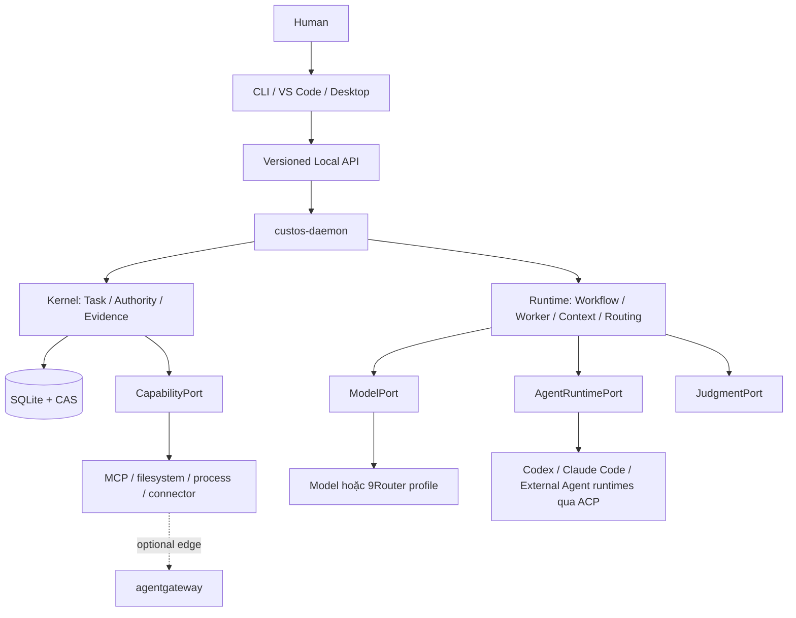
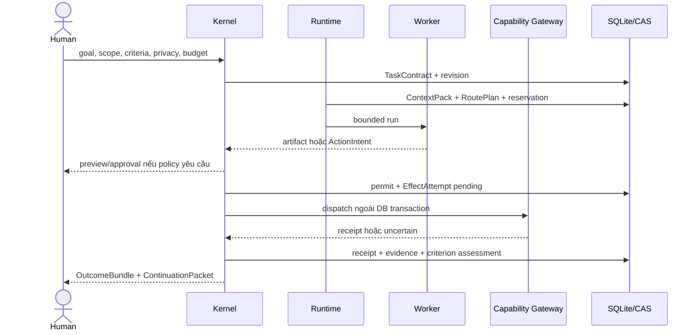

# CUSTOS — KIẾN TRÚC DỰA TRÊN RESEARCH VÀ CODEBASE THỰC

**Loại:** Bản diễn giải tiếng Việt

**Canonical:** [`../../Custos.md`](../../Custos.md)  
**Architecture:** [`../architecture/README.md`](../architecture/README.md)  
**Development:** [`../development/codebase-architecture.md`](../development/codebase-architecture.md)

Tài liệu này giúp team đọc và triển khai kiến trúc bằng tiếng Việt. Nếu có xung
đột, tài liệu canonical tiếng Anh, contract đã accept, source và test được pin
SHA có quyền cao hơn.

## 1. Định vị cuối cùng

Custos là **durable control plane cho agentic work**, không phải mega-agent,
chatbot, model proxy hay multi-agent framework. Custos giữ một Task xuyên
session, model và worker; kiểm soát effect; lưu provenance; phục hồi sau crash;
và chỉ công nhận outcome dựa trên evidence phù hợp với từng criterion.

Giá trị sản phẩm cần chứng minh bằng workflow và benchmark gồm bốn phần:

1. **Continuity:** Task sống lâu hơn Session và một lần chạy model.
2. **Authority:** model/agent chỉ đề xuất; Kernel và human quyết định quyền.
3. **Proof:** completion gắn evidence với đúng Task, revision, subject và verifier.
4. **Economics:** cost/latency/risk được đo trên accepted outcome, không đo bằng số agent.

## 2. Kiến trúc trách nhiệm



Kernel là trusted computing base. Model, external agent, MCP server, document,
repo content và gateway đều là input không đáng tin hoặc chỉ đáng tin có điều
kiện. Không thành phần nào được quyền ghi SQLite trực tiếp ngoài repository path
được daemon compose.

## 3. Luồng chuẩn của một Task



Quy tắc recovery: chưa commit attempt thì command có thể chạy lại theo expected
version; đã có khả năng dispatch nhưng mất receipt thì chuyển `Uncertain` và
reconcile, tuyệt đối không retry mù; receipt đã commit nhưng verifier chưa xong
thì chạy lại verifier trên input đã pin.

## 4. Những gì hấp thụ từ paper/framework

| Nguồn | Hấp thụ | Không sao chép |
|---|---|---|
| ReAct | observation và reasoning luân phiên | Cho model thực thi trực tiếp |
| SWE-agent | ACI/tool nhỏ, rõ, typed | Raw shell host làm API chính |
| Agentless | localization → repair → validation làm baseline | Mặc định multi-agent |
| RouteLLM | score route theo quality/cost | Router vượt qua pin/privacy/budget |
| AdaptOrch | DAG tạo candidate topology | Biến preprint thành production truth |
| Lost in the Middle | ContextPack được rank và budget | Dump toàn repo/transcript |
| MemGPT/Jev-Mem | memory phân tầng và retrieval controller | Memory summary thành source truth |
| W3C PROV/in-toto/SLSA | entity-activity-agent và attestation lineage | Hash đồng nghĩa semantic correctness |
| Temporal | history/checkpoint/resume semantics | Thêm platform distributed khi chưa cần |

System One, Jev hoặc classifier khác chỉ trả `JudgmentRecord` có backend,
version, input digest, confidence/calibration và abstention. Nó không cấp permit,
không tự pass criterion và không thay deterministic parser cho số/ngày/policy.

## 5. Agent Runtime, 9Router và agentgateway

- **Agent Runtime:** quản lý agent loop, MCP/ACP, streaming và UX qua `AgentRuntimePort`; không trao Kernel authority.
- **9Router:** optional `ModelPort` transport profile. Chỉ một transport active
  trong một ModelAttempt; fallback/token transform phải được ghi provenance và
  test semantic preservation.
- **agentgateway:** optional connectivity edge cho LLM/MCP/A2A, auth, policy và
  observability. Không giữ Task, canonical budget, permit hoặc evidence.
- Hai gateway không chain mặc định. Chỉ bật sau shadow test chứng minh lợi ích.

## 6. Cây repo và ngôn ngữ

```text
crates/       Rust trusted core, runtime, adapters, daemon, SDK, CLI, packs
schemas/      JSON Schema cho boundary; YAML schema cho pack/workflow
tests/        contract, E2E process, crash, fixture
evals/        quality, calibration, cost, security regression
tools/        Python repo intelligence/offline research
ui/           TypeScript/Tauri desktop
packages/     VS Code và npm distribution
services/     bot/integration chạy ngoài daemon
config/       deployment và optional gateway profiles
compatibility/ Wire/config shims có removal gate
vendor/       upstream pin nguyên trạng kèm license/provenance
docs/         architecture, contract, status và research
```

Rust sở hữu canonical state và security boundary. TypeScript chỉ làm client/UI.
Python chỉ làm offline tool, eval hoặc sidecar qua contract; không nằm trong
Rust crate và không ghi SQLite. SQL chỉ là additive migration. YAML luôn phải
validate schema trước khi load. JSON Schema là nguồn contract cross-process;
không tạo thêm Protobuf IDL trừ khi một boundary gRPC thực sự được chọn.

## 7. Thứ tự build ổn định cho team ba người

1. Khóa C-01 Session/Task và C-02 Run/Step.
2. Khóa C-03 Action/Permit/Attempt/Receipt và C-04 trusted Evidence.
3. Nâng SQLite khỏi dải WAL-reset bug; thêm runtime assertion và crash test.
4. Wire read-only Engineering F1 qua daemon với ContextPack và ModelPort thật.
5. Wire sandboxed mutation F2, uncertainty và reconciliation.
6. Hoàn thiện Research F3, sau đó Assistant external-effect flow.
7. Benchmark System One, multi-agent và gateway so với single-worker baseline.
8. Chỉ productize thứ thắng về accepted outcome, cost, latency và recovery.

Điểm dừng hiện tại không phải thiếu thêm framework. Điểm dừng là trusted
evidence, exact durable authority, real sandbox, daemon composition và một clean
reproducible baseline.

## 8. Hướng khác biệt được đề xuất sau lượt research bổ sung

Custos phục vụ trọn vòng công việc của developer: **hiểu vấn đề → nghiên cứu
phương án → thay đổi code → kiểm chứng → phối hợp với người khác**. Assistant
giai đoạn đầu tập trung vào vòng này: ghi chú, draft cập nhật, lịch hẹn và follow-up.

Điểm đáng đầu tư là **công việc có bằng chứng và biết khi nào bằng chứng đã cũ**.
Một kết quả lưu nguồn, revision, artifact, verifier, policy và giới hạn của nó.
Khi nguồn hoặc code thay đổi, Custos tìm kết quả bị ảnh hưởng, dừng sử dụng chúng
để completion/publish, rồi kiểm tra lại theo phạm vi cần thiết. Nếu chưa biết
đầy đủ dependency, phải kiểm tra rộng hơn thay vì tái sử dụng mù.

Đây là tổ hợp các kỹ thuật đã có trong build system, durable workflow và
provenance. Chưa có cơ sở tuyên bố đây là phát minh độc nhất hoặc vượt mọi agent.
Sự khác biệt cần chứng minh ở trải nghiệm xuyên ba pack và độ tin cậy đo được.

## 9. Demo chuẩn để cả team cùng xây

1. Người dùng yêu cầu nghiên cứu migration thư viện, sửa code và chuẩn bị báo
   cáo cho team. Custos ghi scope, baseline, criteria, budget và quyền.
2. Research lưu nguồn và claim/support/counter-evidence; phân biệt dữ kiện với
   suy luận và quyết định của người dùng.
3. Engineering tạo patch trong worktree riêng, chạy profile test đã định trên
   đúng artifact; ghi toolchain, kết quả, phạm vi và phần chưa kiểm tra.
4. Assistant tạo draft dựa trên outcome revision, chưa gửi khi thiếu quyền.
5. Đổi một file hoặc giả định API trước khi gửi: assessment và draft phụ thuộc
   trở thành stale; hệ thống yêu cầu revalidation và preview mới nếu cần.
6. Giả lập crash sau khi đã gọi gửi: restart reconcile cùng attempt; không gửi
   lại mù. Receipt của provider và việc người nhận đã đọc là hai điều khác nhau.

Task đã thành công trong quá khứ vẫn giữ nguyên lịch sử. Công việc mới dùng
revision hoặc successor theo contract được duyệt; không sửa lịch sử thành công
để che kết quả đã hết hiệu lực. Một email đã gửi không thể bị “rollback” bằng DB.

## 10. Những chỉnh sửa quan trọng so với bản gửi vào

| Điểm | Quyết định thiết kế |
|---|---|
| Bốn crate trusted core mới | Giữ bốn trách nhiệm trong `custos-core`; giữ tổng 11 product crates |
| Nhiều Task status mới | Giữ enum hiện tại; UI tổng hợp từ Run, Effect, Approval và Criterion |
| SQLite FULL/NORMAL/OFF theo bảng | Một cấu hình durable cho DB canonical; cache/telemetry tách riêng khi cần |
| Test exit code đồng nghĩa đúng | Chỉ chứng minh kết quả phép kiểm tra trên input và môi trường đã ghi |
| Citation đồng nghĩa support | Locator/hash và đánh giá support là hai lớp bằng chứng khác nhau |
| S1 tự kiểm calibration từng request | Calibration cần tập nhãn, đánh giá đúng lớp bài toán và theo dõi drift |
| Bắt buộc 9 protocol, 3 MCP process | Chọn theo workflow cần giao; logical namespace không bắt buộc process riêng |
| Windows Job Object là sandbox | Cần thêm boundary isolation và test thoát sandbox/đọc/ghi/network |
| Continuation tự mang việc sang máy khác | Cần fencing executor cũ, transfer artifact và quyền mới ở máy đích |

## 11. Vibe, tự setup và hub quản lý

Assist/Vibe, Delegated và Workflow dùng cùng một runtime. Vibe cho stream sớm,
preview và standing grant có scope để thao tác thường lệ chạy liền mạch. Trước
mutation phải có Task tối thiểu và quyền hợp lệ; model không tự mở rộng scope.

Setup tự động đi qua inspect → preview → approve khi cần → apply → probe →
activate. Inspect repo không chạy hook/script của repo. Cài dependency hay MCP
server là effect có nguồn, version, quyền và kết quả probe rõ ràng.

UI có một catalog kết nối với ba nhóm model, agent, tool. Phía dưới vẫn giữ
ModelPort, AgentRuntimePort và CapabilityPort riêng; 9Router và agentgateway là
ứng viên adapter thay thế được. Mỗi model attempt có một transport active và
fallback được ghi thành attempt mới với kiểm tra budget/privacy.

Chi tiết chuẩn nằm trong canonical architecture §§15–20 và runtime F4–F8.
[Kiến trúc Bằng chứng](../architecture/evidence-and-completion-gate.md) cùng quy chuẩn C-02/C-04 đang hiệu lực
contract; các khả năng trên chưa được tuyên bố là đã triển khai.

## 12. Bản chốt kiến trúc đích sau khi mổ xẻ bản paste

Bản paste là tập ý tưởng thiết kế, không phải schema/migration hay cam kết
production. Đích cuối là **một Task Kernel và năm mặt phẳng trách nhiệm**:
trusted control (Task/quyền/evidence), work (Session/Run/pack), intelligence
(context/S1/S2/memory), connectivity (model/agent/tool/protocol), state
(SQLite/CAS/index dẫn xuất). Năm mặt phẳng không tương đương năm service.
`custos-daemon` là điểm compose duy nhất; giữ 11 crate hiện có.

Một vòng chạy chuẩn: human xác định goal/scope/criteria/egress/budget → Kernel
ghi Task revision → Context Compiler chụp nguồn và ghi phần bị lược → OI tạo
route có thể kiểm chứng, lọc cứng quyền và budget → worker tạo artifact hoặc
ActionIntent → effect cần permit chính xác và attempt bền vững → verifier đánh
giá từng criterion trên đúng input → OutcomeBundle hiển thị pass/fail/unknown,
assurance, chi phí và việc còn treo. Nếu crash giữa dispatch và receipt, trạng
thái là `uncertain`, phải reconcile. Nếu source đổi, evidence cũ vẫn là lịch sử
nhưng không còn dùng để kết luận revision mới.

Các trải nghiệm Assist/Vibe, Delegated và Workflow khác mức tự động và UI,
không có ba Kernel. Research, Engineering và Assistant khác verifier và
effect policy, nhưng cùng Task/authority/evidence protocol. Assistant chỉ gửi
khi đúng người, tài khoản, thời điểm, payload và approval. Engineering không
coi test là read-only. Research không coi citation là support.

`AgentRuntimePort` chuẩn hóa agent loop/ACP/MCP; 9Router là ứng viên transport model;
agentgateway là ứng viên edge MCP/A2A và có thể thay một model edge. Catalog
quản lý chung không đồng nghĩa proxy chung nắm quyền. Không chain 9Router và
agentgateway mặc định; cũng không bắt buộc 3 MCP server hoặc 9 protocol.
S1/Jev chỉ giúp chọn/rank/abstain; các nghiên cứu mới về incoherence và
option-label bias buộc test rubric, calibration và failure cases. OI chạy trong
runtime, luôn có single-worker baseline; multi-agent chỉ bật sau benchmark
đúng chi phí, an toàn và khả năng phục hồi.

Định nghĩa hoàn thành chặt: criterion bắt buộc không rỗng, assessment do
Kernel resolve đúng Task/revision/subject, artifact còn hợp lệ, không có
effect `uncertain` chặn kết quả, không còn approval/review bắt buộc đang chờ.
Waiver của human hiển thị riêng, không biến thành machine pass. Đây là
“proof-carrying” theo tiêu chí đã công bố, không phải chứng minh mọi code hay
mọi lập luận đều đúng.

Quyết định này được mô tả đầy đủ trong
[Custos Master Specification](../../Custos.md) và
[Custos Architecture Overview](../architecture/README.md).
