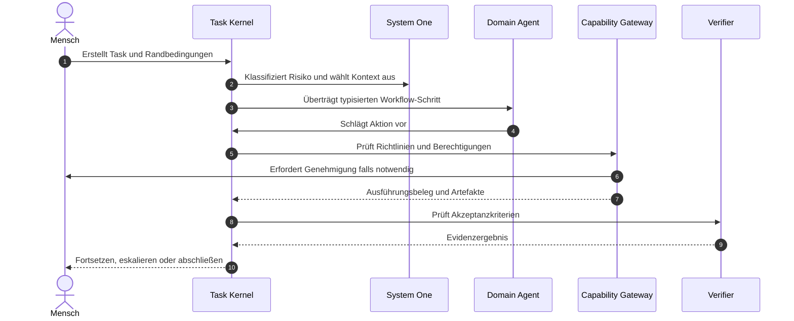
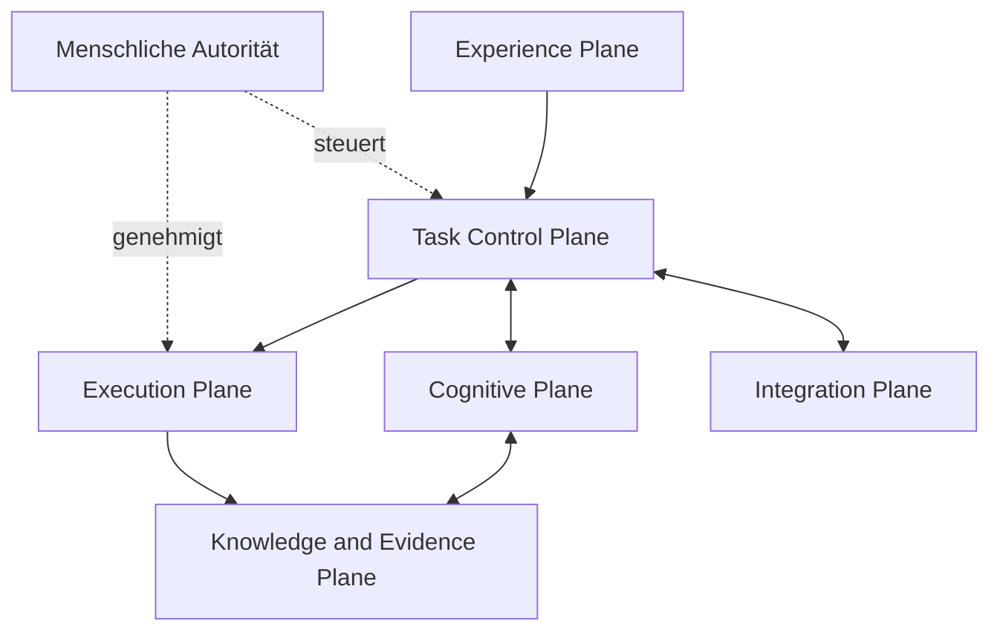

<div align="center">

<picture>
  <source media="(prefers-color-scheme: dark)" srcset="../assets/banner-dark.png">
  <source media="(prefers-color-scheme: light)" srcset="../assets/banner.png">
  
</picture>

# Custos

**Ein menschengesteuerter Arbeitsbereich für spezialisierte agentenbasierte Arbeitsabläufe**

*Vibe Coding, wissenschaftliche Forschung und persönliche Workflows mit den Modellen Ihrer Wahl — mit dauerhaftem Zustand, kontrollierter Ausführung, kostenbewusstem Kontext und verifizierbaren Ergebnissen.*

<br />

[ EN ](../../README.md) | [ VI ](README.vi.md) | [ DE ] | [ ZH ](README.zh.md)

<br />

[](../../LICENSE)
[](../canonical-specification.md)
[](../architecture/overview.md)
[](../architecture/deployment.md)

</div>

---

## Was Custos bedeutet

Custos ist das lateinische Wort für *Hüter* oder *Wächter* (guardian).

Der Name spiegelt den zentralen Zweck des Produkts wider: Custos schützt und bewahrt die Kontinuität, Autorität, Privatsphäre, Ressourcen und Evidenzen KI-unterstützter Arbeit, während die Intention und die endgültige Verantwortung stets beim Menschen verbleiben.

Custos ist **kein** autonomer "Super-Agent" und nicht bloß eine weitere Chat-Oberfläche für verschiedene Modell-APIs. Es ist eine lokale Runtime (Local-First) und ein Arbeitsbereich, in dem Menschen, spezialisierte Agenten, Modelle, Werkzeuge und Wissensbestände über persistente, verwaltete Aufgaben hinweg zusammenarbeiten.

Bringen Sie die Modelle mit, denen Sie vertrauen. Arbeiten Sie natürlich. Custos sorgt dafür, dass Ihre Arbeit kohärent, kontrolliert, fortsetzbar und überprüfbar bleibt.

---

## Die Problemstellung

Heutige KI-Entwicklungs- und Forschungswerkzeuge sind leistungsfähig, doch die umgebende Arbeitsorganisation ist stark fragmentiert:

- **Gefangener Kontext:** Arbeitsergebnisse sind in anbieterspezifischen Chats und geschlossenen Sitzungen gefangen.
- **Kontextverlust:** Der Kontext muss nach jedem Modell- oder Werkzeugwechsel mühsam neu aufgebaut werden.
- **Token-Verschwendung:** Agenten verschwenden Token, indem sie Repositories, Protokolle und Dokumente wiederholt von Grund auf einlesen.
- **Kostenineffizienz:** Häufig wird ein einzelnes teures Modell für Aufgaben eingesetzt, die lokal oder wesentlich kostengünstiger bewältigt werden könnten.
- **Fragile Fallbacks:** Bei Ausweichmechanismen zwischen Anbietern gehen Semantiken für Werkzeuge, logisches Schließen oder strukturierte Ausgaben oft unbemerkt verloren.
- **Unverifizierte Behauptungen:** Generierter Quellcode und wissenschaftliche Thesen werden oft ohne unabhängige Nachweise ungeprüft übernommen.
- **Unkontrollierte Seiteneffekte:** Werkzeugaufrufe (Tool Calls) erfolgen ohne konsistente Scopes, Freigaben oder Prüfpfade.
- **Fragile Ausführung:** Langlaufende Aufgaben brechen bei Abstürzen, Ratenbegrenzungen, Systemneustarts oder Kontextgrenzen vorzeitig ab.
- **Mangelnde Wiederverwendbarkeit:** Persönliche Arbeitsweisen und bewährte Workflows lassen sich nur schwer sicher konservieren und wiederverwenden.
- **Kontrollverlust:** Multi-Agenten-Systeme erhöhen oft die Komplexität, schwächen jedoch die menschliche Kontrolle.

Das Resultat ist eine unbefriedigende Wahl: Entweder man koordiniert unverbundene KI-Tools manuell, oder man überträgt unkontrollierbare Autorität an intransparente autonome Systeme.

---

## Das Produktziel

Custos verfolgt das Ziel, KI-unterstützte Arbeit so intuitiv und flüssig wie "Vibe Coding" zu gestalten und ihr gleichzeitig die nötige Struktur und ingenieurmäßige Disziplin für anspruchsvolle Softwareentwicklung, wissenschaftliche Forschung und persönliche Arbeitsabläufe zu verleihen.

Die fundamentale Basiseinheit ist ein **Durable Task** (persistente Aufgabe), keine flüchtige Chat-Sitzung. Ein Task kapselt Ziel, Geltungsbereich, Randbedingungen, Workflow, Budgets, Kontext, Entscheidungen, Genehmigungen, Artefakte, Nachweise (Evidenz) und den Fortsetzungszustand.

Ein Task kann:
- mit einem Modell begonnen und mit einem anderen fortgesetzt werden;
- für menschliche Rückfragen pausiert und nach einem Neustart nahtlos reaktiviert werden;
- flexibel zwischen den Domänen Coding, Research und Assistant übergeben werden;
- gemäß Benutzerrichtlinien auf lokalen oder entfernten Modellen ausgeführt werden;
- durch Token-, Finanz-, Schritt- und Zeitbudgets begrenzt werden;
- erst dann abgeschlossen werden, wenn die Akzeptanzkriterien durch objektive Evidenz belegt sind.

---

## Produkterfahrung

Custos ist auf drei natürliche Arbeitsweisen ausgelegt.

### Vibe Coding
Beauftragen Sie Custos damit, eine Codebasis zu erfassen, Architekturen zu erklären, Fehler zu beheben, Features zu implementieren, Änderungen zu prüfen, Migrationen durchzuführen oder Releases vorzubereiten.

Custos indiziert das Repository, selektiert relevante Symbole, schlägt einen Workflow vor, steuert das gewählte Programmiermodell an, isoliert Codeänderungen in einem separaten Worktree, führt gezielte Verifizierungen durch und legt das resultierende Diff zusammen mit Prüfnachweisen zur Abnahme vor.

### Vibe Research
Beauftragen Sie Custos damit, Fragestellungen tiefgehend zu untersuchen, wissenschaftliche Publikationen zu vergleichen, Kernaussagen zu extrahieren, Widersprüche aufzudecken, Fachliteratur in Implementierungsspezifikationen zu überführen, Experimente zu entwerfen, Benchmarks durchzuführen oder quellengestützte Berichte zu erstellen.

Custos bewahrt Forschungsfragen, Quellen, Thesen, Evidenzen, Annahmen, Datensätze, Versuchskonfigurationen, offene Fragen und den Zitierstatus strukturiert auf, anstatt Forschungsergebnisse auf eine bloße Textzusammenfassung zu reduzieren.

### Vibe Assistant
Nutzen Sie Custos, um Notizen, Dokumente, Pläne, wiederkehrende Workflows, lokale Datenverarbeitung und die administrative Arbeit rund um Softwareentwicklung und Forschung zu organisieren.

Die Assistant-Domäne bereitet Fortsetzungszusammenfassungen vor, strukturiert Ausgaben, koordiniert Aufgaben und schlägt externe Interaktionen vor, während folgenreiche Operationen konsequent hinter Richtlinien und Freigabegrenzen geschützt bleiben.

---

## Spezialisierte Agentendomänen

Coding, Research und Assistant sind nach außen gerichtete Agentendomänen und keine permanent im Hintergrund laufenden Personas.

Jede Domäne wird durch ein **Domain Pack** definiert:

```text
Agent Domain
  = Task Types
  + Workflow Templates
  + Context Recipes
  + Memory Policy
  + Tool Capabilities
  + Cognitive Routing
  + Verification Profiles
  + Domain UX
```

| Domäne | Typische Aufgaben | Schnelle Beurteilung | Tiefgehende Überlegung | Abschluss-Evidenz |
|---|---|---|---|---|
| **Coding** | Codeverständnis, Fehlerbehebung, Features, Refactoring, Code-Review | Relevanzbewertung von Dateien und Symbolen, Risikoprüfung, Testauswahl | Architekturdesign, Planung, Implementierung, komplexes Debugging | Diff, Build-Protokolle, Tests, Linter- und Sicherheitsergebnisse |
| **Research** | Literaturrecherchen, Thesenextraktion, Experimente, Benchmarks | Relevanzprüfung, Deduplizierung, Quellen-Screening, Erkennung von Widersprüchen | Synthese, Hypothesenbildung, Versuchsplanung | Zitate, Datensatz-Hashes, Konfigurationsabdrücke und Metriken |
| **Assistant** | Dokumente, Notizen, Planung und lokale Workflow-Koordination | Klassifizierung, Priorisierung, Datenschutz- und Aktionsrisiko-Screening | Textentwürfe, Analyse und mehrstufige Planung | Menschliche Freigaben, Zustellbestätigungen und Änderungsprotokolle |

Die Domänen können nahtlos an derselben Aufgabe zusammenarbeiten. Ein Research-Workflow kann eine evidenzbasierte Spezifikation liefern, die Coding-Domäne implementiert und benchmarkt diese, und der Assistant paketiert das Gesamtergebnis und plant Folgeschritte.

---

## Mensch, System Eins und System Zwei

Custos unterscheidet strikt zwischen drei Verantwortungsebenen:

| Akteur | Verantwortung | Autorität |
|---|---|---|
| **Human Principal** (Mensch) | Intention, Randbedingungen, Werte, Freigaben und Letztverantwortung | Uneingeschränktes Vetorecht und finale Genehmigung |
| **System One** | Schnelle Klassifizierung, Ranking, Vorabprüfung, Risikochecks und Eskalation | Rein beratend oder als Schwellenwert-Filter |
| **System Two** | Tiefes logisches Schließen, Planung, Synthese, Codegenerierung und Review | Schlägt Entscheidungen und Aktionen vor |

System One kann durch deterministische Regeln, lokale Klassifikatoren, Embeddings, kleine Sprachmodelle (SLMs) oder dedizierte Bewertungs-Backends implementiert werden. System Two greift auf führende Reasoning-Modelle, spezialisierte Programmier-Agenten oder lokale Großmodelle zurück.

Weder System One noch System Two können sich selbst Handlungsbefugnisse erteilen. Der Task Kernel kontrolliert Zustandsübergänge, und das Capability Gateway überwacht alle Seiteneffekte.

---

## Freie Modellwahl

Benutzer bestimmen autonom, welchen Modellen und Anbietern sie vertrauen.

Custos unterstützt drei Auswahlmodi:

| Modus | Verhalten |
|---|---|
| **Manuell** | Weist einer bestimmten Aufgabe oder Rolle ein festes Modell zu |
| **Unterstützt** | Custos empfiehlt ein kompatibles Modell; der Benutzer bestätigt die Auswahl |
| **Automatisch** | Custos routet Anfragen dynamisch innerhalb freigegebener Anbieter, Fähigkeiten, Datenschutzregeln und Budgets |

Ein Coding-Agent kann für sämtliche Schritte ein einziges Modell oder mehrere spezialisierte Modelle für unterschiedliche Teilrollen einbinden:

```yaml
agents:
  coding:
    planner: anthropic/claude
    implementer: openai/codex
    reviewer: ollama/qwen-coder
  research:
    screener: ollama/qwen
    synthesizer: google/gemini
    critic: anthropic/claude
```

Agenten-Workflows deklarieren benötigte Fähigkeiten (Capabilities), anstatt Anbieter fest einzuprogrammieren. Das Model Gateway gleicht diese Anforderungen mit den vom Benutzer konfigurierten Modellen ab.

Ein Modellwechsel darf weder den Task-Zustand noch das Arbeitsgedächtnis, Artefakte, Genehmigungen oder Nachweise beschädigen. Provider-neutrale Continuation Packets bewahren alle erforderlichen Informationen, um Arbeiten über Modell- und Agentengrenzen hinweg lückenlos fortzusetzen.

---

## Einfach, wenn Sie es wünschen

Custos setzt keine komplexe Multi-Modell-Konfiguration voraus.

Entwickler können direkt mit einem einzigen bevorzugten Programmiermodell starten:

```bash
custos code --model codex
```

Repository-Indizierung, Kontextselektion, Budgetüberwachung, Werkzeugverwaltung, Wiederherstellungsmechanismen, automatisierte Tests und die Beweissicherung bleiben auch bei dieser minimalistischen Nutzung im Hintergrund aktiv.

Erweitertes Routing ist eine Option, keine zwingende Voraussetzung.

---

## Workflow Composer

Natürlichsprachliche Benutzerabsichten können in einen typisierten, überprüfbaren `WorkflowPlan` transformiert werden.

Custos unterstützt vier Workflow-Modi:

| Modus | Beschreibung |
|---|---|
| **Manuell** | Der Mensch steuert jeden einzelnen Schritt direkt |
| **Vorgeschlagen** | Custos unterbreitet vor der Ausführung einen vollständigen Workflow-Plan zur Prüfung |
| **Adaptiv** | Der Ablauf kann sich anhand von Zwischenergebnissen innerhalb genehmigter Grenzen dynamisch anpassen |
| **Wiederverwendbar**| Erfolgreiche Workflows können als regulierte Vorlagen gespeichert werden |

Der Workflow Composer berücksichtigt:
- Aufgabenintention und Zieldomäne;
- erforderliche Modellfähigkeiten;
- Kontext- und Memory-Rezepte;
- Datenschutz- und Netzwerkrichtlinien;
- Werkzeugaufrufe und potenzielle Seiteneffekte;
- Risiko- und Genehmigungsprüfpunkte;
- Token-, Finanz- und Zeitbudgets;
- erforderliche Verifizierungs- und Fertigstellungsnachweise.

Custos kann vorschlagen, wiederholt erfolgreiche Prozesse als Workflow-Vorlage abzulegen, speichert jedoch niemals unkritisch vollständige Dialogverläufe, Zugangsdaten oder flüchtige Zwischendaten ab.

---

## Persönliches Arbeitsprofil

Custos passt sich an die individuellen Gewohnheiten beim Programmieren, Recherchieren, Prüfen und Genehmigen an.

Ein User Work Profile kann folgende Aspekte umfassen:
- bevorzugter Interaktions- und Erklärungsstil;
- bevorzugte Modelle sowie Richtlinien für lokale versus Cloud-Verarbeitung;
- geschützte Repositories, Dateien und Git-Branches;
- Programmierkonventionen und vorgeschriebene Qualitätsprüfungen;
- Vorgaben für Quellen und Zitierstile bei Recherchen;
- Genehmigungsschwellenwerte;
- Standardgrenzen für Tokenverbrauch, Kosten und Ausführungszeit;
- konfigurierte Workflow-Präferenzen.

Die Personalisierung ist jederzeit einsehbar und editierbar. Gedächtniseinträge besitzen klare Geltungsbereiche, Herkunftsnachweise, Vertrauenswerte, Zeitstempel, Aufbewahrungsrichtlinien und Löschfunktionen.

---

## Kosten und Leistung

Custos optimiert das Gesamtsystem rund um die Modellentscheidungen des Anwenders, anstatt jede Teilentscheidung an ein teures Cloud-LLM zu delegieren.

### Kontexteffizienz
- Inkrementelle Indizierung von Repositories und Dokumenten.
- Symbolbewusste und relevanzgewichtete Kontextauswahl.
- Token-budgetierte Context Packs.
- Inhaltsadressierte Artefakte anstelle des wiederholten Einbettens umfangreicher Ausgaben in Prompts.
- Sichere Kürzung von Werkzeugausgaben mit verlässlichem Rückgriff auf das Originalartefakt.
- Kontext- und Retrieval-Caches mit expliziter Invalidierungslogik.

### Kognitive Effizienz
- Deterministische Regeln, lokale Modelle und spezialisierte Bewerter für kostengünstiges Screening.
- Eskalation an System Two nur bei begründetem Bedarf an tiefer logischer Deduktion.
- Fähigkeitsorientiertes Modell-Matching.
- Vom Anwender explizit genehmigte Fallback-Ketten.
- Frühzeitiger Abbruch, Zyklenerkennung und Erkennung redundanter Schleifenaktionen.

### Ausführungseffizienz
- Inkrementelle Builds und gezielte Testläufe vor vollständigen Verifizierungsschritten.
- Persistenter Zustand, der redundante Neustartarbeiten zuverlässig verhindert.
- Parallele Ausführung ausschließlich für unabhängige und autorisierte Prozessschritte.
- Strikte Durchsetzung von Token-, Budget-, Schritt-, Wiederholungs- und Zeitlimits durch die Runtime.

Custos garantiert die strikte Einhaltung konfigurierter Budgets und Policies. Es kann jedoch keine identische Ausgabequalität über inkompatible Modelle hinweg erzwingen oder ein ungeeignetes Modell auf magische Weise in eine Spitzen-Coding-Engine verwandeln.

---

## Ablauf eines Tasks



Zu jedem Zeitpunkt kann der Mensch den Zustand inspizieren, pausieren, umleiten, erlaubte Modelle ändern, den Workflow anpassen, Berechtigungen entziehen oder den Task abbrechen.

---

## Local-First als Standard

Custos ist primär für den lokalen Betrieb auf dem Rechner des Benutzers konzipiert.

- Aufgabenstatus, Richtlinien, Berechtigungen und Prüfpfade verbleiben standardmäßig lokal.
- Sensibler Quellcode und vertrauliche Dokumente verlassen das lokale System nicht unkontrolliert.
- Lokale Modelle können für private oder kostensensible Aufgaben genutzt werden.
- Externe Anbieter erhalten ausschließlich den durch Richtlinien freigegebenen Kontext.
- Zugangsdaten werden über betriebssystemeigene Schlüsselspeicher (Secret Stores) verwaltet und niemals im Aufgabenstatus persistiert.

*Local-First bedeutet nicht Offline-Zwang: Externe Dienste bleiben über explizite Adapter und kontrollierte Egress-Richtlinien jederzeit verfügbar.*

---

## Evidenz statt Modell-Zuversicht

Die bloße Behauptung eines Sprachmodells, eine Aufgabe sei gelöst, stellt keinen Nachweis dar.

Custos verlangt greifbare Evidenzen:
- erfolgreiche automatisierte Testläufe und Build-Belege;
- Quellcode-Diffs und Ergebnisse statischer Codeanalysen;
- Literaturzitate und verifizierte These-Evidenz-Verknüpfungen;
- kryptografische Hashes von Datensätzen und Konfigurationen;
- reproduzierbare Benchmark-Metriken;
- kryptografisch signierte Belege über Werkzeugausführungen;
- explizite menschliche Prüfentscheidungen.

Die Fertigstellungsrichtlinie (Completion Policy) obliegt dem Aufgabenvertrag (Task Contract) und dem Verifiziererprofil der Domäne, nicht dem generierenden Modell.

---

## Funktionale Architektur



| Ebene (Plane) | Verantwortung |
|---|---|
| **Experience** | CLI, VS Code-Erweiterung und zukünftige grafische Benutzeroberflächen |
| **Task Control** | Persistenter Zustand, Ablaufplanung, Budgets, Wiederherstellung und Fortführung |
| **Cognitive** | System One Vorbewertung, System Two Deliberation und Workflow-Komposition |
| **Execution** | Fähigkeiten, Berechtigungsscheine (Permits), Genehmigungen, Worktrees und Sandkästen |
| **Knowledge & Evidence** | Kontextverwaltung, Langzeitgedächtnis, Artefakte, Provenienz und Verifizierung |
| **Integration** | Modelle, Provider-Agenten, MCP, A2A, lokale Systemdienste und Secret-Verwaltung |

Sicherheit, Datenschutz, Beobachtbarkeit und Ressourcenkontrolle gelten durchgängig über alle Architekturebenen hinweg.

---

## Gateway-Grenzen

Custos trennt die Anbindung externer Schnittstellen strikt von der tatsächlichen Handlungsvollmacht.

### Model Gateway
Verantwortlich für Modellerkennung, Fähigkeitsabgleich, Protokollübersetzung, Zustandsüberwachung, Kontingente, Kosten und richtlinienkonforme Ausweichpfade (Fallbacks).

### Protocol Gateway
Verantwortlich für MCP- und A2A-Erkennung, Transportkanäle, Föderation, Authentifizierung, Verkehrsrichtlinien und Telemetrie.

### Capability Gateway
Die einzige vertrauenswürdige Schnittstelle für sicherheitsrelevante Seiteneffekte. Es validiert Geltungsbereiche, Genehmigungen, Payload-Bindungen, Ablaufzeiten, Budgets und Ausführungsquittungen.

Weder Modell- noch Protokoll-Gateways können den Task-Zustand verändern, Berechtigungsscheine ausstellen, Memory-Einträge hochstufen oder eine Aufgabe eigenmächtig für beendet erklären.

---

## Produktschnittstellen

Das geplante Produkt umfasst folgende Kernoberflächen:

| Schnittstelle | Verwendungszweck |
|---|---|
| **Task Workspace** | Aufgabenübersicht, Pläne, Übergaben zwischen Agenten, Artefakte und Fortsetzung |
| **Approval Inbox** | Detaillierte Prüfung von Aktionen, Risiken, Scopes und Gültigkeitsgrenzen |
| **Model Fleet** | Verwaltung angebundener Modelle, Fähigkeiten, Verfügbarkeit, Kosten und Fallback-Regeln |
| **Protocol Mesh** | Einsicht in MCP-Tools, Ressourcen, Server und verbundene A2A-Peers |
| **Context Inspector**| Nachvollziehbarkeit, welcher Kontext ausgewählt wurde und warum |
| **Run Timeline** | Zeitliche Nachverfolgung von Mensch-, Agenten-, Bewertungs- und Ausführungsereignissen |
| **Evidence Explorer**| Lückenlose Rückverfolgung von Behauptungen und Resultaten zu ihren Nachweisen |

---

## Repository-Architektur

Custos setzt auf ein Rust-zentriertes polyglottes Monorepo und eine Ports-and-Adapters-Architektur (hexagonale Architektur).

```text
custos/
├── apps/                    # Daemon, CLI und anwenderbezogene Anwendungen
├── crates/                  # Vertrauenswürdige Rust-Kernkomponenten und Runtime
├── adapters/                # Modelle, Provider, Urteilsfunktionen, Werkzeuge und Gateways
├── sidecars/                # Isolierte TypeScript- oder Python-Integrationen
├── domain-packs/            # Workflows für Softwareentwicklung, Forschung und Assistenz
├── schemas/                 # Versionierte prozessübergreifende Schnittstellenverträge
├── tests/                   # Vertrags-, Integrations-, Wiederherstellungs- und Sicherheitstests
├── evals/                   # Evaluierungs-Frameworks für Agenten und Workflows
├── docs/                    # Produkt-, Architektur-, Protokoll- und Betriebsdokumentation
└── lab/upstreams/           # Geprüfte Upstream-Forschung; getrennt vom Produktionskern
```

Der vertrauenswürdige Rust-Kern besitzt die alleinige Kontrolle über Task-Zustände, Autorität, Persistenz, Ausführungskontrolle und Evidenzabschluss. TypeScript- und Python-Komponenten kommunizieren ausschließlich über versionierte Schnittstellenverträge und haben weder direkten Schreibzugriff auf die Custos-Datenbank noch das Recht, sich eigenständig Befugnisse zu erteilen.

---

## Kernkonzepte

| Konzept | Bedeutung |
|---|---|
| **Task** | Dauerhafte, anwenderbezogene Arbeitseinheit |
| **TaskContract** | Ziel, Geltungsbereich, Randbedingungen, Budgets und Akzeptanzkriterien |
| **Run** | Ein konkreter Ausführungsversuch eines Tasks |
| **WorkflowPlan** | Typisierter Plan aus Domänenschritten und deren Abhängigkeiten |
| **ContextPack** | Budgetierter, herkunftsbewusster Kontext für einen Bearbeiter |
| **ActionIntent** | Vorschlag einer Operation mit Seiteneffekten |
| **ExecutionPermit**| Begrenzte, an Nutzdaten gebundene und zeitlich befristete Autorisierung |
| **Receipt** | Unveränderlicher Beleg über eine ausgeführte Aktion und deren Resultat |
| **Artifact** | Unveränderlicher Inhalt mit eindeutiger Identität und Herkunft |
| **Evidence** | Artefakt, das von einem Verifizierer oder Menschen formell akzeptiert wurde |
| **ContinuationPacket**| Anbieterneutraler Zustand zur Fortsetzung oder Übergabe von Arbeiten |
| **DomainPack** | Workflows, Kontextrezepte, Richtlinien und Verifizierungen für eine Domäne |
| **OutcomeBundle** | Finale Liefergegenstände, Evidenzen, Entscheidungen und Kostenaufstellung |

---

## Nicht-Ziele (Non-Goals)

Custos beabsichtigt **nicht** zu sein:
- ein neues Basis-Sprachmodell (Foundation Model);
- ein geschlossener, verpflichtender Modell-Marktplatz;
- eine Ansammlung permanent laufender Chatbot-Personas;
- eine simple Chat-Historie, die fälschlicherweise als Gedächtnis deklariert wird;
- ein uneingeschränkter, unüberwachter autonomer Computer-Operator;
- ein vollständiger Ersatz für spezialisierte Coding- oder Rechercheplattformen;
- ein System, das statistische Modell-Zuversicht mit logischem Beweis verwechselt;
- eine Begründung dafür, Workflows, Kosten, Datenabflüsse oder Handlungsvollmachten vor dem Benutzer zu verschleiern.

---

## Projektstatus

Custos befindet sich in einer frühen Entwicklungsphase.

Dieses Dokument beschreibt sowohl die beschlossene Architekturrichtung als auch die angestrebte Produkterfahrung. Es impliziert nicht, dass jede dargestellte Komponente bereits vollständig implementiert ist.

Wesentliche Fähigkeiten werden in der Projektdokumentation klar eingestuft:
- **Implemented** — einsatzbereit und durch relevante Tests abgedeckt;
- **Experimental** — lauffähig, aber noch nicht stabilisiert;
- **Specified** — abgestimmter Schnittstellenvertrag oder Entwurf, noch nicht implementiert;
- **Proposed** — befindet sich in der architektonischen Diskussion.

Der erste durchgängige Prototyp (End-to-End Slice) demonstriert:

```text
Mensch erstellt einen Coding-Task
  → Custos schlägt einen strukturierten Workflow vor
  → Anwender wählt das gewünschte Modell
  → Kontext wird gezielt aus dem Repository zusammengestellt
  → Der Coding-Agent schlägt kontrollierte Änderungen vor und führt sie aus
  → Tests und Diffs werden als objektive Evidenz erfasst
  → Der Mensch prüft das wiederaufnehmbare Outcome Bundle
```

---

## Dokumentation

Detaillierte Spezifikationen befinden sich im Verzeichnis `docs/`:

```text
docs/
├── 00-start-here.md
├── product/                 # Agentendomänen, Workflows, Benutzeroberfläche und Personalisierung
├── architecture/            # Runtime, Gateways, Kontext, Gedächtnis und Evidenz
├── protocols/               # Versionierte Aufgaben-, Aktions-, Modell- und Fortsetzungsverträge
├── security/                # Bedrohungsmodelle, Vertrauensgrenzen und Datenschutz
├── operations/              # Installation, Konfiguration und Systemdiagnose
├── reference/               # Konzepte, Invarianten und Kompatibilitätsrichtlinien
└── adr/                     # Architectural Decision Records (Architekturentscheidungen)
```

Die Dokumentation unterscheidet stets klar zwischen bereits implementiertem Systemverhalten und geplanter Zielarchitektur.

---

## Mitwirken (Contributing)

Custos begrüßt Diskussionen über Architektur, Codebeiträge, Evaluierungen, Dokumentationsverbesserungen, Sicherheitsanalysen und Upstream-Prüfungen.

Vor einer Beitragsleistung wird um Einsicht in `AGENTS.md`, `CONTRIBUTING.md`, die entsprechenden Architekturentscheidungen (ADRs) sowie die Modulverantwortlichkeiten gebeten.

---

## Lizenz

Custos steht unter der Apache-2.0-Lizenz zur Verfügung.

<div align="center">

**Custos — Guardian of Work**

*Ihr persönlicher Arbeitsstil, abgebildet in überprüfbaren und kontrollierten Workflows.*

<sub>Entwickelt mit kompromissloser Disziplin für menschliche Souveränität, lokale Autonomie und überprüfbare Softwaretechnik.</sub>

</div>
