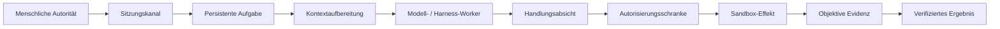

<div align="center">

<picture>
  <source media="(prefers-color-scheme: dark)" srcset="../assets/banner-dark.png">
  <source media="(prefers-color-scheme: light)" srcset="../assets/banner.png">
  
</picture>

# Custos

[ EN ](../../README.md) · [ VI ](README.vi.md) · [ DE ](README.de.md) · [ ZH ](README.zh.md) · [ JA ](README.ja.md) · [ KO ](README.ko.md) · [ ES ](README.es.md)

</div>

**Eine Local-First-, vom Menschen gesteuerte Laufzeitumgebung für nachweisbasierte Agentenarbeit.**

Custos transformiert flüchtige Konversationen mit künstlicher Intelligenz in persistente, kontrollierte Aufgaben mit expliziter Absicht, abgegrenzter Ausführung, wiederherstellbarem Zustand und evidenzbasierten Ergebnissen. Es operiert lokal über lokale Modelle, Cloud-Anbieter und externe Programmier-Harnesses hinweg.

---

## Kernmotivation

Heutige Agentensysteme bieten enorme Leistungsfähigkeit, leiden jedoch unter grundlegenden architektonischen Schwachstellen:

- **Flüchtiger Kontextverlust:** Kontexte verbleiben in isolierten Herstellersilos und gehen bei Sitzungswechseln oder Werkzeugwechseln verloren.
- **Unverifizierte Behauptungen:** Aussagen von Modellen über die Aufgabenerfüllung werden ungeprüft und ohne objektiven Nachweis übernommen.
- **Unkontrollierte Seiteneffekte:** Externe Mutationen (Dateiveränderungen, Netzwerkanfragen, Systembefehle) werden ohne strikte Autorisierungsschranken oder Prüfprotokolle ausgeführt.
- **Fragiler Ausführungszustand:** Systemabstürze, Ratengrenzen und Kontextüberläufe unterbrechen laufende Arbeiten ohne deterministische Wiederherstellung.
- **Erosion menschlicher Kontrolle:** Undurchsichtige Multi-Agenten-Konstrukte schwächen die menschliche Aufsicht und entziehen wesentliche Entscheidungsbefugnisse.

Custos behebt diese Mängel durch ein lokales, evidenzgebundenes Betriebsmodell, in dem die menschliche Souveränität gewahrt bleibt und alle Agentenaktionen streng auditiert werden.

---

## Grundlegende Konzepte

Custos trennt strikt zwischen den operativen Entitäten:

- **Sitzung (Session):** Ein flüchtiger Interaktionskanal (CLI, IDE-Harness, Desktop-Oberfläche, Chat).
- **Aufgabe (Task):** Die persistente, unveränderliche Einheit aus Absicht, Richtlinie, Zustand und Akzeptanzkriterien.
- **Durchlauf (Run):** Ein diskreter Ausführungsversuch innerhalb des Lebenszyklus einer aktiven Aufgabe.
- **Handlungsabsicht (Action Intent):** Eine von einem Modell-Worker vorgeschlagene externe Mutation.
- **Ausführungsschein (Execution Permit):** Eine kryptografisch gebundene Einmalgenehmigung der Autorisierungs-Engine.
- **Effekt (Effect):** Eine in einer Sandbox ausgeführte Mutation, die ausschließlich unter einem gültigen Schein erfolgt.
- **Evidenz (Evidence):** Objektive, unabhängig verifizierbare Artefakte, die Ergebnisse unabhängig von Modellaussagen belegen.


```mermaid
flowchart LR
    Human[Menschliche Autorität] --> Session[Sitzungskanal]
    Session --> Task[Persistente Aufgabe]
    Task --> Context[Kontextaufbereitung]
    Context --> Worker[Modell- / Harness-Worker]
    Worker --> Intent[Handlungsabsicht]
    Intent --> Gate[Autorisierungsschranke]
    Gate --> Effect[Sandbox-Effekt]
    Effect --> Evidence[Objektive Evidenz]
    Evidence --> Outcome[Verifiziertes Ergebnis]
```

---

## Systemarchitektur

Custos operiert über drei getrennte Vertrauenszonen (Trust Zones):

1. **Nicht vertrauenswürdige Zone (Untrusted Zone):** Externe Modelle, Drittanbieter-Agenten, Netzwerkendpunkte und unvalidierte Benutzereingaben.
2. **Überwachte Zone (Supervised Zone):** Kontextkompilierung, Prompt-Synthese, semantisches Routing und flüchtige Ausführungsplanung.
3. **Vertrauenswürdiger Kernel (Trusted Kernel):** Persistenz mittels SQLite Write-Ahead Logging (WAL), Autorisierungs-Engine, Capability Gateway und Verifizierer.

### Workspace-Crates

Der Quellcode ist in 11 fokussierte Rust-Crates gegliedert:

| Schicht | Crate | Kernverantwortung |
|---|---|---|
| **Domäne** | `custos-domain` | Reine Domänenidentitäten, Entitätsmodelle, Zustandsautomaten und Invarianten. |
| **Kern** | `custos-core` | Aufgabenorchestrierung, Autorisierungs-Engine und Abschlussrichtlinien. |
| | `custos-persistence` | SQLite-Migrationen, persistente Repositorien und Absturzwiederherstellung. |
| **Laufzeit** | `custos-runtime` | Sitzungslebenszyklus, Worker-Prozesse, Kognition und Speicherschichten. |
| | `custos-provider` | Provider-neutrale Modellverträge, Streaming-Protokolle und Tokenizer. |
| **Brücken & Adapter** | `custos-bridge` | Hochstufung von Sitzungen zu Aufgaben und Dispatch der lokalen Programmierschnittstelle. |
| | `custos-adapters` | Konkrete Implementierungen für Modelle, Fähigkeiten und Sandboxes. |
| **Domänenpakete** | `custos-packs` | Spezialisierte Workflows: Engineering-, Research- und Assistant-Pakete. |
| **Daemon & Clients** | `custos-daemon` | Einziger Produktions-Kompositionswurzel und Hintergrunddienst. |
| | `custos-sdk` | Client-Datentransferobjekte und Transportabstraktionen. |
| | `custos-cli` | Schlanke Befehlszeilenschnittstelle für Operatoren. |

---

## Protokoll-Hubs und Harness-Unterstützung

Der lokale Custos-Daemon fungiert als zentrales Interoperabilitäts-Gateway über sechs spezialisierte Hubs:

- **Model Hub:** Leitet Anfragen an lokale Engines und Cloud-Inferenzanbieter mit Ausfallschutz weiter.
- **Tool Hub:** Verwaltet Model Context Protocol (MCP)-Server und externe Werkzeuge.
- **Agent Hub:** Steuert Agent-to-Agent (A2A)-Kommunikation und Workflows des Agent Communication Protocol (ACP).
- **Storage Hub:** Koordiniert SQLite-Persistenz, Blob-Speicher und strukturierte Index-Caches.
- **Event Hub:** Verteilt Prüfprotokolle mit hohem Durchsatz und Lebenszyklusereignisse.
- **Operator Hub:** Stellt sichere lokale Endpunkte für Bedienoberflächen und Terminal-Sitzungen bereit.

### Harness-Adapter

Custos integriert externe Entwicklungsumgebungen unter strikter Einhaltung von Sicherheitsgrenzen:

- **Claude Code:** Stdio-Subprozessisolation und Befehlskapselung.
- **Codex:** Sandboxed Code-Vervollständigung und Testausführung.
- **Cursor:** Editor-Puffersynchronisation und sichere Diff-Anwendung.
- **Antigravity:** Koordination der agentischen Laufzeit und Aufgabensynchronisation.

---

## Spezialisierte Domänenpakete

Custos stellt auf Fachgebiete zugeschnittene Workflow-Pakete bereit:

- **Engineering Pack:** Autonome Software-Entwicklungsworkflows mit atomaren Patch-Bündeln, Fehlerlokalisierung über mehrere Worker und Drei-Wege-Arbeitsbereichen (Haupt-Repo, Staging-Fork, Verifikations-Sandbox).
- **Research Pack:** Workflows für wissenschaftliche und technische Untersuchungen mit Fokus auf Reproduzierbarkeitsbündel, iterative Faktenerhärtung (FIRE), Datensatzprüfung und Experiment-Tracking.
- **Assistant Pack:** Persönliches Workflow-Management mit mehrstufiger Autonomie, Termin- und Kommunikationssteuerung sowie stabiler Ablaufplanung.

---

## Systeminvarianten

1. **Local-First-Souveränität:** Sämtliche Aufgabendaten, Zustandsübergänge, Kontextartefakte und Prüfprotokolle verbleiben auf dem lokalen Datenträger.
2. **Keine unkontrollierten Effekte:** Kein Agent oder Modell darf Dateisystemänderungen, Prozessausführungen oder Netzwerkaufrufe ohne aktiven Ausführungsschein tätigen.
3. **Evidenz vor Behauptungen:** Eine Aufgabe kann niemals allein durch die Selbstaussage eines Modells abgeschlossen werden; objektive Nachweise sind zwingend erforderlich.
4. **Dauerhafte Zustandstransaktionen:** Zustandsänderungen werden vor dem Absenden von Aktionen persistent gesichert, um unbestimmte Zustände bei Abstürzen auszuschließen.
5. **Menschliche Vorherrschaft:** Der menschliche Operator behält das uneingeschränkte Recht, jede Aufgabe jederzeit anzuhalten, einzusehen, anzupassen oder abzubrechen.

---

## Verifizierung und Tests

Kompilierung und Verifikation des Workspaces:

```bash
cargo fmt --all -- --check
cargo check --workspace
cargo test --workspace --all-targets
```

---

## Dokumentation und Spezifikationen

- **Architekturspezifikation:** [Custos.md](../../Custos.md) (Einzige Quelle der Wahrheit - SSOT)
- **Agenten- und Beitragsrichtlinien:** [AGENTS.md](../../AGENTS.md)
- **Dokumentationsverzeichnis:** [docs/README.md](../README.md)
- **Internationalisierung:** [docs/i18n/README.md](README.md)

---

## Lizenz

Die [LICENSE](../../LICENSE) im Repository enthält derzeit die MIT-Lizenz. Herkunft und Kennzeichnung von Goose-abgeleitetem Code werden im [Upstream-Quellenverzeichnis](../development/upstream-source-map.md) geprüft; die Root-Lizenz beschreibt nicht zwangsläufig jeden übernommenen Bestandteil.
