<picture>
  <source media="(prefers-color-scheme: dark)" srcset="../assets/banner-dark.png">
  <source media="(prefers-color-scheme: light)" srcset="../assets/banner.png">
  
</picture>

[ EN ](../../README.md) · [ VI ](README.vi.md) · [ DE ](README.de.md) · [ ZH ](README.zh.md) · [ JA ](README.ja.md) · [ KO ](README.ko.md) · [ ES ](README.es.md)

**Un espacio de trabajo local-first para agentes de codificación, investigación y asistencia.**

**Dirección del producto: Custos SADE — Entorno de Desarrollo de Agentes Supervisados.** Una experiencia ADE con supervisión consciente de fuentes, razonamiento de agentes fuertes, asistencia S1 limitada y optimización de costos medida sobre resultados aceptados. Consulte el [diseño de SADE](../architecture/sade-design-and-supervision.md); se trata de una arquitectura objetivo, no de una afirmación de superioridad en pruebas comparativas.

Custos reúne conversaciones, recursos, ejecuciones de agentes y resultados en un solo espacio de trabajo. Su arquitectura objetivo combina tareas duraderas, ejecución con alcance delimitado, resultados conscientes de las fuentes y estado de efectos honesto a través de modelos locales, APIs en la nube y arneses de agentes nativos. Las interfaces de escritorio y línea de comandos (CLI) son clientes del mismo motor de ejecución; un arnés nativo conserva su propio ciclo y límites de garantía declarados.

**Estado:** implementación y diseño objetivo en evolución; no es una afirmación de que todo el espacio de trabajo o todos los conectores estén terminados. Comience con la [especificación del espacio de trabajo/UI](../architecture/agent-workspace-and-ui.md), el [plan de reestructuración](../development/workspace-restructuring-plan.md) y el [centro de documentación](../README.md). Estos documentos distinguen las rutas existentes de los módulos planificados y preservan la compatibilidad durante la migración.

---

## Motivación Principal

Las herramientas de agentes contemporáneas ofrecen inmensas capacidades pero sufren fallas arquitectónicas fundamentales:
- **Pérdida Epímera de Contexto:** El contexto queda atrapado en silos aislados y se desecha al cambiar de herramienta o de sesión.
- **Afirmaciones No Verificadas:** Las declaraciones de los modelos se confían sin verificación objetiva.
- **Efectos Secundarios Sin Control:** Las mutaciones externas se ejecutan sin auditoría ni puertas estrictas.
- **Estado Frágil:** Los fallos del sistema o límites de red detienen el trabajo sin recuperación determinista.
- **Erosión del Control Humano:** Configuraciones multi-agente opacas disminuyen la autoridad de decisión humana.

Custos resuelve estos fallos introduciendo un modelo operativo 'local-first' respaldado por evidencia donde la soberanía humana es suprema.

---

## Conceptos Fundamentales

Custos impone límites claros entre las entidades operativas:
- **Sesión:** Canal de interacción efímero.
- **Tarea (Task):** Unidad duradera de intención, política, estado y criterios.
- **Ejecución (Run):** Intento discreto dentro de una tarea.
- **Intención de Acción:** Mutación propuesta generada por un modelo.
- **Permiso de Ejecución:** Autorización de un solo uso emitida por el motor de autoridad.
- **Efecto:** Mutación aislada ejecutada exclusivamente bajo un permiso.
- **Evidencia:** Artefactos objetivos y verificables que confirman las afirmaciones.

```mermaid
flowchart LR
    Human[Autoridad Humana] --> Session[Canal de Sesión]
    Session --> Task[Tarea Duradera]
    Task --> Context[Ensamblaje de Contexto]
    Context --> Worker[Trabajador / Arnés]
    Worker --> Intent[Intención de Acción]
    Intent --> Gate[Puerta de Autoridad]
    Gate --> Effect[Efecto Aislado]
    Effect --> Evidence[Evidencia Objetiva]
    Evidence --> Outcome[Resultado Verificado]
```

---

## Licencia

El archivo raíz [LICENSE](../../LICENSE) se distribuye bajo **GNU AGPL-3.0-or-later**. Incluye un Aviso de Marca Comercial (Trademark Notice) estricto para proteger la identidad de Custos y prohíbe las envolturas SaaS comerciales de código cerrado. Consulte el archivo LICENSE para obtener todos los detalles.
