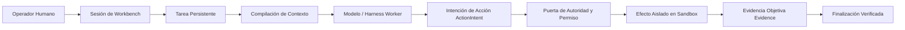

<div align="center">

<picture>
  <source media="(prefers-color-scheme: dark)" srcset="../assets/banner-dark.png">
  <source media="(prefers-color-scheme: light)" srcset="../assets/banner.png">
  
</picture>

[ EN ](../../README.md) · [ VI ](README.vi.md) · [ DE ](README.de.md) · [ ZH ](README.zh.md) · [ JA ](README.ja.md) · [ KO ](README.ko.md) · [ ES ](README.es.md)

</div>

> **Entorno de Desarrollo de Agentes Supervisados (SADE) — Local-First, Basado en Evidencia, Gobernado por Humanos.**

Custos es un entorno de desarrollo y ejecución de prioridad local (local-first) para agentes autónomos en ingeniería de software, investigación científica, asistencia en flujos de trabajo personales y desarrollo de estrategias cuantitativas. A diferencia de simples envoltorios de LLM o sistemas multiagente opacos, Custos impone persistencia de estado determinista, puertas de capacidad auditadas criptográficamente, compilación de contexto vinculada al origen y la exigencia de pruebas empíricas antes de reconocer cualquier tarea como completada.

---

## Motivación Fundamental y Desafíos

Los sistemas de agentes contemporáneos ofrecen notables capacidades de generación, pero adolecen de fallos arquitectónicos fundamentales:

- **Pérdida de Contexto Efímero:** El contexto queda atrapado en silos propietarios de proveedores y se descarta al cambiar de herramientas o reiniciar sesiones.
- **Afirmaciones No Verificadas:** Las declaraciones de finalización emitidas por los modelos se aceptan ciegamente sin verificación objetiva ni pruebas reproducibles.
- **Efectos Secundarios Incontrolados:** Las mutaciones externas (edición de archivos, peticiones de red, comandos del sistema) se ejecutan sin puertas de capacidad estrictas ni registros de auditoría.
- **Estado Frágil:** Las caídas del sistema, límites de tasa y desbordamientos de contexto destruyen el trabajo en curso sin mecanismos deterministas de recuperación.
- **Erosión de la Soberanía Humana:** Los bucles multiagente opacos socavan la supervisión humana y suprimen puntos de decisión críticos.

Custos resuelve estos problemas introduciendo un modelo operativo basado en evidencia, donde la soberanía humana es absoluta y cada efecto externo está estrictamente gobernado.

---

## Tres Pilares No Negociables

| Pilar | Principio Fundamental | Garantía Arquitectónica |
|---|---|---|
| **P1 — Tarea como Entidad de Primer Nivel** | Las tareas existen independientemente de sesiones y conexiones | Persistencia SQLite WAL duradera, recuperación determinista tras caídas y libro de órdenes idempotente. |
| **P2 — Propuesta ≠ Decisión ≠ Efecto** | El modelo propone; el núcleo autoriza; la pasarela ejecuta | El modelo IA no confiable solo emite un `ActionIntent`; el núcleo firma un `ExecutionPermit` de un solo uso; el sandbox aplica las puertas de capacidad vía Outbox. |
| **P3 — Finalización Basada en Evidencia** | Ninguna tarea se completa sin prueba empírica | Las condiciones de aceptación solo se aprueban con artefactos objetivos verificables (diffs, trazas de pruebas, auditorías de citas); cero finalizaciones ficticias. |

---

## Mecánica Operativa


```mermaid
flowchart LR
    Human[Operador Humano] --> Session[Sesión de Workbench]
    Session --> Task[Tarea Persistente]
    Task --> Context[Compilación de Contexto]
    Context --> Worker[Modelo / Harness Worker]
    Worker --> Intent[Intención de Acción ActionIntent]
    Intent --> Gate[Puerta de Autoridad y Permiso]
    Gate --> Effect[Efecto Aislado en Sandbox]
    Effect --> Evidence[Evidencia Objetiva Evidence]
    Evidence --> Outcome[Finalización Verificada]
```

---

## Cuatro Bancos de Trabajo Verticales (Vertical Workbenches)

Custos proporciona modelos de interacción, modelos de dominio y motores de verificación adaptados a distintos dominios cognitivos:

### 1. Banco de Trabajo de Programación (Coding Workbench - `workbenches/coding`)
- **Espacios de Trabajo de Ejecución de 3 Vías (3-Path Workspaces):** Aísla de forma segura el repositorio canónico (canonical repo), el fork de preparación (staging fork) y el sandbox de verificación.
- **Paquetes de Parches Atómicos (Atomic Patch Bundles):** Exige diffs estructurados con validación sintáctica y de lint automatizada antes de la preparación.
- **Aislamiento de Arrendamiento de Árbol de Trabajo (Worktree Lease Isolation):** Protege mediante barreras (fencing) las escrituras concurrentes en el mismo árbol de trabajo para evitar condiciones de carrera y pérdida de datos (`ENV-02`).

### 2. Banco de Trabajo de Investigación (Research Workbench - `workbenches/research`)
- **Jerarquía de Fundamentación de Afirmaciones (Claim Grounding Hierarchy):** Establece cuatro niveles de rigor epistémico: `L0 Sin Fundamento`, `L1 Con Respaldo de Citas`, `L2 Revisado por Pares`, `L3 Reproducido Empíricamente`.
- **Oráculo de Cobertura de Citas (Citation Coverage Oracle):** Contrasta rigurosamente con literatura y DOI publicados, rechazando declaraciones de finalización infundadas.
- **Estudio de Síntesis y Kernel de Notebooks:** Transforma revisiones bibliográficas multifuente en hipótesis contrastables y lotes de experimentos reproducibles, anclados criptográficamente mediante `EnvSnapshot` (`ENV-04`).

### 3. Banco de Trabajo de Asistente (Assistant Workbench - `workbenches/assistant`)
- **Cola de Aprobación de Bandeja de Salida (Outbox Approval Queue):** Aísla comunicaciones externas y mutaciones críticas tras una cola de aprobación pendiente duradera.
- **Autorizaciones Permanentes (Standing Grants):** Permite la delegación basada en políticas para tareas rutinarias, preservando la intervención humana en acciones de alto riesgo.
- **Anclaje de Ámbito Lógico:** Anclado directamente en el ámbito lógico del proyecto sin falsificar checkouts innecesarios de Git.

### 4. Banco de Trabajo Cuantitativo (Quant Workbench - `workbenches/quant`)
- **Particionado Determinista de Datos de Mercado:** Fija las estrategias a particiones históricas deterministas, eliminando por completo el sesgo de anticipación (Look-ahead bias).
- **Backtesting Aislado Físicamente (Air-Gap):** Corta forzosamente la conexión de red durante el backtesting (`network_restricted = true`), evitando fugas de estrategias u órdenes accidentales (`ENV-05`).
- **Validación Empírica de Estrategias Alfa:** Evaluación automatizada de ratio de Sharpe, ratio de Sortino y drawdown máximo antes de la promoción.

---

## 10 Invariantes Inviolables del Sistema

1. **INV-01 (Soberanía Local-First):** Todo el estado, contratos, tareas y telemetría residen exclusivamente en el disco local.
2. **INV-02 (Cero Atomicidad Ilusoria):** Todo cambio de estado se confirma en SQLite antes de despachar acciones externas.
3. **INV-03 (Permiso Previo al Efecto):** Ninguna mutación externa se ejecuta sin un `ExecutionPermit` criptográficamente vinculado.
4. **INV-04 (Vinculación de Identidad del Actor):** La identidad del actor se vincula desde capas de transporte autenticadas, nunca desde cargas autodeclaradas.
5. **INV-05 (Evidencia por Encima de Afirmaciones):** La aceptación de tareas exige artefactos empíricos verificados, no meras confirmaciones del modelo.
6. **INV-06 (Veracidad Explícita en la Interfaz):** La interfaz entra de inmediato en modo de fallo seguro (`unavailable`/`degraded`) si los servicios de backend fallan.
7. **INV-07 (Aislamiento de Arrendamiento de Árbol de Trabajo):** Las escrituras concurrentes en el mismo árbol de trabajo se aíslan mediante barreras para evitar pérdidas de datos.
8. **INV-08 (Límites Estrictos de Recursos):** La ejecución de procesos, el búfer de líneas y la poda de tokens respetan límites estrictos en bytes.
9. **INV-09 (Transportes Auditados Integralmente):** Toda mutación pasa por un Command Ledger idempotente con verificación de resumen criptográfico contra repetición.
10. **INV-10 (Supremacía Humana):** El operador humano retiene el derecho irrestricto de pausar, redirigir o abortar tareas en cualquier fase de su ciclo de vida.

---

## Entorno de Ejecución de Agentes (AEE) y 7 Compuertas Invariantes

Los agentes autónomos jamás deben operar en entornos indefinidos, no anclados o inauditables (`sade-foundations.md`). Custos formaliza el agregado **Agent Execution Environment (AEE)** mediante modelos de dominio puro (`EnvironmentSpec`, `EnvironmentProfile`, `EnvironmentState`, `EnvSnapshot`, `EnvironmentAssurance`), puertos centrales (`EnvironmentPort`) y el coordinador de tiempo de ejecución.

Antes de que un agente modifique el estado, el sistema evalúa 7 compuertas invariantes deterministas:

| Compuerta Invariante | Garantía Central de Seguridad | Mecanismo de Fallo Seguro (Fail-Closed) |
|---|---|---|
| **ENV-01 (Ejecución en Estado Listo)** | El entorno debe estar en estado `Ready` (o degradado auditado). | Rechaza cualquier solicitud de modificación en inicialización, fallo o destrucción. |
| **ENV-02 (Árbol de Programación Aislado)** | Coding exige un árbol Git aislado y rama explícita. | Rechaza árboles de trabajo sucios no confirmados sin dispensa humana explícita. |
| **ENV-03 (Garantía Honesta - Honest Assurance)** | El nivel de garantía objetivo jamás debe superar la capacidad demostrada por el anfitrión (Gate 4). | Si el anfitrión solo ofrece `ObserveOnly`, nunca reclamar `CustosMediated`; degradación automática. |
| **ENV-04 (Anclaje de Corpus de Investigación)** | Research exige un directorio local válido de corpus y snapshot de reproducción. | Deniega la ejecución de celdas de notebook si no hay corpus anclado. |
| **ENV-05 (Aislamiento Cuantitativo Total)** | El backtesting cuantitativo exige corte total de red (`network_restricted = true`). | Terminación forzosa inmediata si se detectan sockets de red externos activos. |
| **ENV-06 (Liberación Idempotente de Recursos)** | El desmontaje es idempotente; el arranque del servidor recupera automáticamente procesos y PTYs huérfanos. | Escaneo y limpieza automática de procesos zombis y worktrees huérfanos al reiniciar. |
| **ENV-07 (Motivo de Degradación Transparente)** | La transición al estado `Degraded` exige obligatoriamente un motivo auditable. | Rechaza cualquier degradación funcional anónima o sin justificación registrada. |

---

## Arquitectura del Espacio de Trabajo y Topología en Capas

Custos sigue una arquitectura hexagonal (Hexagonal Architecture), separando estrictamente la lógica de dominio pura de los efectos secundarios físicos:

| Subsistema Arquitectónico | Ruta de Directorio | Responsabilidad Principal |
|---|---|---|
| **Dominio de Negocio (Domain)** | `platform/domain` | Entidades puras de dominio, modelos Zero-I/O, especificaciones AEE y máquinas de estado puras. |
| **Contratos Centrales (Core)** | `platform/core` | Orquestación de tareas, motor de autoridad, contrato `EnvironmentPort` y verificadores de finalización. |
| **Almacenamiento Persistente (Storage)** | `platform/storage` | Persistencia SQLite WAL, patrón Outbox, transiciones de estado CAS `state_version` y recuperación de caídas. |
| **Inteligencia Artificial (AI)** | `platform/ai` | Contratos neutrales `ModelPort`, catálogo de modelos, analizadores SSE en flujo y medidores de tokens. |
| **Tiempo de Ejecución Cognitivo (Runtime)** | `platform/runtime` | Bucle S1/S2, `EnvironmentCoordinator`, ciclo de vida del workspace y enrutamiento de terminales. |
| **Adaptadores y Sandboxes (Adapters)** | `platform/adapters` | Sandboxes del SO (Seatbelt/Bubblewrap), clientes MCP, árboles Git y terminales PTY. |
| **Componentes y Flujos (Components)** | `platform/components` | Registro dinámico de Packs, habilidades básicas, descriptores de capacidades y compiladores de herramientas por vista. |
| **Banco de Asistente** | `workbenches/assistant` | Asistencia en flujos personales, calendarios/contactos, borradores y cola de aprobación. |
| **Banco de Programación** | `workbenches/coding` | Ingeniería de software, workspaces de 3 vías, diffs atómicos estructurados y protección de worktrees. |
| **Banco de Investigación** | `workbenches/research` | Análisis integral de literatura, matriz de evidencia de 4 niveles, arbitraje de citas ALCE y notebooks. |
| **Banco Cuantitativo** | `workbenches/quant` | Desarrollo de estrategias cuantitativas, backtesting aislado air-gap, señales alfa y datos de mercado. |
| **Daemon Anfitrión (Daemon)** | `apps/daemon` | Raíz de composición única (Composition Root), servidor daemon en segundo plano y API local JSON-RPC/HTTP. |
| **SDK de Cliente** | `sdk/client-rust` | SDK de cliente en Rust, capa de transporte de API local y tipos de interacción ACP. |
| **Interfaz de Escritorio** | `ui/desktop` | Aplicación de escritorio nativa Tauri 2 + Vite + React 19. |
| **CLI de Terminal** | `ui/cli` | Herramienta de interfaz de línea de comandos interactiva. |

---

## Interfaz de Usuario de Escritorio

Custos Desktop está construido con **Vite, React 19 y Tauri 2**:

- **Jerarquía de 3 Niveles:** Navegación fluida a través de `Proyecto -> Espacio de Trabajo -> Árbol de Trabajo (Project -> Workspace -> Worktree)`.
- **Sistema de Tokens Graphite JetBlack:** Tema oscuro moderno de alto contraste optimizado para sesiones de trabajo prolongadas.
- **Cuatro Bancos de Trabajo Dedicados (Workbenches):**
  - **Programación (Coding):** Archivos y Cambios, Evidencia Objetiva y Gestor de Worktrees.
  - **Investigación (Research):** Estudio de Síntesis, Hallazgos y Libro de Ejecuciones.
  - **Asistente (Assistant):** Navegador Aislado, Terminal, Flota Remota y Notas.
  - **Cuantitativo (Quant):** Gráficos de Estrategia, Simulador de Backtesting y Estudio Alfa.
- **Política Zero-Mock:** Todas las métricas de la interfaz reflejan telemetría real del daemon y conmutan a fallo cerrado en caso de degradación.

---

## Concentradores de Protocolo (Hubs) y Supervisión de Arneses Nativos

El daemon de Custos actúa como una pasarela central de interoperabilidad a través de 6 concentradores especializados:

- **Model Hub:** Enruta peticiones dinámicamente entre motores locales (GGUF, llama.cpp) y proveedores en la nube (Anthropic, OpenAI, Gemini, Bedrock) con conmutación por error automática.
- **Tool Hub:** Gobierna clientes de Model Context Protocol (MCP) y herramientas del sistema aisladas en sandbox.
- **Agent Hub:** Coordina protocolos Agente a Agente (A2A) y flujos de trabajo de Agent Communication Protocol (ACP).
- **Storage Hub:** Gestiona la persistencia SQLite WAL, almacenamiento de blobs e índices estructurados.
- **Event Hub:** Distribuye telemetría de auditoría de alto rendimiento y eventos del ciclo de vida.
- **Operator Hub:** Proporciona puntos de enlace locales autenticados para CLI y escritorio.

### Supervisión de Arneses Nativos
Custos envuelve y supervisa arneses de programación externos sin alterar sus mecanismos internos:
- **Claude Code:** Aislamiento de subprocesos Stdio y envoltura segura de comandos.
- **Codex:** Autocompletado de código en sandbox y ejecución automatizada de pruebas.
- **Cursor:** Sincronización de búferes de editor y aplicación segura de diffs.
- **Antigravity:** Coordinación del entorno de codificación agéntica y sincronización de tareas.

---

## Verificación y Puertas de Calidad

Todas las contribuciones deben superar estrictamente las 5 puertas de calidad automatizadas mediante `xtask`:

```bash
# 1. Ejecutar las 5 puertas de calidad obligatorias (Packs, Desktop UI, Canvas Smoke, Invariantes, Cargo Check)
cargo run -p xtask -- gate

# 2. Verificar los límites arquitectónicos (Prevenir fugas inversas entre Kernel y Workbenches)
cargo run -p xtask -- check-boundaries

# 3. Puerta estricta Clippy de Rust (cero advertencias, cero errores)
cargo clippy --workspace --all-targets -- -D warnings
```

---

## Documentación y Referencias

- **Especificación Arquitectónica Estándar:** [Custos.md](../../Custos.md)
- **Normas para Agentes y Colaboradores:** [AGENTS.md](../../AGENTS.md)
- **Estándares de Diseño de Desktop UI:** [.agents/rules/desktop_ui_architecture_standards.md](../../.agents/rules/desktop_ui_architecture_standards.md)
- **Flujo de Trabajo Git PR:** [.agents/rules/git_pr_workflow.md](../../.agents/rules/git_pr_workflow.md)
- **Índice de Documentación Internacional:** [docs/i18n/README.md](README.md)

---

## Licencia

Custos se distribuye bajo la licencia **GNU AGPL-3.0-or-later**. Incluye una cláusula estricta de Marca Registrada para proteger la identidad de Custos y prohíbe el empaquetado como servicio SaaS comercial de código cerrado. Consulte [LICENSE](../../LICENSE) para más detalles.
