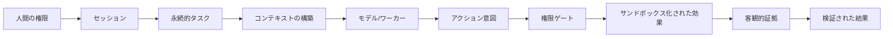

<picture>
  <source media="(prefers-color-scheme: dark)" srcset="../assets/banner-dark.png">
  <source media="(prefers-color-scheme: light)" srcset="../assets/banner.png">
  
</picture>

[ EN ](../../README.md) · [ VI ](README.vi.md) · [ DE ](README.de.md) · [ ZH ](README.zh.md) · [ JA ](README.ja.md) · [ KO ](README.ko.md) · [ ES ](README.es.md)

**コーディング、リサーチ、アシスタントのための、ローカルファーストなエージェント・ワークスペース。**

**製品の方向性: Custos SADE — 監視付きエージェント開発環境。**
ソースを認識する監視、強力なエージェント推論、最適化されたコストを備えたADEエクスペリエンス。詳細は[SADE設計](../architecture/sade-design-and-supervision.md)を参照してください。これは目標とするアーキテクチャであり、ベンチマークでの優位性を主張するものではありません。

Custosは、会話、リソース、実行結果を1つのワークスペースに統合します。ローカルモデル、クラウドAPI、ネイティブエージェントハーネス全体で、永続的なタスク、スコープ指定された実行、客観的な証拠を組み合わせます。

---

## 基本的な動機

現代のエージェントツールは強力ですが、アーキテクチャ上の欠陥があります：
- **一時的なコンテキストの損失:** セッションをまたぐとデータが破棄されます。
- **未検証の主張:** 証拠なしにモデルの完了宣言が信頼されます。
- **制御されていない副作用:** 厳格な監査なしにファイルやネットワークの変更が実行されます。
- **人間の主権の喪失:** ブラックボックス化により人間の決定権が低下します。

Custosは、人間の主権を最優先し、エージェントの行動が厳密に監査される「ローカルファースト」かつ「証拠に基づく」運用モデルを導入することで、これを解決します。

---

## 基本概念

- **セッション:** 一時的なインタラクションチャネル。
- **タスク:** 意図と状態の永続的な単位。
- **実行 (Run):** タスク内の個別の実行試行。
- **アクション意図:** モデルによって生成された外部変更の提案。
- **実行許可 (Permit):** 権限エンジンによって発行される1回限りの承認。
- **証拠 (Evidence):** モデルの主張を独自に確認する検証可能なアーティファクト。

---

## ライセンス

ルートの [LICENSE](../../LICENSE) は **GNU AGPL-3.0-or-later** の下で配布されています。これには、Custosのアイデンティティを保護するための厳格な商標表示 (Trademark Notice) が含まれており、クローズドソースの商用SaaSラッピングを禁止しています。詳細については LICENSE ファイルを参照してください。
