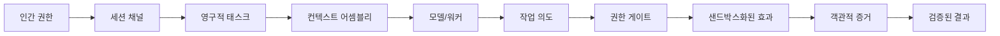

<picture>
  <source media="(prefers-color-scheme: dark)" srcset="../assets/banner-dark.png">
  <source media="(prefers-color-scheme: light)" srcset="../assets/banner.png">
  
</picture>

[ EN ](../../README.md) · [ VI ](README.vi.md) · [ DE ](README.de.md) · [ ZH ](README.zh.md) · [ JA ](README.ja.md) · [ KO ](README.ko.md) · [ ES ](README.es.md)

**코딩, 연구 및 어시스턴스를 위한 로컬 우선(Local-first) 에이전트 작업 공간입니다.**

**제품 방향: Custos SADE — 감독형 에이전트 개발 환경.**
소스 인식 감독, 강력한 에이전트 추론 및 비용 최적화를 갖춘 ADE 경험. 자세한 내용은 [SADE 설계](../architecture/sade-design-and-supervision.md)를 참조하십시오. 

Custos는 대화, 리소스, 에이전트 실행 및 결과를 하나의 작업 공간으로 통합합니다. 로컬 모델, 클라우드 API 및 네이티브 에이전트 도구 전반에 걸쳐 영구적인 태스크, 범위가 지정된 실행 및 객관적인 증거를 결합합니다.

---

## 핵심 동기

현대의 에이전트 도구는 강력하지만 근본적인 아키텍처 결함이 있습니다:
- **일시적인 컨텍스트 손실:** 세션을 전환하면 데이터가 폐기됩니다.
- **검증되지 않은 주장:** 증거 없이 모델의 완료 선언을 신뢰합니다.
- **통제되지 않은 부작용:** 엄격한 감사 없이 파일이나 네트워크 수정이 실행됩니다.
- **인간 주권의 상실:** 불투명한 다중 에이전트 설정으로 인해 인간의 결정 권한이 감소합니다.

Custos는 인간의 주권이 최우선이고 에이전트 행동이 엄격하게 감사되는 '로컬 우선' 및 '증거 기반' 운영 모델을 도입하여 이 문제를 해결합니다.

---

## 기본 개념

- **세션 (Session):** 일시적인 상호 작용 채널.
- **태스크 (Task):** 의도와 상태의 영구적인 단위.
- **실행 (Run):** 태스크 내의 개별 실행 시도.
- **실행 허가 (Permit):** 권한 엔진에서 발행하는 일회성 승인.
- **증거 (Evidence):** 모델의 주장을 독립적으로 확인하는 검증 가능한 아티팩트.

---

## 라이선스

루트 [LICENSE](../../LICENSE) 파일은 **GNU AGPL-3.0-or-later**에 따라 배포됩니다. 여기에는 Custos의 정체성을 보호하기 위한 엄격한 상표 고지(Trademark Notice)가 포함되어 있으며 클로즈드 소스 상업용 SaaS 래핑을 금지합니다. 자세한 내용은 LICENSE 파일을 참조하십시오.
