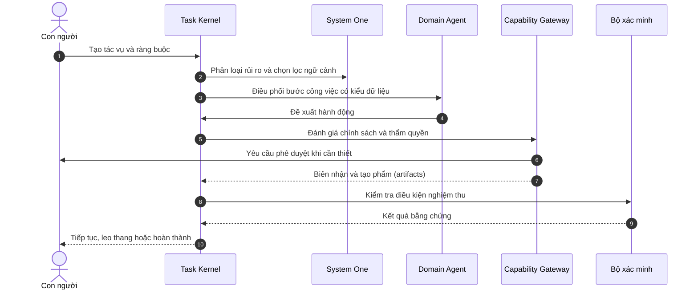
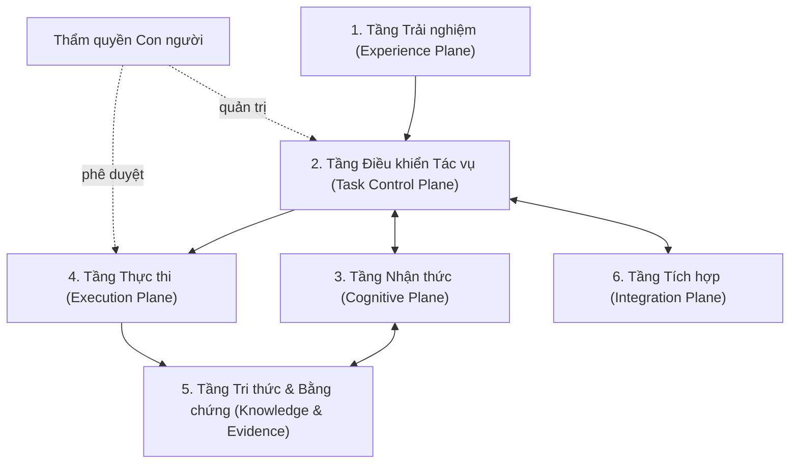

<div align="center">

# Custos

**Không gian làm việc do con người làm chủ cho các luồng công việc agent chuyên biệt**

*Vibe coding, nghiên cứu khoa học và luồng công việc cá nhân trên các mô hình bạn tự chọn — với trạng thái bền vững, thực thi được kiểm soát, ngữ cảnh tối ưu chi phí và kết quả có thể kiểm chứng.*

[ English ](../../README.md) | [ Tiếng Việt ] | [ Deutsch ](README.de.md) | [ 简体中文 ](README.zh.md)

[](../../LICENSE)
[](../canonical-specification.md)
[](../architecture/overview.md)
[](../architecture/deployment.md)

</div>

---

## Ý nghĩa của Custos

Custos trong tiếng Latinh có nghĩa là *người giám hộ* (guardian).

Tên gọi phản ánh mục tiêu cốt lõi của sản phẩm: Custos giám hộ tính liên tục, thẩm quyền, quyền riêng tư, tài nguyên và bằng chứng của các tác vụ do AI hỗ trợ, trong khi ý chí (intent) và trách nhiệm cuối cùng luôn thuộc về con người.

Custos **không phải** là một "siêu agent" tự hành vô hạn và cũng không chỉ đơn thuần là một giao diện chat bọc quanh các API mô hình. Đây là một runtime và không gian làm việc cục bộ (local-first), nơi con người, các agent chuyên biệt, mô hình AI, công cụ và tri thức phối hợp chặt chẽ thông qua các tác vụ bền vững có quản trị.

Hãy mang đến những mô hình bạn tin tưởng. Làm việc tự nhiên. Custos giữ cho công việc luôn nhất quán, được kiểm soát, có thể tiếp tục bất cứ lúc nào và có thể kiểm chứng độc lập.

---

## Vấn đề thực tế

Các công cụ lập trình và nghiên cứu AI ngày nay rất mạnh mẽ, nhưng quy trình làm việc xung quanh chúng lại bị phân mảnh nghiêm trọng:

- **Ngữ cảnh bị giam cầm:** Công việc bị kẹt trong các phiên chat và giao diện đóng kín của từng nhà cung cấp.
- **Mất ngữ cảnh:** Ngữ cảnh liên tục phải dựng lại từ đầu mỗi khi chuyển đổi mô hình hoặc công cụ.
- **Lãng phí token:** Các agent liên tục đọc lại toàn bộ repository, log và tài liệu một cách không cần thiết.
- **Kém hiệu quả về chi phí:** Thường xuyên phải dùng một mô hình đắt đỏ cho các tác vụ lẽ ra có thể chạy cục bộ hoặc chi phí thấp.
- **Cơ chế fallback mong manh:** Khi fallback giữa các nhà cung cấp, ngữ nghĩa về công cụ, suy luận hoặc cấu trúc đầu ra thường bị mất âm thầm.
- **Tuyên bố thiếu kiểm chứng:** Mã nguồn và các kết luận nghiên cứu do AI tạo ra thường được chấp nhận mà không có bằng chứng khách quan.
- **Tác dụng phụ không kiểm soát:** Các lệnh gọi công cụ (tool calls) thực thi mà không có phạm vi rõ ràng, thiếu phê duyệt hoặc không có nhật ký kiểm toán.
- **Thực thi dễ đứt gãy:** Các tác vụ dài hạn dễ bị hỏng khi gặp sự cố crash, giới hạn tốc độ (rate limit), khởi động lại hệ thống hoặc chạm trần ngữ cảnh.
- **Khó tái sử dụng:** Sở thích cá nhân và các workflow đã thành công rất khó đóng gói để tái sử dụng an toàn.
- **Mất quyền kiểm soát:** Hệ thống đa agent thường tăng thêm độ phức tạp mà lại làm xói mòn quyền kiểm soát của con người.

Hậu quả là người dùng phải đứng trước sự lựa chọn tồi tệ: hoặc tự tay điều phối thủ công các công cụ AI rời rạc, hoặc giao phó quá nhiều quyền hạn cho các hệ thống tự hành mờ ám.

---

## Mục tiêu sản phẩm

Custos hướng tới việc giúp công việc do AI hỗ trợ đạt được sự mượt mà như "vibe coding", đồng thời cung cấp đầy đủ cấu trúc và kỷ luật kỹ thuật cần thiết cho các dự án kỹ thuật, nghiên cứu và quản trị luồng việc cá nhân nghiêm túc.

Đơn vị cơ sở của hệ thống là **Durable Task** (Tác vụ bền vững), không phải một phiên chat tạm thời. Một tác vụ chứa đựng đầy đủ mục tiêu, phạm vi, ràng buộc, workflow, ngân sách, ngữ cảnh, quyết định, phê duyệt, artifact (tạo phẩm), bằng chứng và trạng thái tiếp nối (continuation state).

Một tác vụ có thể:
- Bắt đầu với một mô hình này và tiếp tục với một mô hình khác;
- Tạm dừng chờ con người phản hồi và tiếp tục trơn tru sau khi máy khởi động lại;
- Chuyển giao linh hoạt giữa các miền Lập trình (Coding), Nghiên cứu (Research) và Trợ lý (Assistant);
- Thực thi với mô hình cục bộ hoặc đám mây tuân theo chính sách của người dùng;
- Bị kiểm soát nghiêm ngặt bởi ngân sách token, chi phí tài chính, số bước thực thi và thời gian;
- Chỉ được xác nhận hoàn thành khi các điều kiện nghiệm thu được chứng minh bằng bằng chứng khách quan.

---

## Trải nghiệm sản phẩm

Custos được thiết kế xoay quanh ba phương thức làm việc tự nhiên.

### Vibe Coding
Yêu cầu Custos tìm hiểu một repository, giải thích kiến trúc, sửa bug, triển khai tính năng mới, review thay đổi, thực hiện di chuyển mã nguồn (migration) hoặc chuẩn bị bản phát hành.

Custos có thể lập chỉ mục codebase, chọn lọc các symbol liên quan, đề xuất workflow, điều phối mô hình coding được chọn, cô lập các thay đổi trong một git worktree riêng biệt, chạy kiểm thử xác minh mục tiêu, và trình bày bản diff cùng bằng chứng để người dùng phê duyệt.

### Vibe Research
Yêu cầu Custos nghiên cứu một chủ đề, so sánh các bài báo khoa học, trích xuất luận điểm, phát hiện mâu thuẫn, chuyển đổi tài liệu học thuật thành đặc tả kỹ thuật, thiết kế thử nghiệm, chạy benchmark hoặc xuất báo cáo đối chiếu nguồn gốc.

Custos lưu giữ nguyên vẹn câu hỏi nghiên cứu, tài liệu nguồn, luận điểm, bằng chứng, giả định, bộ dữ liệu, cấu hình thử nghiệm, câu hỏi còn bỏ ngỏ và trạng thái trích dẫn thay vì thu gọn nghiên cứu thành một bản tóm tắt duy nhất.

### Vibe Assistant
Sử dụng Custos để tổ chức ghi chú, tài liệu, kế hoạch, các workflow định kỳ, xử lý dữ liệu cục bộ và toàn bộ công việc bao quanh hoạt động lập trình và nghiên cứu.

Miền Trợ lý có thể chuẩn bị tóm tắt tiếp nối, sắp xếp đầu ra, điều phối các tác vụ phụ và đề xuất các hành động đối ngoại, trong khi vẫn giữ các thao tác quan trọng phía sau ranh giới phê duyệt và chính sách rõ ràng.

---

## Các miền Agent chuyên biệt

Coding, Research và Assistant là các miền Agent hướng sản phẩm (product-facing Agent Domains), không phải các nhân cách (personas) chạy thường trực ngốn tài nguyên.

Mỗi miền được cấu hình thông qua một **Domain Pack**:

```text
Agent Domain
  = Kiểu tác vụ (Task Types)
  + Mẫu quy trình (Workflow Templates)
  + Công thức ngữ cảnh (Context Recipes)
  + Chính sách bộ nhớ (Memory Policy)
  + Năng lực công cụ (Tool Capabilities)
  + Định tuyến nhận thức (Cognitive Routing)
  + Hồ sơ xác minh (Verification Profiles)
  + Trải nghiệm người dùng (Domain UX)
```

| Miền | Công việc đặc trưng | Phán đoán nhanh (System 1) | Suy luận sâu (System 2) | Bằng chứng hoàn thành |
|---|---|---|---|---|
| **Coding** | Hiểu repository, sửa lỗi, viết tính năng, refactor, review code | Xếp hạng file và symbol, kiểm tra rủi ro, chọn test phù hợp | Kiến trúc, lập kế hoạch, sinh mã nguồn, debug phức tạp | Diff git, build log, test pass, kết quả linter và bảo mật |
| **Research** | Tổng quan tài liệu, trích xuất luận điểm, thử nghiệm, benchmark | Đánh giá độ liên quan, khử trùng lặp, lọc nguồn, gắn cờ mâu thuẫn | Tổng hợp tri thức, hình thành giả thuyết, thiết kế thí nghiệm | Trích dẫn nguồn, hash dữ liệu, cấu hình và chỉ số benchmark |
| **Assistant** | Tài liệu, ghi chú, kế hoạch, điều phối luồng việc cục bộ | Phân loại, ưu tiên, sàng lọc quyền riêng tư và rủi ro hành động | Soạn thảo, phân tích đa bước và lập kế hoạch chi tiết | Phê duyệt từ con người, biên nhận thực thi, nhật ký thay đổi |

Các miền có thể phối hợp trên cùng một tác vụ. Một workflow Nghiên cứu có thể tạo ra đặc tả kỹ thuật có đối chứng bằng chứng, miền Lập trình hiện thực hóa và benchmark mã nguồn, và miền Trợ lý đóng gói kết quả cùng các bước tiếp theo.

---

## Con người, System One và System Two

Custos phân định rành mạch ba hình thái trách nhiệm:

| Chủ thể | Trách nhiệm | Thẩm quyền |
|---|---|---|
| **Con người (Human Principal)** | Ý chí, ràng buộc, giá trị, phê duyệt và trách nhiệm cuối cùng | Phê duyệt tối cao và quyền phủ quyết (veto) |
| **System One** | Phân loại nhanh, xếp hạng, sàng lọc ngữ cảnh, kiểm tra rủi ro và leo thang | Chỉ đóng vai trò tư vấn hoặc cổng chính sách (không có quyền tự cấp phép) |
| **System Two** | Suy luận sâu, lập kế hoạch, tổng hợp, sinh mã nguồn và đánh giá | Đề xuất quyết định và hành động |

System One có thể được hiện thực hóa bằng các quy tắc tất định (deterministic rules), bộ phân loại cục bộ, embedding, mô hình ngôn ngữ nhỏ (SLM), Jev, Layla hoặc các backend phán đoán chuyên dụng. System Two có thể sử dụng các mô hình suy luận đỉnh cao, coding agent chuyên sâu, mô hình cục bộ hoặc agent runtime của từng nhà cung cấp.

Cả System One và System Two đều **không thể tự ban quyền** cho chính mình. Task Kernel nắm giữ độc quyền các chuyển đổi trạng thái tác vụ, và Capability Gateway kiểm soát toàn bộ các tác dụng phụ (side effects).

---

## Tự do lựa chọn mô hình

Người dùng có toàn quyền quyết định mô hình và nhà cung cấp nào họ tin tưởng.

Custos hỗ trợ ba chế độ lựa chọn:

| Chế độ | Hành vi |
|---|---|
| **Thủ công (Manual)** | Ghim cố định một mô hình cụ thể cho tác vụ hoặc vai trò |
| **Được trợ giúp (Assisted)** | Custos đề xuất mô hình tương thích; người dùng xác nhận |
| **Tự động (Automatic)** | Custos tự định tuyến trong danh sách nhà cung cấp, năng lực, chính sách bảo mật và ngân sách đã được duyệt |

Một Coding Agent có thể dùng một mô hình duy nhất cho tất cả, hoặc phân chia nhiều mô hình cho từng vai trò:

```yaml
agents:
  coding:
    planner: anthropic/claude
    implementer: openai/codex
    reviewer: ollama/qwen-coder
  research:
    screener: ollama/qwen
    synthesizer: google/gemini
    critic: anthropic/claude
```

Các quy trình làm việc khai báo năng lực cần thiết thay vì gắn cứng vào một nhà cung cấp cụ thể. Model Gateway sẽ khớp các yêu cầu đó với các mô hình do người dùng kết nối.

Việc thay đổi mô hình không được làm mất trạng thái tác vụ, bộ nhớ, artifact, phê duyệt hay bằng chứng. Các gói tiếp nối trung lập (Continuation Packets) lưu giữ đầy đủ thông tin để công việc được tiếp tục trơn tru qua các ranh giới mô hình và agent.

---

## Đơn giản khi bạn muốn

Custos không bắt buộc phải cấu hình đa mô hình phức tạp.

Một lập trình viên có thể chọn ngay một mô hình duy nhất và bắt đầu làm việc:

```bash
custos code --model codex
```

Quá trình lập chỉ mục repository, chọn lọc ngữ cảnh, thực thi ngân sách, quản trị công cụ, khôi phục sau sự cố, chạy test và thu thập bằng chứng vẫn hoạt động âm thầm và bền bỉ bên dưới trải nghiệm tinh giản này.

Định tuyến nâng cao là một tùy chọn, không phải điều kiện tiên quyết.

---

## Bộ lập kế hoạch quy trình (Workflow Composer)

Ý chí tự nhiên bằng ngôn ngữ con người có thể được chuyển đổi thành một `WorkflowPlan` có kiểu dữ liệu chặt chẽ và có thể review.

Custos hỗ trợ bốn chế độ workflow:

| Chế độ | Mô tả |
|---|---|
| **Thủ công (Manual)** | Con người trực tiếp điều khiển từng bước |
| **Đề xuất (Suggested)** | Custos đề xuất một kế hoạch workflow trước khi thực thi |
| **Thích ứng (Adaptive)** | Kế hoạch có thể tự điều chỉnh trong phạm vi ràng buộc dựa trên kết quả trung gian |
| **Tái sử dụng (Reusable)** | Một quy trình thành công có thể được lưu lại thành mẫu template có quản trị |

Workflow Composer cân nhắc tổng thể:
- Ý định tác vụ và miền ứng dụng;
- Năng lực mô hình đòi hỏi;
- Công thức ngữ cảnh và bộ nhớ;
- Chính sách bảo mật và mạng;
- Công cụ và các tác dụng phụ;
- Các điểm kiểm soát rủi ro và phê duyệt từ con người;
- Ngân sách token, tài chính và thời gian;
- Yêu cầu xác minh và bằng chứng hoàn thành.

Custos có thể gợi ý lưu lại một quy trình lặp lại thành công thành template, nhưng tuyệt đối không lưu mù quáng toàn bộ cuộc hội thoại, bí mật (secrets) hay dữ liệu tạm thời.

---

## Hồ sơ công việc cá nhân (Personal Work Profile)

Custos có thể thích ứng với phong cách viết code, nghiên cứu, đánh giá và phê duyệt của từng cá nhân.

Một Hồ sơ cá nhân có thể chứa:
- Phong cách tương tác và mức độ giải thích mong muốn;
- Mô hình ưa thích và chính sách ưu tiên cục bộ hay đám mây;
- Các repository, tệp và nhánh git được bảo vệ nghiêm ngặt;
- Quy ước code và các bước kiểm tra bắt buộc;
- Nguồn nghiên cứu tin cậy và tiêu chuẩn trích dẫn;
- Ngưỡng tự động phê duyệt;
- Hạn mức mặc định về token, chi phí và thời gian;
- Các tùy chọn workflow tái sử dụng.

Cá nhân hóa luôn minh bạch và có thể chỉnh sửa. Các mục bộ nhớ đều mang phạm vi, nguồn gốc (provenance), độ tin cậy, mốc thời gian, chính sách lưu giữ và quyền xóa bỏ.

---

## Chi phí và hiệu năng

Custos tối ưu hóa toàn hệ thống xoay quanh lựa chọn mô hình của người dùng thay vì phụ thuộc vào việc để một LLM đắt đỏ ra mọi quyết định nhỏ nhặt.

### Tối ưu ngữ cảnh (Context efficiency)
- Lập chỉ mục repository và tài liệu theo cơ chế gia tăng (incremental).
- Chọn lọc ngữ cảnh dựa trên nhận thức symbol và điểm liên quan.
- Đóng gói Context Pack theo ngân sách token nghiêm ngặt.
- Quản lý artifact theo địa chỉ nội dung (content-addressed CAS) thay vì nhồi nhét đầu ra lớn vào prompt.
- Rút gọn an toàn kết quả công cụ nhưng vẫn giữ liên kết truy cập artifact gốc.
- Bộ nhớ đệm ngữ cảnh và truy xuất với cơ chế vô hiệu hóa rõ ràng.

### Tối ưu nhận thức (Cognitive efficiency)
- Sử dụng quy tắc tất định, mô hình cục bộ và bộ phán đoán chuyên trách để sàng lọc chi phí thấp.
- Chỉ leo thang lên System Two khi thực sự cần suy luận sâu sắc.
- Khớp mô hình dựa trên năng lực thực tế.
- Chuỗi fallback có sự phê duyệt trước của người dùng.
- Dừng sớm, phát hiện vòng lặp vô tận và phát hiện hành động trùng lặp.

### Tối ưu thực thi (Execution efficiency)
- Biên dịch gia tăng và chạy test khoanh vùng trước khi chạy bộ xác minh toàn diện.
- Trạng thái bền vững giúp ngăn ngừa việc phải làm lại từ đầu khi gặp sự cố.
- Chỉ thực thi song song các bước độc lập và đã được cấp phép.
- Giới hạn token, tài chính, số bước, số lần thử lại và thời gian thực được kernel thực thi nghiêm ngặt.

Custos cam kết thực thi triệt để các ngân sách và chính sách đã cấu hình, nhưng không thể đảm bảo chất lượng tương đương giữa các mô hình khác nhau hoặc biến một mô hình yếu kém thành một cỗ máy coding hay nghiên cứu xuất chúng.

---

## Luồng vận hành của một Tác vụ



Tại bất kỳ thời điểm nào, con người đều có thể kiểm tra, tạm dừng, chuyển hướng, thay đổi mô hình được phép, chỉnh sửa workflow, thu hồi thẩm quyền hoặc hủy bỏ tác vụ.

---

## Cục bộ là mặc định (Local-First by Default)

Custos được thiết kế để chạy chủ yếu trên máy trạm của người dùng:

- Trạng thái tác vụ, chính sách, quyền hạn và nhật ký kiểm toán lưu trữ cục bộ theo mặc định.
- Tri thức nhạy cảm từ repository và tài liệu được giữ an toàn trên máy.
- Mô hình cục bộ có thể được dùng cho các tác vụ riêng tư hoặc chi phí thấp.
- Các nhà cung cấp từ xa chỉ nhận đúng phần ngữ cảnh được chính sách cho phép xuất ra ngoài.
- Thông tin xác thực (credentials) được quản lý qua kho lưu trữ bí mật của hệ điều hành (OS keychain), không bao giờ nhúng vào trạng thái tác vụ.

*Cục bộ là mặc định không có nghĩa là chỉ hoạt động offline; các dịch vụ đám mây vẫn luôn khả dụng thông qua các adapter tường minh và chính sách kiểm soát dữ liệu đi ra (egress policy).*

---

## Bằng chứng khách quan, không phải niềm tin vào mô hình

Một mô hình tự tuyên bố rằng công việc đã hoàn thành không đồng nghĩa với việc nó đã hoàn thành thật.

Custos yêu cầu bằng chứng độc lập, bao gồm:
- Biên nhận build và test pass;
- Bản diff mã nguồn và kết quả phân tích tĩnh (static analysis);
- Trích dẫn nguồn tài liệu và liên kết đối chứng luận điểm;
- Mã hash bộ dữ liệu và cấu hình thử nghiệm;
- Các chỉ số đo lường benchmark;
- Biên nhận thực thi công cụ thực tế;
- Quyết định xác nhận rõ ràng từ con người.

Chính sách nghiệm thu thuộc về Task Contract và hồ sơ xác minh của miền, không thuộc về nhà cung cấp AI sinh ra câu trả lời.

---

## Kiến trúc chức năng



| Tầng | Trách nhiệm chính |
|---|---|
| **Trải nghiệm (Experience)** | CLI, VS Code extension và các giao diện cục bộ tương lai |
| **Điều khiển Tác vụ (Task Control)** | Trạng thái bền vững, lập lịch, ngân sách, khôi phục sau crash và tiếp nối |
| **Nhận thức (Cognitive)** | Phán đoán System One, suy luận sâu System Two và lập kế hoạch workflow |
| **Thực thi (Execution)** | Cổng năng lực, cấp permit, phê duyệt, worktree và sandbox cô lập |
| **Tri thức & Bằng chứng (Knowledge & Evidence)**| Ngữ cảnh, bộ nhớ, artifact, nguồn gốc dữ liệu và bộ xác minh bằng chứng |
| **Tích hợp (Integration)** | Mô hình AI, agent bên thứ ba, MCP, A2A, dịch vụ cục bộ và kho khóa bảo mật |

Bảo mật, quyền riêng tư, khả năng quan sát (observability) và quản trị tài nguyên được áp dụng xuyên suốt mọi tầng.

---

## Ranh giới các Cổng (Gateway Boundaries)

Custos tách biệt hoàn toàn khả năng kết nối khỏi quyền lực thực thi:

### Model Gateway
Chịu trách nhiệm khám phá mô hình, khớp năng lực, dịch yêu cầu, kiểm tra sức khỏe, hạn mức, chi phí và cơ chế fallback tuân thủ chính sách.

### Protocol Gateway
Chịu trách nhiệm khám phá giao thức MCP và A2A, tầng truyền tải, liên kết mạng, xác thực, chính sách lưu lượng và đo kiểm.

### Capability Gateway
Cổng tin cậy duy nhất để thực thi các tác dụng phụ gây biến đổi hệ thống. Cổng này xác thực phạm vi, phê duyệt từ con người, ràng buộc hash tải trọng, thời hạn hết hạn (TTL), ngân sách và biên nhận thực thi.

Model Gateway và Protocol Gateway tuyệt đối không thể tự thay đổi trạng thái Tác vụ, không thể tự cấp quyền thực thi, không thể tự thăng hạng bộ nhớ, và không thể tự tuyên bố một tác vụ hoàn thành.

---

## Giao diện sản phẩm

Trải nghiệm sản phẩm đích bao gồm:

| Giao diện | Mục đích |
|---|---|
| **Task Workspace** | Mục tiêu, kế hoạch, chuyển giao giữa các agent, artifact và tiếp nối |
| **Approval Inbox** | Xem xét chính xác hành động, rủi ro, phạm vi và thời hạn |
| **Model Fleet** | Kết nối mô hình, kiểm tra năng lực, tình trạng hoạt động, chi phí và fallback |
| **Protocol Mesh** | Quản lý công cụ MCP, tài nguyên, máy chủ và các peer A2A |
| **Context Inspector**| Thấu hiểu ngữ cảnh nào đã được chọn lọc và lý do vì sao |
| **Run Timeline** | Theo dõi dòng thời gian sự kiện của con người, agent, phán đoán, hành động và biên nhận |
| **Evidence Explorer**| Truy vết các tuyên bố và kết quả về tận bằng chứng gốc hỗ trợ chúng |

---

## Kiến trúc Kho lưu trữ (Monorepo)

Custos tuân theo mô hình Rust-first polyglot monorepo và kiến trúc Ports-and-Adapters.

```text
custos/
├── apps/                    # Daemon, CLI và các ứng dụng hướng người dùng
├── crates/                  # Các thành phần domain và runtime Rust tin cậy
├── adapters/                # Adapter cho model, provider, judgment, công cụ và gateway
├── sidecars/                # Các tích hợp TypeScript hoặc Python được cô lập
├── domain-packs/            # Workflow cho miền Engineering, Research và Personal
├── schemas/                 # Bộ hợp đồng dữ liệu versioned giữa các tiến trình
├── tests/                   # Kiểm thử hợp đồng, tích hợp, phục hồi sự cố và bảo mật
├── evals/                   # Khung đánh giá chất lượng agent và workflow
├── docs/                    # Tài liệu sản phẩm, kiến trúc, giao thức và vận hành
└── lab/upstreams/           # Nghiên cứu upstream đã kiểm toán; tách biệt khỏi core
```

Phần lõi Rust tin cậy nắm giữ độc quyền trạng thái tác vụ, thẩm quyền, tính bền vững, lưu trữ, quản trị thực thi và nghiệm thu bằng chứng. Các thành phần TypeScript và Python giao tiếp qua các hợp đồng có version và không thể ghi trực tiếp vào cơ sở dữ liệu của Custos hay tự cấp năng lực cho chính mình.

---

## Các khái niệm cốt lõi

| Khái niệm | Ý nghĩa |
|---|---|
| **Task** | Đơn vị công việc bền vững ở cấp người dùng |
| **TaskContract** | Mục tiêu, phạm vi, ràng buộc, ngân sách và điều kiện nghiệm thu |
| **Run** | Một lần thử thực thi cụ thể của một tác vụ |
| **WorkflowPlan** | Kế hoạch có kiểu dữ liệu gồm các bước và quan hệ phụ thuộc |
| **ContextPack** | Ngữ cảnh có ngân sách và rõ nguồn gốc dành cho worker |
| **ActionIntent** | Hành động có tác dụng phụ được đề xuất |
| **ExecutionPermit**| Giấy phép ủy quyền có phạm vi, gắn với hash tải trọng và có thời hạn |
| **Receipt** | Biên nhận chứng minh một hành động đã thực sự chạy và kết quả của nó |
| **Artifact** | Tạo phẩm bất biến mang định danh và nguồn gốc rõ ràng |
| **Evidence** | Tạo phẩm hoặc biên nhận được bộ xác minh hoặc con người chấp thuận |
| **ContinuationPacket**| Gói trạng thái trung lập với nhà cung cấp để tiếp tục hoặc chuyển giao công việc |
| **DomainPack** | Quy trình, ngữ cảnh, chính sách và bộ xác minh cho một miền |
| **OutcomeBundle** | Kết quả giao nộp cuối cùng, bằng chứng, các quyết định và bảng tổng kết chi phí |

---

## Những điều Custos không hướng tới (Non-Goals)

Custos **không** nhằm mục đích trở thành:
- Một mô hình nền tảng (foundation model) mới;
- Một chợ mô hình bắt buộc;
- Một tập hợp các persona agent chạy nền liên tục;
- Một cơ sở dữ liệu lịch sử chat giả danh bộ nhớ;
- Một tác nhân điều khiển máy tính tự hành không giới hạn;
- Một sự thay thế cho mọi nhà cung cấp coding hay nghiên cứu;
- Một hệ thống coi niềm tin của mô hình là bằng chứng;
- Một cái cớ để che giấu workflow, chi phí, dữ liệu xuất ra ngoài hay thẩm quyền khỏi người dùng.

---

## Trạng thái dự án

Custos đang trong giai đoạn phát triển ban đầu.

Tài liệu này mô tả cả định hướng kiến trúc đã được chấp thuận và trải nghiệm sản phẩm đích. Điều này không ngụ ý rằng mọi thành phần được mô tả đều đã hoàn thiện trong mã nguồn.

Mỗi năng lực lớn được dán nhãn trong tài liệu dự án là một trong các trạng thái:
- **Implemented** — đã có sẵn và được kiểm thử bởi test suite liên quan;
- **Experimental** — có thể chạy thử nhưng chưa ổn định;
- **Specified** — đã có thiết kế và hợp đồng được duyệt, chưa triển khai code;
- **Proposed** — đang trong quá trình thảo luận.

Lát cắt sản phẩm đầu tiên (First Vertical Slice) chứng minh vòng lặp hoàn chỉnh:

```text
Con người tạo Coding Task
  → Custos đề xuất workflow
  → Người dùng chọn mô hình
  → Ngữ cảnh được biên dịch từ repository
  → Coding Agent đề xuất và thực hiện thay đổi có quản trị
  → Kiểm thử và diff trở thành bằng chứng nghiệm thu
  → Con người phê duyệt Outcome Bundle có thể tiếp nối
```

---

## Tài liệu chi tiết

Các đặc tả kỹ thuật chi tiết được lưu trữ tại thư mục `docs/`:

```text
docs/
├── 00-start-here.md
├── product/                 # Miền agent, quy trình, UX và cá nhân hóa
├── architecture/            # Runtime, gateway, ngữ cảnh, bộ nhớ và bằng chứng
├── protocols/               # Hợp đồng versioned cho task, action, model và continuation
├── security/                # Mô hình đe dọa, ranh giới tin cậy và quyền riêng tư
├── operations/              # Cài đặt, cấu hình và chẩn đoán
├── reference/               # Khái niệm, invariant và tính tương thích
└── adr/                     # Các quyết định kiến trúc (Architecture Decision Records)
```

Tài liệu luôn phân biệt rành mạch giữa hành vi đã triển khai và thiết kế dự kiến.

---

## Đóng góp phát triển

Custos hoan nghênh các thảo luận thiết kế, triển khai code, đánh giá thử nghiệm, viết tài liệu, rà soát an ninh và phân tích upstream.

Trước khi đóng góp, vui lòng đọc kỹ `AGENTS.md`, `CONTRIBUTING.md`, các bản ghi ADR liên quan và ranh giới sở hữu của module bạn dự định thay đổi.

---

## Bản quyền

Custos được phát hành theo giấy phép Apache License 2.0.

<div align="center">

**Custos — Người giám hộ công việc (Guardian of Work)**

*Phong cách làm việc của bạn, được mã hóa thành các luồng quy trình agentic có quản trị.*

<sub>Được xây dựng với kỷ luật kỹ thuật không thỏa hiệp vì chủ quyền con người, tự chủ cục bộ và kỹ nghệ phần mềm có thể kiểm chứng.</sub>

</div>
