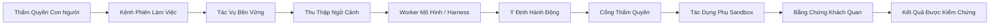

<div align="center">

<picture>
  <source media="(prefers-color-scheme: dark)" srcset="../assets/banner-dark.png">
  <source media="(prefers-color-scheme: light)" srcset="../assets/banner.png">
  
</picture>

# Custos

[ EN ](../../README.md) · [ VI ](README.vi.md) · [ DE ](README.de.md) · [ ZH ](README.zh.md)

</div>

**Một runtime ưu tiên cục bộ (local-first), do con người làm chủ cho các tác vụ agent có bằng chứng kiểm chứng.**

Custos chuyển đổi các cuộc hội thoại trí tuệ nhân tạo tạm thời thành các tác vụ bền vững, được quản trị chặt chẽ với ý định rõ ràng, phạm vi thực thi bị giới hạn, trạng thái có thể phục hồi và kết quả được bảo đảm bằng bằng chứng khách quan. Custos vận hành cục bộ trên các mô hình nội bộ, nhà cung cấp đám mây và các harness lập trình bên ngoài.

---

## Động Lực Cốt Lõi

Các công cụ agent hiện đại tuy mạnh mẽ nhưng thường mắc phải các lỗi kiến trúc mang tính cốt tử:

- **Mất Ngữ Cảnh Tạm Thời:** Ngữ cảnh bị giam cầm trong các silo đóng của từng nhà cung cấp và bị xóa sạch khi chuyển đổi phiên hoặc thay đổi công cụ.
- **Tuyên Bố Thiếu Kiểm Chứng:** Tự nhận định của mô hình về việc hoàn thành nhiệm vụ được chấp nhận mà không hề có bằng chứng hay sự kiểm chứng khách quan độc lập.
- **Tác Dụng Phụ Không Kiểm Soát:** Các đột biến ngoại vi (chỉnh sửa tệp, yêu cầu mạng, lệnh hệ thống) thực thi mà không có cổng kiểm soát năng lực chặt chẽ hoặc nhật ký kiểm toán.
- **Trạng Thái Dễ Đứt Gãy:** Sự cố sập hệ thống, giới hạn tốc độ và tràn ngưỡng ngữ cảnh làm hủy hoại công việc đang tiến hành mà không có cơ chế khôi phục tất định.
- **Xói Mòn Quyền Kiểm Soát Con Người:** Các kiến trúc đa agent mờ ám làm suy giảm sự giám sát của con người và tước đoạt quyền phê duyệt đối với các quyết định hệ trọng.

Custos giải quyết triệt để các vấn đề này bằng mô hình vận hành ưu tiên cục bộ, gắn liền với bằng chứng, nơi quyền chủ quyền của con người là tối thượng và mọi hành động của agent đều được kiểm toán nghiêm ngặt.

---

## Các Khái Niệm Nền Tảng

Custos phân định ranh giới rõ ràng giữa các thực thể vận hành:

- **Phiên Làm Việc (Session):** Kênh tương tác tạm thời (giao diện dòng lệnh, harness IDE, ứng dụng desktop, giao diện hội thoại).
- **Tác Vụ (Task):** Đơn vị bất biến, bền vững chứa đựng ý định, chính sách, trạng thái và tiêu chí nghiệm thu.
- **Lần Chạy (Run):** Một nỗ lực thực thi cụ thể trong vòng đời của một tác vụ đang hoạt động.
- **Ý Định Hành Động (Action Intent):** Đề xuất đột biến ngoại vi được khởi tạo bởi worker mô hình.
- **Giấy Phép Thực Thi (Execution Permit):** Giấy ủy quyền sử dụng một lần, có ràng buộc mật mã do engine thẩm quyền cấp phát.
- **Tác Dụng Phụ (Effect):** Một đột biến được thực thi trong môi trường sandbox, chỉ diễn ra khi có giấy phép thực thi hợp lệ.
- **Bằng Chứng (Evidence):** Tạo phẩm khách quan, có thể kiểm chứng độc lập, chứng minh tính đúng đắn mà không phụ thuộc vào lời khai của mô hình.


```mermaid
flowchart LR
    Human[Thẩm Quyền Con Người] --> Session[Kênh Phiên Làm Việc]
    Session --> Task[Tác Vụ Bền Vững]
    Task --> Context[Thu Thập Ngữ Cảnh]
    Context --> Worker[Worker Mô Hình / Harness]
    Worker --> Intent[Ý Định Hành Động]
    Intent --> Gate[Cổng Thẩm Quyền]
    Gate --> Effect[Tác Dụng Phụ Sandbox]
    Effect --> Evidence[Bằng Chứng Khách Quan]
    Evidence --> Outcome[Kết Quả Được Kiểm Chứng]
```

---

## Kiến Trúc Hệ Thống

Custos vận hành qua ba Vùng Tin Cậy (Trust Zones) tách biệt:

1. **Vùng Không Tin Cậy (Untrusted Zone):** Mô hình bên ngoài, agent worker bên thứ ba, endpoint mạng từ xa và dữ liệu thô chưa qua thẩm định của người dùng.
2. **Vùng Giám Sát (Supervised Zone):** Biên dịch ngữ cảnh, tổng hợp prompt, định tuyến ngữ nghĩa và lập kế hoạch thực thi tạm thời.
3. **Nhân Tin Cậy (Trusted Kernel):** Lưu trữ SQLite ghi trước (WAL), engine thẩm quyền, cổng năng lực và các bộ kiểm chứng hoàn thành.

### Các Crate Trong Không Gian Làm Việc

Mã nguồn được tổ chức thành 11 crate Rust chuyên biệt:

| Phân tầng | Crate | Trách nhiệm cốt lõi |
|---|---|---|
| **Miền (Domain)** | `custos-domain` | Định danh miền thuần túy, mô hình thực thể, máy trạng thái và các bất biến. |
| **Lõi (Core)** | `custos-core` | Dịch vụ điều phối tác vụ, engine thẩm quyền và chính sách hoàn thành. |
| | `custos-persistence` | Di chuyển lược đồ SQLite, kho lưu trữ bền vững và phục hồi sau sự cố. |
| **Runtime** | `custos-runtime` | Vòng đời phiên, tiến trình worker, nhận thức và các phân tầng trí nhớ. |
| | `custos-provider` | Hợp đồng mô hình trung lập nhà cung cấp, giao thức streaming và tokenizer. |
| **Cầu nối & Bộ chuyển đổi** | `custos-bridge` | Thăng cấp Session thành Task và điều phối giao diện lập trình ứng dụng cục bộ. |
| | `custos-adapters` | Hiện thực cụ thể cho mô hình, năng lực công cụ và sandbox thực thi. |
| **Gói Miền (Packs)** | `custos-packs` | Các luồng công việc chuyên biệt: Gói Kỹ thuật, Nghiên cứu và Trợ lý. |
| **Daemon & Giao diện** | `custos-daemon` | Điểm lắp ráp duy nhất của hệ thống và dịch vụ chạy nền daemon. |
| | `custos-sdk` | Đối tượng truyền dữ liệu (DTO) phía client và trừu tượng hóa giao vận. |
| | `custos-cli` | Giao diện dòng lệnh thao tác mỏng dành cho người vận hành. |

---

## Các Cổng Giao Thức và Khả Năng Tương Thích Harness

Daemon cục bộ Custos đóng vai trò cổng tương tác trung tâm thông qua sáu hub chuyên dụng:

- **Model Hub:** Định tuyến yêu cầu giữa các engine cục bộ và nhà cung cấp đám mây với cơ chế dự phòng linh hoạt.
- **Tool Hub:** Quản trị các máy chủ Model Context Protocol (MCP) và công cụ thực thi bên ngoài.
- **Agent Hub:** Quản lý giao tiếp giữa các agent (A2A) và các luồng công việc Agent Communication Protocol (ACP).
- **Storage Hub:** Điều phối lưu trữ bền vững SQLite, lưu trữ nhị phân (blob) và bộ nhớ đệm chỉ mục có cấu trúc.
- **Event Hub:** Phân phối nhật ký kiểm toán thông lượng cao và các sự kiện vòng đời.
- **Operator Hub:** Cung cấp endpoint cục bộ an toàn cho giao diện người vận hành và phiên terminal.

### Các Bộ Điều Hợp Harness

Custos tích hợp liền mạch với các môi trường phát triển bên ngoài mà không làm suy giảm ranh giới an toàn:

- **Claude Code:** Cách ly tiến trình con stdio và bao bọc dòng lệnh an toàn.
- **Codex:** Hoàn thiện mã nguồn và chạy kiểm thử trong môi trường sandbox.
- **Cursor:** Đồng bộ bộ đệm trình soạn thảo và áp dụng diff an toàn.
- **Antigravity:** Điều phối runtime coding agentic và đồng bộ hóa tác vụ bền vững.

---

## Các Gói Miền Chuyên Biệt

Custos cung cấp các gói luồng công việc được thiết kế riêng cho từng lĩnh vực tri thức:

- **Gói Kỹ Thuật (Engineering Pack):** Quy trình kỹ thuật phần mềm tự chủ với các gói bản vá nguyên tử, định vị lỗi đa worker và không gian làm việc ba đường dẫn (kho chuẩn, phân nhánh dàn dựng và sandbox kiểm chứng).
- **Gói Nghiên Cứu (Research Pack):** Luồng điều tra khoa học và kỹ thuật chú trọng gói tái lập nghiên cứu, kiểm chứng sự thật lặp (FIRE), kiểm toán tập dữ liệu và theo dõi thí nghiệm.
- **Gói Trợ Lý (Assistant Pack):** Quản lý luồng công việc cá nhân với nhiều nấc tự chủ, quản trị lịch trình và giao tiếp, duy trì độ ổn định của payload.

---

## Các Bất Biến Hệ Thống

1. **Chủ Quyền Ưu Tiên Cục Bộ:** Toàn bộ dữ liệu tác vụ, chuyển dịch trạng thái, tạo phẩm ngữ cảnh và nhật ký kiểm toán nằm hoàn toàn trên ổ đĩa cục bộ.
2. **Không Đột Biến Ngoài Kiểm Soát:** Không một agent hay mô hình nào được phép sửa đổi hệ thống tệp, thực thi tiến trình hoặc gọi mạng nếu thiếu giấy phép thực thi hợp lệ.
3. **Bằng Chứng Thay Vì Tuyên Bố:** Tác vụ không bao giờ chuyển sang trạng thái hoàn thành chỉ dựa trên tự nhận định của mô hình; bằng chứng độc lập bắt buộc phải được đính kèm.
4. **Giao Dịch Trạng Thái Bền Vững:** Các biến đổi trạng thái được ghi bền vững vào đĩa trước khi lệnh thực thi được phát đi, ngăn chặn mọi trạng thái bất định khi xảy ra sự cố.
5. **Thẩm Quyền Tối Thượng Của Con Người:** Người vận hành con người giữ toàn quyền tạm dừng, thanh tra, sửa đổi hoặc hủy bỏ bất kỳ tác vụ nào tại mọi thời điểm trong vòng đời.

---

## Kiểm Thử Và Thẩm Định

Xây dựng và kiểm tra tính toàn vẹn của không gian làm việc:

```bash
cargo fmt --all -- --check
cargo check --workspace
cargo test --workspace --all-targets
```

---

## Tài Liệu Và Quy Chuẩn

- **Đặc Tả Kiến Trúc:** [Custos.md](../../Custos.md) (Nguồn Sự Thật Duy Nhất - SSOT)
- **Quy Tắc Agent Và Đóng Góp:** [AGENTS.md](../../AGENTS.md)
- **Thư Mục Tài Liệu:** [docs/README.md](../README.md)
- **Tổng Quan Bản Địa Hóa:** [docs/i18n/README.md](README.md)

---

## Giấy Phép

Tệp [LICENSE](../../LICENSE) ở gốc hiện ghi giấy phép MIT. Nguồn gốc và nghĩa vụ ghi nhận mã kế thừa Goose đang được rà soát trong [bản đồ mã upstream](../development/upstream-source-map.md); không suy ra một tệp LICENSE mô tả mọi mã kế thừa.
