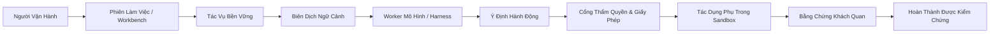

<div align="center">

<picture>
  <source media="(prefers-color-scheme: dark)" srcset="../assets/banner-dark.png">
  <source media="(prefers-color-scheme: light)" srcset="../assets/banner.png">
  
</picture>

[ EN ](../../README.md) · [ VI ](README.vi.md) · [ DE ](README.de.md) · [ ZH ](README.zh.md) · [ JA ](README.ja.md) · [ KO ](README.ko.md) · [ ES ](README.es.md)

</div>

> **Môi Trường Phát Triển Agent Có Giám Sát (SADE) — Ưu Tiên Cục Bộ, Gắn Liền Bằng Chứng, Con Người Làm Chủ.**

Custos là môi trường phát triển và thực thi ưu tiên cục bộ (local-first) dành cho các agent tự trị trong các lĩnh vực kỹ thuật phần mềm, nghiên cứu khoa học và trợ lý quy trình cá nhân. Khác biệt hoàn toàn với các vỏ bọc LLM đơn giản hoặc các hệ thống đa agent mờ ám, Custos áp dụng cơ chế lưu trữ trạng thái tất định, cổng năng lực được kiểm toán bằng mật mã, biên dịch ngữ cảnh gắn với nguồn gốc và yêu cầu bằng chứng thực nghiệm khách quan trước khi bất kỳ tác vụ nào được công nhận hoàn thành.

---

## Động Lực Cốt Lõi

Các công cụ agent hiện đại tuy sở hữu năng lực sinh văn bản lớn nhưng mắc phải những lỗi kiến trúc mang tính cốt tử:

- **Mất Ngữ Cảnh Tạm Thời:** Ngữ cảnh bị giam cầm trong các silo đóng của từng nhà cung cấp và bị xóa sạch khi chuyển đổi công cụ hoặc khởi động lại phiên.
- **Tuyên Bố Thiếu Kiểm Chứng:** Tự nhận định của mô hình về việc hoàn thành nhiệm vụ được chấp nhận mà không hề có bằng chứng hay sự kiểm chứng thực nghiệm độc lập.
- **Tác Dụng Phụ Không Kiểm Soát:** Các đột biến ngoại vi (chỉnh sửa tệp, yêu cầu mạng, lệnh hệ thống) thực thi mà không có cổng kiểm soát năng lực chặt chẽ hoặc nhật ký kiểm toán.
- **Trạng Thái Dễ Đứt Gãy:** Sự cố sập hệ thống, giới hạn tốc độ và tràn ngữ cảnh làm hủy hoại công việc đang tiến hành mà không có cơ chế khôi phục tất định.
- **Xói Mòn Quyền Kiểm Soát Con Người:** Các vòng lặp đa agent mờ ám làm suy giảm sự giám sát của con người và triệt tiêu các điểm phê duyệt then chốt.

Custos giải quyết triệt để các vấn đề này bằng mô hình vận hành gắn liền với bằng chứng, nơi quyền chủ quyền của con người là tối thượng và mọi hành động của agent đều được quản trị nghiêm ngặt.

---

## Ba Trụ Cột Không Thể Thương Lượng

| Trụ cột | Nguyên lý cốt lõi | Bảo đảm kiến trúc |
|---|---|---|
| **P1 — Tác Vụ Là Thực Thể Hạng Nhất** | Tác vụ tồn tại độc lập với phiên làm việc và kết nối | Lưu trữ SQLite WAL bền bỉ, phục hồi tất định sau sự cố, và sổ cái lệnh (Command Ledger) lũy kế tránh trùng lặp. |
| **P2 — Đề Xuất ≠ Quyết Định ≠ Tác Động** | Mô hình đề xuất; Nhân cấp phép; Cổng thực thi | Mô hình AI chỉ phát sinh `ActionIntent`; Nhân (Kernel) ký giấy phép đơn lần `ExecutionPermit`; Sandbox kiểm soát cổng năng lực qua Outbox. |
| **P3 — Hoàn Thành Gắn Liền Bằng Chứng** | Không có hoàn thành nếu thiếu bằng chứng thực tế | Tiêu chí nghiệm thu chỉ vượt qua khi có tạo phẩm độc lập (diffs, vết chạy kiểm thử, đối chiếu trích dẫn); triệt tiêu hoàn toàn hoàn thành ảo. |

---

## Cơ Chế Vận Hành


```mermaid
flowchart LR
    Human[Người Vận Hành] --> Session[Phiên Làm Việc / Workbench]
    Session --> Task[Tác Vụ Bền Vững]
    Task --> Context[Biên Dịch Ngữ Cảnh]
    Context --> Worker[Worker Mô Hình / Harness]
    Worker --> Intent[Ý Định Hành Động]
    Intent --> Gate[Cổng Thẩm Quyền & Giấy Phép]
    Gate --> Effect[Tác Dụng Phụ Trong Sandbox]
    Effect --> Evidence[Bằng Chứng Khách Quan]
    Evidence --> Outcome[Hoàn Thành Được Kiểm Chứng]
```

---

## Ba Lăng Kính Chuyên Miền (Three Specialized Domain Lenses)

Custos cung cấp các mô hình tương tác và bộ máy kiểm chứng chuyên biệt cho từng miền nhận thức:

### 1. Lăng Kính Kỹ Thuật (Engineering Lens - Bàn Làm Việc Lập Trình)
- **Không Gian Thực Thi 3 Tuyến (3-Path Workspaces):** Tách biệt an toàn giữa kho lưu trữ chuẩn (canonical repo), nhánh trung gian (staging fork) và sandbox kiểm chứng.
- **Bó Vá Nguyên Tử (Atomic Patch Bundles):** Ràng buộc diff có cấu trúc với quy trình kiểm tra cú pháp và lint tự động trước khi staging.
- **Cách Ly Lease Cây Làm Việc (Worktree Lease Isolation):** Fencing các thao tác ghi đồng thời trên cùng worktree để ngăn chặn tranh chấp và mất dữ liệu.

### 2. Lăng Kính Nghiên Cứu (Research Lens - Bàn Làm Việc Nghiên Cứu)
- **Cấp Bậc Xác Thực Khẳng Định (Claim Grounding):** Phân định 4 bậc nhận thức nghiêm ngặt: `L0 Chưa Kiểm Chứng`, `L1 Có Trích Dẫn`, `L2 Bình Duyệt Chuyên Gia`, `L3 Tái Hiện Thực Nghiệm`.
- **Thẩm Định Trích Dẫn (Citation Coverage Oracle):** Đối soát nguồn DOI/tài liệu khoa học đã công bố và từ chối các xác nhận suông của mô hình.
- **Phòng Tổng Hợp (Synthesis Studio):** Chuyển hóa tổng hợp tài liệu đa nguồn thành các giả thuyết có thể kiểm chứng và các mẻ thực nghiệm có thể tái hiện.

### 3. Lăng Kính Trợ Lý (Assistant Lens - Bàn Làm Việc Trợ Lý & Dùng Chung)
- **Hàng Đợi Phê Duyệt Outbox (Outbox Approval Queue):** Giữ các liên lạc gửi ra và các đột biến quan trọng sau trạng thái chờ người dùng duyệt bền vững.
- **Ủy Quyền Thường Trực (Standing Grants):** Cho phép ủy quyền có chính sách đối với tác vụ định kỳ trong khi vẫn kích hoạt can thiệp con người đối với hành động rủi ro cao.
- **Môi Trường Tích Hợp:** Hợp nhất quyền truy cập an toàn vào trình duyệt sandbox, terminal PTY, máy chủ từ xa và ghi chú bền vững.

---

## 10 Bất Biến Hệ Thống Bất Di Bất Dịch

1. **INV-01 (Chủ Quyền Ưu Tiên Cục Bộ):** Toàn bộ trạng thái, hợp đồng, tác vụ và dữ liệu đo đạc telemetry nằm hoàn toàn trên đĩa cục bộ.
2. **INV-02 (Không Nguyên Tử Ảo):** Mọi chuyển dịch trạng thái phải được commit vào SQLite trước khi phát lệnh hành động ra ngoài.
3. **INV-03 (Giấy Phép Trước Tác Động):** Không một đột biến ngoại vi nào được phép chạy nếu thiếu `ExecutionPermit` hợp lệ.
4. **INV-04 (Ràng Buộc Danh Tính Tác Tử):** Danh tính của actor được xác thực từ tầng transport, không bao giờ tin payload tự khai.
5. **INV-05 (Bằng Chứng Vượt Trên Lời Khai):** Nghiệm thu tác vụ đòi hỏi tạo phẩm thực nghiệm được kiểm chứng, không tin khẳng định suông của mô hình.
6. **INV-06 (Trung Thực Năng Lực Giao Diện):** Giao diện UI lập tức chuyển sang trạng thái an toàn đóng (`unavailable`/`degraded`) khi dịch vụ nền thiếu hụt.
7. **INV-07 (Cách Ly Lease Cây Làm Việc):** Các thao tác ghi đồng thời trên cùng working tree được fencing chặt chẽ để chống mất dữ liệu.
8. **INV-08 (Giới Hạn Biên Tài Nguyên):** Mọi tiến trình thực thi, bộ đệm dòng và cắt tỉa token đều tuân thủ ngưỡng byte nghiêm ngặt.
9. **INV-09 (Kiểm Toán Toàn Bộ Transports):** Mọi đột biến đều đi qua Command Ledger với xác thực băm digest chống replay.
10. **INV-10 (Chủ Quyền Tối Thượng Của Con Người):** Người vận hành giữ toàn quyền tạm dừng, điều hướng hoặc hủy bỏ tác vụ ở bất kỳ thời điểm nào.

---

## Cấu Trúc Crate & Kiến Trúc Không Gian Làm Việc

Custos phân định nghiêm ngặt giữa logic thuần túy và tác dụng phụ qua các package Cargo phân tầng:

| Phân tầng | Đường dẫn Crate | Tên Package | Trách nhiệm cốt lõi |
|---|---|---|---|
| **Tầng 0 (Domain)** | `crates/custos-domain` | `custos-domain` | Định danh miền thuần túy, mô hình thực thể, máy trạng thái và các bất biến Zero-I/O. |
| **Tầng 1 (Core)** | `crates/custos-core` | `custos-core` | Dịch vụ điều phối tác vụ, engine thẩm quyền và các bộ kiểm chứng hoàn thành. |
| | `crates/custos-persistence` | `custos-persistence` | Lưu trữ SQLite WAL, mô hình Outbox, chuyển dịch trạng thái CAS `state_version` và phục hồi sự cố. |
| | `crates/custos-provider` | `custos-provider` | Hợp đồng mô hình trung lập `ModelPort`, bộ giải mã streaming SSE và tokenizer. |
| **Tầng 2 (Runtime & Adapters)** | `crates/custos-bridge` | `custos-bridge` | Thăng cấp Session thành Task, điều hướng luồng bay (steer) và định tuyến IPC. |
| | `crates/custos-runtime` | `custos-runtime` | Vòng lặp nhận thức S1/S2, nén ngữ cảnh (RTK), các tầng bộ nhớ và bộ lập kế hoạch. |
| | `crates/custos-adapters` | `custos-adapters` | Sandbox hệ điều hành, adapter client MCP, sidecar suy luận cục bộ, Git worktree và bộ chuyển đổi giao thức. |
| **Tầng 3 (Domain Packs)** | `crates/custos-packs` | `custos-packs` | Quy trình chuyên biệt theo miền nghiệp vụ: Gói Kỹ thuật (Engineering), Nghiên cứu (Research), Trợ lý (Assistant). |
| **Tầng 4 (Lắp Ráp & Host)** | `crates/custos-daemon` | `custos-daemon` | Điểm khởi tạo và lắp ráp duy nhất (Composition Root), dịch vụ daemon nền, HTTP/JSON-RPC cục bộ. |
| | `crates/custos-sdk` | `custos-sdk` | Đối tượng truyền dữ liệu (DTO), UniFFI bindings và kiểu dữ liệu dây ACP. |
| | `crates/custos-app/cli` | `custos-app-cli` | Giao diện dòng lệnh tương tác qua TUI (`ratatui`). |
| | `crates/custos-app/desktop` | `custos-app-desktop` | Vỏ bọc native Tauri 2 tích hợp trực tiếp giao diện `ui/desktop`. |

---

## Giao Diện Desktop

Giao diện Desktop Custos được phát triển trên nền **Vite, React 19 và Tauri 2**:

- **Cấu Trúc 3 Cấp:** Điều hướng phân cấp trực quan qua `Dự Án -> Không Gian Làm Việc -> Cây Làm Việc (Project -> Workspace -> Worktree)`.
- **Hệ Thống Token Graphite JetBlack:** Tông màu tối hiện đại, tương phản cao, tối ưu hóa cho các phiên làm việc kéo dài.
- **Bàn Làm Việc Chuyên Biệt (Workbenches):**
  - **Kỹ thuật (Engineering):** Tệp & Thay đổi, Bằng chứng thực nghiệm, và Trình quản lý Worktree.
  - **Nghiên cứu (Research):** Phòng tổng hợp (Synthesis Studio), Phát hiện khoa học, và Sổ cái lượt chạy.
  - **Trợ lý & Dùng chung (Assistant & Shared):** Trình duyệt nhúng, Terminal, Hạm đội máy chủ từ xa, và Ghi chú.
- **Chính Sách Không Dữ Liệu Ảo (Zero-Mock Policy):** Mọi chỉ số trên UI phản ánh chính xác số liệu viễn trắc thật từ daemon và chuyển sang chế độ an toàn khi dịch vụ bị gián đoạn.

---

## Các Trục Giao Thức (Hubs) & Tích Hợp Harness Ngoài

Daemon Custos đóng vai trò là cổng liên thông trung tâm thông qua 6 Hub chức năng:

- **Model Hub:** Định tuyến yêu cầu giữa các engine cục bộ (GGUF, llama.cpp) và các nhà cung cấp đám mây (Anthropic, OpenAI, Gemini, Bedrock) với khả năng tự động fallback.
- **Tool Hub:** Quản trị các server Model Context Protocol (MCP) và các công cụ thực thi sandbox.
- **Agent Hub:** Điều phối giao thức giao tiếp Agent-to-Agent (A2A) và Agent Communication Protocol (ACP).
- **Storage Hub:** Quản lý lưu trữ SQLite WAL, lưu trữ blob và các chỉ mục có cấu trúc.
- **Event Hub:** Phân phối các sự kiện vòng đời và nhật ký kiểm toán thông lượng cao.
- **Operator Hub:** Cung cấp endpoint bảo mật cho CLI và giao diện Desktop.

### Giám Sát Harness Ngoài
Custos bao bọc và giám sát các harness lập trình phổ biến mà không làm xáo trộn cơ chế nội bộ của chúng:
- **Claude Code:** Cách ly tiến trình con qua Stdio và bao bọc lệnh an toàn.
- **Codex:** Hoàn thiện mã nguồn và chạy kiểm thử trong sandbox.
- **Cursor:** Đồng bộ bộ đệm editor và áp dụng diff an toàn.
- **Antigravity:** Đồng bộ tác vụ và phối hợp runtime lập trình agentic.

---

## Cổng Kiểm Soát Chất Lượng & Kiểm Thử

Mọi đóng góp mã nguồn đều phải vượt qua các cổng kiểm soát nghiêm ngặt:

```bash
# 1. Cổng chặn cứng Clippy Rust (0 cảnh báo, 0 lỗi)
cargo clippy --workspace --all-targets -- -D warnings

# 2. Toàn bộ test suite (>1,670 tests, 100% pass)
cargo test --workspace --all-targets

# 3. Kiểm tra kiểu và đóng gói giao diện Desktop
cd ui/desktop && npm run build
```

---

## Tài Liệu & Tham Chiếu

- **Đặc Tả Kiến Trúc Chuẩn:** [Custos.md](../../Custos.md)
- **Quy Tắc Agent & Đóng Góp:** [AGENTS.md](../../AGENTS.md)
- **Tiêu Chuẩn Thiết Kế Desktop UI:** [.agents/rules/desktop_ui_architecture_standards.md](../../.agents/rules/desktop_ui_architecture_standards.md)
- **Quy Trình Git PR:** [.agents/rules/git_pr_workflow.md](../../.agents/rules/git_pr_workflow.md)
- **Mục Lục Tài Liệu Quốc Tế Hóa:** [docs/i18n/README.md](README.md)

---

## Bản Quyền

Custos được phân phối dưới giấy phép **GNU AGPL-3.0-or-later**. Giấy phép bao gồm điều khoản nghiêm ngặt về Nhãn hiệu nhằm bảo vệ thương hiệu Custos và nghiêm cấm việc đóng gói thành dịch vụ SaaS thương mại mã nguồn đóng. Xem chi tiết tại [LICENSE](../../LICENSE).
