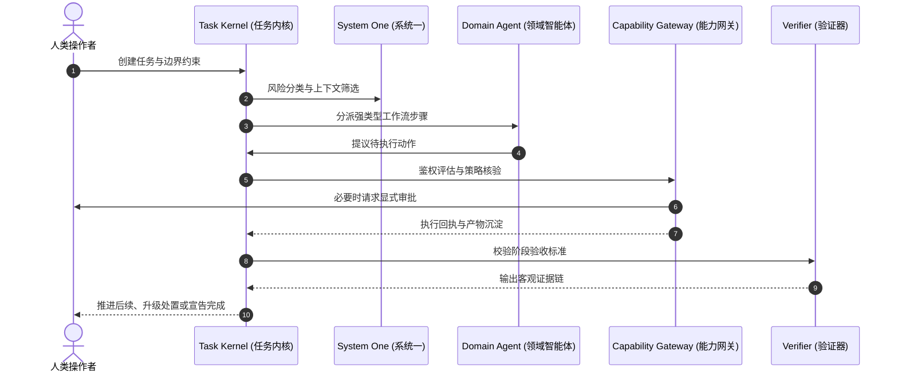
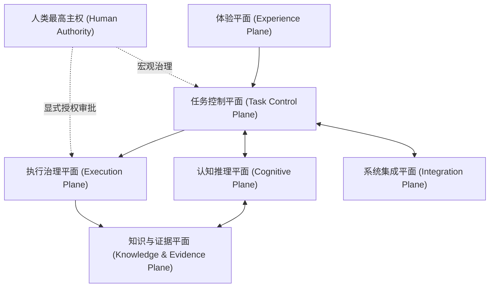

<div align="center">

<picture>
  <source media="(prefers-color-scheme: dark)" srcset="../assets/banner-dark.png">
  <source media="(prefers-color-scheme: light)" srcset="../assets/banner.png">
  
</picture>

**由人类主导的专业化智能体工作空间**

*在您自选的模型之上展开 Vibe Coding、科研探索与个人工作流 — 具备持久化状态、受控执行、成本感知上下文以及可独立验证的确定成果。*

<br />

[ EN ](../../README.md) | [ VI ](README.vi.md) | [ DE ](README.de.md) | [ ZH ]

<br />

[](../../LICENSE)
[](../canonical-specification.md)
[](../architecture/overview.md)
[](../architecture/deployment.md)

</div>

---

## Custos 的含义

Custos 源自拉丁语，意为**守护者**（Guardian）。

这一命名准确体现了系统的核心使命：Custos 守护 AI 协作过程中的连续性、控制权、隐私边界、系统资源与客观实证，而将最终的意图与裁决责任完全保留在人类手中。

Custos **不是**另一个无休止自主运行的“超级智能体”，也绝非仅仅聚合若干模型 API 的聊天外壳。它是一个本地优先（Local-First）的运行时与统一工作空间，让人类、专业化智能体、AI 模型、本地工具与知识体系通过持久化且受治理的任务协同运作。

接入您信任的模型，以最自然的方式开展工作。Custos 负责确保整个流程连贯、可控、随时可恢复并具备严格的可验证性。

---

## 核心痛点

当下的 AI 编程与研究工具功能强大，但其外围的工作流却严重割裂：

- **上下文孤岛：** 工作成果被禁锢在各供应商专有的对话窗口与封闭会话中。
- **上下文丢失：** 每次切换模型或工具链时，必须从零反复重建上下文。
- **Token 严重浪费：** 智能体不断低效重读整个仓库、日志和长文档。
- **成本失控与低效：** 往往被迫使用单一昂贵的大模型去处理本可在本地或廉价完成的任务。
- **脆弱的回退机制：** 在不同供应商间回退时，工具调用、推理逻辑或结构化输出语义常常静默失效。
- **未经实证的主张：** AI 生成的代码和研究结论往往在缺乏独立客观实证的情况下被直接采纳。
- **不可控的副作用：** 工具调用在缺乏统一步长作用域、事前审批或审计日志的情况下直接执行。
- **脆弱的长时运行：** 长任务极易因系统崩溃、速率限制（Rate Limits）、重启或上下文超限而中断报废。
- **缺乏可复用性：** 个人偏好与经过验证的成功工作流难以被安全沉淀和跨项目复用。
- **丧失控制权：** 多智能体系统往往徒增复杂度，却进一步削弱了人类的主导权。

其结果使用户陷入两难困境：要么被迫手动粘合各自分离的 AI 工具，要么向黑盒般的无监督自主系统过度让渡权限。

---

## 产品愿景与目标

Custos 致力于让 AI 辅助工作既能如 "Vibe Coding" 般流畅自如，又具备严谨工程、科研攻坚与个人工作流所需的结构化规范与工程纪律。

系统的基础单元是**持久化任务（Durable Task）**，而非临时对话会话。任务完整封装了自身的目标、范围、约束条件、工作流、预算额度、上下文、裁决记录、审批授权、产物（Artifact）、客观实证（Evidence）以及断点恢复状态。

一个持久化任务能够：
- 始于某一模型，并无缝流转至另一模型继续推进；
- 挂起等待人类介入，并在系统重启后平滑复原；
- 在编程（Coding）、科研（Research）与助理（Assistant）各领域间顺畅移交；
- 根据用户配置的策略在本地或远程模型间动态路由；
- 受到 Token、资金消耗、执行步数及物理时间的严格预算约束；
- 唯有在验收条件获得可信实证支撑时才宣告完结。

---

## 核心产品体验

Custos 围绕三种自然的工作范式进行架构设计。

### Vibe Coding
吩咐 Custos 解析代码仓库、剖析系统架构、排查缺陷、实现新功能、审查代码变更、执行技术栈迁移或筹备版本发布。

Custos 能够增量索引代码仓库、提取关键符号拓扑、拟定工作流、调度选定的编程模型、在隔离的 worktree 中实施变更、运行针对性验证，并将最终生成的 diff 与验证结果一并呈递给人机审查。

### Vibe Research
吩咐 Custos 调研特定课题、横向比对学术文献、提取核心论断、识别论点冲突、将文献转化为技术实现规格、设计验证实验、执行基准测试或撰写溯源报告。

Custos 严密追踪研究问题、文献源、主张论点、实验数据、前置假设、数据集、实验配置指纹、悬而未决的问题及引用状态，避免将严谨科研降维成一段轻量总结。

### Vibe Assistant
使用 Custos 整理笔记、管理技术文档、制定规划、编排定期工作流、处理本地私有数据，并协调围绕编程与科研展开的外围事务。

Assistant 领域能够提炼断点续行摘要、组织输出成果、协同跨领域任务，并在安全策略与审批边界之内稳妥提议外部系统交互。

---

## 专业化智能体领域

编程（Coding）、科研（Research）与助理（Assistant）是面向产品能力划分的智能体领域（Agent Domains），而非长驻后台的拟人化角色。

每个领域由一个独立的 **Domain Pack** 完整定义：

```text
Agent Domain
  = Task Types
  + Workflow Templates
  + Context Recipes
  + Memory Policy
  + Tool Capabilities
  + Cognitive Routing
  + Verification Profiles
  + Domain UX
```

| 领域 | 典型任务 | 快速决策 (System 1) | 深度审思 (System 2) | 完成判据实证 |
|---|---|---|---|---|
| **Coding** | 仓库理解、缺陷修复、特性开发、重构、审查 | 文件与符号重排、风险快筛、测试集定向选择 | 系统架构、方案规划、编码实现、复杂调试 | 代码 Diff、构建收据、单元测试、Linter 与安全扫描报告 |
| **Research** | 文献综述、主张提取、对比实验、基准评测 | 相关性初筛、去重、信源审查、矛盾检测 | 综合归纳、假设构建、实验方案设计 | 精确引用源、数据集哈希、配置快照与指标度量 |
| **Assistant** | 文档编排、笔记结构化、日程规划、本地流协同 | 任务分类、优先级判定、隐私级别与动作风险过滤 | 文本起草、深度分析、多阶段规划编排 | 人工显式批准、交付回执与变更操作日志 |

多个领域可在同一任务中高效协同。例如：Research 工作流产出附带实证依据的技术规格书；Coding 领域据此编码并运行基准测试；Assistant 领域对最终产物进行归档并派生后续跟进任务。

---

## 人类主权、系统一与系统二

Custos 对系统内的权责边界进行了严格的三权划分：

| 参与主体 | 核心职责 | 职权边界 |
|---|---|---|
| **人类主权者 (Human Principal)** | 输入意图、设定边界、价值导向、审批授权与承担最终责任 | 拥有最高裁决权与一票否决权 |
| **系统一 (System One)** | 快速分类、相关性重排、前置过滤、风险快筛与上报触发 | 仅具备建议权与策略初筛门禁权 |
| **系统二 (System Two)** | 深度逻辑推演、分步规划、信息综合、代码生成与审查 | 提议决策方案与动作调用 |

系统一可通过确定性规则、本地轻量分类器、向量检索、小型语言模型（SLM）或专用评估引擎予以实现。系统二则调用前沿推理大模型、专业编码智能体或本地部署的深度推理引擎。

系统一与系统二均无权为自身授予执行特权。任务状态机（Task Kernel）全权掌管状态迁移，而能力网关（Capability Gateway）严格管控所有外部副作用。

---

## 自由选择与掌控模型

用户对模型及供应商的选用享有完全裁决权。

Custos 原生支持三种路由模式：

| 模式 | 行为特征 |
|---|---|
| **手动 (Manual)** | 为特定任务或角色静态绑定指定模型 |
| **辅助 (Assisted)** | Custos 智能推荐适配模型，由用户确认采纳 |
| **自动 (Automatic)** | Custos 在用户批准的服务商、能力矩阵、隐私策略与预算配额内动态选路 |

编程智能体既可单模型贯穿全程，亦可按专业分工组合协同：

```yaml
agents:
  coding:
    planner: anthropic/claude
    implementer: openai/codex
    reviewer: ollama/qwen-coder
  research:
    screener: ollama/qwen
    synthesizer: google/gemini
    critic: anthropic/claude
```

智能体工作流仅显式声明所需的能力规格，坚决杜绝硬编码特定商业供应商。模型网关（Model Gateway）负责将规格需求与用户已连接的实际模型能力进行精准撮合。

更换模型绝不能破坏任务状态、记忆图谱、产物沉淀、审批链或验证证据。平台无关的续行报文（Continuation Packet）封装了跨越模型与智能体边界所需的一切上下文。

---

## 繁简由心：极简开箱即用

Custos 并不强制要求配置复杂的多模型编排矩阵。

开发者完全可以使用单一喜欢的编程模型即刻投入工作：

```bash
custos code --model codex
```

仓库轻量索引、上下文精炼、预算硬性约束、工具沙箱治理、断点复原、自动化测试与实证链归档等企业级机制，依然在极简命令行之下完备运行。

高级路由编排是灵活进阶的选项，绝非前置门槛。

---

## 工作流编排器

自然语言的初衷意图可被系统转化为强类型且可供审查的 `WorkflowPlan`。

Custos 支持四种编排模式：

| 模式 | 描述 |
|---|---|
| **手动 (Manual)** | 人类直接把控每一个微观步骤 |
| **建议 (Suggested)** | Custos 在执行前生成完整工作流方案供审查 |
| **自适应 (Adaptive)** | 在经批准的边界之内，工作流可根据阶段执行反馈动态微调 |
| **可复用 (Reusable)** | 沉淀验证通过的成功工作流为受治理的标准模板 |

工作流编排器（Workflow Composer）全面考量：
- 任务意图与归属领域；
- 所需模型的能力规格；
- 上下文与记忆配方；
- 隐私分级与网络出站策略；
- 涉及的工具及其潜在副作用；
- 风险评级与人工审批拦截点；
- Token、资金与物理时间预算；
- 验收标准与必需的交付实证。

系统可提示将反复执行的高效流程保存为规范模板，但绝不盲目持久化敏感凭证、临时会话或冗余杂质。

---

## 个人工作画像

Custos 能够自主调适以贴合每位工程师特有的编码习惯、科研范式、代码审查标准与决策倾向。

用户工作画像（User Work Profile）可包含：
- 偏好的交互与解释深度；
- 偏好的模型矩阵及本地计算与云端服务的取舍策略；
- 重点保护的代码仓库、文件路径与敏感分支；
- 团队代码规范与强制检查项；
- 科学文献来源信任列表与引用格式；
- 审批介入阈值；
- 默认 Token、成本与时间消耗限额；
- 可复用工作流偏好。

个性化数据全程透明、支持随时检查与人工修订。记忆项具备明确的作用域、数据来源、置信评分、时间戳、保留生命周期与彻底删除控制机制。

---

## 成本优化与运行性能

Custos 将全局优化锚定在用户所选的模型拓扑上，而非将每个琐碎判断无脑抛向高成本云端大模型。

### 上下文效率
- 增量式仓库与私有知识库索引。
- 符号拓扑感知与相关度评分驱动的上下文精选。
- 严格受预算配额控制的 Context Pack。
- 内容可寻址产物（Content-Addressed Artifacts），取代在 Prompt 中反复灌入庞大输出。
- 安全截断工具调用冗余输出，同时保留完整原始产物链接。
- 具备显式失效策略的上下文与检索两级缓存。

### 认知效率
- 依靠规则集、本地小模型与专用判断器处理低成本初筛。
- 仅在确有必要进行深层逻辑演绎时才向系统二升级。
- 基于能力规格的动态模型撮合。
- 用户显式批准的模型回退链条。
- 具备死循环拦截、状态发散阻断与重复动作熔断机制。

### 执行效率
- 增量编译构建与聚焦局部的高频测试，前置于全量回归验证。
- 状态强持久化，彻底杜绝意外重启带来的推倒重来。
- 仅对经授权且相互独立的步骤实施并发调度。
- 运行时全局硬性施加 Token、资金、重试与物理耗时配额。

Custos 确保所配策略与预算被百分之百严格执行。但它并不粉饰跨模型能力的客观差距，也无法将能力不匹配的模型强行拔高为一流的编码引擎。

---

## 任务执行生命周期流转



在生命周期的任何时间点，人类均可查看运行时状态、挂起操作、重定向分支、更换允许使用的模型、重构工作流、收紧权限或终止任务。

---

## 默认本地优先

Custos 自底层起便专为在用户本地设备上顺畅运行而设计。

- 任务状态机、治理策略、访问权限与审计日志默认保留在本地。
- 敏感的代码仓库与私有文档数据不出本地边界。
- 支持完全使用本地离线模型处理涉及隐私或高频的任务。
- 远端模型仅接收经本地策略明确脱敏与精选的上下文片段。
- API 密钥由操作系统级安全钥匙串托管，严禁序列化至任务状态中。

*本地优先并不意味着切断网络连接：外部云端能力随时可通过显式适配器与出站审计策略平滑协同。*

---

## 崇尚证据，而非模型盲目自信

模型单方面声称“工作已完成”绝不等于实际交付。

Custos 要求提供确凿客观的交付实证：
- 通过所有单元测试与构建成功的官方收据；
- 清晰准确的代码 Diff 与静态代码检查（Linter）无告警证明；
- 确凿的文献引用源与论点–证据锚定关系；
- 数据集与环境配置的不可变密码学哈希；
- 可重复复现的基准评测度量指标；
- 工具实际执行的防篡改调用凭据；
- 人类审查员的显式通过决定。

任务能否完成的裁决权归属于任务契约（Task Contract）与领域的验证器配置，而非生成回答的那个模型。

---

## 系统功能架构



| 平面 | 核心职责 |
|---|---|
| **Experience** | 统一 CLI、VS Code 扩展插件及未来本地 GUI 界面 |
| **Task Control** | 持久化状态机、调度器、预算控制、断点恢复与跨会话续行 |
| **Cognitive** | 系统一初筛决策、系统二深度推演与工作流自动化编排 |
| **Execution** | 原子能力管理、授权凭证（Permit）、审批流水线、Worktree 与沙箱隔离 |
| **Knowledge & Evidence** | 动态上下文、长短记忆系统、不可变产物、数据溯源与证据链闭环 |
| **Integration** | 模型网关、第三方智能体、MCP、A2A 通信协议、本地守护进程与密钥保险库 |

安全性、隐私权、全局可观测性与资源消耗管控，作为第一公民横切贯彻于上述所有平面。

---

## 网关信任边界

Custos 严格将外部网络连通性与系统内部的实质行动授权剥离开来。

### 模型网关 (Model Gateway)
统管模型动态探测、能力标签匹配、请求语义转换、健康心跳探测、调用配额管控、成本核算与合规回退选路。

### 协议网关 (Protocol Gateway)
统管 MCP 工具与 A2A 智能体协议的自发现、传输层通道、跨域联盟、身份认证、流量准入策略与调用遥测。

### 能力网关 (Capability Gateway)
所有能引发系统环境发生物理副作用操作的**唯一受信任入口**。负责严格校验执行范围（Scopes）、人工授权、载荷哈希绑定、时间过期机制、预算限额与执行回执。

模型网关与协议网关绝无权限擅自篡改任务状态机、凭空签发执行许可、变更记忆系统或私自判定任务完工。

---

## 目标产品交互界面

Custos 规划的核心交互矩阵包括：

| 界面模块 | 核心用途 |
|---|---|
| **任务工作空间 (Task Workspace)** | 浏览目标树、执行规划、智能体协作交接、关联产物与断点续行 |
| **审批收件箱 (Approval Inbox)** | 逐项审查具体操作提议、潜在风险、影响范围与权限有效期 |
| **模型舰队 (Model Fleet)** | 连接自选模型、洞悉能力雷达、监视健康度、成本统计与回退规则 |
| **协议网状网 (Protocol Mesh)** | 统一检视已加载的 MCP 工具、资源、服务节点与 A2A 对等智能体 |
| **上下文检视器 (Context Inspector)** | 深入探查具体选用了哪些上下文数据及其背后的筛选评分理由 |
| **运行时间线 (Run Timeline)** | 精确回溯人类、智能体、判断器、物理动作与回执的完整时序图谱 |
| **证据浏览器 (Evidence Explorer)** | 沿着证据链路正向与逆向追溯每一个主张、改动及其背后的证明文件 |

---

## 代码仓库分层架构

Custos 严格遵循 Rust 核心驱动的多语言 Monorepo 与六边形端口适配器架构（Ports-and-Adapters）。

```text
custos/
├── apps/                    # Daemon 后台守护进程、CLI 及用户交互前端应用
├── crates/                  # 经最高信任认证的 Rust 核心领域与运行时组件
├── adapters/                # 外部模型适配器、供应商网关、判断器与本地工具链
├── sidecars/                # 进程隔离的 TypeScript 或 Python 扩展伴生服务
├── domain-packs/            # 针对工程、科研与个人事务的专用工作流包
├── schemas/                 # 跨语言、跨进程版本化契约接口规范
├── tests/                   # 契约测试、跨模块集成测试、灾难恢复与安全渗透测试
├── evals/                   # 智能体能力评估套件与端到端工作流评测基准
├── docs/                    # 涵盖产品、架构设计、通信协议与运维的文档体系
└── lab/upstreams/           # 经过审计的学术前沿参考源；严禁打包进生产运行时
```

被信任的 Rust 核心独占任务状态流转、权限签发、持久化可靠性、存储引擎、执行治理与证据归档闭环。TypeScript 与 Python 伴生组件仅能通过版本化强类型契约与核心通信，无权直接操作 Custos 底层数据库或为自身提升权限。

---

## 核心领域概念表

| 概念标识 | 规范定义 |
|---|---|
| **Task** | 用户级的持久化基础工作单元 |
| **TaskContract** | 封装目标、边界范围、前置约束、预算上限与验收标准的严格契约 |
| **Run** | 任务在特定上下文中的一次完整执行尝试周期 |
| **WorkflowPlan** | 强类型的领域执行步骤与其依赖关系的编排计划 |
| **ContextPack** | 针对特定执行者精准装配、受预算控制且具备溯源信息的上下文数据包 |
| **ActionIntent** | 智能体发起的包含物理副作用的操作提议 |
| **ExecutionPermit** | 限定操作范围、绑定载荷特征、具备严格失效时限的高权限执行许可证 |
| **Receipt** | 记录已执行动作及其客观物理产出结果的防篡改收据 |
| **Artifact** | 具备全局唯一标识与溯源链的不可变实体产物 |
| **Evidence** | 经由独立验证器规则检验或人工显式核验采纳的权威证据 |
| **ContinuationPacket** | 跨越模型与智能体边界用以复原或移交任务的厂商中立状态包 |
| **DomainPack** | 针对特定领域定制的工作流、上下文模板、策略约束与验证器总成 |
| **OutcomeBundle** | 任务收官时交付的终版成果集、实证支撑、决策历史与成本统计全景包 |

---

## 非目标定义 (Non-Goals)

Custos **坚决不做**：
- 另一个通用基础大语言模型；
- 捆绑销售的强制性商业模型分发市场；
- 一组长期在线闲聊但缺乏交付标准的虚拟人偶；
- 将原始聊天记录改头换面后声称的所谓“长效记忆库”；
- 毫无安全边界、随意操作系统底层的高危自主黑客程序；
- 企图取代每一种专用 IDE 或专业文献分析工具的冗余复刻品；
- 将大模型的概率置信度误当作形式化科学证明的妥协系统；
- 试图向用户隐瞒真实工作流、代币账单、网络出站或授权细节的黑箱软件。

---

## 项目当前研发状态

Custos 目前处于早期高频演进阶段。

本规范清晰勾勒了已达成共识的总体系统架构以及最终的产品交互体验。并不意味着文档中列出的所有子系统均已完成代码落地。

在技术文档中，各项核心能力均有明确的状态标定：
- **Implemented** — 已实现，且拥有完备的自动化测试覆盖；
- **Experimental** — 代码可运行，但接口与行为尚未冻结；
- **Specified** — 已形成正式契约或设计规范，待编码实现；
- **Proposed** — 处于架构评审与技术方案论证阶段。

首个端到端产品原型垂直切片（Vertical Slice）旨在跑通：

```text
人类创建编程任务 (Coding Task)
  → Custos 规划并提议结构化工作流
  → 用户挑选信任的模型
  → 系统从代码仓库增量抽取并装配上下文
  → 编程智能体在安全治理下提议并实施代码改动
  → 自动化测试与代码 Diff 转化为可信实证
  → 人类审查包含完整溯源链的 Outcome Bundle 并优雅收官
```

---

## 文档体系导航

详尽的架构规范与技术协议统一部署于 `docs/` 目录：

```text
docs/
├── 00-start-here.md         # 新手入门与全景指引
├── product/                 # 智能体领域定义、工作流模板、UX 规范与个性化画像
├── architecture/            # 运行时内核、网关矩阵、上下文策略、记忆架构与实证闭环
├── protocols/               # 任务协议、动作模式、模型抽象与任务续行版本化契约
├── security/                # 威胁建模分析、信任域隔离与隐私合规架构
├── operations/              # 本地安装部署、生产运行配置与故障诊断指南
├── reference/               # 系统领域概念详述、核心不变式与跨版本兼容规范
└── adr/                     # 架构决策记录集 (Architectural Decision Records)
```

项目文档恪守工程纪律，始终严格区分既成事实的系统行为与中长期演进设计。

---

## 贡献指南 (Contributing)

Custos 诚挚欢迎针对系统架构的建设性研讨、工程代码贡献、模型评测、文档完善、安全红蓝对抗与学术前沿分析。

在提交代码或方案前，请务必详阅 `AGENTS.md`、`CONTRIBUTING.md`、相关架构决策记录（ADRs）以及各个子模块明确的归属边界。

---

## 开源许可证 (License)

Custos 采用 Apache License 2.0 许可证开源。

<div align="center">

**Custos — Guardian of Work**

*将您独特卓越的工作智慧，沉淀为坚固受控的智能体自动化实践。*

<sub>以严谨不妥协的工程纪律铸就，捍卫人类最高主权、本地数据自治与可验证的软件工程。</sub>

</div>
