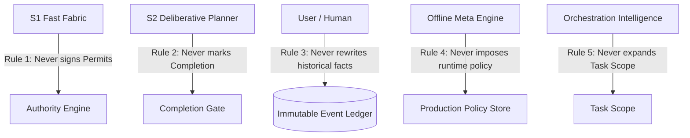

# Custos System Invariants & Enforcement Matrix

> **Classification:** Normative Reference Specification  
> **Source of Truth:** Authoritatively defined in [Custos Master Specification](../../Custos.md).  
> **Directory Index:** See [Custos Developer Reference](README.md).

Every component, interface, and execution path across the Custos workspace must strictly adhere to the 10 System Invariants and the 5 Golden Rules. These rules are non-negotiable and enforced through compile-time type bounds, static assertions, and automated runtime verifiers.

---

## 1. The 10 System Invariants

| Code | Invariant Name | Scope | Enforced By / Rule |
|---|---|---|---|
| **INV-01** | **Actor Attribution** | Persistence & State | Every state transition, schema mutation, or data alteration must record a concrete `ActorId` (`User`, `DaemonKernel`, `S2Planner`, `WorkerRun`). Anonymous mutations are strictly prohibited. |
| **INV-02** | **Boundary Invariance** | Authority & Kernel | Inference models (LLM/SLM) can never expand `Scope`, unflag `LocalOnly`, alter `ModelPin`, or increase `BudgetLimit`. Boundary changes require explicit human authorization. |
| **INV-03** | **Permit Requirement** | Capability Gateway | Any side effect interacting with the filesystem, process tree, or network mandates a valid, unexpired `ExecutionPermit` signed by the Trusted Kernel matching the exact `argument_digest`. |
| **INV-04** | **No Untrusted Policy** | Security & Taint | Data ingested from untrusted origins (external git repos, web scraping, email, MCP tool outputs) carries `Taint::Untrusted`. It can never be promoted to executable operational policy instructions. |
| **INV-05** | **Evidence-Backed Completion** | Completion Gate | A task criterion can only transition to `Pass` when backed by a verified, unexpired `EvidenceRecord` referencing an immutable CAS hash or verified test receipt. |
| **INV-06** | **Explicit Uncertainty** | State Machines | `Unknown`, `Stale`, and `Uncertain` are first-class, valid report states. Speculative success without verifiable proof is strictly forbidden. |
| **INV-07** | **No Phantom Distributed Atomicity** | Persistence & I/O | External side effects outside the SQLite transaction boundary cannot claim atomic guarantees. All I/O mutations must follow the Outbox / Receipt / Reconciliation protocol. |
| **INV-08** | **No Implicit Delegation** | A2A & Sub-tasks | Sub-task decomposition or agent-to-agent delegation never inherits the full capability set of the parent task. Authority delegation must always diminish in scope (`Delegation Diminishment`). |
| **INV-09** | **Audited Transports** | Model Hub | Every model inference attempt (`ModelAttempt`) must record its exact transport mechanism (`LocalInference`, `DirectVendorSdk`, `McpSamplingCallback`, `ProxyGateway`) with cost tracking or an explicit `CostUnknown` flag. |
| **INV-10** | **Single Model First-Class** | Orchestration | The system must function completely with a single baseline model. Multi-worker topologies (T2–T8) are only invoked when measurable value over baseline is established. |

---

## 2. The Five Golden Rules

1. **S1 never signs Permits:** The intuitive, fast-classification tier provides telemetry and heuristics; it possesses zero authority to issue side-effect execution permits.
2. **S2 never marks Completion:** The deliberative planning model proposes outcomes and supplies candidate evidence; only the Kernel's `CompletionGate` possesses authority to mark a criterion or task as `Succeeded`.
3. **Humans never rewrite history:** The append-only event ledger is strictly immutable. Human corrections are applied exclusively via compensating transactions.
4. **Meta Engine never imposes runtime policy autonomously:** The offline analysis pipeline produces optimization proposals (`PolicyProposal`); promotion to active runtime policy requires explicit developer approval.
5. **Orchestration Intelligence never expands Task Scope:** Planning snapshots and dynamic DAGs may narrow execution boundaries, but can never expand the user-granted scope without human interaction.

---

## 3. Enforcement & Verification Matrix

| Invariant | Static / Compile-Time Mechanism | Runtime Enforcement Point | Automated Test Fixture |
|---|---|---|---|
| **INV-01** | `ActorId` required field on `TaskEvent` & commands | `custos-persistence` transactional hook | `tests/contract/tests/actor_attribution.rs` |
| **INV-02** | Immutable contract struct fields; missing mutator methods | `custos-core::AuthorityEngine::reconcile_scope()` | `crates/custos-core/fixtures/adversarial/scope_expansion.txt` |
| **INV-03** | Private constructor on `ExecutionPermit`; signed cryptographic token | `custos-runtime::CapabilityGateway::execute()` | `tests/contract/tests/permit_verification.rs` |
| **INV-04** | Rust type system taint wrapper `Tainted<T>` | `custos-core::TaintTrackingEngine::verify_clean()` | `crates/custos-core/fixtures/adversarial/prompt_injection.txt` |
| **INV-05** | Typed `EvidenceRecord` enum with CAS digest link | `custos-core::CompletionGate::evaluate_criteria()` | `tests/contract/tests/completion_gate.rs` |
| **INV-06** | Enum variants `TaskStatus::Uncertain`, `EvidenceStatus::Unknown` | State machine transition validator | `tests/contract/tests/crash_recovery.rs` |
| **INV-07** | Outbox pattern implementation in `custos-persistence` | Crash recovery daemon reconciliation pass | `crates/custos-persistence/tests/outbox_resilience.rs` |
| **INV-08** | Diminishment invariant check in `IBCT::create_child()` | `A2AHub::validate_delegation()` | `tests/contract/tests/delegation_diminishment.rs` |
| **INV-09** | Exhaustive enum `InferenceTransport` on `ModelAttempt` | `custos-provider::ModelHub::dispatch()` | `tests/contract/tests/model_transport_audit.rs` |
| **INV-10** | T1 single-worker topology test suite | OI Engine routing fallback check | `tests/eval/tests/single_model_baseline.rs` |
