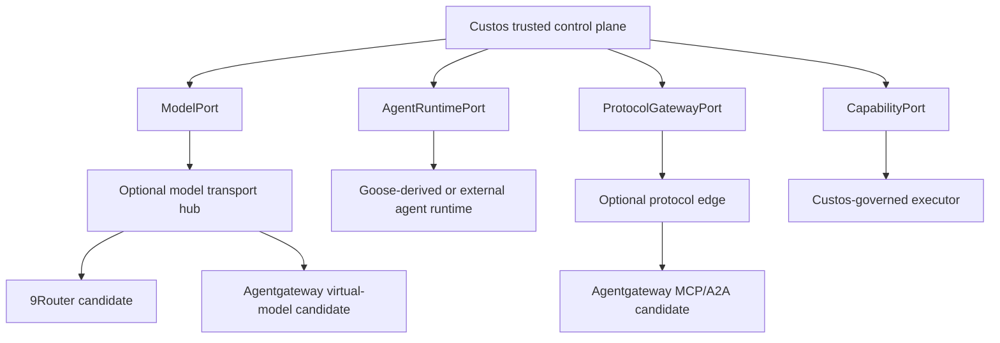

# Upstream dissection: Goose, 9Router, and Agentgateway

**Document ID:** RESEARCH-UPSTREAM-01
**Status:** Active research protocol; not an adoption decision
**Updated:** 2026-09-30

These projects are source pools to study, test, and selectively adapt. They do
not define Custos domain objects, authority, completion, storage, or product
identity. No upstream project is a mandatory runtime dependency.

## Architectural placement

The useful “hub” is therefore two replaceable edges, not a new owner of the
system:

- a **model transport hub** behind `ModelPort` for provider/account selection,
  health, fallback, and wire adaptation;
- a **protocol edge** behind `ProtocolGatewayPort` for MCP/A2A discovery,
  identity, routing, and federation.

Custos remains the control plane. One model attempt has one active transport.
Gateway authorization never substitutes for exact local pre-effect permits.

## Extraction targets

| Source | Mechanisms worth dissecting | What Custos must not inherit |
|---|---|---|
| Goose | Agent loop and event stream; provider adapters; MCP extension lifecycle; ACP integration; context compaction; recipes; CLI/desktop interaction patterns | Goose product identity; its canonical session/task semantics; implicit native-tool trust; broad copied modules without owners or call-path tests |
| 9Router | Provider and account registry; health scoring; rate-limit handling; fallback; request normalization; streaming and tool-call fidelity | Task or Run ownership; canonical budget ledger; hidden fallback inside one attempt; a second default proxy chained with another router |
| Agentgateway | MCP/A2A transport; workload identity; discovery; network policy; telemetry; protocol translation; virtual-model routing as an alternative model edge | Payload-level effect authority; Task/evidence state; post-response usage as canonical cost; an assumption that network admission authorizes tool arguments; default chaining with 9Router |

Goose's current documentation supports both exposing Goose through ACP and
wrapping some external ACP agents as providers. Its maintainers also document
the lifecycle complexity of nesting two independent agent loops. Custos
therefore keeps `ModelPort` and `AgentRuntimePort` distinct and does not model a
coding agent as a transparent LLM transport.

## Dissection protocol

Every investigation produces one bounded packet:

1. Pin repository URL, commit, release, license, and relevant source paths.
2. State the Custos problem and baseline; do not begin from “adopt project X.”
3. Trace the real upstream call path, state owner, failure behavior, and tests.
4. Extract the mechanism and invariant separately from upstream naming and
   packaging.
5. Map it to exactly one Custos port and one owning module.
6. Threat-model credentials, egress, tool payloads, retries, cancellation,
   provenance, and crash windows.
7. Build the smallest adapter or rewritten spike; do not copy an entire
   subsystem to prove one mechanism.
8. Run conformance fixtures against the current Custos baseline.
9. Measure outcome quality, latency, cost, recovery, and operational burden.
10. Record `Reject`, `Reference`, `Adapt`, or `Adopt` in an ADR with rollback.

Local checkouts used for research belong outside active product docs and must
not be committed as vendor trees. Durable findings belong in this file or a
decision ADR; raw upstream content remains at its pinned source.

## Mandatory conformance suites

### Goose-derived agent mechanics

- bounded start, event streaming, cancellation, interruption, and resume;
- explicit capability declaration and native-tool assurance label;
- conversion of tool calls to Custos `ActionIntent` before governed effects;
- stable continuation without treating transcript as canonical Task state;
- provider/context errors preserve provenance and do not forge completion;
- no direct SQLite access and no Task transition outside the Kernel.

### 9Router candidate

- exact model/account provenance for every attempt and stream;
- no provider switch inside one attempt;
- fallback creates a new attempt with reason and renewed budget/privacy checks;
- request, response, tool-call, cancellation, timeout, and usage fidelity;
- health and retry state survive or degrade explicitly after restart;
- direct adapter remains available as a baseline and rollback path.

### Agentgateway candidate

- MCP/A2A discovery and lifecycle fidelity;
- identity and capability projection without broadening grants;
- exact arguments are checked by Custos before mutating dispatch;
- cancellation, reconnect, duplicate delivery, timeout, and partial failure;
- telemetry carries correlation IDs but is not evidence of task success;
- bypass or outage cannot create an unrecorded Custos effect.
- if virtual-model routing is evaluated, it competes with 9Router as the one
  active model edge for an attempt; the two are not chained by default.

## Admission scorecard

An upstream mechanism is admitted only when all rows are evidenced.

| Gate | Required evidence |
|---|---|
| Product fit | Named user outcome and baseline comparison |
| Boundary fit | One stable port; no canonical-state ownership leak |
| Correctness | Valid, denied, stale, duplicate, timeout, and cancellation fixtures |
| Safety | Threat model, exact effect boundary, secret and egress handling |
| Durability | Retry, uncertain result, restart, and reconciliation behavior |
| Interoperability | Version matrix and protocol conformance |
| Operations | Health, tracing, resource limits, upgrade, rollback |
| Economics | Quality, p50/p95 latency, cost, and maintenance burden |
| Provenance | Pinned source, license/SBOM record, owner, retained notices |

## Current disposition

| Candidate | Disposition | Activation condition |
|---|---|---|
| Goose mechanics | Reference and selective rewrite/adaptation | Per-mechanism provenance, ownership, conformance, and daemon call-path proof |
| 9Router | Deferred research | Stable F1/F2 baseline, pinned adapter spike, measurable routing value |
| Agentgateway | Deferred research | Stable effect boundary, pinned protocol-edge or alternative ModelPort spike, failure and payload-authority proof |

Custos should first finish a direct single-worker, single-transport vertical
slice. Additional routing or federation is justified only when it beats that
baseline without weakening authority, evidence, recovery, or debuggability.

For the cross-pack design, score upstream mechanisms against dependency capture,
artifact/version fidelity, cancellation, and uncertain-effect recovery as well
as ordinary streaming compatibility. Session export alone does not preserve a
Custos evidence chain. Connection discovery does not establish tested support
for every coding agent. Record each backend's supported lifecycle explicitly.

## Primary references

- [Goose architecture](https://github.com/aaif-goose/goose/blob/main/documentation/docs/goose-architecture/goose-architecture.md)
- [Goose ACP-provider direction](https://github.com/aaif-goose/goose/discussions/11384)
- [9Router architecture](https://github.com/decolua/9router/blob/master/docs/ARCHITECTURE.md)
- [Agentgateway MCP authorization](https://agentgateway.dev/docs/standalone/latest/documentation/mcp/mcp-authz/)
- [Agentgateway virtual models](https://agentgateway.dev/docs/standalone/latest/documentation/llm/virtual-models/)
- [Model Context Protocol specification](https://modelcontextprotocol.io/specification/)
- [Agent2Agent Protocol specification](https://a2a-protocol.org/latest/specification/)
- [Research foundations](architecture-foundations-2026-09-30.md)
