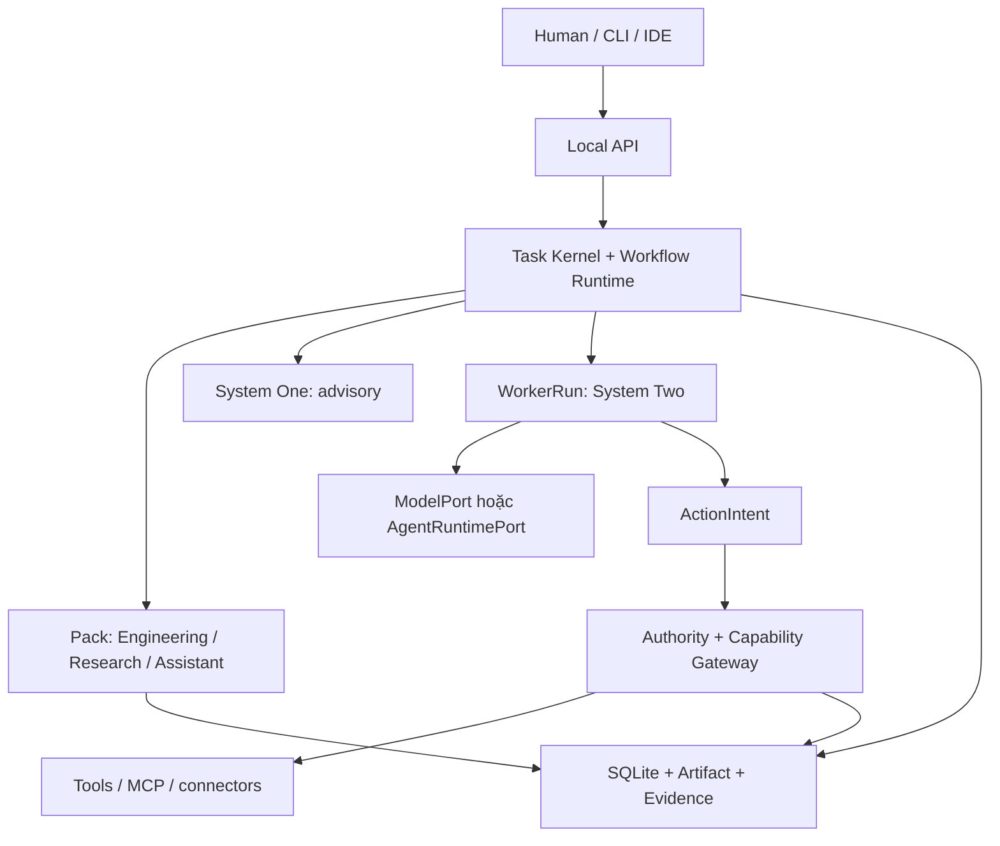

# Custos — cây codebase gốc và bản đồ mổ xẻ Goose

> **⚠️ HISTORICAL SPECIFICATION ARCHIVE — NON-NORMATIVE**  
> This Vietnamese document is an early codebase extraction design from 2026-09-25.  
> It does not override the current 42-crate Cargo workspace or active implementation blueprints.  
> - **Current Repository Structure:** [`docs/development/repository-structure.md`](../development/repository-structure.md)  
> - **Current Implementation Blueprint:** [`docs/development/implementation-blueprint.md`](../development/implementation-blueprint.md)

**Bản thiết kế cho Vĩ dựng nền tảng để Vinh và Trường phát triển. Ngày 25/09/2026.**

> Phạm vi xác thực: bản V3 được Vĩ cung cấp báo Custos có khoảng 34 Cargo packages tại short SHA `acc6dbd2`, nhiều crate còn scaffold. Workspace của bản tài liệu này **không chứa checkout Rust Custos hoặc Goose trên máy Vĩ**. Snapshot Goose dùng để tra cứu trong `Goose_Source_Atlas_for_Custos_2026-09-25.md` là `9adae14b64587a26275fe7c4a822a8e8ccdbd3fd`. Mọi path và nhận định về Custos thực tế ở đây là **reported**, cần xác nhận bằng full SHA, tree, symbol và test log trước khi sửa. C0 chưa thể gắn nhãn VERIFIED chỉ nhờ bảng kê.

## 1. Chốt việc Custos sở hữu

Custos là runtime local-first cho người phát triển phần mềm, gồm ba pack Engineering, Research, Assistant. Một `TaskContract` giữ mục tiêu, phạm vi, điều kiện hoàn thành, chính sách dữ liệu, ngân sách và approval. Assist, template, custom workflow và delegated đều dùng cùng Task Kernel. System One đề xuất lựa chọn có kiểu và được phép `abstain`; System Two tạo đề xuất/thực hiện phần được cấp; Human quyết định ranh giới quyền, thay đổi mục tiêu và chấp nhận kết quả. Quyền, trạng thái tác vụ, evidence và data lifecycle do Custos sở hữu.

Goose có thể giúp nhanh ở **worker turn, provider, MCP, repo analysis và UX patterns**. Goose session, permission, tool executor, recipe và scheduler **không thay** Task, Grant, ActionIntent, EvidenceRecord và WorkflowIR của Custos. Các số “5–15% code” từng nêu chỉ là dự đoán, không là chỉ tiêu để copy.

| Vùng | Quyền chốt | Một câu kiểm tra |
|---|---|---|
| Task Kernel | Custos | Ý định nào của người dùng vẫn còn sau restart/đổi model? |
| Workflow Runtime | Custos; Goose có thể cấp primitive có kiểm soát | Worker nào, state nào, lease nào, nhánh nào có thể chạy tiếp? |
| Authority + Gateway | Custos | Tool call này có grant/permit hợp lệ và có thể đối soát outcome không? |
| Model/Agent adapters | Custos interface; một số implementation lấy từ Goose nếu đạt gate | Model chỉ đề xuất host tool hay agent ngoài tự chạy tool? |
| Knowledge + Evidence | Custos | Trích đoạn nào, phiên bản nào, criterion nào thực sự được kiểm chứng? |
| Engineering/Research/Assistant | Custos | Pack có artifact và fail path cụ thể hay chỉ là prompt? |
| CLI/IDE/Python | Clients/sidecars; không có quyền sở hữu Task | Mọi state mutation đi qua daemon và Local API chứ? |



**Không suy từ sơ đồ rằng external Codex/Claude CLI bị Gateway chặn mọi effect.** Nếu agent đó tự thực thi bằng quyền process của nó, ghi nhãn `provider-governed`/`observe-only` cho phần chưa chứng minh mediation. Chỉ gắn nhãn `mediated` cho effect do Gateway thực sự intercept ở trước dispatch và có đường receipt/uncertain.

## 2. Quy tắc dựng repo trên checkout thật

1. Dùng tên file/crate thực tế làm gốc. **Không rename/restructure 34 packages đang được báo cáo chỉ để khớp một bản vẽ.** Tree dưới đây là cấu trúc hợp nhất theo trách nhiệm, không khẳng định mọi file đã có.
2. Nơi nào đã có `task.rs`, `repo_explain_slice.rs`, `deterministic.rs`... hãy **mở rộng và giữ test**, không tạo module thứ hai làm cùng một state machine.
3. Giữ `apps/custosd` làm composition root và writer duy nhất cho SQLite Task store. `apps/custos-cli`, VS Code, Python/TS sidecars dùng Local API/IPC có schema version; sidecar không đọc trực tiếp DB, không ký permit.
4. Thư mục chỉ được thêm khi có người dùng, contract và test: ví dụ `adapters/providers/codex/` có thể có trong manifest, nhưng external agent chưa cần nằm trên critical path. Scaffold hiển thị trạng thái `DESIGN`, `SCAFFOLD`, `IMPLEMENTED`, `MEASURED` trong `docs/status/feature-matrix.md`.
5. Mỗi đề xuất copy Goose phải có full SHA thật, đường dẫn gốc, license/notice, dependency delta, contract test và kế hoạch cập nhật khi upstream đổi. `lab/upstreams/goose/` chỉ chứa báo cáo/spike nhỏ; **không chép toàn repo Goose vào Cargo workspace**.

### 2.1. Lệnh read-only để Vĩ chạy ở thư mục cha của hai repo

Thay `custos` và `goose` bằng tên folder thật, chạy riêng từng lệnh; không in `.env` hoặc keys:

```bash
git -C custos rev-parse HEAD
git -C goose rev-parse HEAD
git -C custos status --short
git -C goose status --short
rg --files custos -g 'Cargo.toml' -g 'AGENTS.md' -g 'LICENSE*' | sort
rg --files goose/crates/goose-agent goose/crates/goose-provider-types goose/crates/goose/src/agents/state_machine | sort | head -100
```

Sau đó Trường lưu output thật và file/symbol/test thật vào `docs/status/source-path-map.md`. Vĩ duyệt ownership; Vinh duyệt từng đường Goose. C0 chỉ chuyển VERIFIED khi có full SHAs, working-tree state, test output và KEEP/WRAP/PORT/REPLACE mapping.

## 3. Cây repo chính thức để mở rộng

**Chú thích:** `E` = báo cáo V3 cho biết tồn tại, chưa kiểm trong workspace này; `N` = phần đề xuất thêm khi cần; `D` = đặc tả/data chung. Cây chi tiết mô tả trách nhiệm và file mục tiêu, **không phải lệnh tạo hết folder trống hôm nay**. Rust `Cargo.toml` nằm ở từng package Rust có trong workspace; TypeScript/Python chỉ có manifest khi có client/sidecar thật.

```text
custos/
├── README.md                       D  lời hứa sản phẩm, demo chạy được, trạng thái thực
├── AGENTS.md                       D  ranh giới thay đổi, test, cập nhật docs cho coding agents
├── CONTRIBUTING.md / SECURITY.md / LICENSE / .gitignore
├── Cargo.toml / Cargo.lock          E  Rust workspace, lockfile của app
├── rust-toolchain.toml             N  toolchain đã kiểm trên macOS/Windows/Linux
├── package.json / pnpm-workspace.yaml / pnpm-lock.yaml   N khi có TS
├── pyproject.toml / uv.lock        N khi có Python package/evals
├── .cargo/config.toml              N alias cargo xtask
│
├── apps/                           process entry points; không đặt domain logic ở đây
│   ├── custosd/                    E  main.rs, runtime.rs/composition.rs; daemon writer
│   │   └── src/{main,runtime,config,shutdown}.rs
│   ├── custos-cli/                 E  main.rs; client.rs + commands/task/approve/inspect;
│   │   └── src/ui/{banner,diff,prompt,spinner}.rs  E theo báo cáo
│   └── custos-vscode/              N  extension.ts, api-client/, views/task|evidence|approval
│
├── crates/                         Rust libraries, named by ownership
│   ├── core-domain/                E  task.rs, ids.rs, action.rs, evidence.rs,
│   │   └── src/                       authority.rs, budget.rs, context.rs,
│   │       └── ...                    continuation.rs, run.rs, workflow.rs, claim.rs
│   ├── task-kernel/                E  commands.rs, events.rs, reducer.rs,
│   │   └── src/                       invariants.rs, state_machine.rs, completion.rs
│   ├── workflow-runtime/           E  dispatcher.rs, lease.rs, outbox.rs;
│   │   └── src/                       recovery.rs, scheduler.rs, conflict.rs   N
│   ├── authority-engine/           E  grants.rs, approvals.rs, permits.rs,
│   │   └── src/                       policy.rs, risk.rs, audit.rs
│   ├── capability-gateway/         E  deterministic.rs, traits.rs;
│   │   └── src/                       intent.rs, attempts.rs, reconcile.rs   N
│   ├── evidence-engine/            E  verifier.rs, pipeline.rs, bundle.rs;
│   │   └── src/                       criterion.rs, stale.rs               N
│   ├── provider-sdk/               E  port.rs, request.rs, events.rs,
│   │   └── src/                       conformance.rs; capabilities.rs      N
│   ├── cognitive-runtime/          E  rdc.rs, arbiter.rs; rules.rs, shadow.rs N
│   ├── judgment-contracts/         E  typed answer/abstain/schema; no authority
│   ├── context-compiler/           E  compiler.rs, recipe.rs, traits.rs;
│   │   └── src/                       scope.rs, provenance.rs, omission.rs N
│   ├── repo-intelligence/          E  scanner.rs, graph.rs, llm_view.rs;
│   │   └── src/                       snapshot.rs, symbols.rs, search.rs  N
│   ├── memory-service/             E  traits.rs; scope.rs, promotion.rs,
│   │   └── src/                       invalidation.rs, retrieval.rs       N
│   ├── artifact-store/             E  filesystem.rs, traits.rs; manifest.rs,
│   │   └── src/                       integrity.rs, retention.rs          N
│   ├── domain-pack-sdk/            E  pack manifest, workflow binding, type validation
│   ├── persistence-sqlite/         E  connection.rs, migrations.rs, store.rs,
│   │   ├── src/repositories/           task.rs, span.rs, continuation.rs E;
│   │   │                                add action.rs, evidence.rs, usage.rs N
│   │   └── migrations/                0001..0003.sql E; new NNNN files only
│   ├── local-api/                  E? báo cáo đề cập, xác minh Cargo/package path;
│   │   └── src/                       tasks.rs, events.rs, approvals.rs,
│   │                                artifacts.rs, protocols.rs        N
│   ├── process-supervisor/         N nếu có child TS/Python/ACP, timeout/cancel/health
│   └── observability/              N tracing IDs + redaction; không thay Task audit
│
├── adapters/                       Rust packages hoặc module tùy dependency
│   ├── providers/
│   │   ├── fake/                   E  deterministic stream + usage fixtures
│   │   ├── claude/                 E  báo cáo: scaffold, direct API adapter nếu chọn
│   │   ├── local-model/            E  báo cáo: scaffold, Ollama API trước
│   │   ├── openai/                 N  direct API; Codex CLI là loại khác
│   │   ├── codex/                  N  optional AgentRuntimePort + assurance test
│   │   └── gateway-http/           N  optional LiteLLM/9Router-compatible endpoint
│   ├── judgments/                  N  rules, embedding-local, Jev/TypeSafe optional
│   ├── tools/                      E  StandardTools rỗng theo báo cáo; fs/shell/git
│   ├── mcp/                        N  rmcp client dưới Capability Gateway
│   ├── knowledge/                  N  Markdown/Obsidian, PDF, Notion connector
│   ├── connectors/                 N  calendar/mail mock trước, real sau
│   └── os/                         N  keychain, process/profile theo từng hệ điều hành
│
├── domain-packs/                   E  engineering có files, research/personal scaffold
│   ├── engineering/               pack.yaml, tasks/, workflows/, prompts/,
│   │                                context-recipes/, policies/, verifiers/, schemas/, evals/
│   ├── research/                  cùng bố cục; versioned source, claim, synthesis, export
│   └── personal/                  cùng bố cục; identity, time, draft, action, automation
│
├── sidecars/                       N  optional subprocess; không bao giờ Task DB owner
│   ├── judgment-python/           pyproject.toml, src/custos_judgment/, tests/
│   └── claude-agent/              package.json, src/index.ts, tests/ nếu SDK cần Node
├── packages/protocol-ts/           N  generated wire DTOs + versioned API client
├── schemas/                        D  protocol/, api/, packs/, valid/invalid fixtures
├── evals/                          D  Python offline evaluation + paired task strata
├── tests/                          E  contract/, e2e/; add recovery/, security/ N
├── fixtures/                       D  repos/, sources/, model-events/, tool-faults/
├── benches/                        N  context, repo-index, latency/cost experiments
├── config/                         D  no secrets; provider/pack defaults and policy
├── xtask/                          N  Rust automation: check, doctor, schema, package
├── packaging/                      N  macos/, linux/, windows/ (only verified profiles)
├── docs/
│   ├── status/                    N  source-path-map.md, feature-matrix.md
│   ├── architecture/              D  contracts.md, boundaries.md, flows.md, data.md
│   ├── domains/                   D  engineering.md, research.md, assistant.md
│   ├── goose/                     N  decision-matrix.md, characterization.md
│   ├── adr/                       D  state, authority, provider, Goose, OS, eval
│   └── development/               D  local-setup.md, adding-provider.md, adding-pack.md
├── third_party/                    N  GOOSE_SOURCE.md + copied-file notices if copied
└── lab/upstreams/                 N  pin + spike reports, excluded from default build
```

**Cách xử lý số package:** 34 là số báo cáo V3, không tự suy từ số entry trong cây. `E?` phải tra Cargo manifest. Những crate phát sinh thêm trong blueprint cũ như `model-gateway-sdk`/`protocol-gateway-sdk` chỉ tạo khi native routing/federation đủ lớn để cần port riêng; trước đó để `provider-sdk`/`adapters/mcp` giản dị. Root `pnpm`/`uv` chỉ được bổ sung khi có TypeScript/Python thật và lockfile hợp lệ.

### 3.1. Rule imports và compositional wiring

| Từ | Được phép phụ thuộc | Không được nhập |
|---|---|---|
| `core-domain` | primitive/types | SQLite, HTTP, Goose, provider, pack concrete |
| `task-kernel` | `core-domain`, pure port traits | adapter, CLI, DB implementation |
| `workflow-runtime` | `core-domain`, kernel ports, provider/capability interfaces | UI, Goose session tables |
| `authority-engine` | domain/strict deterministic policy | LLM decision, untrusted MCP hints làm authority |
| `capability-gateway` | authority/domain + executor ports | direct UI or pack-owned side effect |
| `evidence-engine` | domain + immutable artifact refs | UI-only success state |
| `adapters/*` | ports + external SDKs | mutate Task canonical rows |
| `apps/custosd` | all concrete modules | domain rules đặt tại composition root |
| `apps/custos-cli`, TS/Python | versioned API | SQLite writer và permit secrets |

`domain-packs/*` là manifest/workflow/prompt/verifier **khai báo**. Nếu có thuật toán repo parsing, claim validation, identity resolution thật thì đặt Rust code trong crate/module chuyên trách và gọi qua pack SDK; không giấu logic an ninh trong YAML hoặc prompt.

## 4. Cái nào bê từ Goose, đến cấp file

**Lệnh kỹ thuật:** `READ` đọc/đo, `SPIKE` chạy prototype cách ly, `PORT` chỉnh mã giữ attribution nếu được thông qua, `WRAP` dùng crate/API pinned qua adapter, `OWN` Custos tự viết. “Bê” hiện tại là **chọn ứng viên**, không là giấy phép copy nguyên cây.

| Goose source ở SHA audit | Custos destination | Quyết định hiện tại | Muốn lấy được phải chứng minh |
|---|---|---|---|
| `crates/goose-provider-types/src/base.rs`; `crates/goose/src/providers/base.rs` | `crates/provider-sdk/src/port.rs` | **READ → OWN contract**. File sau ở Goose có re-export/config. | Tách `ModelPort` text/stream/tool proposals/usage khỏi `AgentRuntimePort` có native tools. Không đổi Custos type/IDs theo Goose. |
| `crates/goose/src/providers/ollama_def.rs` | `adapters/providers/local-model/` | **READ → SPIKE → PORT đoạn nhỏ nếu cần**. | API/stream/tool/usage conformance; M2 Pro cold/warm p50/p95 và quality; kiểm chính xác path tại SHA local. Ollama server không là `goose-local-inference`. |
| `crates/goose/src/providers/litellm.rs` | `adapters/providers/gateway-http/` | **READ → WRAP endpoint optional**. | Cái này là client tới LiteLLM service, không là LiteLLM gateway Rust hay router Custos. Pin endpoint/model/user policy. |
| `crates/goose/src/providers/provider_registry.rs` | `adapters/providers/` config/registry | **READ → OWN**. | Actual capability probe và user pin; discovery không tự chứng minh tool support. |
| `crates/goose-agent/src/{machine,operation,inference}.rs` | `workflow-runtime/worker.rs` hoặc riêng `adapters/goose-worker/` | **SPIKE cách ly → WRAP/PORT chỉ khi hợp đồng chạy**. | One turn; load/yield/restart; fake model. Không đưa tool execution Goose vào WorkerRun; kiểm dependency graph và binary size. |
| `crates/goose-agent/src/tool.rs`; `crates/goose/src/agents/state_machine/ops_toolcalling.rs` | `capability-gateway/src/deterministic.rs` | **READ/test failure windows; OWN Gateway**. | Tool được gọi trước receipt persist trong đường quan sát; Custos phải persist intent, permit, dispatch attempt trước effect và không blind retry `UNCERTAIN`. |
| `crates/goose/src/agents/agent.rs` + `agents/state_machine/{mod,session}.rs` | `lab/upstreams/goose/characterization.md` | **READ hai loop; không copy cả hai**. | Trace default/flag tại SHA thật; reconcile result after restart; đo state/effect semantics. |
| `crates/goose/src/agents/mcp_client.rs`; `agents/extension_manager/{mod,stdio,streamable_http}.rs` | `adapters/mcp/` | **READ/SPIKE → viết rmcp client mỏng hoặc PORT con nếu đáng**. | Install/launch/auth/tool namespace, hostile annotations, scope stdio/HTTP, child process cleanup, Gateway trước call. |
| `crates/goose/src/agents/platform_extensions/developer/{shell,edit}.rs` | `adapters/tools/` | **READ schema/UX; OWN executor**. | Symlink/TOCTOU/path scope, process tree, sandbox OS; test/build chạy code không tin cậy. |
| `crates/goose/src/agents/platform_extensions/analyze/mod.rs` | `crates/repo-intelligence/` | **SPIKE theo phép đo → trích nhỏ nếu thắng baseline**. | Accuracy file/symbol, dirty worktree, symlink, ignored files, multi-language coverage, time/token vs scanner hiện có + `rg`/FTS. |
| `crates/goose/src/context_mgmt/mod.rs`; `crates/goose-context-management/` | `crates/context-compiler/` | **READ/SPIKE; OWN canonical ContextPack**. | Goal, policy, hashes và exact citation không biến mất khi compaction; đo token/quality. |
| `crates/goose/src/session/session_manager.rs` | `crates/persistence-sqlite/` | **READ patterns; OWN schema/migrations**. | Goose chat/usage ≠ Task revision/action/attempt/reservation. Dùng WAL/migration practices, không copy `sessions.db` hay `0004_usage.sql` từ Goose. |
| `crates/goose/src/recipe/mod.rs`; `template_recipe.rs` | `domain-packs/*/workflows/` + WorkflowIR compiler | **READ authoring; OWN compiler**. | Goose Recipe có version; Custos vẫn cần DAG type check, budget/egress/grant/outputs, preview amendments. |
| `crates/goose/src/scheduler/full.rs`; `agents/platform_extensions/orchestrator.rs`; `execution/manager.rs` | `crates/workflow-runtime/` | **READ/SPIKE scheduling UX; OWN durable orchestration**. | Child scopes, lease fencing, write-set, bounded retries, crash replay; multiagent không tự đồng nghĩa durable effects. |
| `crates/goose-providers/src/{decision,typesafe}.rs` | `crates/judgment-contracts/` + `adapters/judgments/` | **OPTIONAL WRAP sau shadow eval**. | Jev là một backend S1; phải có `abstain`, calibration/cost/quality gate và không chạm authority. |
| `crates/goose/src/providers/{codex,codex_acp,claude_acp}.rs` | `adapters/providers/codex/` hoặc external agent adapter | **OPTIONAL SPIKE; isolate**. | Native effect có được chặn trước không? mode mapping explicit; nhãn assurance thật. Direct Claude API khác Claude Code runtime. |
| `crates/goose/src/config/permission.rs`; `permission/permission_inspector.rs`; `hooks/mod.rs` | `authority-engine/`, UX approval | **READ/compare; OWN Custos policy**. | Goose có deny/ask/allow và hook chặn được; một số inspector/hook fail-open theo cấu hình. Không nói toàn Goose fail-open. |
| `crates/goose/src/security/{egress_inspector,adversary_inspector}.rs` | `authority-engine/egress.rs` | **REFERENCE/advisory only**. | LOG/Allow hoặc fail-open detector không thay outbound isolation/enforcement. |
| `crates/goose/src/agents/platform_extensions/chatrecall.rs`; `crates/goose-mcp/src/memory/mod.rs` | `crates/memory-service/` | **READ UX; OWN scoped accepted facts**. | Chat search không là fact verified; scope/project/personal, provenance, expiry, revoke/delete. |
| `crates/goose/src/session/import_formats/`; `export_markdown.rs` | Research `adapters/knowledge/markdown/` | **READ converters, không PORT vào memory/CAS mặc định**. | Chat export ≠ versioned claim/source mapping, Notion API, managed block hay three-way merge. |
| `crates/goose-local-inference/`, `goose-download-manager/` | `adapters/providers/local-model/` | **DEFER separate backend spike**. | Ollama đã có server/model management; in-process inference có footprint/lifecycle khác, không tự coi “ADOPT”. |
| `crates/goose-cli/`, `ui/desktop/`, `crates/goose/src/acp/` | `apps/custos-cli/`, `apps/custos-vscode/`, adapter external agent | **READ UX/ACP direction; OWN Task UI**. | Không nhập Electron UI để mở Task/evidence/approval; ACP server vs ACP client khác chiều giao tiếp. |

**Vùng cố định tự viết:** `TaskContract`/TaskRevision, pure reducer, WorkflowIR authority semantics, Grant/Approval/Permit, intent/attempt/receipt/reconcile, criterion evidence, ContinuationPacket, three pack artifacts, privacy scopes, cost reservations và acceptance evaluation. Code lấy từ Goose tối đa ở các **boundary adapter** và worker primitive đã tách được effect.

### 4.1. Gate trước bất kỳ PR copy Goose nào

| Gate | File lưu lại | Câu hỏi pass/fail |
|---|---|---|
| Origin | `third_party/GOOSE_SOURCE.md` | Full local Goose SHA, source path, source hash, license, NOTICE, copied/modified lines đã ghi chưa? |
| Compatibility | `docs/goose/decision-matrix.md` | Public API có ổn định, Cargo deps/build size ra sao, Windows/macOS/Linux có build không? |
| Behavior | `lab/upstreams/goose/characterization.md` | Same request/text/tool/stream/error/usage/cancel qua FakeProvider? |
| Authority | `tests/security/` | No permit/revoked/egress denied → zero mediated effects; external agent bypass gắn nhãn thật? |
| Durability | `tests/recovery/` | Crash trước/sau dispatch, unknown result không retry mù, receipt persisted nhưng worker chưa nhận được resume đúng? |
| Product | `evals/` | Feature mới cải thiện artifact quality/cost/time trên cùng strata, không chỉ giảm LOC? |

Goose ghi Apache-2.0 ở root; trước khi phân phối Custos chứa code trích hãy kiểm giấy phép trên từng file/dependency và giữ license, copyright, thay đổi và NOTICE cần thiết. Không dùng branding/logo Goose như tài sản của Custos.

## 5. Luồng dữ liệu và hợp đồng xuyên ngôn ngữ

### 5.1. Event và ID bất biến

`TaskId` → `TaskRevisionId` → `WorkflowRevisionId` → `WorkerRunId` → (`ActionIntentId` → `AttemptId` → `ReceiptId` | `UNCERTAIN`) → `EvidenceRecordId` → `OutcomeBundleId`. `SourceVersionId`/`ArtifactDigest` gắn vào context, evidence và approval. Mỗi command thay state mang `expected_state_version` và `idempotency_key`. Mỗi event có `schema_version`, `event_id`, `task_id`, `seq`, `occurred_at`, `trace_id`; UI reconnect từ `(task_id, seq)`. Sequence do DB/daemon cấp, không do extension tự đoán.

| Data | Nguồn thật | Nơi index/cache | Điều kiện mất hiệu lực |
|---|---|---|---|
| Task/revisions/grants/attempt/usage | SQLite transactional store | read projections | command conflict/revision, expiry hoặc revoke |
| Bytes source, patch, report | filesystem CAS + manifest, DB refs | FTS/symbol/vector derived | hash/revision thay hoặc retention |
| Repo snapshot | git + dirty file hashes + allowed root | `repo-intelligence` cache | commit, dirty buffer, symlink target đổi |
| Paper/notes | source file/page/version + parse coverage | text passages/FTS | bytes/version/parse model đổi |
| Personal data | scoped connector snapshot | memory candidate | user edit/expiry/revoke/source refresh |
| Model session | `WorkerRun` + normalized events | provider-local ephemeral state | switch provider; use `ContinuationPacket` |

**SQLite migrations:** giữ nguyên `0001..0003` được báo cáo. Tạo file số tiếp theo **sau khi đọc schema thật**; tên `0004_usage.sql` và `0005_evidence.sql` của V3 chỉ là gợi ý và có thể xung đột migration sẵn có. Usage ledger tối thiểu có `task_id, worker_run_id, attempt_id?, provider, model, request_id?, input/output/cache_tokens?, billed_amount?, currency?, cost_status(measured|estimated|unknown), price_snapshot, occurred_at` và reservation/settlement riêng. Receipt gắn action payload hash/executor/version/target/external ID/timestamp/outcome; `UNKNOWN` là trạng thái thực, không ghi phí = 0.

**Atomicity thực tế:** transaction DB có thể atomically lưu intent/state/outbox, nhưng **không atomically commit cùng một lúc với email, shell hoặc filesystem khác**. Đánh dấu attempt `DISPATCHING` trước effect; crash sau effect trước receipt ⇒ `UNCERTAIN`, truy vấn target/external ID hoặc hỏi human. One-use permit và idempotency key giảm rủi ro, không chứng minh exactly-once cho connector thiếu idempotency.

### 5.2. Giao diện các tiến trình

| Cặp giao tiếp | Wire | Giao diện tối thiểu | Chủ sở hữu |
|---|---|---|---|
| CLI/VS Code → `custosd` | local Unix socket hoặc loopback auth; Windows named pipe/loopback được kiểm | task create/get/steer/cancel, preview/approve, event stream, artifacts, capability catalog | Trường + Vĩ UX |
| Rust daemon → Python judgment | framed JSON messages hoặc local HTTP; một lựa chọn đã benchmark | `judge(question_type, candidates, constraints)` → typed result/abstain + version/latency; timeout/fallback | Vĩ; Vinh runtime |
| Rust daemon → Node SDK sidecar | framed JSON messages, supervised process | normalized `AgentRuntimePort`/ModelPort commands, streaming/cancel/errors; explicit assurance | Vinh + Vĩ |
| Gateway → MCP/connectors | adapter port, no direct pack call | discover sanitized capabilities, propose/execute, receipt/uncertain | Trường + Vinh |

`schemas/protocol/` là source of truth cho wire DTOs. Schemas có `v1`, max size, unknown fields policy, cancellation, timeout, error codes, `trace_id`, egress scope, `artifact_ref` cho payload lớn. TS generated client trong `packages/protocol-ts`; Python generated DTO hoặc validation từ cùng fixture; Rust domain model vẫn được viết thủ công. SQL migrations chỉ do Rust daemon sở hữu. `uv` dùng cho eval và optional ML, `pnpm` cho IDE/Node adapter; Python/TS không nằm trên hot path khi vắng nhu cầu. macOS primary, Linux/Windows có test matrix và **chỉ công bố feature/assurance đã kiểm trên từng OS**.

## 6. Cụ thể hóa ba pack và workflow

| Pack/job đầu tiên | Tập tin declarative | Rust code/adapter sở hữu logic | Artifact, verifier, fail path |
|---|---|---|---|
| Engineering `repo_explain` | `domain-packs/engineering/{tasks/repo-explain.yaml,workflows/repo-explain.v1.yaml,context-recipes/explain.v1.yaml}` | `repo-intelligence` snapshot/lexical/symbol; `context-compiler`; `provider-sdk`; `evidence-engine` | `RepoExplanation` có path, lines, hashes, coverage/unknown; dirty source ⇒ stale; mở lại Task được. |
| Engineering `bug_fix` | `engineering/{tasks/bug-fix.yaml,workflows/bug-fix.v1.yaml,verifiers/*}` | `adapters/tools` patch/worktree/check dưới Gateway; Workflow Runtime scheduler | `PatchProposal`, apply receipt, repro, test receipts, integrated hash; base đổi ⇒ conflict; test chưa chạy ⇒ unknown. |
| Research `paper_reading` | `research/{tasks/paper-reading.yaml,workflows/paper-reading.v1.yaml,context-recipes/read.v1.yaml}` | source parser/Artifact store, scoped FTS, claim–passage verifier | `ReadingCard` + `ClaimEvidenceLink`: locator exists ≠ passage supports claim; OCR thiếu ⇒ coverage unknown. |
| Research `compare_methods`/`research_to_spec` | `research/workflows/*.v1.yaml` | evidence + selected source handoff | `LiteratureBrief`/`EngineeringBrief`, contradiction/limitations, source-version binding; export Markdown managed block có conflict check. |
| Assistant `draft_message` | `personal/{tasks/draft-message.yaml,workflows/draft-message.v1.yaml}` | scoped notes, identity/time resolver, preview, provider | `DraftMessage` pending; ambiguous recipient/timezone ⇒ resolve/human; draft không gửi. |
| Assistant `send_message` | `personal/{tasks/send-message.yaml,workflows/send-message.v1.yaml,policies/external-send.v1.yaml}` | Authority/Gateway + connector + reconciliation | exact target/body/attachment expiry approval → external receipt; timeout ⇒ uncertain, không send lại tự động. |

**Workflow modes:** Assist mặc định một worker với context chọn lọc, stream output sớm và tránh model nhỏ chen vào mọi lượt. Template chạy DAG có version; Custom compile YAML/UI nodes với type, cycle, grant, egress, budget, output và parallel write-set validation. Delegated có thể đề xuất sửa DAG dưới TaskContract, diff workflow cho human xem khi đổi effect scope/budget; `System One` không tự phê duyệt plan hay quyền. `ContinuationPacket` chỉ chứa goal, accepted decisions, source/artifact refs, budgets/pending effects và không mang raw secret/hidden model state/grant từ provider cũ.

### 6.1. Ba luồng sống của sản phẩm

**Engineering Assist:** user chọn symbol và ghim model → TaskRevision + repo dirty snapshot → lexical/symbol retrieval → ContextPack có exact refs → model giải thích hoặc đề xuất diff → evidence gắn file hash → UI phân biệt proposal/verified. Nếu apply thì mới tạo ActionIntent và kiểm grant/permit.

**Research → Engineering:** ResearchBrief có claim/support/limits → human chọn phần chia sẻ → child Engineering Task với artifact refs, scope và budget riêng → code proposal/checks → OutcomeBundle; không chuyển vault cá nhân nguyên khối và không dùng source chưa parse làm “verified”.

**Assistant delegated:** user giao chuẩn bị cập nhật → personal scoped data → draft/recipient resolve → preview bytes+attachments → exact approval nếu gửi → Gateway dispatch → receipt/reconciliation → Task completion dựa trên criterion. Quyền đọc notes không tự cấp quyền gửi thư.

## 7. Thứ tự giao file cho ba người, để Vĩ vẫn kiến tạo codebase

| Slice | Vĩ thiết kế và code | Vinh phụ trách | Trường phụ trách | Gate có thể demo |
|---|---|---|---|---|
| 0. Reality map | Chốt architecture, ba user jobs + rubric, review `AGENTS.md` | Đối chiếu Goose full SHA/source symbols; ghi extraction decision | Đối chiếu Custos full SHA, cargo test logs, migration list | `docs/status/source-path-map.md` VERIFIED từng row, không ghi DONE khi còn unknown |
| 1. Contract root | Chốt `TaskContract`, `ContextPack`, evidence/quality semantics, provider contracts | WorkflowIR/WorkerRun/handoff/state diagram | Reducer/DB/API implications, DTO/fixtures | Invalid transitions/stale/unknown và wire fixture pass |
| 2. First read task | Code repo scanner improvements, context compiler, direct local/cloud model adapter, Engineering `repo_explain` | Goose `analyze`/worker spike, benchmark accuracy/coupling; scheduler một worker | Store, artifact refs, minimal API/CLI, event cursor | `repo_explain_slice.rs` hiện có được mở rộng và Task mở lại được |
| 3. Mutating task | Bug-fix semantics, verifier checks, acceptance rubric | Worktree runner, lease/recovery/OS process tests | Authority + Gateway + action/attempt/receipt store, exact approval | no permit→0 effect; crash→unknown; final snapshot checks |
| 4. Research + Assistant | Claim-support, reading/export, scoped personal draft, eval scenarios | cross-pack handoff và conflict/parallel control khi cần | Connector mock, UX approval, conflict/recipient resolution | unsupported claim không pass; draft không gửi; external action không trùng |
| 5. Optimization | Rules-first S1, model candidate eligibility, shadow/paired eval, quality registry | bounded workflow amendments; optional Goose worker integration | usage/reservations, UI measured/estimated/unknown | cost/quality/latency claims theo task strata, không quảng cáo số chưa đo |

Vĩ là maintainer của *boundaries*, trực tiếp tạo kiến trúc/contracts, code AI/context/pack/eval và tích hợp; Vinh chịu SE multiagent/worker/runtime/Goose; Trường chịu SE storage/authority/gateway/API/UI. Trên file chung: owner có một người, reviewer khác người; thay `TaskContract`, `ActionIntent`, `ModelPort`, schema hoặc pack interface phải Vĩ chốt semantics và cả ba chạy conformance phù hợp.

**Chỉnh lại dependency PR V3:** Local API nhỏ phải có **trước** demo `repo_explain`; CLI không nên chờ PR-10. Split PR-10 thành (a) daemon/API/cursor sau store, (b) template single-worker sau kernel, (c) UI, (d) dynamic workflow sau quality baseline. `receipt_post_crash` test thuộc lúc Gateway + receipt store đã có, không gắn PR persistence trước executor. Baseline eval fixtures định nghĩa từ đầu, Q03 chạy sau pack artifact; W02 không nằm trong PR xảy ra trước Q03. Goose G0 là nghiên cứu song song, không khóa một direct ModelPort adapter nếu đọc API trực tiếp đủ.

### 7.1. Nhóm commit đầu Vĩ dựng, không đợi cả ba

1. `docs/architecture/contracts.md`: các type và bất biến bên trên; `docs/status/source-path-map.md`: hàng `EXISTS/ABSENT/UNVERIFIED` từ checkout thật, full SHA, test command/output.
2. `AGENTS.md`: trách nhiệm từng vùng, dependency rule, không copy upstream tự động, status definitions, contract-test command. `third_party/GOOSE_SOURCE.md`: template provenance (chưa ghi PORT nếu chỉ đọc).
3. Ba fixture không có API key: `repo_explain` source-anchored, `paper_reading` unsupported claim, `draft_message` ambiguous recipient; expected OutcomeBundle/fail-state và rubric.
4. Đặt module owner trong crates **đang tồn tại**: `TaskContract/TaskRevision`, `WorkerRun/WorkflowRevision`, `ActionIntent/Attempt/Receipt`, `EvidenceRecord`, `ModelPort/AgentRuntimePort`, `ContextPack` — theo đúng tên file thực, giữ compatibility.
5. Minimal Local API trên daemon + CLI thin client + FakeProvider; mở lại Task đã tạo sau restart. Sau đó mới thí nghiệm Goose provider/analyze/worker.

## 8. Các phép đo trước khi gọi “tối ưu và chính xác hơn”

| Thứ đo | Hiển thị/kiểm nghiệm đúng | Ngộ nhận cần tránh |
|---|---|---|
| Quality | Engineering: grounded answer + correct patch + independent checks; Research: support precision/coverage; Assistant: recipient/payload/receipt correctness; paired baseline per stratum, sample size + interval | “Độ chính xác ≥ mọi agent” từ một demo |
| Total spend | Tokens in/out/cache, S1, retries, verifier, provider bill or unknown, local compute proxy, human corrections | “Giảm 80–98%” chưa đo |
| Assist latency | p50/p95 first useful output, verified outcome, extra overhead vs same provider/baseline; cold vs warm, M2 Pro hardware | “2–4 giây bảo đảm” cho mọi network/model |
| Recovery/authority | denied effects 0 trong fixture, crash windows, duplicates, UNCERTAIN rate, OS-scoped assurance | “exactly once” cho external API thiếu reconcile |
| Disclosure UI | Trước task: cost range + confidence + dữ liệu sắp gửi/giữ local; sau task: measured/estimated/unknown, evidence pass/fail/unknown/stale, unverified work | Cho spinner/LLM tự báo completed thay completion gate |

## 9. Nguồn đối chiếu và tình trạng

- Tài liệu Custos hiện có trong workspace: `CUSTOS_DINH_HINH_BAI_TOAN_VA_KIEN_TRUC_SAN_PHAM_VI.md`, `CUSTOS_SUPER_PLAN_REFACTOR_VA_PHAT_TRIEN_V1_VI.md`, `CUSTOS_CANONICAL_MONOREPO_STRUCTURE_V1_VI.md`, và bản V3 user gửi `upload/Pasted text(20260925-141543).txt`.
- Source atlas Goose snapshot pin commit: `Goose_Source_Atlas_for_Custos_2026-09-25.md`; kiểm lại path trên checkout local vì Goose đang di chuyển provider/agent loop.
- Official repo: https://github.com/aaif-goose/goose ; official `AGENTS.md` mô tả hai agent loops và flag `GOOSE_STATE_MACHINE=1`: https://github.com/aaif-goose/goose/blob/main/AGENTS.md ; license: https://github.com/aaif-goose/goose/blob/main/LICENSE . URL `main` để đối chiếu hiện trạng, không thay pinned SHA trong provenance.

**Định nghĩa hoàn tất:** repo có một read task, một effect task, một research artifact và một assistant draft/action chạy qua cùng Task/API/store; có test no-approval, crash/uncertain, stale evidence; user xem được cái gì đã biết, chưa biết, đã xin quyền và còn chờ xử lý. Có cây thư mục mà không đạt các contract này thì mới là khung codebase.
