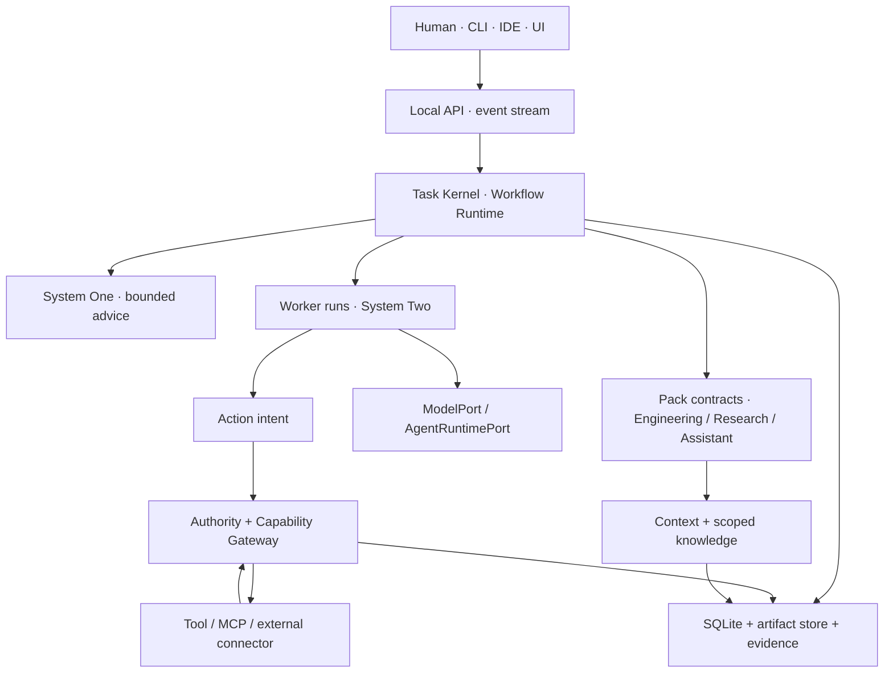
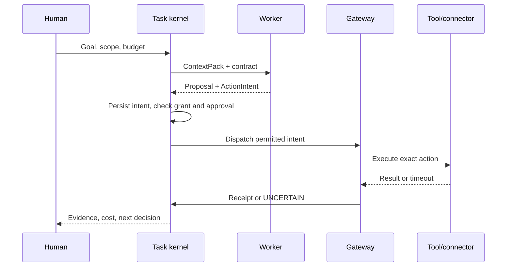
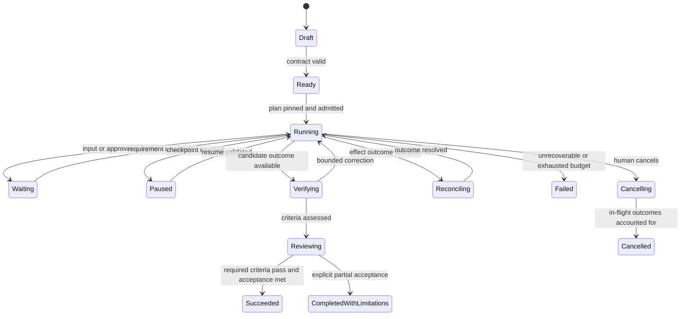
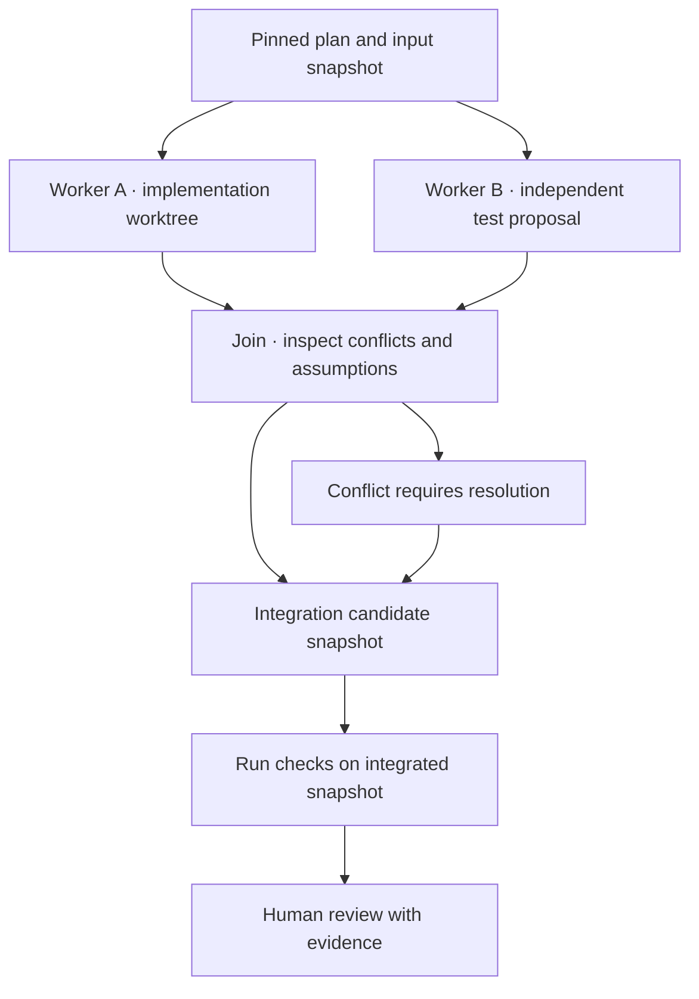
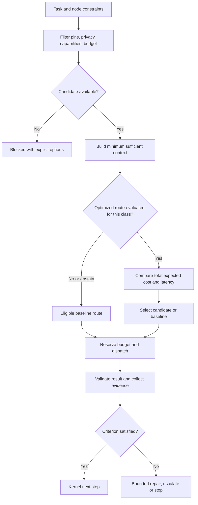
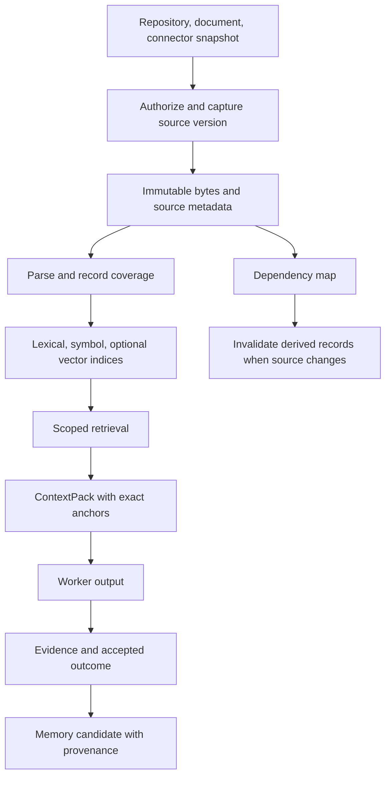
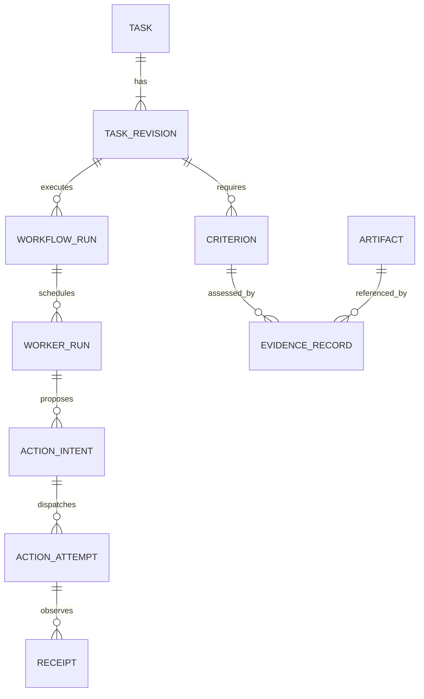
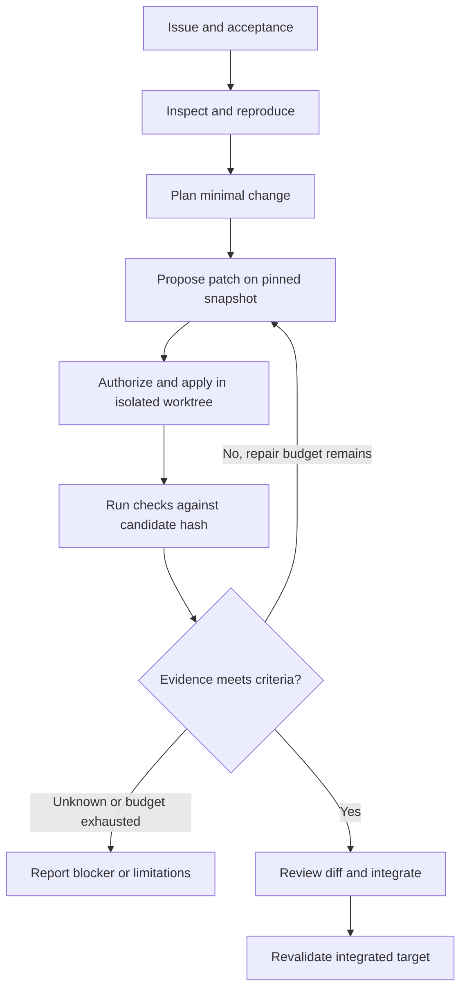
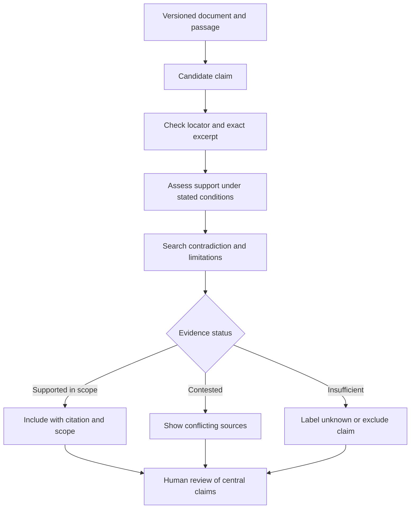
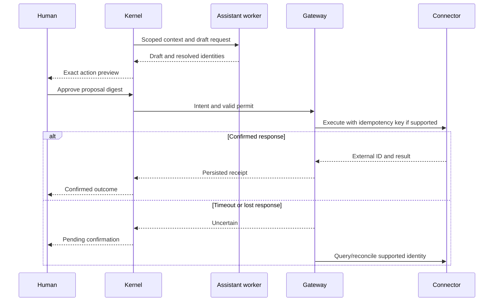

# Custos — định hình bài toán và kiến trúc sản phẩm

**Bản tổng hợp sau khi đối chiếu ba tài liệu người dùng gửi; 25/09/2026.** Đây là đặc tả quyết định và giả thuyết cần thử nghiệm, không phải báo cáo Custos đã triển khai hay công bố số liệu benchmark. Nguồn Goose để đối chiếu là source atlas đã kiểm tra ở commit `9adae14b64587a26275fe7c4a822a8e8ccdbd3fd`; bản audit cũ dùng commit `302b60806639ea9f0ae8f053f49f8bf0e88b26f4`. Không ghép dữ kiện của hai commit thành một implementation. Source Goose trong máy người dùng và source Custos tại máy Mac chưa nằm trong môi trường này, nên chưa xác nhận build/behavior của hai checkout đó.

## Bản đồ đọc

- **Định vị và quyết định nền tảng:** mục 1–10.
- [Thành phần và hợp đồng giao tiếp](#components): mục 11–12.
- [Task, workflow, worker và phục hồi](#runtime): mục 13–15.
- [System One, model và ngân sách](#cognition): mục 16.
- [Context, knowledge, memory và dữ liệu](#data): mục 17–18.
- [Engineering Pack](#engineering): mục 19.
- [Research Pack](#research): mục 20.
- [Assistant Pack và chuyển giao giữa pack](#assistant): mục 21–22.
- [Giao diện, backend và đa nền tảng](#product): mục 23–24.
- [Repo, phân công, nghiệm thu](#delivery): mục 25–27.

**Bổ sung kiến trúc và luồng chi tiết:** các mục 11–27 là thiết kế đề xuất để implement. Chúng không xác nhận những module này đã có trong Custos. Tên method, endpoint, event và schema là hợp đồng mục tiêu; phiên bản v1 phải được chốt trong repo trước khi sinh SDK. Các sơ đồ về storage chỉ đường sở hữu logic: executor gửi kết quả về daemon; không được tự ghi Task DB.

## 1. Cái Custos cần giải

**Custos là không gian làm việc local-first cho developer, nơi người dùng điều khiển mục tiêu và quyền hành; một Task bền vững kết nối coding, research và personal assistance với workflow, model, công cụ, bằng chứng và lịch sử quyết định có thể tiếp tục sau khi đổi phiên.** Giá trị của sản phẩm phải thấy được ngay cả khi người dùng chọn cố định một model mạnh và chỉ dùng một pack.

Đơn vị sản phẩm là **outcome có thể kiểm tra**, không phải lượt chat, số agent, hay số model tích hợp. Vấn đề thực tế gồm: mất ngữ cảnh khi đổi phiên và công cụ; đọc sai repository hoặc nguồn nghiên cứu; báo xong khi chưa kiểm chứng; lẫn quyền giữa đọc, viết và gửi; trả token để lặp lại công việc có thể cache, index hay dùng rule; agent chuyên môn tách rời khiến người dùng phải tự làm phần handoff. Custos cần giải các vấn đề đó bằng một runtime và UX chung, sau đó ba pack định nghĩa thế nào là làm đúng trong lĩnh vực của mình.

**Yêu cầu chất lượng của người dùng:** với tác vụ được hỗ trợ, phương án tối ưu chỉ được đưa vào active path khi chất lượng đo được ít nhất ngang baseline phù hợp; chấp nhận độ trễ tăng nhỏ và có ngân sách rõ. Điều này là **tiêu chí phát hành, không phải tính năng có thể bảo đảm tuyệt đối trước khi đo**. Khi chưa có bằng chứng cho tuyến giá rẻ, chạy tuyến baseline đã chọn; nếu cũng chưa xác định baseline tương thích, hỏi người dùng hoặc báo không đủ năng lực.

### Ranh giới của lời hứa

- **Chi phí** là tổng tiền model, token, cache, local compute, retry, verifier, tool, thời gian và công kiểm tra của người dùng. Không tính riêng giá request đầu tiên rồi tuyên bố tiết kiệm.
- **Chất lượng** phải tách đúng tác vụ: test pass không chứng minh feature đúng; trích dẫn tồn tại không chứng minh claim; model nói đã gửi không chứng minh email đã gửi. Có các ràng buộc an toàn cứng không được đánh đổi để giảm giá.
- **Latency** đo cả thời gian đến phản hồi có ích đầu tiên và thời gian đến kết quả đã kiểm chứng, theo p50/p95; so cùng baseline, cùng thiết bị và chế độ. Mục tiêu overhead 2–4 giây trong Assist nếu phù hợp, chưa phải kết quả thực nghiệm hay trần cho mỗi lượt. Không cài router ML hoặc scan repo nặng đồng bộ trên đường tương tác nhanh.
- **Local-first** là lựa chọn lưu trữ, kiểm soát và mặc định dữ liệu; provider cloud là tùy chọn với egress policy. Model cục bộ có thể rẻ tiền API nhưng chậm và dùng điện/RAM, không mặc định thắng chất lượng.

## 2. Cách đọc ba tài liệu, không trộn ý tưởng với thực tế

| Tài liệu | Giá trị dùng được | Phần cần sửa hoặc chứng minh |
|---|---|---|
| `CUSTOS_COMPLETE_ARCHITECTURE_DEEP_DIVE_VI.md` | Gợi ý Task Kernel, Authority, evidence, daemon, giao diện và memory | Các thống kê 34 crate, 17.871 LOC và mức độ hoàn tất trỏ tới path Mac không thể kiểm tra ở đây. CLI gọi thẳng DB/Tool trong mô tả làm vỡ ranh giới daemon. Hash-chain không phải Merkle, không tự chống giả mạo; sandbox và hoàn tất không thể tuyên bố tuyệt đối. |
| `GOOSE_COMPLETE_ARCHITECTURE_DEEP_DIVE_VI.md` | Bản đồ nhiều khả năng Goose hữu ích: provider, MCP, tool loop, session, recipe, UI, subagent | “17-step pipeline” không phải hợp đồng một chiều bất biến; Goose có legacy loop và state-machine path, đường mới tắt theo mặc định ở snapshot audit. Session SQLite có thật nhưng không tương đương Task/effect durability. Không xác nhận an toàn sandbox, semantic memory, resolver write conflict, hay số LOC tổng. |
| `Pasted text(20260925-121031).txt` / V10 | Diễn đạt tốt Task > Session, hai router, ba pack, data/evidence, bốn phong cách workflow, đối chiếu audit | Quyết định “fork một lần toàn execution plane” quá mạnh trước spike; có thể chỉ cần adapter trực tiếp hoặc thư viện nhỏ. Các ngưỡng `<10ms`, “≥100 trace”, “10–15× token”, benchmark ngành, giá model và lợi ích kinh tế chưa đủ để coi là SLO/số đã đo tại Custos. “Không ACP” là phạm vi ưu tiên, không nên biến thành cấm tích hợp về sau. |

“Custos từ số 0” nên hiểu là **chưa chứng minh vertical slice ba pack chạy được**, không tự suy ra repo trên Mac trống. Trước khi cập nhật README với nhãn `implemented`, phải xuất inventory thực tế tại đúng SHA, build/test và phân loại `design | scaffold | integrated | measured`.

## 3. Kiến trúc logic cuối cùng



Sơ đồ là ownership, **không ép mỗi thao tác phải qua tất cả hộp**. `custosd` là composition root, writer của Task/approval/intent/receipt. CLI, TypeScript IDE và Python sidecar đi qua Local API phiên bản hóa, không tự mở Task DB hay thi hành effect vượt Gateway. MVP là Rust modular monolith, SQLite WAL + content-addressed artifact files + FTS5; TypeScript phục vụ VS Code/UI; Python chỉ xuất hiện khi parser/ML/evaluation thực sự cần; SQL migration viết rõ. `ModelPort` cho model trả inference/tool proposals; `AgentRuntimePort` cho agent ngoài có loop riêng. Không gắn nhãn agent ngoài “governed” nếu tool của nó chạy ngoài enforcement của Custos.

### Ngôn ngữ chung giữa ba pack

`TaskContract` (goal, scope, acceptance, data/egress policy, budget, approval policy) → `TaskRevision` khi đổi ý định → `WorkflowRevision` được pin theo `WorkflowRun` → `WorkerRun` có role, context pack, provider/model và cap chi phí → `ActionIntent` nếu có effect → grant/approval/permit → dispatch/receipt/uncertain → `EvidenceRecord` theo criterion và input version → `OutcomeBundle` với kết quả, hạn chế và phí thực. `ContinuationPacket` là artifact tóm trạng thái có provenance, không mang quyền cũ sang provider/pack mới.

Worker roles (`Explorer`, `Planner`, `Implementer`, `Verifier`, `Researcher`, `Writer`) là **vai trò trong một lần chạy**, không nhất thiết là các process/agent riêng. Chỉ fan-out khi có subtask độc lập, input/output rõ, ngân sách và quyền riêng, giới hạn write-set; reviewer độc lập khi lỗi có giá trị cao hơn chi phí review. Mỗi subtask phải có grant riêng, không thừa kế toàn bộ quyền Task cha.

### Bốn cách người dùng điều khiển cùng một runtime

| Cách làm | Quyết định workflow | Can thiệp người dùng | Đường mặc định |
|---|---|---|---|
| Assist/vibe | Theo lượt người dùng; fast path | Có thể sửa mục tiêu, đổi model, xem patch/draft | Một worker, tránh planning thừa |
| Template | Chọn workflow có version | Xác nhận đầu vào và checkpoint theo effect | DAG đã compile |
| Custom | Người dùng lắp YAML/UI blocks | Xem preview, validation, phạm vi và cost | Typed DAG được compiler chấp nhận |
| Delegated | S1/S2 đề xuất kế hoạch trong TaskContract | Theo dõi, pause, steer, duyệt phần vượt ranh giới | Bounded replanning ở safe checkpoint |

Dynamic composition **đề xuất** node/edge/role từ allow-list; Workflow compiler kiểm schema, acyclicity, dependency, output, policy, egress, budget, concurrency. Human có thể pin workflow hoặc model; S1 không thay pin một cách âm thầm. Delegated không là quyền tự trị mở: nút pause/cancel chỉ dừng effect tiếp theo, không thể tự undo effect đã ra ngoài; uncertain phải reconcile.

## 4. Ba pack phải mạnh ở đâu

| | Engineering | Research | Personal Assistant |
|---|---|---|---|
| Job-to-be-done | Hiểu repo, giải thích, fix bug, feature, review, refactor, test và handoff | Tìm nguồn, đọc paper/web/PDF, so sánh, kiểm claim, tổng hợp, ghi chú/export | Tìm thông tin cá nhân được cấp, viết draft, chuẩn bị họp, lịch, nhắc việc, ghi chú |
| Nguồn thật | Git commit + dirty state + hash file + logs/test thật | Version tài liệu, passage/page/section, URL và ngày; OCR confidence | Bản ghi note/email/calendar được phép, identity và timezone rõ |
| Kết quả có giá trị | Patch/giải thích gắn source anchor, tests, phạm vi chưa test | Claim–passage link, nguồn phản chứng, giới hạn, reading card/literature map | Draft và action card chính xác recipient/time/body, receipt khi có external effect |
| Bẫy thường gặp | Scan repo bị gọi nhầm là hiểu code; test pass cũ; concurrent write conflict | Citation có URL nhưng không support claim; nguồn cũ/OCR sai | Nhầm người/múi giờ, draft bị coi là send, send bị lặp sau timeout |
| Local-first fast path | rg/FTS/symbol index theo thay đổi + context gần file | PDF/text parse, FTS + rerank tùy chọn, đọc đoạn cần | Search note scoped, deterministic time/recipient resolver |
| Quyền riêng | read → patch-propose → worktree-write → test → commit/push tách | source read → note/export/write tách | read → draft → create/send/delete tách; send cần exact approval |

**Engineering.** Repo intelligence theo cấp: inventory → project metadata → lexical → parser/AST → LSP → build/test. Nói rõ cấp coverage theo language/file. Assist `explain this` dùng selected symbol + recent errors + source hash; bug fix delegated dùng reproduction trước patch, worktree/proposal, check targeted sau patch, review nếu cần, human accept. Test phải gắn patch hash và môi trường, không tự coi build pass là requirement pass. Research-to-engineering handoff là `EngineeringBrief` chứa claim/evidence đã chọn, không chia sẻ nguyên vault.

**Research.** Tách hai phép kiểm: locator/passsage đúng bytes **và** passage thực sự hỗ trợ claim. Citation verifier kiểm link, excerpt/hash, vị trí; support assessment độc lập có thể `unknown/contradicted`, human kiểm claim quan trọng. Hướng Notion/Obsidian nên bắt đầu Markdown import/export có managed block, stable ID và conflict detection; chưa cần clone app. Tìm nguồn trái chiều có chủ đích. Lưu licence, ngày, version, phần không đọc được; link tạm thời không được tính như corpus đã kiểm.

**Assistant.** Triển khai read/draft trước write/send. Trước action ra ngoài cần resolve identity, recipient, timezone, payload/attachment; hiển thị preview đúng bytes; approval theo exact payload hash/target/expiry; connector trả external ID/receipt. Timeout sau send là `UNCERTAIN` cho đến khi query/reconcile, không tự gửi lần hai. Memory cá nhân mặc định tách khỏi repo/research; note người dùng sửa có ưu tiên cao hơn memory suy đoán.

**Cross-pack.** Chỉ truyền artifact được chọn và lọc privacy, provenance, expiry vào child Task; ví dụ ResearchBrief → Engineering spec; Engineering OutcomeBundle → Assistant meeting draft. Mỗi chuyển giao hiện “đã chia sẻ gì”, grant mới và giá dự kiến. Không để ba pack đọc chung một khối memory vô biên.

## 5. System One và chi phí: bộ điều khiển với quyền từ chối

S1 là registry của câu hỏi hẹp có kiểu: xác định task type/độ khó, phạm vi context, candidate có năng lực, giá và thời gian dự kiến, giá trị của verifier, có nên dùng workflow nào. Backend có thể là rule Rust, index lexical, model local nhỏ, reranker, Jev/typed decision provider, hoặc human. S1 **không** cấp quyền, thi hành tool, đánh dấu hoàn thành, hay tự bắt S2 đổi model. `abstain` là lựa chọn đúng khi thiếu dữ liệu hiệu chuẩn, năng lực provider không rõ, nguồn lỗi thời hoặc chi phí fallback quá cao.

Đường dispatch có thứ tự: (1) user pins + policy/egress/budget; (2) capability thật đã probe; (3) context tối thiểu có source refs; (4) ước lượng chất lượng và tổng giá bao gồm retry/verification; (5) chọn candidate nếu đạt quality gate, ngược lại baseline; (6) sau mỗi checkpoint có thể thay chiến lược theo evidence. Hard rules/caches chạy trước model judgment; score confidence không phải xác suất đã calibration nếu chưa kiểm chứng. Không cài mọi lượt qua một cloud router bổ sung.

**Chính sách chất lượng theo từng task class** `k`:

```text
minimize      E[total_cost(policy, k)]
subject to   measured_quality(policy, k) >= measured_quality(baseline, k)
             safety_invariants(policy) == pass
             p95_extra_latency_assist(k) <= user_latency_budget(k)
             max_spend_per_task <= approved_budget
```

`measured_quality` là vector chỉ số có gate theo domain, không gộp mọi chiều thành một số rồi đánh đổi an toàn lấy câu văn đẹp. Với số mẫu hữu hạn không thể chứng minh “không bao giờ thấp hơn”: dùng bài test paired trên cùng dataset và baseline; báo độ bất định và cỡ mẫu; chỉ active từng stratum khi cận dưới của hiệu số đạt ngưỡng đã định. Vì user đặt **≥** nên ngưỡng suy giảm mong muốn bằng **0** đối với tiêu chí quan trọng; có thể cần rất nhiều mẫu hoặc giữ baseline lâu hơn. Nếu người dùng thích chấp nhận margin thực tế, đó là quyết định riêng, không tự gán 1–2%.

Ví dụ coding: cheap model chỉ đi path read-only/patch nhỏ đã đo; nếu verifier fail hoặc dự báo sai, nâng model tại safe checkpoint và tính **cả tiền lần thử thất bại**. Nếu expected cheap cost + retries + verification ≥ baseline, dispatch thẳng baseline. Research: local reranker có thể giảm số passages vào S2 nhưng phải giữ recall của nguồn liên quan và kiểm support độc lập. Assistant: không cho model rẻ quyết định recipient hay quyền send khi identity mơ hồ.

## 6. Dataflow, quyền, bền vững



SQLite transaction gắn state version, TaskEvent và outbox; immutable artifact store giữ source excerpt, diff, result lớn; FTS/symbol/embedding/cache là derived có thể rebuild. Context filter luôn là scope → sensitivity/egress → version/freshness → retrieval/ranking → token budget, ghi hash của gói đã gửi; secrets chỉ dùng reference, không serialize vào prompt/log. Evidence liên kết TaskRevision + file/document version + verifier + criterion, hết hiệu lực khi input thay đổi. Receipt từ external effect có thể chưa rõ sau crash: persist trạng thái `DISPATCHING`, query external id/idempotency nếu tool hỗ trợ; nếu không, yêu cầu reconciliation. SQLite WAL không cho exactly-once đối với email/git push/API ngoài DB.

Grant là quyền trong phạm vi; approval là con người duyệt action cụ thể; permit là kết quả kiểm ngay trước dispatch. Path/symlink/TOCTOU, shell subprocess, MCP server, agent ngoài và OS sandbox khác nhau về mức kiểm soát. Git worktree chỉ cô lập thay đổi code, không là sandbox bảo mật. Audit hash-chain chỉ làm sửa đổi dễ phát hiện dưới mô hình trust phù hợp, không là Merkle hay chống kẻ có quyền ghi DB và tự tính lại mọi hash; muốn chống sửa nội bộ cần anchor/key nơi độc lập. Nếu khẳng định sandbox macOS/Windows/Linux, phải có test isolation đúng từng OS; không gọi `sandbox-exec` là lời hứa sản phẩm ổn định đa nền tảng.

## 7. Goose: lấy lợi thế, không nhập sai identity

Goose có sẵn Rust agent loop, provider traits/adapters, MCP client/extension handling, SQLite session, compaction, recipes, code analysis, CLI/UI, subagents và adapters external agent. Source tương ứng được dẫn trong `Goose_Source_Atlas_for_Custos_2026-09-25.md` (tài liệu nguồn đã đối chiếu) và repo upstream [aaif-goose/goose](https://github.com/aaif-goose/goose). Những thứ đó giúp tránh viết lại protocol edge cases nhưng không thay Task, Authority, Outcome/Evidence theo semantics Custos.

| Nguồn từ Goose | Quyết định có thể thử | Điều kiện để nhận |
|---|---|---|
| `goose-provider-types` + 1 adapter direct | Học trait/stream/usage/error; wrapper hoặc trích module hẹp | Build trên SHA pin; adapter test auth, stream cancel, tool JSON, usage unknown; không kéo toàn workspace vì coupling |
| `goose-agent` và concrete/legacy tool paths | Spike worker loop; có thể port **một** path | Chặn mọi effect trước dispatch; kill/restart injection; nếu sửa quá nhiều hoặc bypass tool thì tự viết loop nhỏ |
| MCP client / ExtensionManager | Lấy pattern transport, lifecycle, tool naming | MCP được bọc bởi Custos ToolPort/Authority; không coi permission upstream là grant Custos |
| `analyze` | Benchmark repo indexing/code map | So với rg/FTS/AST thật trên repo dirty, coverage language, false edges, size context; index dạng derived |
| context compaction, session SQLite, recipe | Học technique/UX | Không trích schema Task từ session; giữ exact citations và bytes; workflow phải compile ra typed IR |
| DecisionProvider/Jev | Backend S1 tùy chọn | Typed output, calibration, abstain; chỉ advisory |
| ACP/Codex/Claude external agents | Adapter tùy chọn sau khi probe | Kiểm được quyền/tool hay ghi `unmediated`; ép mode tường minh; không hứa effect ledger bao trùm tool chạy riêng |
| Goose desktop/summon/orchestrator/voice | Chỉ tham khảo UX/behavior cần thiết | Không nhập nguyên khối; không coi upstream đã giải child grants/write conflict/cross-pack evidence |

**Quy tắc mổ xẻ:** chọn SHA duy nhất theo checkout thật; ghi `third_party/GOOSE_SOURCE.md` (SHA, license/NOTICE, upstream file → Custos file, local patch, tests, limitations); giữ attribution Apache-2.0 khi copy code; compare `adopt dependency` / `wrap` / `extract` / `reimplement` theo chi phí duy trì và độ sạch boundary. Không mặc định “fork một lần mọi execution plane”: đó là giả thuyết. Một direct provider adapter có thể đủ để ra mắt `repo_explain` mà không cần vendoring loop/MCP đồng thời. Không clone 9Router/LiteLLM chỉ để tuyên bố đa model: chúng giải model API aggregation, không giải agent-runtime semantics hay Gateway quyền; local Ollama adapter là đường riêng và phải đo.

## 8. Bằng chứng “rẻ hơn mà không kém” trước khi hiển thị cho người dùng

| Tầng đo | Engineering | Research | Assistant |
|---|---|---|---|
| Baseline | Cùng task dùng model/agent mạnh được pin, cùng repo snapshot và scope | Cùng corpus/source window, cùng yêu cầu output | Cùng connector/scope, human-driven workflow rõ |
| Outcome đúng | Acceptance mapping, hidden regression/test, human review blinded, no unauthorized change | Claim support precision, retrieval recall, contradictions found, citation exactness, human review | Identity/time/payload exact, duplicate rate, receipt, unauthorized-effect rate |
| Cost | Token input/output/cache, tool/cpu, retries, review time | Parse/OCR/index, S1 rerank, S2 check, human audit | Connector calls, review and reconciliation |
| Latency | Time to first useful patch/explanation, verified finish, p95 overhead | First anchored finding, verified brief | First usable draft, completion of approved action |
| Gate cứng | No unauthorized tool action; no false `SUCCEEDED` | No fabricated citation treated as verified; disputed claim disclosed | No unapproved send; no silent duplicate; no wrong-recipient dispatch |

Dataset phải gồm happy path, repo lớn/dirty, nguồn thiếu/mâu thuẫn, prompt injection trong file/paper/email, provider timeout, context overflow, crash ở các điểm trước/sau tool, và các tác vụ dễ tối ưu nhưng dễ phá chất lượng. So theo paired tasks, báo số task từng stratum, model/phiên bản, giá lúc đo, local hardware, confidence interval, cost distribution và thất bại. Có holdout chống tối ưu quá mức trên benchmark; đo tác dụng từng kỹ thuật bằng ablation: baseline → context selection → cache → model routing → S1 → workflow adaptation. UX chỉ hiển thị `estimated` trước chạy; sau chạy hiển thị `actual` nếu provider trả usage đáng tin, ngược lại `estimated/unknown`; không quảng bá “giảm 80%” hay “độ chính xác hơn” khi chưa có kết quả.

## 9. Codebase và thứ tự làm để tránh kiến trúc trên giấy

```text
apps/custos-cli/              Rust, thin client / Local API
apps/custosd/                 Rust, composition root + API + scheduling
apps/custos-vscode/           TypeScript, UX client; không truy cập Task DB
crates/custos-core/           Rust, Task/Revision/Action/Evidence contracts
crates/custos-workflow/       Rust, typed IR + state transitions
crates/custos-authority/      Rust, Grant/Approval/Permit policy
crates/custos-execution/      Rust, broker, receipts, reconcilers
crates/custos-models/         Rust, ModelPort and selected adapters
crates/custos-knowledge/      Rust, repo/source retrieval, context, scoped memory
crates/custos-persistence/    Rust + SQL migrations, canonical DB/artifact links
packs/engineering/            Task definitions, templates, verifier, UX schemas
packs/research/               Source/claim models, import/export, support checks
packs/assistant/              Scoped personal context, draft/action contracts
sidecars/python-ml/           Python optional, versioned IPC contracts
evaluation/                   Fixtures, baseline runners, metrics, reports
contracts/                    JSON Schema / versioned Local API + pack schemas
third_party/                  Audited upstream provenance, only when used
docs/adr/                     Design decisions + source/evidence/limitations
```

Đây là **logical ownership**. Nếu repo thực tế đã có 34 crate, không đổi tên hay tạo 12 crate mới theo sơ đồ; map ownership này vào hiện trạng, gộp crate mỏng và tránh cả ba pack import DB/Gateway trực tiếp. `contracts` là source of truth cho boundary Rust ↔ TS ↔ Python: schema version, stable IDs, error codes, streaming/cancel, approval cards, test vectors. Assistant và Research cần cùng runtime chất lượng như Engineering, không để thành “Coming soon” vĩnh viễn.

**Một vertical slice đầu tiên có ý nghĩa:** chọn `repo_explain` read-only trên Goose/Custos checkout thật: TaskContract → snapshot/source hash → fast ContextPack → 1 direct ModelPort → source anchored answer → EvidenceRecord xác minh anchor → OutcomeBundle persist → restart vẫn xem được → so cùng input với Goose/model baseline. Sau đó `bug_fix` có action intent và crash tests, `paper_reading` có claim-support verification, `draft_message` có exact approval (chưa gửi). Song song lập dataset và telemetry **từ ngày đầu**, nhưng chưa cần mọi adapter/provider/workflow ngay. Số lượng crate không là tiêu chí tiến độ.

**Phân công giữ được quyền sở hữu sản phẩm:** Vĩ chịu trách nhiệm mục tiêu product, chất lượng và evaluation, S1/Context/triage, ba pack với nhóm; Vinh tập trung workflow compiler/runtime, handoff/subtask, platform boundary và bài toán multiagent có cơ sở thực nghiệm; Trường chịu trách nhiệm Local API, persistence, Authority/Gateway, CI/cross-platform và UI foundations. Mỗi hợp đồng xuyên người có owner chính, reviewer chéo, interface tests; Vĩ điều phối quyết định AI và kiểm ba pack, không ôm một mình mọi implementation. Giao thức quan trọng phải được cả ba review (TaskContract, ActionIntent/Receipt, EvidenceRecord, ContextPack, WorkflowIR).

## 10. Những chỗ chưa được chốt thành sự thật

1. Chưa có checkout Mac của người dùng trong môi trường này; không thể kết luận Custos đang có bao nhiêu code chạy thật, hay Goose clone local ở SHA nào. Bản deep dive có thể mô tả scaffold thật nhưng số liệu cần `git status`, `cargo metadata`, build/tests chứng thực.
2. Chưa biết Goose loop path nào dễ tách hơn ở **SHA repo local**; chỉ thử sau khi viết Custos contracts và kill-injection. License phải kiểm trên file thật trước khi copy.
3. Chưa chứng minh offline/local models giữ chất lượng ngang baseline ở ba miền; hãy xem như candidate trên task stratum đã đo, không là replacement mặc định.
4. Không có cách công bằng hứa mọi task đều rẻ hơn và không hề kém chất lượng: có task sẽ giữ baseline hoặc cần thêm kiểm chứng; báo coverage của những task được tiết kiệm và những task giữ nguyên.
5. Chưa chứng minh overhead Assist 2–4 giây p95 trên macOS/Windows/Linux; thiết kế fast path để thử. Windows cần implementation tương ứng cho sandbox/command/filesystem, không copy giả định POSIX.

**Tiêu chuẩn cho mọi PR:** nó giúp một công việc thật ở một trong ba pack đạt outcome chính xác hơn, rẻ hơn hoặc dễ kiểm soát hơn thế nào? Bằng chứng nào trên task thật chứng minh điều đó, và khi component ấy thất bại thì Task/Authority/Evidence vẫn đúng chứ?

---

<a id="components"></a>
## 11. Kiến trúc thành phần: ai sở hữu cái gì

### 11.1 Bốn ranh giới triển khai

1. **Client:** CLI/TUI/VS Code/local web UI. Nhận input, hiển thị trạng thái, gửi command với revision, không chứa logic ra quyết định quyền.
2. **Daemon tin cậy:** Task Kernel, workflow scheduler, Authority, budget ledger, Context Compiler, evidence coordinator, storage. Module cùng process chia trách nhiệm bằng API Rust; chúng không tự được cách ly bảo mật với nhau.
3. **Worker và adapter:** model API, MCP process/server, parser/ML sidecar, tool executor, external agent. Capability contract mô tả mức tin cậy và khả năng quan sát/chặn action thực tế.
4. **Nguồn và đích:** repo, tài liệu, vault, connector, cloud model, local model server. Mỗi resource có identity, version, sensitivity và policy egress riêng.

### 11.2 Component contract

| Thành phần | Input | Output | Có quyền thay đổi gì | Trách nhiệm khi lỗi |
|---|---|---|---|---|
| Local API | Command, authenticated principal, idempotency key | Accepted command, snapshot, event cursor | Nhận command; không tự sửa business state | Lỗi có mã, không replay mutation không định danh |
| Task Kernel | Command + expected state version | State transition, audit event, outbox | TaskRevision, Task state, completion | Reject stale command; không đánh dấu thành công khi evidence thiếu |
| Pack Registry | Manifest + version + compatibility | Task type, schemas, templates, verifier profile | Registry cấu hình | Pack invalid thì không dispatch |
| Workflow Compiler | Typed plan proposal | Pinned WorkflowRevision hoặc diagnostics | Compiled plan artifact | Fail trước khi bất kỳ node nào chạy |
| Scheduler | Ready nodes, leases, budget reservations | WorkerRun/ToolRun được cấp slot | Scheduling state, lease epoch | Backpressure; lease expiry chưa có nghĩa effect chưa xảy ra |
| System One | Bounded decision case | Recommendation hoặc abstain | Decision record advisory | Dùng baseline/rule hoặc chờ làm rõ |
| Context Compiler | Task/node scope + allowed resource refs | ContextPack + manifest + omissions | Derived context artifacts | Báo thiếu context; không nén mất ràng buộc bắt buộc |
| Worker Runtime | Run contract + context + allowed tool schemas | Stream, proposal, intents, usage | Worker transcript/checkpoint thông qua store API | Có giới hạn turns/retry; yield về Kernel |
| Authority | Principal, grant, action digest, policy revision | Allow/deny/needs approval + permit | Grant/approval/permit records | Fail closed; không hỏi S1 để bỏ policy |
| Capability Gateway | Intent + permit + target preconditions | Receipt hoặc uncertain | Giao tiếp executor, ghi effect lifecycle qua store | Query/reconcile trước khi retry effect mơ hồ |
| Evidence Coordinator | Criterion + immutable input refs | Evidence record với pass/fail/unknown | Evidence and validity relations | Thiếu verifier là chưa được kiểm, không là pass |
| Store | Canonical commands/queries | Transaction results, artifacts | SQLite/CAS theo API tin cậy | DB unavailable thì dừng dispatch effect mới |
| UI Projection | Snapshot + ordered events | Task cards, graph, evidence and cost view | Cache client có thể xóa | Resync khi thiếu seq; không suy diễn success từ disconnect |

**Kernel không làm mọi việc.** Kernel quyết định transition; scheduler quyết định khi nào node được chạy; worker làm inference; Authority quyết định quyền; Gateway quản dispatch; verifier tạo bằng chứng. Tách các trách nhiệm này ngay trong module để tránh một `AgentManager` giữ tất cả logic.

### 11.3 Dependency direction

`custos-core` chứa domain types và invariants, không import UI, SQLite driver, provider SDK. Các service sở hữu port/trait mà mình cần; persistence và provider adapters implement các port đó. `custosd` lắp implementation vào service. Domain pack cung cấp metadata, algorithms và verifier; runtime gọi pack qua interface, pack không truy cập daemon internals. Phụ thuộc vòng giữa workflow → pack → workflow phải được cắt bằng types/ports độc lập.

## 12. Giao tiếp Rust, TypeScript, Python và bên ngoài

### 12.1 Hai loại hợp đồng

- **Trong Rust process:** typed request/result, cancellation token, deadline; domain error enums. Không serialize JSON cho mỗi call nội bộ.
- **Qua process:** versioned JSON Schema; response có request ID và typed error. Dữ liệu lớn truyền artifact ref, hash, media type, size, không nhét toàn file/base64 qua event stream.

**Đề xuất transport v1:** Local API HTTP JSON + SSE trên loopback, port do daemon cấp và lưu ở file có quyền truy cập theo user; session token lưu trong OS credential facility hoặc IPC bootstrap bảo vệ. CLI và VS Code dùng cùng API. ML/parser sidecar do daemon spawn dùng JSON-RPC qua stdio, message framing Content-Length thống nhất, stdout chỉ protocol, stderr log. Remote MCP/agent transport được adapter xử lý; không bắt protocol đó phải dùng Local API của Custos.

Loopback vẫn cần authentication, kiểm origin/host cho browser UI, giới hạn payload và không bật CORS tùy tiện. IPC Unix socket/named pipe là lựa chọn sau nếu có lợi ích rõ; không duy trì hai transport công cộng ngay chỉ để đẹp kiến trúc.

### 12.2 Envelope mục tiêu

```json
{
  "schema_version": "1",
  "request_id": "req-opaque-id",
  "idempotency_key": "client-generated-operation-id",
  "task_id": "task-opaque-id",
  "expected_state_version": 12,
  "operation": "task.steer",
  "payload": {
    "instruction": "Chỉ sửa phần retry, giữ nguyên public API"
  }
}
```

Principal được suy ra từ phiên đã xác thực, không tin `actor_id` do client tự khai. `idempotency_key` gắn principal + operation + payload digest; cùng key khác payload trả conflict. Tiền dùng integer minor units hoặc decimal string theo currency; thời gian UTC có offset rõ, thêm timezone IANA cho lịch; ID là string; schema phân biệt field vắng và `null`. Unknown fields xử lý theo policy schema, không âm thầm loại ràng buộc quyền.

### 12.3 API surface đề xuất

| Nhóm | Command/query | Tác dụng |
|---|---|---|
| Task | create, get, list, steer, pause, resume, cancel | Kernel quản revision và lifecycle |
| Workflow | validate, preview, pin, amend | Trả diagnostics, graph, grant/budget delta |
| Approval | get proposal, approve, reject | Approve proposal ID + exact digest + state version |
| Artifact | metadata, stream bytes, publish draft | Artifact immutable sau publish; draft sửa tạo version |
| Evidence | criterion matrix, inspect record, request rerun | Thấy input version, verifier và freshness |
| Provider | list, probe, set task pin | Không tiết lộ credential trong payload |
| Event | subscribe từ cursor | Replay business events đã commit |
| Knowledge | scoped search, inspect source, promote/revoke memory | Recheck scope khi đọc nội dung |
| Diagnostics | doctor, health, usage ledger | Capability/compatibility có trạng thái rõ |

SSE event có `event_id`, `task_id`, `task_seq`, `event_type`, `schema_version`, `occurred_at`, `payload_ref`. Token chunks là stream tạm thời riêng; không có cam kết replay từng token. Khi reconnect, UI lấy Task snapshot có `last_seq`, rồi nối events sau seq đó; thấy gap/expired cursor thì tải lại snapshot. Không ghi mỗi token vào SQLite.

### 12.4 Port contract tối thiểu

| Port | Operations | Semantics bắt buộc |
|---|---|---|
| `ModelPort` | capabilities, estimate, infer_stream, cancel | Tool call chỉ là proposal; usage có known/estimated/unknown; cancel best effort |
| `AgentRuntimePort` | probe, start, input, pause/cancel, checkpoint/export | Khai rõ native tools, resume, pre-effect interception, event coverage |
| `JudgmentPort` | judge bounded question | Answer typed, provenance, calibration ref, abstain, deadline |
| `ToolPort` | describe, execute, reconcile | Side-effect class, target, idempotency/reconciliation capability |
| `KnowledgePort` | search, fetch exact version, inspect provenance | Fetch phải scoped; summary không thay raw source |
| `VerifierPort` | validate criterion/input | pass/fail/unknown, input hash, method/version, findings |

SDK Rust/TS/Python cần test fixtures chung cho round-trip, unknown enums, cancellation, invalid schema, duplicate requests. Python scoring trả recommendation, không trực tiếp gọi Gateway; TS UI hiển thị state từ daemon, không tự giữ bản approval authoritative.

<a id="runtime"></a>
## 13. State machines và các bất biến

### 13.1 Task lifecycle



Đây là các đường chính; transition table trong code phải cho phép cancel từ Draft/Ready/Waiting/Paused, fail khi verification lỗi không sửa được, và điều hướng safe state khi user steer. `Waiting` có reason rõ (`input`, `approval`, `budget`, `capability`), không dùng một chuỗi tùy ý. Task chờ người dùng không giữ SQLite transaction, provider stream hay GPU slot.

`Succeeded` đòi hỏi mọi criterion bắt buộc có evidence phù hợp còn hiệu lực, không unresolved effect, và human acceptance nếu contract yêu cầu. `CompletedWithLimitations` phải chỉ rõ criterion nào chưa đạt và ai chấp nhận giới hạn; không được tính như thành công đầy đủ trong benchmark.

### 13.2 Ba loại revision

- **TaskRevision:** goal, acceptance, scope hoặc ràng buộc contract thay đổi có chủ ý.
- **WorkflowRevision:** hình thái plan/step/parameter đổi, Task goal có thể giữ nguyên.
- **ResourceVersion/WorkspaceSnapshot:** bytes/source/Git state thay đổi; làm context/evidence liên quan stale, không tự tạo TaskRevision.

Grant revoke, usage update hay token stream không tự sinh TaskRevision. Worker đang chạy luôn pin task/workflow revision; kết quả của revision cũ được giữ làm artifact nhưng không tự hoàn thành revision mới.

### 13.3 Worker và effect tách state

Worker: `QUEUED → ADMITTED → RUNNING → YIELDED/COMPLETED/FAILED/CANCELLED`. YIELD có reason `tool`, `approval`, `input`, `budget`, `checkpoint`. Một worker có thể yield nhiều lần; `COMPLETED` chỉ nghĩa role output hoàn tất, không đồng nghĩa Task thành công.

Action: `PREPARED → AWAITING_APPROVAL/READY → DISPATCHING → SUCCEEDED/FAILED/UNCERTAIN`. `DENIED`, `EXPIRED`, `CANCELLED_BEFORE_DISPATCH` là terminal trước effect. Một logical action có nhiều attempt records nếu retry được phép; receipt là immutable observation của từng attempt, reconciliation có thể bổ sung receipt mới. Không ghi đè lịch sử uncertain bằng một boolean success.

### 13.4 Optimistic concurrency và lease

Mọi command đổi Task ghi `expected_state_version`; transaction kiểm version rồi update state + event + outbox. Scheduler cấp lease với fencing epoch cho run/action. Worker hết lease không được commit hay dispatch tiếp bằng epoch cũ. Fencing trong daemon chặn stale workers của Custos, **không thu hồi remote effect đã gửi**; remote tool cần idempotency/reconcile riêng.

## 14. Luồng một Task từ đầu tới kết thúc

1. **Nhận ý định:** client gửi request, workspace/selected refs, mode và pin nếu có. Kernel tạo Task draft, trả ID và status ngay sau commit.
2. **Làm rõ contract:** chọn pack/task type; tách điều người dùng thực sự yêu cầu khỏi giả định của model. Câu hỏi chỉ bắt buộc khi thiếu input làm đổi hành động hoặc không thể kiểm kết quả.
3. **Nạp nguồn có phạm vi:** resolve resource refs, capture source version, xác định snapshot đủ cho tác vụ; repo indexing rộng chạy background và có coverage status.
4. **Chọn hình thái công việc:** workflow pin > template phù hợp > single-worker baseline. S1 có thể khuyên; S2 planner chỉ chạy khi cần phân rã thực sự.
5. **Compile plan:** schema/edge/input/output/permissions/budget/concurrency/verifier coverage. Lỗi compiler trả diagnostics trước khi có effect.
6. **Admission:** reserve ngân sách và slot, probe provider cần thiết, compile context; nếu user pin không đáp ứng capability, báo rõ hoặc chờ chọn khác.
7. **Inference:** worker stream progress; tool call biến thành ActionIntent. Output schema invalid được sửa với retry bounded; không dispatch JSON thiếu field.
8. **Effect:** Authority kiểm exact target/params; nếu cần approval thì yield; Gateway persist dispatch marker, execute, ghi receipt hoặc uncertain; tool result đã ghi được inject lại worker.
9. **Verification:** verifier nhận immutable inputs và criteria. Evidence unknown/fail quay về bounded correction hoặc hiển thị blocker; không tự bịa completion.
10. **Delivery:** OutcomeBundle gắn artifacts, criterion matrix, usage, latency, limitations; human accept nếu contract yêu cầu.
11. **Learning:** memory candidates và routing traces được chuẩn bị sau Task; chỉ promote theo policy/sự chấp nhận, không đưa output vừa sinh chưa kiểm thành fact dùng cho lần sau.

**Vibe vẫn cùng Task.** Người dùng nói “tiếp tục”, “đổi hướng”, “chỉ sửa phần X” được ánh xạ vào command/resume/steer với revision phù hợp; transcript hỗ trợ hiểu ý định nhưng canonical contract là nguồn đúng. Có thể bắt đầu Assist rồi delegated, đổi lại Assist tại checkpoint mà không mất evidence hay quyền đã thu hồi.

## 15. Workflow động, multiagent, pause và recovery

### 15.1 Workflow IR đủ nhỏ để quản lý

Node kinds mục tiêu: `worker`, `tool`, `verify`, `human_gate`, `branch`, `join`, `handoff`. Node khai input refs/schema, output schema, dependencies, capability requests, resource read/write sets, budget/deadline, retry policy và failure path. V1 là DAG; retry/fix loop dùng attempt counter của node/group với max attempts, không lén tạo cycle vô hạn. Conditional branch không được làm bypass criterion bắt buộc.

Plan amendment là proposal riêng có diff và reason. Kernel chỉ tự nhận thay đổi trong scope, ngân sách và quyền hiện tại; mở rộng scope, đổi mục tiêu, tăng mức egress hoặc tăng ngân sách cần quyết định của human. Kế hoạch đã chạy không bị rewrite tại chỗ: giữ old revision, pin new revision cho phần chưa chạy, invalidation downstream dựa trên input dependency.

### 15.2 Song song có kiểm soát



Một resource write lease hoặc worktree riêng cho từng writer; integration step rõ. Tests đã pass trên branch A không tự xác nhận A+B. Một agent đọc kết quả chưa publish của agent khác qua shared filesystem là dependency ẩn cần tránh. Chọn nhiều agent dựa vào lợi ích isolation/parallelism/review đo được, không fan-out cho sửa typo. Giới hạn global concurrency và local GPU/model residency để UI không giật trên máy cá nhân.

### 15.3 Crash windows

| Điểm chết | Trạng thái bền vững | Phục hồi đúng |
|---|---|---|
| Trước intent commit | Chưa có action admitted | Worker có thể đề xuất lại với stable logical action ID |
| Sau prepared, trước dispatch | Có intent/approval/permit | Revalidate expiry, revocation, target version rồi dispatch nếu còn hợp lệ |
| Sau dispatch marker, không biết tool đã nhận chưa | DISPATCHING, chưa receipt | Reconcile hoặc retry có idempotency bảo đảm; không đoán chưa chạy |
| Sau effect, trước receipt | DISPATCHING | Query target bằng external ID/idempotency hoặc chờ manual resolution |
| Sau receipt, trước worker thấy result | Receipt đã commit | Inject lại persisted result, không execute lại |
| Sau verification, trước Task close | Evidence đã commit | Re-evaluate completion gate idempotently |

Cancel không là rollback. Local patch có thể tạo revert proposal, database migration cần phương án riêng, email gửi rồi không hứa thu hồi. Sau restart daemon: kiểm migrations/store → recover leases/outbox → mark uncertain dispatch → reconcile → cho phép run mới. Bản backup phải giữ SQLite snapshot nhất quán với artifact manifest; restore kiểm hash rồi rebuild index. Artifact write nên temp+flush+atomic rename trước DB reference, orphan GC sau retention grace; tránh DB trỏ bytes chưa tồn tại.

<a id="cognition"></a>
## 16. Cognitive control: S1, S2, model và tiền

### 16.1 Hai router và hai cách dùng model

**Workflow Router** chọn số bước, vai trò, topology và verifier. **Model Router** chọn backend cho một WorkerRun hoặc bounded judgment. S1 cung cấp tín hiệu cho cả hai nhưng không thay Kernel. Provider pin do user đặt là hard constraint trừ khi user bật fallback policy tường minh.

S1/S2 là vai trò tính toán, không phải nhãn cố định của thương hiệu model. Một model có thể phục vụ cả hai với contract và budget khác nhau. Rules hoàn toàn có thể xử lý S1; LLM mạnh có thể dùng cho bounded judgment khi lợi ích đủ lớn. Jev là một adapter candidate, không là định nghĩa S1. Reranker local dùng thông tin private phải chạy local hoặc qua egress policy tương ứng.

### 16.2 Quyết định dispatch cụ thể



Baseline vẫn phải đạt privacy/capability/budget. Không có eligible baseline thì block, không gửi dữ liệu cloud để “giữ chất lượng”. User pin một local model không đủ context thì hiển thị lựa chọn thu hẹp tác vụ, thêm retrieval, chia bước hoặc đổi model có phép; không âm thầm hạ tiêu chuẩn kiểm chứng.

### 16.3 Các kỹ thuật tối ưu theo thứ tự hợp lý

| Kỹ thuật | Giảm gì | Điều kiện để không phá kết quả |
|---|---|---|
| Incremental indexing | Đọc/parse lại files | Cache theo hash + parser version, xử lý rename/delete/ignore changes |
| Tool output shaping | Dữ liệu thừa vào context | Giữ artifact gốc và đường fetch phần omitted; error summary phải giữ nguyên điểm lỗi |
| Scoped retrieval | Prompt dài và nhiễu | Mandatory facts giữ lại, kiểm retrieval recall trên task thật |
| Exact computation | LLM calls cho phép tính/schema/time | Input parser đúng, kết quả có receipt; không áp rule ngoài domain |
| Cache context/inference | Compute lặp | Key gồm content, model, prompt, tool/schema, policy phù hợp; không replay side effects |
| Provider prompt cache | Giá input lặp | Đo cache hit/usage thật; không giả định mọi API có cùng semantics |
| Bounded S1 | Planning/routing dài | Abstain + calibration; thời gian router nhỏ hơn lợi ích |
| Model routing | Giá inference | Evidence theo task stratum, kể cả retry và verifier |
| Workflow pruning | Bước/agent không cần | Không bỏ criterion/verifier bắt buộc; quyết định được ghi |
| Parallel work | Wall-clock time | Subtasks độc lập, đủ resource, cost/concurrency cap |

Cache hit vẫn cần revalidate scope và freshness. Một summary cũ chứa quyền hoặc instruction đã revoke không được đưa lại vào prompt như fact hiện tại. Tool schemas nên chỉ expose nhóm liên quan; tool discovery có thể mở rộng qua registry, mỗi tool mới vẫn được policy kiểm trước execute.

### 16.4 Budget ledger và admission

Mỗi Task có currency budget, token/work cap tùy chọn, elapsed deadline, retry limit, concurrent slots, human-attention target. Tiền và thời gian báo riêng; chỉ quy đổi thành một cost score khi có trọng số người dùng/benchmark công bố. `available = cap - settled_usage - outstanding_reservations - uncertainty_reserve`.

Trước dispatch reserve conservative estimate và `max_output_tokens`; parallel workers không cùng tiêu một phần tiền còn lại. Khi usage về, settle actual/estimated, giữ khoản dự phòng nếu provider chưa xác nhận phí. Hủy request là best effort và có thể vẫn tính tiền; cap là ràng buộc admission của Custos, không thể hứa hóa đơn remote tuyệt đối không vượt khi usage/pricing unknown. Nếu user cần trần cứng, chọn backend có hạn mức/quota thực thi được và ghi rõ phạm vi bảo đảm.

Escalation chỉ ở checkpoint: giữ artifacts/source refs và failed-attempt evidence; recompile context theo model mới. Không gửi nguyên conversation vô hạn. Backoff có deadline/jitter và policy số lần; semantic retry tạo request inference mới tính phí; mutating tool retry cần idempotency riêng.

### 16.5 Quality registry

Một entry tối thiểu: `task_class`, `dataset_version`, `baseline_config`, `candidate_config`, `context_policy`, `verifier_profile`, hardware/network assumptions, sample count, quality deltas + uncertainty, cost/latency distributions, calibration version, expiry. Provider/model/prompt/parser thay đổi đáng kể phải re-evaluate entry. Production feedback phát hiện drift đưa tuyến về shadow/baseline, không tự train và bật model mới ngay. Không coi verifier pass của chính model là bằng chứng đủ cho noninferiority.

<a id="data"></a>
## 17. Context, repo intelligence, knowledge và memory

### 17.1 Bốn kho có vai trò khác nhau

1. **Canonical work state:** Task/plan/approval/receipt/evidence trong DB, điều hành công việc.
2. **Source/artifact:** exact file/document versions, patches, logs, briefs, outputs đã publish.
3. **Derived knowledge:** lexical/symbol/vector index, repo maps, parsed documents, entity/claim relations.
4. **Promoted memory:** preference hoặc kết luận được chấp nhận có scope, provenance, expiry. Không phải toàn transcript.

Knowledge graph có thể là schema quan hệ trong SQLite khi cần liên kết claim/source; không bắt buộc graph database hay GraphRAG trong mọi task. Vector retrieval là plugin bổ sung khi lexical/symbol chưa đủ, không là canonical memory.

### 17.2 Ingestion và invalidation



File watcher là hint, hash/version check ở read/apply/verify mới là điều kiện correctness. Full index chạy nền có progress/coverage; deleted/ignored file phải tombstone index refs. Dirty files phải capture bytes/hash riêng, commit SHA một mình không đủ. Parser error/OCR/table chưa extract không bị ghi là tài liệu đã hiểu đầy đủ.

### 17.3 ContextPack contract

- Identity: task/workflow/node/run IDs, schema and compiler version, created_at.
- Mandatory: goal, acceptance liên quan, user constraints, state snapshot, tool limits và output schema.
- Excerpts: resource ID/version/hash, byte hoặc line/page anchors, text, sensitivity, token estimate.
- Continuity: decisions đã accept, artifacts hiện tại, failed approaches có ý nghĩa, pending questions.
- Selection: retrieval query/method, omitted refs và lý do, coverage, token budget và reserved output allowance.
- Egress manifest: destination backend/model, policy revision, danh sách resource đã gửi, content digest; không ghi secrets.

Provider context window cần chứa cả prompt + tool schemas + tool outputs + reserved completion, với estimator uncertainty. Nếu mandatory context không fit thì split task hoặc hỏi lựa chọn; không cắt goal/constraint để “fit”. Model xin thêm source đi qua cùng authorization/retrieval flow. Compaction summary giữ pointer về exact source, các quyết định quan trọng được persist có cấu trúc trước khi nén.

### 17.4 Memory lifecycle

`CANDIDATE → ACCEPTED → SUPERSEDED/EXPIRED/REVOKED`; `CONTESTED` giữ mâu thuẫn chờ giải quyết. MemoryItem có type (`preference`, `project convention`, `accepted decision`, `domain fact`), owner/scope, source refs, verification status, effective dates, expiry, edit history. User correction supersedes inference cũ, vẫn giữ audit theo retention policy. Task memory có thể sống ngắn; project memory cần đúng repo/version context; personal memory không tự chảy sang Engineering.

Delete cần lan tới index/cache và shared artifact refs theo retention/reference counting; backup có vòng đời riêng phải công bố. Audit tối thiểu có thể giữ tombstone thay vì nội dung private. Không thu thập raw prompts để train routing nếu người dùng chưa cho phép; metrics tổng hợp có thể lưu local theo setting.

## 18. Data architecture vật lý và logic

### 18.1 Nhóm bảng đề xuất

| Nhóm | Bảng hoặc collection | Invariants |
|---|---|---|
| Workspace/task | workspaces, tasks, task_revisions, acceptance_criteria | Current revision pointer; unique task version |
| Plan/run | workflow_revisions, workflow_runs, node_runs, worker_runs, leases | Pin immutable workflow/input; fencing epoch |
| Authority | grants, approvals, permits, policy_revisions | Scoped principal/target/effect; expiry/revocation checked |
| Effects | action_intents, action_attempts, receipts, outbox | Stable logical action + distinct attempts; no effect inferred from missing receipt |
| Evidence/artifact | artifacts, artifact_links, evidence_records, criterion_assessments | Hash verified; input refs exact; assessment can be unknown |
| Knowledge | sources, source_versions, passages, claims, evidence_links | Claim and source identities separate; support relation explicit |
| Memory | memory_items, memory_revisions, memory_provenance | Scope/provenance/expiry; no silent overwrite |
| Operations | task_events, command_dedup, usage_events, budget_reservations, adapter_bindings | Transactional state/event/outbox; traceable settlement |
| Derived | FTS tables, index metadata, cache keys | Rebuildable; scoped and versioned |

V1 chọn **transactional current state + immutable revisions/receipts + append-only business audit/outbox**. Không bắt toàn bộ state chỉ có thể khôi phục bằng event replay; đây tránh mâu thuẫn với đoạn V10 coi `TaskEvent + reducer` là nguồn canonical duy nhất. Nếu sau này chọn full event sourcing cần ADR riêng, migration, event versioning và replay tests.

### 18.2 Quan hệ cốt lõi



Source version, graph, scope và many-to-many evidence inputs được biểu diễn bằng link tables trong schema thật; diagram rút gọn không thay migration. Evidence từ test run nên có execution receipt ref, artifact input hash, exit code, command digest, toolchain/environment fingerprint, thời điểm và limitations.

### 18.3 Durability và dữ liệu lớn

Store có write transactions ngắn, không giữ lock khi chờ human/model/tool. Artifact raw lớn ở filesystem; metadata/refs ở DB. FTS/index build có queue ưu tiên thấp, pause khi interactive load cao. Backup qua cơ chế snapshot SQLite phù hợp WAL, manifest artifacts và schema version; restore chạy integrity check và kiểm refs. Migrations được đánh số, không sửa migration đã release; upgrade fail thì không khởi daemon trên schema không tương thích. Mức flush/synchronous và recovery guarantee là cấu hình phải đo, không suy từ chữ WAL.

<a id="engineering"></a>
## 19. Engineering Pack — thiết kế chi tiết

### 19.1 Module nội bộ

| Module | Chức năng | Artifact hoặc output |
|---|---|---|
| Workspace Resolver | Resolve repo roots, worktree, branch, dirty state, allowed paths | WorkspaceSnapshot |
| Project Detector | Manifest/toolchain/build/test commands có nguồn | ProjectProfile |
| Repo Lens | Inventory, rg/FTS, AST/LSP tùy language | RepoMap, SymbolRef, RetrievalResult |
| Issue Framer | Goal → acceptance, reproduction, risk, unknowns | EngineeringTaskSpec |
| Patch Planner | Minimal change plan, impact surface | PatchPlan |
| Implementer | Đề xuất diff/file changes trong scope | PatchProposal |
| Workspace Executor | Apply exact patch, run approved build/test | PatchReceipt, CommandReceipt |
| Verification Planner | Chọn checks theo changed surface + acceptance | VerificationPlan |
| Reviewer | Kiểm correctness/design/regressions/security trong scope | Findings có location/severity/evidence |
| Delivery Builder | Diff, evidence, unresolved issues, handoff | EngineeringOutcome |

RepoLens có thể thử trích `analyze` từ Goose theo source audit; không lấy call graph heuristic làm type resolution chắc chắn. Engineering tests/build vẫn có khả năng chạy code tùy ý từ repo; quyền `test` không tự an toàn chỉ vì tên command là test.

### 19.2 Catalog thao tác

- `repo_explain`, `trace_behavior`, `find_relevant_code`: source anchored explanation, nói rõ phần chưa inspect.
- `bug_fix`, `debug_failure`: reproduction hoặc ghi chưa reproduced, patch, after-check và regression scope.
- `feature_change`, `api_change`: requirement-to-artifact mapping, compatibility checks khi contract có yêu cầu.
- `refactor`: behavior characterization trước/sau, preserve public surface, test integrity.
- `test_generation`, `code_review`: tests/findings là proposal, độc lập với việc đã chạy hoặc fix xong.
- `dependency_update`, `migration`: lockfile/schema change có preview, compatibility, rollback/compensation plan phù hợp.
- `performance_investigation`: baseline hardware/input, measurement protocol, so kết quả cùng điều kiện.
- `documentation`, `research_to_spec`: docs gắn source/version, assumption registry.

Task catalog là hướng sản phẩm; mỗi item chỉ enabled sau khi có schema, happy path, failure path và evaluation fixture riêng.

### 19.3 Assist/vibe flow

User chọn file/symbol hoặc đưa error → continue/create Task → resolve dirty snapshot → task classifier rule + user pin → retrieve selected code và call sites cần thiết → single WorkerRun → explanation hoặc PatchProposal. Nếu đề xuất patch: UI hiện diff/scope/check plan; Gateway kiểm grant/approval rồi apply vào task worktree hoặc workspace theo contract → chạy checks được phép → evidence view. Những lượt “giải thích thêm”, “chỉ sửa chỗ này” dùng Task hiện tại, recompile phần context đổi, không full scan lại.

### 19.4 Delegated bug/feature flow



Apply ở worktree để verify có thể được grant trước trong Task; integration vào branch/workspace người dùng là action riêng, không chờ user approve từng file khi đã có scope grant hợp lệ. Nếu target đổi sau review, invalidate approval/diff assumptions và rebase/review cần thiết; không force apply. Publish/push/release là quyền riêng.

### 19.5 Failure branches và độ đúng

| Tình huống | Xử lý |
|---|---|
| Không reproduce | Báo rõ, ghi inspection evidence; không ghi `fixed` chỉ vì code có vẻ đúng |
| Test flaky | Giữ từng attempt, phân biệt flaky vs regression; không rerun tới xanh rồi giấu thất bại |
| Agent sửa test để pass | Kiểm diff tests và criterion mapping; hidden/independent tests khi benchmark |
| Model thiếu context | Fetch evidence cụ thể hoặc escalate; không nén mất file liên quan để tiết kiệm |
| Hai writer cùng file | Serialize/integration conflict step; không merge tự động theo thứ tự về trước |
| Dependency cần network | Egress/package-install grant riêng; nếu thiếu quyền thì blocked có options |
| CI remote timeout | Poll run ID/reconcile; không tạo CI/deploy lặp vô hạn |

<a id="research"></a>
## 20. Research Pack — thiết kế chi tiết

### 20.1 Module nội bộ

| Module | Vai trò | Dữ liệu đầu ra |
|---|---|---|
| Question Framer | Scope, definitions, date range, inclusion/exclusion, expected depth | ResearchQuestion |
| Source Discovery | Queries, primary-source preference, dedup/selection rationale | SearchPlan, SourceCandidate |
| Acquisition | Fetch/file import, capture provenance/version | SourceVersion, access status |
| Parser | Text/page/table/figure/OCR extraction, coverage | ParsedDocument + gaps |
| Triage/Reranker | Bounded relevance assessment | RankedPassages, inclusion reasons |
| Claim Extractor | Statement, definitions, population/conditions, metrics | ClaimRecord + exact passage refs |
| Support Assessor | Entailment/contradiction/insufficient evidence | SupportAssessment |
| Counterevidence Search | Chủ động tìm điều kiện phản ví dụ, limitation | ContradictionRecord |
| Synthesizer | Trả lời câu hỏi trong phạm vi bằng chứng | ResearchBrief, LiteratureMap |
| Export/Notes | Markdown/vault/connector write với conflicts | ExportReceipt |

Paper reading cần distinction: “paper báo kết quả X” khác “X là sự thật phổ quát”. Có nguồn primary không tự bảo đảm methodology tốt. Nguồn có số liệu phải giữ units, sample, method, population/time window để tránh so sánh sai.

### 20.2 Catalog và hai chế độ

Catalog: `paper_reading`, `source_qa`, `fact_check`, `compare_methods`, `literature_review`, `research_to_spec`, `experiment_design`, `reproduce_analysis`, `note_synthesis`, `bibliography_export`.

**Assist:** user đưa paper/đoạn/câu hỏi → parse/cache version → lấy đoạn liên quan kèm coverage → answer với quote/paraphrase/inference labels → click xem passage → user hỏi sâu hoặc chỉnh claim → lưu note khi được yêu cầu. Không tự gọi literature search rộng cho một câu hỏi về một trang nếu context đủ.

**Delegated:** pin question/source policy/budget → search plan → acquire/dedup → triage với exclusion log → read central sources → extract/support/counterevidence → synthesize → audit central claims → human review → export. Giới hạn source/query/iteration và điều kiện dừng rõ; “không còn thêm kết quả có ích” là heuristic được báo, không khẳng định literature coverage tuyệt đối.

### 20.3 Claim flow



Citation existence check chạy deterministic; semantic support cần assessor và có thể human, không ép trả boolean nếu evidence yếu. Model-generated source title/DOI phải resolve thật trước khi citation published. PDF bảng/hình không extract được thì ghi gap, có thể gọi parser/vision route được phép; không coi text-only extraction là đã đọc hình.

### 20.4 Chuyển research thành engineering

`ResearchBrief → EngineeringBrief` gồm: accepted findings, exact evidence refs, candidate design choices, assumptions chưa kiểm, reproducibility requirements, benchmark protocol, constraints và unresolved questions. Engineering child Task có acceptance mới (ví dụ implement + reproduce metric trên fixture), không coi citation paper là evidence code mới đã đúng.

### 20.5 Notes/Obsidian/Notion

Canonical research artifacts nằm trong Custos store; vault là integration đích có thể người dùng sửa. Export có stable document ID, source refs, managed region và last exported hash; cập nhật dùng three-way comparison, human edits không bị đè. External Notion connector phải có read/write scopes, version/conflict handling và receipt tương tự mọi connector. Note import chỉ tạo candidate knowledge, không cấp quyền hoặc thay system instructions vì nội dung note nói vậy.

<a id="assistant"></a>
## 21. Assistant Pack — thiết kế chi tiết

### 21.1 Module nội bộ

| Module | Vai trò | Điểm kiểm bắt buộc |
|---|---|---|
| Personal Context | Scoped preferences/notes/commitments | Owner, privacy, freshness, provenance |
| Connector Registry | Credentials refs, scopes, capabilities | Health and permissions; no secret in prompt |
| Entity Resolver | Người, account, calendar, file target | Stable external ID; ambiguity surfaced |
| Time Resolver | Local date, timezone, recurrence, DST | Preview explicit date/time/zone |
| Draft Composer | Message, agenda, daily digest, plan | Draft has no external effect |
| Action Builder | Convert accepted draft to exact payload | Immutable action digest and attachments |
| Action Verifier | Recipient/time/payload/scope consistency | Deterministic validation + human decision |
| Connector Executor | Execute approved action | Receipt/external ID/idempotency support |
| Reconciler | Query ambiguous outcome | No blind resends |
| Commitment Tracker | Follow-ups and scheduled intents | Trigger-time revalidation, expiry, approval policy |

### 21.2 Catalog

`personal_qa`, `note_search`, `note_draft`, `meeting_prep`, `daily_review`, `draft_message`, `schedule_proposal`, `task_planning`, `reminder`, `follow_up_draft`, `document_organize`, `approved_connector_action`. Các tác vụ filesystem cá nhân cũng qua Gateway, không coi “Assistant” là quyền root trên máy.

### 21.3 Vibe và delegated

**Vibe:** hỏi → retrieve scoped refs → trả lời/draft → user sửa → lưu hoặc đề xuất action cụ thể. Mỗi response nói nguồn và freshness khi quan trọng; không gửi message chỉ vì user đang chỉnh draft.

**Delegated meeting prep:** user chỉ định meeting/time horizon → resolve meeting + attendee IDs → collect agenda/notes được phép → import approved Engineering/Research outcomes nếu được chọn → draft brief → verify names/times/source refs → deliver private brief. Nếu người dùng muốn gửi attendee, tạo send action riêng với preview và approval exact payload.

### 21.4 External action flow



Approval bind connector account, recipient/target IDs, content and attachment hashes, relevant time, TaskRevision, expiry. Chỉ đổi whitespace có thể đổi payload bytes; canonicalization phải versioned và hiển thị đúng nội dung serialized, không tự coi change “nhỏ” được miễn duyệt. Read/prepare có thể theo standing grant; gửi nội dung ra người khác dùng exact approval trong thiết kế v1. Scheduled send phải approval còn hiệu lực tại trigger; dynamic content thay đổi cần duyệt payload mới.

### 21.5 Personal memory và automation

Scheduler giữ schedule definition, timezone, next fire, missed-run policy (`skip`, `run_once`, hoặc catch-up có giới hạn), dedup key theo occurrence. Đến giờ, tạo Task từ trigger snapshot, recheck grants và nguồn còn tươi; user offline mà action cần approval thì chờ. Cancel schedule không thu hồi action đã dispatch. “Nhớ tôi thích họp sau 9 giờ” là memory candidate user-origin có scope; suy đoán từ lịch sử phải được label inferred và dễ sửa/xóa.

## 22. Cross-pack và provider continuation

Ví dụ đầy đủ: user yêu cầu “nghiên cứu retry strategy, áp dụng vào repo, soạn tin báo nhóm”. Parent Task tạo ba subtasks với dependencies rõ: Research produce `ResearchBrief` → Engineering import brief và produce patch/evidence → Assistant chỉ import phần outcome được phép và draft message. Send là action approval riêng; parent tổng hợp criterion status của cả ba, không tự truyền credentials hay toàn transcript.

`HandoffEnvelope` gồm parent/child Task IDs, goal, imported artifact refs/versions, sensitivity labels, allowed uses, expiration, unresolved assumptions, budget allocation, acceptance mapping. Child có scope/grant riêng; parent chỉ tổng hợp outputs mà mình có quyền đọc. Handoff bị reject vì privacy thì parent chờ human chọn redact hoặc giữ local.

**Đổi model/agent:** chỉ tại safe checkpoint; tạo ContinuationPacket từ canonical state, accepted decisions, artifacts, exact refs, pending questions, remaining budget. Probe backend mới, reauthorize egress, compile context theo capabilities; start new WorkerRun linked predecessor. Provider thread ID chỉ là optimization; không chuyển hidden chain-of-thought, credential, grant token hay giả định rằng session native của hai vendor tương đương. External agent không export được state đáng tin thì resume từ artifact/checkpoint của Custos và nêu giới hạn.

<a id="product"></a>
## 23. Backend và UI: biến runtime thành sản phẩm dùng được

### 23.1 Các màn hình theo nhu cầu công việc

| View | Nội dung chính | Thao tác | Nguồn authoritative |
|---|---|---|---|
| Workspace/Home | Repo, research collections, personal scopes, recent tasks | Mở Task, chọn pack, gắn nguồn | Workspace/task queries |
| Task conversation | Goal, messages, current step, useful output | Steer, continue, pause, model pin | Task + worker output projection |
| Workflow | Node/dependency/state, active workers, checkpoint | Chọn template, preview amendment, inspect failure | Pinned plan + run states |
| Artifact/Diff | Code patch, brief, draft, exact source excerpt | Review, request changes, export | Immutable artifact refs |
| Approval inbox | Exact action, target/account/recipient, effect, expiry | Approve/reject | Pending proposal + digest |
| Evidence | Criterion → pass/fail/unknown/stale + test/source | Inspect verifier, rerun check | Evidence records/current input versions |
| Usage | Estimated/actual/unknown, reserved/spent, latency | Change future cap, inspect retry cost | Usage/reservation ledger |
| Knowledge/Memory | Source coverage, accepted facts, expiry, conflicts | Inspect, correct, revoke/delete | Source/memory scoped queries |
| Provider/Settings | Capabilities, local/cloud, pin, privacy | Connect/probe, set policy | Registry + health + secret refs |
| Recovery/Doctor | Uncertain effects, missing deps, adapter errors | Reconcile, retry eligible node, export diagnostics | Durable errors and probe results |

Default view tập trung goal → work → result; graph, S1 scores và receipts mở khi người dùng cần. Không bắt người dùng hiểu `TaskRevision`, outbox hay permit để sửa một bug. UI dùng ngôn ngữ “đang chờ duyệt gửi email”, “đã chạy test trên bản sửa này”, “chưa xác nhận gửi thành công”. Không dùng confidence % trông như xác suất chính xác nếu chưa được hiệu chuẩn.

### 23.2 Backend streaming và trạng thái giao diện

Daemon commit business event trước khi publish. UI response “command accepted” không đồng nghĩa action đã chạy; dùng trạng thái pending cho tới persisted result. Chat token stream có thể xuất hiện sớm trong khi source/evidence chưa verified; label draft/in progress, chỉ gắn badge verified khi evidence gate đáp ứng. Evidence stale chuyển ngay view về stale khi input version thay đổi; replay events không tạo lại action.

Client disconnect không cancel Task tự động; policy `continue_when_detached` thuộc mode/contract. CLI Ctrl-C gửi request pause/cancel có acknowledgment; kill CLI không kill daemon đang lưu state. Daemon shutdown ngừng nhận dispatch mới, cố flush known receipts, đánh dấu in-flight uncertain khi cần; không giả định mọi tool đã dừng theo socket close.

### 23.3 Chỉ số người dùng nên thấy

- Trước chạy: model/pin, phạm vi dữ liệu gửi cloud, estimated range, remaining budget, workflow summary khi phức tạp.
- Khi chạy: current meaningful step, elapsed time, spend + reservations, blockers; không báo % hoàn thành giả cho graph đang thay đổi.
- Sau chạy: acceptance đạt/chưa đạt/chưa kiểm, exact artifacts, evidence freshness, fees có nguồn, retry count, total time và human wait tách riêng.
- So baseline: chỉ hiện measured comparison của workload/hardware phù hợp, ngày đo và sample count; task hiện tại không được gắn “saved 80%” từ một baseline không thực sự biết chi phí.

## 24. Đa nền tảng, cài đặt và resource management

### 24.1 Contract trên macOS, Windows, Linux

| Bề mặt | Contract chung | Phần đặc thù OS cần implement/test |
|---|---|---|
| Filesystem | Scoped resource handles, normalized identity, hashes | Drive/UNC, case sensitivity, symlink/reparse point, Unicode, atomic rename |
| Commands | Executable + argv + cwd + env refs; timeout/cancel | Process groups/job control, termination tree, shell quoting |
| Secrets | CredentialRef → adapter-only materialization | Keychain/credential store/service hỗ trợ từng OS |
| IPC | Authenticated Local API, schema chung | Port bootstrap/file permissions/service lifecycle |
| Sandbox | Capabilities report và explicit restrictions | Backend riêng; unsupported phải hiển thị, không giả báo sandboxed |
| Local model | Endpoint/capabilities/resource profile | Hardware/RAM/GPU, cold-start, concurrency, model residency |
| Packaging | Versioned binaries/config/migration | Signing/installer, paths, auto-update/rollback |

Rust là core language; TypeScript UI và Python sidecar là các phần được đóng gói/version cùng release. Không bắt mọi người cài ML/Python khi chỉ dùng direct cloud coding. Artifact/download/model weights có size/checksum, lazy install theo nhu cầu và user lựa chọn. `doctor` kiểm connectivity, secrets availability, write permission, schema compatibility, toolchain; không gửi nội dung repo ra ngoài để chẩn đoán.

### 24.2 Máy cá nhân và latency

Foreground queue ưu tiên Assist/approval/cancel; background queue dành index/embeddings/evaluation. Có concurrency caps cho CPU, file scans, parser và local inference; queue không giữ budget reservation vô hạn. Model cold-start hoặc swapping phải hiển thị trạng thái; không tính thời gian chờ GPU là overhead vô hình. Monitor dùng async metrics nhẹ; không gọi S1 model liên tục chỉ để hỏi “agent có tiến triển không”.

Cloud API/model local phí khác nhau; phần mềm framework mở không đồng nghĩa mọi provider, installer signing hoặc hosting đều miễn phí. Thiết kế local-only có thể tránh phí API nhưng vẫn cần tài nguyên máy. Không chốt phí cụ thể khi chưa chọn provider, model, OS distribution và packaging.

<a id="delivery"></a>
## 25. Repo đầy đủ theo chủ đề và ownership

Các đường dẫn bên dưới là bản đồ mục tiêu bổ sung cho mục 9; không chứng thực repo hiện có. Giữ module nhỏ trong crate đúng ownership, chỉ tách crate khi có dependency/reuse/build boundary thật.

| Đường dẫn | Nội dung cần có | Owner chính / review |
|---|---|---|
| `crates/custos-core/src/task/` | Contract, revision, criteria, state transition types | Vinh / Vĩ |
| `crates/custos-core/src/action/` | Intent/attempt/receipt, resource identity | Trường / Vinh |
| `crates/custos-core/src/evidence/` | Evidence types, assessments, source refs | Vĩ / Trường |
| `crates/custos-workflow/src/{compiler,scheduler,recovery}/` | WorkflowIR, validation, lease, amendment, recovery | Vinh / Trường |
| `crates/custos-cognition/src/{rules,judgment,routing,quality}/` | S1 backends, abstain, policy recommendation, evaluation registry | Vĩ / Vinh |
| `crates/custos-models/src/{ports,adapters,streaming}/` | Direct/local/gateway model clients, capability probes | Vĩ / Trường |
| `crates/custos-execution/src/{broker,executors,reconciliation}/` | Action execution and durable effect boundary | Trường / Vinh |
| `crates/custos-authority/src/{grants,approvals,permits,policy}/` | Deterministic authorization, revocation | Trường / Vĩ |
| `crates/custos-knowledge/src/{sources,repo,context,memory}/` | Ingestion, retrieval, ContextPack, source/memory lifecycle | Vĩ / Vinh |
| `crates/custos-persistence/{src,migrations}/` | SQLite repositories, artifact store, outbox, backup | Trường / Vinh |
| `packs/<pack>/{manifest,schemas,workflows,roles,fixtures}/` | Pack metadata, versioned schemas, templates, eval fixtures | Vĩ / hai bạn review |
| `crates/custos-packs/src/{engineering,research,assistant}/` | Rust pack logic/verifier implementations | Chia theo component, Vĩ chốt semantics |
| `apps/custosd/src/{api,composition,lifecycle}/` | Single writer composition, API, startup/shutdown | Trường / Vinh |
| `apps/custos-cli/src/` | Task commands, streaming output, approval/diff UX | Trường / Vĩ |
| `apps/custos-vscode/src/{client,views,commands}/` | Generated API client, Task/Artifact/Evidence UI | Trường, Vinh hỗ trợ / Vĩ |
| `sidecars/python-ml/src/custos_ml/` | Optional scorer/reranker/parser adapters, protocol handler | Vĩ / Vinh |
| `sidecars/ts-agent-runtime/src/` | Optional SDK-specific agent adapter, only when needed | Vinh / Vĩ |
| `evaluation/{datasets,runners,metrics,reports}/` | Paired baselines, heldout, quality/cost/latency, ablations | Vĩ / Vinh |
| `contracts/{api,events,pack,sidecar,fixtures}/` | JSON Schema, API version, wire tests | Cả ba; interface change có reviewer khác owner |
| `third_party/goose/` | Only extracted code if adopted, provenance and local patches | Vinh / Vĩ |
| `docs/{architecture,flows,adr,runbooks,product}/` | Spec và documented limits sát code | Owner component chịu update |
| `xtask/` | Codegen/check/build/package/doctor-dev automation | Trường / Vinh |

`custos-cognition` và `custos-packs` có thể bắt đầu là modules trong crate phù hợp thay vì tạo package ngay. `packs/` chứa assets/declarations; implementation native được link và register bởi daemon. Third-party pack có executable code phải chạy trong process/isolation policy riêng; schema manifest không làm code plugin an toàn.

### 25.1 Quy ước polyglot

- Root Cargo workspace + lockfile; `pnpm-workspace.yaml` cho TS apps/SDK; Python `pyproject.toml` và uv lock theo packaging policy đã chốt.
- `contracts/` định nghĩa boundary; generated clients checked/generated trong CI; không chỉnh tay field khác nhau giữa Rust/TS/Python.
- Python `src/custos_ml/` là package thật, entrypoint được định nghĩa; không dùng thư mục `src` như tên import công khai.
- Business IDs/errors/version ở hợp đồng chung; domain enums không lấy từ provider SDK.
- Optional dependencies có feature flags; default build không kéo Electron/ONNX/ML chỉ để chạy CLI.
- Test data không chứa keys/private source; local overrides và credentials không commit.

### 25.2 Pack manifest mục tiêu

```yaml
apiVersion: custos.dev/v1
kind: DomainPack
metadata:
  id: engineering
  version: 0.1.0
spec:
  runtimeContract: custos.pack.v1
  taskTypes: [repo_explain, bug_fix]
  contextRecipes: [repo.focused.v1]
  workflows: [engineering.explain.v1, engineering.bugfix.v1]
  requestedCapabilities: [repo.read, workspace.patch, workspace.test]
  artifactSchemas: [source-explanation.v1, patch-proposal.v1]
  verifierProfiles: [source-anchors.v1, targeted-tests.v1]
  fixtures: [repo-explain.fixture.v1, bugfix.fixture.v1]
```

Manifest requests không phải grants. Install/enable pack không tự cấp quyền viết, network, gửi email hay truy cập memory cá nhân. Runtime contract version và pack version là hai khái niệm riêng; workflow/schema được pin để task cũ vẫn giải thích được sau update.

## 26. Nghiệm thu theo hợp đồng và thành phần

| Kiểm thử thiết yếu | Bằng chứng đạt |
|---|---|
| Read-only repo explain | Source anchors khớp exact snapshot; nói rõ incomplete coverage; reopen sau daemon restart |
| Patch scope | Patch ngoài grant bị từ chối; file không đổi khi thiếu permit |
| Verification freshness | Code/source đổi làm evidence liên quan stale; criterion chưa được đóng bằng evidence cũ |
| Durable effects | Kill ở các cửa sổ mục 15; không gửi lại effect mơ hồ; inject receipt lại được |
| Authority revocation | Revocation trước dispatch chặn permit cũ; không hứa thu hồi effect đã chạy |
| Workflow compiler | Reject cycles/missing refs/capability vô hiệu, branch bypass criterion, unbounded retry |
| Concurrent workers | Budget không double-spend reservation; stale epoch không commit; merge reverify |
| Research support | Nguồn đúng locator nhưng không support claim bị đánh unknown/contradicted, không pass tự động |
| Assistant send | Recipient/payload đổi invalidates approval; timeout không blind resend |
| Cross-pack scope | Child không đọc private memory/credentials ngoài artifact được cấp |
| Sidecar wire contract | Rust/TS/Python deserialize chung; cancel/timeout/duplicate request có semantics thống nhất |
| UI reconnect | Snapshot+seq resync; không biến partial stream thành completed |
| Local-first | Local-only task không có request egress bị cấm; capability thiếu được báo rõ |
| Goose extraction | Pin nguồn, build selected module, interception test và attribution; không chỉ copy file rồi ghi integrated |
| Cost/quality | Paired benchmark từng task class, đủ uncertainty reporting, measured vs estimated tách rõ |

Đối với tối ưu context hoặc routing, phải đánh giá **toàn tuyến Custos với context policy mới**, không chỉ so hai model trên prompt cũ. Giữ baseline model vẫn có thể giảm chất lượng nếu retrieval làm mất dữ kiện. “Có fallback” cũng không bảo đảm bằng baseline khi detector không bắt được câu trả lời sai; vì vậy cần holdout và failure analysis ngoài verifier trong runtime.

## 27. Danh sách công việc nhỏ, đầu ra review được

Danh sách theo dependency và sản phẩm đầu ra, không gán lịch hoặc tuyên bố hoàn thành.

| ID | Việc | Đầu ra đủ để review | Phụ thuộc / owner |
|---|---|---|---|
| C01 | Inventory checkout thật | SHA, workspace tree, build/test status, scaffold vs implemented | Bắt đầu / Trường + Vinh |
| C02 | Task/Action/Evidence contracts | Schema v1 + transition table + valid/invalid examples | C01 / cả ba |
| C03 | Store transaction boundary | Create/steer Task + event/outbox + reopen | C02 / Trường |
| C04 | API/client slice | CLI create/get/subscribe Task, reconnect semantics | C03 / Trường |
| C05 | Goose adapter characterization | Source map, dependency footprint, interception test, adopt decision | C02 / Vinh + Vĩ |
| C06 | Direct ModelPort | One cloud or local adapter, streaming/cancel/usage probe | C02, C05 nếu reuse / Vĩ |
| C07 | Repo context slice | Snapshot + rg/FTS retrieval + exact anchors + omissions | C02 / Vĩ |
| C08 | Engineering explain | Task → context → model → source verification → persisted outcome | C04,C06,C07 / Vĩ |
| C09 | Intent/authority/executor slice | Permit, file action, receipt, invalid target test | C03 / Trường + Vinh |
| C10 | Recovery and workflow | Typed sequential plan, yield/resume, kill tests | C09 / Vinh |
| C11 | Engineering patch slice | Worktree proposal/apply/test/evidence/review | C08–C10 / cả ba |
| C12 | Research reading slice | Parse one source, claim/passages, support assessment and export | C06,C03 / Vĩ |
| C13 | Assistant draft slice | Scoped notes, resolved recipient/time, immutable draft preview | C04,C06 / Vĩ + Trường |
| C14 | Approved connector slice | Exact approval, receipt/uncertain/reconcile | C09,C13 / Trường + Vinh |
| C15 | Cost/quality harness | Paired tasks + measurements for C08,C11,C12,C13 | Thiết kế từ C02, chạy khi slice có / Vĩ |
| C16 | S1 optimization trial | Rules-first routes, shadow decisions, heldout results | C15 / Vĩ |
| C17 | Custom and dynamic workflow | Compiler, amendment diff, child scope, concurrency tests | C10,C15 / Vinh |
| C18 | Unified product UI | Task/Artifact/Evidence/Approval/Usage views dùng chung API | C04 và từng slice / Trường + Vinh |

**Vĩ nổi bật phần AI** qua Context Compiler, repo/research intelligence, S1 calibration/routing, pack semantics và evaluation có bằng chứng. **Vinh nổi bật phần SE và multiagent** qua workflow IR, scheduler/leases, handoff, conflict control, recovery và đánh giá coordination. **Trường nổi bật nền tảng sản phẩm** qua storage, Authority/Gateway, API/UI, packaging và cross-platform. Vĩ vẫn là người chốt trải nghiệm và chất lượng toàn sản phẩm; mọi owner chịu update docs theo code thực tế.

### Kết luận thiết kế

Custos có một runtime thống nhất, ba pack chuyên sâu và các mức tự động hóa do con người kiểm soát. Goose cung cấp ứng viên code tái sử dụng cho execution/model/tool plumbing; Custos định nghĩa hợp đồng công việc, context/knowledge, quyền, evidence, tối ưu chi phí và UX xuyên miền. Mọi lời hứa tiết kiệm và chất lượng phải đi kèm workload, baseline và phép đo. Bản kiến trúc này đủ để chia module, viết contracts và triển khai từng slice; mức độ đúng của implementation vẫn phải được chứng minh bằng source và kiểm thử tương ứng.
