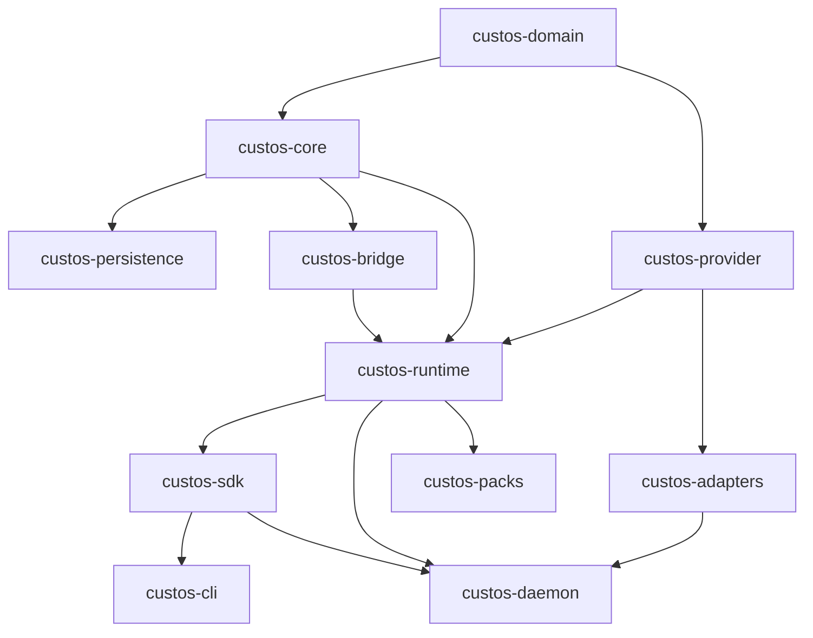
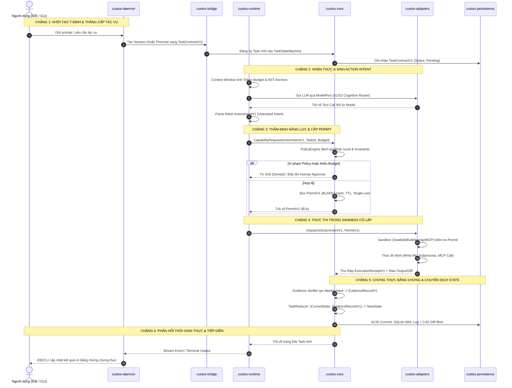

# CUSTOS — HỒ SƠ TINH CHỈNH & QUY HOẠCH KIẾN TRÚC 11 CRATES CHUẨN HÓA

> **Bản đặc tả kỹ thuật và kế hoạch thực thi tinh chỉnh toàn diện hệ thống Custos.**  
> Chuyển đổi từ mô hình ~76 micro-crates phân mảnh về đúng **11 Crates Tiêu Chuẩn**, thiết lập chuẩn mực **Sovereign Proof-Carrying Runtime**.

---

## MỤC LỤC

1. [Tầm Nhìn & 6 Nguyên Tắc Kiến Trúc](#1-tầm-nhìn--6-nguyên-tắc-kiến-trúc)
2. [Kiến Trúc Đích 11 Crates (6 Tiers)](#2-kiến-trúc-đích-11-crates-6-tiers)
3. [Kiến Trúc Luồng Dữ Liệu Toàn Diện (End-to-End Data Flow)](#3-kiến-trúc-luồng-dữ-liệu-toàn-diện-end-to-end-data-flow)
4. [Ma Trận Sáp Nhập & Định Vị Tế Bào (Merge Matrix & Module Mapping)](#4-ma-trận-sáp-nhập--định-vị-tế-bào-merge-matrix--module-mapping)
5. [Danh Sách Thanh Lọc & Đóng Băng Dead Code](#5-danh-sách-thanh-lọc--đóng-băng-dead-code)
6. [Khế Ước Cốt Lõi V1 (Kernel Contracts SSOT)](#6-khế-ước-cốt-lõi-v1-kernel-contracts-ssot)
7. [Lộ Trình Thực Thi 4 Giai Đoạn (Migration Playbook)](#7-lộ-trình-thực-thi-4-giai-đoạn-migration-playbook)
8. [Tiêu Chí Kiểm Thử & Chấp Thuận (Definition of Done)](#8-tiêu-chí-kiểm-thử--chấp-thuận-definition-of-done)

---

## 1. TẦM NHÌN & 6 NGUYÊN TẮC KIẾN TRÚC

### 1.1. Tầm nhìn
Custos là **Proof-Carrying Agentic Work Runtime** dành cho Software Engineer và Research Scientist. Custos biến các ý định bằng ngôn ngữ tự nhiên thành công việc có kiểm chứng, an toàn tuyệt đối, có khả năng phục hồi sau sự cố, tối ưu chi phí qua cơ chế Cognitive S1/S2 và vận hành hoàn toàn có chủ quyền (*sovereign*).

### 1.2. Sáu nguyên tắc tinh chỉnh (Guiding Principles)

```
┌────────────────────────────────────────────────────────────────────────┐
│ NGUYÊN TẮC 1: MỘT CONCERN, MỘT CHỖ (Single Responsibility)             │
│ ├── Không có hai crate làm cùng một nhiệm vụ.                          │
│ └── Nếu trùng lặp logic → Hợp nhất vào crate chủ quản.                 │
├────────────────────────────────────────────────────────────────────────┤
│ NGUYÊN TẮC 2: GOLDILOCKS PACKAGING (11 Crates Tiêu Chuẩn)              │
│ ├── Không phân mảnh vi mô (<500 LOC/crate) gây nghẽn Linker/Cargo.     │
│ └── Không Monolith mất ranh giới an ninh (Trust Boundaries).           │
├────────────────────────────────────────────────────────────────────────┤
│ NGUYÊN TẮC 3: RANH GIỚI TIN CẬY RÕ RÀNG (Boundary of Trust)            │
│ ├── Tầng Core duy nhất có quyền ký Permit và chuyển dịch State.        │
│ └── Mọi I/O ngoại vi (LLM, MCP, Shell) bị cô lập ở Adapters.           │
├────────────────────────────────────────────────────────────────────────┤
│ NGUYÊN TẮC 4: THƯ MỤC PHẲNG VÀ NÔNG (Tối đa 2 tầng)                   │
│ ├── Chuẩn: crates/custos-<name>/src/...                                │
│ └── Xóa bỏ thư mục lồng sâu 3-4 tầng phân tán.                         │
├────────────────────────────────────────────────────────────────────────┤
│ NGUYÊN TẮC 5: DOMAIN LOGIC THUẦN TÚY (Pure Domain SSOT)                │
│ ├── custos-domain chỉ chứa pure data types, enums, state contracts.    │
│ └── Zero I/O, Zero Tokio, Zero Network, No-std capable.                │
├────────────────────────────────────────────────────────────────────────┤
│ NGUYÊN TẮC 6: BẤT BIẾN KHÔNG RETRY MÙ (No Blind Retry)                 │
│ ├── Mọi ActionIntent phải có Permit tương ứng mới được dispatch.       │
│ └── Trạng thái Uncertain bắt buộc phải đối soát qua EvidenceRecord.   │
└────────────────────────────────────────────────────────────────────────┘
```

---

## 2. KIẾN TRÚC ĐÍCH 11 CRATES (6 TIERS)



### Bảng Phân Tầng 11 Crates

| Tier | Crate Name | Vai trò cốt lõi | Mức độ Tin cậy |
| :--- | :--- | :--- | :--- |
| **Tier 0** | `custos-domain` | Khế ước hạt nhân thuần túy, Zero I/O, Single Source of Truth (SSOT). | 100% Pure Data |
| **Tier 1** | `custos-core` | State Machine (TaskReducer), cấp phát Permit, xác minh Evidence. | 100% Trusted Core |
| **Tier 1** | `custos-provider` | Ports/Traits (`ModelPort`, `AgentRuntimePort`), request/response types. | 100% Contract Port |
| **Tier 1** | `custos-persistence` | SQLite WAL mode, Content-Addressed Storage (CAS), Migrations. | 100% Durable Store |
| **Tier 1** | `custos-bridge` | Cầu nối Session tạm thời ➔ Task bền vững, kích hoạt Capability Gate. | 100% Promotion Gate |
| **Tier 2** | `custos-runtime` | Não bộ điều phối: Loop, Workflow DAG, Cognitive S1/S2, Context/Memory. | 50% Orchestration |
| **Tier 2** | `custos-adapters` | Thực thi I/O ngoại vi: LLM APIs, MCP Clients, Sandboxes (Seatbelt/Bwrap). | 10% Sandboxed I/O |
| **Tier 3** | `custos-sdk` | Thư viện Client SDK gọi local API hoặc nhúng ngoài. | 50% Client Facing |
| **Tier 4** | `custos-daemon` | Composition Root, HTTP/WebSocket/IPC Server, Background Supervisor. | App Boundary |
| **Tier 4** | `custos-cli` | Thin client giao diện dòng lệnh (TUI, REPL, Command Runner). | Client App |
| **Tier 5** | `custos-packs` | Tri thức nghiệp vụ: Engineering, Research, Assistant (IR & Prompts). | Domain Workflows |

---

## 3. KIẾN TRÚC LUỒNG DỮ LIỆU TOÀN DIỆN (END-TO-END DATA FLOW)

Mọi biến đổi trạng thái trong Custos đều tuân theo chu trình 6 chặng khép kín:



### Biến Đổi Cấu Trúc Dữ Liệu Hạt Nhân
1. **`UserPrompt`** ➔ `Session` (tạm thời) ➔ [Bridge] ➔ **`TaskContractV1`** (bền vững).
2. **`ContextPacket`** (Prompts, Memory, AST) ➔ [LLM Provider] ➔ **`ActionIntentV1`** (chưa tin cậy).
3. **`ActionIntentV1`** ➔ [CapabilityGateway + PolicyEngine] ➔ **`PermitV1`** (vé quyền năng có chữ ký).
4. **`PermitV1` + `ActionIntentV1`** ➔ [Sandbox Jail] ➔ **`ExecutionReceiptV1`** (kết quả thô).
5. **`ExecutionReceiptV1`** ➔ [EvidenceEngine] ➔ **`EvidenceRecordV1`** (mã băm BLAKE3, Merkle proof).
6. **`CurrentState` + `EvidenceRecordV1`** ➔ [TaskReducer] ➔ **`NewTaskState`** + Append-only SQLite WAL commit.

---

## 4. MA TRẬN SÁP NHẬP & ĐỊNH VỊ TẾ BÀO (MERGE MATRIX & MODULE MAPPING)

### TIER 0: Lõi Dữ Liệu Thuần (Pure Data)

#### 1. `crates/custos-domain`
*   **Nguồn:** `crates/core/custos-domain`
*   **Hành động:** Giữ nguyên tên và vị trí phẳng `crates/custos-domain`. Chuẩn hóa các struct hạt nhân thành `TaskContractV1`, `ActionIntentV1`, `PermitV1`, `EvidenceRecordV1`.
*   **Module nội bộ:**
    *   `src/task.rs`: `TaskContractV1`, `TaskStatus`, `TaskRevision`, Epoch.
    *   `src/action.rs`: `ActionIntentV1`, `ActionLifecycleState`, No-Blind-Retry Invariant.
    *   `src/authority.rs`: `PermitV1`, `CapabilityRequest`, `RiskLevel`.
    *   `src/evidence.rs`: `EvidenceRecordV1`, `VerificationClaimV1`, `EvidenceStatus`.
    *   `src/session.rs`, `src/run.rs`, `src/workflow.rs`, `src/budget.rs`.

---

### TIER 1: Lõi Nghiệp Vụ Tin Cậy (Trusted Logic)

#### 2. `crates/custos-core`
*   **Nguồn sáp nhập:**
    *   `crates/core/custos-kernel` ➔ `src/kernel/`
    *   `crates/runtime/custos-security/src/authority/` ➔ `src/authority/`
    *   `crates/runtime/custos-security/src/evidence/` ➔ `src/evidence/`
    *   `crates/runtime/custos-security/src/gateway/` ➔ `src/capability/`
*   **Vai trò:** Quản lý State Machine (`TaskReducer`), cấp `PermitV1`, xác minh `EvidenceRecordV1`. Kiểm soát tuyệt đối mọi biến đổi trạng thái.

#### 3. `crates/custos-provider`
*   **Nguồn sáp nhập:**
    *   `crates/core/custos-provider-sdk` ➔ `src/`
    *   `crates/core/custos-provider-types` ➔ `src/types.rs`
*   **Vai trò:** Định nghĩa Ports/Traits (`ModelPort`, `AgentRuntimePort`). Không chứa HTTP client vendor.

#### 4. `crates/custos-persistence`
*   **Nguồn:** `crates/infrastructure/custos-persistence`
*   **Hành động:** Chuyển ra `crates/custos-persistence`. Đảm bảo lưu trữ SQLite WAL mode, Journal Event append-only và CAS (Content-Addressed Storage).

#### 5. `crates/custos-bridge`
*   **Nguồn:** `crates/core/custos-bridge`
*   **Hành động:** Chuyển ra `crates/custos-bridge`. Quản lý thăng cấp `Session` thành `TaskContractV1`, tích hợp cổng gọi `CapabilityGateway`.

---

### TIER 2: Điều Phối & Tích Hợp (Orchestration & Integrations)

#### 6. `crates/custos-runtime` (Sáp nhập lớn nhất)
*   **Nguồn sáp nhập:**
    *   `crates/runtime/custos-agent` + `custos-engine` ➔ `src/agent/` (Agent Loop, Turn Dispatch)
    *   `crates/runtime/custos-session` ➔ `src/session/` (Session lifecycle management)
    *   `crates/runtime/custos-workflow` ➔ `src/workflow/` (DAG orchestrator, step scheduler)
    *   `crates/runtime/custos-cognitive` ➔ `src/cognitive/` (S1 Fast / S2 Slow deliberation)
    *   `crates/runtime/custos-gateway` ➔ `src/gateway/` (Dispatch routing, token budget tracking)
    *   `crates/runtime/custos-context` + `custos-context-management` ➔ `src/context/` (Windowing, token counter, AST retrieval)
*   **Vai trò:** Khối "não bộ" xử lý tiến trình tác tử.

#### 7. `crates/custos-adapters` (Mọi tương tác ngoại vi)
*   **Nguồn sáp nhập:**
    *   `crates/adapters/providers/antigravity`, `claude`, `codex`, `local-model`, `fake` ➔ `src/model/`
    *   `crates/adapters/custos-mcp` + `custos-adapters-mcp` ➔ `src/mcp/`
    *   `crates/adapters/sandboxes/*` (seatbelt, bubblewrap) ➔ `src/sandbox/`
    *   `crates/adapters/custos-local-inference` ➔ `src/local_inference/`
    *   `crates/adapters/custos-download-manager` ➔ `src/download_manager/`
    *   `crates/adapters/custos-roaming` ➔ `src/roaming/`
*   **Vai trò:** Nơi chứa các thao tác I/O ngoại vi (HTTP requests, vendor parse JSON, OS subprocess).

---

### TIER 3: Cổng Giao Tiếp (SDK)

#### 8. `crates/custos-sdk`
*   **Nguồn sáp nhập:** `crates/core/custos-sdk` + `crates/core/custos-sdk-types`
*   **Vai trò:** Xuất khẩu client types và bindings cho ứng dụng ngoài hoặc SDK clients.

---

### TIER 4: Ứng Dụng (Apps)

#### 9. `crates/custos-daemon`
*   **Nguồn sáp nhập:** `crates/app/custos-daemon` + `crates/app/custos-local-api`
*   **Vai trò:** Composition root. Khởi tạo toàn bộ dependency injection, mở cổng REST/WebSocket/IPC, giám sát tiến trình nền.

#### 10. `crates/custos-cli`
*   **Nguồn:** `crates/app/custos-cli`
*   **Vai trò:** Giao diện dòng lệnh mỏng (Thin client, TUI indicatif/console).

---

### TIER 5: Khối Nghiệp Vụ Chuyên Biệt (Packs)

#### 11. `crates/custos-packs`
*   **Nguồn sáp nhập:**
    *   `crates/packs/custos-packs-engineering` ➔ `src/engineering/`
    *   `crates/packs/custos-packs-research` ➔ `src/research/`
    *   `crates/packs/custos-packs-assistant` ➔ `src/assistant/`
*   **Vai trò:** Chứa declarative workflows, prompt templates, domain IRs.

---

## 5. DANH SÁCH THANH LỌC & ĐÓNG BẰNG DEAD CODE

Các crate và module sau đây bị xóa bỏ hoàn toàn khỏi Workspace:

1. `crates/adapters/judgments/jev` (Thư mục rỗng).
2. `crates/adapters/judgments/onnx` (Thư mục rỗng).
3. `crates/adapters/judgments/rules` (Thư mục rỗng).
4. `crates/adapters/judgments/contracts` (Hòa tan vào `custos-domain`).
5. `crates/runtime/custos-memory-service` (19 LOC, hòa tan vào `custos-runtime/src/context`).
6. `crates/adapters/custos-acp-macros` (Macro cũ không còn sử dụng).

---

## 6. KHẾ ƯỚC CỐT LÕI V1 (KERNEL CONTRACTS SSOT)

Để đảm bảo tính nhất quán tuyệt đối giữa các module, 4 struct sau trong `crates/custos-domain` là bất biến:

### 6.1. ActionIntentV1 & Invariant Không Blind Retry
```rust
#[derive(Debug, Clone, Serialize, Deserialize)]
pub struct ActionIntentV1 {
    pub id: String,                    // act_xxxx
    pub task_id: String,               // task_xxxx
    pub name: String,                  // "write_file", "run_command", "fetch_url"
    pub target: String,                // Path or URL
    pub parameters: serde_json::Value, // Tool inputs
    pub risk_level: RiskLevel,         // Low, Medium, High, Critical
    pub lifecycle_state: ActionLifecycleState,
    pub evidence_required: bool,
    pub permit_id: Option<String>,
}

#[derive(Debug, Clone, Copy, PartialEq, Eq, Serialize, Deserialize)]
pub enum ActionLifecycleState {
    Intent,       // Ý định vừa được LLM đề xuất (Untrusted)
    Permitted,    // Đã được CapabilityGateway & Policy phê duyệt
    Dispatching,  // Đang gửi tới Sandbox Adapter để thực thi
    Receipt,      // Đã thực thi xong và có ExecutionReceiptV1
    Uncertain,    // Mất kết nối/Crash giữa chừng — CẤM RETRY MÙ QUÁNG
    Failed,       // Thất bại có xác nhận
}
```

### 6.2. TaskContractV1 & Trạng Thái Bền Vững
```rust
#[derive(Debug, Clone, Serialize, Deserialize)]
pub struct TaskContractV1 {
    pub id: String,
    pub title: String,
    pub pack_id: String,
    pub status: TaskStatus,
    pub epoch: u64,
    pub state_version: u64,
    pub required_capabilities: Vec<String>,
    pub evidence_requirements: Vec<EvidenceRequirement>,
}

#[derive(Debug, Clone, Copy, PartialEq, Eq, Serialize, Deserialize)]
pub enum TaskStatus {
    Draft, Queued, Running, Blocked, Succeeded, Failed, Cancelled,
}
```

### 6.3. EvidenceRecordV1 & Merkle Hash Proof
```rust
#[derive(Debug, Clone, Serialize, Deserialize)]
pub struct EvidenceRecordV1 {
    pub id: String,                    // ev_xxxx
    pub task_id: String,
    pub action_id: Option<String>,
    pub kind: String,                  // "file_diff", "test_pass", "ast_anchor"
    pub digest: String,                // BLAKE3 hash of raw artifact
    pub status: EvidenceStatus,        // Pass, Fail, Stale, Unknown
    pub source_version: Option<String>,// Git commit / file hash
    pub payload: serde_json::Value,
    pub recorded_at: chrono::DateTime<chrono::Utc>,
}
```

### 6.4. PermitV1 (Capability Token)
```rust
#[derive(Debug, Clone, Serialize, Deserialize)]
pub struct PermitV1 {
    pub id: String,                    // permit_xxxx
    pub action_id: String,
    pub granted_capabilities: Vec<String>,
    pub expires_at: chrono::DateTime<chrono::Utc>,
    pub signature: String,             // Chữ ký xác thực của Authority
}
```

---

## 7. LỘ TRÌNH THỰC THI 4 GIAI ĐOẠN (MIGRATION PLAYBOOK)

```
┌────────────────────────────────────────────────────────────────────────┐
│ GIAI ĐOẠN 1: ĐÓNG BĂNG & DỌN RÁC (Freeze & Cleanup)                    │
│ ├── Xoá bỏ hoàn toàn các crate rỗng (jev, onnx, rules, macros).        │
│ └── Tạo khung 11 thư mục đích phẳng trực tiếp trong crates/.           │
├────────────────────────────────────────────────────────────────────────┤
│ GIAI ĐOẠN 2: TẠO VỎ & DỊCH CHUYỂN BẢO TOÀN GIT (Shelling & Moving)    │
│ ├── Khởi tạo Cargo.toml mới cho 11 crate với dependency graph đã chốt.  │
│ └── Dùng `git mv` chuyển thư mục src cũ thành sub-modules mới.         │
├────────────────────────────────────────────────────────────────────────┤
│ GIAI ĐOẠN 3: PHỤC HỒI DEPENDENCY & WIRING (Wiring & Import Rewriting)   │
│ ├── Cập nhật Root Cargo.toml đúng 11 crates.                           │
│ └── Tự động rewrite imports (custos_kernel ➔ custos_core::kernel).    │
├────────────────────────────────────────────────────────────────────────┤
│ GIAI ĐOẠN 4: SỬA LỖI BIÊN DỊCH & VERIFICATION (Compilation & Tests)    │
│ ├── Sửa lỗi visibility (pub(crate) vs pub) và feature flags.           │
│ ├── Lắp ráp lại Composition Root trong custos-daemon.                  │
│ └── Chạy cargo check, cargo test, và tests/contract verification.      │
└────────────────────────────────────────────────────────────────────────┘
```

---

## 8. TIÊU CHÍ KIỂM THỬ & CHẤP THUẬN (DEFINITION OF DONE)

1. **Workspace Purity**: Số lượng crates trong workspace đạt đúng **11 crates**.
2. **Compilation**: `cargo check --workspace` hoàn thành không cảnh báo nghiêm trọng.
3. **Test Integrity**: `cargo test --workspace` vượt qua 100% test cases hiện hành.
4. **Contract Verification**: `tests/contract` và `tests/e2e` xác thực luồng `ActionIntentV1` ➔ `PermitV1` ➔ `EvidenceRecordV1` thành công.
5. **No Blind Retry**: Test suite kiểm chứng trạng thái `Uncertain` bắt buộc đối soát evidence, không bao giờ retry mù quáng.
