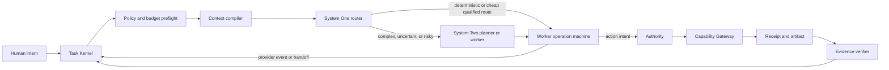

# Custos: Nexus Audit and Reassembly Blueprint V2

> **⚠️ HISTORICAL SPECIFICATION ARCHIVE — NON-NORMATIVE**  
> This document records a Nexus AST audit of the early 34-crate snapshot from 2026-09-26.  
> - **Current Empirical Audit Baseline:** [`docs/status/local-dev-audit-2026-09-28.md`](../status/local-dev-audit-2026-09-28.md)  
> - **Current 42-Crate Layout:** [`docs/development/repository-structure.md`](../development/repository-structure.md)

Date: 2026-09-26  
Audited revisions: Custos `acc6dbd2a1d7648227b26c4327200008d11951f7` plus preserved working-tree changes; Goose `9adae14b64587a26275fe7c4a822a8e8ccdbd3fd`.

## 1. Evidence baseline

Nexus was rebuilt from the active checkouts, not reused from an older database.

| Repository | Indexed files | AST symbols | Call edges | Semantic chunks |
|---|---:|---:|---:|---:|
| Custos | 272 | 651 | 2,470 | 921 |
| Goose | 2,182 | 13,817 | 102,276 | 22,234 |

The Custos workspace has 34 packages and 67 discovered tests. `cargo test --workspace --all-targets` passes. This proves the current components are internally testable; it does not prove that Custos is an operational agent runtime.

## 2. Direct conclusion

Custos should not embed Goose as a crate, copy Goose wholesale, or imitate Goose's product identity. Goose is the reference harness for provider interaction, tool-loop behavior, MCP interoperability, context compaction, retries, steering, and user-facing agent ergonomics. Custos must remain the durable control plane: Task state, policy, budgets, evidence, recovery, and cross-domain workflows.

The current Custos problem is not lack of crates. It is lack of composition:

- `custos-workflow-runtime` is about 45 Rust lines and has no runtime consumer.
- `custos-cognitive-runtime` is about 177 Rust lines before this audit and has no runtime consumer.
- `custosd` creates one in-memory Task and exits instead of supervising durable work.
- the main E2E test manually invokes each component rather than exercising a real orchestrated loop.
- many adapters compile but are skeletal or return deterministic stub responses.

Therefore, adding more top-level modules would increase architectural surface without increasing product capability.

## 3. Correction to the pasted Goose map

The pasted document is useful as intent but not reliable as a file-level extraction plan. At the pinned Goose SHA, these proposed sources do not exist:

- `crates/goose-mcp/src/stdio_client.rs`
- `crates/goose-mcp/src/sse_client.rs`
- `crates/goose-mcp/src/streamable_http.rs`
- `crates/goose-provider-types/src/usage.rs`
- `developer/text_editor.rs` and `developer/file_search.rs`
- `oauth/pkce.rs` and `providers/anthropic.rs`

The active implementation is split differently: MCP client/transport integration is under `crates/goose/src/agents/extension_manager/`; developer editing is `developer/edit.rs`; Anthropic wire format and provider behavior are separated between `goose-provider-types` and `goose-providers`.

No Goose code should be copied until a per-file license, dependency, behavior, and conformance review exists. In most cases, port the behavior behind Custos ports instead of copying the implementation.

## 4. What Goose actually teaches Custos

Keep these design patterns:

1. An ordered, re-entrant operation pipeline over persisted state.
2. One operation applies per step, persists effects, then the runtime reloads state.
3. Tool definitions and prompt fragments are composed immediately before inference.
4. Cancellation, steering, max-turns, compaction, approval, tool execution, retry, and terminal-error handling are explicit operations.
5. Duplicate tool names are rejected before inference.
6. Tool errors are returned to the model as observable state instead of hidden.
7. Stdio and Streamable HTTP are the primary MCP transports; legacy HTTP+SSE is compatibility only.

Do not import these Goose weaknesses into Custos:

- a monolithic application agent containing product, session, permission, tool, and provider concerns;
- conversation history as the source of truth;
- permission state that is not bound to Custos Task revisions and action receipts;
- provider-specific session semantics leaking into domain contracts;
- unconstrained subagent fan-out;
- copying transport code whose dependency graph is coupled to Goose internals.

## 5. Target runtime

The hot path is deliberately narrow. Hard policy, privacy, capability, context, and budget checks happen before any quality/cost optimization. System One can recommend or abstain but cannot mint authority. System Two proposes plans and actions but cannot declare success. Only verified evidence closes acceptance criteria.

## 6. Cost model

Optimize a constrained decision, not a slogan:

1. reject unhealthy, incapable, privacy-incompatible, context-incompatible, or over-budget routes;
2. honor a user pin or fail visibly; never silently switch;
3. use deterministic code when it fully satisfies the step;
4. route low-complexity and low-risk work to the cheapest qualified System One model;
5. route complex or risky work to the highest-quality qualified System Two model;
6. reserve tokens/cost before dispatch and settle actual usage afterward;
7. cache immutable ContextPacks and content-addressed outputs;
8. expand context progressively and compact tool pairs before summarizing semantic decisions;
9. cap retries, repeated actions, tool calls, subagents, and wall time;
10. benchmark verified success, latency, cost, and human attention separately.

## 7. Assembly order

| Gate | Deliverable | Stop condition |
|---|---|---|
| A | Cognitive route decision | user pin, privacy, capability, context, and cost are hard constraints |
| B | Re-entrant worker operation machine | reload after each persisted effect; cancellation test passes |
| C | Durable `custosd` supervisor | file-backed SQLite, graceful shutdown, restart recovery |
| D | Read-only `repo_explain` through the real runtime | no manual module choreography in E2E |
| E | Controlled patch workflow | permit-bound edit, stale-base rejection, test receipt |
| F | MCP gateway | stdio and Streamable HTTP conformance, Origin/auth checks |
| G | Research workflow | source versions, claim support, citation freshness |
| H | Assistant workflow | draft-first, identity resolution, exact-action receipt |
| I | Adaptive/multi-worker execution | bounded admission, structured handoff, no duplicate work |

Do not start Gate I before Gates B through E survive cancellation and crash tests. Multi-agent execution magnifies unresolved persistence, cost, and authority bugs.

## 8. Implemented safe slice in this audit

`crates/cognitive-runtime/src/routing.rs` now implements a deterministic cost-aware routing policy with:

- hard capability, health, privacy, context, output, quality, and monetary constraints;
- explicit System One versus System Two selection;
- cheap-qualified selection for routine work;
- quality-first selection for complex/risky work;
- strict user-pin behavior with no silent fallback;
- saturating cost estimation and typed domain failures.

Four tests cover cheap routing, deep routing, pin conflicts, and budget admission. The cognitive-runtime test suite passes.

## 9. Governance boundary

The active Custos tree already contains substantial uncommitted work across shared contracts, persistence, adapters, daemon code, and canonical documents. This audit intentionally did not rewrite those changes, modify canonical documentation, create new crates/schemas, or touch another owner's runtime. The next implementation gate should be reviewed as a focused PR: worker operation machine first, then daemon composition, then the real E2E path.

## 10. Primary references

- Local Goose source at the pinned SHA, especially `goose-agent/{machine,operation,inference,tool}.rs` and `goose/src/agents/state_machine/`.
- Official Goose repository: https://github.com/aaif-goose/goose
- MCP 2025-06-18 transports: https://modelcontextprotocol.io/specification/2025-06-18/basic/transports
- MCP 2025-06-18 tools: https://modelcontextprotocol.io/specification/2025-06-18/server/tools
