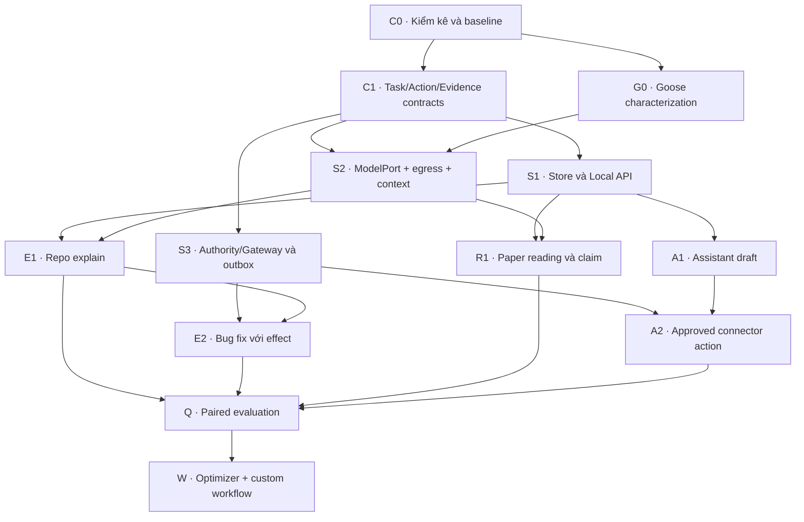

# Custos — kế hoạch chuyển đổi codebase và phát triển sản phẩm

> **⚠️ HISTORICAL SPECIFICATION ARCHIVE — NON-NORMATIVE**  
> This Vietnamese document is an early refactoring and transition plan from 2026-09-25.  
> It does not override the current 42-crate Cargo workspace or active implementation blueprints.  
> - **Current Implementation Blueprint:** [`docs/development/implementation-blueprint.md`](../development/implementation-blueprint.md)  
> - **Current Repository Structure:** [`docs/development/repository-structure.md`](../development/repository-structure.md)

**Phiên bản 1.1 · 25/09/2026 · plan thực thi theo bằng chứng, có bản đồ mổ xẻ file và hợp đồng cho coding agent.**

Tài liệu này là kế hoạch nối kiến trúc Custos với code có thật. Nó tổng hợp các quyết định gần nhất trong `Custos_Architecture_V14_First_Principles_Goose_Research_VI.md`, `Custos_Product_Feature_Architecture_V14_1_VI.md`, `CUSTOS_DINH_HINH_BAI_TOAN_VA_KIEN_TRUC_SAN_PHAM_VI.md`, source atlas Goose ngày 25/09/2026 và tình trạng `agenthub-starter/` đọc được trong workspace. Đây là **kế hoạch triển khai**, không là bằng chứng Custos trên máy Vĩ đã được kiểm/build, và không ép phải tạo toàn bộ thư mục của các bản “complete monorepo”.

> **Đích:** Custos là runtime local-first cho một developer; một Task tiếp tục được qua phiên và provider, ba pack Engineering/Research/Assistant tạo kết quả có bằng chứng, con người giữ quyền quyết định, chi phí tối ưu trong giới hạn chất lượng và thời gian đã đo.

## Cách dùng plan

- Phần A: nguồn sự thật và quyết định bất biến.
- Phần B: kiểm kê và chuyển code cũ sang Custos.
- Phần C: đồ thị phụ thuộc, các cổng nghiệm thu và từng issue.
- Phần D: ba pack, UI, đa nền tảng, phép đo, cách làm việc ba người.
- Phần E: checklist đủ để khởi công, điều kiện chặn release, mẫu task.
- Phần G: file nào trong Custos/Goose, thao tác cụ thể, thứ tự PR và điều kiện dừng cho coding agent.

**Quy tắc đọc trạng thái:** `DESIGN` là ý tưởng; `SCAFFOLD` là interface/file chưa xử lý nghiệp vụ; `IMPLEMENTED` đã chạy được một luồng cụ thể; `MEASURED` có benchmark cùng baseline. Đừng nâng nhãn từ DESIGN lên IMPLEMENTED theo số lượng thư mục hoặc theo một deep dive chỉ dẫn đường dẫn local.

---

## A. Sản phẩm và nguồn sự thật

### A1. Vì sao cần migration plan riêng

Bản kiến trúc 27 chương trả lời “Custos sẽ vận hành như thế nào”. Refactor cần thêm bốn câu: **bản code đang có thật gì; nguồn nào được giữ; chuyển state/dữ liệu như thế nào; chứng minh hành vi mới tương đương hoặc tốt hơn ra sao**. Các file Rust-first monorepo hiện là **blueprint**; nếu baseline đang là Python, đổi runtime sang Rust là migration có thể phá tương thích, không chỉ refactor thư mục.

Quan sát trong workspace này:

| Nguồn | Có thể khẳng định từ đây | Chưa thể khẳng định |
|---|---|---|
| `agenthub-starter/` | Scaffold Python 3.12+, CLI deterministic, Task/SQLite WAL/artifact, demo tool gate; **15 unit/integration tests pass** và architecture import check pass khi chạy tại đây ngày 25/09/2026. | Đây có phải Git HEAD/current production Custos trên Mac của Vĩ hay không; nó không có daemon/model/ba pack chạy đủ. |
| Các tài liệu kiến trúc Custos | Bất biến Task/Authority/Evidence, hợp đồng Pack, mặt UI, target polyglot, issue catalog. | Directory/LOC/cargo build ở máy Vĩ. |
| Goose source atlas | Code map có SHA pin; Goose có candidate provider/tool/MCP/worker; có hai agent loop tại snapshot được audit. | Goose local clone của Vĩ ở commit nào; code trích sang Custos có build, bảo vệ effect hay nhanh hơn không. |

Hai bản `CUSTOS_COMPLETE_ARCHITECTURE_DEEP_DIVE_VI(1).md` và `GOOSE_COMPLETE_ARCHITECTURE_DEEP_DIVE_VI(1).md` được gửi lại ngày 25/09/2026 **giống byte** với hai bản đã đọc trước đó. Chúng là nguồn ý tưởng và danh sách candidate path, không phải bằng chứng code Custos đang chạy hoặc mọi tính năng Goose đều an toàn để port.

**Ưu tiên nguồn:** checkout, test output và trace của Custos đang định sửa → contract đã chốt và ADR → source upstream tại SHA chọn → bản research/blueprint. Khi các tài liệu mâu thuẫn, tạo ADR và fixture để chọn, không sửa code theo số phiên bản tài liệu lớn hơn.

### A2. Sáu bất biến cho mọi PR

1. TaskContract/TaskRevision giữ ý định user; thay source version chỉ làm stale phần evidence phụ thuộc.
2. Model/S1/pack không tự cấp quyền. Grant → approval khi cần → permit tại thời điểm dispatch → effect qua Gateway *trong profile thực sự mediated*.
3. Action có identity bền vững và lifecycle `INTENT → PERMIT → DISPATCHING → RECEIPT | UNCERTAIN`; không retry mù action kết quả không rõ.
4. Evidence nói criterion, exact inputs/version, verifier/version và trạng thái `pass/fail/unknown/stale`; WorkerRun hoàn tất không tự làm Task thành công.
5. Context đi theo scope, sensitivity, egress, freshness, provenance; personal memory không tự đi vào coding/research.
6. Capability được ghi thật: `mediated / provider-governed / observe-only / unknown`. Chỉ API design không tạo OS sandbox khi cùng process hoặc external agent có native tools.

**Mục tiêu tối ưu:** tiết kiệm chi phí thực theo task class khi chất lượng được đánh giá >= baseline phù hợp; ưu tiên fast path trong Assist. Không hứa 80–98% hay overhead <= 3 giây trước benchmark. Người dùng pin provider/model được giữ trừ khi họ cho phép fallback rõ ràng; baseline thiếu egress permission cũng không được dùng.

### A3. Phạm vi và ranh giới ra quyết định

| Quyết định ngay | Cần spike rồi chốt | Chỉ mở rộng khi có use case |
|---|---|---|
| Rust modular monolith làm product runtime; SQLite + CAS; Local API; ModelPort khác AgentRuntimePort; một Task xuyên ba pack; rules-first S1; explicit approvals. | Lấy code Goose nào, baseline Python chuyển phần nào, lựa chọn IPC và packaging, executor/sandbox từng OS, parser PDF, model local nào đạt quality gate. | AgentGateway, 9Router/gateway aggregation, GraphRAG/vector DB, ACP external agents, desktop/voice, federated multi-user, trained router. |

Không xây microservice/stack ML chỉ vì sơ đồ có nhiều planes. Không trộn “model endpoint gateway” (provider routing) với “Capability Gateway” (ủy quyền effect). Chọn thêm ngôn ngữ khi nó có giá trị thực: TypeScript UI, Python parsing/evaluation/optional ML, SQL migrations; Rust sở hữu canonical decisions.

---

## B. Kiểm kê code và phương án chuyển đổi

### B1. Cổng 0: xác lập mã nguồn thật

Chạy trong **checkout Custos và Goose thực của Vĩ**, mỗi repo riêng. Thu thập read-only, lưu báo cáo ngoài secret:

```bash
git rev-parse HEAD
git status --short
rg --files -g 'Cargo.toml' -g 'pyproject.toml' -g 'package.json' \
            -g 'pnpm-workspace.yaml' -g 'AGENTS.md' -g '*.sql'
rg --files crates apps packs sidecars src tests 2>/dev/null | head -200
```

Với Custos: kiểm `cargo metadata --no-deps` nếu có Cargo workspace, `cargo test --workspace` khi toolchain tương thích, `pnpm -r typecheck` khi có TS và test Python hiện hữu. Với Goose: chỉ chạy test phù hợp trên chính checkout, ghi SHA, phiên bản toolchain và failures. **Không** xuất `.env`, key hay nội dung email; `git status --short` cho biết working tree có thay đổi, đừng vô tình chạy destructive checkout.

**Output C0:** `docs/status/codebase-inventory.md` ghi SHA/path, môi trường/OS, module, tests chạy, trạng thái từng behavior, dependency map, các DB/schema và ai sở hữu. `docs/status/feature-state.md` bắt đầu từ ba pack + shared runtime, có `DESIGN/SCAFFOLD/IMPLEMENTED/MEASURED`. Xác định `agenthub-starter` là baseline tham khảo, repo cũ đang dùng hay thư mục không liên quan; không gộp nó tự động.

### B2. Bảng phân loại cho từng module

| Nhãn | Khi nào dùng | Hành động |
|---|---|---|
| KEEP | Hành vi đúng, kiến trúc đúng, test có ý nghĩa | Giữ, thêm contract nếu boundary qua process |
| WRAP | Core logic hữu ích nhưng interface sai | Tạo adapter tạm, test conformance, lên kế hoạch bỏ wrapper |
| PORT | Thuật toán/behavior có giá trị, runtime/language thay | Viết bản mới sau fixture characterization, compare old/new |
| REPLACE | Semantics trái invariants, không nên giữ runtime path | Chặn đường cũ, xây đường mới, migrate dữ liệu nếu có |
| RETIRE | Dead/duplicate/experimental code | Ghi ADR và điều kiện xóa, không để production import |
| DEFER | Chưa có task/use case hoặc chưa qua spike | Chỉ ghi contract tối thiểu, không làm cả stack |

Mỗi entry phải có `path/SHA → current behavior → target owner → state/schema impact → coverage → risks → PR/rollback route`. “34 crates” trong bản deep dive không là danh sách authoritative cho tới C0; blueprint 1.300+ dòng là hướng đặt tên, không là lệnh tạo crate rỗng.

### B3. Quy tắc chuyển Python scaffold và DB

Nếu `agenthub-starter` là baseline thực: đóng băng bản reference ở commit/tag, chạy bộ 15 test làm characterization, bổ sung fixtures cho hành vi cần giữ, **không copy `recover` của builtin demo** để chạy email/git push. Xác định có user data cần giữ trước khi chốt schema: trường hợp chưa có dữ liệu dùng migration mới sạch; có dữ liệu cần import/export versioned, kiểm checksum/row counts/semantics, dry-run + restore. Chạy Rust core mới trên DB riêng hoặc safe migrated copy trong quá trình đối chiếu; tránh hai process cùng ghi một DB. Chỉ chuyển default CLI sang core mới sau khi workflow tối thiểu và rollback/restore pass.

Nếu Custos local đã có Rust crates, map từng crate vào boundary (contracts, kernel, workflow, authority, gateway, models, knowledge, persistence, packs, API, UI). Giữ tên cũ tạm thời để PR ít chạm, chỉ rename/tách khi dependency/coupling có số liệu. **Không rewrite đồng loạt theo plan chỉ vì khác tên crate.**

### B4. Ba nhánh thử Goose

| Candidate | Spike tách riêng | Quyết định cần lưu |
|---|---|---|
| Một direct provider adapter | Fake-stream, tool JSON, cancellation, usage unknown, lỗi/rate limit, dependency footprint | Wrapper / extract / implementation mới |
| Worker loop `goose-agent` hoặc loop đang active | Fake model + fake tool; chặn tool trước effect; crash windows; bypass from callbacks/shell | Chỉ port một path nếu test mediation đạt; nếu không dùng loop Rust nhỏ |
| MCP/analyze/context | Tool launch/call policy; code search accuracy trên dirty repo; exact citations sau compaction | Adopt khi vượt baseline `rg`/FTS/direct `rmcp` về value/cost |

Chọn **một SHA Goose duy nhất** trước khi copy; `third_party/GOOSE_SOURCE.md` ghi source path/hash → destination, license/NOTICE, modifications, deps, tests, upstream drift trigger. Hai SHA đã được audit trước đó không được trộn. Tên package, capability và đường dẫn nguồn phải ghi đúng theo checkout đã pin.

---

## C. Đồ thị công việc và các cổng nghiệm thu

### C1. Đường găng



Dependencies là tối thiểu, không ép Research phải chờ Engineering mutation. Bộ đánh giá và UI shape bắt đầu ngay ở C1 rồi chạy tới từng slice; node Q thể hiện kết luận so sánh sau khi có artifacts, không có nghĩa chờ cuối mới viết telemetry.

### C2. Cổng nghiệm thu

| Gate | Giá trị user có thể dùng | Exit criteria bắt buộc | Nếu không đạt |
|---|---|---|---|
| **C0 Truth** | Biết code nào chạy, nợ và dữ liệu hiện có | SHA, tree, tests output, module inventory, KEEP/PORT/REPLACE map, migration data decision | Chưa refactor diện rộng; giảm scope |
| **C1 Contracts** | Ba người viết song song không lệch semantics | Task/Revision, Intent/Attempt/Receipt, Evidence, ContextPack, WorkflowIR, errors/version test vectors; ADR canonical state | Đóng issue có contract mismatch trước |
| **G0 Goose** | Module thực sự hữu ích được pin | Build/repro fake-model/tool; license; kill/permission/bypass tests nếu port loop; size/build/maintenance measured | Dùng direct adapter hoặc tiny worker của Custos |
| **K1 Kernel** | Task tạo, đọc, pause, restart | Transactional state + audit/outbox/dedup; single owner; copy DB restore check | Giữ old runtime read-only, không chạy effect |
| **E1 Engineering read** | `repo_explain` có source | Repo dirty snapshot + egress; anchored answer, check exact excerpt, persist/reopen; baseline same model | Thu hẹp supported repo/language |
| **X1 Controlled effect** | Patch đề xuất, apply và verify | Grant/approval/permit; scope/path/symlink check; crash matrix, uncertain/reconcile; test trên exact patch hash | Không enable mutation |
| **R1 Research** | Đọc paper/nguồn và claim map | Versioned source, parse coverage, valid locator ≠ support, counterexample, reopen, Markdown export conflict check | Ghi unknown/partial, không gắn “verified” |
| **A1 Assistant** | Draft/prepare có nguồn và scope | Resolve recipient/timezone, preview immutable draft, no-send fixture; personal memory isolation | Read/draft-only |
| **A2 Assistant effect** | Action được duyệt với receipt | Exact payload/target/expiry approval, unknown send/reconcile, duplicate test, connector test double | Tiếp tục draft-only |
| **Q1 Quality/cost** | Tin được số hiển thị | Paired baseline, task strata, quality gates, p50/p95, all retries/local compute/human time, confidence interval | Rules/user pin; chưa bật routing động |
| **P1 Product surfaces** | CLI/VS Code UI thực sự cùng Task | Task/evidence/approval/usage, reconnect cursor, no false success, tested OS matrix | Giữ CLI stable; IDE opt-in |
| **W1 Workflow authoring** | Template/custom/delegated có giới hạn | Typed DAG compiler, child grants, bounded retry, resume, conflict handling, user preview | Một worker/template cố định |

Gates có thể song song phần độc lập; không gắn nhãn “MVP đạt” khi mới có contracts của một pack. **Tối thiểu để công bố ba pack:** E1, R1, A1 cùng common Task + UI baseline; mutation/send cần X1/A2 gate tách biệt.

### C3. Tài liệu quyết định bắt buộc

| ADR | Câu hỏi cần chốt | Gate |
|---|---|---|
| 001 State | Canonical current rows + audit/outbox, revision/invalidation | C1 |
| 002 Goose | Pin SHA, trích file nào, bypass/effect tests, license/drift | G0 |
| 003 Execution profile | Mức mediated và sandbox từng OS/tool, external agents | X1 |
| 004 Data lifecycle | CAS excerpts, secrets, retention, memory/delete/backup | C1/R1/A1 |
| 005 Provider contract | ModelPort vs AgentRuntimePort, usage/cancel/fallback | E1 |
| 006 Evaluation | Quality vector, baseline strata, latency/cost ledger | Q1 |
| 007 API/sidecars | Local IPC+events, schema version, Python/TS contracts | K1/P1 |
| 008 Migration | Có/không import dữ liệu Python hoặc schema cũ, rollback | C0/K1 |

---

## D. Backlog chi tiết để giao cho ba người

Mỗi hàng là một issue có thể review, không phải giao “làm nguyên pack”. Owner chính chịu demo; người còn lại review contract, failure mode và user meaning. Trạng thái tất cả mục dưới đây là **PROPOSED**, trừ kết quả C0 read-only đã ghi trong phần A.

### D1. Foundation và migration

| ID | Owner → Reviewer | Đầu ra kiểm được | Phụ thuộc |
|---|---|---|---|
| F01 | Trường → Vinh | Snapshot checkout Custos + Goose và baseline tests, environment manifest | Start |
| F02 | Vinh → Vĩ | KEEP/WRAP/PORT/REPLACE/RETIRE/DEFER map của module/DB; dependency graph | F01 |
| F03 | Vĩ → cả hai | Product acceptance set: 3 jobs, privacy/quality/latency/cost definition | Start |
| F04 | Trường → Vinh | Task/Revision/Evidence wire/domain contracts + semantic invalid examples | F02,F03 |
| F05 | Vinh → Trường | WorkflowIR/WorkerRun/Action state tables, bounded retry/yield/amendment contracts | F04 |
| F06 | Trường → Vĩ | DB adapter, versioned migrations, transactional current state + audit/outbox/dedup | F04 |
| F07 | Trường → Vinh | Local API create/get/steer/events auth, CLI client, reconnect test | F06 |
| F08 | Vinh → Trường | Daemon lifecycle, scheduler sequential node, lease/fence, recovery tests | F05,F06 |
| F09 | Trường → Vĩ | Artifact CAS/source byte snapshots, manifest/ref/GC grace, backup/restore drill | F06 |
| F10 | Trường → Vĩ | Budget reservation/settlement ledger, unknown cost semantics | F06 |

### D2. Model, context, effect

| ID | Owner → Reviewer | Đầu ra kiểm được | Phụ thuộc |
|---|---|---|---|
| G01 | Vinh → Vĩ/Trường | Goose SHA+source map+license+one provider fake stream spike | F04 |
| G02 | Vinh → Trường | One worker loop intercepted call/crash probe, or documented reject | G01,F05 |
| M01 | Vĩ → Vinh | Direct ModelPort adapter + capability probe + stream/cancel/errors/usage | F04,G01 optional |
| M02 | Vĩ → Trường | Egress/data sensitivity preflight + redacted context manifest | M01,F04 |
| M03 | Vĩ → Vinh | Repo snapshot/rg/FTS fast path, exact anchors, dirty buffer handling | F09 |
| M04 | Vĩ → Trường | ContextPack compiler and omissions/invalidation; test missing mandatory fact | M02,M03 |
| X01 | Trường → Vinh | Grant, exact approval, permit/revoke API and double-consume race fixtures | F04,F06 |
| X02 | Trường → Vinh | Gateway + intent/attempt/receipt/uncertain/reconciler, fake file tool | X01,F08 |
| X03 | Vinh → Trường | OS execution profile tests for first supported OS; child process cleanup | X02 |
| M05 | Vĩ → Vinh | Rules S1 decision registry, abstain, user pin/capability filter (advisory) | M01,F10 |

G01/G02 nghiên cứu Goose có thể song song với F06/M03. M01 không bị block cứng bởi việc port Goose; nếu spike trượt, viết một adapter direct nhỏ, giữ provenance nghiên cứu.

### D3. Engineering, Research, Assistant

| ID | Owner → Reviewer | Đầu ra kiểm được | Phụ thuộc |
|---|---|---|---|
| E01 | Vĩ → Trường | `repo_explain` fixture: question, exact source anchors, missing coverage, OutcomeBundle | F07,M01,M04 |
| E02 | Trường → Vĩ | PatchProposal preview/hash, conflict result trên file đổi/symlink | E01,X02 |
| E03 | Vinh → Trường | Worktree/verification runner qua profile, crash and recheck on integrated hash | E02,X03 |
| E04 | Vĩ → Vinh | `bug_fix` task criteria, repro before/after, independent checks, review card | E03 |
| R01 | Vĩ → Vinh | Research question/source version/parse coverage, PDF/text fixture có trang lỗi | F09,M01 |
| R02 | Vĩ → Trường | Claim–passage ledger + locator vs semantic-support checks + contradiction | R01 |
| R03 | Vĩ → Trường | ReadingCard/LiteratureBrief + Markdown/Obsidian managed block, conflict fixture | R02 |
| A01 | Vĩ → Trường | Scoped personal notes, identity/time resolution, DraftMessage revision | F07,M01 |
| A02 | Trường → Vĩ | Preview exact payload/attachment and invalidation when edited | A01,X01 |
| A03 | Trường → Vinh | Mock connector action, receipt/timeout/uncertain reconciliation; no blind resend | A02,X02 |
| P01 | Vinh → Vĩ | HandoffEnvelope Research→Engineering→Assistant, child scope/grant tests | R03,E01,A01 |

R01 và A01 không phải chờ E04; ba pack cùng tạo giá trị ngay khi shared runtime read/evidence hoạt động. Bắt đầu bằng **Research reading** và **Assistant draft** trước connector side effects để test product breadth sớm mà không hứa automation chưa an toàn.

### D4. UX, evaluation và workflow nâng cao

| ID | Owner → Reviewer | Đầu ra kiểm được | Phụ thuộc |
|---|---|---|---|
| U01 | Trường → Vĩ | CLI/task cards: draft vs verified, evidence unknown/stale, cost estimated/actual | F07,E01 |
| U02 | Vinh → Trường | VS Code client cùng API, token stream + event cursor reconnect | U01 |
| U03 | Trường → Vĩ | Approval inbox exact action preview, diff/claim/draft views | E02,R03,A02 |
| Q01 | Vĩ → Vinh | 3 pack datasets/fixtures + blinded human rubric + baseline manifest | F03, start immediately |
| Q02 | Vĩ → Trường | Cost/latency ledger: p50/p95 useful-first/verified-end, all retries | F10,U01 |
| Q03 | Vĩ → Vinh | Paired evaluation and ablations: context/cache/S1/provider/multiworker | Q01,Q02,E01,R02,A01 |
| W01 | Vinh → Vĩ | Template WorkflowIR compiler + schema/budget/capability validity tests | F05,F08 |
| W02 | Vinh → Trường | Bounded dynamic amendment/parallel writes/child budgets/joins | W01,P01,Q03 |
| Q04 | Vĩ → Trường | S1 active routing only for classes passing quality/cost/latency gates | Q03,M05 |

Research và Engineering có thể chọn parser/AST/embedding sau Q03 hoặc fixture cụ thể chứng minh `rg`/FTS không đủ. Notion, ACP, MCP remote, AgentGateway, 9Router được mở issue chỉ khi có value/capability test, không tạo sẵn skeleton gọi “integrated”.

---

## E. Luồng sản phẩm và phép nghiệm thu

### E1. Bốn hành trình tối thiểu

**Coding Assist:** user chọn code/error → Task tạo/tiếp tục → snapshot dirty bytes → context đủ có provenance → user pin hoặc eligible model → streaming answer/patch draft → hash check source/patch → approval phù hợp → action receipt → targeted test đúng patch → outcome pass/fail/unknown. UI không nói “repo đã hiểu hết” khi mới có lexical search.

**Engineering delegated:** goal + acceptance + budget → workflow template compile → inspect/repro → implement trên worktree → verifier/reviewer theo rủi ro → bounded repair → human checkpoint → integrate branch khi đã cấp quyền → rerun check trên integrated snapshot; cancel giữa chừng giữ state thật và uncertain action nếu có.

**Vibe/delegated research:** source policy → ingest bytes/version và parsing coverage → triage đoạn liên quan → extract scoped claims → check locator + semantic support + phản chứng → brief có uncertainty → user chấp nhận → export note theo version/merge rule.

**Assistant draft/action:** scoped personal refs → resolve người và timezone → draft để user sửa → exact action preview → approve target/payload/expiry → permit at dispatch → connector receipt hoặc `UNCERTAIN`/reconcile; Task còn đang chờ nếu external action chưa được xác minh.

**Cross-pack:** `ResearchBrief` đã chọn → `EngineeringBrief` child Task → code outcome → `AssistantStatusDraft`; từng child nhận artifact ref được phép và grant riêng. Model/agent switch tạo ContinuationPacket với accepted facts/pending effects, không chuyển hidden vendor state hay quyền cũ.

### E2. Định nghĩa chất lượng không giảm

| Lớp tác vụ | Baseline phải giữ cố định | Criterion quyết định | Những con số cần báo |
|---|---|---|---|
| Engineering explain | Cùng repo bytes, query, model/tool/egress policy | Answer grounded, correct anchors, no omission of required constraints | Coverage, false explanation, user correction |
| Engineering mutation | Cùng bug/spec/test environment | Acceptance tests + independent review/hidden cases; unauthorized writes = 0 trong test | Verified success, rework, time-to-first-patch/end |
| Research | Cùng corpus/time window/question | Claims supported, contradictions/limits disclosed, false citation acceptance | Support precision, source recall, human-review time |
| Assistant | Cùng context/accounts/request | Correct recipient/time/payload and status; unapproved/duplicate action = 0 trong test | Exactness, approval edits, reconciliation rate |

Tách quality vector và safety invariants; một con số “accuracy” duy nhất không thể đại diện cho cả ba pack. So paired tasks theo strata, giữ holdout, model/version/price/hardware/date. Vì yêu cầu >= baseline, tuyến tối ưu chỉ được bật cho lớp tác vụ đã vượt ngưỡng độ tin cậy định trước; finite sample không chứng minh mọi request tương lai không kém. Khi confidence/evidence thiếu, chọn baseline được phép, giảm phạm vi hoặc xin người dùng can thiệp. Fallback sau lượt thất bại tính cả phí lượt thất bại và chỉ hữu ích nếu detect được sai.

### E3. Hiệu năng và chi phí

- **Assist:** đo overhead Custos ngoài provider ở p50/p95, time-to-first-useful-output và time-to-verified-outcome; mục tiêu 2–4 giây extra chỉ là giả thuyết UX. Indexing, memory promotion, S1 learned phải background/conditional.
- **Delegated:** tối ưu verified outcomes/actual bill/human minutes; không tự ý hy sinh tác vụ dài để có nhanh một spinner.
- **Total bill:** input/output/cache tokens, S1, retries, verifier, tools, local compute (thời gian/RAM/điện theo proxy), timeout, human review; unknown provider usage ghi unknown, không gán 0.
- **Admission:** reserve budget trước song song, settle khi usage tới; currency và time tách riêng; side effects cần chi phí reconcile.
- **Báo trong UI:** trước chạy ước tính với uncertainty; sau chạy phí measured/estimated/unknown, evidence coverage và supported quality claim có dataset/sample. Không quảng cáo số tiết kiệm chưa đo.

### E4. Nền tảng và language

M2 Pro macOS 32 GB là máy ưu tiên đo fast path/local inference; Linux và Windows qua contract tests cho path identity, symlink/reparse point, process tree, IPC auth, secret store và execution profile. File hashing/Git worktree không là OS sandbox. Model local Ollama là provider adapter có capability probe/latency measured; không ép tất cả người dùng tải weights. Rust core và SQL migrations xử lý state/effect; TypeScript chỉ UX/Node-only adapter được phép; Python evaluation/parser/ML sidecar optional, không truy cập Task DB. IPC versioned + cancellation/errors/quota; không có Python/TS sidecar làm authority.

---

## F. Team, PR và quy tắc hoàn thành

### F1. Ownership thực tế

| Người | Chịu trách nhiệm chính | Có quyền chốt sau review | Việc liên ngành bắt buộc pair |
|---|---|---|---|
| **Vĩ** | Product direction, ba pack semantics, Context Compiler, S1/model, benchmarks, Goose integration tradeoff và integration release | Chất lượng outcome, giá trị user, dataflow vào model | Contract Task/Evidence, assistant external effect, Quality Registry |
| **Vinh** | WorkflowIR/compiler/scheduler, handoffs/subtasks, leases/parallel conflicts, platform multiagent research, Goose worker spike | Invariants điều phối và worker lifecycle | Child grant/authority, OS execution, cost of multiworker |
| **Trường** | DB/migrations/backup, Authority/Gateway, LocalAPI/CLI/VS Code base, CI/cross-platform | Store consistency, permission execution, client/backend sync | UI acceptance, privacy/model egress, recovery |

Vĩ đóng góp chính thông qua code AI/product và integration giữa ba pack, không chỉ “review AI”. Vinh và Trường là SE nên không giao cho họ “train model”, nhưng phải hiểu hợp đồng System One/Two và failure cases. Mỗi issue có một owner, reviewer khác owner, demo/fixture cụ thể; các hợp đồng xuyên pack cả ba đồng review.

### F2. Kích thước PR và gates trong CI

- Một PR thay một hành vi hoặc một boundary có thể demo, ưu tiên contract → domain logic → adapter → UI theo từng slice.
- Tests: domain invariants; integration SQLite/CAS; wire contract Rust↔TS/Python; security/effect crash tests khi có side effects; paired eval cho routing/context thay đổi.
- `AGENTS.md` và docs/status phản ánh code thật. PR có `before/after behavior`, `schema impact`, `evidence`, `data migration`, `platform support`, `rollback` khi cần.
- CI tách Rust/TS/Python/contracts; smoke test chạy không cần API key qua fake provider. Real-provider eval là opt-in với spend cap và secret policy.
- Không đưa experimental Goose fork vào default build chỉ vì file đã copy. License/provenance đối chiếu tại SHA thật.

### F3. Definition of Ready / Done

**Ready:** user job cụ thể; sample input và expected artifact; trust boundary; owner và reviewer; schema/DB/API impact; happy/failure fixture; cách đo cost/latency nếu động đến tối ưu.

**Done:** behavior chạy qua Local API; required invariants pass; mutation paths test scope/crash/restart; UI nói đúng known/unknown; migration/restore khi state đổi; benchmark context phù hợp; status/docs cập nhật; reviewer xem output và evidence. Một pack hiện trong menu nhưng chưa có workflow dùng thật chỉ là SCAFFOLD.

### F4. Mẫu issue để copy

```markdown
# E02.03 Reject changed base when applying patch
Owner: Trường
Reviewers: Vĩ, Vinh
User job: giữ nguyên bản sửa của người dùng nếu file đổi sau preview
State: PROPOSED
Depends on: X02 + E02 patch proposal
Input: PatchProposalV1, expected WorkspaceSnapshot, current target bytes
Output: ConflictArtifactV1; no successful ApplyReceipt
Allowed effects: read target metadata; zero file writes on mismatch
Acceptance:
  - detects changed file and symlink target before first write
  - shows expected/observed digests and affected paths
  - manual review/rebase creates new proposal, not silent overwrite
  - crash/retry does not apply unreviewed bytes
Evidence: contract fixture + end-to-end dirty-file demo
Data/API migration: none
Rollback: disable apply action, keep proposals readable
```

### F5. Điều kiện dừng và đường lui

| Tình huống | Quyết định sản phẩm |
|---|---|
| Goose loop khó bảo đảm intent-before-effect | Không port loop đó; dùng provider adapter hoặc tiny worker tự sở hữu |
| Local model kém quality hoặc tăng latency nhiều | Chỉ bật cho strata được đánh giá, user pin hoặc cloud opt-in được phép |
| S1 learned không có calibration hoặc tổng bill tăng | Giữ rules + human/provider pin, shadow log để học |
| Multiagent tăng phí hoặc merge conflict | Single worker default, reviewer/parallel chỉ khi có lợi ích thực |
| Windows sandbox thiếu guarantee | Tính năng effect nguy hiểm disabled hoặc nhãn assurance rõ; read-only vẫn có thể hoạt động |
| Assistant connector không có idempotency/reconcile | Draft-only hoặc one-shot exact approval, timeout chờ human xác nhận |
| Chưa rõ Custos thật đang ở trạng thái nào | Hoàn thành C0 trước rewrite hoặc đổi module hàng loạt |

---

## Việc có thể bắt đầu ngay từ plan này

1. Vĩ viết ba user jobs và rubric ngắn (repo explain, paper reading, draft message); đó là fixture cho F03/Q01.
2. Trường và Vinh chạy C0 read-only trên **checkout Custos và Goose thật**, lưu tree/SHA/test output và đối chiếu `agenthub-starter`.
3. Cả ba chốt F04/F05: Task, action, evidence, context, workflow wire schemas + ba ADR 001/003/008 cần thiết; không cần commit toàn bộ monorepo blueprint.
4. Vinh spike Goose, Trường dựng transactional Task/API, Vĩ làm repo snapshot/context và baseline evaluation song song; giao bằng hợp đồng vừa chốt.
5. Demo `repo_explain` persist/reopen và `paper_reading` có unsupported-claim fixture; Assistant draft no-send dùng cùng Task kernel.

**Câu kiểm cuối cho mỗi feature:** đầu vào nào đã được phép, ai ra quyết định, điều gì thực sự chạy, bằng chứng nào còn đúng ở phiên bản dữ liệu hiện tại, và user phải làm gì khi outcome là UNKNOWN? Nếu code không trả lời được, chưa đánh dấu feature hoàn tất.

---

## G. Bản đồ file cụ thể để coding agent mổ xẻ và đắp vào Custos

**Cách hiểu đường dẫn:** `CUS:` là root repo Custos **trên máy Vĩ**, `GSE:` là root checkout Goose. Bảng dưới đây lấy tên file từ hai báo cáo gửi lại và source atlas đã audit ở commit `9adae14b64587a26275fe7c4a822a8e8ccdbd3fd`. Đường `GSE:` là **candidate tại SHA đó, phải xác nhận có file/cùng hành vi ở SHA local** trước khi chép. Đường `CUS:` là **vị trí được mô tả trong deep dive Custos, chưa xác minh có mặt tại checkout của Vĩ**; nếu không có thì chọn module thật cùng ownership và ghi mapping thay vì tạo file hàng loạt. `agenthub-starter/` là baseline Python riêng, không phải `CUS:` trừ khi inventory C0 chứng minh nó là repo đang migrate.

### G1. Chạy inventory trước khi chạm code

Tại thư mục cha của hai checkout, chỉ đọc:

```bash
for repo in Custos goose; do
  git -C "$repo" rev-parse HEAD
  git -C "$repo" status --short
  rg --files "$repo" -g 'Cargo.toml' -g 'AGENTS.md' -g 'LICENSE' \
     -g 'NOTICE*' -g 'schema.sql' | head -100
done
```

Tên thư mục viết hoa/thường ở ví dụ phải đổi theo máy thực tế. Sau đó điền `docs/status/source-path-map.md` theo bốn cột: `claim từ tài liệu → file có thật tại SHA → symbol/code path có thật → test chứng minh`. Nếu không có file, ghi `ABSENT`; nếu chưa đọc, ghi `UNVERIFIED`, không suy từ file URL `file:///Users/mac/...` của deep dive. Đọc `AGENTS.md` của hai checkout trước khi sửa.

**Lệnh kiểm path trọng điểm (chạy từ root Goose):**

```bash
rg --files crates/goose-agent crates/goose-provider-types crates/goose-providers \
  crates/goose/src/agents crates/goose/src/providers crates/goose/src/session \
  | rg '(machine|operation|inference|tool|base|decision|typesafe|ollama|litellm|codex|session_manager|mcp_client|extension_manager|analyze|recipe|permission|context_mgmt|orchestrator)' \
  | head -180
rg -n 'GOOSE_STATE_MACHINE|provider\.call\(|dispatch_tool_call|apply_effects|PermissionLevel|DecisionProvider' \
  crates/goose-agent crates/goose/src crates/goose-providers/src
```

Nếu code dùng đường khác, sửa path map trước khi port. Với Goose có hai loop tại snapshot audit, `legacy agent.rs` và `state_machine/`; tại SHA đó flag cho đường mới mặc định không bật. Coding agent phải trace cả hai nhưng **chọn tối đa một đường để thử trích**.

### G2. Map Custos hiện được báo cáo → thay đổi cần làm

Các path này dựa trên báo cáo Custos đính kèm; chữ **IF PRESENT** là điều kiện C0, không là lời xác nhận đã chạy. Mỗi dòng là ý định sửa một cụm file nhỏ, review riêng.

| Area / file Custos (IF PRESENT) | Giữ và kiểm gì | Sửa hoặc thêm gì nếu thiếu | File Goose liên quan | Gate |
|---|---|---|---|---|
| `CUS:crates/core-domain/src/task.rs` | Task ID, status và transition hiện hữu; bảo vệ compatibility của public types | Tách `TaskContract`, `TaskRevision` (goal/scope/acceptance), state version; stale source là resource version | Goose session **không thay** Task | F04/K1 |
| `CUS:crates/core-domain/src/span.rs`, `continuation.rs` | Span/run IDs, continuation state nếu thật sự tồn tại | `WorkerRun` và `ContinuationPacket` gắn accepted decisions, artifact refs, pending effects; hash nội dung chỉ chứng minh không đổi nếu trust store giữ | `goose-agent/src/machine.rs` tham khảo yield/resume | F05/G02 |
| `CUS:crates/task-kernel/src/{commands,events,state_machine,completion}.rs` | Transaction/guard thật nếu có | Canonical current rows + audit; expected state version; completion criterion matrix `pass/fail/unknown/stale` và no unresolved effect | `goose/src/session/session_manager.rs` chỉ tham khảo WAL | F06/K1 |
| `CUS:crates/workflow-runtime/src/{dispatcher,lease,outbox,recovery}.rs` | Lease/queue hiện có, không tái dùng blindly | Bounded DAG, pin workflow revision, fencing epoch, transactional outbox, `UNCERTAIN`; không requeue remote effect vì hết lease | `goose/src/scheduler/full.rs` chỉ ý tưởng | F05/F08 |
| `CUS:crates/authority-engine/src/{policy,grants,approvals,permits}.rs` | Pure policy khi có fixture | Grant scope, approval exact payload, one-use permit kiểm preconditions/expiry/revoke ngay tại dispatch; AI score chỉ advisory | `goose/src/config/permission.rs` để so UX | X01 |
| `CUS:crates/capability-gateway/src/deterministic.rs` | Nếu có existing dispatch point, liệt kê **mọi** đường bypass | Intent persist trước call, `DISPATCHING`, receipt/uncertain, reconciler và target precondition; token/receipt không ghi chỉ ở RAM | `goose-agent/src/tool.rs` + concrete tool path để kiểm bypass | X02/G02 |
| `CUS:crates/persistence-sqlite/src/`, `migrations/` | Schema hiện tại, foreign keys, migration version, dữ liệu người dùng | Thêm schema Task/Revision/Intent/Attempt/Receipt/Approval/Usage bằng migrations mới; không sửa migration đã release | `goose/src/session/session_manager.rs` đọc pattern, **không copy sessions.db** | F06/F09 |
| `CUS:crates/artifact-store/src/` | Content-addressed artifact và hash thật | Temp → flush → atomic rename → DB ref, manifest, retention/orphan GC, exact source excerpt | Goose compaction không giải CAS | F09 |
| `CUS:crates/evidence-engine/src/verifier.rs` | ExitCode/Hash/ExactMatch/Citation có tồn tại hay không | Bind evidence to criterion/task revision/input hashes/verifier version; phân biệt citation locator với semantic support | Goose output là source dữ liệu, **không là verifier** | E01/R02 |
| `CUS:crates/provider-sdk/src/port.rs` | Trait existing và DTO; xem có lẫn agent runtime | Đặt `ModelPort` host-tool-call và `AgentRuntimePort` external-agent riêng; usage optional/unknown | `goose-provider-types/src/base.rs` | M01 |
| `CUS:crates/context-compiler/src/{compiler,recipe}.rs` | Token budget/retrieval đang hoạt động | Scope/egress/freshness trước ranking; ContextPack exact refs+omissions; recipe là input policy, không grant | `goose/src/context_mgmt/mod.rs` | M04 |
| `CUS:crates/repo-intelligence/src/{scanner,graph}.rs` | File inventory, AST edges chỉ khi đúng code | Dirty-file hash, allowed roots, corpus coverage, lexical baseline; không gắn nhãn “semantic” cho heuristic call graph | `goose/src/agents/platform_extensions/analyze/mod.rs` | M03 |
| `CUS:crates/memory-service/src/traits.rs` | Các tier được khai báo | Scope/provenance/expiry/promote/revoke là lõi; tách Task/project/personal; indexing rebuild được | `goose/src/agents/platform_extensions/chatrecall.rs` để so recall | R1/A1 |
| `CUS:crates/cognitive-runtime/src/rdc.rs` và `crates/judgment-contracts/` | Nếu RDC có registry backend thực | Rules-first S1, typed abstain, calibration/shadow route; không cho S1 quyết định grant hay mark complete | `goose-providers/src/{decision,typesafe}.rs` optional | M05/Q04 |
| `CUS:crates/domain-pack-sdk/src/lib.rs` | Manifest/schema nếu có | Pack chỉ request capability, định nghĩa workflow/verifiers/artifacts; runtime chốt grants | `goose/src/recipe/mod.rs` tham khảo authoring | F04/R1/A1 |
| `CUS:crates/local-api/src/`, `apps/custosd/src/runtime.rs` | Duy nhất một DB writer; kiểm bootstrap | Versioned Local API, authenticated event cursor, daemon composition, schema errors | Goose ACP server chỉ tham khảo UI direction | F07 |
| `CUS:apps/custos-cli/src/` | CLI command UX có thể giữ | Trở thành thin Local API client; bỏ call trực tiếp DB/Kernel/Provider/Gateway khi daemon là writer; CLI disconnect không tự xóa Task | `goose-cli/src/cli.rs` chỉ UX inspiration | U01 |
| `CUS:adapters/providers/{claude,codex,local-model}/` | Lọc những adapter thật sự build được | Direct Anthropic/OpenAI/Ollama qua `ModelPort`; Codex CLI/ACP vào `AgentRuntimePort` nếu native tools riêng; **Antigravity không đồng nghĩa Gemini API** | `goose/src/providers/{ollama_def,litellm,codex,codex_acp,claude_acp}.rs` | M01/G0 |
| `CUS:adapters/sandboxes/`, `adapters/tools/` | Test runner profile đang dùng, process descendants | Assured OS path and access tests; Git worktree không là sandbox; báo `unknown` nếu không có confinement | Goose `developer/{shell,edit}.rs` để học interface | X03 |
| `CUS:tests/contract/`, `tests/e2e/` | Giữ fixtures có giá trị | Fake provider, kill windows, stale source, unsupported claim, wrong recipient, no unapproved effect | Goose `goose-agent/tests/tool_operation.rs` | Mọi gate |

Nếu folder `CUS:` khác trên Mac, **map theo responsibility**, không ép rename trước khi unit và integration test chứng minh semantics. Tránh thêm mọi crate ở mục này ngay: bắt đầu trong modules hiện có, tách chỉ khi có lợi ích dependency/ownership thật.

### G3. Goose: nguồn file → kỹ thuật lấy → điểm đích → phép thử

| Goose source tại SHA pin (xác minh local trước) | Lấy gì, theo thứ tự | Đưa vào Custos | Thao tác và phép thử chặn | Mức |
|---|---|---|---|---|
| `crates/goose-provider-types/src/base.rs` | Provider trait, request/stream/usage semantics | `provider-sdk`/`ModelPort` | Chụp type map; viết Custos trait **trước**; implement một adapter; fake model text/tool/stream/usage/cancel/errors | **SPIKE/WRAP**, không copy trait nguyên nếu kéo Goose IDs |
| `crates/goose/src/providers/base.rs` | Biết nó re-export/cấu hình gì | Adapter layer | Không coi re-export là implementation của Provider trait | **READ** |
| `crates/goose/src/providers/provider_registry.rs` | Discovery và description/capability | Provider registry tách API routing | Capability probe thật, config invalid/secret redaction; không import toàn Goose `ProviderDef` | **READ/SPIKE** |
| `crates/goose/src/providers/ollama_def.rs` | Ollama endpoint/model config | Một `ModelPort` local adapter | Tool capabilities, context window, M2 Pro p50/p95/cold start và quality; không lấy in-process inference mặc định | **SPIKE** |
| `crates/goose/src/providers/litellm.rs` | LiteLLM service client config | Tùy chọn endpoint adapter | Kiểm model/usage/fallback/secret; **đây không phải full gateway Rust** | **READ** |
| `crates/goose-providers/src/decision.rs`, `typesafe.rs` | Typed `Choice/Score/Noul`, Jev adapter | `JudgmentPort` optional | Nếu không có calibration, chạy shadow, measure added cost/latency; no authority | **OPTIONAL SPIKE** |
| `crates/goose-agent/src/{machine,operation,inference}.rs` | Session loader, yield/resume, stream | `WorkerRun` adapter | Fake turn/reload session; no tool execution in worker; dependency audit | **SPIKE** |
| `crates/goose-agent/src/tool.rs` | ToolOperation edge | Host interception boundary | Fake tool counter: no permit → zero calls; persist intent/permit first; kill before/after dispatch; result injected from receipt | **HIGH-RISK SPIKE**, không copy call trực tiếp |
| `crates/goose/src/agents/agent.rs` | Legacy loop và default selection | Characterization baseline only | Trace tool dispatch, bang shell, hooks and callback paths; no simultaneous vendor of second loop | **READ/TEST** |
| `crates/goose/src/agents/state_machine/{mod,session,ops_toolcalling}.rs` | Concrete operations + competing tool path | Candidate WorkerRun loop | Kiểm flag default tại SHA; interception `ToolExecutionOperation`; crash after effect before persistence; compare legacy | **HIGH-RISK SPIKE** |
| `crates/goose/src/agents/mcp_client.rs` + `extension_manager/{mod,stdio,streamable_http}.rs` | MCP lifecycle, tool federation, OAuth/HTTP issues | `ToolPort` adapter dưới Gateway | Verify install/launch/call auth, untrusted annotations, stdio process effects, HTTP target; compare `rmcp` trực tiếp | **REFERENCE/SPIKE**, không copy cả manager |
| `crates/goose/src/agents/platform_extensions/developer/{shell,edit}.rs` | User-facing tool schema + streaming/error patterns | Custos scoped FS/shell adapters | Shell test may execute repo code; path symlink/TOCTOU tests, sandbox profile, timeout/process cleanup | **REFERENCE**, không import executor raw |
| `crates/goose/src/agents/platform_extensions/analyze/mod.rs` | structure/semantic/focused repo analysis | `repo-intelligence` candidate | Compare `rg`/FTS baseline: relevant file recall, false symbol edges, dirty repo, ignored files, latency/token | **BENCHMARK THEN DECIDE** |
| `crates/goose/src/context_mgmt/mod.rs`, `crates/goose-context-management/` | Compaction/token estimate | Custos Context Compiler | Ensure mandatory goal, permission, exact quote/anchor/hash survive; compare quality per token | **REFERENCE/OPTIONAL** |
| `crates/goose/src/session/session_manager.rs` | WAL migration and usage event examples | Custos SQLite store/usage ledger | Map concepts field-by-field; write **new Task schema**. Session usage has unknown/estimated entries; don't copy `sessions.db`/table wholesale | **REFERENCE ONLY** |
| `crates/goose/src/recipe/mod.rs`, `template_recipe.rs` | Versioned recipe, parameters, sub-recipes | Pack manifest/WorkflowIR authoring | Recipes **có version**; Custos compiler thêm typed DAG, per-node grants/budget/evidence | **REFERENCE ONLY** |
| `crates/goose/src/scheduler/full.rs`, `platform_extensions/orchestrator.rs`, `execution/manager.rs` | Agent start/send/interrupt, scheduling UX | Workflow Runtime patterns | Child grants riêng, write-set conflict/join, leases, crash fixture; not just same parent session | **REFERENCE ONLY** |
| `crates/goose/src/providers/{codex,codex_acp,claude_acp}.rs` | Spawn/ACP agent wiring and mode mapping | Optional `AgentRuntimePort` | Probe native tool visibility and pre-effect interception; explicitly set mode; label `provider-governed` unless mediation proven | **OPTIONAL/ISOLATED** |
| `crates/goose/src/config/permission.rs`, `permission/permission_inspector.rs`, `hooks/mod.rs` | Permission UX/hook behavior | Custos Authority tests/UX | Goose's permission levels vs modes distinct; fail-open hooks/inspectors cannot enforce Custos authority | **REFERENCE ONLY** |
| `crates/goose/src/security/{egress_inspector,adversary_inspector}.rs` | Dò rủi ro bổ sung | Optional advisory signals | Không dùng detector LOG/Allow hoặc fail-open LLM judge làm egress security gate | **REFERENCE ONLY** |
| `crates/goose/src/agents/platform_extensions/chatrecall.rs`, `crates/goose-mcp/src/memory/mod.rs` | Search chat/memory UX | Scoped MemoryPort | Session recall không là accepted user/project fact; provenance/promotion/revoke tests | **REFERENCE ONLY** |
| `crates/goose-cli/`, `ui/desktop/`, `crates/goose/src/acp/` | Terminal/approval/diff UX and ACP interface | Custos CLI/VS Code Task views | Copy interaction idea only; Task/criteria/evidence/approval vẫn do Custos design | **UX REFERENCE** |

**Không có thao tác “copy nguyên `ExtensionManager`, `summon` và `usage_ledger` vào Custos”.** Báo cáo đính kèm đề xuất vậy, nhưng manager gắn với chính sách/extension/session riêng của Goose; subagent không tự có child grant/write-set; bảng usage của Goose gắn chat session, chưa phải Task/WorkerRun/attempt/cost ledger của Custos. Dùng source để học query/layout/normalization, rồi định nghĩa schema theo Task của Custos. Các lời như “17 bước”, “không tràn context”, “zero trust tuyệt đối” không được dùng làm acceptance test.

### G4. Thứ tự port theo PR để ít xung đột file

| PR | Owner | Chỉ thay những vùng chính | Kiểm thử phải có và dấu hiệu dừng |
|---|---|---|---|
| **PR-00 Inventory** | Vinh + Trường | `docs/status/source-path-map.md`, status and test output | Không sửa code; hai SHA + source/target paths thật |
| **PR-01 Contract** | Cả ba, Vĩ chốt product semantics | Core Task/Intent/Evidence/Port DTO + `contracts/` fixtures | Invalid transitions, wrong payload, stale refs rejected; naming theo code hiện hữu |
| **PR-02 Store** | Trường | SQLite migrations/repos, CAS references, outbox | Restart/transaction rollback, duplicate command, old DB import/dry-run nếu có data |
| **PR-03 Model** | Vĩ, Vinh support | Một direct adapter, fake provider, egress preflight | stream/cancel/usage unknown, no unapproved cloud request; không chờ trích Goose toàn bộ |
| **PR-04 Read slice** | Vĩ + Trường | Repo snapshot/context, `repo_explain`, API/CLI read | Exact source anchor, dirty edit stale, OutcomeBundle persisted/reopened |
| **PR-05 Gateway** | Trường + Vinh | Authority/approval/permit, intents, fake executor | Denied/no permit → zero effects; crash matrix; unknown never blind retry |
| **PR-06 Patch slice** | Vĩ + Vinh | Scoped PatchProposal/worktree/checks/evidence | Base hash change, symlink, test on final snapshot, undo proposal semantics |
| **PR-07 Research** | Vĩ | Source version/claim/support/export | Locator exists but unsupported → unknown/fail; note conflict remains user-owned |
| **PR-08 Assistant draft** | Vĩ + Trường | Scoped notes/identity/time/draft UX | Wrong recipient/timezone blocked; draft never calls send |
| **PR-09 Assistant action** | Trường + Vinh | Mock connector, exact approval, reconcile | Changed payload invalid approval; timeout becomes uncertain; no duplicate send |
| **PR-10 Workflow/UI** | Vinh + Trường | Compiled template, event cursor, Task/approval/evidence UX | Restart/resume, dynamic plan diff, no false-success UI; no overlapping write-set |
| **PR-11 Optimization** | Vĩ | S1 shadow/rules, benchmark and optional active routes | Paired strata quality >= baseline criterion, total cost/latency accepted, fallback measured |

Goose worker-loop spike có thể chạy nhánh nghiên cứu song song sau PR-01, nhưng được nhập vào PR-03 hoặc PR-10 **chỉ khi** bản trích qua G0. Không tạo mega-PR trộn đổi tên 34 crate, copy Goose và thay SQLite schema; mọi PR nên có đường quay về trạng thái trước bằng feature flag/config hoặc migration strategy có kiểm chứng.

### G5. Contract test vectors coding agent phải viết trước code tích hợp

| Vector | Input/fault | Kết quả hợp lệ |
|---|---|---|
| `no_permit` | Worker đề xuất write_file, không grant | Action denied, zero file changes, auditable denial |
| `revoked_pre_dispatch` | Approval cũ, user revoke trước executor | Permit không dùng được; zero effects |
| `stale_base` | File đổi bytes/symlink sau preview | ConflictArtifact, giữ nguyên user bytes |
| `crash_post_effect` | Fake connector write rồi process chết trước receipt | `UNCERTAIN`, reconcile; không retry mù |
| `receipt_post_crash` | Receipt bền vững, worker chưa nhận result | Resume inject receipt, effect count vẫn 1 |
| `stale_evidence` | Patch/claim source đổi sau check | Criterion stale/unknown, không `SUCCEEDED` |
| `unsupported_citation` | Đoạn trích tồn tại nhưng trái claim | Không có semantic-support PASS |
| `wrong_recipient` | Hai người tên Vinh hoặc email account khác | UI bắt chọn stable recipient ID; no send |
| `changed_payload` | Draft sửa sau khi user approve | Approval digest invalid, re-preview/reapprove |
| `egress_denied` | Repo private + cloud provider trong local-only Task | Không có outbound model call |
| `user_pin` | Provider pin nhưng router thích model khác | Không tự đổi model; report capability conflict nếu có |
| `budget_parallel` | Hai worker cùng reserve phần tiền còn lại | At most one admitted nếu tổng vượt cap |

Các vector effect dùng fake tool hoặc mock connector an toàn; test với real email/git push chỉ làm sau khi có explicit test account/repo và permission. CI không cần API keys để chạy bộ cốt lõi.

### G6. Hợp đồng nhiệm vụ cho coding agent trên máy Vĩ

Sao chép đoạn sau làm issue mở màn cho coding agent. Nó có nhiệm vụ **trả bản đồ code thật trước**, sau đó tự triển khai PR nhỏ thuộc scope; không biến lời khai trong deep dive thành path có thật:

> Làm việc trong checkout Custos và Goose ngang cấp. Đọc `AGENTS.md` của mỗi repo; ghi `git rev-parse HEAD`, `git status --short` và tests hiện có. Xác nhận mọi file được nhắc trong bảng G2/G3 bằng `rg --files`, mọi symbol bằng `rg -n`; ghi `docs/status/source-path-map.md` với `EXISTS/ABSENT/UNVERIFIED`. Không in secrets. Giữ nguyên thay đổi người dùng đang dở. Lấy source Goose chỉ ở SHA đã ghi trong `third_party/GOOSE_SOURCE.md`; nếu local khác SHA audit, đọc lại code path trước quyết định. Phân loại KEEP/WRAP/PORT/REPLACE/RETIRE/DEFER trên code hiện hữu. Bắt đầu PR-01 Task/Action/Evidence contracts và test vectors `no_permit`, `stale_evidence`; dựng PR-02 hoặc PR-03 tiếp theo khi contracts ổn. Chỉ báo đã tích hợp Goose khi source/path/license/test conformance thực sự pass. Với external effect, CLI/API không tự dispatch. Báo cuối: file đổi, vì sao, tests thật đã chạy và exit status, path còn chưa xác minh, rủi ro và next bounded issue.

**Tình huống agent chưa có quyền truy cập checkout Mac:** nó vẫn có thể chuẩn bị contracts/fixtures trong bản nháp và source atlas, nhưng phải để `C0 BLOCKED: actual repository unavailable`; không được nói đã refactor code Custos. Chỉ cần có inventory đúng một lần thì những issue PR tiếp theo được giao bằng path thực tế thay cho đường dẫn ứng viên.
