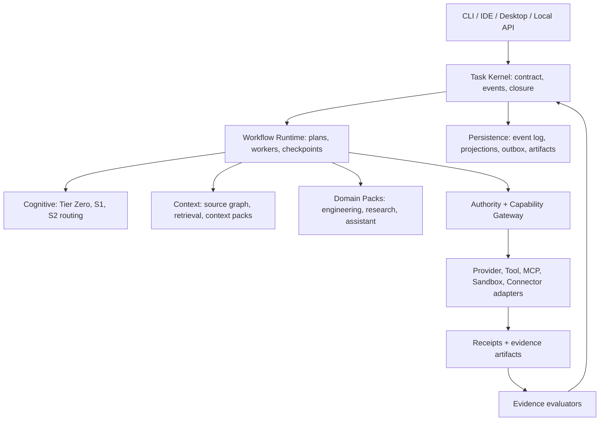
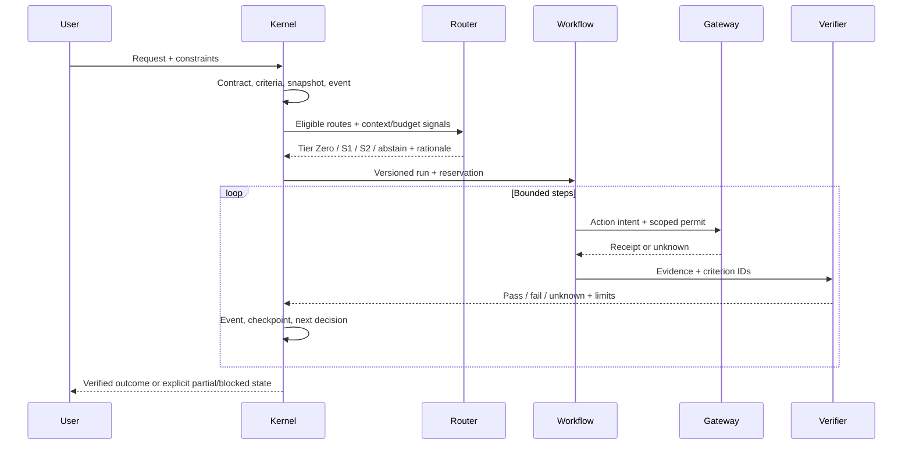

# Custos Unified Coding, Research, and Assistant Agent: Implementation Superplan

> **Historical proposal:** The [documentation hub](../README.md), [target architecture](../architecture/target-architecture.md) and [implementation blueprint](../development/implementation-blueprint.md) define current navigation and build gates. This superplan remains research/design input.

**Status:** Working proposal for human review; not a canonical specification or implementation claim.  
**Date:** 2026-09-27.  
**Scope:** Current merged `Custos/` workspace. No new crate, shared schema, protocol, or ownership change is authorized by this document.  
**Baseline:** [Canonical specification V8](../canonical-specification.md), [repository agent protocol](../../AGENTS.md), current source inspection, and primary research listed below.

## 1. Executive decision

Build Custos as a **local-first, evidence-aware, budgeted agent runtime** for three job families: software engineering, research, and personal/workspace assistance. A single trusted task kernel owns goal, authorization, state, and completion. The cognitive layer chooses the cheapest *eligible* route likely to satisfy explicit acceptance criteria; the workflow layer runs bounded work; adapters perform I/O only through enforceable capabilities; verifiers report what was actually observed. The same task may move between domain packs without creating a second task identity or bypassing permissions.

“System One / System Two” are two **operating regimes**, not two magic models. System One is a bounded, fast judgment or short worker path. System Two is a deliberate plan/execute/revise path for genuinely complex or uncertain work. A deterministic preflight (“Tier Zero”) is always attempted where appropriate. Verification is a separate closure concern, not a claim that a compiler, citation locator, or LLM can prove arbitrary correctness. This expands the V8 baseline into a concrete implementation sequence; it does not supersede it.

**Primary product optimization:** maximize *verified useful outcomes per unit of money, elapsed time, risk, and user attention*, under hard privacy, permission, and budget constraints. Optimize measured task outcomes, not token minimization in isolation. No fixed savings multiplier, universal latency target, or 100% accuracy claim is accepted without a reproducible evaluation.

## 2. Source-grounded design principles

1. Prefer a deterministic operation or simple workflow when acceptance conditions are known; use an open-ended agent loop only when the path cannot be predetermined. This follows [Anthropic's workflow/agent distinction](https://www.anthropic.com/engineering/building-effective-agents).
2. Treat model routing as a calibrated, task-conditional cost/quality decision, inspired by [RouteLLM](https://arxiv.org/abs/2406.18665) and [FrugalGPT](https://arxiv.org/abs/2305.05176), not a hard-coded “small model first” rule for every task.
3. Compile the smallest useful context per step, with stable source references and just-in-time retrieval; compact histories without losing decisions, constraints, and unresolved work. See [effective context engineering](https://www.anthropic.com/engineering/effective-context-engineering-for-ai-agents).
4. Default to one worker. Permit bounded parallel research branches only for independent, high-value information gathering. [Anthropic's multi-agent research report](https://www.anthropic.com/engineering/multi-agent-research-system) documents both breadth benefits and substantial token overhead; those numbers are not a Custos forecast.
5. Evaluate whole trajectories and external effects, not only final prose, following [Anthropic's agent evaluation guidance](https://www.anthropic.com/engineering/demystifying-evals-for-ai-agents). Include failures, recovery, cost, and evidence coverage.
6. Treat MCP as an interoperability boundary, never an authority source. Tool metadata is a hint; [MCP's own analysis of tool annotations](https://blog.modelcontextprotocol.io/posts/2026-03-16-tool-annotations/) explicitly says annotations do not defend against prompt injection.

## 3. Current checkout: observed capabilities versus gaps

| Area | Observed in current source | Gap or risk to close |
|---|---|---|
| Task kernel | `crates/core/custos-kernel/src/service.rs` persists task events and validates transitions. | `completion.rs` checks only `Running`; explicit criterion/evidence closure is not enforced in that path. |
| Cognitive routing | `crates/runtime/custos-cognitive/src/routing.rs` has Tier Zero, S1, S2, abstain, and token estimates. | Fixed thresholds and caller-supplied success probabilities lack measured calibration, uncertainty bounds, privacy eligibility, latency, and end-to-end budget reservation. |
| Deliberation | `deliberation.rs` defines roles and steps. | It is not yet an executable bounded plan with revision, checkpoints, and verifier-driven recovery. |
| Durable workflow | `crates/runtime/custos-workflow/src/machine.rs` persists continuation checkpoints and effect keys. | `outbox.rs` is a message struct; `lease.rs` is a data struct. No demonstrated transactional effect protocol or crash-window reconciliation. |
| Authorization | `crates/runtime/custos-security/src/authority/` issues permits; the gateway checks policy. | The inspected `gateway/deterministic.rs` returns a synthetic `"executed"` receipt, not a real tool effect. Persistent approvals and exact-payload binding require verification. |
| Evidence | `crates/runtime/custos-security/src/evidence/` has verifier primitives. | Requirement matching uses claim text containment or verifier kind; a matching passing claim can be weaker than the actual acceptance criterion. Citation location is not semantic support. |
| Context | `crates/runtime/custos-context/` contains token-aware compilation, compaction, and repo-intelligence pieces. | Define one step-context contract, freshness/provenance checks, privacy labels, and empirical retrieval recall; avoid duplicate compilers. |
| Imported execution | `crates/runtime/custos-agent/`, providers, MCP, context-management, and local inference contain extensive imported functionality. | Trace actual active entrypoints and control levels before reusing. Do not claim imported tools are protected by Custos until interception is proven. |
| Domain packs | Engineering, research, and assistant packs publish feature descriptors and `initialize()`. | Descriptors are not vertical workflows; no real coding/research/assistant end-to-end proof was observed in these files. |
| Daemon | `crates/app/custos-daemon/src/runtime.rs` wires store, `TaskService`, and local API; API exposes create/get/cancel/advance. | It does not currently compose the cognitive router, workflow machine, gateway, pack executor, or evidence closure into a user-facing task run. |
| Governance/docs | `AGENTS.md` and V8 define boundaries and three-owner consensus. | Ownership paths are from an earlier layout; current `crates/core/*`, `runtime/*`, etc. require a human-approved mapping. Older `ARCHITECTURE.md` still refers to `Custos_new`; older S1/S2 document contains unmeasured savings and an impossible “100% accuracy” verifier label. |

This is a **source inspection**, not a successful build or behavioral certification. Historical Nexus reports under `docs/` include pre-merge `Custos_new` inventory and should be treated as provenance, not current-state measurements. The fresh Nexus index below gives a structural baseline, but module presence alone never proves integration.

**Fresh Nexus structural snapshot (2026-09-27):** Both repos were re-indexed after the merge. Nexus discovered and indexed 2,196 Custos files and 2,182 Goose files; its Cargo graph reports 41 Custos workspace crates and 16 Goose crates. Exact SHA-256 comparison found 1,437 Custos files matching Goose content (1,426 shared hashes). Its heuristic capability matrix finds steering/cancellation, developer tools, recipes/skills, and subagent execution only as imported Goose-shaped material, not as independently integrated Custos paths. The audit reports no dependency cycles among its parsed workspace packages, and flags 42 Custos files containing stub terms, 268 containing panic/incomplete markers, and 63 tiny Rust modules. These are **search leads**, not verified defects: markers may occur in tests/comments, “orphan” detection flags binary roots and dynamically loaded packs, and exact file reuse does not prove identical runtime behavior. The full temporary audit is `/private/tmp/custos_nexus_audit_20260927.md` with JSON beside it; the Nexus index itself was refreshed in `Nexus/nexus_index.db`. Indexing reports successful file counts but the indexer catches per-file exceptions without listing skipped paths, so it is not a proof of exhaustive semantic coverage. Phase 0 still needs active-entrypoint tracing and owners' review.

## 4. Product contract and user modes

| Mode | User promise | Default autonomy | Closure proof |
|---|---|---|---|
| Ask | Answer a bounded question using local/project context. | Read only. | Supported answer, or explicit uncertainty. |
| Plan | Produce reviewable implementation/research plan. | Read only. | Scope, dependencies, risks, testable acceptance criteria. |
| Code | Diagnose, edit, test, explain diff. | Scoped local writes after policy grant; no implicit git publish. | Diff + targeted tests + caveats tied to exact snapshot. |
| Research | Discover, compare, synthesize, cite. | Read/search only unless export is requested. | Claim-to-source evidence matrix with source date and limits. |
| Assistant | Triage, draft, schedule, send or update on request. | Draft by default; external write requires exact-action authority. | Draft artifact or external service receipt; unknown on ambiguous timeout. |
| Hybrid | Chain research, code, and assistant work within one task. | Each pack gets only its own scoped grants. | Aggregate criterion coverage, separate receipts for every effect. |

Five independent controls must remain user-visible: autonomy level, privacy/egress, provider preference or pin, budget/deadline, and evidence strictness. A provider pin never overrides security or capability eligibility; rejection must explain the conflict.

## 5. System architecture and dependency rule

The diagram shows **runtime collaboration**, not Rust import direction. Preserve the acyclic, port-driven dependency policy in `AGENTS.md`: domain types know no infrastructure; kernel owns canonical task mutations and authority decisions; workflow calls kernel ports; adapters implement ports and never import application policy. The daemon is the composition root. No domain pack calls a provider, shell, network, or database directly. Where current imports conflict with this target, produce a narrow dependency-change proposal for owner review rather than moving code speculatively.

### 5.1 Explicit ownership and OOP/trait boundaries

| Boundary | Single owner | Contract to expose; do not duplicate |
|---|---|---|
| `TaskContract`, `Criterion`, `ActionIntent`, `Receipt`, `EvidenceRef` | Core domain, human-approved shared contracts | Immutable validated values, stable IDs/revisions, no I/O. Reuse existing types where possible. |
| `TaskService`, `CompletionGate`, `AuthorityService` | Kernel/security owners | Command methods with expected version; only these mutate canonical Task state or issue permits. |
| `WorkflowMachine`, `WorkerLifecycle`, `Scheduler` | Workflow owner | `start/resume/step/pause/cancel`, bounded concurrency, checkpoint and reconciliation hooks. |
| `RoutingPolicy`, `JudgmentPort`, `PlanProposal` | Cognitive owner | Typed signals, uncertainty/abstain, eligibility-aware decision explanation; no authority side effects. |
| `ContextCompiler`, `SourceLocator`, `MemoryPort` | Context owner | Step-specific context manifest, source hashes, freshness, privacy labels, token estimates. |
| `ToolPort`, `ModelPort`, `AgentRuntimePort`, `ConnectorPort` | Adapter contracts | Capabilities and **control level** (`custos-mediated`, `provider-governed`, `observe-only`) disclosed and tested. |
| `Verifier`, `RequirementEvaluator` | Evidence owner | Typed `pass/fail/unknown/not-applicable`, exact criterion linkage, verifier version, evidence refs. |
| `TaskStore`, `ArtifactStore`, `OutboxStore` | Persistence owner | Atomic event/projection/outbox update, optimistic concurrency, content-addressed artifacts. |

This is a modular monolith first. Prefer trait objects at real I/O/test seams and concrete Rust types inside modules; avoid an abstract class/trait for each DTO. Domain packs are declarative recipes plus small specialized services, not separate agent platforms.

## 6. The universal task loop

1. **Intake and normalize:** Convert the request into a task goal, explicit exclusions, requested artifact/action, workspace and source scope, deadline/budget, privacy/egress rules, and desired autonomy. Preserve original request and interpretation; ask the human only for a choice that materially changes scope or effects.
2. **Create TaskContract and criteria:** Assign stable task/run IDs and a revision. Declare success predicates *before* invoking a model. Distinguish observable checks (test command, source span, external receipt) from human/semantic judgment. Record a workspace/source snapshot.
3. **Preflight:** Validate grants, provider eligibility, connector health, source freshness, remaining budget, local hardware, and whether a deterministic path can satisfy the request. Deny or pause before spending tokens when hard constraints fail.
4. **Route:** Tier Zero handles exact lookup/schema/rule decisions. S1 classifies or executes a bounded one-step task. S2 receives a bounded plan request only when S1 abstains, measured failure risk exceeds tolerance, acceptance is complex, or a verifier produces actionable feedback. High-risk effects trigger approval regardless of S1/S2 choice.
5. **Compile context:** Fetch only relevant repo symbols/files, sources, recent decisions, tool definitions, and constraints. Produce a context manifest with source hashes, sensitivity, age, token count, and omissions. Never silently drop a required acceptance criterion during compaction.
6. **Reserve resources:** Before dispatch, reserve model/tool tokens or money, wall-clock budget, concurrency slot, and action grants. Commit reservation to the task timeline; reconcile with actual usage after each call. Skip branch fan-out if aggregate worst-case reservation cannot fit.
7. **Execute one bounded step:** Worker produces typed observations, proposals, and action intents. Kernel checks expected task revision and policy; gateway executes an authorized, specific effect. Record all tool results as untrusted data with provenance.
8. **Verify and adapt:** Match evidence to criterion IDs and exact artifact/source revisions. On failure, supply the *specific* failure to the next step, bounded by retry/time budget. On unknown or unobserved effects, reconcile rather than repeating blindly. Escalate to human when evidence is insufficient or scope must expand.
9. **Checkpoint and close:** Persist state before/after effect boundaries; update task only through kernel commands. A task succeeds only when all required criteria have acceptable evidence and no unresolved risky effect exists. Otherwise return a clear partial/blocked result with next action.

### 6.1 Routing decision, not a hard-coded cost myth

Eligibility is applied first: privacy/egress, user pin, available capabilities, context window, model/tool health, scope, authority, and remaining hard budget. Among eligible paths, estimate for task class `j` and route `r`:

`score(j,r) = P(criterion-complete | signals,j,r) × value(j) - cost_money - λt×latency - λh×human_attention - λf×failure_or_recovery_cost`.

This is an internal ranking, not a universal scalar truth. Calibrate probabilities on held-out task traces by job family, risk, and evidence class; report calibration error and confidence intervals. When estimates are weak, use conservative routing or abstain. Route decisions record candidate set, exclusions, model/version, feature snapshot, cost reservation, rationale, and observed outcome. Model prices and capability metadata are versioned configuration and refreshed through adapters, never embedded as claims in docs.

**Tier Zero examples:** exact symbol lookup, deterministic file-tree scan, schema validation, hash comparison, diff check, cached source retrieval. **S1 examples:** classify an issue, summarize one bounded source, propose a small patch, draft an email. **S2 examples:** multi-module migration, disputed research synthesis, complex debugging with failing tests, or a hybrid sequence needing plan revision. S2 can still use a cheap model for substeps. A failed S1 can retry locally *once if justified* or escalate; never hide multiple retries as a “single cheap call.” A verifier success cannot overrule missing user criteria.

**Stop rules:** user cancellation; hard budget/deadline; policy denial; stale or conflicting source snapshot; repeated non-improving verifier failures; unavailable trusted execution route; unresolved external-effect state. The result must name which criteria remain unsatisfied.

### 6.2 Single worker versus parallel branches

Default one worker for coding, because shared mutable files and interdependent changes create merge/context overhead. Parallelize only independent read-only searches, distinct source families, or separable test discovery. Enforce a per-task concurrency cap, branch-specific budget reservation, fixed join deadline, cancellation of obsolete branches, and deduplicated evidence aggregation. Never let a branch approve its own effect. Use parallelism only if measured verified-utility gain exceeds aggregate token and coordination cost.

## 7. Four full user journeys

### 7.1 Engineering: bug fix, refactor, or feature

**Intake:** exact repo/worktree, user constraints, acceptance tests, forbidden files, no-publish policy. **Discovery:** Tier Zero checks status, package graph, symbols/callers, failing tests, recent relevant changes. Context compiler returns a minimal code slice with hashes. **Routing:** S1 for localized, low-ambiguity patch; S2 for cross-module behavior, unknown cause, or repeated failed check. **Execution:** create a patch proposal against observed file versions; gateway applies only within allowed paths; no staged/committed/pushed git operation without explicit authority. **Verification:** parse/diff hygiene, focused test, broader affected tests, lint/build as budget permits, then inspect whether the original failure is reproduced and fixed. **Closure:** report changed files, tests and exact result, unrun checks, residual risk. If user files changed concurrently, pause and rebase proposal on a fresh snapshot rather than overwriting.

### 7.2 Research: literature or technical decision memo

**Intake:** question, scope, recency needs, allowed sources, desired output and confidence. **Search:** begin with source catalog/date and keyword/symbol queries; expand only to fill evidence gaps. Parallelize independent source families when worth the cost. **Extraction:** build a claim table with source title, URL/DOI/path, span or page, publication/date, quote limit, and contradictory evidence. **Synthesis:** separate established facts, author claims, Custos inferences, and unknowns. **Verification:** link resolves and exact cited span exists; semantic support is assessed separately and may stay uncertain. **Closure:** answer with claim-level citations, methods/coverage, limitations, and follow-up questions. Search absence is not proof of nonexistence.

### 7.3 Assistant: triage, draft, and external action

**Intake:** account/workspace, private data scope, action request, recipient and attachments. **Read:** fetch minimum messages/calendar/docs with trust labels; do not let their contents grant new instructions. **Draft:** produce a reviewable proposed message or agenda. **Approve:** for send/create/update/delete, display exact recipient, payload hash, attachments, destination, and likely effect; acquire an action-specific permit. **Execute:** connector uses idempotency key if supported and records external request ID. **Reconcile:** if timeout/connection loss occurs after dispatch, query external state before retry; if impossible, mark `unknown` and ask human. **Closure:** only call it sent/created on external receipt, never on draft completion or optimistic local state.

### 7.4 Hybrid: research → prototype → note → assistant

One TaskContract contains criteria for source synthesis, code artifact, validation, and optional human-approved outgoing communication. Research pack emits evidence refs; engineering pack consumes only approved/relevant refs and writes a scoped prototype; assistant pack drafts a summary from verified outputs. Each handoff has typed input/output, source/patch snapshot, authority subset, budget remainder, and unresolved caveats. A failed research claim blocks the dependent code rationale, but independent coding checks can continue. External send remains a distinct approval boundary even if all prior criteria pass.

## 8. State, evidence, and recovery invariants

### 8.1 Canonical identities and event shape

Reuse current domain objects where possible. Any proposed additions to shared contracts require Vi, Truong, and Vinh alignment before code changes. The logical record needs `task_id`, `contract_revision`, `run_id`, `plan_revision`, `step_id`, `action_id`, `attempt_id`, `criterion_id`, `source_revision`, and `idempotency_key`; these are different identities. A chat/session is a UI continuity channel, **not** the task source of truth. Each timeline event records causation/correlation, expected task version, actor, timestamp, schema version, and immutable payload or artifact reference.

**State groups:** `draft/planned/ready`, `running/verifying`, `waiting_input/waiting_approval/paused/reconciliation_required`, `succeeded/failed/cancelled`. Map these to the currently governed `TaskStatus` rather than unilaterally renaming the shared enum. A workflow may have finer internal states while Task remains canonical. Invalid or old-version transitions fail closed and are surfaced as conflicts.

### 8.2 Exactly-once is not assumed

For local event/projection/outbox writes, one database transaction and optimistic version check are required. A side effect crosses that transaction boundary, so the practical guarantee is **at-least-once attempt with idempotency/reconciliation**, not magical exactly-once execution. Before dispatch persist action intent, payload digest, permit/grant reference, and idempotency key. After dispatch persist `succeeded`, `failed`, or `unknown` receipt. On restart, inspect in-flight actions: query provider/connector by idempotency key or external ID where supported; otherwise hold for human reconciliation. Never blindly retry email, payment, deployment, deletion, or other non-idempotent effects.

The lease has task/run/worker identity, fencing generation, expiry, heartbeat, and cancellation state. A stale worker may finish a network call, but its stale fence cannot commit canonical state. No lock is held during model/network calls. Workflow checkpoints store plan revision, operation cursor, inputs/outputs refs, pending effect state, counters, and model/context versions. On resume, validate checkpoint schema and input hashes; do not replay steps whose effects are already reconciled.

### 8.3 Evidence is criterion-scoped

An evidence item binds to `criterion_id`, subject artifact/source revision, producer, verifier ID/version, checked property, observation timestamp, proof ref/hash, and limitations. A locator (URL exists, file lines exist) is not a support judgment; a support judgment is not scientific truth. Compiler success checks buildability only for that snapshot/configuration; tests cover named assertions only. Source citation checks must reject unrelated spans, stale versions, and path escapes. An LLM critique is useful diagnostic evidence but cannot independently satisfy an objective criterion it generated. The kernel closes only when every required criterion has an acceptable claim of the correct kind and freshness; unknown is not pass.

**Concrete tests:** forged claim text must not satisfy a requirement; valid verifier kind with wrong criterion ID must fail; a pass for an old file hash must not close a changed patch; `exit_code=0` without the expected command/snapshot must not pass; a citation to a real page that does not support the claim must be marked unsupported or unknown; no external receipt means no “sent” state.

## 9. Context, memory, and repo intelligence

Compile a `ContextPack` per decision/step from immutable refs: task contract, policy summary, current plan, relevant file/symbol spans, source passages, recent decisions, unresolved errors, and permitted tool descriptions. Rank by criterion relevance, dependency distance, freshness, source reliability, and token cost. Keep an explicit manifest of included and omitted references. The model sees snippets, not all repository files or all tool schemas; a worker can request more context by ref when needed. Cache content by hash and query version, not by unstable path alone.

Memory has four scopes: ephemeral step scratchpad, task journal/checkpoints, project knowledge with source provenance, and optional user preference memory with consent and retention controls. No raw secrets or private message bodies are promoted into general project memory. Summaries retain goal, hard constraints, accepted decisions, failed attempts, outstanding evidence, IDs, and paths/hashes. Record summary provenance and test it on long-horizon traces for lost constraints. Use the existing `custos-context` and imported `custos-context-management` features selectively; create an inventory and consolidation test before removing either path.

For coding, symbol-aware retrieval should join file content, import/dependency graph, tests, and error locations; Nexus may serve as an **offline/sidecar intelligence source**, but its index must be refreshed and versioned against the current worktree. For research, source retrieval records publication time versus access time and supports exact spans/pages. For assistant, connectors return sensitivity labels and allowed-use scopes. Across all modes, prompt-injection text remains data, not an instruction or grant.

## 10. Security and adapter control

**Trust order:** human/system policy and TaskContract > trusted code/config > model proposals > repository/web/email/tool content. The lower layer may supply facts but never amend higher-layer authority. Canonicalize paths and destinations; validate typed parameters; classify effect and egress; restrict shell/network/process/file access with platform-specific sandboxing where actually available; redact credentials and private content from logs and model prompts. `AGENTS.md` governance and user scope are enforceable policy inputs, not prose to be reinterpreted by model output.

Every adapter must declare capabilities (read/write/network/shell), supported idempotency, cancellation semantics, control level, credential/egress scope, and what an execution receipt can prove. A provider-controlled coding agent that can invoke native tools outside Custos mediation is **not** described as fully gated. Options: disable its native effects, interpose a tested wrapper, or mark the session `provider-governed`/`observe-only` and require explicit disclosure/approval. MCP servers are untrusted tools behind the same gateway; metadata cannot self-authorize writes. Pin a supported protocol revision per connector and run compatibility/security tests before upgrade.

**Approval validity:** the approved canonical payload digest includes target, recipient, path, attachment refs, amount/resource scope, and effect class. Approval expires on payload, plan, workspace snapshot, or grant change. Read grants may be reusable within scope; send/delete/deploy actions require exact-action authority. Persist approval/audit events and distinguish requested, approved, denied, expired, used, and revoked. Fail closed when permit/receipt storage is unavailable.

## 11. Cost and latency engineering

Track costs on the **entire trajectory**: router judgment, context retrieval/indexing, model input/output/cache, local inference compute, tool calls, retries, parallel branches, verification, user interruptions, and recovery. Local inference is not automatically free or faster; include hardware occupancy, energy and latency. Each task has hard ceilings for money/tokens/time/steps/concurrency and optional soft targets. Reserve worst-case branch budget before fan-out, then refund unused capacity on reconciliation.

Optimization levers in order: deterministic short-circuit; high-signal context retrieval; eliminate redundant tool/result text; reuse content-addressed artifacts; S1/S2 route calibration; bounded retries; parallelism only on critical-path improvement; provider choice among eligible models. Prefer preflight failures to expensive doomed runs. Show user a live budget bar and a “continue with larger budget” choice when additional work is justified. Do not silently degrade evidence requirements to fit budget.

Suggested dashboards: verified completion rate by task class and difficulty; false-success/unsafe-action rate; criterion coverage; citation support error; patch regression rate; median/p95 wall time; model and tool cost per verified task; S1 acceptance/escalation/abstention; route calibration error; context retrieval recall; wasted tokens from duplicate context/retries; human approval count/time; crash recovery and unknown-effect rate. Compare cohorts on a fixed task set and hardware/provider version. Report confidence intervals; never promote a lab cost multiplier into a product promise.

## 12. Implementation program: thin vertical slices, not another rewrite

Every phase must leave a runnable demonstrator and a reversible feature flag. Do not move or delete imported modules simply because a cleaner tree is imaginable. Reconcile the current owner matrix with the merged paths, write an ADR for shared contracts, and obtain named owner approval before shared-schema changes. This proposal does not grant that approval.

| Phase | Concrete deliverables in existing areas | Exit gate |
|---|---|---|
| 0. Baseline and control map | Run a fresh Nexus index/audit of current Custos and original Goose; record commit/worktree hash, workspace package graph, active daemon/CLI/IDE entrypoints, copied-source provenance, duplicate functionality, test status, and provider effect control levels. Reconcile `AGENTS.md` path ownership with actual layout by human review. | Versioned source inventory and explicit “active / dormant / scaffold / unknown” classification; no unverifiable 100% coverage statement. |
| 1. One read-only task | Wire daemon/API → kernel → deterministic/S1 route → context compiler → provider/worker → criterion evidence → completion. Pick a bounded code explanation or research answer. | End-to-end test returns source-backed answer, correct event timeline, budget usage, and restart-preserved result; false claim cannot close. |
| 2. Durable effect kernel | Transactional event/projection/outbox, action intent ledger, optimistic version, lease fencing, cancellation, receipt/reconciliation protocol in existing kernel/workflow/persistence/security modules. | Fault injection at every effect boundary, including daemon kill; no duplicate non-idempotent external action; unknown effect remains unresolved, not “succeeded.” |
| 3. Safe coding slice | Repo snapshot, symbol-aware discovery, scoped patch, gateway-backed edit/shell, targeted tests, diff artifact, invalidation on concurrent edits. Adapt imported agent/tool machinery only through tested ports. | Local fixture issue is reproduced, fixed, tested, and reported; denied path or git publish attempt causes no effect. |
| 4. Evidence-led research slice | Search/fetch adapter, source artifact/version, claim table, citation locator, semantic support assessment, dated synthesis, uncertainty report. | Fixture synthesis cites exact supporting spans; false/contradictory/missing sources do not close criteria; source updates invalidate stale claims. |
| 5. Assistant write slice | Read/triage/draft, exact-action approval, connector receipt, timeout reconciliation, privacy/egress labels. | Draft never sends; changed recipient/attachment invalidates approval; ambiguous timeout creates unknown state without blind retry. |
| 6. Calibrated cognition | Capture route features/outcomes; offline S1/S2 calibration, budget reservation and cost accounting; bounded plan revision and verifier feedback. | Against held-out tasks, measure utility/cost/latency/safety versus fixed strong-model and simple single-agent baselines; no degradation of required safety/quality gates. |
| 7. Cross-pack and UX | Typed handoffs, task timeline, preview/approval UI, pause/resume/steer/cancel, privacy/provider/budget controls, clear control-level disclosures. | Hybrid fixture completes after daemon restart; permissions cannot leak across pack handoffs; UI distinguishes proposal, verified result, partial, and unknown. |
| 8. Consolidation | Remove or archive only proven duplicate code after call-graph reachability and behavioral parity, migrate docs/paths with owner consensus, trim dependencies, verify licenses of imported code. | Build/test/eval matrix green, rollback path demonstrated, no consumer of removed module, final ownership map and ADRs approved. |

### 12.1 Candidate PR sequence and handoff contracts

1. **PR A — audit-only:** source map, active-path traces, architecture dependency check, duplicate implementation table. No runtime behavior change.
2. **PR B — task evidence closure:** criterion-to-claim linkage and negative tests. Requires shared-contract consensus; if not approved, implement an internal adapter/side table without changing governed types, then re-review.
3. **PR C — read-only vertical slice:** composition root and API/run stream, typed route outcome, context manifest, model usage receipt, research or code-answer fixture.
4. **PR D — durable action protocol:** outbox transaction, action ledger, lease fencing, idempotency/reconciliation tests. Do not enable real effects until proven.
5. **PR E — coding gateway slice:** intercepted edit/shell, sandbox capability assertions, exact workspace snapshot, diff/test evidence.
6. **PR F — research slice:** source/claim pipeline, citation and semantic support separation, dated answer artifact.
7. **PR G — assistant slice:** draft→approval→connector send/update, external receipt and unknown state.
8. **PR H — cost router/evals:** measured S1/S2 policy, offline replay, canary flag, dashboards, rollback conditions.
9. **PR I — optional parallelism and consolidation:** only after single-worker baseline demonstrates a real bottleneck; remove duplicates only after parity.

Each PR includes an ADR if it changes ownership or a shared boundary; compile/unit/contract/integration/e2e/fault-injection tests appropriate to scope; a precise affected-file list; migration/rollback notes; and pre/post metrics. No PR should mix a large rename with new behavior. No auto-staging, committing, or pushing by agents.

### 12.2 Goose-derived material: keep, adapt, or retire

The merged workspace already contains Goose-derived `custos-agent`, provider, MCP, context-management, local-inference, and UI/tool code. Do not import a second copy. Characterize current behavior first:

| Capability | Custos decision | Required proof before exposing |
|---|---|---|
| Re-entrant agent operation loop, steering, retries, max turns | Adapt into the existing workflow machine; persist counters and effect boundaries. | Restart, cancellation, duplicate-step, and budget tests. |
| Provider streaming and wire formats | Keep behind `custos-provider-sdk`/adapter seams. | Usage accounting, malformed stream/tool call, timeout, and model pin tests. |
| MCP stdio/HTTP interoperability | Keep as adapter; gateway-wrap every tool action. | Host-side authorization, scope, injection, reconnect, and transport tests. |
| Developer edit/shell/tree tools | Adapt UX and parsing; execution through Custos authority/gateway only. | Real effect interception, sandbox/path escape, diff receipt tests. |
| Context compaction and session storage | Consolidate with `custos-context` and task journal; preserve decision memory. | Long-run recall, stale-reference, and session/task separation tests. |
| Recipes, skills, subagents | Convert to declarative pack input; workers are bounded and optional. | Schema validation, grant subset, branch budget and join tests. |
| Duplicated policy/task/evidence or unmediated native tools | Reject or isolate until governed. | No bypass of kernel, permit, evidence or privacy boundary. |

## 13. Verification and evaluation matrix

| Suite | Representative scenario | Required assertion |
|---|---|---|
| Domain/unit | Invalid probabilities, budget overflow, stale revisions, malformed action/source refs. | Typed rejection/abstain; no panic or silent success. |
| Contract | Every model, connector, MCP tool, and agent-runtime adapter. | Declared control level matches observable effect interception, cancellation and receipt semantics. |
| Coding E2E | Localized bug, multi-file refactor, failing test, concurrent user edit. | Relevant test actually runs on patch snapshot; no overwrite; report partial when broader suite unrun. |
| Research E2E | Correct source, misattributed citation, contradictory papers, stale page, no result. | Claim support and source freshness are explicit; contradiction remains visible. |
| Assistant E2E | Draft only, exact send, changed attachment, timeout after dispatch. | No send without current approval; external receipt or unknown, never fabricated success. |
| Recovery | Kill process before intent, after intent, after effect, before receipt, after receipt. | Replay reconstructs state; no unauthorized duplicate; fencing blocks stale writer. |
| Security | Prompt injection in README/web/email, symlink/path traversal, hostile MCP metadata, secret in logs. | Lower-trust text cannot change policy, grant, egress, or telemetry redaction. |
| Economics | Same fixed benchmark under deterministic, S1, S2, and adaptive policies. | Report verified completion, false-success, cost, p50/p95 latency, escalations, and confidence intervals. |

Use private internal tasks with consent and anonymization plus public repository-level coding fixtures such as [SWE-bench](https://arxiv.org/abs/2310.06770) where license and environment permit. Freeze benchmark/task snapshots; separate tuning and held-out sets; track provider/model version and prompt/context policy. Test contamination, flaky tests, and source drift. A benchmark score is not proof of general capability.

## 14. Release gates and rollback

**Hard gates:** zero known policy-bypass paths for enabled adapters; no high-risk effect without valid exact authorization; no “succeeded” on missing/unknown required evidence; replayable task timeline after crash; no silent budget overrun; private data egress follows user scope. A failure in these gates blocks release even if completion or cost improves.

**Measured gates:** set numerical targets only after Phase 0–1 baseline. Require predeclared non-inferiority margins for verified success and safety, plus a measurable improvement in cost/time/user attention for at least one job family. Report Pareto trade-offs rather than a single vanity score. Roll back routing policy independently from adapters; disable write capability independently from read-only operation; retain logs/artifacts required to explain a bad run. Migrations require backup/restore test before production enablement.

## 15. Research and repository references

- Historical design inputs: [canonical V8](../canonical-specification.md), [AGENTS.md](../../AGENTS.md). Existing older plans are historical input, not proof of current behavior; see the [documentation hub](../README.md) for the current authority hierarchy.
- External patterns: [Building effective agents](https://www.anthropic.com/engineering/building-effective-agents); [effective context engineering](https://www.anthropic.com/engineering/effective-context-engineering-for-ai-agents); [multi-agent research system](https://www.anthropic.com/engineering/multi-agent-research-system); [agent evaluation guidance](https://www.anthropic.com/engineering/demystifying-evals-for-ai-agents).
- Routing research: [RouteLLM](https://arxiv.org/abs/2406.18665); [FrugalGPT](https://arxiv.org/abs/2305.05176). Their measured results are research-specific, not Custos forecasts.
- Protocol/security: [MCP 2026-07-28 release overview](https://blog.modelcontextprotocol.io/posts/2026-07-28/); [tool annotation limits](https://blog.modelcontextprotocol.io/posts/2026-03-16-tool-annotations/).
- Coding evaluation: [SWE-bench paper](https://arxiv.org/abs/2310.06770).

**Immediate next decision for the human owners:** approve the current-layout ownership map and the first read-only vertical slice. After that, execute PR A, establish a reproducible baseline, and only then authorize shared-contract changes or enabling real tool effects.
