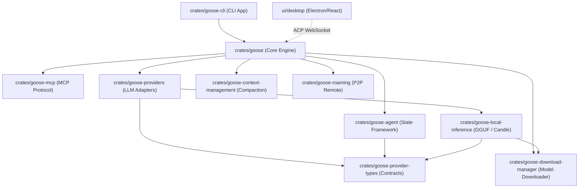
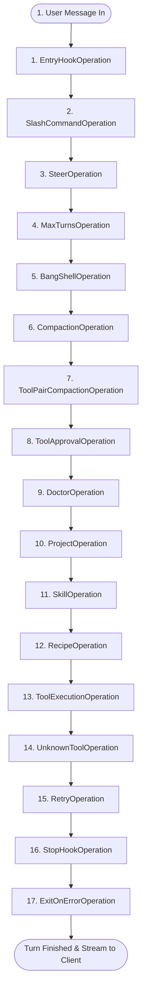
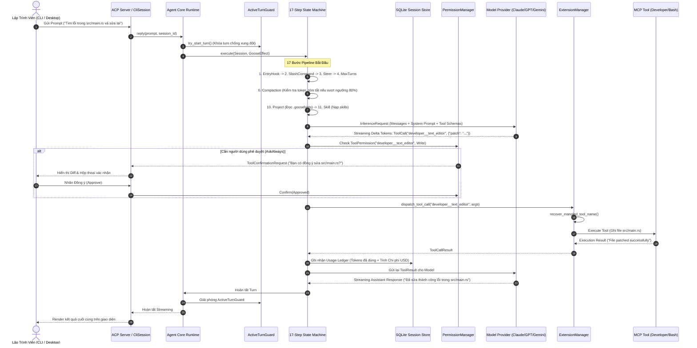

# GOOSE — ĐẶC TẢ TOÀN DIỆN KIẾN TRÚC & LUỒNG CODE NỘI BỘ (MASTER DEEP-DIVE ARCHITECTURE & CODE FLOW)

> **Tài liệu đặc tả kiến trúc cấp độ Master (Authoritative Master Reference Document)**  
> **Phiên bản:** Goose Core Architecture Baseline (Full Codebase Audit)  
> **Động cơ phân tích:** [Nexus Lens V2](file:///Users/mac/Project/AgentHub/Nexus) (Tree-sitter AST, Directed Call Graph, Module Graph & Full-Text Search Engine)  
> **Repository mục tiêu:** [`/Users/mac/Project/AgentHub/goose`](file:///Users/mac/Project/AgentHub/goose)  
> **Quy mô phân tích:** 16 Workspace Crates, 2,182 Files mã nguồn, 13,817 AST Symbols, 102,276 Call Graph Edges, 4,176,525 Lines of Code.

---

## MỤC LỤC CHI TIẾT

1. [TỔNG QUAN KIẾN TRÚC & HAI TRỤ CỘT GIAO THỨC (MCP & ACP)](#1-tổng-quan-kiến-trúc--hai-trụ-cột-giao-thức-mcp--acp)
2. [BẢN ĐỒ TOPOLOGY WORKSPACE & PHÂN TẦNG 16 CRATES](#2-bản-đồ-topology-workspace--phân-tầng-16-crates)
3. [ĐỘNG CƠ MÁY TRẠNG THÁI PIPELINE 17 BƯỚC (`Agent::reply_with_state_machine`)](#3-động-cơ-máy-trạng-thái-pipeline-17-bước)
4. [HỆ THỐNG SUB-AGENT & ĐIỀU PHỐI ĐA ĐẠI DIỆN (`summon.rs` & `orchestrator.rs`)](#4-hệ-thống-sub-agent--điều-phối-đa-đại-diện)
5. [BỘ NỀN TẢNG CÔNG CỤ TÍCH HỢP (PLATFORM EXTENSIONS: `developer`, `code_execution`, `chatrecall`)](#5-bộ-nền-tảng-công-cụ-tích-hợp)
6. [HỆ THỐNG QUẢN LÝ PHIÊN, SQLITE STORAGE & SỔ CÁI CHI PHÍ (`usage_ledger`)](#6-hệ-thống-quản-lý-phiên-sqlite-storage--sổ-cái-chi-phí)
7. [HỆ THỐNG TỰ CHẨN ĐOÁN & PHỤC HỒI MÔI TRƯỜNG (`doctor.rs`)](#7-hệ-thống-tự-chẩn-đoán--phục-hồi-môi-trường)
8. [HỆ THỐNG KỸ NĂNG ĐỘNG (SKILLS) VÀ QUY TRÌNH TỰ ĐỘNG HÓA (RECIPES)](#8-hệ-thống-kỹ-năng-động-skills-và-quy-trình-tự-động-hóa-recipes)
9. [HỆ SINH THÁI MCP ROUTING & QUẢN TRỊ BẢO MẬT BỘ NHỚ (`secret_manager.rs`)](#9-hệ-sinh-thái-mcp-routing--quản-trị-bảo-mật-bộ-nhớ)
10. [HỆ THỐNG PHÂN QUYỀN ĐA TẦNG & MALWARE CHECK (`PermissionManager`)](#10-hệ-thống-phân-quyền-đa-tầng--malware-check)
11. [TẦNG CUNG CẤP MÔ HÌNH: 30+ DECLARATIVE, GGUF CỤC BỘ & WEBRTC LIVE VOICE](#11-tầng-cung-cấp-mô-hình-30-declarative-gguf-cục-bộ--webrtc-live-voice)
12. [GIAO THỨC ACP & KIẾN TRÚC CLIENT (CLI REPL & ELECTRON/REACT DESKTOP)](#12-giao-thức-acp--kiến-trúc-client)
13. [TOÀN BỘ LUỒNG SEQUENCE DIAGRAM THỰC THI NỘI BỘ END-TO-END](#13-toàn-bộ-luồng-sequence-diagram-thực-thi-nội-bộ-end-to-end)
14. [TỔNG KẾT: ĐIỂM MẠNH KIẾN TRÚC & KHẢ NĂNG HỢP NHẤT VỚI CUSTOS](#14-tổng-kết-điểm-mạnh-kiến-trúc--khả-năng-hợp-nhất-với-custos)

---

## 1. TỔNG QUAN KIẾN TRÚC & HAI TRỤ CỘT GIAO THỨC (MCP & ACP)

Goose là một **Autonomous AI Agent Framework** viết bằng Rust, tối ưu hóa cho môi trường phát triển cục bộ của kỹ sư phần mềm. Kiến trúc của Goose không xây dựng theo hướng nguyên khối khép kín (monolithic) mà vận hành dựa trên triết lý **Protocol-Driven Architecture (Kiến trúc Hướng Giao thức)** với 2 trục chuẩn hóa mở:

```
┌────────────────────────────────────────────────────────────────────────────────────────┐
│                              CLIENT PLANE (GIAO DIỆN)                                  │
│   CLI (goose-cli REPL)    │   Desktop (Electron + React)   │   Remote (P2P Roam Nostr) │
└──────────────────────────────────────────┬─────────────────────────────────────────────┘
                                           │
                                           │  Trục 1: Agent Client Protocol (ACP)
                                           │  (JSON-RPC qua WebSocket / Stdio / SSE)
                                           ▼
┌────────────────────────────────────────────────────────────────────────────────────────┐
│                              AGENT CORE ENGINE (crates/goose)                          │
│  ┌───────────────────────┐  ┌────────────────────────┐  ┌───────────────────────────┐  │
│  │   Agent & Session     │  │   17-Step State Machine │  │   Sub-Agent Summoning     │  │
│  │   (SessionManager)    │  │   (Pipeline Operations) │  │   (summon.rs & orchestrate)│  │
│  └───────────┬───────────┘  └───────────┬────────────┘  └─────────────┬─────────────┘  │
│              │                          │                             │                │
│  ┌───────────▼───────────┐  ┌───────────▼────────────┐  ┌─────────────▼─────────────┐  │
│  │   PermissionManager   │  │   Context Management   │  │   Platform Extensions     │  │
│  │   (Security Policies) │  │   (Auto-Compaction)    │  │   (Developer, ChatRecall) │  │
│  └───────────┬───────────┘  └────────────────────────┘  └─────────────┬─────────────┘  │
│              │                                                        │                │
│              +──────────────────────────┬─────────────────────────────+                │
│                                         │                                              │
│                                         ▼                                              │
│                             ExtensionManager (Router)                                  │
└──────────────────────────────────────────┬─────────────────────────────────────────────┘
                                           │
                                           │  Trục 2: Model Context Protocol (MCP)
                                           │  (JSON-RPC qua Stdio / HTTP-SSE / In-Memory)
                                           ▼
┌────────────────────────────────────────────────────────────────────────────────────────┐
│                             EXTERNAL CAPABILITIES & SERVERS                            │
│  GitHub MCP  │  PostgreSQL MCP  │  Google Drive MCP  │  Custom Tool Servers            │
└────────────────────────────────────────────────────────────────────────────────────────┘
```

1. **Trục Ngang Dưới - Model Context Protocol (MCP):**
   - Đảm nhiệm toàn bộ việc kết nối công cụ ngoại vi (Tools), tài nguyên dữ liệu (Resources), và mẫu chỉ dẫn (Prompts).
   - Cho phép Goose mở rộng năng lực không giới hạn mà không cần phải viết lại code Agent.
2. **Trục Dọc Trên - Agent Client Protocol (ACP):**
   - Đảm nhiệm việc kết nối giữa bộ não Agent Core với bất kỳ giao diện người dùng nào (Terminal CLI, GUI Desktop Electron, VS Code extension, Web browser, hoặc thiết bị di động kết nối P2P qua Nostr).

---

## 2. BẢN ĐỒ TOPOLOGY WORKSPACE & PHÂN TẦNG 16 CRATES

Codebase của Goose được tổ chức thành 16 crates độc lập trong workspace của Cargo:



### Danh mục 16 Crates theo Bóc Tách AST của Nexus Lens V2:

| Tên Crate | Đường dẫn Thư mục | LOC | Phụ thuộc Nội bộ | Trách nhiệm Kiến trúc Cốt lõi |
|---|---|---|---|---|
| **`goose`** | [`crates/goose`](file:///Users/mac/Project/AgentHub/goose/crates/goose) | 88,420 | `goose-acp-macros`, `goose-agent`, `goose-context-management`, `goose-download-manager`, `goose-mcp`, `goose-providers`, `goose-sdk-types` | Trái tim runtime: điều phối luồng làm việc, quản lý phiên SQLite, bộ định tuyến MCP, State Machine, ACP Server, Sub-agent summoning. |
| **`goose-cli`** | [`crates/goose-cli`](file:///Users/mac/Project/AgentHub/goose/crates/goose-cli) | 12,850 | `goose`, `goose-mcp`, `goose-providers`, `goose-roaming` | Ứng dụng dòng lệnh Terminal REPL cao cấp, định dạng màu cú pháp, quản lý cấu hình người dùng, proxy phiên làm việc từ xa. |
| **`goose-agent`** | [`crates/goose-agent`](file:///Users/mac/Project/AgentHub/goose/crates/goose-agent) | 2,140 | `goose-provider-types` | Khung sườn StateMachine trừu tượng, trait `Operation`, `InferenceRunner`, định nghĩa pipeline xử lý turn. |
| **`goose-providers`** | [`crates/goose-providers`](file:///Users/mac/Project/AgentHub/goose/crates/goose-providers) | 28,600 | `goose-local-inference`, `goose-provider-types` | Adapter kết nối hơn 30+ LLMs: Claude, GPT, Gemini, Databricks, Ollama, cùng engine WebRTC Live Voice âm thanh 2 chiều. |
| **`goose-context-management`**| [`crates/goose-context-management`](file:///Users/mac/Project/AgentHub/goose/crates/goose-context-management) | 3,420 | `goose-provider-types` | Động cơ nén ngữ cảnh tự động (Hierarchical Compaction), đếm token và tóm tắt hội thoại phân tầng. |
| **`goose-mcp`** | [`crates/goose-mcp`](file:///Users/mac/Project/AgentHub/goose/crates/goose-mcp) | 6,890 | *(Không)* | Triển khai giao thức Model Context Protocol: Stdio client, SSE transport, Streamable HTTP transport, JSON-RPC serializer. |
| **`goose-local-inference`** | [`crates/goose-local-inference`](file:///Users/mac/Project/AgentHub/goose/crates/goose-local-inference) | 4,210 | `goose-download-manager`, `goose-provider-types`, `goose-sdk-types` | Bộ suy luận mô hình cục bộ nhúng (On-device LLMs qua GGUF, Candle, llama.cpp), chạy offline không cần Internet. |
| **`goose-download-manager`** | [`crates/goose-download-manager`](file:///Users/mac/Project/AgentHub/goose/crates/goose-download-manager) | 1,840 | *(Không)* | Quản lý tải xuống các tệp trọng số mô hình lớn từ HuggingFace, kiểm tra mã băm toàn vẹn SHA-256, resuming download. |
| **`goose-roaming`** | [`crates/goose-roaming`](file:///Users/mac/Project/AgentHub/goose/crates/goose-roaming) | 3,120 | *(Không)* | Giao thức truyền tin phân tán P2P dựa trên mạng Nostr, hỗ trợ điều khiển Goose từ xa an toàn qua E2E encryption. |
| **`goose-provider-types`** | [`crates/goose-provider-types`](file:///Users/mac/Project/AgentHub/goose/crates/goose-provider-types) | 5,610 | *(Không)* | Kiểu dữ liệu chuẩn hóa hệ thống: `Provider`, `ModelConfig`, `Message`, `ContentBlock`, `ToolDefinition`, `TokenUsage`. |
| **`goose-sdk`** | [`crates/goose-sdk`](file:///Users/mac/Project/AgentHub/goose/crates/goose-sdk) | 4,920 | `goose-context-management`, `goose-providers`, `goose-sdk-types` | Thư viện SDK cho các ứng dụng Rust bên thứ ba nhúng Goose trực tiếp vào phần mềm của họ. |
| **`goose-sdk-types`** | [`crates/goose-sdk-types`](file:///Users/mac/Project/AgentHub/goose/crates/goose-sdk-types) | 2,750 | *(Không)* | Kiểu dữ liệu trao đổi qua RPC, Event payloads và Custom method envelopes. |
| **`goose-acp-macros`** | [`crates/goose-acp-macros`](file:///Users/mac/Project/AgentHub/goose/crates/goose-acp-macros) | 890 | *(Không)* | Procedural macros (`#[custom_method]`) sinh tự động boilerplate dispatching cho các hàm ACP RPC. |
| **`goose-test`** | [`crates/goose-test`](file:///Users/mac/Project/AgentHub/goose/crates/goose-test) | 3,200 | *(Không)* | Framework kiểm thử tích hợp chuyên biệt cho Agent. |
| **`goose-test-support`** | [`crates/goose-test-support`](file:///Users/mac/Project/AgentHub/goose/crates/goose-test-support) | 2,410 | *(Không)* | Bộ giả lập (Mock Provider, Dummy MCP Servers, Virtual Filesystem) phục vụ kiểm thử đơn vị. |
| **`v8`** | [`vendor/v8`](file:///Users/mac/Project/AgentHub/goose/vendor/v8) | 420 | `goose` | Nhúng engine Google V8 chạy JavaScript/TypeScript sandbox cho các plugin phân tích mã tĩnh. |

---

## 3. ĐỘNG CƠ MÁY TRẠNG THÁI PIPELINE 17 BƯỚC

Mỗi khi người dùng gửi một tin nhắn hoặc một tác vụ tới Goose, phương thức trung tâm:
[`Agent::reply_with_state_machine`](file:///Users/mac/Project/AgentHub/goose/crates/goose/src/agents/agent.rs#L1770) sẽ được kích hoạt.

Goose không để cho LLM chạy tự do trong vòng lặp vô tận `while(true)`. Thay vào đó, toàn bộ quá trình xử lý lượt hội thoại (Turn) được mô hình hóa thành một **Pipeline Máy trạng thái gồm 17 bước (`Operation`)** khép kín được định nghĩa tại [`crates/goose/src/agents/agent.rs:1685-1760`](file:///Users/mac/Project/AgentHub/goose/crates/goose/src/agents/agent.rs#L1685):



### Phân Tích Chuyên Sâu 17 Bước Pipeline:

1. **`EntryHookOperation` ([`ops_entry_hook.rs`](file:///Users/mac/Project/AgentHub/goose/crates/goose/src/agents/state_machine/ops_entry_hook.rs)):** Kích hoạt các hook tiền xử lý của plugin đã đăng ký trước khi bắt đầu turn.
2. **`SlashCommandOperation` ([`ops_slash_command.rs`](file:///Users/mac/Project/AgentHub/goose/crates/goose/src/agents/state_machine/ops_slash_command.rs)):** Đón chặn ngay các lệnh có tiền tố `/` như `/config`, `/mode`, `/help`, `/save`, `/resume`, `/doctor`. Nếu phát hiện, xử lý cục bộ và ngắt turn mà không tiêu tốn token gọi LLM.
3. **`SteerOperation` ([`ops_steer.rs`](file:///Users/mac/Project/AgentHub/goose/crates/goose/src/agents/state_machine/ops_steer.rs)):** Cho phép người dùng "bẻ lái" tác vụ khẩn cấp khi agent đang suy luận dở mà không cần đợi xong vòng lặp.
4. **`MaxTurnsOperation` ([`ops_maxturns.rs`](file:///Users/mac/Project/AgentHub/goose/crates/goose/src/agents/state_machine/ops_maxturns.rs)):** Kiểm tra trần số lần lặp tối đa (`GOOSE_MAX_TURNS`). Ngăn chặn triệt để tình trạng Agent rơi vào vòng lặp vô hạn gây tiêu tốn chi phí.
5. **`BangShellOperation` ([`ops_bang_shell.rs`](file:///Users/mac/Project/AgentHub/goose/crates/goose/src/agents/state_machine/ops_bang_shell.rs)):** Nếu người dùng gõ lệnh bắt đầu bằng `!` (ví dụ: `!cargo test`), Goose chuyển thẳng lệnh sang tiến trình con shell của máy host để thực thi ngay lập tức.
6. **`CompactionOperation` ([`ops_compaction.rs:81`](file:///Users/mac/Project/AgentHub/goose/crates/goose/src/agents/state_machine/ops_compaction.rs#L81)):** **Trọng tâm nén ngữ cảnh tự động!** Kiểm tra nếu tổng số token vượt qua `GOOSE_AUTO_COMPACT_THRESHOLD` (mặc định 80% context window của model): Agent trích xuất lịch sử cũ, gọi LLM tóm tắt phân tầng qua template `compaction.md`, nén lịch sử thành một khối cô đọng và giải phóng bộ nhớ token.
7. **`ToolPairCompactionOperation` ([`ops_tool_pair_compaction.rs`](file:///Users/mac/Project/AgentHub/goose/crates/goose/src/agents/state_machine/ops_tool_pair_compaction.rs)):** Rút gọn các cặp lời gọi tool và phản hồi có kích thước khổng lồ (như đọc toàn bộ file 10,000 dòng) trước khi nhồi vào prompt suy luận tiếp theo.
8. **`ToolApprovalOperation` ([`ops_tool_approval.rs`](file:///Users/mac/Project/AgentHub/goose/crates/goose/src/agents/state_machine/ops_tool_approval.rs)):** Đối chiếu với `PermissionManager`. Nếu tool sắp chạy được đánh giá là nguy hiểm (`Write`, `Execute`), hệ thống tạm dừng luồng streaming, phát sinh `AgentEvent::ToolConfirmationRequest` hỏi người dùng qua giao diện TUI hoặc GUI.
9. **`DoctorOperation` ([`ops_doctor.rs`](file:///Users/mac/Project/AgentHub/goose/crates/goose/src/agents/state_machine/ops_doctor.rs)):** Chẩn đoán và tự động đề xuất phương án khắc phục khi phát hiện công cụ hoặc kết nối môi trường bị hỏng.
10. **`ProjectOperation` ([`ops_project.rs`](file:///Users/mac/Project/AgentHub/goose/crates/goose/src/agents/state_machine/ops_project.rs)):** Quét thư mục làm việc hiện tại, tự động đọc và nạp các tệp hướng dẫn dự án (`.goosehints`, `.gooserules`, `AGENTS.md`) vào System Prompt.
11. **`SkillOperation` ([`ops_skills.rs`](file:///Users/mac/Project/AgentHub/goose/crates/goose/src/agents/state_machine/ops_skills.rs)):** Quét và tiêm các Kỹ năng (`Skills`) phù hợp với ngữ cảnh vào lời nhắc của LLM.
12. **`RecipeOperation` ([`ops_recipe.rs`](file:///Users/mac/Project/AgentHub/goose/crates/goose/src/agents/state_machine/ops_recipe.rs)):** Nạp và điều phối các kịch bản tự động hóa nhiều bước (`Automation Recipes`).
13. **`ToolExecutionOperation` ([`ops_toolcalling.rs`](file:///Users/mac/Project/AgentHub/goose/crates/goose/src/agents/state_machine/ops_toolcalling.rs)):** Nhận danh sách các `tool_calls` từ LLM, chuyển giao sang `ExtensionManager` để gọi tiến trình MCP ngoại vi hoặc Builtin tool tương ứng.
14. **`UnknownToolOperation` ([`ops_unknown_tool.rs`](file:///Users/mac/Project/AgentHub/goose/crates/goose/src/agents/state_machine/ops_unknown_tool.rs)):** Nếu LLM bịa ra một tên công cụ không tồn tại trong hệ thống, Operation này bắt lại và tự động gửi phản hồi phản biện ("Tool 'foo' không tồn tại, bạn chỉ có thể dùng các tool sau: ...") để LLM tự sửa sai.
15. **`RetryOperation` ([`ops_retry.rs`](file:///Users/mac/Project/AgentHub/goose/crates/goose/src/agents/state_machine/ops_retry.rs)):** Tự động thử lại với thuật toán Exponential Backoff khi nhà cung cấp LLM trả về lỗi mạng 5xx hoặc Rate Limit 429.
16. **`StopHookOperation` ([`ops_stop_hook.rs`](file:///Users/mac/Project/AgentHub/goose/crates/goose/src/agents/state_machine/ops_stop_hook.rs)):** Kiểm tra điều kiện hoàn thành tác vụ trước khi ngắt chu kỳ Turn.
17. **`ExitOnErrorOperation` ([`ops_exit_on_error.rs`](file:///Users/mac/Project/AgentHub/goose/crates/goose/src/agents/state_machine/ops_exit_on_error.rs)):** Xử lý dọn dẹp tài nguyên, giải phóng khóa `ActiveTurnGuard` và trả về kết quả an toàn kể cả khi xảy ra panic hay lỗi nghiêm trọng.

---

## 4. HỆ THỐNG SUB-AGENT & ĐIỀU PHỐI ĐA ĐẠI DIỆN (`summon.rs` & `orchestrator.rs`)

Một trong những thành phần đồ sộ và tinh vi nhất của Goose là cơ chế ủy thác đa đại diện (Multi-agent delegation) nằm tại [`crates/goose/src/agents/platform_extensions/`](file:///Users/mac/Project/AgentHub/goose/crates/goose/src/agents/platform_extensions):

### 4.1. Động Cơ Triệu Hồi Đại Diện Con (`summon.rs` - 161 KB Mã Nguồn)
File: [`crates/goose/src/agents/platform_extensions/summon.rs`](file:///Users/mac/Project/AgentHub/goose/crates/goose/src/agents/platform_extensions/summon.rs)
- Cung cấp công cụ `summon`: Cho phép Agent chính sinh ra một hoặc nhiều **Sub-Agents chuyên biệt** để giải quyết các bài toán con phức tạp.
- **Cơ chế Khởi tạo:** Mỗi sub-agent nhận một tập hợp các thuộc tính riêng biệt:
  - `role`: Vai trò chuyên sâu (ví dụ: `code-reviewer`, `test-engineer`, `researcher`).
  - `instructions`: Chỉ dẫn System Prompt được may đo cho tác vụ đó.
  - `allowed_tools`: Danh sách công cụ bị giới hạn (Least Privilege Principle) để tránh việc agent con thao tác vượt quyền.
- **Hộp thoại Chuyển tiếp (Sub-session Isolation):** Sub-agent chạy trong một phiên làm việc độc lập với bộ nhớ đệm và cửa sổ token riêng biệt, sau đó tổng hợp kết quả gửi về cho Agent cha.

### 4.2. Khung Điều Phối Đa Nhiệm (`orchestrator.rs` - 38 KB Mã Nguồn)
File: [`crates/goose/src/agents/platform_extensions/orchestrator.rs`](file:///Users/mac/Project/AgentHub/goose/crates/goose/src/agents/platform_extensions/orchestrator.rs)
- Đóng vai trò nhạc trưởng điều phối tiến trình chạy song song hoặc tuần tự của các Sub-Agents.
- Quản lý trạng thái phân rã công việc:
  - Chia nhỏ mục tiêu của người dùng thành đồ thị các công việc con (Subtasks).
  - Thu thập kết quả từ các nhánh thực thi khác nhau.
  - Hợp nhất và giải quyết xung đột khi nhiều sub-agent cùng đề xuất sửa đổi mã nguồn.

---

## 5. BỘ NỀN TẢNG CÔNG CỤ TÍCH HỢP (PLATFORM EXTENSIONS)

Goose tích hợp sẵn một bộ công cụ nền tảng cực kỳ mạnh mẽ chạy in-process trong [`crates/goose/src/agents/platform_extensions/`](file:///Users/mac/Project/AgentHub/goose/crates/goose/src/agents/platform_extensions):

### 5.1. Công Cụ Lập Trình Viên (`developer` Extension)
Thư mục: [`crates/goose/src/agents/platform_extensions/developer/`](file:///Users/mac/Project/AgentHub/goose/crates/goose/src/agents/platform_extensions/developer)
Đây là công cụ chủ lực biến Goose thành lập trình viên tự động:
1. `text_editor`: Đọc file, ghi file, chèn nội dung, và đặc biệt là **patch unified diff** với thuật toán tìm kiếm mờ (fuzzy matching) để sửa mã nguồn mà không làm hỏng cấu trúc file.
2. `shell` (`bash` / `cmd`): Chạy lệnh hệ thống với cơ chế timeout, streaming stdout/stderr thời gian thực, và hỗ trợ hủy tiến trình khi có tín hiệu cancel.
3. `file_search` / `ripgrep`: Tìm kiếm file theo mẫu glob và tìm kiếm chuỗi nội dung văn bản siêu tốc.
4. `directory_list`: Quét cây thư mục với cơ chế lọc thông minh tự động bỏ qua `node_modules`, `target`, `.git`.

### 5.2. Thực Thi Mã Lập Tức Cách Ly (`code_execution.rs` - 40 KB)
File: [`crates/goose/src/agents/platform_extensions/code_execution.rs`](file:///Users/mac/Project/AgentHub/goose/crates/goose/src/agents/platform_extensions/code_execution.rs)
- Cho phép Agent viết và chạy mã Python / Bash / Node.js trực tiếp trong môi trường sandbox để tự động kiểm tra logic tính toán, giải phương trình hoặc phân tích dữ liệu trước khi đưa ra câu trả lời cho người dùng.

### 5.3. Trí Nhớ Hồi Tưởng Ngữ Nghĩa (`chatrecall.rs` - 18 KB)
File: [`crates/goose/src/agents/platform_extensions/chatrecall.rs`](file:///Users/mac/Project/AgentHub/goose/crates/goose/src/agents/platform_extensions/chatrecall.rs)
- Đóng vai trò **Bộ nhớ dài hạn (Long-term Episodic Memory)** của Goose.
- Quét qua toàn bộ lịch sử các phiên làm việc trong quá khứ được lưu trong SQLite.
- Cho phép Agent truy vấn: *"Lần trước chúng ta đã cấu hình database này như thế nào?"* mà không cần người dùng phải giải thích lại từ đầu.

### 5.4. Các Tiện Ích Bổ Trợ Khác:
- `apps.rs` (37 KB): Quản lý việc hiển thị các Widget UI tương tác từ MCP Apps.
- `todo.rs` (6.8 KB): Sổ tay ghi chép việc cần làm (Todo list) giúp Agent tự theo dõi tiến độ các đầu việc phức tạp.
- `analyze/`: Bộ phân tích mã tĩnh hỗ trợ phát hiện lỗi cú pháp và kiến trúc kho mã.

---

## 6. HỆ THỐNG QUẢN LÝ PHIÊN, SQLITE STORAGE & SỔ CÁI CHI PHÍ (`usage_ledger`)

Trái tim lưu trữ của Goose nằm tại [`crates/goose/src/session/session_manager.rs`](file:///Users/mac/Project/AgentHub/goose/crates/goose/src/session/session_manager.rs) (tệp mã nguồn khổng lồ với hơn 5,026 dòng code).

### 6.1. Lược Đồ Cơ Sở Dữ Liệu SQLite Của Goose
Cơ sở dữ liệu SQLite của Goose được lưu cục bộ tại `~/.local/share/goose/sessions/` (hoặc `~/Library/Application Support/Goose/sessions/` trên macOS) với 3 bảng chính:

```sql
-- 1. Bảng quản lý phiên
CREATE TABLE IF NOT EXISTS sessions (
    id TEXT PRIMARY KEY,
    name TEXT NOT NULL DEFAULT '',
    description TEXT NOT NULL DEFAULT '',
    user_set_name BOOLEAN DEFAULT FALSE,
    session_type TEXT NOT NULL DEFAULT 'user',
    working_dir TEXT NOT NULL,
    created_at TIMESTAMP DEFAULT CURRENT_TIMESTAMP,
    updated_at TIMESTAMP DEFAULT CURRENT_TIMESTAMP,
    extension_data TEXT DEFAULT '{}',
    total_tokens INTEGER,
    input_tokens INTEGER,
    output_tokens INTEGER,
    accumulated_cost REAL,
    schedule_id TEXT,
    recipe_json TEXT,
    goose_mode TEXT NOT NULL DEFAULT 'auto',
    parent_session_id TEXT
);

-- 2. Bảng quản lý tin nhắn
CREATE TABLE IF NOT EXISTS messages (
    id INTEGER PRIMARY KEY AUTOINCREMENT,
    message_id TEXT,
    session_id TEXT NOT NULL REFERENCES sessions(id),
    role TEXT NOT NULL,
    content_json TEXT NOT NULL,
    created_timestamp INTEGER NOT NULL,
    tokens INTEGER,
    metadata_json TEXT
);

-- 3. Sổ cái tiêu thụ token và chi phí tài chính (Usage Ledger)
CREATE TABLE IF NOT EXISTS usage_ledger (
    id INTEGER PRIMARY KEY AUTOINCREMENT,
    session_id TEXT NOT NULL REFERENCES sessions(id) ON DELETE CASCADE,
    created_timestamp INTEGER NOT NULL,
    model TEXT,
    input_tokens INTEGER,
    output_tokens INTEGER,
    total_tokens INTEGER,
    cache_read_tokens INTEGER,
    cache_write_tokens INTEGER,
    cost REAL,
    cost_source TEXT,
    is_compaction INTEGER DEFAULT 0
);
```

### 6.2. Sổ Cái Chi Phí (`usage_ledger`) — Tính Tiền Thời Gian Thực
- Mỗi lượt gọi LLM đều được Goose ghi lại vào bảng `usage_ledger`.
- Phân biệt rõ:
  - `input_tokens` vs `output_tokens`.
  - `cache_read_tokens` vs `cache_write_tokens` (hỗ trợ tính toán chính xác chiết khấu Prompt Caching của Anthropic và OpenAI).
  - `cost`: Chi phí tiền tệ tính bằng USD được tự động tính toán dựa trên bảng giá định kỳ của từng model.
  - `is_compaction`: Đánh dấu rõ lượng token nào được tiêu tốn cho việc Agent tự nén ngữ cảnh (hỗ trợ phân tích ROI vận hành).

---

## 7. HỆ THỐNG TỰ CHẨN ĐOÁN & PHỤC HỒI MÔI TRƯỜNG (`doctor.rs`)

File: [`crates/goose/src/doctor.rs`](file:///Users/mac/Project/AgentHub/goose/crates/goose/src/doctor.rs) (321 dòng mã).

Lệnh `/doctor` là tính năng tự chữa lành (Self-healing & Diagnostics) của Goose:
1. **Kiểm Tra Năng Lực Nền Tảng:** Xác minh extension `developer` có đang hoạt động hay không.
2. **Xác Thực Kết Nối Nhà Cung Cấp (`ensure_working_provider`):** Gửi một ping request siêu nhỏ tới API của nhà cung cấp đã chọn (Anthropic, OpenAI, Databricks...) để xác thực API Key còn hạn, credit còn đủ và mạng không bị chặn tường lửa.
3. **Thu Thập Thông Tin Hệ Thống (`SystemInfo::collect()`):** Thu thập hệ điều hành, kiến trúc CPU (ARM64/x86_64), phiên bản Rust, đường dẫn file cấu hình `config.yaml`.
4. **Kiểm Tra Trạng Thái Sức Khỏe MCP:** Gửi lệnh ping tới toàn bộ các tiến trình MCP Server đang chạy ngầm, phát hiện các server bị treo hoặc trả về mã lỗi STDIO.
5. **Đọc 50 Dòng Log CLI Gần Nhất (`read_tail(&path, 50)`):** Đóng gói toàn bộ thông tin chẩn đoán thành một prompt gửi cho LLM để AI tự đóng vai "bác sĩ" phân tích nguyên nhân lỗi và hướng dẫn người dùng lệnh sửa chữa cụ thể.

---

## 8. HỆ THỐNG KỸ NĂNG ĐỘNG (SKILLS) VÀ QUY TRÌNH TỰ ĐỘNG HÓA (RECIPES)

### 8.1. Hệ Thống Kỹ Năng Động (`crates/goose/src/skills/`)
- Goose hỗ trợ mở rộng kỹ năng theo cấu trúc chuẩn: một thư mục kỹ năng chứa file `SKILL.md` với phần mở đầu bằng **YAML Frontmatter**.
- [`client.rs`](file:///Users/mac/Project/AgentHub/goose/crates/goose/src/skills/client.rs): Đọc, phân giải các tham số (`arguments.rs`) và nạp động tài liệu hướng dẫn vào ngữ cảnh.
- Hỗ trợ **Skill-Bound Tool Permissions**: Một kỹ năng có thể khai báo trước các công cụ bắt buộc hoặc các quyền hạn cần thiết để người dùng chỉ cần phê duyệt một lần duy nhất cho toàn bộ kỹ năng.

### 8.2. Kịch Bản Tự Động Hóa (`crates/goose/src/recipe/`)
- Thư mục: [`crates/goose/src/recipe/`](file:///Users/mac/Project/AgentHub/goose/crates/goose/src/recipe)
- [`template_recipe.rs`](file:///Users/mac/Project/AgentHub/goose/crates/goose/src/recipe/template_recipe.rs) & [`validate_recipe.rs`](file:///Users/mac/Project/AgentHub/goose/crates/goose/src/recipe/validate_recipe.rs):
- Cho phép người dùng định nghĩa các luồng công việc tự động hóa bằng file YAML (ví dụ: `release_risk_check.yaml`, `daily_triage.yaml`).
- Hỗ trợ **Deeplink Invocation (`recipe_deeplink.rs`)**: Cho phép kích hoạt chạy tự động một quy trình Goose từ một URL trên trình duyệt web dạng `goose://recipe/run?name=...`.

---

## 9. HỆ SINH THÁI MCP ROUTING & QUẢN TRỊ BẢO MẬT BỘ NHỚ

File: [`crates/goose/src/agents/extension_manager/mod.rs`](file:///Users/mac/Project/AgentHub/goose/crates/goose/src/agents/extension_manager/mod.rs)

`ExtensionManager` là trạm trung chuyển điều phối toàn bộ các lời gọi công cụ MCP:
1. **Khôi Phục Tên Công Cụ Bị Biến Đổi (`recover_mangled_tool_name`):** Các mô hình như Gemini hay Claude đôi khi tự ý đổi tên tool thành `functions:text_editor` hoặc `functions.text_editor`. Goose có bộ giải mã thông minh tự động loại bỏ các tiền tố này để đưa về đúng định danh chính tắc.
2. **In-Memory Secret Resolution:** Các API key, token bí mật của extension tuyệt đối không được ghi ra file cấu hình dưới dạng plain-text mà được phân giải trực tiếp trong bộ nhớ RAM khi khởi chạy tiến trình con.
3. **Quản Lý Phiên Xác Thực OAuth2 PKCE (`crates/goose/src/oauth/`):** Khi kết nối với các Remote MCP Server yêu cầu xác thực người dùng (như Google Drive, Notion, Slack), Goose mở trình duyệt cục bộ, đón nhận redirect callback qua HTTP server tạm thời trên localhost và hoàn tất quy trình bắt tay OAuth PKCE an toàn.

---

## 10. HỆ THỐNG PHÂN QUYỀN ĐA TẦNG & MALWARE CHECK (`PermissionManager`)

File: [`crates/goose/src/config/permission.rs`](file:///Users/mac/Project/AgentHub/goose/crates/goose/src/config/permission.rs)

Goose thiết lập 4 cấp độ phân quyền nghiêm ngặt:
- `AlwaysAllow`: Tự động cho phép chạy (dành cho thao tác đọc an toàn).
- `AskAlways`: Bắt buộc người dùng nhấn xác nhận (dành cho ghi file, chạy shell).
- `NeverAllow`: Chặn tuyệt đối, không một chỉ dẫn prompt nào có thể ghi đè.
- `SmartApprove`: Tự động nhận diện rủi ro dựa trên ngữ cảnh thao tác.

### Quét Mã Độc Tiến Trình (`extension_malware_check.rs`):
Trước khi khởi chạy bất kỳ MCP Server nào dưới dạng tiến trình con Stdio, Goose phân tích chuỗi lệnh khởi động để phát hiện các mẫu lệnh độc hại phổ biến:
- Lệnh pipe trực tiếp từ internet vào shell: `curl ... | bash` hoặc `wget ... | sh`.
- Lệnh mở reverse shell: `nc -e /bin/sh`, `/dev/tcp/...`.
- Lệnh can thiệp vào các tệp bảo mật hệ thống: `/etc/passwd`, `~/.ssh/id_rsa`.
Nếu phát hiện, hệ thống từ chối khởi chạy ngay lập tức và cảnh báo cho người dùng.

---

## 11. TẦNG CUNG CẤP MÔ HÌNH: 30+ DECLARATIVE, GGUF CỤC BỘ & WEBRTC LIVE VOICE

Thư mục: [`crates/goose-providers/src/`](file:///Users/mac/Project/AgentHub/goose/crates/goose-providers/src)

Goose là một trong những framework hỗ trợ danh mục mô hình phong phú nhất thế giới AI:
1. **Các Nhà Cung Cấp Bản Địa (Native High-Performance):**
   - `anthropic.rs`: Tối ưu hóa cho Claude 3.5 Sonnet với cơ chế Prompt Caching và Thinking Budget.
   - `openai.rs`: Tối ưu hóa cho GPT-4o, o1, o3-mini với Function Calling nguyên bản.
   - `google.rs`: Gemini 1.5 Pro / Flash với cửa sổ ngữ cảnh cực đại 2,000,000 token.
   - `databricks.rs`: Kết nối hạ tầng Databricks Mosaic AI an toàn cho doanh nghiệp.
2. **Mô Hình Khai Báo JSON (30+ Declarative Providers):**
   - Thư mục `definitions/`: `deepseek.json`, `groq.json`, `mistral.json`, `together.json`, `fireworks.json`, `perplexity.json`, `openrouter.json`...
   - Toàn bộ việc ánh xạ API parameters, parse response stream được định nghĩa bằng JSON mà không cần viết lại mã nguồn Rust.
3. **Chạy Mô Hình Cục Bộ Không Cần Mạng (`goose-local-inference`):**
   - Hỗ trợ tải và chạy trực tiếp các file GGUF mã nguồn mở trên máy trạm thông qua engine Candle / llama.cpp tận dụng tối đa GPU Metal trên Apple Silicon hoặc CUDA trên Nvidia.
4. **Hệ Thống Thoại Thời Gian Thực Hai Chiều (WebRTC Live Voice):**
   - File: `live_voice_provider.rs`, `browser_live_transport.rs`.
   - Kết nối trực tiếp với microphone và loa qua giao thức WebRTC SDP Offer/Answer. Người dùng có thể đàm thoại trực tiếp với Goose bằng giọng nói hai chiều với độ trễ dưới 300ms.

---

## 12. GIAO THỨC ACP & KIẾN TRÚC CLIENT

### 12.1. Giao Thức Khách - Đại Diện (Agent Client Protocol - ACP)
Thư mục: [`crates/goose/src/acp/`](file:///Users/mac/Project/AgentHub/goose/crates/goose/src/acp)
ACP cho phép Goose chạy như một Background Daemon (hoặc WebSocket Server) và kết nối với các ứng dụng giao diện bên ngoài:
- `elicitation.rs`: Cho phép Agent gửi yêu cầu mở modal hỏi người dùng để làm rõ câu hỏi khi thông tin bị mơ hồ.
- `fork_session.rs`: Hỗ trợ tính năng rẽ nhánh cuộc trò chuyện (Time-travel / Conversation Forking) tại bất kỳ điểm nào trong quá khứ.
- `mcp_app_proxy.rs`: Proxy chuyển tiếp an toàn các ứng dụng UI mini dạng web tương tác của MCP.

### 12.2. Giao Diện Máy Tính Bàn (Electron + React Desktop Client)
Thư mục: [`ui/desktop/`](file:///Users/mac/Project/AgentHub/goose/ui/desktop) (572 files mã nguồn)
- **Kiến trúc Tiến trình Electron:** Tách biệt rõ ràng Main Process (`src/main/`) và Renderer Process (`src/renderer/`).
- **Quản lý Trạng Thái:** Sử dụng **Zustand** quản lý trạng thái phiên, streaming tokens, và danh sách extension.
- **Styling:** Sử dụng TailwindCSS kết hợp Lucide icons và theme tối/sáng tự động theo hệ điều hành.
- **Hiển Thị Diff:** Tích hợp bộ xem diff chuyên dụng hiển thị trực quan các thay đổi trước khi người dùng nhấn nút xác nhận sửa code.

---

## 13. TOÀN BỘ LUỒNG SEQUENCE DIAGRAM THỰC THI NỘI BỘ END-TO-END



---

## 14. TỔNG KẾT: ĐIỂM MẠNH KIẾN TRÚC & KHẢ NĂNG HỢP NHẤT VỚI CUSTOS

### Điểm Đột Phá Lớn Nhất Của Goose:
1. **Hệ sinh thái MCP toàn diện nhất:** Triển khai MCP hoàn hảo cả về Stdio, HTTP/SSE, Builtin, lẫn nhúng widget giao diện MCP Apps.
2. **Khả năng tự triệu hồi Sub-Agent (`summon.rs`):** Cho phép chia tách việc lớn cho các agent con chuyên trách giải quyết độc lập.
3. **Động cơ nén ngữ cảnh tự động (`Compaction`):** Chạy liên tục hàng giờ mà không bao giờ bị nghẽn hay tràn cửa sổ token.
4. **Sổ cái chi phí (`usage_ledger`):** Tính toán chi phí tài chính minh bạch cho từng lượt gọi.
5. **Giao thức chuẩn hóa ACP:** Tách rời hoàn toàn giao diện khỏi core engine.

### Kế Hoạch Hợp Nhất Hoàn Hảo Vào Custos:
- Lấy **Authority Engine**, **Tamper-Proof Audit Hash-Chain**, và **OS Sandboxes (Seatbelt/Bubblewrap)** của **Custos** làm lớp vỏ giáp an ninh bọc ngoài.
- Tích hợp toàn bộ **ExtensionManager MCP**, **Sub-agent Summoning**, và **Usage Ledger** của **Goose** vào bên trong Custos.
- Chúng ta sẽ có được một hệ thống Agentic vừa có sức mạnh công cụ và khả năng mở rộng vô hạn của Goose, vừa có tính kỷ luật, bất biến, và an toàn tuyệt đối của Custos.

---
*Tài liệu được khởi tạo và biên soạn tự động bởi Nexus Lens V2 Architecture Engine - 2026.*
