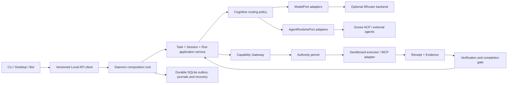

# Local development audit — 2026-09-27

**Status:** source-backed audit of an uncommitted local tree. **HEAD:** `205468e32c19395c3d907d898da3845aabfa9d82` on `dev`, 0 ahead/0 behind `origin/dev`. This report does not certify a releasable commit.

## Executive decision

Custos has a valuable kernel and many capable imported components, but it is not yet an integrated Proof-Carrying Agent OS. The repository is currently a large local migration plus several independently tested libraries. The safest next action is to freeze feature expansion, establish a reviewable PR-00 baseline, and wire one real daemon-owned vertical slice. Building more gateway, UI, or cognitive features before that will deepen duplicate control planes.

| Area | Assessment | Decision |
|---|---|---|
| Product direction | Strong: Task-centric, local-first, evidence-gated work is differentiated. | Preserve. |
| Core Task persistence | Implemented and directly tested. | Use as the first vertical-slice backbone. |
| Production composition | Incomplete; daemon, CLI, UI, security, workflow and model execution do not form one authoritative path. | Block feature claims until process-level E2E exists. |
| Gateway/hub | New `custos-gateway` is a mock second orchestrator, not 9Router or Agentgateway integration. | Do not connect clients to it; replace with explicit ports/adapters. |
| Repository baseline | Not shareable: most of the rebuilt tree is untracked. | Make PR-00 the immediate priority. |
| CI readiness | Red: formatting and strict Clippy fail. | Repair before baseline PR review. |

## Measured snapshot

- Git: 49 tracked files modified, 162 deleted, 2,398 untracked; 2,609 status entries. The tracked diff alone is 211 files, 9,115 insertions and 12,003 deletions.
- Cargo: 42 workspace packages and five additional package manifests outside the workspace.
- Nexus: Custos index contains 2,260 files, 10,104 Rust/Python AST symbols and 69,484 syntactic call edges. These are discovery metrics, not proof of runtime reachability.
- Naming scan: the boundary script passes, while reporting 574 Goose-named compatibility/debt files. Passing means “classified/allowed,” not “migration complete.”
- Test inventory: `cargo test --workspace --offline -- --list` listed 1,219 tests.

## Verification results

| Gate | Result | Interpretation |
|---|---|---|
| `cargo metadata --offline --no-deps` | Pass | Root workspace resolves 42 packages. |
| `bash scripts/check_deps.sh` | Pass with seven declared transitional edges | Hard dependency rules work, but architecture debt remains explicitly allowed. |
| `bash scripts/check_naming.sh` | Pass with 574 debt files | No unclassified naming violation according to the current allowlist. |
| `cargo check --workspace --offline` | Pass with 8 deprecation warnings | Workspace compiles; this does not prove runtime composition. |
| `cargo fmt --all -- --check` | **Fail** | Many rebuilt Rust files are not formatted. |
| `cargo clippy --workspace --all-targets --offline -- -D warnings` | **Fail** | Eight deprecated `rmcp::ServerInfo` uses and one Rust 1.80 MSRV violation (`is_none_or`, stabilized in 1.82). |
| Contract tests | Pass, 2 tests | Fake-provider conformance and canonical JSON presence only. |
| E2E package | Pass, 2 tests | In-process assembly with SQLite/fake provider; no daemon process, local IPC, UI, approval, sandbox, or real provider. |
| Workspace test execution | Partial environmental result | 610 tests passed before one loopback-bind test was denied by the sandbox; that exact test passed outside the sandbox. A complete unrestricted workspace run was not available. |
| UI/services | Not executed | No `node_modules` exists for UI, bot, or OIDC proxy; current Rust CI does not test these products. |

## Blocking findings

### P0 — No reproducible team baseline

`dev` equals `origin/dev`, but the rebuilt implementation exists mostly as untracked files while the old layout appears as tracked deletions. A teammate cloning `dev` receives materially different source. No architectural claim can be pinned to the current tree, and CI will not see untracked files until they are committed through a reviewed feature branch.

### P0 — The daemon is not the composition root promised by the architecture

`custos-daemon/src/runtime.rs` constructs SQLite Task storage, an in-memory `SessionManager`, `BridgeService`, and a daemon-local JSON dispatcher. Although its manifest depends on security, workflow, cognitive, and MCP packages, the production request path does not compose their authority/evidence/workflow/model behavior. `custos-cli` separately opens SQLite and constructs `TaskService`, violating the documented thin-client and single-writer direction.

The two “E2E” tests also construct services directly in the test process. They validate useful library behavior and restartable Task rows, but they cannot detect daemon protocol drift, client bypasses, supervisor failure, cancellation, approval, or real effect behavior.

### P0 — Task success can bypass proof closure

The daemon exposes caller-selected `v1.tasks.advance`. The state machine accepts `Running -> Succeeded`, while evidence/completion gates are not in that path. A client can therefore declare success without verified required criteria. The CompletionGate only checks that a Task is Running; `DeterministicGate` fabricates an execution JSON result and digest instead of executing and reconciling a real effect.

### P0 — `custos-gateway` is a misleading duplicate control plane

The new 42nd package calls itself an “AgentGateway & 9Router Control Plane,” but no 9Router or Agentgateway client, protocol, binary, or deployment is present. Its local, external, and A2A dispatchers return formatted mock strings. Token use is `min(reserved, 256)`, cost is half a configured ceiling, and budget/quota state is process-local memory.

Nexus finds `route_and_execute` called only by the gateway's own test. It duplicates `custos-cognitive::CognitivePipeline`: the cognitive pipeline can call a provider registry, while the gateway reuses the same `RoutingPolicy` and routes to mocks. This creates two orchestration authorities. `RouteDecision` also combines model choice, budget, context pack, tool permissions, A2A target and fallback; `SystemTwo` receives `tool_set = ["all"]`. That is excessive coupling and an unsafe authorization abstraction.

### P0 — Documentation has competing sources of truth

`docs/README.md`, `docs/document-register.md`, and `AGENTS.md` designate `reference-architecture.md` as the target authority. Root `ARCHITECTURE.md` now promotes `CUSTOS_HYBRID_MASTER_ARCHITECTURE_2026.md` as “Canonical Master Architecture,” but that file is absent from the document register, uses a second crate count/model, asserts unverified durability/security behavior, and violates the technical-English rule for current docs. `AGENTS.md` itself lists a `Ready/Verifying/Paused` Task lifecycle that differs from the implemented and hybrid-document `Queued/Blocked/Cancelled` lifecycle.

## High-priority structural findings

- Sessions are RAM-backed (`RwLock<HashMap>`). A persistence repository exists but is not injected into `SessionManager`; daemon restart loses active Session/journal state while Task rows survive.
- `custos-local-api` and daemon-local request/response DTOs are parallel contracts. The daemon does not use the nominal API package.
- Workflow has types/tests, but its dispatcher is empty and the daemon does not execute workflows.
- Evidence verification and permit/grant stores exist as libraries, but the daemon does not mediate production effects through them; permit/grant state is in memory. Nexus finds `verify_bundle` callers only in security tests and the in-process E2E test.
- `GatewayTool` blocks only the literal name `raw_shell_exec` before delegating. It is not a general permit, path, network, sandbox, or receipt boundary.
- `custos-context/src/compiler.rs` duplicates `src/compiler/compiler.rs`; `compaction/` and `memory/` trees are not exported by the crate root. This is copied/dead-source ambiguity.
- Five manifests remain outside workspace verification: `custos-sdk`, `custos-engine`, `custos-acp-macros`, `custos-test`, and `custos-test-support`.
- Docs still report 41 workspace members and older Nexus/naming counts. The new gateway made those current-status pages stale.
- `.github/workflows/ci.yml` duplicates `rust.yml` under the same display name, repeats build/test work, and uses cargo-deny action v1 while `security.yml` uses v2. CI ownership is ambiguous.
- The TypeScript bot directly creates an Anthropic client. It is an adjacent standalone product, not a Custos-governed client path. VS Code contains only a package manifest/readme promise; Desktop remains a Goose-derived ACP application and does not call the Custos Task API.
- Nexus is useful for discovery, but its call graph is syntactic and its AST support is Rust/Python. It must not be used alone to claim TypeScript reachability, dynamic dispatch, trait resolution, or production wiring.

## What is already worth keeping

- Task state, optimistic epochs, SQLite persistence, spans, continuation hashes, artifact addressing, provider ports, evidence verifiers, context scanning, and many provider/agent components compile and have substantial unit coverage.
- Dependency and naming guard scripts establish useful machine-enforced boundaries.
- The target documents correctly distinguish ModelPort, AgentRuntimePort, MCP capability transport, and authority/effect control. That separation should govern the implementation.
- The in-process vertical-slice test is a good component acceptance fixture; it should become the inner layer of a real process-level test.

## Required end-state flow

9Router belongs behind `ModelPort` as an optional provider/account-routing adapter. Agentgateway belongs at the connectivity edge for network identity, routing, MCP/A2A policy, and telemetry. Goose or another coding agent belongs behind `AgentRuntimePort`. MCP carries capabilities; it does not own Task lifecycle. The Capability Gateway owns effect authorization and receipts. These must remain distinct even if one deployable bundles several adapters.

## Three-person stabilization sequence

1. **PR-00 — Reproducible baseline:** create a scoped feature branch; classify every deletion/untracked tree; remove duplicate CI; make fmt, Clippy, dependency, naming, contract, Rust workspace, and selected non-Rust checks green. Regenerate package/Nexus/naming inventories. No feature work in this PR.
2. **PR-01 — Contract lock:** accept one Task lifecycle, one Local API DTO package, and the Session–Task–Run–ActionAttempt–Receipt–Evidence identities. Resolve the competing master document and record ADR acceptance.
3. **PR-02 — Real daemon slice:** CLI calls daemon; daemon alone writes Task state; process-level test launches daemon, sends create/run/query, restarts it, and verifies recovery. Remove the direct CLI database path.
4. **PR-03 — Durable Session/Run:** inject repositories, persist journals/checkpoints/leases, and test crash/cancel/resume. Keep conversational Session independent while Tasks continue.
5. **PR-04 — Controlled effects and proof closure:** one read-only repo tool first, then patch preview; require intent, permit, sandbox, receipt, evidence and completion gate. Prove denied and uncertain outcomes.
6. **PR-05 — Intelligence adapters:** make `custos-cognitive` policy-only; add typed ModelPort/AgentRuntimePort adapters. Validate direct provider first, then 9Router and Agentgateway in separate opt-in conformance spikes. Delete or reduce the mock omnibus gateway.
7. **PR-06 — Clients and packs:** connect Desktop/VS Code/bot only through the versioned API/protocol; promote Engineering and Research flows only after process E2E and eval thresholds pass.

## Go/no-go rule

Do not start broad 9Router/Agentgateway integration or UI feature expansion until PR-00 through PR-02 are green. The project is ready for parallel feature development only when a clean checkout reproduces CI and exactly one authoritative request path reaches durable Task state through the daemon.
